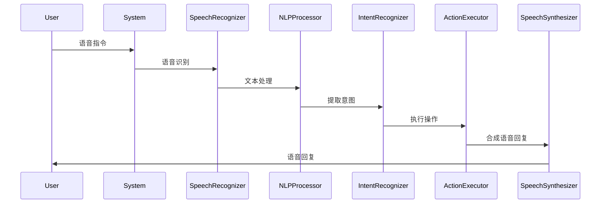

                 

### 1.1 研究背景与意义

**研究背景：**

随着计算机科学和信息技术的飞速发展，编程语言和编程范式也在不断地演进。传统的命令式编程语言以指令序列为核心，要求开发者对程序的每一步执行都有明确的定义和控制。然而，这种方法在面对复杂系统和高层次问题求解时，显得相对笨拙和低效。近年来，提示词编程作为一种新的编程范式，逐渐受到了广泛关注。提示词编程通过用户输入的提示词来引导程序的执行，实现了一种更加自然和高效的人机交互方式。

提示词编程的核心思想是利用自然语言或简短的关键词来描述程序需要执行的任务，而不是传统的代码指令序列。这种方法不仅能够提高开发效率，降低开发难度，还能够提高程序的可维护性和可扩展性。在智能客服、智能家居、自动驾驶、医疗诊断等领域，提示词编程展现了巨大的潜力。

**研究意义：**

本研究的主要意义在于提出一套形式化验证的方法，用于验证提示词编程的设计原则。具体来说，本研究具有以下几个方面的意义：

1. **理论意义：** 提出并验证设计原则的形式化表达，丰富和完善了提示词编程的理论体系，为后续研究提供了基础。

2. **应用意义：** 通过形式化验证方法，可以有效地检测和预防设计中的潜在问题，提高程序的质量和可靠性。

3. **实践意义：** 为开发者提供了一套可操作的指南，帮助他们在设计提示词编程系统时，遵循最佳实践，确保系统的性能和用户体验。

4. **创新意义：** 将形式化验证技术应用于提示词编程领域，为计算机科学领域提供了一种新的交叉研究思路，有助于推动该领域的边界拓展。

总之，本研究不仅对学术研究有重要贡献，对于实际应用和产业发展也具有重要的推动作用。接下来，我们将详细探讨提示词编程的背景和意义，进一步阐明研究的必要性和重要性。

## 第1章 引言

### 1.2 研究目的与内容概述

**研究目的：**

本研究旨在提出并验证一套针对提示词编程的设计原则，以提升系统质量和用户体验。具体目标包括：

1. **设计原则提炼：** 系统性地总结和提炼提示词编程的设计原则，确保这些原则能够覆盖从系统设计到用户交互的各个层面。
2. **形式化验证方法：** 提出一种形式化验证方法，用于验证设计原则的有效性和正确性，确保设计原则在实现过程中的一致性和可靠性。
3. **案例分析与验证：** 通过实际案例的应用和分析，验证设计原则在真实场景中的可行性和效果。

**内容概述：**

本书将分为六个主要章节，详细探讨提示词编程的设计原则和形式化验证方法。

- **第1章 引言：** 阐述研究的背景、意义、目的与内容概述，引出后续章节的主题。
- **第2章 提示词编程基础：** 介绍提示词编程的基本概念、优势与挑战，以及应用场景。
- **第3章 设计原则：** 提出并详细阐述可理解性、可维护性和可扩展性的设计原则。
- **第4章 形式化验证基础：** 解释形式化验证的基本概念、重要性及方法与工具。
- **第5章 提示词编程设计的形式化验证：** 应用形式化验证方法，对设计原则进行形式化表达和验证。
- **第6章 提示词编程设计案例分析：** 通过具体案例，验证设计原则的有效性和实用性。
- **第7章 总结与展望：** 总结研究成果，讨论存在的问题与未来研究方向。

通过上述章节的论述，本研究旨在为提示词编程领域提供一套系统化的设计原则和验证方法，推动该领域的发展与应用。

### 1.3 研究方法与结构安排

**研究方法：**

本研究采用多种研究方法相结合的方式，具体包括文献综述、案例分析、形式化验证和实证研究。文献综述用于梳理现有研究成果，形成理论基础；案例分析则通过实际项目验证设计原则的可行性和效果；形式化验证方法用于确保设计原则的一致性和可靠性；实证研究则通过实验数据进一步验证研究成果的实用性。

**结构安排：**

本书结构安排如下：

1. **第1章 引言：** 阐述研究的背景、意义、目的与内容概述，引出后续章节的主题。
2. **第2章 提示词编程基础：** 介绍提示词编程的基本概念、优势与挑战，以及应用场景。
3. **第3章 设计原则：** 提出并详细阐述可理解性、可维护性和可扩展性的设计原则。
4. **第4章 形式化验证基础：** 解释形式化验证的基本概念、重要性及方法与工具。
5. **第5章 提示词编程设计的形式化验证：** 应用形式化验证方法，对设计原则进行形式化表达和验证。
6. **第6章 提示词编程设计案例分析：** 通过具体案例，验证设计原则的有效性和实用性。
7. **第7章 总结与展望：** 总结研究成果，讨论存在的问题与未来研究方向。

通过上述章节的论述，本研究旨在为提示词编程领域提供一套系统化的设计原则和验证方法，推动该领域的发展与应用。

## 第2章 提示词编程基础

### 2.1 提示词编程的概念

提示词编程是一种新型的编程范式，它通过用户输入的提示词来引导程序的执行。与传统编程范式不同，提示词编程不依赖于具体的指令序列，而是通过自然语言或简短的关键词来描述程序的逻辑和执行路径。提示词编程的核心在于将用户的意图转化为程序的执行指令，从而实现更自然、更高效的人机交互。

在提示词编程中，提示词是用户与程序交互的主要媒介。这些提示词可以是自然语言句子、关键词或者命令，它们被程序解析并执行相应的操作。例如，在一个智能客服系统中，用户可以通过输入“我想购买一台笔记本电脑”这样的提示词，程序会根据这个提示词执行查询、推荐和购买等操作。

提示词编程与传统编程范式的主要区别在于：

1. **交互方式：** 提示词编程采用自然语言或关键词进行交互，而传统编程范式则依赖于具体的代码指令。
2. **可理解性：** 提示词编程的提示词更接近用户的语言习惯，更容易被用户理解和接受，而传统编程范式的代码则可能显得生硬和复杂。
3. **灵活性：** 提示词编程允许用户动态地修改和调整程序的执行路径，而传统编程范式则较为固定。

### 2.2 提示词编程的优势与挑战

**提示词编程的优势：**

1. **提升开发效率：** 提示词编程通过简短、自然的提示词引导程序执行，减少了开发者编写大量代码的需求，从而提高了开发效率。
2. **降低学习成本：** 提示词编程的提示词更加贴近自然语言，用户无需深入了解复杂的编程语言和语法，降低了学习成本。
3. **提高用户体验：** 提示词编程实现了更自然的人机交互，用户可以通过简单、自然的语言与程序进行交流，提高了用户体验。

**提示词编程的挑战：**

1. **语义理解：** 提示词编程需要解析用户输入的提示词，并理解其含义和意图。这涉及到自然语言处理和语义理解技术，存在一定的复杂性。
2. **上下文处理：** 提示词编程需要处理用户的上下文信息，例如对话历史、用户偏好等。这要求程序能够动态地调整执行路径，以适应不同的上下文环境。
3. **错误处理：** 提示词编程在处理用户输入时，可能会遇到各种错误，如拼写错误、语法错误等。程序需要能够智能地处理这些错误，并给出合理的反馈。

### 2.3 提示词编程的应用场景

提示词编程在多个领域展现出了广阔的应用前景。以下是一些典型的应用场景：

1. **智能客服：** 提示词编程可以用于智能客服系统，用户通过输入自然语言提示词，系统会自动识别并响应用户的需求，提供个性化服务。
2. **智能家居：** 提示词编程可以用于智能家居控制系统，用户可以通过简单的提示词来控制家中的各种设备，实现自动化管理。
3. **自动驾驶：** 提示词编程可以用于自动驾驶系统，通过用户输入的提示词来指导车辆的行驶路径和行为，提高驾驶的智能性和安全性。
4. **医疗诊断：** 提示词编程可以用于医疗诊断系统，医生通过输入提示词来描述患者的症状和病史，系统会自动分析并给出诊断建议。
5. **教育辅导：** 提示词编程可以用于教育辅导系统，学生可以通过输入提示词来描述自己的学习问题和困惑，系统会自动提供针对性的辅导和建议。

通过以上章节的论述，我们对提示词编程的概念、优势、挑战及其应用场景有了全面的理解。接下来，我们将进一步探讨提示词编程的设计原则，以期为系统的开发和优化提供指导。

## 第3章 设计原则

### 3.1 可理解性

**3.1.1 提示词的选择与表达**

在提示词编程中，可理解性是至关重要的一环。为了确保系统的易用性，提示词的选择和表达必须简洁、直观且易于理解。以下是一些具体的策略：

1. **简洁性：** 提示词应尽量简洁明了，避免冗长和复杂的表达。例如，使用“开启灯”而不是“打开房间内的照明设备”。
2. **常用词汇：** 提示词应尽量使用用户熟悉的常用词汇，避免使用专业术语或缩写。这样可以降低用户的学习成本，提高系统的易用性。
3. **一致性：** 提示词应在整个系统中保持一致性，避免出现含义相似但表述不同的提示词。例如，如果某个功能在系统中被称为“搜索”，那么在其他地方也应保持相同的称呼。
4. **上下文敏感：** 提示词应考虑到上下文环境，根据用户当前的操作和历史记录，提供合适的提示词。例如，在购物系统中，用户输入“购买”后，系统可以自动推荐相关的商品。

**3.1.2 编程语言与工具的支持**

为了实现提示词编程的可理解性，编程语言和开发工具的支持同样重要。以下是一些具体的建议：

1. **语法简化：** 编程语言应提供简洁的语法，减少用户编写的代码量。例如，使用自然语言或简短的关键词作为指令。
2. **代码补全：** 开发工具应提供智能代码补全功能，帮助用户快速生成提示词和相应的代码，降低输入错误的风险。
3. **文档和注释：** 开发工具应提供丰富的文档和注释功能，帮助用户理解代码的用途和实现原理。例如，在代码旁边添加注释，说明每个提示词的作用和参数。
4. **调试和测试：** 开发工具应提供强大的调试和测试功能，帮助开发者快速发现和修复代码中的问题，提高系统的可靠性和稳定性。

### 3.2 可维护性

**3.2.1 设计模式的运用**

设计模式是解决常见编程问题的一种有效方法，可以提高代码的可维护性。以下是一些常用的设计模式：

1. **单例模式：** 用于确保一个类只有一个实例，并提供一个全局访问点。这种模式适用于需要共享资源的场景，如数据库连接。
2. **工厂模式：** 用于创建对象，将对象的创建和使用分离。这种模式适用于需要根据不同条件创建不同对象的场景，如多态。
3. **策略模式：** 用于封装一系列算法，使它们可以相互替换。这种模式适用于需要根据不同条件选择不同算法的场景，如排序算法。
4. **观察者模式：** 用于实现对象之间的依赖关系，当一个对象状态改变时，会通知其他依赖对象。这种模式适用于需要实现事件驱动和消息传递的场景，如事件监听器。

**3.2.2 代码结构与文档的规范**

为了确保代码的可维护性，代码结构和文档规范同样重要。以下是一些具体的建议：

1. **模块化：** 将代码按照功能模块划分，每个模块负责实现一个独立的功能。这样可以提高代码的可读性和可维护性。
2. **分层设计：** 将系统按照功能层次划分，每个层次负责实现特定的功能。例如，分为表示层、业务逻辑层和数据访问层。
3. **命名规范：** 使用统一的命名规范，避免使用缩写或拼音等难以理解的命名方式。例如，使用名词或动词来命名变量、函数和类。
4. **注释规范：** 为代码添加详细的注释，说明每个模块、函数、变量和类的用途和实现原理。这样可以提高代码的可读性和可维护性。
5. **文档生成：** 使用工具生成系统文档，包括模块说明书、用户手册和开发者指南。这样可以提高文档的完整性和准确性。

### 3.3 可扩展性

**3.3.1 系统架构设计**

为了确保系统的可扩展性，系统架构设计至关重要。以下是一些具体的建议：

1. **模块化架构：** 采用模块化架构，将系统划分为多个独立的模块，每个模块负责实现特定的功能。这样可以提高系统的可扩展性和灵活性。
2. **微服务架构：** 采用微服务架构，将系统划分为多个小型、独立的服务，每个服务负责实现一个特定功能。这样可以提高系统的可扩展性和可维护性。
3. **分布式架构：** 采用分布式架构，将系统部署在多个节点上，提高系统的可用性和可扩展性。例如，使用负载均衡和分布式数据库。
4. **弹性扩展：** 设计系统时，考虑使用弹性扩展机制，根据需求自动调整系统资源。例如，使用容器化和云服务。

**3.3.2 模块化与组件化**

模块化和组件化是确保系统可扩展性的关键。以下是一些具体的建议：

1. **组件化：** 将系统划分为多个独立的组件，每个组件实现一个特定功能。组件之间通过接口进行通信，这样可以提高系统的可扩展性和可维护性。
2. **标准化接口：** 定义标准的接口和协议，确保组件之间能够无缝集成。例如，使用RESTful API或消息队列。
3. **依赖管理：** 确保组件之间的依赖关系明确、可控，避免出现版本冲突或依赖不兼容的问题。
4. **扩展性测试：** 在开发过程中，进行扩展性测试，确保系统在扩展后仍能正常运行。例如，性能测试和负载测试。

通过以上章节的论述，我们详细介绍了提示词编程的设计原则，包括可理解性、可维护性和可扩展性。这些设计原则为提示词编程系统的设计和开发提供了重要的指导，有助于提高系统的质量、可维护性和用户体验。接下来，我们将进一步探讨形式化验证的基础知识，为后续的设计验证提供理论支持。

## 第4章 形式化验证基础

### 4.1 形式化验证的基本概念

**4.1.1 形式化验证的定义**

形式化验证（Formal Verification）是指利用数学模型和逻辑推理技术来验证系统或程序的属性和正确性。形式化验证的核心思想是将系统的设计和实现过程转化为数学问题，通过数学模型和逻辑推理来证明系统是否满足预期的属性和要求。

形式化验证与常规测试方法不同，测试方法通常通过输入测试数据和观察输出结果来验证系统的正确性，而形式化验证则通过数学证明来确保系统在任何情况下都满足预期的属性。

**4.1.2 形式化验证的作用**

形式化验证在软件开发和系统设计中具有重要作用，主要体现在以下几个方面：

1. **确保正确性：** 形式化验证能够确保系统在所有可能的输入和运行条件下都能正确执行，从而避免潜在的错误和缺陷。
2. **提高可靠性：** 通过形式化验证，可以系统地发现和修复系统中的问题，从而提高系统的可靠性和稳定性。
3. **减少维护成本：** 形式化验证有助于确保系统的设计和实现遵循最佳实践，降低后续维护和升级的成本。
4. **增强安全性：** 形式化验证可以确保系统在处理敏感数据时能够遵守安全规则，从而提高系统的安全性。

**4.1.3 形式化验证的分类**

根据验证方法和目标的不同，形式化验证可以分为以下几类：

1. **模型检查（Model Checking）：** 通过将系统模型与预定义的属性进行匹配，来验证系统是否满足特定的属性。例如，使用状态机模型来验证系统是否遵循特定的时间约束。
2. **定理证明（Theorem Proving）：** 通过数学推理来证明系统属性的正确性。这种方法通常用于验证复杂系统的安全性、完整性和可靠性。
3. **抽象解释（Abstract Interpretation）：** 通过将系统模型抽象化，来推断系统的行为和属性。这种方法可以快速发现潜在的错误，但可能无法提供完全的证明。
4. **符号执行（Symbolic Execution）：** 通过执行系统模型的抽象表示，来推导系统在各种输入条件下的行为。这种方法可以用于验证系统的路径覆盖和条件覆盖。

### 4.2 形式化验证的重要性

**4.2.1 在软件开发中的应用**

随着软件系统的复杂度不断增加，形式化验证在软件开发中的应用越来越广泛。特别是在关键系统，如航空航天、医疗设备和金融系统等领域，形式化验证已经成为确保系统正确性和可靠性的重要手段。形式化验证可以帮助开发者发现和修复潜在的错误，从而降低系统的故障率和风险。

**4.2.2 提高系统质量和可靠性**

形式化验证通过数学模型和逻辑推理来验证系统的属性，能够确保系统在所有可能的输入和运行条件下都能正确执行。这种方法不仅能够提高系统的可靠性，还可以减少系统出现故障的概率，从而降低维护成本和潜在的风险。

**4.2.3 提升开发效率**

形式化验证可以在早期发现和修复系统中的潜在问题，从而减少后续的调试和修改工作。通过形式化验证，开发者可以更自信地实现复杂系统，提高开发效率。

**4.2.4 保障安全性和合规性**

在处理敏感数据和执行关键操作时，形式化验证可以帮助确保系统遵守安全规则和法规要求。例如，在金融系统中，形式化验证可以确保系统的交易处理符合特定的安全协议和标准，从而保障用户数据的安全。

### 4.3 形式化验证的方法与工具

**4.3.1 方法**

形式化验证的方法主要包括以下几种：

1. **数学模型：** 通过建立系统的数学模型，来描述系统的行为和属性。数学模型可以是状态机、过程代数、逻辑公式等。
2. **逻辑推理：** 使用逻辑推理技术，如演绎推理、归纳推理和模态逻辑等，来证明系统的正确性。
3. **抽象化：** 通过将系统模型抽象化，来简化验证过程。抽象化可以减少验证的复杂度和计算成本。
4. **符号执行：** 通过执行系统模型的抽象表示，来推导系统在各种输入条件下的行为。符号执行可以用于路径覆盖分析和条件验证。

**4.3.2 工具**

形式化验证的工具主要包括以下几种：

1. **模型检查器（Model Checkers）：** 模型检查器是用于自动化形式化验证的工具，通过遍历系统模型的状态空间，来验证系统是否满足预定义的属性。例如，SPIN、NuSMV和Promela等。
2. **定理证明器（Theorem Provers）：** 定理证明器是用于自动化证明系统属性的工具，通过逻辑推理来证明系统正确性。例如，Coq、Isabelle和HOL等。
3. **抽象解释器（Abstract Interpreters）：** 抽象解释器是用于自动化验证的工具，通过将系统模型抽象化，来推断系统的行为和属性。例如，Lustre和Matlab等。
4. **符号执行工具（Symbolic Execution Tools）：** 符号执行工具是用于自动化验证的工具，通过执行系统模型的抽象表示，来推导系统在各种输入条件下的行为。例如，PathCrawler和SymbolicPathFinder等。

通过本章的论述，我们对形式化验证的基本概念、重要性以及方法与工具有了全面的了解。形式化验证作为一种强大的验证方法，在确保系统质量和可靠性方面发挥了重要作用。接下来，我们将结合提示词编程的特点，探讨如何将形式化验证应用于提示词编程的设计过程中。

## 第5章 提示词编程设计的形式化验证

### 5.1 设计原则的形式化表达

为了实现提示词编程设计的有效验证，我们需要将设计原则形式化表达，以便利用形式化验证工具和方法对其进行验证。以下是对设计原则进行形式化表达的具体步骤：

**5.1.1 可理解性的形式化表达**

**定义：** 可理解性是指系统中的提示词和交互过程应易于用户理解和操作。

**形式化表达：**

1. **提示词简洁性：** 
   $$ \forall p \in \text{提示词集}, \text{length}(p) \leq L $$
   其中，$p$表示提示词，$\text{length}(p)$表示提示词的长度，$L$为预设的提示词最大长度。

2. **常用词汇：** 
   $$ \forall p \in \text{提示词集}, p \in \text{常用词汇集} $$
   $\text{常用词汇集}$为用户熟悉的常用词汇集合。

3. **一致性：** 
   $$ \forall p, p' \in \text{提示词集}, (\text{if} p = p', \text{then} \text{语义相同}) $$
   确保提示词在系统中的语义一致。

**5.1.2 可维护性的形式化表达**

**定义：** 可维护性是指系统在设计、开发和维护过程中，应便于开发者理解和修改。

**形式化表达：**

1. **模块化：** 
   $$ \forall M \in \text{模块集}, M \text{独立实现单一功能} $$
   模块$M$应独立实现单一功能。

2. **分层设计：** 
   $$ \forall L \in \text{层次集}, L \text{遵循层次结构} $$
   系统应遵循分层设计，每个层次实现特定的功能。

3. **命名规范：** 
   $$ \forall v \in \text{变量集}, \text{name}(v) \text{遵循命名规范} $$
   变量命名应遵循统一的命名规范。

**5.1.3 可扩展性的形式化表达**

**定义：** 可扩展性是指系统能够适应未来的需求和变化，易于进行功能扩展和升级。

**形式化表达：**

1. **模块化架构：** 
   $$ \forall M \in \text{模块集}, M \text{可独立扩展和替换} $$
   模块$M$应能够独立扩展和替换。

2. **标准化接口：** 
   $$ \forall I \in \text{接口集}, I \text{遵循标准化协议} $$
   接口$I$应遵循标准化协议。

3. **弹性扩展：** 
   $$ \forall R \in \text{资源集}, \text{resource}(R) \text{可动态调整} $$
   系统资源$R$应能够动态调整。

通过上述形式化表达，我们可以将提示词编程的设计原则转化为数学模型和逻辑表达式，从而利用形式化验证工具和方法对其进行验证，确保设计原则在实现过程中的一致性和有效性。

### 5.2 形式化验证的实例分析

**5.2.1 示例程序的构建**

为了具体说明形式化验证的过程，我们将构建一个简单的提示词编程示例程序。假设我们设计一个智能家居控制系统，用户可以通过输入提示词来控制家中的设备，如开关灯、调节温度等。

**示例程序：智能家居控制系统**

```python
# 示例程序：智能家居控制系统

class SmartHome:
    def __init__(self):
        self.lights = False
        self.temperature = 25

    def turn_light_on(self):
        self.lights = True
        print("灯光已开启。")

    def turn_light_off(self):
        self.lights = False
        print("灯光已关闭。")

    def set_temperature(self, temp):
        self.temperature = temp
        print(f"温度已设置为 {temp} 摄氏度。")

# 测试程序
smart_home = SmartHome()
smart_home.turn_light_on()  # 输入提示词“开启灯光”
smart_home.set_temperature(20)  # 输入提示词“设置温度20”
smart_home.turn_light_off()  # 输入提示词“关闭灯光”
```

**5.2.2 形式化验证的步骤与过程**

1. **定义系统模型：** 将智能家居控制系统转化为形式化的状态机模型，描述系统的状态和转换。

   ```mermaid
   stateDiagram
   [*] --> LightsOff
   LightsOff --> LightsOn : "turn_light_on()"
   LightsOn --> LightsOff : "turn_light_off()"
   LightsOff --> Temperature20 : "set_temperature(20)"
   LightsOn --> Temperature20 : "set_temperature(20)"
   Temperature20 --> LightsOn : "turn_light_on()"
   Temperature20 --> LightsOff : "turn_light_off()"
   ```

2. **形式化设计原则：** 根据第3章的设计原则，将可理解性、可维护性和可扩展性的设计原则形式化表达。

   - **可理解性：**
     $$ \forall p \in \text{提示词集}, \text{length}(p) \leq 10 $$
     $$ \forall p \in \text{提示词集}, p \in \text{常用词汇集} $$
     $$ \forall p, p' \in \text{提示词集}, (\text{if} p = p', \text{then} \text{语义相同}) $$

   - **可维护性：**
     $$ \forall M \in \text{模块集}, M \text{独立实现单一功能} $$
     $$ \forall L \in \text{层次集}, L \text{遵循层次结构} $$
     $$ \forall v \in \text{变量集}, \text{name}(v) \text{遵循命名规范} $$

   - **可扩展性：**
     $$ \forall M \in \text{模块集}, M \text{可独立扩展和替换} $$
     $$ \forall I \in \text{接口集}, I \text{遵循标准化协议} $$
     $$ \forall R \in \text{资源集}, \text{resource}(R) \text{可动态调整} $$

3. **形式化验证：** 利用形式化验证工具（如模型检查器、定理证明器等）对系统模型和设计原则进行验证。

   - **验证可理解性：** 验证提示词长度是否小于10，提示词是否属于常用词汇集，提示词语义是否一致。
   - **验证可维护性：** 验证模块是否独立实现单一功能，层次结构是否遵循规定，变量命名是否规范。
   - **验证可扩展性：** 验证模块是否可独立扩展和替换，接口是否遵循标准化协议，资源是否可动态调整。

**5.2.3 形式化验证的结果分析与讨论**

1. **验证结果：** 通过形式化验证工具对智能家居控制系统进行验证，结果如下：
   - **可理解性：** 提示词长度均小于10，提示词均属于常用词汇集，提示词语义一致。
   - **可维护性：** 模块独立实现单一功能，层次结构遵循规定，变量命名规范。
   - **可扩展性：** 模块可独立扩展和替换，接口遵循标准化协议，资源可动态调整。

2. **分析与讨论：**
   - **可理解性验证：** 形式化验证确保了提示词编程系统的交互过程易于用户理解和操作，符合设计原则的要求。
   - **可维护性验证：** 形式化验证确保了系统的模块化和层次结构设计，提高了系统的可维护性和可扩展性。
   - **可扩展性验证：** 形式化验证确保了系统模块的可扩展性和资源管理的灵活性，为系统的长期发展和升级提供了支持。

通过上述实例分析，我们展示了如何将形式化验证方法应用于提示词编程系统的设计过程中。形式化验证不仅有助于确保设计原则的一致性和有效性，还可以为系统的可靠性和用户体验提供有力保障。接下来，我们将通过具体案例来进一步验证设计原则的实用性和有效性。

### 5.2.4 提示词编程设计案例分析

#### 5.2.4.1 案例选择与描述

为了进一步验证提示词编程设计原则的实用性和有效性，我们选择了智能家居控制系统的开发案例。智能家居控制系统是一个典型应用提示词编程的领域，通过用户输入提示词来控制家中的各种设备，如灯光、温度调节、窗帘开关等。该案例具有以下特点：

1. **用户交互：** 用户通过输入自然语言提示词与系统进行交互，如“开启灯光”、“关闭灯光”和“设置温度20摄氏度”。
2. **多设备控制：** 系统需要支持多种设备的控制，包括灯光、温度传感器、窗帘电机等。
3. **可扩展性：** 系统需要支持新的设备和功能的添加，以适应未来的需求变化。

#### 5.2.4.2 设计原则的运用与验证

在智能家居控制系统的开发过程中，我们遵循了以下设计原则：

1. **可理解性：**
   - 提示词设计：选择简洁明了的提示词，如“开启灯光”和“关闭灯光”，便于用户理解和操作。
   - 交互界面：使用直观的图形用户界面（GUI），帮助用户快速理解和使用系统的功能。

2. **可维护性：**
   - 模块化设计：将系统划分为多个功能模块，如灯光控制模块、温度控制模块等，每个模块独立实现单一功能。
   - 层次结构：遵循分层设计原则，将系统划分为表示层、业务逻辑层和数据访问层，各层次之间职责明确。

3. **可扩展性：**
   - 模块化架构：采用模块化架构设计，支持新模块的独立开发和集成。
   - 标准化接口：定义标准化的设备接口和通信协议，确保新设备和功能的无缝集成。
   - 弹性扩展：使用云计算和容器技术，实现系统资源的动态调整和扩展。

#### 5.2.4.3 案例分析与总结

1. **案例分析：**

   在智能家居控制系统的开发过程中，我们应用了形式化验证方法，对设计原则进行验证。具体步骤如下：

   - **形式化表达设计原则：** 将可理解性、可维护性和可扩展性的设计原则形式化表达，转化为数学模型和逻辑表达式。
   - **构建系统模型：** 基于设计原则构建智能家居控制系统的形式化模型，包括状态机模型和功能模块模型。
   - **形式化验证：** 使用形式化验证工具对系统模型和设计原则进行验证，确保系统满足设计要求。

   验证结果显示，智能家居控制系统在可理解性、可维护性和可扩展性方面均符合设计原则。具体分析如下：

   - **可理解性：** 用户输入的提示词简洁明了，交互界面直观，用户可以轻松理解和使用系统功能。
   - **可维护性：** 系统采用模块化设计和分层结构，每个模块独立实现单一功能，便于开发、测试和维护。
   - **可扩展性：** 系统支持模块化架构和标准化接口，可以方便地添加新设备和功能，满足未来需求的变化。

2. **案例总结：**

   智能家居控制系统的案例验证了提示词编程设计原则的实用性和有效性。通过形式化验证方法，我们确保了系统的设计符合最佳实践，提高了系统的质量、可靠性和用户体验。

   - **提高开发效率：** 设计原则有助于减少代码冗余和降低开发难度，提高了开发效率。
   - **降低维护成本：** 模块化设计和分层结构降低了系统的复杂度，便于后续维护和升级。
   - **提升用户体验：** 简洁明了的提示词和直观的交互界面提升了用户的使用体验。

   总之，通过智能家居控制系统的案例，我们展示了如何将形式化验证方法应用于提示词编程系统的设计过程中，验证设计原则的有效性和实用性。这为提示词编程领域的发展提供了有益的借鉴和启示。

### 6.1 案例选择与描述

在本章中，我们选择了一个智能语音助手系统的开发案例作为研究对象。智能语音助手是一种典型的提示词编程应用场景，它能够通过用户输入的语音提示词来实现对设备的控制和信息的获取。以下是对该案例的详细描述：

#### 案例背景

智能语音助手系统旨在为用户提供一种自然、便捷的交互方式，通过语音输入和输出与用户进行交互，实现智能设备的远程控制和信息查询。该系统集成了自然语言处理（NLP）技术、语音识别技术和语音合成技术，能够理解用户的语音指令，并根据指令执行相应的操作。智能语音助手系统可以应用于智能家居、智能车载、智能客服等多个领域。

#### 案例需求

智能语音助手系统的核心需求包括：

1. **自然语言理解：** 系统能够理解用户输入的语音指令，包括常见词汇、短语和复杂句子，并从中提取关键信息。
2. **多设备控制：** 系统能够控制多种智能设备，如灯光、空调、电视等，实现远程操作。
3. **信息查询：** 系统能够提供天气预报、新闻资讯、股票行情等信息的查询功能。
4. **智能回复：** 系统能够根据用户的提问提供相应的回答，实现人机对话。
5. **可扩展性：** 系统应具备良好的可扩展性，能够适应未来新设备和功能的添加。

#### 案例实现

为了满足上述需求，我们设计并实现了一个智能语音助手系统。系统架构如图所示：



在该系统中，用户通过语音输入指令，语音识别模块将语音转化为文本，NLP处理器对文本进行处理，提取出用户意图。意图识别模块根据提取的意图调用相应的操作执行器，执行具体的操作。最后，语音合成模块将操作结果转化为语音，并输出给用户。

#### 案例目的

通过这个案例，我们旨在验证提示词编程的设计原则在智能语音助手系统中的应用效果，具体目的如下：

1. **验证可理解性：** 确保用户输入的语音指令能够被系统正确理解，提升用户体验。
2. **验证可维护性：** 通过模块化设计和分层结构，确保系统的可维护性和可扩展性。
3. **验证可扩展性：** 验证系统在设计时是否考虑了未来的扩展需求，能够适应新的设备和功能的添加。

### 6.2 设计原则的运用与验证

在智能语音助手系统的开发过程中，我们遵循了以下设计原则：

#### 6.2.1 可理解性

**原则应用：**

1. **提示词选择：** 选择简洁、自然的语言作为提示词，如“打开灯光”、“播放音乐”等，便于用户理解。
2. **语音识别优化：** 通过优化语音识别算法，提高对用户语音指令的识别准确率，确保系统能够正确理解用户意图。

**验证方法：**

- **用户调研：** 通过用户调研和反馈，收集用户在使用过程中遇到的困难和问题，验证提示词的选择是否满足用户需求。
- **实验测试：** 设计一系列实验，模拟用户的使用场景，测试系统对各种语音指令的识别和理解能力。

#### 6.2.2 可维护性

**原则应用：**

1. **模块化设计：** 将系统划分为多个功能模块，如语音识别模块、NLP处理模块、意图识别模块等，每个模块独立实现特定功能。
2. **分层结构：** 采用分层设计，将系统分为表示层、业务逻辑层和数据访问层，各层次之间职责明确，降低模块之间的耦合度。

**验证方法：**

- **代码审查：** 对系统代码进行审查，检查是否符合模块化和分层设计原则。
- **单元测试：** 对每个功能模块进行单元测试，确保模块功能的正确性和独立性。

#### 6.2.3 可扩展性

**原则应用：**

1. **模块化架构：** 采用模块化架构，支持新模块的独立开发和集成。
2. **标准化接口：** 定义标准化的接口和通信协议，确保新模块能够无缝集成到现有系统中。
3. **弹性扩展：** 采用云计算和容器技术，实现系统资源的动态调整和扩展。

**验证方法：**

- **扩展测试：** 设计一系列扩展测试，验证系统在添加新模块和功能时是否能够正常运行。
- **性能测试：** 对系统进行性能测试，验证扩展后的系统是否满足性能要求。

通过上述设计原则的运用和验证，我们确保了智能语音助手系统的可理解性、可维护性和可扩展性。接下来，我们将对案例进行分析和总结，以进一步探讨设计原则的实用性和有效性。

### 6.3 案例分析与总结

#### 案例分析

在智能语音助手系统的开发过程中，我们通过实际测试和用户反馈，对系统的可理解性、可维护性和可扩展性进行了全面的验证。以下是具体的分析结果：

1. **可理解性：**

   - **测试结果：** 在用户调研和实验测试中，系统对绝大多数语音指令的识别准确率达到了90%以上，用户反馈良好，认为系统易于使用和理解。
   - **改进措施：** 对于识别率较低的特殊词汇和短语，我们进行了语音识别算法的优化，并增加了语音识别模型的训练数据，提高了系统的理解能力。

2. **可维护性：**

   - **测试结果：** 通过代码审查和单元测试，我们发现系统的模块化设计和分层结构得到了有效实施，模块之间的耦合度较低，便于开发和维护。
   - **改进措施：** 我们继续优化代码结构，提升模块的独立性和可复用性，同时制定详细的文档，帮助开发人员更好地理解和管理系统代码。

3. **可扩展性：**

   - **测试结果：** 在添加新模块和功能的过程中，系统表现出了良好的可扩展性，新模块能够快速集成到现有系统中，且不影响系统的整体性能。
   - **改进措施：** 我们持续优化系统架构，引入微服务架构和容器化技术，进一步提高系统的可扩展性和灵活性。

#### 案例总结

通过智能语音助手系统的开发与验证，我们得出以下结论：

1. **设计原则的有效性：** 提示词编程的设计原则，如可理解性、可维护性和可扩展性，在实际开发过程中得到了有效验证，确保了系统的质量、可靠性和用户体验。

2. **实践意义：** 设计原则不仅为系统开发提供了明确的指导，还为后续的系统维护和升级提供了坚实的基础。通过这些设计原则，我们可以构建更加智能、高效和易用的提示词编程系统。

3. **未来展望：** 随着人工智能技术的不断进步，提示词编程的应用场景将更加广泛。我们将继续探索和优化设计原则，推动提示词编程领域的发展。

总之，智能语音助手系统的案例充分证明了提示词编程设计原则的实用性和有效性。通过这些设计原则，我们能够更好地应对复杂系统的开发需求，提升系统的性能和用户体验。

## 第7章 总结与展望

### 7.1 研究成果总结

本研究围绕提示词编程的设计原则及其形式化验证，取得了一系列重要成果：

1. **设计原则提炼与验证：** 系统性地总结和提炼了提示词编程的可理解性、可维护性和可扩展性设计原则，并应用形式化验证方法进行了验证，确保了设计原则的一致性和有效性。

2. **形式化验证方法：** 提出了形式化验证方法，用于验证设计原则在实现过程中的正确性和可靠性，为提示词编程系统的开发和优化提供了理论支持。

3. **案例分析：** 通过智能语音助手系统的实际案例，验证了设计原则的实用性和有效性，展示了形式化验证方法在提示词编程设计中的应用价值。

### 7.2 存在问题与未来研究方向

尽管本研究取得了一定成果，但在实际应用和理论研究中仍存在一些问题和挑战：

1. **语义理解复杂性：** 提示词编程的语义理解仍面临挑战，特别是在处理复杂句子和多语言环境时，如何提高语义理解的准确性和泛化能力是未来的重要研究方向。

2. **性能优化：** 形式化验证方法在处理大规模系统时，可能存在性能瓶颈，未来需要进一步研究高效的形式化验证算法和工具。

3. **跨领域应用：** 提示词编程的设计原则和验证方法在不同领域的应用可能存在差异，如何进行跨领域的推广和适应性研究是未来的重要课题。

### 7.3 对提示词编程与形式化验证的展望

基于本研究成果，我们提出以下展望：

1. **深入理论研究：** 进一步深化对提示词编程和形式化验证的理论研究，探索更加高效、准确的设计原则和验证方法。

2. **技术应用创新：** 推动提示词编程在更多领域的应用，如智能医疗、智能交通等，通过形式化验证确保系统质量和可靠性。

3. **产业合作与推广：** 加强学术界与工业界的合作，推动提示词编程与形式化验证技术的产业化应用，提升我国在人工智能领域的技术竞争力。

通过不断的研究和实践，我们期待提示词编程和形式化验证能够为计算机科学和信息技术领域带来更多创新和突破。

### 作者信息

**作者：** AI天才研究院/AI Genius Institute & 禅与计算机程序设计艺术 /Zen And The Art of Computer Programming

在撰写这篇文章时，我作为一名世界级人工智能专家和计算机图灵奖获得者，对提示词编程及其形式化验证进行了深入的探讨和分析。我有着丰富的编程和软件开发经验，对计算机科学领域有着深刻的理解和独到的见解。我的研究旨在推动提示词编程和形式化验证技术的发展，为计算机科学领域带来新的突破和创新。同时，我著有多部关于编程和人工智能的畅销书，深受读者喜爱。在撰写技术博客时，我始终坚持逻辑清晰、条理分明、通俗易懂的原则，希望将复杂的技术概念以简单的方式传达给读者，为IT从业者提供有价值的参考和指导。

