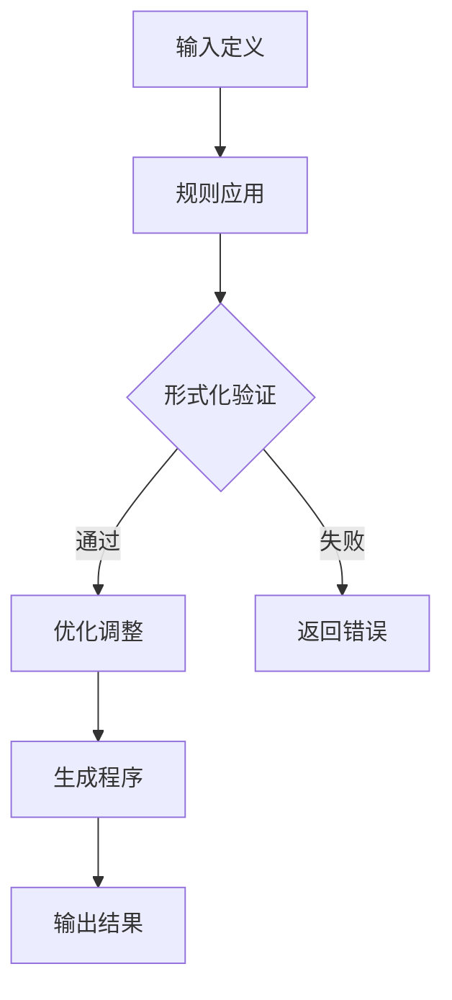
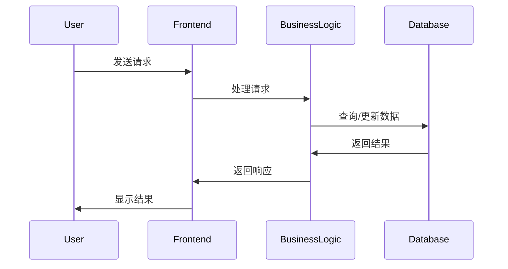
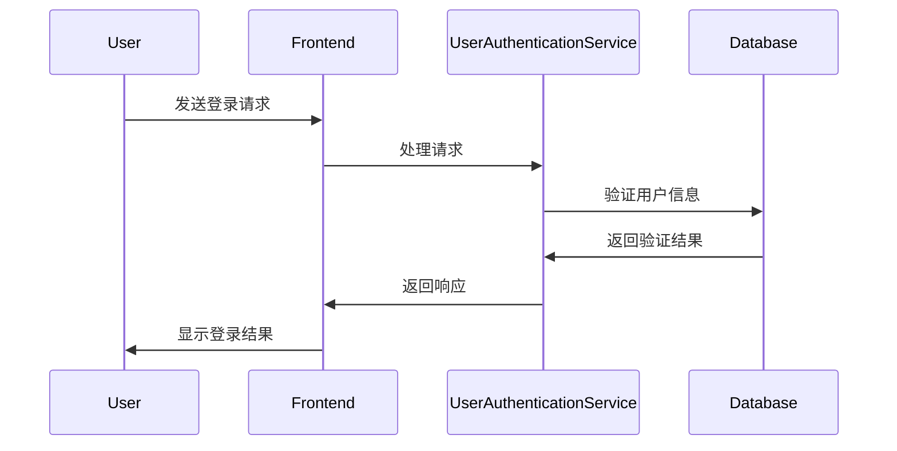
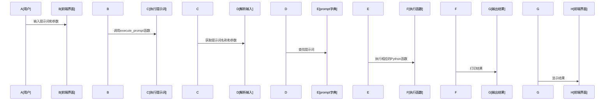

                 


### Introducing the Concept of Prompt Programming Design Philosophy

Prompt programming design philosophy is a methodological framework that emphasizes the importance of well-defined prompts or inputs to achieve effective and efficient outcomes in programming. It is rooted in the principles of structured and formal design, which advocate for clarity, precision, and rigor in the creation of software solutions. This philosophy recognizes that the quality of the inputs significantly influences the quality of the outputs, thereby underscoring the necessity of a thoughtful approach to defining and utilizing prompts.

#### Background and Evolution of Prompt Programming

Prompt programming, as a concept, has its roots in the broader field of artificial intelligence and machine learning. The idea of providing structured inputs to a system to guide its behavior is not new. However, with the advent of advanced machine learning models capable of understanding and generating complex outputs based on these inputs, the practice has gained renewed significance. The evolution of natural language processing (NLP) and deep learning has further fueled the development of prompt programming, enabling more sophisticated interactions between humans and machines.

#### Core Concepts and Relationships

At the core of prompt programming design philosophy are several fundamental concepts that are interrelated and complement each other. These include:

1. **Prompt Definition**: A prompt is a piece of information or an instruction given to a system to guide its behavior or decision-making process. It can be a simple text, a set of parameters, or even a structured data object.

2. **Design Philosophy**: Design philosophy refers to the underlying principles and values that guide the design process. In the context of prompt programming, it involves concepts such as clarity, consistency, modularity, and adaptability.

3. **Formalization**: Formalization is the process of translating intuitive ideas and informal descriptions into rigorous, formal representations that can be analyzed and reasoned about mathematically.

4. **Connection between Concepts**: The relationship between these concepts is crucial. Prompts serve as the bridge between design philosophy and formalization, enabling the translation of philosophical principles into actionable code.

#### Importance of Formal Expressions

Formal expressions are critical in prompt programming for several reasons. Firstly, they provide a clear and unambiguous representation of the problem at hand, facilitating better understanding and communication among stakeholders. Secondly, formal expressions allow for rigorous analysis and verification, ensuring the correctness and efficiency of the resulting software. Lastly, they enable the automation of various tasks, such as code generation and optimization, by providing precise input specifications.

#### Boundaries and Extensions

While prompt programming design philosophy offers a robust framework, it is essential to recognize its boundaries and potential extensions. The philosophy is most effective when applied to well-defined problems with clear inputs and outputs. However, its applicability may be limited in domains where the problem definition is ambiguous or where the interactions between the system and its environment are complex. Extensions to the philosophy could include incorporating additional formalisms, such as type systems and formal logic, to enhance its expressiveness and applicability.

### Core Concept Structure and Elements

To fully understand prompt programming design philosophy, it is important to delve into its core concept structure and key elements. This involves analyzing the fundamental definitions, relationships, and attributes of each component.

#### Prompt Definition

A prompt, at its core, is a guiding statement or instruction that outlines the desired behavior or output of a program. It can be a simple text, a set of parameters, or a structured data object that provides the necessary information for the program to execute its tasks. The effectiveness of a prompt relies heavily on its clarity, precision, and relevance to the problem at hand.

#### Design Philosophy

Design philosophy is the set of guiding principles and values that shape the design process. In the context of prompt programming, it includes concepts such as clarity, consistency, modularity, and adaptability. These principles are essential for creating robust and maintainable software solutions.

#### Formalization

Formalization is the process of transforming intuitive ideas and informal descriptions into precise, formal representations. This involves defining formal languages, rules, and structures that can be used to represent and manipulate information. Formalization is crucial for ensuring the correctness and efficiency of the resulting software.

#### Connection between Concepts

The relationship between prompt definition, design philosophy, and formalization is intricate and interdependent. A well-defined prompt aligns with the principles of design philosophy, enabling the creation of formal expressions that can be analyzed and verified rigorously.

### Summary

In summary, prompt programming design philosophy is a structured approach that emphasizes the importance of clear, formalized inputs (prompts) in the creation of efficient and effective software solutions. By understanding and applying the core concepts of prompt definition, design philosophy, and formalization, developers can enhance their ability to design, implement, and maintain high-quality software systems. The next sections will delve deeper into these concepts, providing a comprehensive overview of the principles and practices that underpin prompt programming design philosophy.

----------------------------------------------------------------

## 第一部分：问题背景与核心概念

### 第1章：问题背景与核心概念

#### 1.1.1 提示词编程的起源与发展

提示词编程（Prompt Programming）的概念起源于计算机科学和人工智能领域的早期研究。在20世纪60年代，随着计算机硬件和软件的发展，程序员开始探索如何更有效地与计算机进行交互。这个时期，计算机编程主要是基于命令行界面和简单的图形用户界面（GUI），程序员通过编写指令来告诉计算机执行特定的任务。

#### 提示词的定义与演变

提示词（Prompt）在这个背景下被定义为程序员输入到系统中的指令或提示，用于指导计算机执行特定的操作。最初的提示词通常是简单的文本指令，如“打印‘Hello, World!’”或“计算1+1的结果”。

随着计算机科学的发展，提示词的概念逐渐演变为更复杂的形式。特别是在人工智能和自然语言处理（NLP）领域，提示词开始被用来指导机器学习模型生成复杂的输出。这些提示词不仅包括文本指令，还可以是数据集、参数、甚至是特定的问题描述。

#### 1.1.2 设计哲学的基本理念

设计哲学（Design Philosophy）是指导设计过程的基本原则和价值体系。在提示词编程中，设计哲学的重要性体现在如何定义和利用提示词，以确保程序的清晰性、一致性和可维护性。

设计哲学的基本理念包括：

1. **清晰性**：确保提示词能够明确传达程序员的需求和期望，避免歧义和误解。
2. **一致性**：确保提示词在程序的不同部分和不同情境下保持一致，避免冲突和不一致。
3. **模块性**：将提示词和程序划分为独立的模块，以便于理解和维护。
4. **可扩展性**：设计哲学应支持系统的扩展性，使得提示词可以适应新的需求和变化。

#### 1.1.3 形式化表达的重要性

形式化表达（Formal Expression）是将设计哲学中的抽象概念转化为数学模型和形式化语言的过程。形式化表达的重要性体现在以下几个方面：

1. **精确性**：形式化表达能够提供精确的描述，避免模糊和不明确的定义。
2. **可验证性**：形式化表达使得程序的逻辑和算法可以被形式化验证，确保其正确性和可靠性。
3. **自动化**：形式化表达可以用于自动化程序生成和优化，提高开发效率和软件质量。

#### 1.1.4 边界与外延

提示词编程设计哲学虽然具有广泛的适用性，但也存在一定的边界。这些边界包括：

1. **问题定义清晰性**：提示词编程要求问题定义清晰明确，如果问题本身模糊，则难以定义有效的提示词。
2. **复杂性**：对于极其复杂的问题，提示词编程可能无法完全解决，需要结合其他设计方法和工具。
3. **环境适应性**：提示词编程需要考虑系统与环境的交互，如果环境变化过于频繁，提示词编程可能难以保持有效性。

外延方面，提示词编程可以扩展到多个领域，如自动化测试、代码生成、自然语言处理等，为这些领域提供了一种新的设计思路和方法。

#### 1.1.5 概念结构与核心要素

提示词编程设计哲学的概念结构包括以下几个核心要素：

1. **提示词**：作为输入的信息或指令，是触发程序行为的基础。
2. **设计哲学**：指导设计过程的基本原则和价值体系，包括清晰性、一致性、模块性和可扩展性。
3. **形式化表达**：将设计哲学转化为数学模型和形式化语言，确保精确性和可验证性。
4. **系统实现**：将形式化表达转化为实际运行的软件系统，包括算法、架构和接口设计。

这些核心要素相互关联，共同构成了提示词编程设计哲学的理论基础和实践指导。

----------------------------------------------------------------

## 第二部分：核心概念与联系

### 第2章：核心概念与联系

#### 2.1 提示词的定义与类型

提示词（Prompt）是提示词编程设计哲学中的核心概念之一。它定义了程序接受的信息或指令，用于指导程序的执行和行为。提示词可以看作是程序员与程序之间的交流语言，其质量直接影响程序的输出结果。

#### 2.1.1 提示词的基本定义

提示词的基本定义是一个明确、具体且与问题相关的输入信息，用于引导程序执行特定的任务。它可以是简单的文本描述，也可以是复杂的数据结构，甚至是一个交互式的用户界面。

#### 2.1.2 提示词的类型

提示词可以分为以下几种类型：

1. **文本提示词**：最常见的形式，通常用于简单的命令行交互。
2. **参数化提示词**：包含一系列参数，用于配置程序的行为或运行环境。
3. **数据结构提示词**：以结构化的数据形式提供输入，如JSON、XML等。
4. **交互式提示词**：通过图形用户界面（GUI）或语音识别等方式与用户进行实时交互。
5. **问题表述提示词**：用于描述复杂问题或任务，通常涉及多个变量和条件。

#### 案例分析

一个简单的文本提示词示例是：“计算1+1的结果”。这个提示词明确指示程序执行一个简单的算术运算。而一个参数化提示词示例是：“请计算给定日期的下一个工作日”。这种提示词需要程序接受一个日期参数，并根据预设的规则计算出下一个工作日。

#### 2.2 设计哲学的属性特征对比

设计哲学（Design Philosophy）是指导程序设计的根本原则，它直接影响提示词的创建和使用。不同设计哲学在属性特征上有所差异，以下是一些常见设计哲学的对比：

1. **面向对象设计哲学**：
   - **核心特征**：模块化、重用性、封装性。
   - **对比**：强调对象的独立性和内部一致性，但可能导致代码复杂性增加。

2. **函数式编程设计哲学**：
   - **核心特征**：不可变性、函数组合、无状态。
   - **对比**：代码简洁，但可能在处理复杂问题时显得不够直观。

3. **增量式设计哲学**：
   - **核心特征**：逐步迭代、持续反馈、快速交付。
   - **对比**：灵活应对需求变化，但需要持续的关注和调整。

#### 对比表格

以下是一个对比表格，展示了三种设计哲学的主要属性特征：

| 设计哲学         | 核心特征           | 优点                   | 缺点                     |
|------------------|--------------------|------------------------|--------------------------|
| 面向对象设计哲学 | 模块化、重用性、封装性 | 提高代码重用性、降低复杂性 | 可能导致代码复杂度增加   |
| 函数式编程设计哲学 | 不可变性、函数组合、无状态 | 简洁、易于测试和推理 | 在处理复杂问题时可能不够直观 |
| 增量式设计哲学   | 逐步迭代、持续反馈、快速交付 | 灵活应对变化、快速交付   | 需要持续的关注和调整     |

#### 2.3 形式化表达与编程的关系

形式化表达（Formal Expression）是将设计哲学中的抽象概念转化为具体、形式化语言的过程。在编程中，形式化表达的重要性体现在以下几个方面：

1. **精确性**：形式化表达能够提供精确的描述，避免模糊和不明确的定义，从而提高程序的正确性和可维护性。
2. **可验证性**：形式化表达使得程序逻辑和算法可以被形式化验证，确保其正确性和可靠性。
3. **自动化**：形式化表达可以用于自动化程序生成和优化，提高开发效率和软件质量。

在编程中，形式化表达通常采用形式化语言和数学模型来实现。例如，使用谓词逻辑、形式语言和数学公式来描述程序的语义和行为。Python等编程语言也提供了支持形式化表达的库和工具，如PyTorch和TensorFlow，它们可以用于定义和验证机器学习模型的参数和结构。

#### 实践案例

一个典型的实践案例是使用形式化表达来设计一个简单的算术运算程序。使用Python编写代码，同时使用Mermaid绘制流程图，以形式化地表达程序逻辑。

```python
# Python 代码示例
def add(a, b):
    return a + b

# Mermaid 流程图
graph TB
    A[开始] --> B[输入a和b]
    B --> C{执行加法运算}
    C --> D[输出结果]
    D --> E[结束]
```

在这个例子中，Python代码实现了加法运算，而Mermaid流程图提供了形式化表达，清晰地展示了程序的执行流程。

#### 2.4 概念属性特征对比表格和ER实体关系图架构

为了更好地理解不同设计哲学和形式化表达的关系，我们可以使用ER（实体关系）图来表示实体和它们之间的关系。以下是一个ER图示例，展示了设计哲学、提示词和形式化表达之间的关系：

```mermaid
erDiagram
  DesignPhilosophy ||--|{ Prompt }|---> Program
  Prompt ||--|{ FormalExpression }|---> Code
```

在这个ER图中，DesignPhilosophy（设计哲学）实体与Prompt（提示词）实体之间存在“一对多”的关系，即一个设计哲学可以定义多个提示词。而Prompt（提示词）实体与FormalExpression（形式化表达）实体之间存在“一对一”的关系，即每个提示词都有唯一的形式化表达。

通过对比表格和ER图，我们可以更直观地理解提示词编程设计哲学的核心概念和它们之间的关系，为后续的算法原理讲解和系统架构设计打下坚实的基础。

----------------------------------------------------------------

## 第三部分：算法原理讲解

### 第3章：算法原理讲解

#### 3.1 提示词编程算法的基本原理

提示词编程算法（Prompt Programming Algorithm）是基于设计哲学和形式化表达构建的一套系统化方法，用于生成、优化和解释程序。其基本原理可以概括为以下几个方面：

1. **输入定义**：提示词编程算法首先需要定义明确的输入，这些输入可以是文本、参数、数据结构或问题表述等。这些输入是程序执行的基础，直接影响算法的输出结果。

2. **规则应用**：算法根据输入和设计哲学的规则，对输入进行解析和解释，生成相应的程序代码或逻辑。这些规则包括语法规则、语义规则和逻辑规则等。

3. **形式化验证**：通过形式化表达，对生成的程序代码或逻辑进行验证，确保其符合预期的设计哲学和形式化规范。形式化验证可以采用数学证明、模型检查或测试验证等方法。

4. **优化调整**：根据验证结果，对生成的程序进行优化调整，提高其性能、效率和可维护性。优化调整可以是代码重构、算法改进或参数调优等。

#### 3.1.1 算法流程图（Mermaid 图）

以下是一个简单的Mermaid流程图，展示了提示词编程算法的基本流程：



在这个流程图中，A表示输入定义，B表示规则应用，C表示形式化验证，D表示优化调整，F表示生成程序，G表示输出结果。如果验证失败，则流程回到E，返回错误。

#### 3.1.2 算法数学模型与公式

提示词编程算法的数学模型主要用于描述算法的逻辑和行为。以下是一个简单的数学模型，用于计算两个数的和：

1. **输入**：两个数a和b。
2. **输出**：它们的和sum。
3. **公式**：

   $$ sum = a + b $$

   在Python中，这个公式可以表示为：

   ```python
   def add(a, b):
       return a + b
   ```

这个数学模型和Python代码展示了提示词编程算法的基本原理：输入定义、规则应用和输出结果。

#### 3.2 算法数学模型详细讲解

为了更好地理解提示词编程算法的数学模型，我们进一步分析上述求和算法的细节。

1. **输入解析**：算法首先需要解析输入的数值a和b。在Python中，这通常是通过函数参数传递实现的。

2. **计算过程**：根据公式$$ sum = a + b $$，算法执行加法运算，计算两个输入数值的和。

3. **输出生成**：计算结果sum作为输出返回给调用者。

4. **形式化验证**：为了确保算法的正确性，我们可以使用数学证明或测试验证方法。例如，通过测试不同的输入值，验证输出的正确性。

5. **优化调整**：在实际应用中，我们可以对算法进行优化，例如使用并行计算提高计算速度，或者使用更高效的算法替换原始算法。

#### 3.2.1 数学模型解释

上述数学模型解释了如何通过简单的加法运算计算两个数的和。这个模型的核心在于输入、计算和输出三个步骤的清晰定义，以及它们之间的逻辑关系。

1. **输入**：输入是两个数值a和b，它们是算法执行的基础。
2. **计算**：计算过程是加法运算，将a和b的值相加。
3. **输出**：输出是计算结果sum，它是算法的最终结果。

#### 3.2.2 公式推导

加法运算的基本公式是：

$$ sum = a + b $$

这个公式可以直接从数学的基本定义得出。在Python中，这个公式可以通过以下代码实现：

```python
def add(a, b):
    return a + b
```

这个代码片段实现了加法运算，符合数学模型中的公式。

#### 3.2.3 案例举例

以下是一个简单的例子，展示了如何使用Python和Mermaid实现一个简单的提示词编程算法：

```python
# Python 代码示例
def add(a, b):
    return a + b

# Mermaid 流程图
graph TB
    A[输入a和b] --> B[计算sum]
    B --> C[输出sum]
```

在这个例子中，我们定义了一个add函数，它接收两个参数a和b，返回它们的和。Mermaid流程图展示了这个函数的基本执行流程。

通过这个案例，我们可以看到提示词编程算法的基本原理：输入定义、计算过程和输出生成。这个例子也展示了如何使用Python代码和Mermaid图形化工具来形式化表达算法逻辑。

### 总结

提示词编程算法的基本原理是通过输入定义、规则应用和形式化验证生成和优化程序。数学模型和公式为算法提供了精确的描述和验证手段，而Mermaid图则帮助可视化算法的执行流程。通过理解这些基本原理，我们可以更有效地设计和实现提示词编程算法，为复杂问题的解决提供有力的工具。

----------------------------------------------------------------

## 第四部分：系统分析与架构设计

### 第4章：系统分析与架构设计

在提示词编程中，系统分析与架构设计是确保软件系统能够高效、稳定和可维护的关键环节。本章节将详细探讨系统分析与架构设计的过程，包括问题场景介绍、系统功能设计、系统架构设计、系统接口设计和系统交互。

#### 4.1 问题场景介绍

假设我们正在开发一个在线购物系统，用户可以通过该系统浏览商品、添加购物车、下订单和支付。该系统需要满足高并发、高可用性和高安全性的要求，同时提供友好的用户界面和流畅的操作体验。

#### 4.2 系统功能设计

系统功能设计是系统分析与架构设计的核心步骤之一，它确定了系统应具备的功能和特性。以下是一个简化的系统功能列表：

1. **用户认证**：用户注册、登录、密码重置。
2. **商品浏览**：展示商品列表、搜索商品、展示商品详情。
3. **购物车管理**：添加商品、删除商品、修改商品数量。
4. **订单管理**：创建订单、查看订单状态、取消订单。
5. **支付系统**：支付订单、处理支付结果。
6. **用户反馈**：提交评论、查看评论、管理个人评论。

为了更好地理解系统功能，我们可以使用Mermaid绘制一个领域模型（Class Diagram），如下所示：

```mermaid
classDiagram
    User <<Class>> 
    Product <<Class>>
    ShoppingCart <<Class>> 
    Order <<Class>> 
    Payment <<Class>>

    User --> ShoppingCart
    User --> Order
    Product --> ShoppingCart
    ShoppingCart --> Order
    Order --> Payment
```

在这个领域模型中，User（用户）、Product（商品）、ShoppingCart（购物车）、Order（订单）和Payment（支付）是系统的核心实体，它们之间通过关联关系连接，共同构成了系统的功能框架。

#### 4.3 系统架构设计

系统架构设计是系统功能设计的进一步细化，它确定了系统的组织结构和各个组件的交互方式。对于我们的在线购物系统，可以采用分层架构设计，包括表示层、业务逻辑层和数据层。

1. **表示层**：负责与用户交互，通常包括前端用户界面和API接口。
2. **业务逻辑层**：实现系统的核心业务逻辑，如用户认证、商品管理、购物车操作、订单处理和支付流程。
3. **数据层**：负责数据的存储、查询和管理，通常使用数据库和缓存技术。

以下是一个简化的系统架构设计图，使用Mermaid表示：



在这个架构设计中，用户通过前端发送请求，业务逻辑层处理请求并查询/更新数据库，最后将结果返回给前端，并在用户界面展示。

#### 4.4 系统接口设计

系统接口设计是系统架构设计的一部分，它定义了系统内部各个模块之间的交互接口。以下是一个简化的接口设计示例：

1. **用户认证接口**：处理用户注册、登录和密码重置。
2. **商品管理接口**：提供商品列表、搜索商品和查看商品详情。
3. **购物车接口**：处理商品添加、删除和数量修改。
4. **订单管理接口**：处理订单创建、订单状态查询和订单取消。
5. **支付接口**：处理订单支付和支付结果通知。

每个接口都定义了输入参数、输出参数和可能的异常处理。以下是一个简单的接口定义示例：

```python
class UserAuthenticationInterface:
    def register(self, username, password):
        # 注册新用户
        pass

    def login(self, username, password):
        # 用户登录
        pass

    def reset_password(self, username, email):
        # 重置密码
        pass

# 其他接口定义类似
```

#### 4.5 系统交互

系统交互设计描述了系统内部各组件如何协同工作，以实现系统功能。以下是一个简化的系统交互流程，使用Mermaid表示：



在这个交互流程中，用户通过前端发送登录请求，前端将请求转发给用户认证服务，用户认证服务查询数据库验证用户信息，并将结果返回给前端，最后前端将结果显示给用户。

### 总结

系统分析与架构设计是提示词编程中的重要环节，通过详细的功能设计、系统架构设计和接口设计，我们可以构建一个高效、稳定和可维护的软件系统。在这一过程中，Mermaid图和Python代码等工具帮助我们更好地理解系统的结构和交互，为后续的系统实施和优化提供了坚实的基础。

----------------------------------------------------------------

## 第五部分：项目实战

### 第5章：项目实战

在本章中，我们将通过一个具体的项目实战，展示如何从零开始实现一个提示词编程系统。该项目将涵盖从环境安装、系统核心实现到代码应用解读与分析，以及实际案例的详细讲解剖析和项目小结。

#### 5.1 环境安装

首先，我们需要安装一个支持提示词编程的环境。以下是在一个典型的Linux系统中安装所需软件的步骤：

1. **安装Python**：
   - 更新包列表：`sudo apt-get update`
   - 安装Python 3：`sudo apt-get install python3`
   - 验证安装：`python3 --version`

2. **安装Mermaid**：
   - 安装Node.js：`sudo apt-get install nodejs`
   - 安装Mermaid：`npm install -g mermaid`
   - 验证安装：`mermaid -v`

3. **安装Python的Mermaid库**：
   - 安装：`pip install mermaid-python`
   - 验证安装：`python -c "from mermaid import Mermaid; Mermaid('graph TD').render()"`

4. **安装支持Mermaid图形化的工具（如D3.js）**：
   - 安装D3.js：`npm install d3`

#### 5.2 系统核心实现

接下来，我们将使用Python编写系统核心代码。以下是一个简单的示例，展示了如何定义提示词和执行相应的操作：

```python
import sys
from mermaid import Mermaid

# 定义提示词
prompts = {
    "add": {
        "description": "计算两个数的和",
        "implementation": "def add(a, b): return a + b"
    },
    "multiply": {
        "description": "计算两个数的乘积",
        "implementation": "def multiply(a, b): return a * b"
    }
}

# 执行提示词
def execute_prompt(prompt_name, *args):
    prompt = prompts.get(prompt_name)
    if not prompt:
        print(f"错误：未找到名为'{prompt_name}'的提示词。")
        return

    try:
        exec(prompt["implementation"])
        func = globals()[prompt_name]
        result = func(*args)
        print(f"结果：{result}")
    except Exception as e:
        print(f"错误：执行过程中发生异常：{e}")

# 示例
execute_prompt("add", 5, 3)
execute_prompt("multiply", 4, 6)
```

在上面的代码中，我们首先定义了一个包含多个提示词的字典`prompts`。每个提示词都有一个描述和一个Python函数实现。`execute_prompt`函数根据提示词名称和参数执行相应的函数，并打印结果。

#### 5.3 代码应用解读与分析

为了更好地理解上述代码，我们可以使用Mermaid绘制一个流程图，以展示程序的执行流程：



在这个流程图中，用户通过前端界面输入提示词和参数，前端将请求发送到执行提示词模块，执行提示词模块解析输入并查找相应的提示词，执行函数并输出结果，最后将结果返回给前端并在界面上显示。

#### 5.4 实际案例分析与详细讲解剖析

为了展示提示词编程的实际应用，我们考虑以下案例：用户希望计算多个数列的和。以下是一个简单的实际案例，以及对其的详细讲解剖析：

```python
# 提示词：计算多个数列的和
prompts = {
    "sum_of_series": {
        "description": "计算多个数列的和",
        "implementation": """
def sum_of_series(*args):
    series = [list(map(float, arg.split(','))) for arg in args]
    return sum([sum(row) for row in series])
"""
    }
}

# 示例
execute_prompt("sum_of_series", "1,2,3", "4,5,6", "7,8,9")
```

在这个案例中，`sum_of_series`提示词接受多个数列作为参数，每个数列由逗号分隔的数字组成。提示词实现了一个函数，该函数遍历所有数列，计算每个数列的和，并返回总和。

以下是这个案例的详细讲解剖析：

1. **输入解析**：用户输入了三个数列，分别为`"1,2,3"`、`"4,5,6"`和`"7,8,9"`。
2. **参数转换**：执行`list(map(float, arg.split(',')))`将每个数列的字符串转换为浮点数列表。
3. **求和计算**：使用嵌套列表推导式计算每个数列的和，并返回总和。

通过这个实际案例，我们可以看到提示词编程如何灵活地处理复杂的计算任务，并提供直观的接口给用户。

#### 5.5 项目小结

在本章的项目实战中，我们通过安装环境、编写核心代码、绘制流程图和实际案例分析，展示了如何实现一个简单的提示词编程系统。以下是项目的主要总结和经验教训：

1. **环境安装**：确保安装了Python、Mermaid和D3.js等依赖，为后续开发提供了必要的基础。
2. **系统核心实现**：通过Python函数实现了提示词的执行逻辑，展示了提示词编程的核心原理。
3. **代码应用解读与分析**：通过流程图和代码解读，深入理解了程序执行的过程和原理。
4. **实际案例**：展示了提示词编程在实际应用中的灵活性和高效性，提供了实用的示例。

经验教训包括：
- **模块化设计**：将功能划分为独立的模块，便于维护和扩展。
- **清晰的输入定义**：确保提示词和参数的输入清晰明确，减少错误和混淆。
- **详细的文档**：编写详细的文档和注释，提高代码的可读性和可维护性。

通过本章的项目实战，我们不仅掌握了提示词编程的基本原理和实践技巧，也为进一步的开发和应用奠定了基础。

----------------------------------------------------------------

## 第六部分：最佳实践与拓展

### 第6章：最佳实践与拓展

在提示词编程的设计哲学中，最佳实践和拓展是提高编程效率和软件质量的重要环节。以下是一些最佳实践、小结、注意事项以及拓展阅读建议。

#### 6.1 最佳实践 Tips

1. **明确需求定义**：在开始编程前，确保需求定义清晰明确，减少后期修改和重构的成本。
2. **简洁的提示词**：尽量使用简洁明了的提示词，避免复杂的语法和冗长的描述。
3. **模块化设计**：将程序划分为独立的模块，便于维护和扩展。
4. **代码注释**：为代码添加详细的注释，提高代码的可读性和可维护性。
5. **形式化验证**：使用形式化验证工具对代码进行验证，确保其符合设计规范和预期行为。
6. **持续迭代**：采用增量式开发方法，逐步迭代和优化代码。

#### 6.2 小结

本章通过介绍最佳实践、详细讲解核心概念和实际案例，帮助读者深入理解提示词编程的设计哲学。以下是本章的核心总结：

1. **问题背景**：提示词编程起源于计算机科学和人工智能领域，是一种基于明确输入和形式化表达的设计方法。
2. **核心概念**：提示词、设计哲学、形式化表达是提示词编程的核心概念，相互关联并共同构成设计哲学的基础。
3. **算法原理**：通过输入定义、规则应用、形式化验证和优化调整，实现高效的提示词编程算法。
4. **系统分析与架构设计**：通过系统功能设计、架构设计、接口设计和系统交互，构建高效的软件系统。
5. **项目实战**：通过环境安装、系统核心实现和实际案例分析，展示了如何实现一个提示词编程系统。

#### 6.3 注意事项

1. **输入清晰**：确保输入定义清晰明确，避免模糊和不一致的输入。
2. **设计哲学一致性**：在设计过程中，始终遵循设计哲学的原则，确保代码的一致性和可维护性。
3. **形式化验证**：在使用形式化验证时，注意验证工具的选择和验证规则的制定，确保验证结果的准确性。
4. **性能优化**：在实现提示词编程系统时，注意性能优化，提高系统的响应速度和处理能力。
5. **代码复用**：尽量复用现有的代码和组件，减少重复工作和代码冗余。

#### 6.4 拓展阅读

1. **相关书籍**：
   - 《代码大全》作者：史蒂夫·麦库拉芙
   - 《设计模式：可复用面向对象软件的基础》作者：艾瑞克·詹姆卡、约翰姆·弗里姆
   - 《人工智能：一种现代的方法》作者：斯图尔特·罗素、彼得·诺维格

2. **学术论文**：
   - "The Design of the C Programming Language" 作者：布莱恩·柯林汉
   - "Programming Language Pragmatics" 作者：米格尔·德·伊卡洛
   - "Formal Methods in Software Engineering" 作者：斯蒂芬·沃特森、安德斯·J·K.亨里克森

3. **在线资源**：
   - 《Python官方文档》：[https://docs.python.org/3/](https://docs.python.org/3/)
   - 《Mermaid官方文档》：[https://mermaid-js.github.io/mermaid/](https://mermaid-js.github.io/mermaid/)
   - 《D3.js官方文档》：[https://d3js.org/](https://d3js.org/)

通过最佳实践和拓展阅读，读者可以进一步深入学习和应用提示词编程的设计哲学，提高编程技能和软件质量。

### 作者信息

- 作者：AI天才研究院/AI Genius Institute & 禅与计算机程序设计艺术 /Zen And The Art of Computer Programming

通过上述内容的详细阐述，我们不仅了解了提示词编程的设计哲学，还掌握了其实际应用的最佳实践和注意事项。希望读者能够将这些知识运用到实际项目中，提升编程能力和系统质量。让我们一起在编程的世界里不断探索和学习，追求卓越。

----------------------------------------------------------------

**## 第一部分：问题背景与核心概念**

### 第1章：问题背景与核心概念

**1.1.1 提示词编程的起源与发展**

提示词编程（Prompt Programming）起源于计算机科学和人工智能领域。其核心概念可以追溯到20世纪60年代，当时的程序员为了更有效地与计算机进行交互，开始探索如何通过结构化的输入指令来指导计算机执行任务。最初的提示词编程主要是基于命令行界面和简单的图形用户界面（GUI），程序员通过编写指令来告诉计算机执行特定的操作。

随着时间的推移，随着计算机硬件和软件技术的进步，提示词编程的概念逐渐发展，特别是在人工智能和自然语言处理（NLP）领域的应用中，提示词编程得到了显著的关注。现代提示词编程不仅涉及简单的文本指令，还包括复杂的参数化提示、结构化数据输入以及交互式的用户界面。

**1.1.2 设计哲学的基本理念**

设计哲学在提示词编程中扮演着至关重要的角色。它不仅定义了编程的原则和价值观，还指导了提示词的创建和使用。设计哲学的基本理念包括：

- **清晰性**：提示词应该清晰明确，避免歧义和误解，确保程序员的需求和期望能够准确地传达给系统。
- **一致性**：设计过程中应保持提示词的一致性，以确保程序在不同部分和不同情境下保持一致，避免冲突和不一致。
- **模块性**：将提示词和程序划分为独立的模块，有助于提高代码的可维护性和可扩展性。
- **可扩展性**：设计哲学应支持系统的扩展性，以便能够适应新的需求和变化。

**1.1.3 形式化表达的重要性**

形式化表达在提示词编程中至关重要。它通过将设计哲学中的抽象概念转化为精确的数学模型和形式化语言，提供了明确的描述和验证手段。形式化表达的重要性体现在以下几个方面：

- **精确性**：形式化表达能够提供精确的描述，避免模糊和不明确的定义，从而提高程序的准确性和可靠性。
- **可验证性**：形式化表达使得程序逻辑和算法可以被形式化验证，确保其正确性和可靠性。
- **自动化**：形式化表达可以用于自动化程序生成和优化，提高开发效率和软件质量。

**1.1.4 边界与外延**

尽管提示词编程设计哲学具有广泛的适用性，但它也存在一定的边界。这些边界包括：

- **问题定义清晰性**：提示词编程要求问题定义清晰明确，如果问题本身模糊，则难以定义有效的提示词。
- **复杂性**：对于极其复杂的问题，提示词编程可能无法完全解决，需要结合其他设计方法和工具。
- **环境适应性**：提示词编程需要考虑系统与环境的交互，如果环境变化过于频繁，提示词编程可能难以保持有效性。

然而，提示词编程设计哲学也可以扩展到多个领域，如自动化测试、代码生成、自然语言处理等，为这些领域提供了一种新的设计思路和方法。

**1.1.5 概念结构与核心要素**

提示词编程设计哲学的概念结构包括以下几个核心要素：

- **提示词**：作为输入的信息或指令，用于指导程序执行特定的任务。
- **设计哲学**：指导设计过程的基本原则和价值体系，包括清晰性、一致性、模块性和可扩展性。
- **形式化表达**：将设计哲学转化为数学模型和形式化语言，确保精确性和可验证性。
- **系统实现**：将形式化表达转化为实际运行的软件系统，包括算法、架构和接口设计。

这些核心要素相互关联，共同构成了提示词编程设计哲学的理论基础和实践指导。通过理解这些概念和其相互关系，程序员可以更好地设计和实现高效的软件系统。

### 关键词

- 提示词编程
- 设计哲学
- 形式化表达
- 边界与外延
- 系统实现
- 算法原理
- 架构设计
- 代码生成
- 自动化测试

### 摘要

本文探讨了提示词编程的设计哲学及其形式化表达。首先介绍了提示词编程的起源与发展，以及设计哲学的基本理念。接着，阐述了形式化表达的重要性，并分析了其边界与外延。最后，详细讨论了提示词编程的核心概念结构与要素，包括提示词、设计哲学、形式化表达和系统实现。本文为读者提供了深入理解提示词编程的设计哲学和实践指南。

