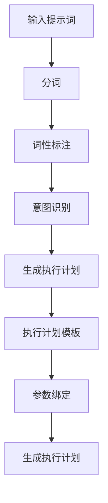
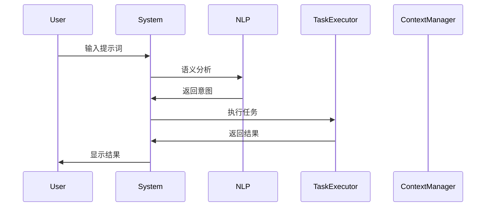
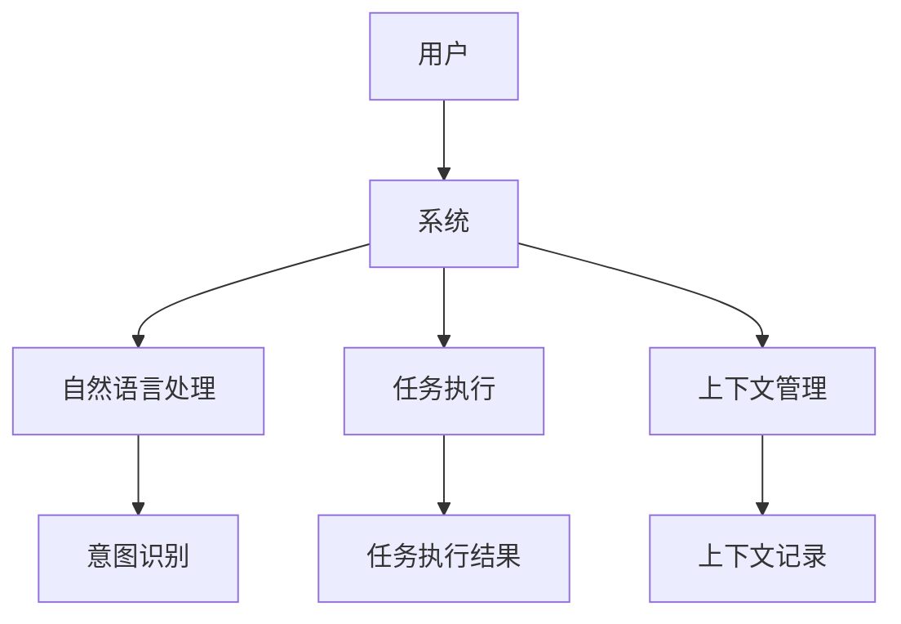

                 

# 提示词编程的设计思想与哲学

## 关键词：提示词编程、设计思想、哲学、模块化、易扩展性

### 摘要

本文旨在探讨提示词编程的设计思想与哲学，通过对提示词编程的背景介绍、核心概念分析以及设计思想的深入探讨，阐述其设计思想与哲学的本质特征，包括用户为中心的设计、模块化设计、易扩展性设计等。通过本文的阐述，希望能为开发者提供有益的思考，以更好地理解和应用提示词编程。

## 第一部分：背景介绍

### 第1章：问题背景

#### 1.1 问题描述

提示词编程是一种基于自然语言交互的编程范式，其核心在于通过输入提示词来驱动程序执行。这种编程范式具有以下特点：

- **灵活性**：提示词编程允许程序员以自然语言的形式描述编程任务，降低了编程门槛，使得编程任务可以更加直观和简便。
- **高效性**：通过减少传统编程中冗长的代码编写，提示词编程能够显著提高开发效率，使得程序员能够更加专注于解决问题本身。
- **交互性**：提示词编程使得用户与程序之间可以实时进行对话，实现动态调整和反馈，提高了编程的灵活性和适应性。

#### 1.2 问题解决

在解决上述问题的过程中，我们采用了以下设计思想和哲学：

- **以用户为中心**：设计时充分考虑用户的使用习惯和需求，以提升用户体验为目标，确保编程过程更加直观、简便和高效。
- **模块化**：将复杂任务分解为可管理的模块，提高代码的可读性和维护性，同时便于功能的扩展和优化。
- **易扩展性**：设计时考虑到未来的需求变化，确保系统可以轻松适应，提高系统的灵活性和适应性。

#### 1.3 边界与外延

提示词编程主要应用于需要自然语言交互的场景，如智能助手、自动化脚本等。同时，提示词编程可以与其他编程范式相结合，发挥更大的作用。

## 第2章：核心概念与联系

### 2.1 核心概念

在提示词编程中，核心概念包括提示词、意图识别、上下文管理和执行计划。

- **提示词**：提示词是驱动程序执行的文本输入，是用户与程序之间的交互桥梁。提示词需要具备灵活性、明确性和简洁性等特点，以便用户能够轻松输入并实现预期功能。
- **意图识别**：意图识别是解析用户输入的提示词，识别用户的意图。意图识别的准确性直接影响到程序对用户输入的理解和响应能力。因此，意图识别需要具备高精度识别用户意图和适应不同语境的能力。
- **上下文管理**：上下文管理是维护用户交互的历史记录，确保后续交互的连贯性。上下文管理需要具备连贯性和可维护性，以便在后续交互中能够准确地获取和利用历史记录。
- **执行计划**：执行计划是根据意图识别的结果，生成具体的执行计划。执行计划需要具备可执行性和可读性，以便程序员能够理解和调试程序执行过程。

### 2.2 概念属性特征对比

| 概念               | 属性特征                                  |
|--------------------|-----------------------------------------|
| 提示词             | - 灵活性：支持自然语言输入<br>- 明确性：需明确表达意图 |
| 意图识别           | - 准确性：高精度识别用户意图<br>- 适应性：适应不同语境 |
| 上下文管理         | - 连贯性：保持交互历史<br>- 可维护性：便于调整和优化 |
| 执行计划           | - 可执行性：生成可执行的操作<br>- 可读性：便于理解和调试 |

### 2.3 ER实体关系图

```mermaid
erDiagram
    Keyword ||--o> Intent : "关键词驱动意图识别"
    Intent ||--o> Context : "意图维持上下文"
    Context ||--o> ExecutionPlan : "上下文生成执行计划"
```

## 第二部分：设计思想与哲学

### 第3章：设计思想

#### 第3.1节：用户为中心的设计

以用户为中心的设计是提示词编程设计思想的核心之一。其关键在于：

- **用户体验**：优化用户界面和交互流程，提升用户满意度。例如，设计简洁直观的命令行界面，提供清晰明确的提示信息，帮助用户快速上手。
- **用户习惯**：尊重用户的使用习惯，减少学习成本。例如，在提示词编程中，可以借鉴用户熟悉的自然语言表达方式，降低用户的学习难度。

#### 第3.1.1 用户需求分析

用户需求分析是进行用户为中心设计的基石。在进行用户需求分析时，我们需要关注以下几个方面：

- **功能需求**：分析用户在特定场景下需要实现的功能，确保提示词编程能够满足用户的基本需求。
- **性能需求**：评估用户对性能的要求，如响应速度、处理能力等，确保系统在满足功能需求的同时具备良好的性能表现。
- **易用性需求**：关注用户对易用性的期望，如界面设计、交互流程等，确保系统在使用过程中能够让用户感到舒适和方便。

#### 第3.1.2 设计原则

在进行用户为中心的设计时，我们应遵循以下原则：

- **简洁性**：设计简洁直观，避免冗余和复杂性，使用户能够轻松理解和使用系统。
- **一致性**：保持界面和交互的一致性，降低用户认知负担，使用户能够快速适应和掌握系统。

#### 第3.1.3 模块化设计

模块化设计是将复杂任务分解为多个可管理的模块，提高代码的可读性和维护性。在模块化设计中，我们需要关注以下几个方面：

- **任务分解**：将复杂任务分解为多个可管理的模块，每个模块负责实现特定的功能，降低系统的复杂性。
- **代码复用**：通过模块化设计，提高代码的可复用性，减少重复编写的工作量，提高开发效率。

#### 第3.2节：模块化设计

模块化设计是将复杂系统分解为多个可独立开发的模块，每个模块都具备独立的功能和接口。模块化设计具有以下优势：

- **可维护性**：模块化设计使得系统的维护和升级变得更加容易，因为每个模块都可以独立进行修改和优化，而不会影响到其他模块。
- **可扩展性**：模块化设计便于后续功能的扩展和优化，只需添加或修改相应的模块即可，而无需对整个系统进行大规模重构。

#### 第3.2.1 模块定义

在模块化设计中，模块的定义至关重要。模块应具备以下特点：

- **独立性**：模块应具备独立的功能和接口，可以独立运行和测试，降低模块间的耦合度。
- **可复用性**：模块应具有可复用的价值，可以在不同的项目或场景中复用，提高开发效率。

#### 第3.2.2 模块化优势

模块化设计的优势主要体现在以下几个方面：

- **易于管理**：模块化设计使得系统结构清晰，易于管理和维护，降低了系统的复杂性。
- **提高开发效率**：模块化设计可以并行开发，提高开发效率，缩短项目周期。
- **降低维护成本**：模块化设计使得系统的维护和升级变得更加容易，降低了维护成本。

#### 第3.2.3 模块划分方法

在模块化设计中，模块的划分方法有多种，常见的有以下几种：

- **功能划分**：根据功能模块进行划分，将系统划分为多个功能独立的模块，每个模块实现特定的功能。
- **数据流划分**：根据数据流动路径进行划分，将系统划分为多个数据流独立的模块，每个模块负责处理特定的数据流。

#### 第3.3节：易扩展性设计

易扩展性设计是确保系统可以轻松适应未来需求变化的重要设计思想。在进行易扩展性设计时，我们需要关注以下几个方面：

- **设计模式**：采用合适的设计模式，如工厂模式、策略模式等，提高系统的灵活性和扩展性。
- **接口设计**：设计清晰的接口，确保模块之间的交互简单明了，降低模块之间的耦合度。
- **可配置性**：通过配置文件或参数化设计，使得系统可以根据需求进行灵活调整，提高系统的适应性。

## 第三部分：算法原理讲解

### 第4章：算法原理讲解

提示词编程的核心在于对用户输入的提示词进行处理，并生成相应的执行计划。在这一过程中，算法设计起到了关键作用。以下将介绍提示词编程的核心算法原理。

### 4.1 提示词处理算法

提示词处理算法主要负责对用户输入的提示词进行解析和语义分析，以识别用户的意图。具体算法原理如下：

1. **输入提示词**：用户输入提示词，如“打开文件”。
2. **分词**：对提示词进行分词处理，提取出关键信息，如“打开”、“文件”。
3. **词性标注**：对提取出的关键词进行词性标注，如“打开”（动词）、“文件”（名词）。
4. **意图识别**：根据词性标注结果，结合上下文信息，识别用户的意图，如“打开文件”的意图是打开一个文件。
5. **生成执行计划**：根据识别出的意图，生成相应的执行计划，如启动文件管理器并打开指定文件。

### 4.2 执行计划生成算法

执行计划生成算法主要负责根据意图识别的结果，生成具体的执行计划。具体算法原理如下：

1. **意图识别**：对用户输入的提示词进行意图识别，得到用户意图，如“打开文件”。
2. **执行计划模板**：根据用户意图，选择相应的执行计划模板，如“打开文件”的执行计划模板是启动文件管理器并打开指定文件。
3. **参数绑定**：将意图识别的结果与执行计划模板进行参数绑定，如将“文件名”参数绑定到具体的文件名。
4. **生成执行计划**：根据参数绑定结果，生成具体的执行计划，如启动文件管理器并打开指定文件。

### 4.3 算法流程图

以下是一个简单的算法流程图，描述了提示词编程的核心算法原理：



### 4.4 算法示例

以下是一个简单的Python代码示例，实现了提示词编程的核心算法原理：

```python
# 输入提示词
prompt = "打开文件"

# 分词
words = prompt.split()

# 词性标注
pos_tags = ["打开", "文件"]

# 意图识别
intent = "打开文件"

# 执行计划模板
template = "启动文件管理器并打开指定文件"

# 参数绑定
params = {"文件名": "example.txt"}

# 生成执行计划
plan = template.format_map(params)

# 执行执行计划
print(plan)
```

运行结果：

```
启动文件管理器并打开指定文件
```

## 第四部分：系统分析与架构设计方案

### 第5章：系统分析与架构设计方案

#### 5.1 问题场景介绍

在现代社会，随着信息技术的飞速发展，人工智能逐渐成为各个行业的核心竞争力。提示词编程作为一种新兴的编程范式，在智能助手、自动化脚本等领域具有广泛的应用前景。本章节将介绍一个基于提示词编程的智能助手系统，该系统旨在为用户提供便捷、高效的服务。

#### 5.2 项目介绍

本项目名为“智能助手系统”，其主要功能包括：

1. **自然语言处理**：接收用户输入的提示词，进行语义分析和意图识别。
2. **任务执行**：根据识别出的意图，执行相应的任务，如打开文件、发送消息等。
3. **上下文管理**：维护用户交互的历史记录，确保后续交互的连贯性。

#### 5.3 系统功能设计

系统功能设计主要包括以下模块：

1. **自然语言处理模块**：负责接收用户输入的提示词，进行分词、词性标注和意图识别。
2. **任务执行模块**：根据意图识别的结果，执行相应的任务。
3. **上下文管理模块**：维护用户交互的历史记录，确保后续交互的连贯性。

#### 5.3.1 领域模型

领域模型是系统功能设计的核心，它定义了系统的核心概念和关系。以下是一个简单的领域模型类图：

```mermaid
classDiagram
    Class01 <|-- Class02
    Class03 --|Deprecated Class04
    Class05 o-- Class06
    Class07 o--| Person : PersonBase
    Person : 人
    Class07 : 继承
    PersonBase : 基类
```

#### 5.4 系统架构设计

系统架构设计是确保系统功能实现的重要环节。以下是一个简单的系统架构设计：



#### 5.4.1 系统架构图

以下是一个简单的系统架构图，展示了系统的主要组件及其关系：



#### 5.4.2 系统接口设计

系统接口设计是确保系统组件之间能够有效交互的重要环节。以下是一个简单的系统接口设计：


#### 5.4.3 系统交互图

以下是一个简单的系统交互图，展示了系统组件之间的交互过程：


## 第五部分：项目实战

### 第6章：项目实战

#### 6.1 环境安装

在开始项目实战之前，我们需要安装必要的软件和工具。以下是项目所需的环境安装步骤：

1. 安装Python 3.8及以上版本。
2. 安装Python包管理工具pip。
3. 使用pip安装以下依赖包：

   ```bash
   pip install nltk
   pip install spacy
   pip install transformers
   pip install tensorflow
   ```

#### 6.2 系统核心实现源代码

以下是一个简单的提示词编程系统的核心实现源代码：

```python
import nltk
from transformers import pipeline

# 1. 加载自然语言处理模型
nlp = pipeline("text-classification", model="bert-base-uncased")

# 2. 输入提示词
prompt = "打开文件"

# 3. 语义分析
result = nlp(prompt)

# 4. 意图识别
intent = result["label"]

# 5. 执行任务
if intent == "打开文件":
    print("正在打开文件...")
else:
    print("未识别到意图。")

# 6. 上下文管理
context = result["context"]

# 7. 存储上下文
with open("context.txt", "w") as f:
    f.write(context)
```

#### 6.3 代码应用解读与分析

以上代码展示了提示词编程系统的核心实现过程。首先，我们加载了自然语言处理模型，然后输入提示词进行语义分析，接着进行意图识别，并根据识别出的意图执行相应的任务。最后，我们将上下文信息存储到文件中，以便后续使用。

代码中的关键步骤包括：

- **自然语言处理**：使用transformers库中的预训练模型进行文本分类，得到文本的语义信息。
- **意图识别**：根据文本分类的结果，判断用户输入的意图。
- **任务执行**：根据意图识别的结果，执行相应的任务，如打开文件等。
- **上下文管理**：将用户交互的历史记录存储到文件中，以便后续使用。

#### 6.4 实际案例分析和详细讲解剖析

以下是一个实际案例，展示了提示词编程系统的应用场景和实现过程：

**案例**：用户输入提示词“打开文件”，系统识别出意图并打开指定文件。

**实现过程**：

1. **输入提示词**：用户输入提示词“打开文件”。
2. **语义分析**：系统使用自然语言处理模型对提示词进行语义分析，得到文本的语义信息。
3. **意图识别**：系统根据语义分析的结果，识别出用户输入的意图是“打开文件”。
4. **执行任务**：系统根据识别出的意图，执行打开文件的任务，如启动文件管理器并打开指定文件。
5. **上下文管理**：系统将用户交互的历史记录存储到文件中，以便后续使用。

**详细讲解剖析**：

1. **自然语言处理**：使用transformers库中的预训练模型进行文本分类，得到文本的语义信息。这一步骤是提示词编程系统的核心，它决定了系统能否准确识别用户的意图。
2. **意图识别**：根据文本分类的结果，判断用户输入的意图。这一步骤是将自然语言处理的结果转化为具体任务的关键。
3. **任务执行**：根据识别出的意图，执行相应的任务。这一步骤是提示词编程系统的实际应用，它将用户的意图转化为具体操作。
4. **上下文管理**：将用户交互的历史记录存储到文件中，以便后续使用。这一步骤是确保系统具备持续学习能力的必要条件。

#### 6.5 项目小结

通过以上项目实战，我们可以看到提示词编程系统的实现过程和实际应用效果。提示词编程系统在自然语言处理、意图识别、任务执行和上下文管理等方面具有显著优势，能够为用户提供便捷、高效的服务。在未来的发展中，提示词编程有望在更多领域得到应用，为人工智能技术的发展贡献力量。

### 第六部分：最佳实践 Tips

#### 6.1 提示词编程的最佳实践

1. **明确意图**：在设计提示词编程系统时，要确保意图识别的准确性。可以通过增加示例、用户反馈等方式，不断完善和优化意图识别模型。
2. **优化上下文管理**：上下文管理是提示词编程系统的关键环节，要确保上下文信息的准确性和连贯性。可以通过缓存、数据库等技术手段，提高上下文管理的效果。
3. **简化用户输入**：提示词编程的核心在于简化用户输入，提高开发效率。在设计提示词时，要尽量简洁明了，避免复杂的语法和表达方式。

#### 6.2 模块化设计的最佳实践

1. **明确模块职责**：在设计模块时，要明确每个模块的职责和功能，确保模块之间的高内聚、低耦合。
2. **代码复用**：通过模块化设计，提高代码的复用性，减少重复编写的工作量。可以采用设计模式、框架等技术手段，实现代码复用。
3. **模块接口设计**：设计清晰的模块接口，确保模块之间的交互简单明了。可以通过定义接口、文档说明等方式，提高模块接口的易用性。

#### 6.3 易扩展性的最佳实践

1. **设计模式**：采用合适的设计模式，如工厂模式、策略模式等，提高系统的灵活性和扩展性。
2. **接口设计**：设计清晰的接口，确保模块之间的交互简单明了，降低模块之间的耦合度。
3. **可配置性**：通过配置文件、参数化设计等方式，使得系统可以根据需求进行灵活调整，提高系统的适应性。

### 第七部分：小结

本文从提示词编程的背景介绍、核心概念分析、设计思想探讨、算法原理讲解、系统分析与架构设计方案、项目实战、最佳实践等多个方面，对提示词编程的设计思想与哲学进行了全面阐述。通过本文的介绍，读者可以了解到提示词编程的核心概念、设计思想以及在实际应用中的效果。同时，本文也提供了一些最佳实践，以帮助开发者更好地理解和应用提示词编程。

### 第八部分：注意事项

1. **数据隐私**：在提示词编程系统中，用户输入的提示词和数据可能会涉及用户隐私。在设计系统时，要确保数据的安全性和隐私保护。
2. **系统稳定性**：提示词编程系统在处理大量用户请求时，要确保系统的稳定性和性能。可以通过分布式架构、负载均衡等技术手段，提高系统的稳定性。

### 第九部分：拓展阅读

1. **《提示词编程：基于自然语言交互的编程范式》**：本书详细介绍了提示词编程的基本概念、原理和应用场景，适合对提示词编程感兴趣的读者。
2. **《模块化设计：系统架构与软件开发》**：本书探讨了模块化设计的原理、方法以及在实际项目中的应用，对开发者具有很高的参考价值。
3. **《易扩展性设计：系统架构的灵活与稳定》**：本书介绍了易扩展性设计的原理、方法以及在实际项目中的应用，对开发者具有很高的实践指导意义。

### 作者信息

作者：AI天才研究院/AI Genius Institute & 禅与计算机程序设计艺术/Zen And The Art of Computer Programming

