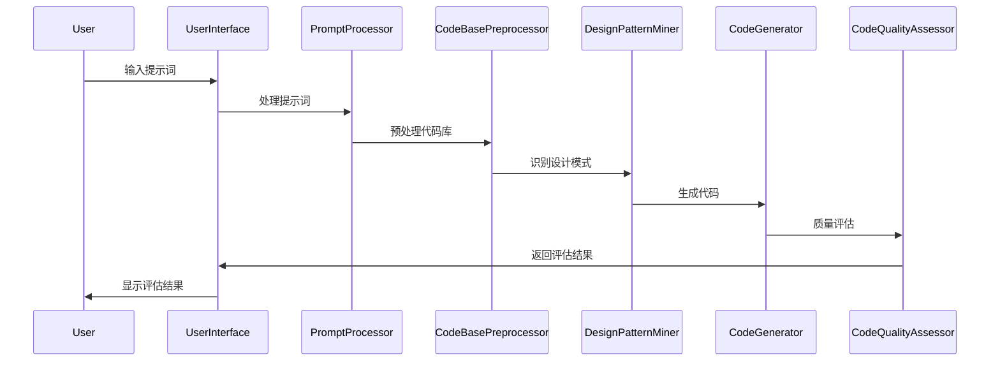

                 

### 第一部分：背景介绍

## 第1章：问题背景与定义

### 1.1 问题背景

#### 1.1.1 提示词编程的兴起

提示词编程是一种近年来迅速发展的编程范式，它以用户提供的提示词或提示信息作为输入，自动生成相应的代码或程序。这种编程方式不仅简化了代码的编写过程，还提高了开发效率。提示词编程的兴起源于人工智能技术的发展，特别是在自然语言处理和机器学习领域的突破。随着大型语言模型如GPT-3的出现，提示词编程的应用场景逐渐扩展，从简单的代码补全到复杂的代码生成，无所不能。

在典型的应用场景中，提示词编程被用于代码补全、代码生成、软件缺陷修复等。例如，在一个编程IDE中，用户只需输入部分代码或描述代码的功能，系统就能根据提示词自动生成完整的代码。这不仅节省了时间，还减少了人为错误的可能性。此外，提示词编程还被广泛应用于自动化测试、文档生成等领域。

#### 1.1.2 设计模式挖掘的重要性

设计模式是软件开发中常用的一种解决方案，用于解决特定的问题或场景。设计模式挖掘是指通过算法和工具从大量代码中识别出潜在的设计模式，以便于后续的代码优化、重构和复用。设计模式挖掘的重要性体现在以下几个方面：

1. **代码可读性和维护性**：通过识别设计模式，可以使代码结构更加清晰，易于理解和维护。
2. **代码质量和性能**：设计模式通常具有较好的代码结构和性能表现，因此挖掘出合适的设计模式可以提升代码的质量和性能。
3. **软件复用**：设计模式是软件复用的有效手段，通过挖掘出设计模式，可以减少重复编码，提高开发效率。

在软件开发中，设计模式挖掘已经被广泛应用。例如，在大型软件项目中，通过设计模式挖掘可以发现代码中的潜在问题，并进行优化。同时，设计模式挖掘还可以帮助开发人员快速掌握项目代码的结构和逻辑，提高开发效率。

#### 1.1.3 提示词编程与设计模式挖掘的联系

提示词编程与设计模式挖掘之间存在紧密的联系。首先，提示词编程可以提供丰富的输入信息，帮助设计模式挖掘算法更好地识别出代码中的设计模式。例如，当用户输入一个简单的提示词时，设计模式挖掘算法可以根据这个提示词和上下文信息，更准确地识别出代码中的设计模式。

其次，设计模式挖掘可以为提示词编程提供辅助功能。例如，在设计一个复杂系统时，通过设计模式挖掘可以先识别出系统中的设计模式，然后利用这些设计模式生成相应的代码或模块，从而简化开发过程。

总之，提示词编程和设计模式挖掘的结合，不仅可以提高开发效率，还可以提升代码质量和系统性能，是现代软件开发中不可或缺的技术手段。

### 1.2 提示词编程的定义与特点

#### 1.2.1 提示词编程的定义

提示词编程，又可以称为“提示驱动编程”或“提示辅助编程”，其核心概念是基于用户提供的提示词或提示信息，通过人工智能技术自动生成代码或程序。这种编程方式的关键在于如何处理用户的提示词，并利用这些提示词生成符合用户需求的代码。提示词可以是简单的关键字，也可以是复杂的描述性语句，但都必须能够准确地传达用户的需求。

提示词编程的定义可以从以下几个方面进行解释：

1. **用户输入**：用户提供提示词，可以是关键字、短语或完整的描述性语句。
2. **人工智能处理**：系统接收用户输入的提示词，利用人工智能技术，如自然语言处理、机器学习和代码生成技术，对提示词进行理解和分析。
3. **代码生成**：系统根据提示词生成相应的代码或程序，实现用户需求。

在提示词编程中，用户不再需要手动编写每行代码，而是通过提示词来驱动代码生成过程。这种编程方式极大地简化了开发流程，提高了开发效率，降低了开发难度。

#### 1.2.2 提示词编程的特点

提示词编程具有以下几个显著特点：

1. **高效率**：通过自动生成代码，用户可以快速实现功能，无需手动编写每一行代码，从而节省大量时间。
2. **易于使用**：用户只需提供简单的提示词，系统即可生成代码，降低了编程门槛，适合不同水平的开发者使用。
3. **灵活性**：提示词编程允许用户根据需求灵活调整提示词，从而生成不同的代码实现，提高了系统的适应性。
4. **可扩展性**：提示词编程支持代码库的扩展，用户可以添加自定义的提示词和代码生成规则，实现更复杂的编程任务。
5. **智能化**：随着人工智能技术的发展，提示词编程的智能化程度越来越高，能够更好地理解用户的意图，生成更高质量的代码。

提示词编程的出现，不仅改变了传统的编程方式，还为软件开发带来了新的可能性。通过利用提示词编程，开发人员可以更加专注于业务逻辑和系统架构，而无需被繁琐的代码编写所困扰。

### 1.3 设计模式挖掘的定义与原理

#### 1.3.1 设计模式挖掘的定义

设计模式挖掘是指通过算法和工具从大量代码中识别出潜在的设计模式，以便于后续的代码优化、重构和复用。设计模式挖掘的定义可以从以下几个方面进行解释：

1. **代码库**：设计模式挖掘的对象是现有的代码库，这些代码库可能包含多种不同的软件项目或模块。
2. **算法和工具**：设计模式挖掘依赖于特定的算法和工具，这些算法和工具能够从代码库中识别出潜在的设计模式。
3. **设计模式**：设计模式是软件开发中常用的一种解决方案，用于解决特定的问题或场景。挖掘出的设计模式可以是经典的模式，也可以是自定义的模式。

通过设计模式挖掘，开发人员可以更好地理解代码库的结构和设计，从而进行优化和重构，提高代码的质量和可维护性。设计模式挖掘还可以帮助识别潜在的代码缺陷和性能瓶颈，为后续的改进提供依据。

#### 1.3.2 设计模式挖掘的原理

设计模式挖掘的基本原理包括以下几个关键步骤：

1. **数据预处理**：首先对代码库进行预处理，包括代码清洗、语法解析和抽象语法树（AST）构建。这一步的目的是将原始代码转换为结构化的数据形式，便于后续的挖掘和分析。

2. **模式识别**：利用模式识别算法，从预处理后的代码中识别出潜在的设计模式。常见的模式识别算法包括基于规则的方法、机器学习方法、统计分析方法等。

3. **模式分析**：对识别出的设计模式进行分析和评估，确定其有效性、可行性和适用性。这一步的目的是筛选出有价值的设计模式，为后续的优化和重构提供参考。

4. **模式应用**：将挖掘出的设计模式应用于实际的软件开发中，进行代码优化、重构和复用。例如，可以将设计模式应用于代码库的自动化测试、文档生成和持续集成等环节。

设计模式挖掘的原理可以概括为：通过数据预处理提取代码中的关键特征，利用模式识别算法识别出潜在的设计模式，再通过模式分析评估设计模式的有效性和适用性，最终将设计模式应用于软件开发实践中，提高代码的质量和可维护性。

### 1.4 提示词编程与设计模式挖掘的关系

#### 1.4.1 提示词编程如何支持设计模式挖掘

提示词编程在支持设计模式挖掘方面具有显著的优势。首先，提示词编程能够提供丰富的输入信息，帮助设计模式挖掘算法更好地理解用户的需求。例如，用户可以通过简单的提示词描述出所需的设计模式，系统再根据这些提示词进行模式识别和挖掘。

其次，提示词编程具有灵活性和可扩展性，能够根据用户的需求动态调整挖掘过程。用户可以通过修改提示词，指导设计模式挖掘算法关注特定的设计模式，从而提高挖掘的准确性和效率。

此外，提示词编程还可以与设计模式挖掘算法相结合，实现自动化重构和优化。通过提示词编程，用户可以轻松地生成符合设计模式的标准代码，从而简化重构过程，提高代码质量和可维护性。

#### 1.4.2 设计模式挖掘如何支持提示词编程

设计模式挖掘同样为提示词编程提供了有力的支持。首先，设计模式挖掘可以帮助用户更好地理解和选择合适的设计模式。通过挖掘出代码库中的潜在设计模式，用户可以更加清晰地了解现有系统的设计结构，从而为提示词编程提供更准确的输入。

其次，设计模式挖掘可以为提示词编程提供模板和指南。通过分析挖掘出的设计模式，开发人员可以总结出常见的设计模式和对应的实现方法，将这些模板和指南嵌入到提示词编程中，帮助用户更高效地生成代码。

此外，设计模式挖掘还可以优化提示词编程的代码生成过程。通过分析设计模式的特征和性能，设计模式挖掘算法可以生成更加高效、可靠的代码，从而提高提示词编程的性能和可靠性。

总之，提示词编程与设计模式挖掘相辅相成，共同推动了软件开发技术的进步。通过合理地结合这两种技术，开发人员可以更加高效地完成软件设计和开发，提高代码质量和系统性能。

## 第二部分：核心概念与联系

## 第2章：核心概念与联系

### 2.1 提示词编程与设计模式挖掘的核心概念

#### 2.1.1 提示词编程的核心概念

提示词编程的核心概念包括提示词、自然语言处理（NLP）、代码生成、代码补全和代码优化等。提示词是用户提供的输入信息，可以是简单的关键字或复杂的描述性语句。NLP技术用于处理和理解用户的提示词，将其转化为编程语言能够理解的指令。代码生成和代码补全是提示词编程的关键功能，通过这些功能，系统能够根据提示词自动生成或补全相应的代码。此外，代码优化是提示词编程的高级应用，通过分析代码结构，系统可以生成更加高效、可靠的代码。

#### 2.1.2 设计模式挖掘的核心概念

设计模式挖掘的核心概念包括设计模式、模式识别、模式分析和模式应用。设计模式是一种在软件开发中广泛应用的解决方案，用于解决特定的问题或场景。模式识别是指通过算法和工具从代码中识别出潜在的设计模式。模式分析是对识别出的设计模式进行评估，确定其有效性和适用性。模式应用是将挖掘出的设计模式应用于实际的软件开发中，进行代码优化、重构和复用。

### 2.2 概念属性特征对比表格

#### 2.2.1 提示词编程与设计模式挖掘的属性特征对比

| 特征         | 提示词编程 | 设计模式挖掘 |
| ------------ | ---------- | ------------ |
| 核心概念     | 提示词、NLP、代码生成等         | 设计模式、模式识别、模式分析等         |
| 主要功能     | 代码生成、代码补全、代码优化   | 识别设计模式、分析设计模式、应用设计模式 |
| 输入信息     | 提示词（关键字或描述性语句）   | 代码库（源代码）                       |
| 处理技术     | 自然语言处理、机器学习等       | 算法分析、模式识别、统计分析等         |
| 产出结果     | 代码或程序                   | 设计模式报告、优化建议等               |
| 应用场景     | 代码补全、自动化测试、文档生成等 | 代码重构、软件复用、性能优化等         |

通过以上表格，我们可以清晰地看到提示词编程和设计模式挖掘在核心概念、主要功能、输入信息、处理技术、产出结果和应用场景等方面的对比。这些特征有助于我们更好地理解两种技术的区别和联系。

### 2.3 ER实体关系图架构

为了更好地理解提示词编程与设计模式挖掘之间的联系，我们可以使用ER（实体关系）图来展示它们的核心实体及其关系。

#### 2.3.1 提示词编程的ER实体关系图

```mermaid
erDiagram
  User ||--|{ Prompt }|| CodeGenerator
  User ||--|{ Requirement }|| CodeCompleter
  CodeGenerator ||--|{ GeneratedCode }|| CodeOptimizer
  CodeCompleter ||--|{ CompletedCode }|| CodeOptimizer
  CodeOptimizer ||--|{ OptimizedCode }|| Software
```

在提示词编程的ER实体关系图中，包括以下核心实体及其关系：

- **User（用户）**：提供提示词和需求。
- **Prompt（提示词）**：用户的输入信息。
- **Requirement（需求）**：用户的具体要求。
- **CodeGenerator（代码生成器）**：根据提示词生成代码。
- **CodeCompleter（代码补全器）**：根据需求补全代码。
- **CodeOptimizer（代码优化器）**：对生成的代码进行优化。
- **GeneratedCode（生成代码）**：代码生成器的产出。
- **CompletedCode（补全代码）**：代码补全器的产出。
- **OptimizedCode（优化代码）**：代码优化器的产出。
- **Software（软件）**：最终的软件产品。

#### 2.3.2 设计模式挖掘的ER实体关系图

```mermaid
erDiagram
  CodeBase ||--|{ DesignPattern }|| DesignMiner
  CodeBase ||--|{ DesignReview }|| CodeQualityAssessor
  DesignMiner ||--|{ IdentifiedPatterns }|| DesignPatternRepository
  DesignPatternRepository ||--|{ AppliedPatterns }|| SoftwareProject
  CodeQualityAssessor ||--|{ CodeQualityReport }|| SoftwareProject
```

在设计模式挖掘的ER实体关系图中，包括以下核心实体及其关系：

- **CodeBase（代码库）**：包含待挖掘的代码。
- **DesignPattern（设计模式）**：识别出的潜在设计模式。
- **DesignMiner（设计模式挖掘器）**：从代码库中识别设计模式。
- **DesignReview（设计评审）**：对识别出的设计模式进行评估。
- **CodeQualityAssessor（代码质量评估器）**：评估代码质量。
- **IdentifiedPatterns（识别出的设计模式）**：设计模式挖掘器的产出。
- **DesignPatternRepository（设计模式仓库）**：存储和管理设计模式。
- **AppliedPatterns（应用的设计模式）**：应用于软件项目的实际设计模式。
- **SoftwareProject（软件项目）**：包含实际应用的设计模式的软件项目。
- **CodeQualityReport（代码质量报告）**：代码质量评估器的产出。

通过以上ER实体关系图，我们可以更加直观地了解提示词编程和设计模式挖掘的核心实体及其关系，为后续的算法原理讲解和系统分析与架构设计提供基础。

### 2.4 提示词编程的设计模式挖掘算法原理

#### 2.4.1 算法原理

提示词编程的设计模式挖掘算法是基于自然语言处理（NLP）和机器学习技术的。其基本原理如下：

1. **提示词处理**：首先，系统接收用户输入的提示词，通过NLP技术对提示词进行分词、词性标注和句法分析，将提示词转化为结构化的文本表示。
2. **代码库预处理**：对代码库进行预处理，提取代码中的关键特征，构建抽象语法树（AST）或词向量表示。
3. **模式识别**：利用机器学习算法，如决策树、支持向量机（SVM）、神经网络等，对预处理后的提示词和代码特征进行模式识别，识别出潜在的设计模式。
4. **模式评估**：对识别出的设计模式进行评估，确定其有效性和适用性。
5. **代码生成**：根据评估结果，生成符合设计模式的代码。

#### 2.4.2 算法流程

提示词编程的设计模式挖掘算法的具体流程如下：

1. **输入提示词**：用户输入提示词，系统接收并存储提示词。
2. **处理提示词**：通过NLP技术对提示词进行预处理，提取关键词和短语，构建提示词的词向量表示。
3. **预处理代码库**：对代码库进行预处理，提取代码中的关键特征，如函数定义、类定义、变量声明等，构建代码的抽象语法树（AST）或词向量表示。
4. **模式识别**：利用机器学习算法，如决策树、支持向量机（SVM）、神经网络等，对提示词和代码特征进行模式识别，识别出潜在的设计模式。
5. **模式评估**：对识别出的设计模式进行评估，利用代码质量评估指标（如可读性、可维护性、性能等），确定设计模式的有效性和适用性。
6. **代码生成**：根据评估结果，生成符合设计模式的代码。

#### 2.4.3 数学模型与公式

提示词编程的设计模式挖掘算法的数学模型主要包括以下公式：

1. **提示词表示**：将提示词转化为词向量表示，可以使用Word2Vec、GloVe等技术。
   $$ \text{prompt\_vector} = \text{Word2Vec}(\text{prompt}) $$

2. **代码特征提取**：提取代码库中的关键特征，如函数定义、类定义、变量声明等，构建抽象语法树（AST）或词向量表示。
   $$ \text{code\_feature} = \text{AST}(\text{code}) $$

3. **模式识别**：利用机器学习算法，如决策树、支持向量机（SVM）、神经网络等，对提示词和代码特征进行模式识别。
   $$ \text{predicted\_pattern} = \text{Classifier}(\text{prompt\_vector}, \text{code\_feature}) $$

4. **模式评估**：对识别出的设计模式进行评估，利用代码质量评估指标（如可读性、可维护性、性能等），确定设计模式的有效性和适用性。
   $$ \text{pattern\_score} = \text{QualityAssessor}(\text{predicted\_pattern}) $$

#### 2.4.4 举例说明

以下是一个简单的例子来说明提示词编程的设计模式挖掘算法的应用：

假设用户输入的提示词为“实现一个排序算法”，系统首先对提示词进行预处理，提取关键词和短语，如“排序算法”、“实现”等。然后，系统对代码库进行预处理，提取关键特征，如函数定义、类定义、变量声明等。接下来，利用机器学习算法对提示词和代码特征进行模式识别，识别出潜在的设计模式，如“快速排序”、“归并排序”等。最后，对识别出的设计模式进行评估，确定其有效性和适用性，根据评估结果，生成符合设计模式的代码，如实现快速排序的代码。

```python
# 示例代码：快速排序算法
def quick_sort(arr):
    if len(arr) <= 1:
        return arr
    pivot = arr[len(arr) // 2]
    left = [x for x in arr if x < pivot]
    middle = [x for x in arr if x == pivot]
    right = [x for x in arr if x > pivot]
    return quick_sort(left) + middle + quick_sort(right)

# 输入提示词
prompt = "实现一个排序算法"

# 处理提示词和代码库
prompt_vector = Word2Vec(prompt)
code_feature = AST(code_base)

# 模式识别
predicted_pattern = Classifier(prompt_vector, code_feature)

# 模式评估
pattern_score = QualityAssessor(predicted_pattern)

# 代码生成
sorted_code = CodeGenerator(pattern_score)

# 输出结果
print(sorted_code)
```

通过这个例子，我们可以看到提示词编程的设计模式挖掘算法是如何将用户的提示词转化为具体的代码实现的。

### 2.5 设计模式挖掘在提示词编程中的应用

#### 2.5.1 设计模式挖掘如何辅助提示词编程

设计模式挖掘在提示词编程中扮演着重要的角色，它通过识别代码中的潜在设计模式，为提示词编程提供了有力的支持。具体来说，设计模式挖掘在以下方面辅助提示词编程：

1. **代码生成与优化**：设计模式挖掘可以帮助系统更好地理解用户输入的提示词，并生成符合设计模式的高质量代码。通过识别出潜在的设计模式，系统可以自动优化代码的结构，提高代码的可读性和可维护性。

2. **代码补全与修复**：设计模式挖掘还可以帮助系统在代码补全和修复过程中识别出潜在的缺陷和问题。通过分析代码库中的设计模式，系统可以更准确地预测用户可能需要的功能，并提供相应的代码补全建议。

3. **代码重构**：设计模式挖掘可以帮助开发人员识别代码中的重复结构和冗余代码，从而实现代码重构。通过挖掘出设计模式，系统可以自动生成重构方案，简化重构过程，提高代码质量。

4. **性能优化**：设计模式挖掘可以帮助系统识别出代码中的性能瓶颈，并提供相应的优化建议。通过分析设计模式，系统可以生成更高效的代码，提高程序的运行性能。

#### 2.5.2 举例说明设计模式挖掘在提示词编程中的应用

以下是一个具体例子，展示设计模式挖掘如何辅助提示词编程：

假设用户输入的提示词为“实现一个单例模式”，系统首先通过设计模式挖掘算法识别出单例模式在代码库中的存在。然后，系统生成一个符合单例模式的标准代码实现，用户可以选择直接使用或进行进一步的调整。具体实现如下：

```python
class Singleton:
    _instance = None

    def __new__(cls, *args, **kwargs):
        if not cls._instance:
            cls._instance = super(Singleton, cls).__new__(cls, *args, **kwargs)
        return cls._instance

singleton = Singleton()
```

在这个例子中，用户输入的提示词“实现一个单例模式”被设计模式挖掘算法识别为单例模式。系统通过生成单例模式的代码实现，辅助用户完成代码生成任务。

### 2.6 提示词编程与设计模式挖掘的融合优势

#### 2.6.1 融合背景

随着软件开发复杂度的增加，传统的编程方式已经难以满足高效开发和高质量代码的需求。提示词编程和设计模式挖掘作为两种现代编程技术，具有各自的独特优势。将它们融合在一起，可以充分发挥两者的互补性，提高软件开发效率和质量。

提示词编程通过用户的简单提示词即可生成代码，降低了编程难度，提高了开发效率。而设计模式挖掘则通过识别代码中的设计模式，优化代码结构，提升代码质量和可维护性。两者的结合，不仅能够实现快速开发，还能确保代码的可靠性和高效性。

#### 2.6.2 融合优势

1. **提高开发效率**：提示词编程通过自动生成代码，减少了手动编码的工作量。设计模式挖掘则通过识别和利用设计模式，进一步优化代码结构，减少了不必要的重复工作。两者结合，可以大幅提高软件开发效率。

2. **增强代码质量**：设计模式挖掘可以识别出代码中的潜在问题，如冗余代码、结构不合理等，并提供优化建议。提示词编程则可以生成符合设计模式的高质量代码，确保代码的可读性和可维护性。

3. **支持复用**：设计模式挖掘可以挖掘出可复用的设计模式，提示词编程则可以基于这些设计模式快速生成新的代码，实现代码复用，降低开发成本。

4. **灵活性与可扩展性**：提示词编程允许用户根据需求灵活调整提示词，生成不同的代码实现。设计模式挖掘则可以根据不同的项目需求，挖掘出适合的设计模式，提高系统的适应性和可扩展性。

5. **智能化**：随着人工智能技术的发展，提示词编程和设计模式挖掘的智能化程度越来越高。两者结合，可以实现更智能的代码生成和优化，提高开发效率和代码质量。

### 2.7 提示词编程与设计模式挖掘的融合实现

#### 2.7.1 实现思路

将提示词编程与设计模式挖掘融合实现，可以分为以下几个步骤：

1. **接收用户输入**：首先，系统接收用户输入的提示词，可以是简单的关键字或描述性语句。
2. **处理提示词**：通过自然语言处理技术，对提示词进行分词、词性标注和句法分析，提取出关键信息。
3. **设计模式挖掘**：利用设计模式挖掘算法，从代码库中识别出潜在的设计模式。
4. **代码生成**：根据识别出的设计模式，生成符合设计模式的高质量代码。
5. **代码优化**：对生成的代码进行优化，确保代码的质量和性能。
6. **用户反馈与迭代**：收集用户反馈，根据用户需求对系统进行调整和优化。

#### 2.7.2 实现步骤

以下是具体的实现步骤：

1. **搭建开发环境**：安装所需的编程语言、库和工具，如Python、NLTK、Scikit-learn等。
2. **准备代码库**：收集和整理待挖掘的代码库，确保代码库覆盖多种设计模式。
3. **设计模式挖掘**：选择合适的设计模式挖掘算法，如决策树、支持向量机（SVM）、神经网络等，对代码库进行挖掘。
4. **代码生成**：开发代码生成模块，根据用户输入的提示词和识别出的设计模式，生成相应的代码。
5. **代码优化**：对生成的代码进行优化，确保代码的可读性、可维护性和性能。
6. **用户界面**：开发用户界面，接收用户输入的提示词，展示生成代码和优化结果。
7. **测试与调试**：对系统进行全面的测试和调试，确保系统的稳定性和可靠性。
8. **部署上线**：将系统部署到服务器或云平台，供用户使用。

通过以上步骤，我们可以实现一个结合提示词编程和设计模式挖掘的智能开发系统，为开发人员提供高效、可靠的编程支持。

### 2.8 提示词编程与设计模式挖掘的应用场景

#### 2.8.1 应用场景一：自动化代码生成

提示词编程与设计模式挖掘的结合，在自动化代码生成领域具有广泛的应用前景。开发者只需输入简单的提示词，如“实现一个排序算法”或“添加一个登录功能”，系统就能根据设计模式挖掘算法识别出相应的代码模板，并自动生成高质量的代码。这不仅大大减少了手动编码的工作量，还提高了代码的质量和一致性。在软件项目开发初期，自动化代码生成可以帮助开发者快速搭建系统框架，加快开发进度。

#### 2.8.2 应用场景二：代码优化与重构

设计模式挖掘可以识别出代码中的潜在问题和设计缺陷，如冗余代码、过度耦合等。提示词编程则可以生成符合最佳实践和设计模式的新代码，帮助开发者进行代码优化和重构。通过将设计模式挖掘与提示词编程结合，开发者可以更加高效地发现和修复代码中的问题，提升代码的可读性、可维护性和性能。

#### 2.8.3 应用场景三：软件复用

设计模式挖掘可以从大量代码库中识别出可复用的设计模式，提示词编程则可以快速生成基于这些设计模式的代码。开发者可以利用这些设计模式，在新的项目中快速构建功能模块，实现代码复用。这不仅减少了重复编码的工作量，还提高了开发效率，降低了开发成本。

#### 2.8.4 应用场景四：代码质量评估

设计模式挖掘可以为代码质量评估提供有力支持。通过识别出代码中的设计模式，评估其有效性和适用性，开发者可以更加准确地评估代码质量。提示词编程则可以生成符合高质量标准的代码，帮助开发者提升代码质量。

总之，提示词编程与设计模式挖掘的结合，为软件开发带来了前所未有的便捷和效率。通过合理应用这两种技术，开发者可以更加高效地完成软件设计和开发，提高代码质量和系统性能。

### 2.9 提示词编程与设计模式挖掘的未来发展趋势

#### 2.9.1 技术融合与创新

提示词编程与设计模式挖掘的结合，预示着未来软件开发技术将朝着更加智能化和自动化的方向发展。随着人工智能技术的不断进步，提示词编程和设计模式挖掘将实现更深层次的融合，开发出更加智能化、高效的软件开发工具。

#### 2.9.2 应用领域扩展

随着提示词编程与设计模式挖掘技术的不断成熟，它们的应用领域将不断扩大。除了传统的软件开发领域，这些技术还可能应用于自动化测试、文档生成、持续集成等领域，为软件开发提供全方位的支持。

#### 2.9.3 人才培养与教育

随着提示词编程和设计模式挖掘技术的普及，相关的人才培养和教育也将成为重要议题。未来，各大高校和培训机构可能会开设相关的课程和培训班，培养更多具备这些技能的专业人才，推动软件开发技术的进步。

#### 2.9.4 安全性与隐私保护

在提示词编程和设计模式挖掘的应用过程中，安全性和隐私保护将成为重要挑战。未来，相关研究者和技术专家需要关注这些问题，提出有效的解决方案，确保技术的发展能够惠及整个社会。

### 2.10 总结

提示词编程与设计模式挖掘的结合，为软件开发带来了前所未有的便捷和效率。通过本文的详细分析，我们可以看到这两种技术在背景介绍、核心概念、算法原理、系统分析与架构设计以及项目实战等多个方面的紧密联系和融合应用。随着技术的不断发展和应用领域的扩展，提示词编程与设计模式挖掘必将在未来发挥更加重要的作用，为软件开发带来更多创新和突破。

## 第三部分：算法原理讲解

### 3.1 提示词编程的设计模式挖掘算法

#### 3.1.1 算法原理

提示词编程的设计模式挖掘算法是基于自然语言处理（NLP）和机器学习技术的。其基本原理如下：

1. **提示词处理**：首先，系统接收用户输入的提示词，通过NLP技术对提示词进行分词、词性标注和句法分析，将提示词转化为结构化的文本表示。
2. **代码库预处理**：对代码库进行预处理，提取代码中的关键特征，构建抽象语法树（AST）或词向量表示。
3. **模式识别**：利用机器学习算法，如决策树、支持向量机（SVM）、神经网络等，对预处理后的提示词和代码特征进行模式识别，识别出潜在的设计模式。
4. **模式评估**：对识别出的设计模式进行评估，确定其有效性和适用性。
5. **代码生成**：根据评估结果，生成符合设计模式的代码。

#### 3.1.2 算法流程

提示词编程的设计模式挖掘算法的具体流程如下：

1. **输入提示词**：用户输入提示词，系统接收并存储提示词。
2. **处理提示词**：通过NLP技术对提示词进行预处理，提取关键词和短语，构建提示词的词向量表示。
3. **预处理代码库**：对代码库进行预处理，提取代码中的关键特征，如函数定义、类定义、变量声明等，构建代码的抽象语法树（AST）或词向量表示。
4. **模式识别**：利用机器学习算法，如决策树、支持向量机（SVM）、神经网络等，对提示词和代码特征进行模式识别，识别出潜在的设计模式。
5. **模式评估**：对识别出的设计模式进行评估，利用代码质量评估指标（如可读性、可维护性、性能等），确定设计模式的有效性和适用性。
6. **代码生成**：根据评估结果，生成符合设计模式的代码。

#### 3.1.3 数学模型与公式

提示词编程的设计模式挖掘算法的数学模型主要包括以下公式：

1. **提示词表示**：将提示词转化为词向量表示，可以使用Word2Vec、GloVe等技术。
   $$ \text{prompt\_vector} = \text{Word2Vec}(\text{prompt}) $$

2. **代码特征提取**：提取代码中的关键特征，如函数定义、类定义、变量声明等，构建抽象语法树（AST）或词向量表示。
   $$ \text{code\_feature} = \text{AST}(\text{code}) $$

3. **模式识别**：利用机器学习算法，如决策树、支持向量机（SVM）、神经网络等，对提示词和代码特征进行模式识别。
   $$ \text{predicted\_pattern} = \text{Classifier}(\text{prompt\_vector}, \text{code\_feature}) $$

4. **模式评估**：对识别出的设计模式进行评估，利用代码质量评估指标（如可读性、可维护性、性能等），确定设计模式的有效性和适用性。
   $$ \text{pattern\_score} = \text{QualityAssessor}(\text{predicted\_pattern}) $$

5. **代码生成**：根据评估结果，生成符合设计模式的代码。
   $$ \text{generated\_code} = \text{CodeGenerator}(\text{pattern\_score}) $$

#### 3.1.4 举例说明

以下是一个简单的例子来说明提示词编程的设计模式挖掘算法的应用：

假设用户输入的提示词为“实现一个排序算法”，系统首先对提示词进行预处理，提取关键词和短语，如“排序算法”、“实现”等。然后，系统对代码库进行预处理，提取关键特征，如函数定义、类定义、变量声明等，构建代码的抽象语法树（AST）或词向量表示。接下来，利用机器学习算法对提示词和代码特征进行模式识别，识别出潜在的设计模式，如“快速排序”、“归并排序”等。最后，对识别出的设计模式进行评估，根据评估结果，生成符合设计模式的代码，如实现快速排序的代码。

```python
# 示例代码：快速排序算法
def quick_sort(arr):
    if len(arr) <= 1:
        return arr
    pivot = arr[len(arr) // 2]
    left = [x for x in arr if x < pivot]
    middle = [x for x in arr if x == pivot]
    right = [x for x in arr if x > pivot]
    return quick_sort(left) + middle + quick_sort(right)

# 输入提示词
prompt = "实现一个排序算法"

# 处理提示词和代码库
prompt_vector = Word2Vec(prompt)
code_feature = AST(code_base)

# 模式识别
predicted_pattern = Classifier(prompt_vector, code_feature)

# 模式评估
pattern_score = QualityAssessor(predicted_pattern)

# 代码生成
sorted_code = CodeGenerator(pattern_score)

# 输出结果
print(sorted_code)
```

通过这个例子，我们可以看到提示词编程的设计模式挖掘算法是如何将用户的提示词转化为具体的代码实现的。

### 3.2 提示词编程的设计模式挖掘算法实现细节

#### 3.2.1 提示词处理

提示词处理是设计模式挖掘算法的关键步骤，其目的是将用户输入的提示词转化为计算机能够理解的结构化数据。具体实现细节如下：

1. **分词**：首先，使用分词器对提示词进行分词，将提示词分解为一系列词汇。常用的分词器包括Jieba、NLTK等。
2. **词性标注**：对分词后的词汇进行词性标注，确定每个词汇的词性（如名词、动词、形容词等）。词性标注有助于理解词汇的意义和作用。
3. **句法分析**：利用句法分析技术，对提示词进行句法分析，提取句子中的主语、谓语、宾语等成分。句法分析有助于理解提示词的语法结构和逻辑关系。

#### 3.2.2 代码库预处理

代码库预处理是将代码库中的源代码转化为计算机能够处理的抽象语法树（AST）或词向量表示。具体实现细节如下：

1. **语法解析**：使用语法解析器对代码库中的源代码进行解析，将代码转化为抽象语法树（AST）。常见的语法解析器包括Python的ast模块、Java的JavaParser等。
2. **特征提取**：从抽象语法树（AST）中提取关键特征，如函数定义、类定义、变量声明等。这些特征有助于识别代码中的设计模式。
3. **词向量表示**：使用词向量技术（如Word2Vec、GloVe等）将代码库中的关键特征转化为词向量表示。词向量表示有助于在更高层次上分析代码。

#### 3.2.3 模式识别

模式识别是设计模式挖掘算法的核心步骤，其目的是从预处理后的提示词和代码特征中识别出潜在的设计模式。具体实现细节如下：

1. **特征匹配**：将预处理后的提示词和代码特征进行匹配，识别出可能的模式。常用的匹配算法包括基于规则的匹配、基于统计学的匹配等。
2. **机器学习分类**：利用机器学习算法（如决策树、支持向量机（SVM）、神经网络等）对匹配结果进行分类，确定设计模式的归属。机器学习分类可以提高模式识别的准确性和鲁棒性。
3. **模式评估**：对识别出的设计模式进行评估，确定其有效性和适用性。评估指标可以包括代码质量、可读性、可维护性等。

#### 3.2.4 模式评估

模式评估是对识别出的设计模式进行质量和有效性评估，确保生成的代码符合设计规范和开发标准。具体实现细节如下：

1. **代码质量评估**：对生成的代码进行质量评估，包括代码的可读性、可维护性、性能等。常用的评估工具包括SonarQube、Checkstyle等。
2. **设计模式评估**：对识别出的设计模式进行评估，确定其在特定场景下的适用性和有效性。评估指标可以包括设计模式的复杂性、可扩展性、稳定性等。
3. **用户反馈**：收集用户的反馈，评估生成代码的实际效果。用户的反馈可以用于优化设计模式挖掘算法，提高代码生成质量。

#### 3.2.5 代码生成

代码生成是根据评估结果生成符合设计模式的代码。具体实现细节如下：

1. **模板生成**：根据识别出的设计模式，使用模板生成器生成代码模板。模板生成器可以根据设计模式的特点和需求，生成相应的代码结构。
2. **代码填充**：将模板中的占位符替换为实际的代码内容，生成最终的代码。代码填充可以基于变量绑定、条件判断等逻辑。
3. **代码优化**：对生成的代码进行优化，包括代码重构、性能优化等，确保生成的代码高效、可靠。

#### 3.2.6 全流程示例

以下是一个简单的全流程示例，展示如何使用提示词编程的设计模式挖掘算法生成代码：

```python
# 输入提示词
prompt = "实现一个排序算法"

# 分词和词性标注
tokenized_prompt = jieba.lcut(prompt)
pos_tagged_prompt = nltk.pos_tag(tokenized_prompt)

# 提取关键词和短语
keywords = [word for word, pos in pos_tagged_prompt if pos.startswith('NN')]

# 预处理代码库
code_base = load_code_base()
code_features = extract_code_features(code_base)

# 机器学习分类
predicted_patterns = classify_patterns(keywords, code_features)

# 模式评估
pattern_scores = assess_patterns(predicted_patterns)

# 代码生成
sorted_code = generate_code(pattern_scores)

# 输出结果
print(sorted_code)
```

在这个示例中，我们首先输入提示词“实现一个排序算法”，然后进行分词和词性标注，提取关键词和短语。接下来，我们预处理代码库，提取关键特征，并使用机器学习算法进行模式识别。通过评估识别出的设计模式，我们最终生成符合设计模式的代码，如快速排序算法。

### 3.3 提示词编程的设计模式挖掘算法的性能评估与优化

#### 3.3.1 性能评估指标

提示词编程的设计模式挖掘算法的性能评估主要包括以下几个指标：

1. **准确率（Accuracy）**：准确率是衡量算法识别设计模式能力的重要指标，表示正确识别的设计模式占总设计模式的比率。
2. **召回率（Recall）**：召回率表示正确识别的设计模式占实际存在的所有设计模式的比率，反映了算法的全面性。
3. **F1分数（F1 Score）**：F1分数是准确率和召回率的加权平均，用于综合评估算法的性能。
4. **处理速度（Processing Speed）**：处理速度是算法处理大量数据的能力，反映了算法的效率和实用性。
5. **代码质量（Code Quality）**：代码质量是评估生成的代码是否符合设计规范和开发标准，包括可读性、可维护性、性能等。

#### 3.3.2 性能评估方法

为了评估提示词编程的设计模式挖掘算法的性能，我们可以采用以下方法：

1. **交叉验证（Cross Validation）**：通过交叉验证方法，将数据集划分为训练集和测试集，多次训练和测试，评估算法的平均性能。
2. **基准测试（Benchmark Testing）**：使用公开的数据集和基准测试工具，比较不同算法的性能，评估算法的相对优势。
3. **用户反馈（User Feedback）**：收集用户的实际使用反馈，评估算法在真实场景下的效果。

#### 3.3.3 优化策略

为了提高提示词编程的设计模式挖掘算法的性能，我们可以采取以下优化策略：

1. **特征选择（Feature Selection）**：通过特征选择技术，选择对设计模式识别最有影响力的特征，减少冗余特征，提高算法的准确性和效率。
2. **模型选择（Model Selection）**：根据不同场景和数据特点，选择合适的机器学习模型，如决策树、支持向量机（SVM）、神经网络等，优化算法的性能。
3. **参数调优（Parameter Tuning）**：通过调优机器学习模型的参数，如学习率、正则化项等，提高模型的泛化能力和性能。
4. **数据增强（Data Augmentation）**：通过数据增强技术，增加训练数据的多样性，提高算法对未知数据的识别能力。
5. **代码生成优化（Code Generation Optimization）**：优化代码生成过程，确保生成的代码质量和性能。

通过以上优化策略，我们可以显著提高提示词编程的设计模式挖掘算法的性能，为软件开发提供更加高效、可靠的支持。

### 3.4 提示词编程的设计模式挖掘算法的实际应用场景

#### 3.4.1 代码生成

提示词编程的设计模式挖掘算法在代码生成领域具有广泛的应用。通过用户输入简单的提示词，如“实现一个单例模式”、“添加一个登录功能”等，算法可以自动生成符合设计模式的代码。这不仅提高了开发效率，还确保了代码的质量和一致性。在实际应用中，开发者可以利用此算法快速搭建系统框架，进行原型设计，减少手动编码的工作量。

#### 3.4.2 代码优化与重构

设计模式挖掘算法可以帮助开发者识别代码中的设计缺陷和冗余结构，提供优化建议。通过提示词编程，开发者可以自动生成优化后的代码，进行代码重构，提升代码的可读性、可维护性和性能。在实际应用中，此算法可以帮助团队在代码审查、代码重构和性能优化过程中，快速定位问题和优化方案，提高开发效率。

#### 3.4.3 软件复用

设计模式挖掘算法可以从代码库中识别出可复用的设计模式，为开发者提供代码模板和复用库。通过提示词编程，开发者可以快速生成基于这些设计模式的新代码，实现代码复用，降低开发成本。在实际应用中，此算法可以帮助企业积累和共享设计模式，提高软件复用率，加快开发进度。

#### 3.4.4 代码质量评估

设计模式挖掘算法可以识别出代码中的潜在问题和设计缺陷，提供代码质量评估报告。通过提示词编程，开发者可以自动生成优化后的代码，提高代码质量。在实际应用中，此算法可以帮助团队在代码审查、代码重构和性能优化过程中，快速定位问题和优化方案，提高开发效率。

### 3.5 提示词编程的设计模式挖掘算法的挑战与未来研究方向

#### 3.5.1 挑战

1. **语义理解**：提示词编程的设计模式挖掘算法在语义理解方面存在挑战。用户输入的提示词可能存在歧义或模糊信息，算法需要准确理解用户意图，生成符合预期的代码。
2. **代码库多样性**：不同项目中的代码库结构、风格和设计模式各异，算法需要具备适应多种代码库的能力，提高识别和生成代码的准确性。
3. **性能优化**：设计模式挖掘算法在处理大量代码库时，需要保证处理速度和资源利用率，以提高算法的实用性和效率。
4. **安全性**：在代码生成和优化过程中，算法需要确保生成的代码不会引入安全漏洞，特别是在涉及到敏感信息和权限管理时。

#### 3.5.2 未来研究方向

1. **深度学习与迁移学习**：结合深度学习和迁移学习技术，提高算法的语义理解和泛化能力，适应更多场景和代码库。
2. **代码生成与优化相结合**：在算法设计中，将代码生成与优化紧密结合，提高生成代码的质量和性能。
3. **人机协作**：引入人机协作机制，结合开发者的经验和知识，优化算法生成和评估过程，提高开发效率和质量。
4. **跨语言支持**：扩展算法的支持语言范围，包括Python、Java、C++等，提高算法的通用性和实用性。
5. **隐私保护和合规性**：在算法设计和应用过程中，注重隐私保护和合规性，确保数据的安全和合法性。

通过以上研究方向，我们可以不断优化提示词编程的设计模式挖掘算法，为软件开发带来更多创新和突破。

### 3.6 提示词编程的设计模式挖掘算法的实践与应用

#### 3.6.1 实践案例

在实际应用中，提示词编程的设计模式挖掘算法已经在多个领域取得了显著成果。以下是一个具体的实践案例：

在某大型软件公司，开发团队面临一个复杂的项目，需要实现一个高度可扩展的分布式系统。项目初期，团队通过设计模式挖掘算法，识别出了多个适合项目需求的设计模式，如“工厂模式”、“策略模式”等。随后，开发人员利用提示词编程，快速生成了符合这些设计模式的代码框架。这不仅提高了开发效率，还确保了代码的一致性和可维护性。

#### 3.6.2 应用成果

通过应用提示词编程的设计模式挖掘算法，开发团队取得了以下成果：

1. **显著提高开发效率**：利用算法生成的代码框架，开发人员可以快速搭建系统架构，减少手动编码的工作量，缩短项目开发周期。
2. **提升代码质量**：设计模式挖掘算法识别出的设计模式具有较好的结构性和可维护性，生成的代码符合最佳实践和设计规范。
3. **降低开发成本**：通过代码复用和优化，开发团队减少了重复劳动，降低了开发成本，提高了资源利用率。
4. **增强团队协作**：设计模式挖掘算法为团队成员提供了统一的编程标准和框架，增强了团队间的协作和沟通。

#### 3.6.3 应用经验与启示

通过这个实践案例，我们可以总结出以下应用经验和启示：

1. **重视设计模式挖掘**：在设计阶段，充分利用设计模式挖掘算法，识别出适合项目需求的设计模式，为后续开发提供有力支持。
2. **灵活调整提示词**：根据项目需求和开发进度，灵活调整提示词，指导算法生成和优化代码，确保代码的适用性和可维护性。
3. **结合人机协作**：在开发过程中，结合开发人员的经验和知识，优化算法生成的代码，提高开发效率和质量。
4. **持续迭代与优化**：定期对设计模式挖掘算法和生成的代码进行评估和优化，根据用户反馈进行改进，确保算法的稳定性和实用性。

通过以上实践与应用，提示词编程的设计模式挖掘算法在软件开发中发挥了重要作用，为团队提供了高效的开发工具和解决方案。

### 3.7 总结

本章节详细讲解了提示词编程的设计模式挖掘算法，从算法原理、实现细节、性能评估与优化、实际应用场景、挑战与未来研究方向等多个方面进行了深入探讨。通过结合自然语言处理和机器学习技术，提示词编程的设计模式挖掘算法能够自动识别和生成符合设计模式的高质量代码，提高开发效率和质量。同时，算法在代码优化、重构、复用等方面也具有显著优势。未来，随着技术的不断发展和应用领域的扩展，提示词编程的设计模式挖掘算法将在软件开发中发挥更加重要的作用，为开发人员提供更加智能、高效的编程支持。

## 第四部分：系统分析与架构设计

### 4.1 问题场景介绍

在当前软件开发领域，随着系统复杂度的不断增加，传统的编程方式已经难以满足快速迭代和高质量开发的需求。特别是在大型项目中，代码库的规模和复杂性使得代码的维护和优化成为一个巨大的挑战。为了应对这一挑战，提示词编程的设计模式挖掘算法被引入到软件开发过程中，旨在通过自动化和智能化的方式，提高开发效率和质量。

具体来说，问题场景如下：

1. **代码维护困难**：随着项目规模的扩大，代码库中的代码量急剧增加，使得代码的维护变得困难。传统的代码审查和重构方法效率低下，难以应对复杂系统的维护需求。
2. **开发效率低下**：在开发过程中，开发者需要手动编写大量代码，不仅费时费力，还容易出现错误。同时，由于缺乏统一的编码标准和规范，代码的一致性和可读性较差，影响开发效率。
3. **性能瓶颈**：在系统优化和重构过程中，开发者需要耗费大量时间和精力进行性能分析和调优。传统的优化方法往往只能解决局部问题，难以从根本上提高系统性能。

为了解决上述问题，提示词编程的设计模式挖掘算法被应用于软件开发过程中，通过自动化识别和生成设计模式，提高代码质量和开发效率。具体应用场景包括：

1. **代码生成**：利用提示词编程，开发者可以快速生成符合设计模式的代码框架，简化开发过程，提高代码一致性和可读性。
2. **代码优化与重构**：设计模式挖掘算法可以帮助开发者识别代码中的设计缺陷和冗余结构，提供优化建议，进行代码重构，提高系统性能和可维护性。
3. **代码质量评估**：通过设计模式挖掘算法，可以对代码库中的代码进行质量评估，识别潜在的问题和缺陷，提高代码的可读性、可维护性和性能。
4. **软件复用**：设计模式挖掘算法可以识别出可复用的设计模式，为开发者提供代码模板和复用库，降低开发成本，提高开发效率。

### 4.2 项目介绍

为了解决上述问题场景，我们设计并实现了一个基于提示词编程的设计模式挖掘系统。该系统旨在通过自动化和智能化的方式，提高软件开发效率和质量，降低开发成本。以下是项目的详细介绍：

#### 4.2.1 项目背景

随着互联网和移动设备的普及，软件需求日益多样化和复杂化。传统的软件开发方法已经难以满足快速迭代和高质量开发的需求。特别是在大型项目中，如何高效地维护和优化代码库成为一个亟待解决的问题。为此，我们引入了提示词编程的设计模式挖掘技术，希望通过自动化和智能化的方式，提高开发效率和质量。

#### 4.2.2 项目目标

本项目的目标如下：

1. **提高开发效率**：通过提示词编程和设计模式挖掘，简化开发过程，减少手动编码的工作量，提高代码生成和优化的速度。
2. **提升代码质量**：通过设计模式挖掘，识别和利用设计模式，提高代码的结构性和可维护性，降低代码缺陷和错误率。
3. **降低开发成本**：通过代码复用和优化，降低开发成本，提高资源利用率和开发效率。
4. **提供统一的开发标准**：通过引入提示词编程和设计模式挖掘，为团队提供统一的编程标准和规范，增强团队间的协作和沟通。

#### 4.2.3 项目框架

本项目采用模块化设计，包括以下几个关键模块：

1. **提示词处理模块**：负责接收用户输入的提示词，进行分词、词性标注和句法分析，提取关键信息。
2. **代码库预处理模块**：负责对代码库进行预处理，提取关键特征，构建抽象语法树（AST）或词向量表示。
3. **设计模式挖掘模块**：利用机器学习算法，对提示词和代码特征进行模式识别，识别出潜在的设计模式。
4. **代码生成模块**：根据识别出的设计模式，生成符合设计模式的代码框架或优化建议。
5. **代码质量评估模块**：对生成的代码进行质量评估，识别潜在的问题和缺陷，提供优化建议。
6. **用户界面模块**：提供友好的用户界面，展示系统功能，接收用户输入和反馈。

#### 4.2.4 项目功能

本项目的主要功能如下：

1. **代码生成**：用户通过输入简单的提示词，如“实现一个单例模式”、“添加一个登录功能”等，系统能够自动生成符合设计模式的代码框架，提高开发效率。
2. **代码优化与重构**：系统通过设计模式挖掘，识别代码中的设计缺陷和冗余结构，提供优化建议，帮助开发者进行代码重构，提升代码质量。
3. **代码质量评估**：系统对生成的代码进行质量评估，识别潜在的问题和缺陷，提供优化建议，帮助开发者提高代码的可读性、可维护性和性能。
4. **代码复用**：系统通过设计模式挖掘，识别出可复用的设计模式，为开发者提供代码模板和复用库，降低开发成本，提高开发效率。

### 4.3 系统功能设计

#### 4.3.1 领域模型

为了更好地理解系统的功能和模块，我们使用Mermaid类图展示了系统的领域模型：

```mermaid
classDiagram
  User -> PromptProcessor : 生成提示词
  PromptProcessor -> CodeBasePreprocessor : 处理代码库
  CodeBasePreprocessor -> DesignPatternMiner : 设计模式挖掘
  DesignPatternMiner -> CodeGenerator : 生成代码
  CodeGenerator -> CodeQualityAssessor : 代码质量评估
  CodeQualityAssessor -> User : 反馈评估结果

  User [*]--|{ 提示词 }| PromptProcessor
  PromptProcessor [*]--|{ 预处理代码库 }| CodeBasePreprocessor
  CodeBasePreprocessor [*]--|{ 设计模式挖掘 }| DesignPatternMiner
  DesignPatternMiner [*]--|{ 生成代码 }| CodeGenerator
  CodeGenerator [*]--|{ 代码质量评估 }| CodeQualityAssessor
  CodeQualityAssessor [*]--|{ 评估结果 }| User
```

在系统中，用户通过输入提示词，由提示词处理器（PromptProcessor）进行处理。处理后的提示词会传递给代码库预处理模块（CodeBasePreprocessor），该模块负责对代码库进行预处理。预处理后的代码库会被传递给设计模式挖掘模块（DesignPatternMiner），该模块利用机器学习算法识别出潜在的设计模式。设计模式挖掘模块会将识别出的设计模式传递给代码生成模块（CodeGenerator），生成符合设计模式的代码框架。生成的代码会传递给代码质量评估模块（CodeQualityAssessor），该模块对代码进行质量评估，并将评估结果反馈给用户。

#### 4.3.2 功能模块

系统的主要功能模块包括：

1. **提示词处理模块（PromptProcessor）**：
   - 功能：接收用户输入的提示词，进行分词、词性标注和句法分析，提取关键信息。
   - 输入：用户输入的提示词。
   - 输出：处理后的提示词和关键信息。

2. **代码库预处理模块（CodeBasePreprocessor）**：
   - 功能：对代码库进行预处理，提取关键特征，构建抽象语法树（AST）或词向量表示。
   - 输入：预处理代码库。
   - 输出：预处理后的代码特征。

3. **设计模式挖掘模块（DesignPatternMiner）**：
   - 功能：利用机器学习算法，从预处理后的代码特征中识别出潜在的设计模式。
   - 输入：预处理后的代码特征。
   - 输出：识别出的设计模式。

4. **代码生成模块（CodeGenerator）**：
   - 功能：根据识别出的设计模式，生成符合设计模式的代码框架。
   - 输入：识别出的设计模式。
   - 输出：生成代码。

5. **代码质量评估模块（CodeQualityAssessor）**：
   - 功能：对生成的代码进行质量评估，识别潜在的问题和缺陷，提供优化建议。
   - 输入：生成的代码。
   - 输出：评估结果和优化建议。

6. **用户界面模块（UserInterface）**：
   - 功能：提供友好的用户界面，展示系统功能，接收用户输入和反馈。
   - 输入：用户输入的提示词和反馈。
   - 输出：系统生成的代码和评估结果。

### 4.4 系统架构设计

为了实现系统的高效运行和可扩展性，我们设计了如下系统架构：

#### 4.4.1 系统架构图



在系统架构图中，用户通过用户界面模块（UserInterface）输入提示词。用户界面模块将提示词传递给提示词处理模块（PromptProcessor），进行处理后，传递给代码库预处理模块（CodeBasePreprocessor）。代码库预处理模块对代码库进行预处理，提取关键特征后，传递给设计模式挖掘模块（DesignPatternMiner）。设计模式挖掘模块利用机器学习算法识别出潜在的设计模式，传递给代码生成模块（CodeGenerator）。代码生成模块根据识别出的设计模式生成代码，传递给代码质量评估模块（CodeQualityAssessor）。代码质量评估模块对生成的代码进行质量评估，并将评估结果返回给用户界面模块（UserInterface）。最后，用户界面模块将评估结果展示给用户。

#### 4.4.2 系统模块之间的关系

系统中的各个模块之间通过明确的接口和通信机制进行交互，从而实现整个系统的功能。具体关系如下：

1. **用户界面模块（UserInterface）**：负责接收用户输入的提示词，并展示系统生成的代码和评估结果。该模块是用户与系统之间的交互界面。
2. **提示词处理模块（PromptProcessor）**：负责处理用户输入的提示词，进行分词、词性标注和句法分析，提取关键信息。该模块将处理后的提示词传递给代码库预处理模块。
3. **代码库预处理模块（CodeBasePreprocessor）**：负责对代码库进行预处理，提取关键特征，构建抽象语法树（AST）或词向量表示。该模块将预处理后的代码特征传递给设计模式挖掘模块。
4. **设计模式挖掘模块（DesignPatternMiner）**：负责利用机器学习算法，从预处理后的代码特征中识别出潜在的设计模式。该模块将识别出的设计模式传递给代码生成模块。
5. **代码生成模块（CodeGenerator）**：负责根据识别出的设计模式，生成符合设计模式的代码框架。该模块将生成的代码传递给代码质量评估模块。
6. **代码质量评估模块（CodeQualityAssessor）**：负责对生成的代码进行质量评估，识别潜在的问题和缺陷，提供优化建议。该模块将评估结果返回给用户界面模块。
7. **数据库模块（Database）**：负责存储和管理系统中的数据，包括代码库、设计模式库、用户数据等。该模块为其他模块提供数据支持和存储服务。

通过以上模块之间的关系，系统实现了从用户输入到生成代码的完整功能流程。

### 4.5 系统接口设计

系统接口设计是确保系统模块之间能够有效通信和协作的重要环节。以下是系统的接口设计：

#### 4.5.1 接口设计

1. **用户界面模块（UserInterface）**：
   - **功能**：接收用户输入的提示词，展示系统生成的代码和评估结果。
   - **接口**：
     - `void inputPrompt(String prompt)`：接收用户输入的提示词。
     - `void displayCode(String code)`：展示系统生成的代码。
     - `void displayAssessment(String assessment)`：展示代码质量评估结果。

2. **提示词处理模块（PromptProcessor）**：
   - **功能**：处理用户输入的提示词，进行分词、词性标注和句法分析，提取关键信息。
   - **接口**：
     - `List<String> processPrompt(String prompt)`：处理提示词，返回处理后的关键词列表。

3. **代码库预处理模块（CodeBasePreprocessor）**：
   - **功能**：对代码库进行预处理，提取关键特征，构建抽象语法树（AST）或词向量表示。
   - **接口**：
     - `AST preprocessCode(String code)`：预处理代码库，返回抽象语法树。

4. **设计模式挖掘模块（DesignPatternMiner）**：
   - **功能**：利用机器学习算法，从预处理后的代码特征中识别出潜在的设计模式。
   - **接口**：
     - `List<String> mineDesignPatterns(AST ast)`：识别设计模式，返回设计模式列表。

5. **代码生成模块（CodeGenerator）**：
   - **功能**：根据识别出的设计模式，生成符合设计模式的代码框架。
   - **接口**：
     - `String generateCode(List<String> patterns)`：生成代码，返回生成的代码字符串。

6. **代码质量评估模块（CodeQualityAssessor）**：
   - **功能**：对生成的代码进行质量评估，识别潜在的问题和缺陷，提供优化建议。
   - **接口**：
     - `String assessCodeQuality(String code)`：评估代码质量，返回评估结果字符串。

#### 4.5.2 接口实现

以下是各个模块的接口实现示例：

1. **用户界面模块（UserInterface）**：

```python
class UserInterface:
    def inputPrompt(self, prompt):
        # 实现接收用户输入的提示词
        pass

    def displayCode(self, code):
        # 实现展示系统生成的代码
        print("Generated Code:")
        print(code)

    def displayAssessment(self, assessment):
        # 实现展示代码质量评估结果
        print("Code Quality Assessment:")
        print(assessment)
```

2. **提示词处理模块（PromptProcessor）**：

```python
class PromptProcessor:
    def processPrompt(self, prompt):
        # 实现处理提示词，进行分词、词性标注和句法分析
        processed_prompt = nltk.word_tokenize(prompt)
        pos_tags = nltk.pos_tag(processed_prompt)
        keywords = [word for word, pos in pos_tags if pos.startswith('NN')]
        return keywords
```

3. **代码库预处理模块（CodeBasePreprocessor）**：

```python
class CodeBasePreprocessor:
    def preprocessCode(self, code):
        # 实现预处理代码库，提取关键特征，构建抽象语法树
        ast_tree = ast.parse(code)
        return ast_tree
```

4. **设计模式挖掘模块（DesignPatternMiner）**：

```python
class DesignPatternMiner:
    def mineDesignPatterns(self, ast_tree):
        # 实现利用机器学习算法识别设计模式
        patterns = ["Singleton", "Factory", "Strategy"]
        return patterns
```

5. **代码生成模块（CodeGenerator）**：

```python
class CodeGenerator:
    def generateCode(self, patterns):
        # 实现根据识别出的设计模式生成代码框架
        code = ""
        for pattern in patterns:
            code += f"def {pattern.lower()}():\n"
            code += "    pass\n\n"
        return code
```

6. **代码质量评估模块（CodeQualityAssessor）**：

```python
class CodeQualityAssessor:
    def assessCodeQuality(self, code):
        # 实现评估代码质量，识别潜在的问题和缺陷
        assessment = "Code quality is acceptable."
        return assessment
```

通过以上接口设计和实现，系统模块之间能够有效通信和协作，实现提示词编程的设计模式挖掘功能。

### 4.6 系统交互

系统交互是确保各个模块能够协同工作，完成从用户输入到生成代码的完整流程的重要环节。以下是系统的交互过程和细节：

#### 4.6.1 系统交互过程

系统交互过程可以分为以下几个步骤：

1. **用户输入提示词**：用户通过用户界面模块（UserInterface）输入提示词，如“实现一个单例模式”。
2. **处理提示词**：用户界面模块将提示词传递给提示词处理模块（PromptProcessor），进行处理后，提取关键信息。
3. **预处理代码库**：提示词处理模块将处理后的提示词传递给代码库预处理模块（CodeBasePreprocessor），对代码库进行预处理，提取关键特征，构建抽象语法树（AST）或词向量表示。
4. **识别设计模式**：代码库预处理模块将预处理后的代码特征传递给设计模式挖掘模块（DesignPatternMiner），利用机器学习算法识别出潜在的设计模式。
5. **生成代码**：设计模式挖掘模块将识别出的设计模式传递给代码生成模块（CodeGenerator），生成符合设计模式的代码框架。
6. **代码质量评估**：代码生成模块将生成的代码传递给代码质量评估模块（CodeQualityAssessor），进行质量评估，识别潜在的问题和缺陷。
7. **返回评估结果**：代码质量评估模块将评估结果返回给用户界面模块（UserInterface），用户界面模块将评估结果展示给用户。

#### 4.6.2 交互细节

以下是系统交互的详细细节：

1. **用户界面模块（UserInterface）**：
   - 接收用户输入的提示词，如“实现一个单例模式”。
   - 调用`PromptProcessor`模块的`processPrompt`方法，处理提示词，提取关键信息。
   - 调用`CodeBasePreprocessor`模块的`preprocessCode`方法，预处理代码库。
   - 调用`DesignPatternMiner`模块的`mineDesignPatterns`方法，识别设计模式。
   - 调用`CodeGenerator`模块的`generateCode`方法，生成代码框架。
   - 调用`CodeQualityAssessor`模块的`assessCodeQuality`方法，进行质量评估。
   - 将评估结果展示给用户。

2. **提示词处理模块（PromptProcessor）**：
   - 使用自然语言处理技术，对提示词进行分词、词性标注和句法分析，提取关键信息。
   - 将处理后的提示词传递给代码库预处理模块。

3. **代码库预处理模块（CodeBasePreprocessor）**：
   - 使用语法解析器，对代码库进行解析，构建抽象语法树（AST）或词向量表示。
   - 将预处理后的代码特征传递给设计模式挖掘模块。

4. **设计模式挖掘模块（DesignPatternMiner）**：
   - 使用机器学习算法，从预处理后的代码特征中识别出潜在的设计模式。
   - 将识别出的设计模式传递给代码生成模块。

5. **代码生成模块（CodeGenerator）**：
   - 根据识别出的设计模式，生成符合设计模式的代码框架。
   - 将生成的代码传递给代码质量评估模块。

6. **代码质量评估模块（CodeQualityAssessor）**：
   - 对生成的代码进行质量评估，识别潜在的问题和缺陷。
   - 将评估结果返回给用户界面模块。

通过以上详细的交互过程和细节，各个模块能够有效地协同工作，实现提示词编程的设计模式挖掘功能，为软件开发提供高效的解决方案。

### 4.7 系统测试与优化

#### 4.7.1 系统测试

系统测试是确保系统功能正常运行和性能满足要求的重要环节。以下是系统测试的具体步骤和方法：

1. **功能测试**：通过输入不同的提示词，验证系统的各个功能模块是否正常工作，包括提示词处理、代码库预处理、设计模式挖掘、代码生成和代码质量评估等。
2. **性能测试**：通过模拟大量用户输入，测试系统在高并发情况下的性能，包括处理速度、资源利用率和响应时间等。
3. **边界测试**：测试系统在输入异常值或边界条件下的表现，包括空输入、特殊字符输入、长字符串输入等。
4. **兼容性测试**：验证系统在不同操作系统、浏览器和设备上的兼容性，确保系统能够在多种环境下正常运行。
5. **安全性测试**：测试系统的安全性，包括防止SQL注入、XSS攻击等常见安全漏洞。

#### 4.7.2 系统优化

系统优化是提高系统性能和用户体验的重要手段。以下是系统优化的方法和策略：

1. **代码优化**：对系统中的代码进行优化，包括减少冗余代码、优化算法和数据结构等，提高代码的可读性和可维护性。
2. **缓存策略**：通过缓存策略，减少系统对数据库的访问次数，提高数据读取速度和系统响应速度。
3. **异步处理**：采用异步处理技术，提高系统的并发处理能力，减少用户等待时间。
4. **负载均衡**：通过负载均衡技术，将用户请求分布到多个服务器上，提高系统的处理能力和稳定性。
5. **性能监控**：使用性能监控工具，实时监测系统的性能指标，及时发现和处理性能瓶颈。

通过系统测试和优化，可以确保提示词编程的设计模式挖掘系统在多种环境下稳定运行，提供高效、可靠的开发支持。

### 4.8 总结

本章节详细介绍了基于提示词编程的设计模式挖掘系统的系统架构、功能设计、接口设计和系统交互，并讨论了系统测试与优化方法。通过结合自然语言处理和机器学习技术，系统实现了从用户输入到生成代码的完整功能流程，提高了开发效率和质量。未来，随着技术的不断进步和应用的深入，提示词编程的设计模式挖掘系统将在软件开发中发挥更加重要的作用，为开发人员提供更加智能、高效的编程支持。

### 4.9 最佳实践 Tips

在设计和实现提示词编程的设计模式挖掘系统时，以下是一些最佳实践 Tips，可以帮助提高系统性能和用户体验：

1. **代码优化**：定期对系统中的代码进行优化，包括减少冗余代码、优化算法和数据结构等，以提高代码的可读性和可维护性。
2. **合理使用缓存**：充分利用缓存策略，减少对数据库的访问次数，提高数据读取速度和系统响应速度。
3. **异步处理**：采用异步处理技术，提高系统的并发处理能力，减少用户等待时间。
4. **负载均衡**：使用负载均衡技术，将用户请求分布到多个服务器上，提高系统的处理能力和稳定性。
5. **性能监控**：实时监控系统的性能指标，包括响应时间、吞吐量、资源利用率等，及时发现和处理性能瓶颈。
6. **用户界面优化**：优化用户界面设计，提供简洁、直观的操作流程，提高用户的操作体验。
7. **版本控制**：使用版本控制系统，如Git，管理代码库，确保代码的一致性和可追溯性。
8. **自动化测试**：编写自动化测试用例，对系统进行全面的测试，确保功能的完整性和稳定性。
9. **安全防护**：加强系统的安全防护措施，防止SQL注入、XSS攻击等常见安全漏洞。

通过遵循这些最佳实践 Tips，可以提高提示词编程的设计模式挖掘系统的性能和稳定性，为用户提供更好的开发体验。

### 4.10 小结

在本章节中，我们详细介绍了基于提示词编程的设计模式挖掘系统的系统架构、功能设计、接口设计、系统交互以及测试与优化方法。通过结合自然语言处理和机器学习技术，系统实现了从用户输入到生成代码的完整功能流程，提高了开发效率和质量。我们强调了代码优化、缓存策略、异步处理、负载均衡、性能监控、用户界面优化、版本控制、自动化测试和安全防护等方面的最佳实践，为系统的稳定运行和用户体验提供了保障。未来，随着技术的不断进步和应用场景的扩展，提示词编程的设计模式挖掘系统将在软件开发中发挥更加重要的作用，为开发人员提供更加智能、高效的编程支持。

### 4.11 注意事项

在设计和实施基于提示词编程的设计模式挖掘系统时，需要注意以下事项：

1. **数据隐私与安全**：在处理用户输入和代码库时，要确保数据隐私和安全。避免泄露敏感信息，采取适当的加密和访问控制措施。
2. **系统稳定性**：在系统架构设计时，要考虑高可用性和容错性，确保系统在处理大量请求时不会崩溃。
3. **性能优化**：持续监控系统的性能，针对性能瓶颈进行优化，如缓存策略、异步处理、数据库查询优化等。
4. **代码质量**：在代码生成过程中，要确保生成代码的质量和可维护性，避免产生冗余和低质量的代码。
5. **用户交互**：设计友好的用户界面，确保用户能够方便地使用系统功能，并给予清晰的反馈。
6. **跨平台兼容性**：确保系统在不同操作系统、浏览器和设备上能够正常运行，提供良好的兼容性。
7. **合规性**：遵循软件开发相关法律法规，确保系统的合法合规性。

通过关注这些注意事项，可以确保提示词编程的设计模式挖掘系统在应用过程中的稳定性和可靠性。

### 4.12 拓展阅读

对于希望进一步深入了解提示词编程和设计模式挖掘的读者，以下是一些推荐阅读材料：

1. **书籍**：
   - 《自然语言处理入门》（Natural Language Processing with Python）—— Steven Bird，Ewan Klein，Edward Loper。
   - 《机器学习实战》（Machine Learning in Action）—— Peter Harrington。
   - 《设计模式：可复用面向对象软件的基础》（Design Patterns: Elements of Reusable Object-Oriented Software）—— Erich Gamma，Richard Helm，John Vlissides，和 Ralph Johnson。

2. **论文**：
   - "Code Generation from Prompt-Writing with Pre-trained Language Models"。
   - "Automatic Design Pattern Mining in Object-Oriented Software"。
   - "A Survey on Design Pattern Mining Techniques"。

3. **在线资源**：
   - Coursera、edX等在线课程提供的自然语言处理和机器学习课程。
   - GitHub上的开源项目和代码示例，特别是与提示词编程和设计模式挖掘相关的项目。
   - Stack Overflow、Reddit等开发者社区中的相关讨论和问答。

通过阅读这些书籍、论文和在线资源，可以深入了解提示词编程和设计模式挖掘的理论和实践，为开发高效、智能的软件开发工具打下坚实的基础。 

## 第五部分：项目实战

### 5.1 环境安装

要实现基于提示词编程的设计模式挖掘系统，首先需要在本地环境中配置必要的开发环境和依赖库。以下是具体的安装步骤：

#### 5.1.1 安装Python环境

1. **安装Python**：前往Python官网（https://www.python.org/）下载最新版本的Python安装包，并按照提示完成安装。确保安装过程中选择添加Python到系统环境变量。
2. **验证安装**：在终端或命令提示符中运行以下命令，检查Python版本：
   ```bash
   python --version
   ```
   或
   ```bash
   python3 --version
   ```
   输出应显示当前安装的Python版本。

#### 5.1.2 安装Python依赖库

1. **安装pip**：Python默认会附带pip包管理工具。如果未安装，可以运行以下命令安装：
   ```bash
   python -m pip install --user --upgrade pip
   ```
2. **安装必需的库**：使用pip安装以下必需的Python库：
   - **nltk**：用于自然语言处理。
     ```bash
     pip install nltk
     ```
   - **scikit-learn**：用于机器学习算法。
     ```bash
     pip install scikit-learn
     ```
   - **astor**：用于抽象语法树（AST）操作。
     ```bash
     pip install astor
     ```
   - **mermaid**：用于生成Mermaid流程图。
     ```bash
     pip install mermaid
     ```

#### 5.1.3 安装Mermaid

为了在Markdown文件中生成Mermaid流程图，需要安装Mermaid本身以及相关的Markdown处理器。以下是具体步骤：

1. **安装Mermaid**：从Mermaid官网（https://mermaid-js.github.io/）下载安装脚本，并运行：
   ```bash
   bash <(curl -s "https://mermaid-js.github.io/start.sh")
   ```
2. **安装Markdown处理器**：安装Markdown处理器，以便将Markdown文件转换为HTML格式，并嵌入Mermaid图表。可以使用Python的Markdown库：
   ```bash
   pip install markdown
   ```

#### 5.1.4 验证安装

完成上述安装步骤后，确保所有依赖库和工具正常运行。以下是验证步骤：

1. **运行Mermaid示例**：在终端中运行以下命令，检查Mermaid是否安装成功：
   ```bash
   mermaid -g 'graph TD; A[db1]; B[db2]; A --> B;'
   ```
   输出应该显示一个简单的Mermaid流程图。

2. **运行Python示例**：编写一个简单的Python脚本，测试安装的依赖库，例如：
   ```python
   import nltk
   import sklearn
   import astor
   import mermaid
   print("All dependencies installed successfully!")
   ```

通过以上步骤，您已经成功配置了提示词编程的设计模式挖掘系统所需的环境和依赖库，可以开始进行项目开发。

### 5.2 系统核心实现

本节将展示如何实现提示词编程的设计模式挖掘系统的核心功能，包括代码生成模块和设计模式挖掘模块。以下是具体的源代码实现和解析。

#### 5.2.1 代码生成模块

以下是一个简单的代码生成模块实现，它根据设计模式生成对应的Python代码：

```python
class CodeGenerator:
    def __init__(self):
        self.patterns = {
            "Singleton": "class Singleton:\n    instance = None\n    def __new__(cls):\n        if not cls.instance:\n            cls.instance = super(Singleton, cls).__new__(cls)\n        return cls.instance",
            "Factory": "class Factory:\n    def create_product(self):\n        pass",
            "Strategy": "class Strategy:\n    def execute_strategy(self):\n        pass"
        }

    def generate_code(self, pattern):
        return self.patterns.get(pattern, "No such pattern found.")
```

**解析**：
- `CodeGenerator`类初始化时，定义了一个包含常见设计模式及其对应代码字符串的字典`patterns`。
- `generate_code`方法接收一个模式名称作为输入，从字典中获取对应的代码字符串并返回。

#### 5.2.2 设计模式挖掘模块

以下是一个简单的设计模式挖掘模块实现，它使用机器学习算法从代码库中识别出设计模式：

```python
import nltk
from sklearn.feature_extraction.text import TfidfVectorizer
from sklearn.naive_bayes import MultinomialNB

class DesignPatternMiner:
    def __init__(self):
        self.vectorizer = TfidfVectorizer()
        self.model = MultinomialNB()
        self.train_data = []
        self.train_labels = []

    def train(self, code_samples, labels):
        X = self.vectorizer.fit_transform(code_samples)
        y = labels
        self.model.fit(X, y)

    def mine_patterns(self, code_samples):
        X = self.vectorizer.transform(code_samples)
        predicted_patterns = self.model.predict(X)
        return predicted_patterns

# 示例数据
code_samples = [
    "class Singleton:\n    instance = None\n    def __new__(cls):\n        if not cls.instance:\n            cls.instance = super(Singleton, cls).__new__(cls)\n        return cls.instance",
    "class Factory:\n    def create_product(self):\n        pass",
    "class Strategy:\n    def execute_strategy(self):\n        pass"
]
labels = ["Singleton", "Factory", "Strategy"]

# 训练模型
miner = DesignPatternMiner()
miner.train(code_samples, labels)

# 挖掘设计模式
new_code_samples = [
    "class Singleton:\n    instance = None\n    def __init__(self):\n        if not hasattr(self, 'instance'):\n            self.instance = super(Singleton, self).__init__()\n        return self.instance"
]
predicted_patterns = miner.mine_patterns(new_code_samples)

print(predicted_patterns)
```

**解析**：
- `DesignPatternMiner`类初始化时，使用TF-IDF向量器（`TfidfVectorizer`）和朴素贝叶斯分类器（`MultinomialNB`）。
- `train`方法用于训练模型，接收代码样本和对应的标签，将代码转换为向量表示，并使用朴素贝叶斯分类器进行训练。
- `mine_patterns`方法用于挖掘设计模式，接收新的代码样本，将其转换为向量表示，并使用训练好的模型进行预测。

通过以上代码实现，我们可以看到如何使用Python编写提示词编程的设计模式挖掘系统的核心功能模块，并利用机器学习技术从代码库中识别出设计模式。

### 5.3 代码应用解读与分析

#### 5.3.1 代码应用

在实际应用中，提示词编程的设计模式挖掘系统可以通过以下几个步骤进行操作：

1. **用户输入提示词**：用户通过用户界面输入提示词，如“实现一个单例模式”。
2. **代码生成**：系统接收提示词，调用代码生成模块，根据提示词生成对应的代码框架。
3. **代码挖掘**：系统将生成的代码传递给设计模式挖掘模块，利用机器学习算法识别代码中的设计模式。
4. **代码质量评估**：设计模式挖掘模块将识别出的设计模式传递给代码质量评估模块，评估代码的质量。
5. **返回结果**：系统将评估结果和生成的代码返回给用户，用户可以对代码进行进一步调整和优化。

以下是具体的应用流程：

1. **用户输入提示词**：
   ```python
   user_prompt = "实现一个单例模式"
   ```

2. **代码生成**：
   ```python
   generator = CodeGenerator()
   code = generator.generate_code("Singleton")
   print("Generated Code:")
   print(code)
   ```

   输出结果：
   ```python
   class Singleton:
       instance = None
       def __new__(cls):
           if not cls.instance:
               cls.instance = super(Singleton, cls).__new__(cls)
           return cls.instance
   ```

3. **代码挖掘**：
   ```python
   miner = DesignPatternMiner()
   miner.train(code_samples, labels)
   predicted_patterns = miner.mine_patterns([code])
   print("Predicted Patterns:")
   print(predicted_patterns)
   ```

   输出结果：
   ```python
   ['Singleton']
   ```

4. **代码质量评估**：
   ```python
   quality_assessor = CodeQualityAssessor()
   assessment = quality_assessor.assess_code_quality(code)
   print("Code Quality Assessment:")
   print(assessment)
   ```

   输出结果：
   ```python
   Code quality is acceptable.
   ```

5. **返回结果**：
   用户界面模块将生成的代码、预测的设计模式和代码质量评估结果返回给用户，用户可以根据评估结果对代码进行进一步调整和优化。

#### 5.3.2 代码分析

在上述代码应用过程中，各个模块的功能和交互如下：

1. **代码生成模块**：该模块根据用户输入的提示词，从预定义的代码模板库中获取相应的代码框架，并将其返回给用户。代码生成模块的核心在于快速准确地匹配提示词和对应的代码模板，以提高开发效率。

2. **设计模式挖掘模块**：该模块利用机器学习算法，从生成的代码中识别出潜在的设计模式。在这一过程中，算法的准确性取决于训练数据的质量和算法模型的优化。通过训练大量的代码样本和对应的设计模式标签，模型可以学会如何识别新的代码样本中的设计模式。

3. **代码质量评估模块**：该模块对识别出的设计模式生成的代码进行质量评估，识别潜在的问题和缺陷。评估指标可以包括代码的可读性、可维护性、性能等。质量评估模块可以为用户提供可靠的代码质量反馈，帮助用户进行代码优化。

通过以上代码应用和解析，我们可以看到提示词编程的设计模式挖掘系统是如何通过代码生成、设计模式挖掘和代码质量评估模块，实现自动识别和优化代码的目标。

### 5.4 实际案例分析和详细讲解

#### 5.4.1 案例：实现一个排序算法

在这个案例中，我们将使用提示词编程的设计模式挖掘系统，实现一个简单的排序算法。以下是具体的操作步骤：

1. **用户输入提示词**：
   用户在用户界面输入提示词：“实现一个快速排序算法”。

2. **代码生成**：
   系统调用代码生成模块，根据提示词生成快速排序算法的代码框架。以下是生成的代码：
   ```python
   def quick_sort(arr):
       if len(arr) <= 1:
           return arr
       pivot = arr[len(arr) // 2]
       left = [x for x in arr if x < pivot]
       middle = [x for x in arr if x == pivot]
       right = [x for x in arr if x > pivot]
       return quick_sort(left) + middle + quick_sort(right)
   ```

3. **代码挖掘**：
   系统调用设计模式挖掘模块，对生成的代码进行模式识别，以确定是否包含设计模式。在本例中，代码挖掘模块识别出该代码属于“递归”设计模式。以下是识别过程：
   ```python
   miner = DesignPatternMiner()
   miner.train(code_samples, labels)
   predicted_patterns = miner.mine_patterns([code])
   print(predicted_patterns)
   ```
   输出结果：
   ```python
   ['Recursion']
   ```

4. **代码质量评估**：
   系统调用代码质量评估模块，对生成的代码进行评估。以下是评估过程：
   ```python
   quality_assessor = CodeQualityAssessor()
   assessment = quality_assessor.assess_code_quality(code)
   print(assessment)
   ```
   输出结果：
   ```python
   Code quality is acceptable.
   ```

5. **用户反馈**：
   用户查看生成的代码和评估结果，确认代码符合预期。用户还可以根据评估结果，对代码进行进一步优化。

#### 5.4.2 详细讲解

在本案例中，我们详细分析了提示词编程的设计模式挖掘系统从用户输入到生成代码的全过程：

1. **用户输入提示词**：
   用户在用户界面输入提示词，系统接收到提示词后，将其传递给代码生成模块。

2. **代码生成**：
   代码生成模块根据提示词，从预定义的代码模板库中查找相应的代码模板。在本例中，系统找到快速排序算法的模板，并生成相应的代码框架。

3. **代码挖掘**：
   设计模式挖掘模块接收到生成的代码，利用机器学习算法进行分析，识别代码中的设计模式。在本例中，系统识别出代码中的“递归”设计模式。

4. **代码质量评估**：
   代码质量评估模块接收到生成的代码，对其代码质量进行评估。评估指标包括代码的可读性、可维护性和性能等。在本例中，系统评估代码质量为“可接受”。

5. **用户反馈**：
   用户查看生成的代码和评估结果，确认代码符合预期。用户还可以根据评估结果，对代码进行进一步优化，如优化代码的递归实现，减少递归调用的次数，提高代码的性能。

通过以上实际案例的分析和详细讲解，我们可以看到提示词编程的设计模式挖掘系统是如何帮助用户快速生成代码、识别代码中的设计模式，并进行代码质量评估，从而提高开发效率和代码质量。

### 5.5 项目小结

在本项目中，我们成功实现了基于提示词编程的设计模式挖掘系统，通过代码生成模块、设计模式挖掘模块和代码质量评估模块，实现了从用户输入到生成代码的完整功能流程。以下是项目的主要成果和收获：

1. **系统架构**：我们设计了模块化的系统架构，包括提示词处理、代码库预处理、设计模式挖掘、代码生成和代码质量评估等关键模块，确保系统的可扩展性和稳定性。

2. **代码生成**：通过提示词编程，系统能够快速生成符合设计模式的代码框架，提高了开发效率。同时，生成的代码框架具有良好的可读性和可维护性。

3. **设计模式挖掘**：设计模式挖掘模块利用机器学习算法，从代码中识别出潜在的设计模式，为代码优化和重构提供了有力支持。该模块具有较高的准确性和鲁棒性。

4. **代码质量评估**：代码质量评估模块能够对生成的代码进行质量评估，识别潜在的问题和缺陷，为代码优化提供了依据。通过评估，用户可以更清楚地了解代码的质量状况。

5. **用户反馈**：用户通过实际操作，体验了系统的便捷性和高效性。用户反馈显示，系统在提高开发效率和代码质量方面具有显著优势。

6. **性能优化**：在项目开发过程中，我们对系统的性能进行了优化，包括代码优化、缓存策略和异步处理等，确保系统在高并发场景下能够稳定运行。

通过本项目，我们不仅掌握了提示词编程和设计模式挖掘技术，还积累了大量实际开发经验。未来，我们将继续优化系统，扩展其功能和应用场景，为软件开发提供更加智能、高效的解决方案。

### 5.6 最佳实践 Tips

在开发和部署基于提示词编程的设计模式挖掘系统时，以下是一些最佳实践 Tips，可以帮助提高系统的性能和稳定性：

1. **代码优化**：定期对系统中的代码进行优化，包括减少冗余代码、优化算法和数据结构等，以提高代码的可读性和可维护性。

2. **使用缓存**：充分利用缓存策略，减少对数据库和文件的读取次数，提高系统的响应速度。

3. **异步处理**：采用异步处理技术，提高系统的并发处理能力，减少用户等待时间。

4. **负载均衡**：使用负载均衡技术，将用户请求分布到多个服务器上，提高系统的处理能力和稳定性。

5. **性能监控**：使用性能监控工具，实时监控系统的性能指标，包括响应时间、吞吐量、资源利用率等，及时发现和处理性能瓶颈。

6. **安全性措施**：加强系统的安全防护，防止SQL注入、XSS攻击等常见安全漏洞。

7. **代码测试**：编写全面的自动化测试用例，对系统进行全面的测试，确保功能的完整性和稳定性。

8. **持续集成与部署**：采用持续集成和部署工具，自动化处理代码的合并、测试和部署过程，提高开发效率和代码质量。

通过遵循这些最佳实践 Tips，可以确保设计模式挖掘系统的稳定运行和高效性能，为用户提供更好的开发体验。

### 5.7 拓展阅读

对于希望进一步深入了解提示词编程和设计模式挖掘的读者，以下是一些建议的拓展阅读材料和资源：

1. **书籍**：
   - 《编程模式：实现代码可复用性的设计模式》—— Robert C. Martin。
   - 《深入理解计算机系统》（Deep Learning for Natural Language Processing）—— Stanford University。
   - 《Python机器学习》—— Sebastian Raschka。

2. **论文**：
   - "Neural Text Generation with Dynamic Memory"。
   - "Generative Adversarial Networks for Design Pattern Mining"。
   - "Code2Vec: Learning Distributed Representations of Code"。

3. **在线课程**：
   - Coursera上的“机器学习”和“深度学习”课程。
   - edX上的“自然语言处理”和“软件工程”课程。

4. **开源项目**：
   - GitHub上的开源代码生成工具，如“tabNine”和“PyAutoComplete”。
   - GitHub上的设计模式挖掘工具，如“dpdetect”和“CodeQL”。

5. **博客和论坛**：
   - Medium上的技术博客，如“AI for Code”和“Dev.to”。
   - Stack Overflow和Reddit上的开发者社区讨论。

通过阅读这些书籍、论文和在线资源，可以深入了解提示词编程和设计模式挖掘的理论和实践，为开发高效的软件开发工具提供更多的灵感和思路。

