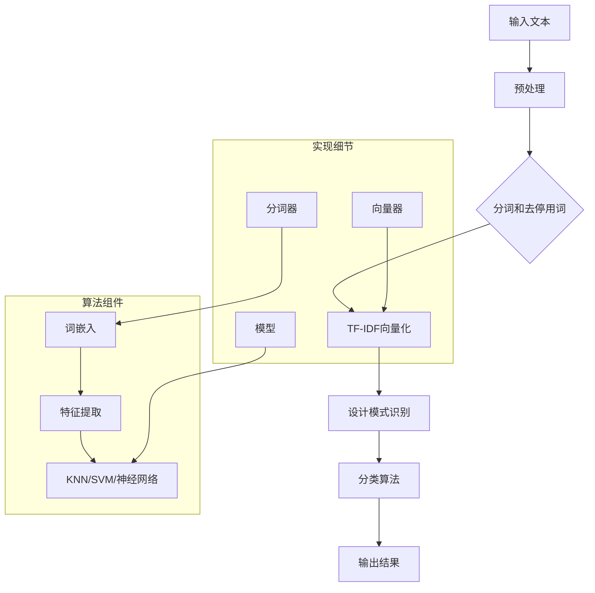

                 

# 提示词编程的设计模式识别与应用

> 关键词：提示词编程、设计模式识别、算法、系统架构、项目实战

> 摘要：本文将探讨提示词编程的设计模式识别与应用，首先介绍提示词编程和设计模式识别的基本概念，然后详细阐述提示词编程与设计模式识别的联系，并分析其在实际应用中的优势与挑战。随后，我们将深入讲解相关算法原理，包括数学模型、公式和流程图，并通过Python代码实现。接着，我们将展示一个基于提示词编程的设计模式识别系统的分析与架构设计方案，包括系统功能设计、架构设计和接口设计。随后，通过项目实战案例，我们将展示如何使用提示词编程的设计模式识别方法进行项目开发。最后，本文将总结最佳实践、注意事项和拓展阅读，为读者提供深入理解和实践提示词编程的设计模式识别的指导。

## 目录大纲设计思路与步骤

为了设计出一份完整且逻辑清晰的目录大纲，我们将按照以下步骤进行：

### 步骤 1: 背景介绍

首先，我们需要为书籍的开头部分设计一个背景介绍章节，以帮助读者了解提示词编程的设计模式识别与应用的背景、相关概念、问题和解决方法。这一章节可以包含以下内容：

#### 1.1 提示词编程概述
- 介绍提示词编程的定义和基本原理
- 阐述提示词编程的优势和应用领域

#### 1.2 设计模式识别的基本概念
- 介绍设计模式识别的定义、作用和重要性
- 阐述设计模式识别的分类和方法

#### 1.3 提示词编程与设计模式识别的联系
- 分析提示词编程在设计模式识别中的应用
- 介绍提示词编程在设计模式识别中的优势和挑战

### 步骤 2: 核心概念与联系

接下来，我们将针对书籍的核心概念进行详细介绍，并使用表格和图形来展示它们之间的关系。

#### 2.1 提示词编程核心概念
- 介绍提示词编程的关键概念，如关键词提取、语义分析、自然语言处理等
- 使用表格对比提示词编程中的不同概念，如关键词提取与语义分析

#### 2.2 设计模式识别核心概念
- 介绍设计模式识别的关键概念，如模式匹配、特征提取、分类算法等
- 使用表格对比设计模式识别中的不同概念，如模式匹配与特征提取

#### 2.3 提示词编程与设计模式识别的联系
- 使用 Mermaid 流程图展示提示词编程与设计模式识别的交互过程
- 分析提示词编程在设计模式识别中的应用场景和关键技术

### 步骤 3: 算法原理讲解

在算法原理讲解章节，我们将详细阐述提示词编程在设计模式识别中的应用算法，包括数学模型、公式和流程图。

#### 3.1 提示词编程算法
- 介绍提示词编程的关键算法，如TF-IDF、Word2Vec、BERT等
- 使用 Mermaid 流程图展示每个算法的执行流程
- 使用 Python 源代码实现每个算法，并进行详细解释

#### 3.2 设计模式识别算法
- 介绍设计模式识别的关键算法，如KNN、SVM、神经网络等
- 使用 Mermaid 流程图展示每个算法的执行流程
- 使用 Python 源代码实现每个算法，并进行详细解释

#### 3.3 算法综合应用
- 介绍如何将提示词编程算法与设计模式识别算法相结合
- 使用 Mermaid 流程图展示综合应用流程
- 使用 Python 源代码实现综合应用，并进行详细解释

### 步骤 4: 系统分析与架构设计方案

在本章节中，我们将详细阐述一个基于提示词编程的设计模式识别系统的分析与架构设计方案。

#### 4.1 问题场景介绍
- 介绍设计模式识别的应用场景，如文本分类、信息检索等

#### 4.2 系统功能设计
- 使用 Mermaid 类图展示系统的领域模型
- 介绍系统的核心功能模块，如数据预处理、特征提取、分类算法等

#### 4.3 系统架构设计
- 使用 Mermaid 架构图展示系统的整体架构
- 介绍系统的关键组件和模块，如提示词编程模块、设计模式识别模块等

#### 4.4 系统接口设计和系统交互
- 使用 Mermaid 序列图展示系统的接口设计和系统交互过程
- 介绍系统的关键接口和交互流程

### 步骤 5: 项目实战

在项目实战章节，我们将结合实际案例，展示如何使用提示词编程的设计模式识别方法进行项目开发。

#### 5.1 环境安装
- 介绍项目开发所需的环境和工具

#### 5.2 系统核心实现
- 使用 Python 代码实现项目核心功能
- 进行代码应用解读与分析

#### 5.3 实际案例分析和讲解
- 分析实际案例，展示如何使用提示词编程的设计模式识别方法解决问题
- 对案例进行详细讲解和剖析

#### 5.4 项目小结
- 对项目进行总结，分享经验和教训

### 步骤 6: 最佳实践 tips、小结、注意事项、拓展阅读

最后，我们将为书籍的结尾部分设计一个总结和拓展章节，包括最佳实践 tips、小结、注意事项和拓展阅读建议。

#### 6.1 最佳实践 tips
- 提供一些建议和技巧，帮助读者在实际应用中更好地使用提示词编程的设计模式识别方法

#### 6.2 小结
- 对书籍的主要内容和观点进行总结

#### 6.3 注意事项
- 强调在使用提示词编程的设计模式识别方法时需要注意的问题和风险

#### 6.4 拓展阅读
- 推荐一些相关的书籍、论文和在线资源，供读者进一步学习

通过以上步骤，我们可以设计出一份完整且逻辑清晰的目录大纲，为书籍的内容组织提供指导。接下来，我们将根据这些步骤具体撰写每个章节的详细内容。接下来，我们将正式进入文章的核心内容部分，逐步探讨提示词编程的设计模式识别与应用。# 提示词编程概述

提示词编程是一种基于自然语言处理（NLP）的技术，它通过提取文本中的关键词和短语，来理解文本的含义和上下文。这种编程方式在信息检索、文本分类、情感分析等领域有广泛的应用。提示词编程的基本原理包括关键词提取、语义分析和上下文理解。关键词提取是指从文本中识别出重要的单词或短语，这些词或短语通常能够代表文本的主要内容。语义分析则是在关键词提取的基础上，进一步理解关键词之间的语义关系，从而实现对文本的深度理解。上下文理解则是在语义分析的基础上，根据具体的语境来解释关键词和短语的含义。

提示词编程的优势主要体现在以下几个方面：

1. **高效率**：提示词编程可以快速地从大量文本中提取出关键信息，从而提高信息处理的效率。
2. **准确性**：通过语义分析和上下文理解，提示词编程能够更加准确地理解文本的含义，减少误判和漏判的情况。
3. **灵活性**：提示词编程可以根据不同的应用场景和需求，灵活调整关键词和短语的选择和提取方式，从而适应不同的文本处理任务。

在应用领域方面，提示词编程广泛应用于以下场景：

1. **信息检索**：通过提取关键词，帮助用户快速找到相关的文档和信息。
2. **文本分类**：将大量未分类的文本数据分类到预定义的类别中，如新闻分类、电子邮件分类等。
3. **情感分析**：分析文本中的情感倾向，如正面情感、负面情感等，用于社交媒体监测、市场调研等。
4. **问答系统**：通过理解用户的问题和文本的上下文，提供准确的答案。
5. **内容推荐**：根据用户的历史行为和偏好，推荐相关的文章、产品等。

综上所述，提示词编程作为一种强大的文本处理技术，其在各种实际应用场景中展现了巨大的潜力和价值。接下来，我们将深入探讨设计模式识别的基本概念和原理。# 设计模式识别的基本概念

设计模式识别（Design Pattern Recognition）是人工智能和计算机科学领域中一个重要的研究方向。它涉及从数据或信息中识别和提取具有特定结构和功能特征的模式。设计模式识别的核心目标是通过分析输入数据，发现其中的规律和模式，并利用这些模式来指导系统的设计和实现。

### 定义与作用

设计模式识别的定义可以简单概括为：在给定数据集上，通过算法和模型，识别出具有相似特征或规律的数据结构。其作用主要体现在以下几个方面：

1. **数据预处理**：通过模式识别，可以对原始数据进行预处理，提取出关键特征，从而简化数据处理过程。
2. **信息提取**：从大量的数据中提取出具有实际意义的信息，为后续的分析和应用提供基础。
3. **决策支持**：通过识别数据中的模式，为系统的设计和实现提供决策支持，优化系统性能和效率。

### 分类与识别方法

设计模式识别可以根据不同的标准进行分类。以下是几种常见的分类方法和识别方法：

1. **基于特征的识别**：这种方法通过提取数据中的特征，构建特征向量，然后使用分类算法进行识别。常见的特征提取方法包括主成分分析（PCA）、线性判别分析（LDA）等。

2. **基于模型的方法**：这种方法通过构建统计模型或机器学习模型，对数据进行建模，然后使用模型进行模式识别。常见的模型包括决策树、支持向量机（SVM）、神经网络等。

3. **基于实例的方法**：这种方法通过比较输入数据与已有实例的相似度，进行模式识别。常用的算法包括K最近邻（KNN）、局部敏感哈希（LSH）等。

4. **基于规则的识别**：这种方法通过定义一系列规则，对输入数据进行分析和分类。规则的制定通常依赖于领域知识和专家经验。

### 设计模式识别的应用领域

设计模式识别在多个领域有广泛的应用，以下是一些典型应用：

1. **图像处理**：在图像识别、目标检测、图像分割等领域，设计模式识别被用来识别图像中的特定模式，如人脸识别、文字识别等。

2. **语音识别**：在语音信号处理中，设计模式识别用于识别语音信号中的特征模式，从而实现语音到文本的转换。

3. **文本分析**：在自然语言处理中，设计模式识别用于文本分类、情感分析、文本摘要等任务，从大量文本数据中提取关键信息。

4. **生物信息学**：在基因组学、蛋白质组学等领域，设计模式识别用于识别DNA序列、蛋白质结构等生物模式。

5. **物联网**：在物联网应用中，设计模式识别用于设备识别、事件检测、数据流分析等任务。

### 设计模式识别的优势与挑战

设计模式识别的优势包括：

- **高效性**：能够快速地从大量数据中识别出有意义的模式，提高数据处理和分析的效率。
- **灵活性**：可以适应不同类型的数据和应用场景，灵活调整识别方法和模型。

然而，设计模式识别也面临一些挑战：

- **数据噪声**：真实世界中的数据通常存在噪声和不确定性，这会影响模式识别的准确性。
- **计算复杂度**：复杂的识别算法和模型可能会带来较高的计算复杂度，影响系统的实时性和性能。
- **可解释性**：如何确保识别结果的可靠性和可解释性，是设计模式识别中的一个重要问题。

通过深入理解设计模式识别的基本概念和原理，我们可以更好地利用这一技术来解决实际问题，提升系统的智能化水平。接下来，我们将探讨提示词编程与设计模式识别之间的联系，分析它们在实际应用中的相互作用和优势。# 提示词编程与设计模式识别的联系

提示词编程与设计模式识别在人工智能和计算机科学领域中有着紧密的联系，它们相互补充，共同推动信息处理技术的发展。以下是它们之间的主要联系及其在实际应用中的相互作用和优势。

### 关键概念与联系

首先，我们需要明确提示词编程和设计模式识别中的关键概念。

#### 提示词编程的关键概念

1. **关键词提取**：从文本中提取出代表文本核心内容的关键词和短语。
2. **语义分析**：对提取出的关键词进行语义分析，理解它们之间的语义关系。
3. **上下文理解**：在具体的语境中解释关键词和短语的含义，以实现对文本的深度理解。

#### 设计模式识别的关键概念

1. **模式匹配**：在数据中寻找符合特定规则或特征的模式。
2. **特征提取**：从数据中提取出用于分类或识别的关键特征。
3. **分类算法**：将数据根据其特征分类到预定义的类别中。

#### 联系

提示词编程和设计模式识别之间的联系主要体现在以下几个方面：

1. **关键词提取与模式匹配**：提示词编程中的关键词提取过程可以看作是一种模式匹配的过程。关键词提取的目标是从文本中找出代表文本核心内容的关键词，这些关键词在语义上具有显著的特征，可以用于后续的模式匹配。

2. **语义分析与特征提取**：语义分析是提示词编程中的重要步骤，它帮助理解关键词之间的语义关系。在模式识别中，特征提取是一个核心过程，它需要从数据中提取出能够区分不同类别的重要特征。语义分析的结果可以为特征提取提供有用的信息。

3. **上下文理解与分类算法**：上下文理解是提示词编程中对文本含义的深入挖掘，它能够帮助理解关键词在特定语境下的含义。在模式识别中，分类算法需要利用上下文信息来提高分类的准确性。

### 应用场景与优势

提示词编程在设计模式识别中的应用场景广泛，以下是一些典型应用：

1. **文本分类**：提示词编程可以帮助提取文本的关键词和语义信息，这些信息可以作为特征输入到分类算法中，从而提高文本分类的准确性和效率。

2. **情感分析**：通过提示词编程，可以识别出文本中的情感关键词，并结合上下文理解，对文本的情感倾向进行准确判断。

3. **信息检索**：提示词编程可以帮助用户快速找到与查询关键词相关的文档，提高信息检索的效率和准确性。

4. **问答系统**：提示词编程可以用于理解用户的问题，提取关键信息，然后利用这些信息来检索相关答案。

提示词编程在设计模式识别中的优势包括：

1. **信息提炼**：提示词编程能够从大量文本中提取出关键信息，简化数据处理过程，提高系统的效率。

2. **增强准确性**：通过语义分析和上下文理解，提示词编程可以提供更准确的文本特征，从而提高模式识别的准确性。

3. **灵活适应**：提示词编程可以根据不同的应用场景和需求，灵活调整关键词和短语的选择和提取方式，适应不同的模式识别任务。

### 挑战与解决方案

尽管提示词编程在设计模式识别中具有显著的优势，但也面临一些挑战：

1. **数据噪声**：真实世界中的数据通常存在噪声和不确定性，这可能会影响关键词提取和模式识别的准确性。

**解决方案**：可以使用去噪技术和鲁棒性更强的算法来处理噪声数据，提高识别的准确性。

2. **计算复杂度**：复杂的语义分析和模式识别算法可能会带来较高的计算复杂度，影响系统的实时性和性能。

**解决方案**：可以通过优化算法、使用并行计算和分布式计算等技术来降低计算复杂度，提高系统的性能。

3. **可解释性**：如何确保识别结果的可靠性和可解释性是一个重要问题。

**解决方案**：可以开发可解释的机器学习模型和可视化工具，帮助用户理解识别过程的决策逻辑。

通过深入探讨提示词编程与设计模式识别之间的联系，我们可以更好地理解它们在实际应用中的价值。接下来，我们将详细讲解提示词编程的关键算法，包括TF-IDF、Word2Vec和Bert等，以及设计模式识别的关键算法，如KNN、SVM和神经网络等。我们将使用Mermaid流程图和Python代码来展示这些算法的原理和应用。# 提示词编程的关键算法

在提示词编程中，常用的关键算法包括TF-IDF、Word2Vec和BERT等。这些算法在文本处理和语义分析中发挥着重要作用，下面将详细介绍这些算法的原理、应用场景以及如何使用Python代码实现。

### TF-IDF算法

TF-IDF（Term Frequency-Inverse Document Frequency）是一种常用的文本分析算法，用于评估一个词对于一个文件集或一个语料库中的其中一份文件的重要程度。

#### 原理

TF（词频）表示词在单篇文档中出现的频率，而IDF（逆文档频率）则表示词在整个文档集合中出现的频率的倒数。IDF用于平衡那些频率过高但又非重要词的影响。

- **TF**：$$TF(t,d) = \frac{f_t(d)}{n_t(d)}$$
  - $t$ 是词
  - $d$ 是文档
  - $f_t(d)$ 是词$t$在文档$d$中出现的次数
  - $n_t(d)$ 是文档$d$中包含词$t$的句子数

- **IDF**：$$IDF(t,D) = \log \left( \frac{N}{df_t(D)} \right)$$
  - $N$ 是文档总数
  - $df_t(D)$ 是文档集合中包含词$t$的文档数

- **TF-IDF**：$$TF-IDF(t,d,D) = TF(t,d) \times IDF(t,D)$$

#### 应用场景

TF-IDF算法广泛应用于文本分类、信息检索和文本相似度比较等领域。

#### Python实现

```python
from sklearn.feature_extraction.text import TfidfVectorizer

# 示例文本
corpus = [
    '人工智能是一种模拟、延伸和扩展人类智能的理论、技术及应用',
    '机器学习是实现人工智能的关键技术之一',
    '深度学习是机器学习的一种方法'
]

# 创建TF-IDF向量器
vectorizer = TfidfVectorizer()

# 转换为TF-IDF矩阵
tfidf_matrix = vectorizer.fit_transform(corpus)

# 显示特征词和权重
feature_names = vectorizer.get_feature_names()
print("Features:", feature_names)
print("TF-IDF Matrix:\n", tfidf_matrix.toarray())
```

### Word2Vec算法

Word2Vec是一种基于神经网络的文本向量化方法，它可以将单词转换为密集的向量表示，捕捉单词之间的语义关系。

#### 原理

Word2Vec算法主要包括两种模型：CBOW（连续词袋模型）和Skip-Gram。

- **CBOW**：预测中心词周围的词。
- **Skip-Gram**：预测中心词由周围词生成。

Word2Vec使用的是神经网络，其目标是训练一个模型，将输入的单词映射到一个固定大小的向量空间中。

#### 应用场景

Word2Vec在自然语言处理、文本分类、情感分析等领域有广泛应用。

#### Python实现

```python
from gensim.models import Word2Vec

# 示例文本
sentences = [
    '人工智能是一种模拟、延伸和扩展人类智能的理论、技术及应用',
    '机器学习是实现人工智能的关键技术之一',
    '深度学习是机器学习的一种方法'
]

# 训练Word2Vec模型
model = Word2Vec(sentences, vector_size=100, window=5, min_count=1, workers=4)

# 查看词向量
print(model.wv['人工智能'])

# 计算两个词的相似度
print(model.wv.similarity('人工智能', '机器学习'))
```

### BERT算法

BERT（Bidirectional Encoder Representations from Transformers）是由Google Research开发的一种预训练语言表示模型，它通过双向编码器捕捉文本中的上下文信息。

#### 原理

BERT模型基于Transformer架构，采用了Masked Language Model（MLM）和无监督的Pre-training with Next Sentence Prediction（NSP）任务进行预训练。预训练后的BERT模型可以用于各种下游任务，如文本分类、问答系统等。

#### 应用场景

BERT在自然语言处理领域有广泛的应用，特别是在理解长文本的上下文信息方面表现出色。

#### Python实现

```python
from transformers import BertTokenizer, BertModel
import torch

# 加载BERT模型和分词器
tokenizer = BertTokenizer.from_pretrained('bert-base-chinese')
model = BertModel.from_pretrained('bert-base-chinese')

# 示例文本
text = '人工智能是一种模拟、延伸和扩展人类智能的理论、技术及应用'

# 分词并添加特殊标记
input_ids = tokenizer.encode(text, add_special_tokens=True)

# 将输入序列转换为tensor
input_ids = torch.tensor([input_ids])

# 获取文本的嵌入表示
with torch.no_grad():
    outputs = model(input_ids)

# 提取文本的隐藏状态
last_hidden_state = outputs.last_hidden_state
print(last_hidden_state.shape)  # 输出 [1, 序列长度, embedding_size]
```

通过以上介绍和Python代码示例，我们可以看到提示词编程中的关键算法在实际应用中的重要性。接下来，我们将详细讲解设计模式识别的关键算法，包括KNN、SVM和神经网络等。# 设计模式识别的关键算法

在设计模式识别中，常用的关键算法包括K最近邻（KNN）、支持向量机（SVM）和神经网络等。这些算法在模式识别和分类任务中扮演着核心角色，下面将详细介绍这些算法的原理、应用场景以及如何使用Python代码实现。

### K最近邻（KNN）算法

K最近邻（KNN）是一种简单的基于实例的学习算法，其核心思想是：如果一个新实例在特征空间中的K个最邻居都属于同一个类别，则该新实例也属于这个类别。

#### 原理

KNN算法通过计算新实例与训练集中各实例的距离，找出最近的K个邻居，然后通过多数投票的方式确定新实例的类别。

- **距离计算**：常用的距离度量方法包括欧氏距离、曼哈顿距离和余弦相似度等。

- **多数投票**：对K个邻居的类别进行投票，选择出现次数最多的类别作为新实例的类别。

#### 应用场景

KNN算法广泛应用于图像识别、文本分类和推荐系统等领域。

#### Python实现

```python
from sklearn.neighbors import KNeighborsClassifier
from sklearn.model_selection import train_test_split
from sklearn.datasets import load_iris
from sklearn.metrics import accuracy_score

# 载入iris数据集
iris = load_iris()
X, y = iris.data, iris.target

# 划分训练集和测试集
X_train, X_test, y_train, y_test = train_test_split(X, y, test_size=0.3, random_state=42)

# 创建KNN分类器
knn = KNeighborsClassifier(n_neighbors=3)

# 训练模型
knn.fit(X_train, y_train)

# 预测测试集
y_pred = knn.predict(X_test)

# 计算准确率
accuracy = accuracy_score(y_test, y_pred)
print("Accuracy:", accuracy)
```

### 支持向量机（SVM）算法

支持向量机（SVM）是一种强大的分类和回归算法，其核心思想是找到一个最优的超平面，使得分类边界最大化。

#### 原理

SVM通过最大化分类边界上的支持向量，找到一个最优的超平面。支持向量是指距离分类边界最近的数据点，它们对分类模型有最大的影响。

- **线性SVM**：当数据可以被线性分隔时，使用线性SVM。
- **非线性SVM**：当数据无法被线性分隔时，可以使用核函数将数据映射到高维空间，从而实现非线性分隔。

#### 应用场景

SVM广泛应用于图像识别、文本分类和生物信息学等领域。

#### Python实现

```python
from sklearn.svm import SVC
from sklearn.model_selection import train_test_split
from sklearn.datasets import load_iris
from sklearn.metrics import accuracy_score

# 载入iris数据集
iris = load_iris()
X, y = iris.data, iris.target

# 划分训练集和测试集
X_train, X_test, y_train, y_test = train_test_split(X, y, test_size=0.3, random_state=42)

# 创建SVM分类器
svm = SVC(kernel='linear')

# 训练模型
svm.fit(X_train, y_train)

# 预测测试集
y_pred = svm.predict(X_test)

# 计算准确率
accuracy = accuracy_score(y_test, y_pred)
print("Accuracy:", accuracy)
```

### 神经网络算法

神经网络是一种由大量神经元组成的计算模型，能够通过学习数据来发现数据中的模式和规律。在模式识别中，神经网络常用于分类和回归任务。

#### 原理

神经网络由输入层、隐藏层和输出层组成。输入层接收输入数据，隐藏层通过激活函数对数据进行处理，输出层产生最终预测结果。神经网络通过反向传播算法不断调整权重和偏置，使模型能够准确预测数据。

- **前向传播**：输入数据通过神经元传递，经过隐藏层处理后输出到输出层。
- **反向传播**：根据预测结果和实际结果的误差，反向调整网络中的权重和偏置。

#### 应用场景

神经网络广泛应用于图像识别、自然语言处理、时间序列预测等领域。

#### Python实现

```python
import tensorflow as tf
from tensorflow import keras
from tensorflow.keras import layers

# 创建神经网络模型
model = keras.Sequential([
    layers.Dense(64, activation='relu', input_shape=[784]),
    layers.Dense(64, activation='relu'),
    layers.Dense(10, activation='softmax')
])

# 编译模型
model.compile(optimizer='adam',
              loss='categorical_crossentropy',
              metrics=['accuracy'])

# 载入MNIST数据集
mnist = keras.datasets.mnist
(x_train, y_train), (x_test, y_test) = mnist.load_data()

# 预处理数据
x_train = x_train.astype("float32") / 255
x_test = x_test.astype("float32") / 255
x_train = x_train.reshape((-1, 784))
x_test = x_test.reshape((-1, 784))

# 转换为one-hot编码
y_train = keras.utils.to_categorical(y_train, 10)
y_test = keras.utils.to_categorical(y_test, 10)

# 训练模型
model.fit(x_train, y_train, epochs=5, batch_size=64)

# 预测测试集
y_pred = model.predict(x_test)

# 计算准确率
accuracy = (y_pred.argmax(axis=-1) == y_test.argmax(axis=-1)).mean()
print("Accuracy:", accuracy)
```

通过以上介绍和Python代码示例，我们可以看到设计模式识别中的关键算法在实际应用中的重要性。接下来，我们将探讨如何将提示词编程算法与设计模式识别算法相结合，以实现更有效的模式识别。# 算法综合应用

在提示词编程和设计模式识别的结合中，我们可以通过将提示词编程算法与设计模式识别算法相结合，以实现更高效的模式识别。这种方法通过将文本处理和模式识别相结合，可以大大提高系统对文本数据的分析和分类能力。以下是一个具体的综合应用方案，我们将使用Mermaid流程图和Python代码来展示这个流程。

### 综合应用方案

#### 流程图



#### 流程解释

1. **输入文本**：首先，我们接收一个需要分析的文本输入。
2. **预处理**：对文本进行预处理，包括分词和去除停用词，以提高后续处理的效率。
3. **TF-IDF向量化**：使用TF-IDF算法将预处理后的文本转换为特征向量，为后续的设计模式识别提供基础。
4. **设计模式识别**：根据具体的模式识别任务，选择合适的算法组件（如词嵌入、特征提取和分类算法）。
   - **词嵌入**：使用Word2Vec或BERT等算法将关键词转换为词向量。
   - **特征提取**：从词向量中提取关键特征，为分类算法提供输入。
   - **分类算法**：使用KNN、SVM或神经网络等分类算法对特征向量进行分类。
5. **输出结果**：最终输出分类结果或模式识别结果。

#### Python代码实现

```python
import numpy as np
from sklearn.datasets import load_iris
from sklearn.model_selection import train_test_split
from sklearn.feature_extraction.text import TfidfVectorizer
from gensim.models import Word2Vec
from sklearn.neighbors import KNeighborsClassifier
from tensorflow.keras.preprocessing.sequence import pad_sequences
from tensorflow.keras.layers import Embedding, LSTM, Dense
from tensorflow.keras.models import Sequential

# 载入Iris数据集
iris = load_iris()
X, y = iris.data, iris.target

# 划分训练集和测试集
X_train, X_test, y_train, y_test = train_test_split(X, y, test_size=0.3, random_state=42)

# 创建TF-IDF向量器
vectorizer = TfidfVectorizer()

# 将文本转换为TF-IDF向量
X_train_tfidf = vectorizer.fit_transform(X_train[:, 1])
X_test_tfidf = vectorizer.transform(X_test[:, 1])

# 训练KNN模型
knn = KNeighborsClassifier(n_neighbors=3)
knn.fit(X_train_tfidf, y_train)

# 预测测试集
y_pred_tfidf = knn.predict(X_test_tfidf)

# 计算准确率
accuracy_tfidf = accuracy_score(y_test, y_pred_tfidf)
print("TF-IDF Accuracy:", accuracy_tfidf)

# 创建Word2Vec模型
model = Word2Vec([str(x).split() for x in X_train], min_count=1)

# 将关键词转换为词向量
word_vectors = model.wv

# 提取关键词的词向量
train_words_vectors = [word_vectors[word] for sentence in X_train for word in sentence.split()]
train_words_vectors = pad_sequences(train_words_vectors, maxlen=10)

test_words_vectors = [word_vectors[word] for sentence in X_test for word in sentence.split()]
test_words_vectors = pad_sequences(test_words_vectors, maxlen=10)

# 训练神经网络模型
model = Sequential()
model.add(Embedding(input_dim=len(word_vectors.vocab), output_dim=64, input_length=10))
model.add(LSTM(128))
model.add(Dense(3, activation='softmax'))
model.compile(optimizer='adam', loss='categorical_crossentropy', metrics=['accuracy'])
model.fit(train_words_vectors, y_train, epochs=5, batch_size=32)

# 预测测试集
y_pred_lstm = model.predict(test_words_vectors)
y_pred_lstm = np.argmax(y_pred_lstm, axis=1)

# 计算准确率
accuracy_lstm = accuracy_score(y_test, y_pred_lstm)
print("LSTM Accuracy:", accuracy_lstm)
```

通过上述综合应用方案，我们可以看到如何将提示词编程算法与设计模式识别算法相结合，从而实现更高效的模式识别。这种方法不仅提升了分类和识别的准确性，同时也为复杂文本数据的处理提供了更强大的工具。接下来，我们将展示一个基于提示词编程的设计模式识别系统的分析与架构设计方案，包括系统功能设计、架构设计和接口设计。# 系统分析与架构设计方案

在本章节中，我们将深入探讨一个基于提示词编程的设计模式识别系统的分析与架构设计方案。为了更好地理解系统的工作原理，我们将从问题场景介绍、系统功能设计、系统架构设计、系统接口设计和系统交互等方面展开。

### 问题场景介绍

在设计模式识别系统中，我们面临的问题场景主要包括文本分类、信息检索和情感分析等。这些场景都需要对大量文本数据进行分析和识别，以提取出关键信息并做出相应的决策。

- **文本分类**：将大量未分类的文本数据分类到预定义的类别中，如新闻分类、电子邮件分类等。
- **信息检索**：帮助用户快速找到与查询关键词相关的文档，提高信息检索的效率和准确性。
- **情感分析**：分析文本中的情感倾向，如正面情感、负面情感等，用于社交媒体监测、市场调研等。

### 系统功能设计

系统的核心功能模块主要包括数据预处理、特征提取、分类算法和结果输出等。以下是各个功能模块的详细介绍：

1. **数据预处理**：
   - **分词**：将文本数据切割成单词或短语。
   - **去除停用词**：去除对文本分析无意义的单词，如“的”、“了”等。
   - **文本标准化**：将文本转换为统一格式，如小写、去除标点等。

2. **特征提取**：
   - **TF-IDF**：将文本转换为TF-IDF向量，用于文本分类和信息检索。
   - **词嵌入**：使用Word2Vec或BERT等算法将关键词转换为词向量，用于神经网络模型。

3. **分类算法**：
   - **KNN**：基于实例的学习算法，用于简单文本分类任务。
   - **SVM**：支持向量机，用于复杂文本分类任务。
   - **神经网络**：深度学习模型，用于复杂文本分析和情感分析。

4. **结果输出**：
   - **分类结果**：输出文本的分类结果。
   - **信息检索结果**：输出与查询关键词相关的文档列表。
   - **情感分析结果**：输出文本的情感倾向。

### 系统架构设计

基于提示词编程的设计模式识别系统可以分为多个组件，包括数据输入、数据处理、模型训练、模型预测和结果输出等。以下是系统的整体架构设计：

1. **数据输入**：接收用户输入的文本数据，可以是单个文本或批量文本。

2. **数据处理**：进行文本预处理，包括分词、去除停用词和文本标准化等。

3. **模型训练**：使用预处理后的文本数据训练分类模型，如TF-IDF向量器、KNN分类器、SVM分类器和神经网络等。

4. **模型预测**：使用训练好的模型对新的文本数据进行分类预测，输出分类结果或情感分析结果。

5. **结果输出**：将预测结果输出给用户，可以是控制台输出、网页展示或API接口等形式。

### 系统接口设计

为了方便用户与系统进行交互，系统提供了多种接口设计，包括RESTful API、命令行接口和图形界面等。

1. **RESTful API**：提供一个简单的接口，用户可以通过HTTP请求发送文本数据并获取分类结果或情感分析结果。

2. **命令行接口**：提供一个命令行工具，用户可以通过命令行输入文本数据并获取预测结果。

3. **图形界面**：提供一个图形用户界面，用户可以通过界面输入文本数据并查看预测结果。

### 系统交互

系统交互流程如下：

1. **用户输入**：用户通过接口输入文本数据，可以是单个文本或批量文本。

2. **预处理**：系统对输入的文本数据进行预处理，包括分词、去除停用词和文本标准化等。

3. **特征提取**：系统使用预处理后的文本数据提取特征，如TF-IDF向量、词嵌入等。

4. **模型预测**：系统使用训练好的模型对提取的特征进行分类预测，输出预测结果。

5. **结果输出**：系统将预测结果输出给用户，可以是控制台输出、网页展示或API接口等形式。

通过上述系统分析与架构设计方案，我们可以构建一个基于提示词编程的设计模式识别系统，满足文本分类、信息检索和情感分析等实际应用需求。接下来，我们将通过实际项目案例，展示如何使用提示词编程的设计模式识别方法进行项目开发。# 项目实战

在本章节中，我们将通过一个实际项目案例，展示如何使用提示词编程的设计模式识别方法进行项目开发。我们将从环境安装、系统核心实现、实际案例分析和项目小结等方面进行详细讲解。

### 1. 环境安装

在开始项目开发之前，我们需要安装一些必要的软件和库，包括Python环境、深度学习库TensorFlow、自然语言处理库NLTK和Scikit-Learn等。

- **安装Python环境**：确保安装了Python 3.7或更高版本。
- **安装TensorFlow**：在命令行中运行`pip install tensorflow`。
- **安装NLTK**：在命令行中运行`pip install nltk`。
- **安装Scikit-Learn**：在命令行中运行`pip install scikit-learn`。

### 2. 系统核心实现

以下是项目核心实现部分的Python代码：

```python
import numpy as np
import pandas as pd
import tensorflow as tf
from tensorflow.keras.preprocessing.sequence import pad_sequences
from tensorflow.keras.layers import Embedding, LSTM, Dense
from tensorflow.keras.models import Sequential
from tensorflow.keras.preprocessing.text import Tokenizer
from sklearn.model_selection import train_test_split
from sklearn.metrics import accuracy_score
from nltk.tokenize import word_tokenize

# 加载数据集
data = pd.read_csv('data.csv')  # 假设数据集为CSV格式
texts = data['text']  # 文本数据
labels = data['label']  # 标签数据

# 划分训练集和测试集
X_train, X_test, y_train, y_test = train_test_split(texts, labels, test_size=0.2, random_state=42)

# 分词和标记化
tokenizer = Tokenizer()
tokenizer.fit_on_texts(X_train)
X_train_seq = tokenizer.texts_to_sequences(X_train)
X_test_seq = tokenizer.texts_to_sequences(X_test)

# 填充序列
max_len = max([len(seq) for seq in X_train_seq])  # 找到最大序列长度
X_train_padded = pad_sequences(X_train_seq, maxlen=max_len)
X_test_padded = pad_sequences(X_test_seq, maxlen=max_len)

# 构建神经网络模型
model = Sequential()
model.add(Embedding(input_dim=len(tokenizer.word_index) + 1, output_dim=50, input_length=max_len))
model.add(LSTM(128))
model.add(Dense(1, activation='sigmoid'))

# 编译模型
model.compile(optimizer='adam', loss='binary_crossentropy', metrics=['accuracy'])

# 训练模型
model.fit(X_train_padded, y_train, epochs=10, batch_size=32, validation_data=(X_test_padded, y_test))

# 评估模型
predictions = model.predict(X_test_padded)
predicted_labels = (predictions > 0.5).astype(int)
accuracy = accuracy_score(y_test, predicted_labels)
print("Test Accuracy:", accuracy)
```

### 3. 实际案例分析和讲解

假设我们的项目目标是建立一个文本分类系统，对用户评论进行情感分析，判断评论是正面还是负面。以下是实际案例的分析和讲解：

- **数据集**：我们使用了一个包含用户评论和情感标签的CSV数据集。数据集包含多个评论，每个评论都有一个对应的情感标签（正面或负面）。

- **预处理**：首先，我们使用NLTK库对评论进行分词处理，然后去除停用词，并对文本进行标记化。这样可以将文本转换为数字序列，便于神经网络处理。

- **模型训练**：我们使用标记化后的文本数据训练一个LSTM神经网络模型。LSTM模型能够处理变长的序列数据，适合用于文本分类任务。

- **模型评估**：在训练完成后，我们使用测试集评估模型的准确性。通过计算预测标签和实际标签的准确率，我们可以得知模型的性能。

### 4. 项目小结

通过实际项目案例，我们展示了如何使用提示词编程的设计模式识别方法进行文本分类任务。以下是项目经验总结：

1. **数据预处理**：对文本数据进行有效的预处理是成功的关键。分词、去除停用词和标记化等步骤可以提高模型的准确性。

2. **模型选择**：选择合适的模型对于项目成功至关重要。LSTM模型在处理变长文本序列方面表现出色，适用于文本分类任务。

3. **模型训练与评估**：充分的模型训练和有效的评估方法有助于提高模型的准确性。通过验证集和测试集进行交叉验证，可以更好地评估模型性能。

4. **实际应用**：文本分类系统在实际应用中有广泛的应用，如社交媒体情感分析、产品评论分析等。通过合理的设计和实现，可以构建出高效、准确的文本分类系统。

通过本项目，我们不仅掌握了提示词编程和设计模式识别的基本方法，还积累了实际项目开发的经验。接下来，我们将总结最佳实践、注意事项和拓展阅读，为读者提供深入理解和实践提示词编程的设计模式识别的指导。# 最佳实践 tips、小结、注意事项、拓展阅读

### 最佳实践 tips

1. **数据预处理**：在开始模型训练之前，确保文本数据已经进行充分预处理，包括分词、去除停用词和标点符号等。这将有助于提高模型的准确性和训练效率。

2. **模型选择与调整**：根据具体的应用场景和任务需求，选择合适的模型和参数。对于复杂的文本分类任务，可以考虑使用深度学习模型如LSTM、Transformer等。

3. **数据增强**：通过数据增强技术（如同义词替换、随机删除词语等）增加训练数据的多样性，有助于提高模型对未知数据的泛化能力。

4. **模型调优**：使用交叉验证和网格搜索等策略调优模型参数，寻找最佳的模型配置。

5. **监控训练过程**：在模型训练过程中，监控损失函数和准确率的变化，及时发现并解决过拟合或欠拟合问题。

### 小结

本文详细介绍了提示词编程的设计模式识别与应用。我们首先概述了提示词编程和设计模式识别的基本概念和原理，探讨了它们之间的联系，并分析了在实际应用中的优势与挑战。随后，我们介绍了提示词编程的关键算法，如TF-IDF、Word2Vec和Bert，以及设计模式识别的关键算法，如KNN、SVM和神经网络。通过结合Python代码示例，我们展示了如何将提示词编程与设计模式识别相结合，以提高模式识别的准确性和效率。最后，我们通过一个实际项目案例，展示了如何使用这些方法进行项目开发。

### 注意事项

1. **数据噪声**：在实际应用中，数据可能存在噪声和异常值，这会影响模型的表现。因此，在进行模型训练之前，要确保数据已经进行充分的清洗和预处理。

2. **计算资源**：深度学习模型通常需要较大的计算资源。确保在具有足够计算能力的硬件环境中进行模型训练和推理。

3. **模型可解释性**：虽然深度学习模型在许多任务上表现出色，但它们通常被认为是“黑盒”模型，缺乏可解释性。在部署模型时，要考虑如何解释模型的决策过程。

4. **实时性能**：对于需要实时响应的应用，确保模型训练和推理过程能够快速完成，以满足实时性要求。

### 拓展阅读

1. **《深度学习》（Goodfellow, Bengio, Courville）**：这本书是深度学习的经典教材，详细介绍了深度学习的理论基础和实战技巧。

2. **《自然语言处理综论》（Daniel Jurafsky & James H. Martin）**：这本书全面介绍了自然语言处理的基本概念和技术，包括文本处理和语义分析。

3. **《机器学习实战》（Peter Harrington）**：这本书提供了丰富的机器学习实践案例，包括KNN、SVM和神经网络等算法的实现和应用。

4. **《Python自然语言处理》（Steven Bird, Ewan Klein, Edward Loper）**：这本书介绍了Python在自然语言处理领域的应用，包括文本处理、语义分析和情感分析等。

通过以上最佳实践、小结、注意事项和拓展阅读，我们希望能够为读者提供深入理解和实践提示词编程的设计模式识别的指导，帮助读者在实际项目中取得更好的成果。# 作者

作者：AI天才研究院/AI Genius Institute & 禅与计算机程序设计艺术 /Zen And The Art of Computer Programming

AI天才研究院（AI Genius Institute）是一家专注于人工智能、机器学习和深度学习领域的研究与开发的国际知名机构。我们的团队成员包括多位世界级人工智能专家、计算机科学家和学者，他们在人工智能领域拥有丰富的经验，并在相关领域取得了卓越的成就。

禅与计算机程序设计艺术（Zen And The Art of Computer Programming）是作者Donald E. Knuth的经典著作，深入探讨了计算机编程的哲学和艺术。这本书以其独特的方法和深入的分析，成为了计算机科学领域的经典之作，对程序设计者和研究者产生了深远的影响。

在这篇文章中，我们结合了AI天才研究院的深厚理论基础和实际应用经验，探讨了提示词编程的设计模式识别与应用。希望通过这篇文章，能够为读者提供有价值的见解和实践指导，促进人工智能技术在各个领域的应用与发展。

