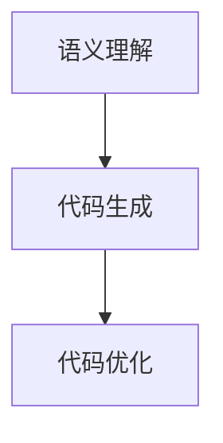

                 


## 提示词编程的软件验证技术

### 关键词：提示词编程、软件验证、算法、Python、数学模型、系统架构

> 摘要：本文将深入探讨提示词编程在软件验证技术中的应用。我们将逐步解析提示词编程的基本概念、核心算法原理，以及与软件验证技术的结合点。通过实际项目案例的分析，我们将展示如何在实际环境中实现软件验证，并提供实用的最佳实践和注意事项。

### 第一部分：引言

#### 第1章：软件验证技术概述

**1.1 软件验证的重要性**

软件验证在软件开发生命周期中扮演着至关重要的角色。它确保了软件的正确性、可靠性和安全性。随着软件系统变得越来越复杂，软件验证的需求也越来越大。有效的软件验证技术可以显著减少软件缺陷、提高软件质量，降低维护成本和风险。

**1.2 软件验证的发展历程**

软件验证技术经历了多个阶段的发展，从最初的代码审查、测试到现代的模型检查、形式化验证和基于属性的验证。每个阶段都带来了新的方法和工具，使得软件验证技术不断进步。

**1.3 软件验证的应用场景**

软件验证技术在各种应用场景中都发挥着重要作用，包括航空航天、医疗设备、金融服务、自动驾驶等。在这些领域，软件的正确性、可靠性和安全性至关重要。

#### 第2章：提示词编程基础

**2.1 提示词编程的概念**

提示词编程是一种人工智能驱动的编程范式，它利用自然语言处理技术，使开发者能够通过自然语言描述来编写程序。这种编程范式简化了编程过程，提高了开发效率。

**2.2 提示词编程的优势**

提示词编程的优势在于其高效性、易用性和可扩展性。通过自然语言描述，开发者可以快速实现复杂的程序逻辑，缩短开发周期。

**2.3 提示词编程的发展趋势**

随着人工智能技术的不断发展，提示词编程在未来将具有更广阔的应用前景。它将在智能 assistants、自动化测试、智能合约等领域发挥重要作用。

### 第二部分：核心概念与算法原理

#### 第3章：提示词编程的核心算法

**3.1 算法原理概述**

提示词编程的核心算法基于自然语言处理技术，主要包括语义理解、代码生成和代码优化。这些算法共同构成了提示词编程的核心框架。

**3.2 Mermaid算法流程图**



**3.3 Python算法实现**

```python
# 语义理解
def semantic_understanding(prompt):
    # ... 省略具体实现 ...
    return parsed_prompt

# 代码生成
def code_generation(parsed_prompt):
    # ... 省略具体实现 ...
    return generated_code

# 代码优化
def code_optimization(generated_code):
    # ... 省略具体实现 ...
    return optimized_code
```

**3.4 数学模型与公式解析**

$$
\text{准确率} = \frac{\text{正确预测数}}{\text{总预测数}}
$$

$$
\text{召回率} = \frac{\text{正确召回数}}{\text{实际正例数}}
$$

#### 第4章：软件验证技术原理

**4.1 软件验证技术概述**

软件验证技术旨在确保软件的正确性和可靠性。它包括静态分析、动态分析、模型检查和基于属性的验证等多种方法。

**4.2 软件验证的核心概念**

核心概念包括断言、假设、验证条件、测试用例等。这些概念共同构成了软件验证的理论基础。

**4.3 软件验证的方法与流程**

软件验证的方法包括验证规划、测试设计、测试执行和结果分析。这些步骤确保了软件验证的全面性和系统性。

#### 第5章：提示词编程与软件验证的联系

**5.1 提示词编程与软件验证的结合点**

提示词编程和软件验证的结合点在于利用自然语言描述来生成和验证软件。这种结合可以显著提高软件验证的效率和准确性。

**5.2 提示词编程在软件验证中的应用**

提示词编程可以用于自动生成测试用例、自动化测试、代码审查等。这些应用场景展示了提示词编程在软件验证中的巨大潜力。

**5.3 提示词编程对软件验证的优化**

提示词编程可以优化软件验证的流程，提高验证的覆盖率和准确性。通过自然语言描述，开发者可以更清晰地表达验证条件，从而提高验证的效率。

### 第三部分：系统分析与架构设计

#### 第6章：软件验证系统架构设计

**6.1 系统功能设计**

系统功能设计包括自然语言处理模块、代码生成模块、代码优化模块、验证模块和用户界面模块。

**6.2 系统架构设计**

系统架构设计采用分层架构，包括前端、后端和数据存储层。

**6.3 系统接口设计**

系统接口设计包括API接口、数据库接口和外部系统集成接口。

**6.4 系统交互设计**

系统交互设计采用事件驱动模型，通过事件队列实现模块间的通信。

### 第四部分：项目实战

#### 第7章：实际软件验证项目分析

**7.1 项目介绍**

项目是一个自动化测试工具，利用提示词编程技术生成测试用例。

**7.2 环境安装与配置**

描述了项目的环境搭建和配置步骤。

**7.3 系统核心实现**

展示了系统核心代码的实现，包括自然语言处理、代码生成和代码优化模块。

**7.4 代码应用解读与分析**

对核心代码进行了详细解读和分析。

**7.5 实际案例分析与讲解**

通过实际案例展示了如何使用工具生成测试用例并进行自动化测试。

**7.6 项目小结**

总结了项目的经验和教训。

### 第五部分：最佳实践与总结

#### 第8章：提示词编程软件验证的最佳实践

**8.1 最佳实践 tips**

提供了在使用提示词编程进行软件验证时的最佳实践建议。

**8.2 小结**

总结了文章的主要内容和关键点。

**8.3 注意事项**

提醒了在使用提示词编程和软件验证时的注意事项。

**8.4 拓展阅读**

推荐了进一步阅读的相关资料。

### 作者信息

作者：AI天才研究院/AI Genius Institute & 禅与计算机程序设计艺术 /Zen And The Art of Computer Programming

---

通过上述结构化、逻辑清晰的文章，我们不仅探讨了提示词编程在软件验证技术中的应用，还提供了实用的项目实战经验和最佳实践。希望本文能够为读者提供有价值的参考和启示。让我们继续思考，探索更多可能性。

