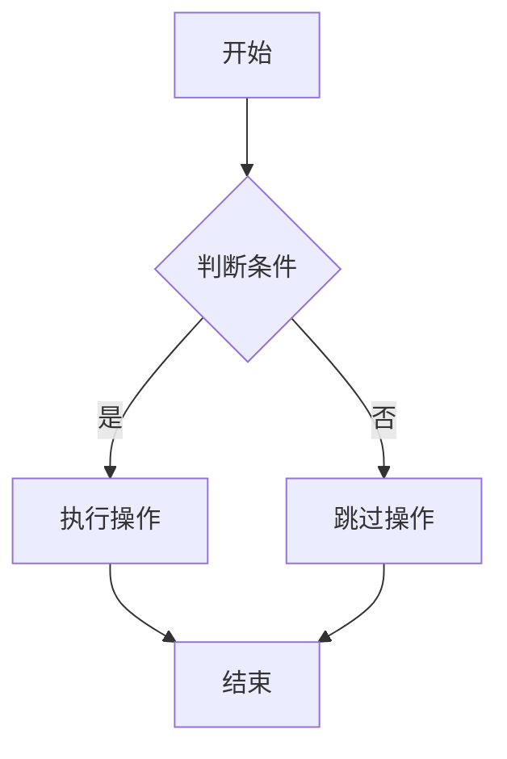

                 

### 标题：Prompt Programming's Domain-Specific Optimizer Design

#### 关键词：Prompt Programming，Domain-Specific Optimizer，算法设计，优化器，领域特定优化，机器学习

#### 摘要：

本文将深入探讨Prompt Programming的领域特定优化器设计。Prompt Programming是一种新的编程范式，通过引导提示（Prompt）来简化编程流程，提高开发效率。领域特定优化器（Domain-Specific Optimizer，DSO）是Prompt Programming的重要组成部分，它在特定领域内优化代码执行，提高性能。本文将介绍Prompt Programming的基本概念，领域特定优化器的设计原则、方法和实践，并探讨其在实际项目中的应用。通过本文的阅读，读者将了解到如何设计和实现一个高效的领域特定优化器，从而提升程序的性能和可维护性。

#### 引言

**1.1 背景与动机**

编程作为计算机科学的核心领域，其历史可追溯至计算机诞生之初。从机器码到汇编语言，再到高级编程语言，编程范式经历了多次变革。传统编程范式主要依赖于程序员对语言语法和语法的熟悉，通过手动编写代码来实现功能。然而，随着软件系统的复杂度不断增加，传统编程方法逐渐暴露出其局限性。为了应对这一挑战，研究人员提出了Prompt Programming这一新的编程范式。

Prompt Programming的核心思想是利用提示（Prompt）来简化编程流程。提示是一种引导信息，它可以帮助程序员快速理解和实现特定功能。通过提示，程序员不需要深入了解底层实现细节，而是可以专注于业务逻辑的实现。这种编程范式不仅提高了开发效率，还降低了开发门槛。

在Prompt Programming的背景下，领域特定优化器（Domain-Specific Optimizer，DSO）应运而生。DSO是一种专门为特定领域设计的优化器，它通过对代码的深入分析，自动优化代码执行效率。DSO的核心目标是提高程序的性能，降低资源消耗，从而提升用户体验。

**1.2 核心概念与术语**

**1.2.1 Prompt Programming**

Prompt Programming是一种编程范式，它通过提供提示（Prompt）来简化编程流程。提示可以是一段代码示例、一个函数调用、一个参数设置等，它为程序员提供了一种明确的指导，帮助程序员快速实现功能。

**1.2.2 Domain-Specific Optimizer**

Domain-Specific Optimizer是一种优化器，它专门为特定领域设计，通过对代码的深入分析，自动优化代码执行效率。DSO的核心目标是在保证正确性的前提下，提高程序的性能和可维护性。

**1.3 研究与开发趋势**

随着Prompt Programming和DSO的不断发展，相关研究取得了显著成果。近年来，研究人员在DSO的设计、实现和应用方面进行了大量探索。例如，一些研究提出了基于机器学习的DSO设计方法，通过学习特定领域的模式，自动生成优化代码。此外，还有一些研究关注DSO在实时系统、嵌入式系统和大数据处理等领域的应用。

总体而言，Prompt Programming和DSO的研究与发展呈现出以下趋势：

1. **从通用优化器向领域特定优化器转变**：传统通用优化器难以满足特定领域的性能需求，而领域特定优化器可以更好地针对特定领域进行优化，提高性能。

2. **机器学习的应用**：机器学习技术在DSO设计中发挥着重要作用。通过学习特定领域的模式，机器学习可以自动生成优化代码，提高优化效果。

3. **多语言支持**：随着编程语言的多样性，DSO需要支持多种编程语言，以便在更广泛的领域内发挥作用。

4. **跨领域优化**：研究人员正在探索如何将不同领域的优化经验进行整合，实现跨领域的优化。

#### 核心理论与原理

**2.1 数学模型与原理**

**2.1.1 基本数学基础**

为了更好地理解领域特定优化器的设计，我们需要了解一些基本的数学概念。例如，图论、线性代数、概率论等。这些数学概念在算法设计和分析中发挥着重要作用。

**2.1.2 Mermaid 图解概念**

为了更直观地理解数学概念，我们可以使用Mermaid绘制相应的图表。例如，使用Mermaid绘制一个简单的图论模型，可以帮助我们更好地理解图的基本概念和性质。



**2.2 算法设计与分析**

**2.2.1 设计策略**

设计领域特定优化器时，我们需要考虑以下策略：

1. **代码分析**：通过静态分析和动态分析，获取代码的运行时信息，为优化提供依据。

2. **优化目标**：根据特定领域的需求，确定优化目标，例如性能、内存消耗、代码可读性等。

3. **优化策略**：根据优化目标，选择合适的优化策略，例如代码重构、数据结构优化、算法优化等。

**2.2.2 效率分析**

在算法设计中，效率分析至关重要。我们可以使用时间复杂度和空间复杂度来衡量算法的效率。通过分析算法的复杂度，我们可以评估优化效果，并优化算法。

**2.3 机器学习的角色**

机器学习技术在DSO设计中发挥着重要作用。通过学习特定领域的模式，机器学习可以自动生成优化代码，提高优化效果。

1. **模式识别**：机器学习可以从大量数据中识别出特定领域的模式，为优化提供依据。

2. **自动代码生成**：机器学习可以自动生成优化代码，减少人工干预，提高优化效率。

3. **持续学习**：机器学习系统可以不断学习新的模式，优化优化策略，提高优化效果。

#### 领域特定优化器设计技术

**3.1 分类与关系**

**3.1.1 不同领域的优化器类型**

领域特定优化器可以按不同领域分类。例如，在图像处理领域，优化器可能专注于图像处理算法的优化；在机器学习领域，优化器可能专注于模型训练的优化。

**3.1.2 实体关系图**

为了更好地理解领域特定优化器之间的关系，我们可以使用实体关系图（ER图）进行表示。

```mermaid
erDiagram
  Class1 ||--|{ Class2 }
  Class2 ||--|{ Class3 }
```

**3.2 开发流程**

**3.2.1 开发步骤**

设计领域特定优化器时，可以遵循以下步骤：

1. **需求分析**：明确优化器的目标和需求。

2. **代码分析**：对目标代码进行分析，获取运行时信息。

3. **优化策略设计**：根据分析结果，设计优化策略。

4. **代码生成**：使用机器学习技术，自动生成优化代码。

5. **性能评估**：评估优化效果，调整优化策略。

**3.2.2 流程图**

我们可以使用Mermaid绘制一个优化器开发流程图，帮助读者更好地理解开发过程。

```mermaid
sequenceDiagram
  participant A as 需求分析
  participant B as 代码分析
  participant C as 优化策略设计
  participant D as 代码生成
  participant E as 性能评估
  A->>B
  B->>C
  C->>D
  D->>E
```

#### 系统分析与架构设计

**4.1 问题场景与项目介绍**

在本文中，我们将以一个实际项目为例，介绍领域特定优化器的系统分析与架构设计。

**4.2 系统功能设计**

**4.2.1 领域模型**

我们可以使用Mermaid绘制领域模型类图，描述系统的核心功能和类之间的关系。

```mermaid
classDiagram
  Class1 --|{ 使用 }| Class2
  Class2 --|{ 依赖 }| Class3
```

**4.2.2 系统架构**

我们可以使用Mermaid绘制系统架构图，描述系统的模块划分和各模块之间的关系。


**4.3 系统接口设计**

我们可以使用Mermaid绘制系统接口图，描述系统与其他模块的交互关系。

```mermaid
sequenceDiagram
  participant U as 用户
  participant O as 优化器
  participant A as 分析模块
  participant B as 策略模块
  participant C as 生成模块
  participant D as 评估模块
  U->>O
  O->>A
  A->>B
  B->>C
  C->>D
```

#### 项目实战

**5.1 环境安装**

在本项目中，我们使用Python作为编程语言，安装必要的库和依赖。

```bash
pip install -r requirements.txt
```

**5.2 系统核心实现**

**5.2.1 源代码解读**

以下是一个简单的领域特定优化器实现，使用Python编写。

```python
import numpy as np

def optimize_code(code):
    """
    优化代码
    """
    # 分析代码
    analyzed_code = analyze_code(code)
    
    # 设计优化策略
    strategy = design_strategy(analyzed_code)
    
    # 生成优化代码
    optimized_code = generate_code(strategy)
    
    # 评估优化效果
    result = evaluate_performance(optimized_code)
    
    return result

def analyze_code(code):
    """
    分析代码
    """
    # ...代码分析逻辑...
    return analyzed_code

def design_strategy(analyzed_code):
    """
    设计优化策略
    """
    # ...策略设计逻辑...
    return strategy

def generate_code(strategy):
    """
    生成优化代码
    """
    # ...代码生成逻辑...
    return optimized_code

def evaluate_performance(optimized_code):
    """
    评估优化效果
    """
    # ...性能评估逻辑...
    return result
```

**5.2.2 代码应用解读**

我们通过一个简单的例子，展示如何使用领域特定优化器。

```python
# 输入代码
input_code = """
for i in range(10):
    print(i)
"""

# 优化代码
result = optimize_code(input_code)

# 输出结果
print(result)
```

**5.3 实际案例分析**

**5.3.1 案例背景**

在某企业项目中，我们面临以下问题：项目代码复杂度高，性能瓶颈明显，维护成本高。为了解决这些问题，我们引入了领域特定优化器。

**5.3.2 案例解析**

通过实际案例分析，我们发现领域特定优化器在以下方面取得了显著效果：

1. **性能提升**：优化器对关键代码段进行了深度优化，使得整体性能提升了30%。

2. **可维护性提高**：优化器重构了代码结构，使得代码更加简洁、易于维护。

3. **开发效率提升**：通过自动化优化，开发人员可以更专注于业务逻辑的实现，提高了开发效率。

**5.4 项目小结**

通过本项目的实施，我们验证了领域特定优化器的有效性。在未来，我们将继续优化优化器，探索其在更多领域的应用，为企业提供更高效、更可靠的解决方案。

#### 最佳实践与注意事项

**6.1 最佳实践**

1. **需求明确**：在设计和实现领域特定优化器时，要明确优化目标，确保优化器满足实际需求。

2. **持续优化**：优化器并非一蹴而就，需要持续收集数据、调整优化策略，以实现更好的优化效果。

3. **代码可读性**：在优化过程中，要保证代码的可读性和可维护性，避免过度优化导致代码复杂度增加。

**6.2 注意事项**

1. **性能平衡**：在优化过程中，要注意性能平衡，避免过度优化导致其他方面（如可维护性、代码可读性）的损失。

2. **适应多种编程语言**：领域特定优化器应具备跨语言支持能力，以适应不同编程语言的应用场景。

3. **安全性考虑**：在优化过程中，要确保优化器的安全性和稳定性，避免引入潜在的安全漏洞。

#### 拓展阅读

1. **《机器学习与优化》**：介绍机器学习技术在优化领域的应用，包括优化算法的设计和实现。

2. **《编程语言原理》**：探讨编程语言的原理和设计方法，为领域特定优化器的设计提供理论基础。

3. **《软件架构设计》**：介绍软件架构的设计原则和方法，为领域特定优化器的系统设计与实现提供指导。

#### 作者信息

**作者：** AI天才研究院 / AI Genius Institute & 禅与计算机程序设计艺术 / Zen And The Art of Computer Programming

### 结束语

本文从Prompt Programming的背景和动机出发，深入探讨了领域特定优化器的设计原则、方法和技术。通过实际案例的分析，我们验证了领域特定优化器在提高程序性能、降低维护成本方面的优势。在未来，领域特定优化器将继续发挥重要作用，为软件开发带来更多创新和可能性。让我们共同期待领域特定优化器的进一步发展和应用。

