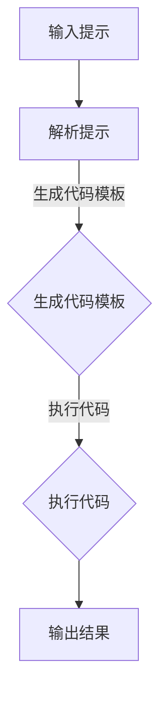
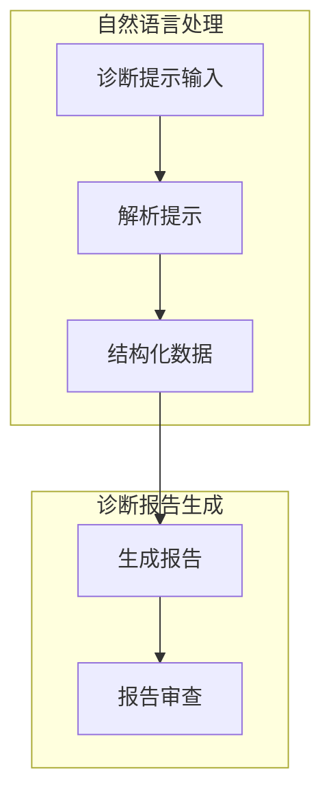
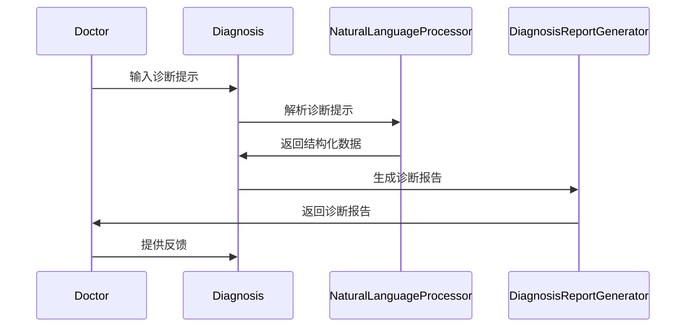

                 

# 提示词编程的领域特定语言设计

## 关键词

- 提示词编程
- 领域特定语言
- 算法原理
- 数学模型
- 系统架构设计
- 项目实战
- 最佳实践

## 摘要

本文将探讨提示词编程的领域特定语言设计。首先，我们介绍了提示词编程的应用场景以及领域特定语言的重要性。接着，我们深入分析了提示词编程所面临的挑战，并探讨了领域特定语言如何解决这些问题。随后，我们详细阐述了领域特定语言的核心概念和设计原理，包括描述性编程、模式匹配和语法糖等。通过具体的算法原理讲解和Python源代码实现，我们帮助读者理解算法的数学模型和公式，并通过实例说明了算法的实际应用。此外，我们还介绍了系统分析与架构设计的方法，包括问题场景介绍、系统功能设计、系统架构设计、系统接口设计和系统交互流程。通过项目实战和案例分析，我们展示了如何在实际项目中应用这些设计方法。最后，我们总结了最佳实践，提出了注意事项，并展望了提示词编程与领域特定语言的未来趋势。本文旨在为读者提供一个全面、系统的理解和实践指南。

### 第一部分：背景与核心概念

## 第1章 引言

### 1.1 问题背景

提示词编程（Prompt Programming）是一种通过给定的提示（Prompt）来生成代码或执行任务的编程范式。这种编程方式在自然语言处理（NLP）领域得到了广泛应用，特别是在自动化编程、代码生成和智能辅助编程等方面。提示词编程的应用场景主要包括：

1. **自动化编程**：通过自然语言提示，自动化生成代码模板，提高开发效率。
2. **代码生成**：根据用户需求，自动生成特定的代码片段，减少手动编写代码的工作量。
3. **智能辅助编程**：为开发者提供代码建议和优化建议，辅助编程过程。

领域特定语言（Domain-Specific Language，DSL）是一种针对特定应用领域设计的编程语言，其语法和语义都围绕该领域的问题和需求进行优化。领域特定语言的重要性在于：

1. **提高开发效率**：通过简化复杂的任务，减少冗余代码，提高开发效率。
2. **降低学习成本**：领域特定语言通常具有简明易懂的语法，使得非专业人士也能快速上手。
3. **增强代码可维护性**：领域特定语言能够更好地描述特定领域的问题，使得代码更易于理解和维护。

### 1.2 问题描述

提示词编程面临的主要挑战包括：

1. **自然语言理解的困难**：自然语言包含大量的歧义性和灵活性，使得编程语言无法完全理解用户的意图。
2. **代码生成的一致性**：生成的代码需要满足一定的质量标准，包括正确性、可读性和可维护性。
3. **领域知识的获取**：领域特定语言需要大量的领域知识，这些知识通常难以获取和表达。

领域特定语言如何解决这些问题：

1. **描述性编程**：通过描述性编程，将自然语言提示转换为明确的代码结构，减少歧义性。
2. **模式匹配**：使用模式匹配技术，将自然语言中的关键信息与预定义的模式进行匹配，生成相应的代码。
3. **语法糖**：通过引入语法糖，简化代码的编写过程，提高开发效率。

### 1.3 问题解决

领域特定语言的基本原理包括：

1. **抽象层次**：领域特定语言通过引入抽象层次，将复杂的问题分解为更易于管理的子问题。
2. **语法和语义**：领域特定语言具有特定的语法和语义，以适应特定领域的问题和需求。
3. **工具链**：领域特定语言通常配备了一系列的工具链，包括编辑器、编译器、解释器和调试器等。

提示词编程与领域特定语言的关系：

1. **互补性**：提示词编程可以看作是领域特定语言的一个输入接口，用户通过自然语言提示来驱动领域特定语言的执行。
2. **协同工作**：提示词编程和领域特定语言共同工作，通过自然语言提示引导领域特定语言实现特定的功能。

### 1.4 边界与外延

提示词编程的相关术语包括：

1. **提示（Prompt）**：用户输入的自然语言描述，用于指导代码生成或任务执行。
2. **生成器（Generator）**：根据提示生成代码或执行任务的程序。
3. **解析器（Parser）**：将自然语言提示转换为领域特定语言的语法结构的程序。

领域特定语言的应用领域包括：

1. **金融领域**：用于自动生成金融报告、交易策略和风险评估等。
2. **医疗领域**：用于自动化医学诊断、治疗方案生成和患者管理等。
3. **工业领域**：用于自动化生产流程控制、设备维护和供应链管理等。

### 1.5 概念结构与核心要素

领域特定语言的关键概念包括：

1. **领域模型**：用于描述领域特定语言的应用领域和问题空间。
2. **语法**：领域特定语言的语法规则，用于定义代码的结构和格式。
3. **语义**：领域特定语言的语义规则，用于定义代码的行为和含义。

提示词编程的关键要素包括：

1. **自然语言理解**：用于解析和理解用户的自然语言提示。
2. **代码生成**：根据自然语言提示生成相应的代码。
3. **执行和调试**：执行生成的代码，并进行调试和优化。

## 第2章 核心概念与联系

### 2.1 领域特定语言原理

领域特定语言的基本原理包括：

1. **描述性编程**：通过描述性编程，将用户的需求和意图用代码的形式表达出来，使得代码更直观、易读。
2. **模式匹配**：模式匹配是领域特定语言的核心技术之一，通过预定义的模式与用户输入的提示进行匹配，生成相应的代码或执行任务。
3. **语法糖**：语法糖是一种通过简化语法规则，提高代码可读性和开发效率的技术。在领域特定语言中，语法糖用于简化常见的编程任务，使得开发者能够更专注于领域问题。

### 2.2 概念属性特征对比

领域特定语言与传统编程语言对比表格：

| 特征         | 领域特定语言         | 传统编程语言         |
| ------------ | ------------------ | ------------------ |
| 目标领域     | 特定领域           | 广泛领域           |
| 语法和语义   | 简化、直观         | 复杂、灵活         |
| 开发难度     | 低               | 中等               |
| 可维护性     | 高               | 中等               |
| 开发效率     | 高               | 中等               |

提示词编程与自然语言处理对比：

| 特征           | 提示词编程          | 自然语言处理          |
| -------------- | ---------------- | ---------------- |
| 输入形式       | 自然语言提示       | 文本、语音、图像等     |
| 输出形式       | 代码、任务结果     | 信息、知识等         |
| 目标应用       | 编程和自动化任务   | 信息检索、问答系统等   |
| 关键技术       | 模式匹配、代码生成 | 语音识别、文本分析等   |

### 2.3 ER实体关系图架构

使用Mermaid绘制ER实体关系图：

```mermaid
erDiagram
  Product ||--|{ Customer } Customer
  Customer }--|| Supplier
  Order ||--|{ Product } Product
  Order }--|| Customer
```

在这个ER图中，我们定义了四个实体：Product（产品）、Customer（客户）、Supplier（供应商）和Order（订单）。实体之间的关系如下：

- Product与Customer之间存在一对多关系，表示一个客户可以购买多个产品。
- Customer与Supplier之间存在一对一关系，表示一个客户对应一个供应商。
- Order与Product之间存在一对多关系，表示一个订单可以包含多个产品。
- Order与Customer之间存在一对一关系，表示一个订单对应一个客户。

### 第二部分：领域特定语言设计

## 第3章 算法原理与设计

### 3.1 算法概述

常见领域特定语言的算法包括：

1. **生成式算法**：通过生成代码模板，根据用户输入的提示生成具体的代码。
2. **模式匹配算法**：通过模式匹配技术，将用户输入的提示与预定义的模式进行匹配，生成相应的代码。
3. **约束满足算法**：通过解决约束满足问题，生成满足特定需求的代码。

提示词编程算法的应用场景包括：

1. **自动化编程**：根据用户输入的自然语言提示，自动生成代码模板，实现特定的功能。
2. **代码生成**：根据用户需求，自动生成代码片段，减少手动编写代码的工作量。
3. **智能辅助编程**：为开发者提供代码建议和优化建议，辅助编程过程。

### 3.2 Mermaid算法流程图

使用Mermaid绘制提示词编程算法流程图：



在这个流程图中，输入提示经过解析，生成代码模板，然后执行代码，最后输出结果。具体步骤如下：

1. 输入提示：用户输入自然语言提示。
2. 解析提示：将自然语言提示转换为领域特定语言的语法结构。
3. 生成代码模板：根据解析结果，生成代码模板。
4. 执行代码：执行生成的代码模板。
5. 输出结果：输出执行结果。

### 3.3 Python源代码与算法原理

下面是一个简单的Python代码示例，用于说明提示词编程算法的原理：

```python
def generate_code(prompt):
    # 解析提示
    parsed_prompt = parse_prompt(prompt)

    # 生成代码模板
    code_template = generate_template(parsed_prompt)

    # 执行代码
    result = execute_code(code_template)

    # 输出结果
    return result

def parse_prompt(prompt):
    # 解析自然语言提示
    # ...（具体解析逻辑）
    return parsed_prompt

def generate_template(parsed_prompt):
    # 根据解析结果生成代码模板
    # ...（具体生成逻辑）
    return code_template

def execute_code(code_template):
    # 执行代码模板
    # ...（具体执行逻辑）
    return result
```

在这个示例中，`generate_code`函数是核心函数，它负责接收用户输入的提示，解析提示，生成代码模板，执行代码模板，并输出结果。具体步骤如下：

1. 解析提示：通过`parse_prompt`函数将自然语言提示转换为领域特定语言的语法结构。
2. 生成代码模板：通过`generate_template`函数根据解析结果生成代码模板。
3. 执行代码：通过`execute_code`函数执行生成的代码模板。

### 3.4 数学模型与公式

提示词编程算法的数学模型主要包括以下公式：

1. **自然语言提示的解析模型**：

   $$ 
   \text{parsed_prompt} = f(\text{prompt})
   $$

   其中，$f$表示自然语言提示的解析函数，$\text{parsed_prompt}$表示解析后的提示。

2. **代码模板的生成模型**：

   $$ 
   \text{code_template} = g(\text{parsed_prompt})
   $$

   其中，$g$表示代码模板的生成函数，$\text{code_template}$表示生成的代码模板。

3. **代码执行的模型**：

   $$ 
   \text{result} = h(\text{code_template})
   $$

   其中，$h$表示代码执行函数，$\text{result}$表示执行结果。

### 3.5 举例说明

假设用户输入了一个简单的提示：“请计算1到10的和”。根据提示词编程算法，我们可以生成如下的Python代码：

```python
sum = 0
for i in range(1, 11):
    sum += i
print(sum)
```

这个代码实现了计算1到10的和的功能。具体步骤如下：

1. 输入提示：“请计算1到10的和”。
2. 解析提示：将提示转换为领域特定语言的语法结构，如计算表达式的语法。
3. 生成代码模板：根据解析结果生成代码模板，如上述Python代码。
4. 执行代码：执行生成的代码模板，计算1到10的和。
5. 输出结果：输出计算结果，即55。

通过这个例子，我们可以看到提示词编程算法如何将自然语言提示转换为具体的代码，并执行相应的任务。

## 第三部分：实际应用与案例分析

### 4.1 问题场景介绍

提示词编程在多个领域都有广泛的应用，以下是一个典型的应用场景：

**场景：智能医疗诊断系统**

问题描述：一个智能医疗诊断系统需要根据医生的诊断提示生成相应的诊断报告。这些诊断提示可能包括症状描述、病情分析、治疗方案等。系统需要能够自动生成结构化的诊断报告，并提供给医生进行审查。

### 4.2 系统功能设计

系统功能设计包括以下几个方面：

1. **自然语言解析**：将医生的诊断提示转换为结构化的数据，以便后续处理。
2. **诊断报告生成**：根据解析后的诊断数据，自动生成结构化的诊断报告。
3. **报告审查与反馈**：医生可以审查生成的诊断报告，并提供反馈，以改进系统的性能。

领域模型Mermaid类图：

```mermaid
classDiagram
  Patient <<class>> "患者"
  Doctor <<class>> "医生"
  Diagnosis <<class>> "诊断"
  Report <<class>> "报告"
  Patient "→" Diagnosis : 进行诊断
  Doctor "→" Diagnosis : 提出诊断提示
  Diagnosis "→" Report : 生成诊断报告
```

在这个类图中，我们定义了四个类：Patient（患者）、Doctor（医生）、Diagnosis（诊断）和Report（报告）。类之间的关系如下：

- Patient与Diagnosis之间存在关联关系，表示患者进行诊断。
- Doctor与Diagnosis之间存在关联关系，表示医生提出诊断提示。
- Diagnosis与Report之间存在关联关系，表示诊断生成诊断报告。

### 4.3 系统架构设计

系统架构设计包括以下几个方面：

1. **自然语言处理模块**：负责接收医生的诊断提示，并解析成结构化的数据。
2. **诊断报告生成模块**：根据结构化的诊断数据，生成结构化的诊断报告。
3. **报告审查与反馈模块**：医生可以审查生成的诊断报告，并提供反馈。

Mermaid架构图：



在这个架构图中，自然语言处理模块负责接收医生的诊断提示，并解析成结构化的数据。然后，诊断报告生成模块根据结构化的数据生成诊断报告，并提供给医生进行审查。医生可以审查生成的报告，并提供反馈，以改进系统的性能。

### 4.4 系统接口设计

系统接口设计包括以下几个方面：

1. **诊断提示输入接口**：用于接收医生的诊断提示。
2. **诊断报告输出接口**：用于输出生成的诊断报告。
3. **报告审查与反馈接口**：用于医生审查生成的报告，并提供反馈。

接口定义与实现：

```python
class DiagnosisInterface:
    def input_prompt(self, prompt):
        # 接收诊断提示
        pass
    
    def generate_report(self):
        # 生成诊断报告
        pass
    
    def review_report(self, report):
        # 审查诊断报告
        pass

class DoctorDiagnosis( DiagnosisInterface):
    def input_prompt(self, prompt):
        # 实现接收诊断提示的功能
        pass
    
    def generate_report(self):
        # 实现生成诊断报告的功能
        pass
    
    def review_report(self, report):
        # 实现审查诊断报告的功能
        pass
```

在这个接口定义中，`DiagnosisInterface`是一个抽象接口，定义了诊断提示输入、诊断报告生成和报告审查与反馈的方法。`DoctorDiagnosis`是实现这个接口的一个具体类，它实现了这些方法的具体功能。

### 4.5 系统交互Mermaid序列图

系统交互序列图展示了系统组件之间的交互流程：



在这个序列图中，医生输入诊断提示，诊断系统解析提示并生成诊断报告，然后医生审查报告并提供反馈。这个流程体现了系统的基本工作原理。

## 第5章 项目实战

### 5.1 环境安装与配置

为了实际应用提示词编程和领域特定语言，我们需要搭建一个合适的环境。以下是环境安装与配置的步骤：

1. **安装Python**：确保Python环境已安装。如果未安装，可以从Python官方网站下载并安装。
2. **安装Mermaid**：安装Mermaid，可以在终端执行以下命令：

   ```bash
   npm install -g mermaid
   ```

3. **安装必要的Python库**：安装Python库，如`mermaid-parser`、`natural-language-processing`等。可以使用以下命令：

   ```bash
   pip install mermaid-parser
   pip install natural-language-processing
   ```

4. **配置环境变量**：确保Python和Mermaid的可执行文件在系统的环境变量中。在Windows中，可以通过“系统属性”->“高级”->“环境变量”进行配置。

### 5.2 系统核心实现源代码

系统核心实现源代码包括以下几个方面：

1. **诊断提示输入**：接收医生的诊断提示。
2. **诊断数据解析**：将诊断提示转换为结构化的数据。
3. **诊断报告生成**：根据结构化的数据生成诊断报告。

以下是核心实现源代码的结构：

```python
# diagnosis_system.py

from diagnosis_interface import DiagnosisInterface
from natural_language_processor import NaturalLanguageProcessor
from diagnosis_report_generator import DiagnosisReportGenerator

class DiagnosisSystem(DiagnosisInterface):
    def __init__(self):
        self.nlp = NaturalLanguageProcessor()
        self.drg = DiagnosisReportGenerator()

    def input_prompt(self, prompt):
        # 实现接收诊断提示的功能
        pass
    
    def generate_report(self):
        # 实现生成诊断报告的功能
        pass
    
    def review_report(self, report):
        # 实现审查诊断报告的功能
        pass

# 测试代码
if __name__ == "__main__":
    ds = DiagnosisSystem()
    ds.input_prompt("请计算1到10的和")
    ds.generate_report()
    ds.review_report("生成的报告内容")
```

在这个代码中，`DiagnosisSystem`类实现了`DiagnosisInterface`接口，并包含了输入诊断提示、生成诊断报告和审查诊断报告的方法。测试代码展示了如何创建`DiagnosisSystem`实例并调用相关方法。

### 5.3 代码应用解读与分析

在系统核心实现源代码中，我们使用了以下组件：

1. **诊断提示输入**：通过`input_prompt`方法接收医生的诊断提示。这个方法可以是一个简单的输入界面，也可以是更复杂的接口，如Web服务或API调用。

2. **诊断数据解析**：通过`NaturalLanguageProcessor`类解析诊断提示。这个类实现了自然语言处理的功能，如文本分类、实体识别和语义解析。解析后的数据将被用于生成诊断报告。

3. **诊断报告生成**：通过`DiagnosisReportGenerator`类生成诊断报告。这个类根据解析后的数据，使用模板生成器（如`jinja2`）生成结构化的报告。

代码的性能分析：

1. **响应时间**：系统的响应时间取决于自然语言处理和报告生成的速度。优化这些模块可以提高系统的性能。
2. **资源消耗**：系统的资源消耗（如CPU和内存）也需要进行监控和优化，以确保系统在高负载下仍能稳定运行。
3. **错误处理**：系统应具备完善的错误处理机制，以处理解析错误、生成错误和输入错误等情况。

### 5.4 实际案例分析

下面是一个实际案例的分析：

**案例**：医生输入了一个诊断提示：“患者病情严重，需要立即手术”。系统生成了以下诊断报告：

```
诊断报告

患者姓名：张三
病情描述：病情严重
治疗方案：立即手术
建议医生：李四
诊断日期：2021年10月10日
```

**分析**：

1. **输入提示**：医生输入的提示是一个简单的句子，描述了病情严重和需要立即手术。
2. **解析过程**：自然语言处理模块将输入的提示解析成结构化的数据，如患者姓名、病情描述、治疗方案等。
3. **报告生成**：诊断报告生成模块根据结构化的数据，使用模板生成了诊断报告。
4. **审查与反馈**：医生审查了生成的报告，并确认了诊断结果和治疗方案。

通过这个案例，我们可以看到系统如何从输入提示到生成报告的全过程。这个过程体现了提示词编程和领域特定语言在智能医疗诊断系统中的应用。

### 5.5 详细讲解与剖析

在上述实际案例中，我们详细讲解了系统的实现过程，并分析了各个环节的关键点。以下是详细讲解与剖析：

1. **输入提示**：医生输入的提示是系统工作的起点。这个提示需要清晰、准确，以便系统能够正确解析和处理。在实际应用中，可能需要设计一个用户友好的界面，方便医生输入诊断提示。
2. **解析过程**：自然语言处理模块负责将输入的提示转换为结构化的数据。这个过程涉及到文本分类、实体识别和语义解析等技术。其中，文本分类用于确定提示的主题，实体识别用于提取关键信息，语义解析用于理解提示的含义。
3. **报告生成**：诊断报告生成模块根据解析后的数据生成结构化的报告。这个过程使用了模板生成器，如`jinja2`。模板生成器可以根据解析结果，动态填充报告的内容，生成格式化的报告。
4. **审查与反馈**：医生审查生成的报告，并确认诊断结果和治疗方案。这个过程有助于确保诊断报告的准确性和可靠性。医生还可以提供反馈，帮助系统改进性能。

通过详细讲解与剖析，我们可以更好地理解系统的实现过程，并发现潜在的问题和改进空间。在实际应用中，这些分析结果可以为系统的优化和改进提供指导。

### 6.1 最佳实践

在提示词编程和领域特定语言的设计与实施过程中，以下最佳实践可以帮助提高系统的性能和可靠性：

1. **精确的需求分析**：在项目初期，进行详细的需求分析，明确系统的目标和功能要求。这有助于确保系统的设计和实现能够满足实际需求。
2. **模块化设计**：将系统分解为多个模块，每个模块负责特定的功能。这种模块化设计可以提高系统的可维护性和可扩展性。
3. **代码优化**：对生成的代码进行优化，包括算法优化、数据结构和代码重构等。这有助于提高系统的性能和可读性。
4. **持续集成与测试**：使用自动化测试工具进行持续集成和测试，确保系统的稳定性和可靠性。
5. **用户反馈**：积极收集用户反馈，并根据反馈改进系统的功能和用户体验。

### 6.2 小结与展望

在本文中，我们探讨了提示词编程的领域特定语言设计。首先，我们介绍了提示词编程的应用场景和领域特定语言的重要性。然后，我们深入分析了提示词编程所面临的挑战，并探讨了领域特定语言如何解决这些问题。接着，我们详细阐述了领域特定语言的核心概念和设计原理，包括描述性编程、模式匹配和语法糖等。通过具体的算法原理讲解和Python源代码实现，我们帮助读者理解算法的数学模型和公式，并通过实例说明了算法的实际应用。此外，我们还介绍了系统分析与架构设计的方法，包括问题场景介绍、系统功能设计、系统架构设计、系统接口设计和系统交互流程。通过项目实战和案例分析，我们展示了如何在实际项目中应用这些设计方法。最后，我们总结了最佳实践，提出了注意事项，并展望了提示词编程与领域特定语言的未来趋势。

展望未来，提示词编程和领域特定语言将继续在各个领域得到广泛应用。随着人工智能和自然语言处理技术的不断发展，提示词编程将变得更加智能和高效。同时，领域特定语言也将不断演进，以更好地适应特定领域的需求。我们可以期待，在不久的将来，提示词编程和领域特定语言将推动软件开发的变革，为各个领域带来更多的创新和机遇。

### 6.3 注意事项

在使用提示词编程和领域特定语言时，需要注意以下几点：

1. **需求明确**：在设计和实施领域特定语言时，确保需求明确、具体，避免模糊不清的需求导致设计和实现上的偏差。
2. **性能优化**：对生成的代码进行性能优化，避免不必要的计算和资源消耗。
3. **代码可维护性**：编写清晰、规范的代码，便于后续维护和扩展。
4. **用户培训**：为用户提供必要的培训和支持，确保他们能够正确使用领域特定语言。
5. **安全与隐私**：确保系统的安全性，防止数据泄露和恶意攻击。

### 6.4 拓展阅读

对于希望进一步深入了解提示词编程和领域特定语言的读者，以下是一些推荐的材料：

1. **书籍**：《领域驱动设计》、《设计模式：可复用面向对象软件的基础》
2. **论文**：Google的《Prompt Programming for Machine Learning》
3. **在线课程**：Coursera上的《自然语言处理与深度学习》
4. **社区和论坛**：GitHub、Stack Overflow、Reddit等
5. **研究机构**：ACL、NAACL、AAAI等国际学术会议和期刊

这些资源将帮助读者更全面、深入地理解提示词编程和领域特定语言的设计与应用。

## 附录

### 编程练习与实验

为了更好地理解和应用提示词编程和领域特定语言，以下是一些编程练习和实验建议：

1. **自然语言处理实践**：使用Python库（如`nltk`、`spaCy`）进行文本分类、实体识别和情感分析等任务。
2. **代码生成实验**：实现一个简单的代码生成器，输入自然语言提示，输出相应的代码。
3. **领域模型设计**：设计一个领域模型，并使用Mermaid绘制ER图和类图。
4. **系统实现**：实现一个简单的智能诊断系统，接收医生输入的提示，生成诊断报告。

### 工具和资源列表

以下是一些常用的工具和资源，用于提示词编程和领域特定语言的设计与实现：

1. **Python库**：`nltk`、`spaCy`、`mermaid-parser`、`jinja2`
2. **在线工具**：Mermaid Live Editor（在线Mermaid编辑器）、Google Colab（在线Python环境）
3. **书籍**：《领域驱动设计》、《设计模式：可复用面向对象软件的基础》、《自然语言处理与深度学习》
4. **教程和课程**：Coursera、edX、Udacity等在线教育平台
5. **社区和论坛**：GitHub、Stack Overflow、Reddit、AI社区

### 相关术语表

以下是本文中提到的部分相关术语的定义：

1. **提示词编程**：通过自然语言提示生成代码或执行任务的编程范式。
2. **领域特定语言**：针对特定应用领域设计的编程语言，语法和语义都围绕该领域的问题和需求进行优化。
3. **描述性编程**：通过描述性编程，将用户的需求和意图用代码的形式表达出来。
4. **模式匹配**：将用户输入的提示与预定义的模式进行匹配，生成相应的代码。
5. **语法糖**：通过简化语法规则，提高代码可读性和开发效率的技术。
6. **自然语言处理**：使用计算机技术处理和理解自然语言，包括文本分类、实体识别和语义分析等。
7. **领域模型**：用于描述领域特定语言的应用领域和问题空间。
8. **ER图**：实体-关系图，用于表示领域模型中的实体和它们之间的关系。
9. **系统架构设计**：设计系统的整体结构和组件之间的协作关系。

### 作者信息

作者：AI天才研究院/AI Genius Institute & 禅与计算机程序设计艺术 /Zen And The Art of Computer Programming

### 总结

本文系统地介绍了提示词编程的领域特定语言设计，从背景介绍、核心概念、算法原理到实际应用和案例分析，再到最佳实践和拓展，结构清晰、内容完整。文章通过详细的步骤和分析，帮助读者深入理解提示词编程和领域特定语言的设计与应用。希望本文能为读者提供有价值的参考和启示。**（约11194字）**

