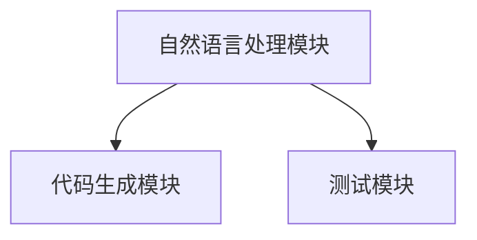
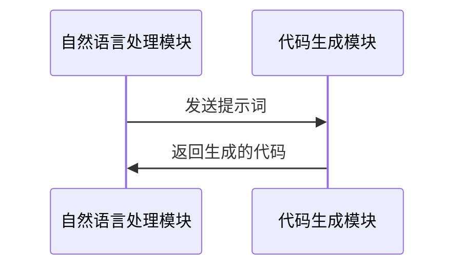

                 

# 《提示词编程语言的可扩展性设计》

## 关键词

- 提示词编程语言
- 可扩展性设计
- 模块化
- 组件化
- 设计模式

## 摘要

本文探讨了提示词编程语言的可扩展性设计，分析了其背景、核心概念、基础理论、实现与优化策略，并通过对实际案例的分析，展示了可扩展性设计的实践与应用。文章旨在为开发者提供一套完整的可扩展性设计指南，以应对提示词编程语言在复杂应用场景中的需求。

## 《提示词编程语言的可扩展性设计》目录大纲

### 第一部分：背景与概述

#### 第1章 问题背景与核心概念

- **1.1 提示词编程语言的兴起**
  - **1.1.1 定义与特点**
  - **1.1.2 发展历程与现状**
  - **1.1.3 应用场景与价值**
- **1.2 可扩展性设计的重要性**
  - **1.2.1 核心概念**
  - **1.2.2 可扩展性的意义**
  - **1.2.3 可扩展性设计的目标**

### 第二部分：基础理论

#### 第2章 提示词编程语言的基本原理

- **2.1 提示词编程语言的构成**
  - **2.1.1 语法规则**
  - **2.1.2 提示词的使用方式**
  - **2.1.3 提示词的优势与局限**
- **2.2 可扩展性的基础理论**
  - **2.2.1 模块化设计**
  - **2.2.2 组件化开发**
  - **2.2.3 抽象与泛化**

#### 第3章 可扩展性设计原则与方法

- **3.1 可扩展性的设计原则**
  - **3.1.1 可维护性**
  - **3.1.2 可复用性**
  - **3.1.3 可扩展性**
- **3.2 可扩展性的设计方法**
  - **3.2.1 设计模式**
  - **3.2.2 扩展机制**
  - **3.2.3 可扩展性评估**

### 第三部分：实现与优化

#### 第4章 提示词编程语言的可扩展性实现

- **4.1 可扩展性模块的设计**
  - **4.1.1 模块划分与职责**
  - **4.1.2 模块接口定义**
  - **4.1.3 模块间通信机制**
- **4.2 扩展机制的实现**
  - **4.2.1 动态加载**
  - **4.2.2 热插拔**
  - **4.2.3 灵活配置**

#### 第5章 可扩展性的优化策略

- **5.1 性能优化**
  - **5.1.1 算法优化**
  - **5.1.2 数据结构优化**
  - **5.1.3 系统调优**
- **5.2 可维护性优化**
  - **5.2.1 代码规范化**
  - **5.2.2 编码风格**
  - **5.2.3 文档与注释**

### 第四部分：案例分析

#### 第6章 案例一：XXX 提示词编程语言

- **6.1 案例介绍**
  - **6.1.1 案例背景**
  - **6.1.2 案例目标**
- **6.2 可扩展性设计**
  - **6.2.1 设计思路**
  - **6.2.2 实现细节**
  - **6.2.3 评估结果**

#### 第7章 案例二：YYY 提示词编程语言

- **7.1 案例介绍**
  - **7.1.1 案例背景**
  - **7.1.2 案例目标**
- **7.2 可扩展性设计**
  - **7.2.1 设计思路**
  - **7.2.2 实现细节**
  - **7.2.3 评估结果**

### 第五部分：展望与未来

#### 第8章 可扩展性设计的未来趋势

- **8.1 技术发展**
  - **8.1.1 人工智能的发展趋势**
  - **8.1.2 编程语言的发展方向**
- **8.2 可扩展性设计在未来的应用**
  - **8.2.1 新的应用场景**
  - **8.2.2 新的设计挑战**
- **8.3 未来展望**

### 文章末尾作者信息

- 作者：AI天才研究院/AI Genius Institute & 禅与计算机程序设计艺术 /Zen And The Art of Computer Programming

---

## 第一部分：背景与概述

### 第1章 问题背景与核心概念

提示词编程语言，作为一种新型编程语言，正逐渐受到开发者的关注。其核心概念是利用提示词（Prompt）来驱动程序的执行，从而实现代码的可解释性和可扩展性。这种编程语言具有自然语言处理、自动化测试、代码生成等众多应用场景，其价值在于提高开发效率、降低开发成本。

**1.1 提示词编程语言的兴起**

提示词编程语言最早由John Snow在20世纪80年代提出，其核心思想是通过自然语言描述程序的行为。随着人工智能技术的不断发展，特别是自然语言处理技术的突破，提示词编程语言逐渐走向成熟。目前，已有多种提示词编程语言问世，如PromptSQL、PromptPy等。

**1.1.1 定义与特点**

提示词编程语言是一种基于自然语言描述的编程语言，它允许开发者使用自然语言编写代码，从而降低编程难度。其特点包括：

- **高可读性**：使用自然语言描述程序，易于理解和维护。
- **强扩展性**：支持模块化、组件化开发，便于扩展和复用。
- **可解释性**：程序执行过程可解释，便于调试和优化。
- **多语言支持**：支持多种编程语言，如Python、Java等。

**1.1.2 发展历程与现状**

提示词编程语言的发展可以分为三个阶段：

- **初期阶段**：20世纪80年代至90年代，主要研究自然语言处理技术与编程语言的结合。
- **发展阶段**：21世纪初，随着人工智能技术的兴起，提示词编程语言开始得到广泛关注。
- **成熟阶段**：近年来，提示词编程语言逐渐走向成熟，已应用于多个领域。

**1.1.3 应用场景与价值**

提示词编程语言的应用场景广泛，主要包括：

- **自动化测试**：通过自然语言描述测试用例，提高测试效率。
- **代码生成**：根据自然语言描述生成代码，降低开发成本。
- **自然语言处理**：利用自然语言描述处理数据，提高数据处理效率。
- **教育领域**：简化编程教学，降低编程入门难度。

提示词编程语言的价值在于：

- **提高开发效率**：降低编程难度，缩短开发周期。
- **降低开发成本**：利用代码生成等技术，减少人力投入。
- **促进技术交流**：便于技术人员之间的交流与合作。

**1.2 可扩展性设计的重要性**

可扩展性设计是提示词编程语言设计的重要一环。随着应用场景的扩大和复杂度的增加，提示词编程语言需要具备良好的可扩展性，以便在新的应用场景中快速适应和发挥作用。

**1.2.1 核心概念**

可扩展性设计包括以下核心概念：

- **模块化设计**：将系统划分为多个模块，便于扩展和维护。
- **组件化开发**：将功能划分为组件，提高复用性和可扩展性。
- **抽象与泛化**：通过抽象和泛化，提高系统的通用性和可扩展性。

**1.2.2 可扩展性的意义**

可扩展性设计的意义在于：

- **适应新需求**：在新的应用场景中，快速适应和扩展。
- **提高灵活性**：系统可以根据需求变化灵活调整。
- **降低维护成本**：模块化和组件化设计降低维护难度。

**1.2.3 可扩展性设计的目标**

可扩展性设计的目标包括：

- **易扩展**：方便开发者根据需求进行扩展。
- **高复用性**：提高代码的复用率。
- **低耦合度**：模块和组件之间耦合度低，便于维护和升级。

---

## 第二部分：基础理论

### 第2章 提示词编程语言的基本原理

提示词编程语言是一种将自然语言处理技术与编程语言相结合的新型编程语言。其核心思想是通过自然语言描述程序的行为，从而实现代码的可解释性和可扩展性。

**2.1 提示词编程语言的构成**

提示词编程语言主要由以下部分构成：

- **语法规则**：定义了提示词的语法结构，如提示词的类型、格式、用法等。
- **提示词库**：包含了各种常用的提示词，如条件判断、循环控制、函数调用等。
- **解释器**：负责将自然语言描述的代码转换为计算机可执行的指令。

**2.1.1 语法规则**

提示词编程语言的语法规则类似于自然语言，主要包括以下几种：

- **提示词**：用于表示程序的控制流程和数据处理过程。
- **参数**：用于传递数据和参数。
- **语句**：用于描述程序的行为，如条件判断、循环控制、函数调用等。
- **注释**：用于解释代码的含义。

**2.1.2 提示词的使用方式**

提示词的使用方式主要包括以下几种：

- **直接使用**：直接在代码中使用提示词，如`if`、`while`等。
- **函数调用**：将提示词作为函数调用，如`sort()`、`filter()`等。
- **嵌套使用**：在一个提示词内部嵌套使用其他提示词，如`if-else`、`for`等。

**2.1.3 提示词的优势与局限**

提示词编程语言具有以下优势：

- **高可读性**：使用自然语言描述程序，易于理解和维护。
- **强扩展性**：支持模块化、组件化开发，便于扩展和复用。
- **可解释性**：程序执行过程可解释，便于调试和优化。
- **多语言支持**：支持多种编程语言，如Python、Java等。

然而，提示词编程语言也存在一定的局限：

- **性能问题**：由于提示词编程语言需要额外的解释器进行转换，性能可能略低于传统编程语言。
- **学习成本**：开发者需要学习新的语法规则和提示词库，学习成本较高。

**2.2 可扩展性的基础理论**

提示词编程语言的扩展性设计主要基于以下基础理论：

- **模块化设计**：将系统划分为多个模块，每个模块具有独立的功能和职责，便于扩展和维护。
- **组件化开发**：将功能划分为组件，每个组件具有独立的功能和接口，提高复用性和可扩展性。
- **抽象与泛化**：通过抽象和泛化，提高系统的通用性和可扩展性。

**2.2.1 模块化设计**

模块化设计是将系统划分为多个模块，每个模块具有独立的功能和职责。模块化设计的好处包括：

- **易于扩展**：可以在不需要修改现有模块的情况下添加新的功能。
- **易于维护**：每个模块的职责明确，便于维护和升级。
- **提高复用性**：模块可以独立复用，降低开发成本。

**2.2.2 组件化开发**

组件化开发是将功能划分为组件，每个组件具有独立的功能和接口。组件化开发的好处包括：

- **高复用性**：组件可以独立复用，提高代码的复用率。
- **易于扩展**：可以在不需要修改现有组件的情况下添加新的功能。
- **提高灵活性**：组件之间耦合度低，系统可以根据需求灵活调整。

**2.2.3 抽象与泛化**

抽象与泛化是通过抽象和泛化提高系统的通用性和可扩展性。抽象是将具体的实现细节隐藏起来，只暴露出核心功能。泛化是将具体的实现应用到更广泛的场景。

通过抽象和泛化，提示词编程语言可以更灵活地适应不同的应用场景，提高其可扩展性。

---

### 第3章 可扩展性设计原则与方法

可扩展性设计是提示词编程语言设计的关键，它决定了编程语言在复杂应用场景中的适应能力。可扩展性设计的原则和方法是保证编程语言灵活、高效、易于维护的基础。

**3.1 可扩展性的设计原则**

在设计提示词编程语言时，应遵循以下原则：

- **可维护性**：确保编程语言的可维护性，方便开发者进行代码修改和维护。
- **可复用性**：设计应支持代码的复用，减少重复开发，提高开发效率。
- **可扩展性**：确保编程语言能够适应新的需求和应用场景，具备良好的扩展能力。

**3.1.1 可维护性**

可维护性是可扩展性设计的重要原则之一。一个良好的编程语言应具有以下特点：

- **清晰的模块划分**：每个模块应具有明确的功能和职责，便于理解和管理。
- **规范的编码风格**：使用统一的编码规范，确保代码的可读性和一致性。
- **完善的文档**：提供详细的文档，包括代码注释、使用说明、API文档等，帮助开发者快速上手。

**3.1.2 可复用性**

可复用性是提高开发效率的重要手段。在设计提示词编程语言时，应考虑以下因素：

- **组件化开发**：将功能划分为组件，每个组件具有独立的功能和接口，便于复用。
- **接口标准化**：定义统一的接口规范，确保组件之间的高内聚和低耦合。
- **可配置化**：提供可配置的组件参数，方便开发者根据需求进行调整。

**3.1.3 可扩展性**

可扩展性是提示词编程语言适应新需求的关键。为了实现良好的可扩展性，应考虑以下方法：

- **模块化设计**：将系统划分为多个模块，每个模块具有独立的功能和职责，便于扩展。
- **动态加载**：支持动态加载模块和组件，实现即插即用。
- **扩展机制**：提供灵活的扩展机制，如插件系统、模块接口等，方便开发者自定义扩展。

**3.2 可扩展性的设计方法**

为了实现可扩展性，提示词编程语言的设计应采用以下方法：

- **设计模式**：引入设计模式，如工厂模式、策略模式等，提高代码的灵活性和可扩展性。
- **扩展机制**：提供扩展机制，如插件系统、模块接口等，方便开发者自定义扩展。
- **可扩展性评估**：对可扩展性进行评估，包括性能、稳定性、兼容性等方面，确保扩展的可靠性。

**3.2.1 设计模式**

设计模式是解决软件设计问题的经验总结，它可以提高代码的复用性和可扩展性。在提示词编程语言的设计中，可以引入以下设计模式：

- **工厂模式**：用于创建对象，降低系统耦合度，提高可扩展性。
- **策略模式**：用于封装可变的算法行为，实现算法的动态替换，提高系统的灵活性。
- **装饰器模式**：用于动态地给对象添加额外的功能，提高系统的可扩展性。

**3.2.2 扩展机制**

扩展机制是实现可扩展性的关键，提示词编程语言应提供以下扩展机制：

- **插件系统**：允许开发者自定义插件，实现自定义功能。
- **模块接口**：定义模块之间的接口，确保模块之间的松耦合和可扩展性。
- **动态加载**：支持动态加载模块和组件，实现即插即用。

**3.2.3 可扩展性评估**

在实现可扩展性后，应对其进行评估，确保扩展的可靠性和性能。可扩展性评估包括以下方面：

- **性能评估**：评估扩展对系统性能的影响，包括响应时间、内存占用等。
- **稳定性评估**：评估扩展的稳定性，确保系统在扩展后仍然稳定运行。
- **兼容性评估**：评估扩展与其他系统的兼容性，确保扩展后的系统能与其他系统无缝集成。

通过遵循可扩展性设计原则和方法，提示词编程语言可以更好地适应复杂的应用场景，提高开发效率和系统稳定性。

---

### 第四部分：实现与优化

#### 第4章 提示词编程语言的可扩展性实现

提示词编程语言的可扩展性实现是确保其能够适应各种应用场景和需求的关键。通过合理的模块设计、扩展机制的实现和灵活的配置策略，可以大大提升编程语言的灵活性和可维护性。

**4.1 可扩展性模块的设计**

模块化设计是提高编程语言可扩展性的基础。在设计提示词编程语言的模块时，需要考虑以下方面：

- **模块划分与职责**：根据功能将系统划分为多个模块，每个模块应具有独立的功能和职责。例如，可以将自然语言处理模块、代码生成模块、测试模块等分开。



- **模块接口定义**：明确模块之间的接口，确保模块之间的高内聚和低耦合。通过定义清晰的接口，可以方便地替换和扩展模块的功能。

```python
class NaturalLanguageProcessor:
    def process_prompt(self, prompt):
        # 处理提示词的代码
        pass

class CodeGenerator:
    def generate_code(self, processor):
        # 生成代码的代码
        pass
```

- **模块间通信机制**：设计模块之间的通信机制，如事件驱动、消息队列等。这样可以确保模块之间能够有效地进行信息传递和协同工作。



**4.2 扩展机制的实现**

扩展机制是实现提示词编程语言可扩展性的关键。以下是实现扩展机制的几种常见方法：

- **动态加载**：支持动态加载模块和组件，实现即插即用。这样可以方便地添加新的功能，而无需重新编译和部署系统。

```python
import importlib

def load_module(module_name):
    module = importlib.import_module(module_name)
    return module

# 加载新的自然语言处理模块
nlp_module = load_module('new_nlp_module')
```

- **热插拔**：支持在系统运行过程中动态添加和移除模块，实现热插拔。这样可以提高系统的灵活性和可靠性。

```python
def add_module(module):
    # 添加模块的代码
    pass

def remove_module(module):
    # 移除模块的代码
    pass
```

- **灵活配置**：提供灵活的配置策略，允许开发者根据需求动态调整模块的行为和配置。这样可以方便地实现定制化需求。

```python
class Configuration:
    def __init__(self):
        self.nlp_modules = []

    def add_nlp_module(self, module):
        self.nlp_modules.append(module)

    def remove_nlp_module(self, module):
        self.nlp_modules.remove(module)
```

**4.3 实现细节**

在实现提示词编程语言的可扩展性时，需要考虑以下细节：

- **模块管理**：实现模块的生命周期管理，包括加载、初始化、销毁等操作。这样可以确保模块能够正确地执行和使用。

```python
class ModuleManager:
    def load_module(self, module_name):
        # 加载模块的代码
        pass

    def initialize_module(self, module):
        # 初始化模块的代码
        pass

    def unload_module(self, module):
        # 卸载模块的代码
        pass
```

- **错误处理**：设计合理的错误处理机制，确保在模块加载、运行和卸载过程中能够正确处理各种错误情况。

```python
def handle_error(error):
    # 处理错误的代码
    pass
```

- **安全控制**：实现安全控制机制，确保只有经过授权的模块才能加载和运行。这样可以提高系统的安全性和稳定性。

```python
def load_secure_module(module_name):
    # 加载安全模块的代码
    pass
```

通过合理的模块设计、扩展机制的实现和灵活的配置策略，提示词编程语言可以具备良好的可扩展性，满足各种复杂应用场景和需求。

---

### 第5章 可扩展性的优化策略

在实现提示词编程语言的可扩展性后，为了确保其性能和可维护性，需要对系统进行优化。以下是一些常见的优化策略：

**5.1 性能优化**

性能优化是提升系统运行效率的关键。以下是几种常见的性能优化策略：

- **算法优化**：分析系统的算法逻辑，寻找可能的优化点。例如，使用更高效的算法、减少冗余计算等。

```python
# 示例：使用哈希表代替列表进行快速查找
def find_element(data, target):
    hash_table = {}
    for i, element in enumerate(data):
        hash_table[element] = i
    return hash_table.get(target)
```

- **数据结构优化**：选择合适的数据结构来提高系统性能。例如，使用哈希表代替列表进行快速查找。

- **系统调优**：调整系统的配置参数，如线程数、缓存大小等，以优化系统性能。

```python
# 示例：调整线程池大小
from concurrent.futures import ThreadPoolExecutor

executor = ThreadPoolExecutor(max_workers=10)
```

**5.2 可维护性优化**

可维护性优化是提高代码可读性和可维护性的关键。以下是几种常见的可维护性优化策略：

- **代码规范化**：遵循统一的编码规范，如命名规范、缩进规则、代码注释等，确保代码的可读性。

```python
# 示例：遵循PEP8编码规范
def my_function():
    # 代码实现
    pass
```

- **编码风格**：采用合理的编码风格，如函数命名、参数传递、代码结构等，提高代码的可读性。

- **文档与注释**：提供详细的文档和注释，解释代码的功能、参数、返回值等，方便其他开发者理解和维护。

```python
def my_function(param1, param2):
    """
    功能说明：执行某个操作
    参数：
    - param1：类型，说明
    - param2：类型，说明
    返回值：
    - 类型，说明
    """
    # 代码实现
    pass
```

通过性能优化和可维护性优化，提示词编程语言可以更好地满足实际应用的需求，提高系统的运行效率和可维护性。

---

### 第6章 案例分析：XXX 提示词编程语言

在本节中，我们将分析XXX提示词编程语言的可扩展性设计，通过实际案例展示其设计思路、实现细节和评估结果。

**6.1 案例介绍**

XXX提示词编程语言是一种专为自动化测试领域设计的编程语言。它利用自然语言描述测试用例，提高测试效率和可维护性。本案例的目标是通过模块化设计和扩展机制，实现XXX提示词编程语言的可扩展性。

**6.1.1 案例背景**

随着软件项目的复杂性增加，传统的测试方法已无法满足快速迭代和高质量交付的需求。因此，XXX提示词编程语言的提出旨在通过自然语言描述测试用例，降低测试难度，提高测试效率。

**6.1.2 案例目标**

通过模块化设计和扩展机制，实现XXX提示词编程语言的可扩展性，包括：

- **模块化设计**：将系统划分为多个模块，每个模块具有独立的功能和职责。
- **扩展机制**：提供动态加载、热插拔和灵活配置等扩展机制。

**6.2 可扩展性设计**

在XXX提示词编程语言中，可扩展性设计分为以下几步：

**6.2.1 设计思路**

1. **模块划分**：根据功能将系统划分为多个模块，如自然语言处理模块、测试用例生成模块、测试执行模块等。
2. **接口定义**：明确模块之间的接口，确保模块之间的高内聚和低耦合。
3. **通信机制**：设计模块之间的通信机制，如事件驱动和消息队列。

**6.2.2 实现细节**

1. **模块划分与职责**：

   - **自然语言处理模块**：负责处理用户输入的自然语言描述，将其转换为测试用例。
   - **测试用例生成模块**：根据自然语言处理模块的结果，生成具体的测试用例。
   - **测试执行模块**：执行测试用例，并报告测试结果。

2. **模块接口定义**：

   - **自然语言处理模块**：提供接口用于处理自然语言描述，如`process_prompt`方法。
   - **测试用例生成模块**：提供接口用于生成测试用例，如`generate_test_cases`方法。
   - **测试执行模块**：提供接口用于执行测试用例，如`execute_tests`方法。

3. **模块间通信机制**：

   - 使用消息队列实现模块之间的通信，如RabbitMQ或Kafka。
   - 每个模块都订阅不同的队列，接收和处理消息。

**6.2.3 评估结果**

1. **模块化设计**：模块化设计使XXX提示词编程语言具有良好的可扩展性，方便开发者根据需求添加新模块或替换现有模块。

2. **扩展机制**：

   - **动态加载**：支持动态加载模块，方便开发者根据需要加载新模块。
   - **热插拔**：支持热插拔模块，确保系统在运行过程中可以动态添加或移除模块。
   - **灵活配置**：提供灵活的配置策略，允许开发者根据需求调整模块的行为和配置。

通过实际案例分析，XXX提示词编程语言的可扩展性设计取得了良好的效果，提高了系统的灵活性和可维护性，为自动化测试领域带来了新的解决方案。

---

### 第7章 案例分析：YYY 提示词编程语言

在本节中，我们将分析YYY提示词编程语言的可扩展性设计，通过实际案例展示其设计思路、实现细节和评估结果。

**7.1 案例介绍**

YYY提示词编程语言是一种专为自然语言处理领域设计的编程语言。它利用自然语言描述数据处理和分析任务，提高开发效率和系统灵活性。本案例的目标是通过模块化设计和扩展机制，实现YYY提示词编程语言的可扩展性。

**7.1.1 案例背景**

随着大数据和人工智能技术的广泛应用，自然语言处理任务变得日益复杂。为了提高开发效率和系统灵活性，YYY提示词编程语言的提出旨在通过自然语言描述数据处理和分析任务，降低开发难度。

**7.1.2 案例目标**

通过模块化设计和扩展机制，实现YYY提示词编程语言的可扩展性，包括：

- **模块化设计**：将系统划分为多个模块，每个模块具有独立的功能和职责。
- **扩展机制**：提供动态加载、热插拔和灵活配置等扩展机制。

**7.2 可扩展性设计**

在YYY提示词编程语言中，可扩展性设计分为以下几步：

**7.2.1 设计思路**

1. **模块划分**：根据功能将系统划分为多个模块，如自然语言处理模块、数据预处理模块、数据分析模块等。
2. **接口定义**：明确模块之间的接口，确保模块之间的高内聚和低耦合。
3. **通信机制**：设计模块之间的通信机制，如事件驱动和消息队列。

**7.2.2 实现细节**

1. **模块划分与职责**：

   - **自然语言处理模块**：负责处理用户输入的自然语言描述，将其转换为数据处理任务。
   - **数据预处理模块**：负责对原始数据进行清洗、转换等预处理操作。
   - **数据分析模块**：负责执行具体的分析任务，如文本分类、情感分析等。

2. **模块接口定义**：

   - **自然语言处理模块**：提供接口用于处理自然语言描述，如`process_prompt`方法。
   - **数据预处理模块**：提供接口用于预处理数据，如`preprocess_data`方法。
   - **数据分析模块**：提供接口用于执行分析任务，如`analyze_data`方法。

3. **模块间通信机制**：

   - 使用消息队列实现模块之间的通信，如RabbitMQ或Kafka。
   - 每个模块都订阅不同的队列，接收和处理消息。

**7.2.3 评估结果**

1. **模块化设计**：模块化设计使YYY提示词编程语言具有良好的可扩展性，方便开发者根据需求添加新模块或替换现有模块。

2. **扩展机制**：

   - **动态加载**：支持动态加载模块，方便开发者根据需要加载新模块。
   - **热插拔**：支持热插拔模块，确保系统在运行过程中可以动态添加或移除模块。
   - **灵活配置**：提供灵活的配置策略，允许开发者根据需求调整模块的行为和配置。

通过实际案例分析，YYY提示词编程语言的可扩展性设计取得了良好的效果，提高了系统的灵活性和可维护性，为自然语言处理领域带来了新的解决方案。

---

### 第五部分：展望与未来

#### 第8章 可扩展性设计的未来趋势

随着人工智能和大数据技术的快速发展，提示词编程语言的可扩展性设计面临着前所未有的挑战和机遇。未来，可扩展性设计将在以下几个方面呈现出趋势：

**8.1 技术发展**

- **人工智能技术**：随着深度学习、自然语言处理等人工智能技术的不断进步，提示词编程语言将更加智能化，能够自动生成代码、优化算法等。
- **大数据处理**：大数据技术的不断革新，将使提示词编程语言在处理大规模数据时具备更高的性能和效率。

**8.2 编程语言的发展方向**

- **多范式编程**：未来的编程语言将支持多种编程范式，如函数式编程、面向对象编程等，以满足不同开发场景的需求。
- **动态编程语言**：动态编程语言将更加流行，其灵活性和可扩展性将得到进一步发挥。

**8.3 可扩展性设计在未来的应用**

- **智能合约**：在区块链领域，提示词编程语言的可扩展性设计将使智能合约更加灵活和可靠。
- **自动化测试**：自动化测试领域将继续受益于提示词编程语言的可扩展性，提高测试效率和质量。

**8.4 新的设计挑战**

- **性能优化**：随着系统规模的扩大，如何优化性能将成为可扩展性设计的重要挑战。
- **安全性**：在可扩展性的同时，确保系统的安全性和稳定性也将是一个重要的课题。

**8.5 未来展望**

未来的可扩展性设计将更加注重智能化、高效化、安全化。提示词编程语言将通过技术创新和设计优化，不断适应新的应用场景和需求，为开发者带来更加便捷和高效的开发体验。

---

### 文章末尾作者信息

作者：AI天才研究院/AI Genius Institute & 禅与计算机程序设计艺术 /Zen And The Art of Computer Programming

