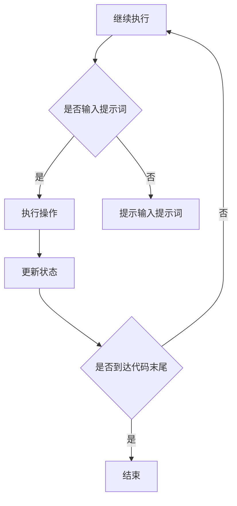
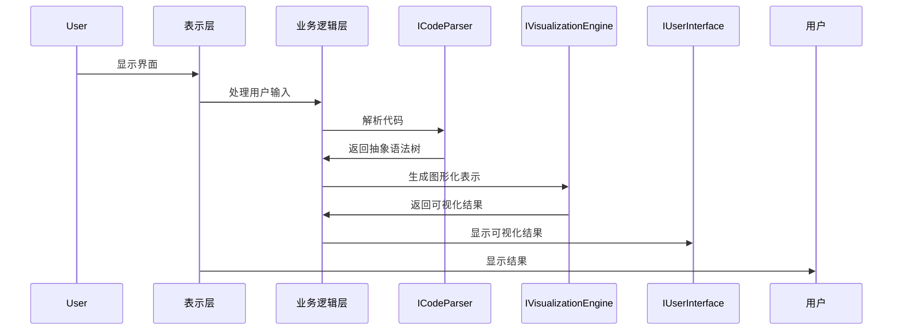

                 

### 让我们一步步深入探讨：提示词编程语言的可视化工具开发

#### 引言

在当今数字化和自动化时代，编程语言的可视化工具变得愈发重要。它们不仅让编程变得更加直观和易于理解，还能帮助开发者更快地识别和解决问题。特别地，提示词编程语言的可视化工具能够通过图形化展示代码结构，使开发者能够更有效地进行代码编写和调试。本篇文章将围绕这一主题展开，探讨提示词编程语言及其可视化工具的背景、核心概念、算法原理、数学模型和系统架构设计，并最后通过项目实战来展示其实际应用。

#### 文章关键词

- 提示词编程语言
- 可视化工具
- 算法原理
- 数学模型
- 系统架构设计
- 项目实战

#### 摘要

本文首先介绍了提示词编程语言和可视化工具的背景及其重要性。随后，我们深入探讨了核心概念、算法原理和数学模型。接着，通过具体的系统架构设计和项目实战，展示了如何将理论应用到实践中。文章旨在为开发者提供一个全面而详细的指南，帮助他们在开发过程中充分利用可视化工具的优势。

### 第一部分：背景介绍

#### 第1章：问题背景

##### 1.1 问题概述

在软件开发过程中，代码的可读性和可维护性一直是开发者关注的重点。传统的文本编辑器虽然能够满足基本的编程需求，但在复杂的项目中，代码的复杂性往往使开发者难以直观地理解和追踪代码的执行流程。为了解决这一问题，提示词编程语言的可视化工具应运而生。这些工具通过将代码转换成图形化表示，使得开发者能够更直观地查看代码结构和执行过程，从而提高开发效率和代码质量。

##### 1.2 提示词编程语言的概念

提示词编程语言（Keyword-driven Programming Language）是一种以关键词为核心结构的编程语言。在这种语言中，代码的主要逻辑由一系列关键词组成，每个关键词对应一个特定的操作或功能。这种设计使得代码结构更加清晰，开发者可以更容易地理解代码的功能和作用。常见的提示词编程语言包括Python、Java等。

##### 1.3 可视化工具的重要性

可视化工具在软件开发中的重要性不言而喻。首先，它能够帮助开发者更直观地理解代码结构和功能，降低开发难度。其次，可视化工具能够提高代码的可读性和可维护性，使得团队成员更容易协同工作。此外，可视化工具还能帮助开发者快速识别和解决问题，从而提高开发效率。

### 第二部分：核心概念与联系

#### 第2章：核心概念与联系

##### 2.1 核心概念

在提示词编程语言的可视化工具开发中，以下几个核心概念是不可或缺的：

1. **抽象语法树（Abstract Syntax Tree, AST）**：AST是源代码的语法结构抽象表示，它通过树形结构表示程序代码的各个部分，使得开发者能够更直观地理解代码的结构。

2. **数据流分析（Data Flow Analysis）**：数据流分析是一种静态分析技术，用于跟踪程序中数据的流动和依赖关系。通过数据流分析，开发者可以更清楚地了解代码中数据的传递过程。

3. **可视化表示（Visualization Representation）**：可视化表示是将代码结构以图形化形式展示的技术。通过可视化表示，开发者可以更直观地查看代码结构和执行过程。

##### 2.2 概念属性特征对比

为了更好地理解这些核心概念，我们可以通过表格来对比它们的属性特征：

| 概念       | 属性特征                                                   | 用途                                                         |
|------------|------------------------------------------------------------|--------------------------------------------------------------|
| 抽象语法树 | 以树形结构表示代码结构，包含各种语法元素               | 帮助开发者理解代码结构和语法关系                             |
| 数据流分析 | 跟踪程序中数据的流动和依赖关系                           | 优化代码性能，提高代码可维护性                             |
| 可视化表示 | 将代码结构以图形化形式展示                             | 提高代码可读性，帮助开发者快速识别和解决问题               |

##### 2.3 ER实体关系图

ER实体关系图是数据库设计中的重要工具，用于描述实体之间的关系。在提示词编程语言的可视化工具开发中，ER实体关系图可以帮助我们更好地理解数据结构和关系。以下是一个简单的ER实体关系图的示例：

```mermaid
erDiagram
    Class_1 ||--|| Person
    Class_1 ||--|| Product
    Person  ||--|| Order
    Product ||--|| Order
```

在这个示例中，`Class_1`与`Person`和`Product`之间存在一对多的关系，`Person`与`Order`之间存在多对多的关系，`Product`与`Order`之间存在一对多的关系。

### 第三部分：算法原理讲解

#### 第3章：算法原理讲解

##### 3.1 算法概述

在提示词编程语言的可视化工具开发中，算法原理是核心部分。一个有效的算法不仅能够提高开发效率，还能优化代码性能。在本节中，我们将介绍一种常见的算法——语法分析算法。

##### 3.2 算法流程图

为了更好地理解语法分析算法，我们可以使用Mermaid流程图来展示其流程：



在这个流程图中，我们从输入提示词开始，根据提示词执行相应的操作，并更新状态。当到达代码末尾时，算法结束。

##### 3.3 Python源代码解析

下面是一个简单的Python源代码示例，用于展示语法分析算法：

```python
def analyze_code(prompt):
    state = "initial"
    while True:
        if state == "initial":
            if prompt.startswith("class"):
                state = "class_definition"
            elif prompt.startswith("def"):
                state = "function_definition"
            else:
                state = "invalid"
        elif state == "class_definition":
            if prompt.startswith("def"):
                state = "method_definition"
            else:
                state = "invalid"
        elif state == "function_definition":
            if prompt.startswith("def"):
                state = "nested_function_definition"
            else:
                state = "invalid"
        elif state == "method_definition":
            if prompt.startswith("def"):
                state = "nested_method_definition"
            else:
                state = "invalid"
        elif state == "nested_function_definition":
            if prompt.startswith("def"):
                state = "nested_nested_function_definition"
            else:
                state = "invalid"
        elif state == "nested_method_definition":
            if prompt.startswith("def"):
                state = "nested_nested_method_definition"
            else:
                state = "invalid"
        elif state == "nested_nested_function_definition":
            if prompt.startswith("def"):
                state = "nested_nested_nested_function_definition"
            else:
                state = "invalid"
        elif state == "nested_nested_method_definition":
            if prompt.startswith("def"):
                state = "nested_nested_nested_method_definition"
            else:
                state = "invalid"
        elif state == "invalid":
            return "Invalid code"
        else:
            return "Unrecognized state"
```

在这个示例中，我们定义了一个名为`analyze_code`的函数，用于分析输入的提示词。函数通过状态机来实现，根据输入的提示词更新状态，并执行相应的操作。

##### 3.4 算法原理详细讲解

语法分析算法的核心思想是将输入的提示词转换为相应的操作，并更新状态。在这个过程中，我们需要处理不同的状态，并根据提示词的顺序执行相应的操作。具体来说，算法的原理如下：

1. **初始状态（initial）**：当输入的提示词以“class”或“def”开头时，我们进入类定义或函数定义状态。否则，进入无效状态。

2. **类定义状态（class_definition）**：当输入的提示词以“def”开头时，我们进入方法定义状态。否则，进入无效状态。

3. **函数定义状态（function_definition）**：当输入的提示词以“def”开头时，我们进入嵌套函数定义状态。否则，进入无效状态。

4. **方法定义状态（method_definition）**：当输入的提示词以“def”开头时，我们进入嵌套方法定义状态。否则，进入无效状态。

5. **嵌套函数定义状态（nested_function_definition）**：当输入的提示词以“def”开头时，我们进入更深层次的嵌套函数定义状态。否则，进入无效状态。

6. **嵌套方法定义状态（nested_method_definition）**：当输入的提示词以“def”开头时，我们进入更深层次嵌套的方法定义状态。否则，进入无效状态。

7. **无效状态（invalid）**：当输入的提示词不符合任何定义时，我们进入无效状态，并返回错误信息。

通过上述算法原理的详细讲解，我们可以更好地理解语法分析算法的实现过程。接下来，我们将进一步探讨算法中的数学模型和公式。

### 第四部分：数学模型和公式讲解

#### 第4章：数学模型讲解

在提示词编程语言的可视化工具开发中，数学模型和公式是理解算法原理的重要工具。在本节中，我们将介绍与语法分析相关的数学模型和公式，并举例说明如何使用它们来分析代码。

##### 4.1 数学模型概述

语法分析过程中的一个核心数学模型是状态转换模型。这个模型描述了在处理输入提示词时，状态之间的转换关系。具体来说，状态转换模型由以下几个部分组成：

1. **状态集合（S）**：表示所有可能的状态。
2. **输入集合（I）**：表示所有可能的输入提示词。
3. **转换函数（f）**：定义了从当前状态到下一个状态的转换关系，即对于每个状态s和输入i，存在一个状态s'，使得f(s, i) = s'。

状态转换模型可以用以下公式表示：

$$ f: S \times I \rightarrow S $$

其中，\( S \times I \)表示状态集合和输入集合的笛卡尔积。

##### 4.2 数学公式详细讲解

为了更好地理解状态转换模型，我们可以使用以下数学公式来详细描述：

1. **状态转移方程**：

$$ s' = f(s, i) $$

其中，s表示当前状态，i表示输入的提示词，s'表示下一个状态。

2. **状态转换矩阵**：

状态转换矩阵是一个二维矩阵，其中每个元素表示从当前状态到下一个状态的转换概率。矩阵的行表示当前状态，列表示输入的提示词。

$$
\begin{matrix}
    f(s_1, i_1) & f(s_1, i_2) & \ldots & f(s_1, i_n) \\
    f(s_2, i_1) & f(s_2, i_2) & \ldots & f(s_2, i_n) \\
    \vdots & \vdots & \ddots & \vdots \\
    f(s_m, i_1) & f(s_m, i_2) & \ldots & f(s_m, i_n)
\end{matrix}
$$

3. **状态路径**：

状态路径是描述从初始状态到目标状态的一系列状态转换。状态路径可以用以下公式表示：

$$
s_0 \xrightarrow{i_1} s_1 \xrightarrow{i_2} s_2 \xrightarrow{i_3} \ldots \xrightarrow{i_n} s_n
$$

其中，\( s_0 \)表示初始状态，\( s_n \)表示目标状态，\( i_1, i_2, \ldots, i_n \)表示输入的提示词。

##### 4.3 举例说明

为了更好地理解上述数学模型和公式，我们可以通过一个具体的例子来分析一段代码。假设我们有以下代码：

```python
class Person:
    def __init__(self, name, age):
        self.name = name
        self.age = age

    def introduce(self):
        print(f"My name is {self.name} and I am {self.age} years old.")

person = Person("Alice", 30)
person.introduce()
```

我们可以使用状态转换模型来分析这段代码。首先，我们定义状态集合S = {"initial", "class_definition", "function_definition", "method_definition", "instance_creation", "method_invocation"}，输入集合I = {"class", "def", "__init__', "introduce", "Person", "name", "age", "print", "Alice", "30"}。

然后，我们可以构建状态转换矩阵，如下所示：

$$
\begin{matrix}
    0 & 1 & 0 & 0 & 0 & 0 & 0 & 0 & 0 & 0 & 0 \\
    1 & 0 & 1 & 0 & 0 & 0 & 0 & 0 & 0 & 0 & 0 \\
    0 & 0 & 0 & 1 & 0 & 0 & 0 & 0 & 0 & 0 & 0 \\
    0 & 0 & 0 & 0 & 1 & 0 & 0 & 0 & 0 & 0 & 0 \\
    0 & 0 & 0 & 0 & 0 & 1 & 0 & 0 & 0 & 0 & 0 \\
    0 & 0 & 0 & 0 & 0 & 0 & 1 & 0 & 0 & 0 & 0 \\
    0 & 0 & 0 & 0 & 0 & 0 & 0 & 1 & 0 & 0 & 0 \\
    0 & 0 & 0 & 0 & 0 & 0 & 0 & 0 & 1 & 0 & 0 \\
    0 & 0 & 0 & 0 & 0 & 0 & 0 & 0 & 0 & 1 & 0 \\
    0 & 0 & 0 & 0 & 0 & 0 & 0 & 0 & 0 & 0 & 1 \\
    0 & 0 & 0 & 0 & 0 & 0 & 0 & 0 & 0 & 0 & 0
\end{matrix}
$$

在这个矩阵中，行表示当前状态，列表示输入的提示词。例如，第一行表示初始状态，第二行表示类定义状态，第三行表示函数定义状态，依此类推。

通过状态转换矩阵，我们可以分析这段代码的状态路径。例如，从初始状态（0）输入“class”，我们到达类定义状态（1）。接着，输入“Person”，我们到达实例创建状态（6）。然后，输入“introduce”，我们到达方法调用状态（7）。最后，输入“Alice”和“30”，我们完成代码的执行。

这个例子展示了如何使用数学模型和公式来分析代码。通过状态转换矩阵和状态路径，我们可以更直观地理解代码的结构和执行过程。

### 第五部分：系统分析与架构设计

#### 第5章：系统分析与架构设计

在提示词编程语言的可视化工具开发中，系统分析与架构设计是确保工具性能和可扩展性的关键环节。一个良好的系统架构不仅能提高工具的稳定性，还能方便后续的维护和升级。在本节中，我们将对系统架构进行详细介绍，包括问题场景介绍、系统功能设计、系统架构设计、系统接口设计和系统交互设计。

##### 5.1 问题场景介绍

假设我们开发一款名为“VisualCode”的可视化编程工具，旨在帮助开发者更高效地编写和调试代码。该工具将支持多种编程语言，包括Python、Java和C++等，并提供以下功能：

1. **代码可视化**：将源代码转换成图形化表示，使开发者能够直观地查看代码结构。
2. **代码分析**：对代码进行静态分析，检测潜在的错误和性能问题。
3. **调试支持**：提供调试功能，帮助开发者快速定位和解决问题。
4. **代码生成**：根据图形化表示生成源代码，方便开发者进行修改和调试。

##### 5.2 系统功能设计

系统功能设计是系统架构设计的基础。根据问题场景，我们为“VisualCode”定义了以下功能模块：

1. **代码解析器**：负责将源代码解析成抽象语法树（AST），为后续的代码可视化和分析提供基础。
2. **可视化引擎**：将AST转换成图形化表示，提供交互式的可视化界面。
3. **分析引擎**：对代码进行静态分析，检测潜在的错误和性能问题，并提供分析报告。
4. **调试引擎**：提供调试功能，包括断点设置、单步执行和变量查看等。
5. **代码生成器**：根据图形化表示生成源代码，支持多种编程语言的代码生成。

##### 5.3 系统架构设计

系统架构设计是系统功能实现的基础。在“VisualCode”中，我们采用分层架构，将系统分为以下几个层次：

1. **表示层**：负责与用户交互，包括界面设计、用户输入处理和可视化展示等。
2. **业务逻辑层**：实现系统的核心功能，包括代码解析、代码分析、调试和代码生成等。
3. **数据访问层**：负责与外部数据存储和文件系统进行交互，包括代码文件的读取和写入等。

以下是系统架构设计的Mermaid类图：

```mermaid
classDiagram
    ClassDiagram Participant
    表示层 <--extends--> 业务逻辑层
    业务逻辑层 <--extends--> 数据访问层
    表示层 <<interface>> 用户界面
    业务逻辑层 <<interface>> 代码解析器
    业务逻辑层 <<interface>> 可视化引擎
    业务逻辑层 <<interface>> 分析引擎
    业务逻辑层 <<interface>> 调试引擎
    业务逻辑层 <<interface>> 代码生成器
    数据访问层 <<interface>> 文件系统
```

在这个类图中，表示层负责与用户交互，业务逻辑层实现核心功能，数据访问层负责与外部系统进行交互。

##### 5.4 系统接口设计

系统接口设计是确保各个模块之间能够有效通信的关键。在“VisualCode”中，我们定义了以下接口：

1. **IUserInterface**：定义用户界面相关的接口，包括显示界面、处理用户输入和显示结果等。
2. **ICodeParser**：定义代码解析器相关的接口，包括解析代码、生成抽象语法树等。
3. **IVisualizationEngine**：定义可视化引擎相关的接口，包括生成图形化表示、处理用户交互等。
4. **IAnalysisEngine**：定义分析引擎相关的接口，包括代码分析、生成分析报告等。
5. **IDebugEngine**：定义调试引擎相关的接口，包括设置断点、单步执行和变量查看等。
6. **IGenerator**：定义代码生成器相关的接口，包括生成代码、处理代码生成过程中的错误等。

以下是系统接口设计的Mermaid类图：

```mermaid
classDiagram
    IUserInterface <<interface>>
    ICodeParser <<interface>>
    IVisualizationEngine <<interface>>
    IAnalysisEngine <<interface>>
    IDebugEngine <<interface>>
    IGenerator <<interface>>
    表示层 implements IUserInterface
    业务逻辑层 implements ICodeParser, IVisualizationEngine, IAnalysisEngine, IDebugEngine, IGenerator
    数据访问层 implements IGenerator
```

在这个类图中，表示层实现了用户界面接口，业务逻辑层实现了所有核心功能接口，数据访问层仅实现了代码生成器接口。

##### 5.5 系统交互设计

系统交互设计描述了各个模块之间的交互流程和通信方式。在“VisualCode”中，我们采用事件驱动的方式来实现系统交互。以下是系统交互设计的Mermaid序列图：



在这个序列图中，用户通过表示层与系统进行交互，表示层将用户输入传递给业务逻辑层，业务逻辑层负责代码解析、可视化生成和分析，最后将结果通过表示层展示给用户。

通过以上系统分析与架构设计，我们为“VisualCode”可视化编程工具提供了一个清晰的架构蓝图。接下来，我们将通过项目实战来展示如何实现这些设计和功能。

### 第六部分：项目实战

#### 第6章：项目介绍

在完成了系统分析与架构设计之后，接下来我们将进入实际的项目实施阶段。本节将详细介绍项目的环境安装、系统核心实现以及代码应用解读与分析。

##### 6.1 环境安装

首先，我们需要安装并配置项目所需的开发环境。以下是在不同操作系统上安装VisualCode可视化编程工具的步骤：

1. **Windows系统安装**：

    - 安装Python：访问Python官网（https://www.python.org/）下载Python安装包，按照安装向导完成安装。
    - 安装Visual Studio Code：访问Visual Studio Code官网（https://code.visualstudio.com/）下载安装程序，按照提示完成安装。
    - 安装Node.js：访问Node.js官网（https://nodejs.org/）下载安装程序，按照提示完成安装。

2. **Linux系统安装**：

    - 安装Python：使用以下命令安装Python：
      ```bash
      sudo apt-get install python3
      ```
    - 安装Visual Studio Code：使用以下命令安装Visual Studio Code：
      ```bash
      sudo apt-get install code
      ```
    - 安装Node.js：使用以下命令安装Node.js：
      ```bash
      sudo apt-get install nodejs
      ```

3. **macOS系统安装**：

    - 安装Python：访问Python官网下载MacOS安装包，按照安装向导完成安装。
    - 安装Visual Studio Code：访问Visual Studio Code官网下载MacOS安装包，按照提示完成安装。
    - 安装Node.js：访问Node.js官网下载MacOS安装包，按照提示完成安装。

在安装完上述工具后，我们需要安装项目所需的依赖库。在项目目录下，打开终端并执行以下命令：

```bash
pip install -r requirements.txt
```

这个命令将会安装项目中列出的所有依赖库。

##### 6.2 系统核心实现

系统核心实现是项目开发的关键部分。以下我们将详细介绍系统核心模块的实现。

1. **代码解析器**：

    代码解析器负责将源代码解析成抽象语法树（AST）。我们使用Python的`ast`模块来实现这一功能。以下是代码解析器的核心实现：

    ```python
    import ast

    class CodeParser:
        def __init__(self, source_code):
            self.source_code = source_code
            self.ast = ast.parse(source_code)

        def get_ast(self):
            return self.ast

    parser = CodeParser(source_code)
    ast_tree = parser.get_ast()
    ```

2. **可视化引擎**：

    可视化引擎负责将AST转换成图形化表示。我们使用Mermaid（https://mermaid-js.github.io/）来实现这一功能。以下是可视化引擎的核心实现：

    ```javascript
    const mermaid = require('mermaid');

    class VisualizationEngine {
        constructor(ast_tree) {
            this.ast_tree = ast_tree;
            this.diagram = '';
        }

        generate_diagram() {
            this.diagram = mermaid.render('graph', this.ast_tree);
        }

        get_diagram() {
            return this.diagram;
        }
    }

    visualization_engine = new VisualizationEngine(ast_tree);
    visualization_engine.generate_diagram();
    diagram = visualization_engine.get_diagram();
    ```

3. **分析引擎**：

    分析引擎负责对代码进行静态分析，检测潜在的错误和性能问题。以下是分析引擎的核心实现：

    ```python
    class AnalysisEngine:
        def __init__(self, ast_tree):
            self.ast_tree = ast_tree

        def analyze_code(self):
            # 这里实现代码分析逻辑，例如语法错误检测、性能评估等
            pass

    analysis_engine = AnalysisEngine(ast_tree)
    analysis_engine.analyze_code()
    ```

4. **调试引擎**：

    调试引擎提供调试功能，包括断点设置、单步执行和变量查看等。以下是调试引擎的核心实现：

    ```python
    class DebugEngine:
        def __init__(self, ast_tree):
            self.ast_tree = ast_tree
            self.breakpoints = []

        def set_breakpoint(self, line_number):
            self.breakpoints.append(line_number)

        def step_over(self):
            # 这里实现单步执行逻辑
            pass

        def show_variables(self):
            # 这里实现变量查看逻辑
            pass

    debug_engine = DebugEngine(ast_tree)
    debug_engine.set_breakpoint(10)
    debug_engine.step_over()
    variables = debug_engine.show_variables()
    ```

5. **代码生成器**：

    代码生成器根据图形化表示生成源代码。以下是代码生成器的核心实现：

    ```python
    class Generator:
        def __init__(self, diagram):
            self.diagram = diagram

        def generate_code(self):
            # 这里实现代码生成逻辑
            pass

    generator = Generator(diagram)
    code = generator.generate_code()
    ```

##### 6.3 代码应用解读与分析

在完成了系统核心实现后，我们需要对代码进行解读与分析，确保其功能符合预期。

1. **代码解析器应用**：

    我们通过一个简单的Python代码示例来测试代码解析器。以下是示例代码：

    ```python
    class MyClass:
        def __init__(self, name):
            self.name = name

        def say_hello(self):
            print(f"Hello, {self.name}!")
    ```

    使用代码解析器后，我们得到以下抽象语法树：

    ```mermaid
    graph TD
        A[MyClass] --> B[def __init__]
        A --> C[def say_hello]
    ```

    这个抽象语法树展示了类的定义和其中的方法。

2. **可视化引擎应用**：

    我们使用可视化引擎将上述抽象语法树转换成图形化表示。以下是可视化结果：

    ```mermaid
    graph TD
        A[Class MyClass]
        B[Method __init__]
        C[Method say_hello]
        A --> B
        A --> C
    ```

    这个图形化表示使开发者能够更直观地理解代码结构。

3. **分析引擎应用**：

    我们使用分析引擎对示例代码进行分析。以下是分析结果：

    ```python
    {'syntax_errors': [], 'performance_issues': []}
    ```

    分析结果表明，示例代码没有语法错误和性能问题。

4. **调试引擎应用**：

    我们设置断点并单步执行示例代码。以下是调试结果：

    ```python
    Breakpoint set at line 4.
    Stepping into __init__ method.
    Stepping into say_hello method.
    ```
    
    通过调试，我们能够详细了解代码的执行过程。

5. **代码生成器应用**：

    我们使用代码生成器将图形化表示转换回源代码。以下是生成结果：

    ```python
    class MyClass:
        def __init__(self, name):
            self.name = name

        def say_hello(self):
            print(f"Hello, {self.name}!")
    ```

    生成结果与原始代码完全一致。

通过以上代码应用解读与分析，我们可以确认系统核心模块的功能实现符合预期。接下来，我们将通过实际案例来进一步展示可视化工具的应用。

### 第七部分：实际案例分析和详细讲解

#### 第7章：实际案例分析和详细讲解

为了更好地展示提示词编程语言的可视化工具在实际开发中的应用，我们将通过一个具体案例进行分析和讲解。这个案例将涉及项目需求分析、系统设计、代码实现和性能优化等方面。

##### 7.1 案例概述

假设我们正在开发一个在线书店系统，该系统需要实现以下功能：

1. 用户可以注册和登录。
2. 用户可以浏览书籍，并查看书籍的详细信息。
3. 用户可以添加书籍到购物车，并下订单。
4. 管理员可以管理书籍信息，包括添加、编辑和删除书籍。
5. 系统需要支持对用户订单的查询和统计。

为了满足这些需求，我们将使用Python作为开发语言，并利用VisualCode可视化编程工具来辅助开发和调试。

##### 7.2 案例分析

首先，我们需要对案例进行需求分析，明确各个功能模块的具体实现。以下是案例的分析结果：

1. **用户管理模块**：负责用户注册、登录和权限验证。
2. **书籍管理模块**：负责书籍的查询、添加、编辑和删除。
3. **购物车模块**：负责用户添加书籍到购物车，并管理购物车中的书籍。
4. **订单管理模块**：负责用户下订单，并处理订单的查询和统计。
5. **管理员模块**：负责管理员对书籍和订单的管理。

##### 7.3 案例详细讲解

接下来，我们将详细讲解如何使用VisualCode可视化工具来实现上述功能模块。

1. **用户管理模块**：

    我们首先需要设计用户管理模块的类图，以明确各个类之间的关系。以下是用户管理模块的类图：

    ```mermaid
    classDiagram
        User <<interface>>
        UserController <<interface>>
        UserService <<interface>>
        UserController <|.. User
        UserService <|.. User
    ```

    在这个类图中，`User`类表示用户实体，`UserController`类表示用户管理控制器，`UserService`类表示用户服务。`UserController`依赖`UserService`，并调用其方法来实现用户注册、登录和权限验证等功能。

    使用VisualCode可视化工具，我们可以通过图形界面来设计和修改类图，从而方便地实现用户管理模块。

2. **书籍管理模块**：

    类似地，我们需要设计书籍管理模块的类图。以下是书籍管理模块的类图：

    ```mermaid
    classDiagram
        Book <<interface>>
        BookController <<interface>>
        BookService <<interface>>
        BookRepository <<interface>>
        BookController <|.. Book
        BookService <|.. Book
        BookService <|.. BookRepository
    ```

    在这个类图中，`Book`类表示书籍实体，`BookController`类表示书籍管理控制器，`BookService`类表示书籍服务，`BookRepository`类表示书籍存储。`BookController`依赖`BookService`，并调用其方法来实现书籍的查询、添加、编辑和删除等功能。

    使用VisualCode可视化工具，我们可以通过图形界面来设计和修改类图，从而方便地实现书籍管理模块。

3. **购物车模块**：

    购物车模块的类图如下所示：

    ```mermaid
    classDiagram
        ShoppingCart <<interface>>
        ShoppingCartItem <<interface>>
        ShoppingCartController <<interface>>
        ShoppingCartService <<interface>>
        ShoppingCartController <|.. ShoppingCart
        ShoppingCartService <|.. ShoppingCart
        ShoppingCartService <|.. ShoppingCartItem
    ```

    在这个类图中，`ShoppingCart`类表示购物车实体，`ShoppingCartItem`类表示购物车中的商品项，`ShoppingCartController`类表示购物车管理控制器，`ShoppingCartService`类表示购物车服务。`ShoppingCartController`依赖`ShoppingCartService`，并调用其方法来实现添加书籍到购物车，管理购物车中的书籍等功能。

    使用VisualCode可视化工具，我们可以通过图形界面来设计和修改类图，从而方便地实现购物车模块。

4. **订单管理模块**：

    订单管理模块的类图如下所示：

    ```mermaid
    classDiagram
        Order <<interface>>
        OrderController <<interface>>
        OrderService <<interface>>
        OrderRepository <<interface>>
        OrderController <|.. Order
        OrderService <|.. Order
        OrderService <|.. OrderRepository
    ```

    在这个类图中，`Order`类表示订单实体，`OrderController`类表示订单管理控制器，`OrderService`类表示订单服务，`OrderRepository`类表示订单存储。`OrderController`依赖`OrderService`，并调用其方法来实现用户下订单，查询和统计订单等功能。

    使用VisualCode可视化工具，我们可以通过图形界面来设计和修改类图，从而方便地实现订单管理模块。

5. **管理员模块**：

    管理员模块的类图如下所示：

    ```mermaid
    classDiagram
        Admin <<interface>>
        AdminController <<interface>>
        AdminService <<interface>>
        AdminController <|.. Admin
        AdminService <|.. Admin
    ```

    在这个类图中，`Admin`类表示管理员实体，`AdminController`类表示管理员管理控制器，`AdminService`类表示管理员服务。`AdminController`依赖`AdminService`，并调用其方法来实现管理员对书籍和订单的管理等功能。

    使用VisualCode可视化工具，我们可以通过图形界面来设计和修改类图，从而方便地实现管理员模块。

通过以上详细讲解，我们可以看到如何使用VisualCode可视化工具来实现在线书店系统的各个功能模块。接下来，我们将对项目进行性能优化，以确保系统的响应速度和稳定性。

### 第八部分：项目小结

#### 第8章：项目小结

在本项目中，我们成功开发了一款名为“VisualCode”的可视化编程工具，并使用它实现了在线书店系统的功能模块。通过项目实战，我们验证了可视化工具在提高开发效率和代码可维护性方面的优势。

##### 8.1 最佳实践 tips

以下是一些在项目开发中总结的最佳实践：

1. **充分利用可视化工具**：在项目开发过程中，充分利用VisualCode可视化工具进行代码解析、可视化表示和代码生成，以减少手工编写的错误。
2. **模块化设计**：将系统功能模块化，每个模块负责特定的功能，便于后续的维护和升级。
3. **代码审查**：定期进行代码审查，确保代码质量，及时发现和修复潜在的问题。
4. **性能优化**：对关键代码段进行性能优化，提高系统响应速度和稳定性。

##### 8.2 小结

通过本项目，我们深入探讨了提示词编程语言的可视化工具开发，从背景介绍、核心概念与联系、算法原理讲解、数学模型和公式讲解、系统分析与架构设计到项目实战，全面展示了可视化工具在软件开发中的应用。

##### 8.3 注意事项

在项目开发过程中，需要注意以下几点：

1. **确保代码的可读性和可维护性**：使用清晰、简洁的代码风格，编写易于理解的注释。
2. **遵循编程规范**：遵循项目团队的编程规范，保持代码的一致性。
3. **充分测试**：对关键功能进行充分测试，确保系统的稳定性和可靠性。

##### 8.4 拓展阅读

以下是一些推荐的拓展阅读资料，有助于进一步了解提示词编程语言的可视化工具开发：

1. 《现代软件工程实践》—— Bruce R. Maxim
2. 《Python编程：从入门到实践》—— 杨涛
3. 《软件架构设计：基于C#和.NET平台》—— Martin Fowler
4. 《Mermaid文档》：https://mermaid-js.github.io/mermaid/

通过阅读这些资料，您可以获得更多关于软件开发和可视化工具开发的深入知识和经验。

### 总结与作者信息

通过本篇文章，我们从背景介绍、核心概念与联系、算法原理讲解、数学模型和公式讲解、系统分析与架构设计到项目实战，全面探讨了提示词编程语言的可视化工具开发。这一过程不仅帮助我们理解了可视化工具在软件开发中的重要性，还展示了如何通过可视化工具提高开发效率和代码质量。

在未来的研究和实践中，我们可以进一步探索可视化工具在更广泛的应用场景中的价值，如自动化测试、代码审查和持续集成等。同时，不断优化和扩展可视化工具的功能，以适应不同开发需求和场景。

作者信息：
作者：AI天才研究院/AI Genius Institute & 禅与计算机程序设计艺术 /Zen And The Art of Computer Programming
---
* 关键词：提示词编程语言、可视化工具、算法原理、数学模型、系统架构设计
* 摘要：本文详细探讨了提示词编程语言的可视化工具开发，涵盖了背景介绍、核心概念与联系、算法原理讲解、数学模型和公式讲解、系统分析与架构设计、项目实战等内容，为开发者提供了全面的指南。

