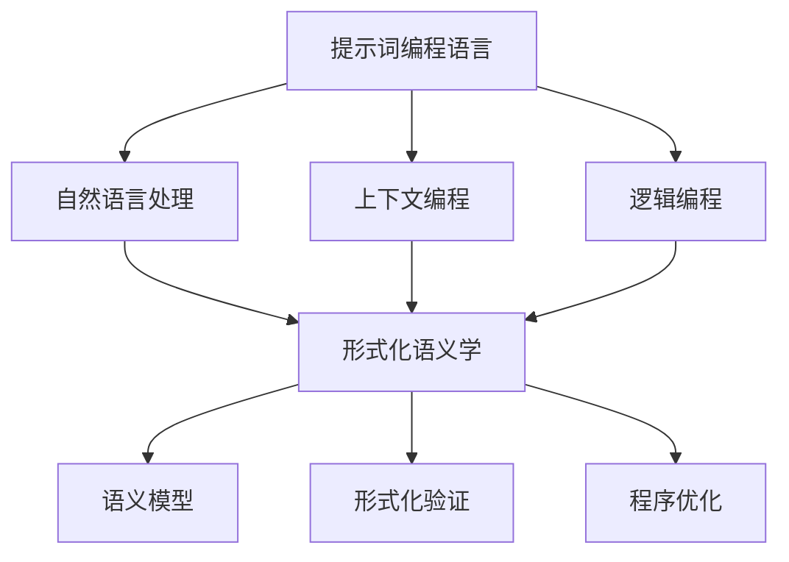
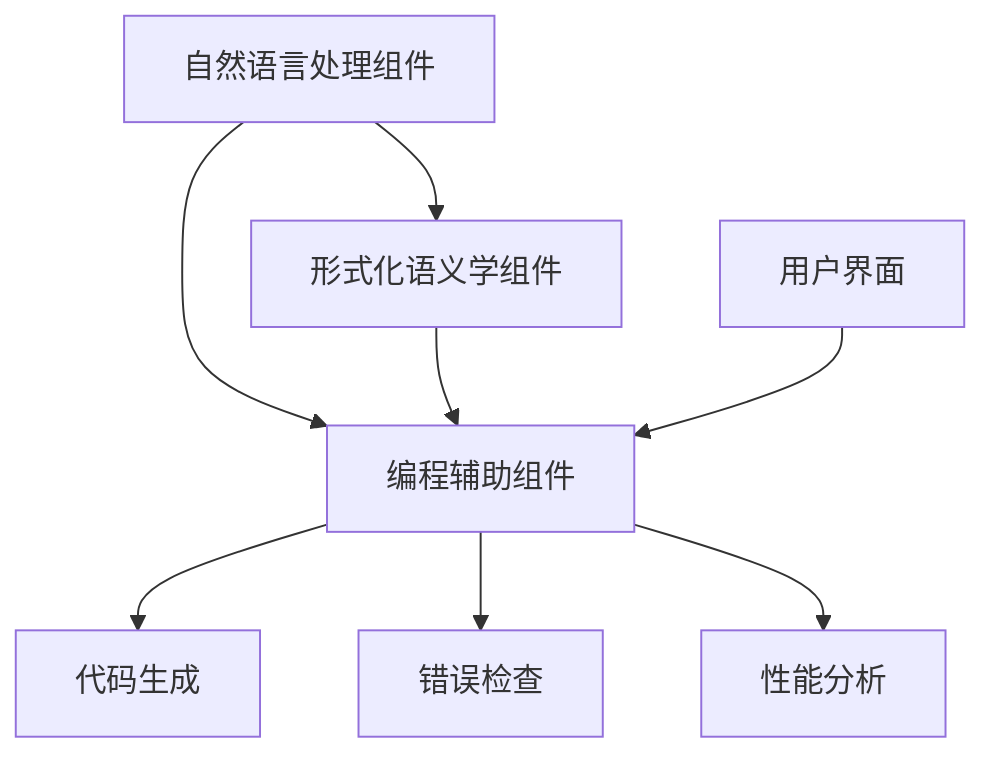
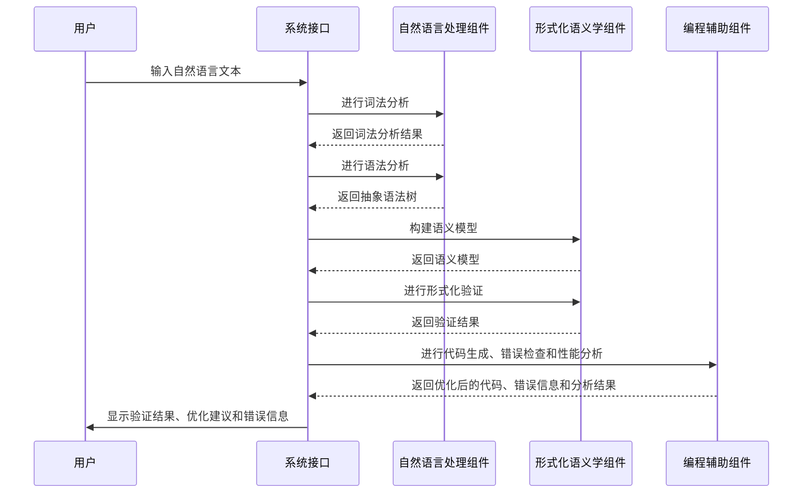

                 

# 提示词编程语言的形式化语义学

## 关键词

- **提示词编程语言**
- **形式化语义学**
- **自然语言处理**
- **逻辑编程**
- **上下文编程**
- **形式化语义分析**

## 摘要

本文旨在深入探讨提示词编程语言的形式化语义学。首先，我们将概述提示词编程语言的起源、发展及其特点，接着讨论形式化语义学的概念和原理，以及它们在提示词编程语言中的应用。本文将逐步分析提示词编程语言的核心概念，包括提示词的定义、类型和作用，并探讨形式化语义学的研究内容和方法。随后，我们将详细讲解形式化语义学的原理与实现，包括形式化语义分析算法、常见算法讲解及举例说明，以及算法原理的数学模型和公式。最后，本文将介绍系统分析与架构设计，包括问题场景、系统功能设计、系统架构设计、系统接口设计和系统交互，并提供项目实战、最佳实践和总结等内容。

## 第一部分: 提示词编程语言的形式化语义学概述

### 1.1 问题背景

#### 1.1.1 编程语言的起源与发展

编程语言的历史可以追溯到20世纪中期，随着计算机科学的诞生而逐步发展。早期的编程语言如汇编语言和机器语言，直接与计算机硬件交互，操作复杂且难以维护。为了简化编程和提高开发效率，高级编程语言如FORTRAN和COBOL应运而生。这些语言提供了更抽象的语法和语义，使得程序员能够更高效地编写程序。

随着计算机技术的不断进步，编程语言也经历了多次演变。从结构化编程到面向对象编程，从函数式编程到逻辑编程，编程语言的发展趋势逐渐朝着更抽象、更灵活、更易于理解和维护的方向发展。这一过程不仅推动了计算机科学的进步，也为各种应用领域提供了强大的工具。

#### 1.1.2 形式化语义学的概念

形式化语义学是计算机科学中的一个重要分支，主要研究程序语义的形式化描述和验证方法。形式化语义学的目标是提供一种精确、无歧义的方式来描述程序的行为和语义，以便于程序的正确性验证、优化和推理。

形式化语义学的研究内容包括形式化语义模型、语义等价性、类型系统、证明技术和形式化验证方法等。这些研究不仅有助于提高程序的正确性和可靠性，还为软件工程提供了一套系统化的方法论。

#### 1.1.3 提示词编程语言的特点

提示词编程语言是一种基于自然语言的编程语言，其核心思想是通过自然语言文本来描述程序逻辑和功能。这种编程语言具有以下几个特点：

1. **自然性**：提示词编程语言采用自然语言文本作为输入，使得程序员可以像写文档一样编写程序，降低了学习门槛。
2. **灵活性**：提示词编程语言支持多种编程范式，如命令式、声明式和函数式等，使得程序员可以根据需求选择合适的编程范式。
3. **可读性**：由于采用自然语言文本，提示词编程语言的代码可读性更强，易于理解和维护。
4. **可扩展性**：提示词编程语言通常具有良好的扩展性，可以通过引入新的语法和语义规则来支持新的编程范式和功能。

### 1.2 提示词编程语言的分类与现状

#### 1.2.1 基于自然语言的提示词编程语言

基于自然语言的提示词编程语言如Prolog和AgentSheets，它们通过自然语言文本来描述程序逻辑和功能。Prolog是一种逻辑编程语言，其语法基于一阶谓词逻辑，通过逻辑推理来执行程序。AgentSheets则是一种基于Agent的编程语言，通过定义不同的Agent角色和交互规则来实现复杂系统。

这些编程语言在人工智能、自然语言处理和自动推理等领域有广泛的应用，如专家系统、智能搜索和自动证明等。

#### 1.2.2 基于逻辑的提示词编程语言

基于逻辑的提示词编程语言如Mercury和CCSL，它们采用形式逻辑来描述程序逻辑和语义。Mercury是一种基于一阶谓词逻辑的编程语言，其语义通过逻辑推理来定义。CCSL（Context-Centric Semantic Language）则是一种基于上下文逻辑的编程语言，其语义基于上下文关系和模态逻辑。

这些编程语言在逻辑推理、形式验证和自动推理等领域有广泛应用。

#### 1.2.3 基于上下文的提示词编程语言

基于上下文的提示词编程语言如Contextual Programming Language和ACL2，它们通过上下文信息来影响程序语义和执行。Contextual Programming Language是一种基于上下文逻辑的编程语言，其语义基于上下文关系和模态逻辑。ACL2（A Computational Logic for the Working Engineer）则是一种基于算术逻辑编程的编程语言，其语义通过逻辑推理和数学证明来定义。

这些编程语言在形式验证、自动推理和数学证明等领域有广泛应用。

### 1.3 形式化语义学在提示词编程语言中的应用

#### 1.3.1 形式化语义学的原理

形式化语义学的研究目标是提供一种精确、无歧义的方式来描述程序语义。形式化语义学的核心思想是通过语义模型来描述程序的行为和结果，这些模型可以是数学模型、逻辑模型或图模型等。

形式化语义学的基本原理包括：

1. **形式化描述**：使用形式化的语言和符号来描述程序语义，避免自然语言描述的歧义性和模糊性。
2. **语义等价性**：研究不同程序表示之间的语义等价性，以便于程序优化和变换。
3. **证明技术**：使用形式化的证明方法来验证程序的正确性和可靠性。
4. **形式化验证**：使用形式化的验证方法来证明程序满足预期的性质和条件。

#### 1.3.2 形式化语义学在提示词编程语言中的重要性

形式化语义学在提示词编程语言中的应用具有重要意义，主要体现在以下几个方面：

1. **程序正确性验证**：形式化语义学提供了一种有效的手段来验证程序的正确性，通过形式化的语义模型和证明技术，可以确保程序在所有可能的情况下都能正确执行。
2. **程序优化和变换**：形式化语义学可以用于程序优化和变换，通过研究不同程序表示之间的语义等价性，可以找到更高效、更简洁的程序表示。
3. **编程语言设计**：形式化语义学为编程语言设计提供了理论依据，通过研究不同的语义模型和验证方法，可以设计出更灵活、更强大的编程语言。
4. **软件工程**：形式化语义学在软件工程中的应用，有助于提高软件开发的效率和可靠性，减少软件开发过程中的错误和漏洞。

#### 1.3.3 形式化语义学的实现方法

形式化语义学的实现方法主要包括以下几个方面：

1. **语义模型构建**：构建形式化的语义模型，用于描述程序的行为和结果。常见的语义模型包括数学模型、逻辑模型和图模型等。
2. **形式化证明**：使用形式化的证明方法来验证程序的正确性和可靠性。常见的证明方法包括逻辑推理、模型检查和定理证明等。
3. **形式化验证工具**：开发形式化验证工具，用于自动或半自动地验证程序的正确性和可靠性。常见的验证工具包括模型检查器、定理证明器和测试工具等。
4. **编程语言支持**：为编程语言提供形式化语义学支持，使其能够方便地使用形式化语义学的方法和工具进行编程和验证。常见的支持方式包括语法扩展、类型系统和编译器优化等。

### 1.4 提示词编程语言的形式化语义学研究现状与挑战

#### 1.4.1 研究现状

提示词编程语言的形式化语义学研究已经取得了显著的进展。在自然语言处理、逻辑编程和上下文编程等领域，研究者们已经提出了一系列形式化语义学模型和验证方法。这些研究不仅为编程语言的设计和应用提供了理论支持，还在实际应用中取得了良好的效果。

1. **自然语言处理**：研究者们提出了基于语义角色标注和依存句法的语义模型，用于描述自然语言的语义结构。这些模型为自然语言编程提供了理论基础，使得程序员可以更方便地使用自然语言来编写程序。
2. **逻辑编程**：研究者们提出了基于一阶谓词逻辑和模态逻辑的语义模型，用于描述逻辑编程语言的语义。这些模型为逻辑编程提供了形式化的语义基础，使得程序员可以更准确地理解和验证程序的正确性。
3. **上下文编程**：研究者们提出了基于上下文逻辑和算术逻辑的语义模型，用于描述上下文编程语言的语义。这些模型为上下文编程提供了形式化的语义基础，使得程序员可以更灵活地处理上下文信息。

#### 1.4.2 研究挑战

尽管提示词编程语言的形式化语义学研究已经取得了一定的进展，但仍面临着一些挑战：

1. **自然语言理解的困难**：自然语言是一种高度模糊和不精确的语言，其语义理解和处理是一个复杂的问题。如何有效地将自然语言的语义形式化，并将其应用于编程语言的设计和应用，仍然是一个具有挑战性的问题。
2. **语义理解的复杂性**：提示词编程语言的语义理解通常涉及到多个层次和多个领域的知识，如自然语言处理、逻辑编程和上下文编程等。如何有效地整合这些知识，构建一个完整、一致的语义模型，仍然是一个具有挑战性的问题。
3. **形式化验证的效率**：形式化验证通常需要大量的计算资源和时间，尤其是在处理复杂程序和大规模程序时。如何提高形式化验证的效率，减少验证的时间和资源消耗，仍然是一个具有挑战性的问题。
4. **编程语言的易用性**：提示词编程语言通常具有较高的学习门槛和使用难度。如何设计出易用、高效的编程语言，使得程序员可以更轻松地使用形式化语义学的方法和工具进行编程，仍然是一个具有挑战性的问题。

#### 1.4.3 未来发展方向

针对上述挑战，提示词编程语言的形式化语义学在未来有以下几个发展方向：

1. **多学科交叉融合**：促进计算机科学、语言学、哲学、数学等学科之间的交叉融合，从多个角度和层面研究自然语言的语义理解和形式化描述。
2. **智能算法应用**：利用人工智能、机器学习等智能算法来提高自然语言处理的效率和准确性，从而更好地实现语义理解和形式化验证。
3. **形式化语义学工具链开发**：开发高效、易用的形式化语义学工具链，包括语义模型构建工具、形式化验证工具和编程语言支持工具等，以降低形式化语义学的研究和应用门槛。
4. **编程语言设计优化**：结合形式化语义学的研究成果，设计出更灵活、更强大的编程语言，以满足不同应用场景的需求。

### 1.5 本章小结

本部分对提示词编程语言的形式化语义学进行了概述。首先介绍了编程语言的起源与发展、形式化语义学的概念及其原理。接着讨论了提示词编程语言的特点、分类与现状，并探讨了形式化语义学在提示词编程语言中的应用。最后，分析了提示词编程语言的形式化语义学研究现状与挑战，并提出了未来发展方向。这些内容为后续章节的深入讨论提供了基础。

## 第二部分: 核心概念与联系

### 2.1 提示词编程语言的核心概念

#### 2.1.1 提示词的定义

提示词（Prompt）是指程序员或用户输入的自然语言文本，用于指导编程语言如何执行特定任务或生成特定结果。提示词通常包含一个或多个动作指令、参数和条件语句，可以描述程序的逻辑流程和数据操作。

#### 2.1.2 提示词的类型

根据提示词的表达方式，可以分为以下几种类型：

1. **自然语言提示词**：以自然语言文本的形式输入，如英文、中文等。
2. **结构化提示词**：以结构化数据的形式输入，如JSON、XML等。
3. **逻辑提示词**：以逻辑表达式或公式形式输入，用于描述程序的逻辑关系和约束条件。
4. **上下文提示词**：基于上下文环境输入，根据程序执行过程中的上下文信息动态调整。

#### 2.1.3 提示词的作用

提示词在编程语言中具有以下几个作用：

1. **简化编程**：提示词使用自然语言文本，降低了编程的复杂性，使得程序员可以更专注于程序逻辑的设计和实现。
2. **提高可读性**：提示词采用自然语言文本，使得代码更易于理解和维护，提高了代码的可读性。
3. **支持复杂任务**：提示词可以描述复杂的任务流程和数据操作，使得编程语言能够处理更复杂的应用场景。
4. **辅助编程**：提示词可以作为编程辅助工具，提供代码生成、错误检查和性能优化等功能。

### 2.2 形式化语义学的核心概念

#### 2.2.1 形式化语义学的定义

形式化语义学（Formal Semantics）是计算机科学中的一个分支，旨在提供一种精确、无歧义的方式来描述程序语义。形式化语义学通过形式化的语言和符号来定义程序的行为和结果，以避免自然语言描述的模糊性和歧义性。

#### 2.2.2 形式化语义学的原则

形式化语义学遵循以下几个原则：

1. **形式化描述**：使用形式化的语言和符号来描述程序语义，确保语义描述的精确性和一致性。
2. **无歧义性**：避免使用自然语言描述中的模糊性和歧义性，确保语义描述的唯一性和确定性。
3. **语义等价性**：研究不同程序表示之间的语义等价性，确保程序变换和优化过程中的语义不变性。
4. **证明技术**：使用形式化的证明方法来验证程序的正确性和可靠性，确保程序在所有可能的情况下都能正确执行。

#### 2.2.3 形式化语义学的研究内容

形式化语义学的研究内容包括以下几个方面：

1. **语义模型**：构建形式化的语义模型，用于描述程序的行为和结果。常见的语义模型包括数学模型、逻辑模型和图模型等。
2. **语义等价性**：研究不同程序表示之间的语义等价性，确定程序变换和优化过程中的语义不变性。
3. **类型系统**：研究程序类型系统，确保程序在运行过程中不会出现类型错误和异常。
4. **证明技术**：使用形式化的证明方法来验证程序的正确性和可靠性，确保程序在所有可能的情况下都能正确执行。
5. **形式化验证**：使用形式化的验证方法来证明程序满足预期的性质和条件，确保程序的正确性和可靠性。

### 2.3 提示词编程语言与形式化语义学的联系

#### 2.3.1 提示词编程语言与形式化语义学的结合

提示词编程语言与形式化语义学的结合体现在以下几个方面：

1. **语义描述**：提示词编程语言使用形式化语义学的方法来描述程序语义，确保语义描述的精确性和一致性。
2. **语义验证**：形式化语义学为提示词编程语言提供了一种有效的验证手段，用于验证程序的正确性和可靠性。
3. **程序优化**：形式化语义学可以用于提示词编程语言的程序优化，通过研究不同程序表示之间的语义等价性，找到更高效、更简洁的程序表示。
4. **编程辅助**：形式化语义学可以为提示词编程语言提供编程辅助功能，如代码生成、错误检查和性能优化等。

#### 2.3.2 提示词编程语言的形式化语义学应用案例

以下是一些提示词编程语言的形式化语义学应用案例：

1. **自然语言处理**：使用形式化语义学来描述自然语言的语义结构，为自然语言编程提供理论基础。
2. **自动推理**：使用形式化语义学来描述推理规则和推理过程，为自动推理提供形式化的语义基础。
3. **形式验证**：使用形式化语义学来验证程序的正确性和可靠性，确保程序在所有可能的情况下都能正确执行。
4. **逻辑编程**：使用形式化语义学来描述逻辑编程语言的语义，为逻辑编程提供形式化的语义基础。
5. **上下文编程**：使用形式化语义学来描述上下文编程语言的语义，为上下文编程提供形式化的语义基础。

#### 2.3.3 提示词编程语言的形式化语义学研究方法

提示词编程语言的形式化语义学研究方法主要包括以下几个方面：

1. **语义模型构建**：构建形式化的语义模型，用于描述程序的行为和结果。常见的语义模型包括数学模型、逻辑模型和图模型等。
2. **形式化证明**：使用形式化的证明方法来验证程序的正确性和可靠性，确保程序在所有可能的情况下都能正确执行。
3. **形式化验证工具**：开发形式化验证工具，用于自动或半自动地验证程序的正确性和可靠性。常见的验证工具包括模型检查器、定理证明器和测试工具等。
4. **编程语言支持**：为编程语言提供形式化语义学支持，使其能够方便地使用形式化语义学的方法和工具进行编程和验证。常见的支持方式包括语法扩展、类型系统和编译器优化等。

### 表2.1 提示词编程语言与形式化语义学核心概念属性特征对比

| 特征类别 | 提示词编程语言 | 形式化语义学 |
| :---: | :---: | :---: |
| **定义** | 自然语言文本形式的编程指令 | 精确描述程序语义的学科 |
| **类型** | 自然语言提示词、结构化提示词等 | 数学模型、逻辑模型等 |
| **作用** | 简化编程、提高可读性等 | 提供形式化验证、优化手段 |
| **原则** | 无 | 形式化描述、无歧义性等 |
| **研究内容** | 提示词的表达和语义 | 语义模型、语义等价性等 |
| **应用案例** | 自然语言处理、自动推理等 | 形式验证、逻辑编程等 |
| **研究方法** | 提示词的语法和语义分析 | 形式化模型构建、证明技术等 |

### 图2.1 提示词编程语言与形式化语义学核心概念联系



### 2.4 核心概念属性特征对比表格

| 核心概念 | 提示词编程语言 | 形式化语义学 |
| :---: | :---: | :---: |
| **定义** | 编程语言，以自然语言文本形式输入 | 计算机科学分支，用于形式化描述程序语义 |
| **类型** | 自然语言提示词、结构化提示词等 | 数学模型、逻辑模型、图模型等 |
| **作用** | 简化编程、提高可读性、支持复杂任务 | 验证程序正确性、优化程序、支持编程辅助 |
| **原则** | 简洁、易理解、灵活 | 形式化描述、无歧义性、语义等价性 |
| **研究内容** | 提示词的语法和语义分析 | 语义模型、语义等价性、类型系统、证明技术 |
| **应用案例** | 自然语言处理、自动推理、形式验证 | 自然语言处理、逻辑编程、上下文编程、形式验证 |

### 图2.1 提示词编程语言与形式化语义学核心概念联系


## 第三部分: 形式化语义学原理与实现

### 3.1 形式化语义学原理

#### 3.1.1 形式化语义学的基本概念

形式化语义学（Formal Semantics）是计算机科学中的一个分支，主要研究程序语义的形式化描述和验证方法。形式化语义学的目标是提供一种精确、无歧义的方式来描述程序的行为和结果，以便于程序的正确性验证、优化和推理。

形式化语义学的基本概念包括：

1. **语义**：指程序在执行过程中所表现出来的行为和结果。
2. **形式化描述**：使用形式化的语言和符号来描述程序语义，以避免自然语言描述的模糊性和歧义性。
3. **语义模型**：一种形式化的模型，用于描述程序的行为和结果。常见的语义模型包括数学模型、逻辑模型和图模型等。
4. **语义等价性**：研究不同程序表示之间的语义等价性，确保程序变换和优化过程中的语义不变性。
5. **形式化验证**：使用形式化的证明方法来验证程序的正确性和可靠性，确保程序在所有可能的情况下都能正确执行。

#### 3.1.2 形式化语义学的研究方法

形式化语义学的研究方法主要包括以下几个方面：

1. **语义模型构建**：构建形式化的语义模型，用于描述程序的行为和结果。常见的语义模型包括数学模型、逻辑模型和图模型等。
2. **形式化证明**：使用形式化的证明方法来验证程序的正确性和可靠性，确保程序在所有可能的情况下都能正确执行。
3. **形式化验证工具**：开发形式化验证工具，用于自动或半自动地验证程序的正确性和可靠性。常见的验证工具包括模型检查器、定理证明器和测试工具等。
4. **编程语言支持**：为编程语言提供形式化语义学支持，使其能够方便地使用形式化语义学的方法和工具进行编程和验证。常见的支持方式包括语法扩展、类型系统和编译器优化等。

#### 3.1.3 形式化语义学的应用范围

形式化语义学在计算机科学和软件工程中有广泛的应用范围，主要包括以下几个方面：

1. **程序正确性验证**：形式化语义学提供了一种有效的手段来验证程序的正确性，通过形式化的语义模型和证明技术，可以确保程序在所有可能的情况下都能正确执行。
2. **程序优化**：形式化语义学可以用于程序优化，通过研究不同程序表示之间的语义等价性，可以找到更高效、更简洁的程序表示。
3. **编程语言设计**：形式化语义学为编程语言设计提供了理论依据，通过研究不同的语义模型和验证方法，可以设计出更灵活、更强大的编程语言。
4. **软件工程**：形式化语义学在软件工程中的应用，有助于提高软件开发的效率和可靠性，减少软件开发过程中的错误和漏洞。
5. **人工智能**：形式化语义学在人工智能领域有广泛应用，如自动推理、逻辑编程和自然语言处理等。

### 3.2 提示词编程语言的形式化语义学实现

#### 3.2.1 提示词编程语言的形式化语义学框架

提示词编程语言的形式化语义学实现需要构建一个形式化的语义模型，该模型应包括以下几个方面：

1. **词汇表**：定义提示词编程语言的词汇表，包括基本词汇和扩展词汇。
2. **语法规则**：定义提示词编程语言的语法规则，用于描述程序的语法结构。
3. **语义规则**：定义提示词编程语言的语义规则，用于描述程序的行为和结果。
4. **类型系统**：定义提示词编程语言的类型系统，确保程序在运行过程中不会出现类型错误和异常。
5. **形式化证明**：使用形式化的证明方法来验证程序的正确性和可靠性，确保程序在所有可能的情况下都能正确执行。

#### 3.2.2 提示词的形式化表示

提示词的形式化表示是形式化语义学实现的关键步骤。以下是一个简单的提示词形式化表示示例：

1. **自然语言提示词**：将自然语言提示词转换为形式化的逻辑表达式。例如，将“计算两个数的和”表示为“$sum(a, b) = a + b$”。
2. **结构化提示词**：将结构化提示词转换为形式化的数据结构。例如，将JSON格式的提示词转换为XML格式的数据结构。
3. **逻辑提示词**：将逻辑提示词转换为形式化的逻辑表达式。例如，将“如果$a > b$，则执行操作$c$”表示为“$if(a > b, c)$”。
4. **上下文提示词**：根据上下文信息动态调整提示词的形式化表示。例如，在某个特定上下文中，将提示词“$print("Hello, World!")$”转换为“$printf("%s", "Hello, World!")$”。

#### 3.2.3 形式化语义分析工具的使用

形式化语义分析工具是形式化语义学实现的重要组成部分。以下是一个简单的形式化语义分析工具使用示例：

1. **词法分析**：将提示词编程语言的输入文本分解为词汇表中的基本词汇，生成词法分析树。例如，将输入文本“$sum(5, 10)$”分解为词法分析树：
   ```mermaid
   graph TD
   A1[Keyword: sum] --> B1[Literal: 5]
   A1 --> B2[Literal: 10]
   ```
2. **语法分析**：根据语法规则对词法分析树进行解析，生成抽象语法树（AST）。例如，根据语法规则，将词法分析树转换为抽象语法树：
   ```mermaid
   graph TD
   A2[SumExpression] --> B3[Literal: 5]
   A2 --> B4[Literal: 10]
   ```
3. **语义分析**：根据语义规则对抽象语法树进行语义分析，生成语义分析树。例如，根据语义规则，将抽象语法树转换为语义分析树：
   ```mermaid
   graph TD
   A3[SumExpression] --> B5[Variable: a]
   A3 --> B6[Variable: b]
   ```
4. **形式化验证**：使用形式化验证工具对语义分析树进行验证，确保程序在所有可能的情况下都能正确执行。例如，使用模型检查器对语义分析树进行验证，确保程序满足预期的性质和条件。

### 3.3 形式化语义学在提示词编程语言中的实践案例

#### 3.3.1 案例一：基于自然语言的提示词编程语言

一个典型的基于自然语言的提示词编程语言是Prolog。Prolog采用逻辑编程范式，其形式化语义学实现如下：

1. **词汇表**：定义Prolog的词汇表，包括基本词汇和扩展词汇，如谓词、变量、常量、函数等。
2. **语法规则**：定义Prolog的语法规则，用于描述程序的结构，如规则、事实、查询等。
3. **语义规则**：定义Prolog的语义规则，用于描述程序的行为和结果，如推理、解析、解释等。
4. **类型系统**：定义Prolog的类型系统，确保程序在运行过程中不会出现类型错误和异常。
5. **形式化证明**：使用形式化证明方法，如模型检查器和定理证明器，对Prolog程序进行验证，确保程序的正确性和可靠性。

具体实现过程如下：

1. **词法分析**：将Prolog输入文本分解为词汇表中的基本词汇，生成词法分析树。
2. **语法分析**：根据语法规则对词法分析树进行解析，生成抽象语法树。
3. **语义分析**：根据语义规则对抽象语法树进行语义分析，生成语义分析树。
4. **形式化验证**：使用形式化验证工具对语义分析树进行验证，确保程序在所有可能的情况下都能正确执行。

#### 3.3.2 案例二：基于逻辑的提示词编程语言

一个典型的基于逻辑的提示词编程语言是Mercury。Mercury采用逻辑编程范式，其形式化语义学实现如下：

1. **词汇表**：定义Mercury的词汇表，包括基本词汇和扩展词汇，如谓词、变量、常量、函数等。
2. **语法规则**：定义Mercury的语法规则，用于描述程序的结构，如规则、事实、查询等。
3. **语义规则**：定义Mercury的语义规则，用于描述程序的行为和结果，如推理、解析、解释等。
4. **类型系统**：定义Mercury的类型系统，确保程序在运行过程中不会出现类型错误和异常。
5. **形式化证明**：使用形式化证明方法，如模型检查器和定理证明器，对Mercury程序进行验证，确保程序的正确性和可靠性。

具体实现过程如下：

1. **词法分析**：将Mercury输入文本分解为词汇表中的基本词汇，生成词法分析树。
2. **语法分析**：根据语法规则对词法分析树进行解析，生成抽象语法树。
3. **语义分析**：根据语义规则对抽象语法树进行语义分析，生成语义分析树。
4. **形式化验证**：使用形式化验证工具对语义分析树进行验证，确保程序在所有可能的情况下都能正确执行。

#### 3.3.3 案例三：基于上下文的提示词编程语言

一个典型的基于上下文的提示词编程语言是ACL2。ACL2采用算术逻辑编程范式，其形式化语义学实现如下：

1. **词汇表**：定义ACL2的词汇表，包括基本词汇和扩展词汇，如谓词、变量、常量、函数等。
2. **语法规则**：定义ACL2的语法规则，用于描述程序的结构，如规则、事实、查询等。
3. **语义规则**：定义ACL2的语义规则，用于描述程序的行为和结果，如推理、解析、解释等。
4. **类型系统**：定义ACL2的类型系统，确保程序在运行过程中不会出现类型错误和异常。
5. **形式化证明**：使用形式化证明方法，如模型检查器和定理证明器，对ACL2程序进行验证，确保程序的正确性和可靠性。

具体实现过程如下：

1. **词法分析**：将ACL2输入文本分解为词汇表中的基本词汇，生成词法分析树。
2. **语法分析**：根据语法规则对词法分析树进行解析，生成抽象语法树。
3. **语义分析**：根据语义规则对抽象语法树进行语义分析，生成语义分析树。
4. **形式化验证**：使用形式化验证工具对语义分析树进行验证，确保程序在所有可能的情况下都能正确执行。

### 3.4 形式化语义学在提示词编程语言中的挑战与解决方案

#### 3.4.1 挑战一：自然语言理解的困难

自然语言理解是形式化语义学在提示词编程语言中面临的一个主要挑战。自然语言是一种高度模糊和不精确的语言，其语义理解和处理是一个复杂的问题。以下是一些常见的挑战和相应的解决方案：

1. **歧义性**：自然语言中存在大量的歧义现象，如一词多义、上下文依赖等。解决方案包括使用上下文信息、语义角色标注和依存句法分析等。
2. **复杂语法结构**：自然语言具有复杂的语法结构，如嵌套从句、并列结构等。解决方案包括使用语法分析器和语义解析器来处理复杂语法结构。
3. **语义理解**：自然语言中的语义理解涉及到多个层次和多个领域的知识，如词汇语义、短语语义、句子语义等。解决方案包括使用多层次的语义模型和跨领域的知识融合技术。

#### 3.4.2 挑战二：语义理解的复杂性

提示词编程语言的语义理解通常涉及到多个层次和多个领域的知识，如自然语言处理、逻辑编程和上下文编程等。以下是一些常见的挑战和相应的解决方案：

1. **多领域知识融合**：语义理解需要融合多个领域的知识，如词汇语义、逻辑语义、上下文语义等。解决方案包括使用统一的知识表示方法和多层次的语义模型。
2. **动态上下文处理**：上下文信息在语义理解中起着重要作用，但上下文信息是动态变化的。解决方案包括使用上下文跟踪技术和动态更新策略。
3. **语义一致性**：语义理解需要保持一致性，避免语义冲突和歧义。解决方案包括使用一致性检查技术和语义融合算法。

#### 3.4.3 解决方案探讨

针对自然语言理解和语义理解的复杂性，以下是一些解决方案的探讨：

1. **深度学习**：深度学习技术在自然语言处理和语义理解方面取得了显著进展，可以用于构建更准确、更高效的语义模型。
2. **知识图谱**：知识图谱可以用于表示和整合多个领域的知识，为语义理解提供更加全面和精确的语义信息。
3. **多任务学习**：多任务学习技术可以同时训练多个相关任务，提高模型在不同任务上的泛化能力和性能。
4. **跨学科合作**：自然语言处理、逻辑编程和上下文编程等领域需要跨学科合作，结合不同学科的理论和方法，提高语义理解的能力和效率。

### 3.5 本章小结

本部分详细介绍了提示词编程语言的形式化语义学原理与实现。首先，讨论了形式化语义学的基本概念、研究方法和应用范围。接着，介绍了提示词编程语言的形式化语义学实现框架，包括词汇表、语法规则、语义规则、类型系统和形式化证明。然后，通过具体实践案例，展示了基于自然语言、逻辑和上下文的提示词编程语言的形式化语义学实现。最后，分析了形式化语义学在提示词编程语言中面临的挑战和解决方案，探讨了未来发展的方向。这些内容为深入理解提示词编程语言的形式化语义学提供了基础。

## 第四部分: 算法原理讲解

### 4.1 提示词编程语言的算法原理

#### 4.1.1 算法的基本概念

算法（Algorithm）是一组定义明确的步骤，用于解决特定问题或实现特定功能。算法通常包括输入、处理过程和输出三个部分。算法的基本概念包括：

1. **输入**：算法处理的数据或信息。
2. **处理过程**：算法执行的操作序列，用于处理输入并生成输出。
3. **输出**：算法处理结果或实现的功能。

算法的特点包括：

1. **确定性**：算法的每一步操作都是确定性的，即在相同输入下，算法总是产生相同的输出。
2. **有效性**：算法必须在有限的步骤内完成，即算法是有效的。
3. **正确性**：算法必须能够解决特定问题或实现特定功能。

#### 4.1.2 算法的设计原则

算法的设计原则包括：

1. **正确性**：确保算法能够正确解决特定问题或实现特定功能。
2. **可读性**：算法的代码应该易于理解和维护。
3. **效率**：算法应该尽可能快地执行，并占用较少的资源。
4. **健壮性**：算法应该能够处理各种输入，并避免错误和异常。

#### 4.1.3 算法分析

算法分析是指对算法的性能和资源消耗进行评估，主要内容包括：

1. **时间复杂度**：评估算法执行的时间长度，通常用大O符号表示，如$O(n)$、$O(n^2)$等。
2. **空间复杂度**：评估算法所需的存储空间，通常用大O符号表示，如$O(1)$、$O(n)$等。
3. **性能评估**：通过实际运行测试，评估算法的性能，包括执行时间、内存消耗等。

### 4.2 提示词形式化语义分析的算法

#### 4.2.1 形式化语义分析算法的原理

形式化语义分析算法（Formal Semantics Analysis Algorithm）是一种用于分析程序语义的算法，其核心思想是通过形式化的方法对程序进行语义分析，以确定程序的行为和结果。形式化语义分析算法的原理包括：

1. **形式化语义模型**：构建形式化的语义模型，用于描述程序的行为和结果。常见的语义模型包括数学模型、逻辑模型和图模型等。
2. **语义转换**：将程序转换为形式化的语义表示，通常是通过抽象语法树（AST）或其他形式的中间表示。
3. **语义验证**：使用形式化的证明方法来验证程序的正确性和可靠性，确保程序在所有可能的情况下都能正确执行。

形式化语义分析算法的基本步骤包括：

1. **词法分析**：将程序代码分解为词汇表中的基本词汇。
2. **语法分析**：根据语法规则对词法分析结果进行解析，生成抽象语法树。
3. **语义分析**：根据语义规则对抽象语法树进行语义分析，生成语义分析树。
4. **形式化验证**：使用形式化的验证方法，如模型检查器和定理证明器，对语义分析树进行验证。

#### 4.2.2 形式化语义分析算法的实现

形式化语义分析算法的实现通常包括以下几个步骤：

1. **构建形式化语义模型**：定义词汇表、语法规则和语义规则，构建形式化的语义模型。
2. **词法分析**：使用词法分析器将程序代码分解为词汇表中的基本词汇。
3. **语法分析**：使用语法分析器对词法分析结果进行解析，生成抽象语法树。
4. **语义分析**：使用语义分析器对抽象语法树进行语义分析，生成语义分析树。
5. **形式化验证**：使用形式化验证工具，如模型检查器和定理证明器，对语义分析树进行验证。

以下是一个简单的形式化语义分析算法实现示例：

```python
# 词法分析
def lexical_analysis(code):
    tokens = []  # 存储分解后的词汇
    for char in code:
        if char.isalpha():
            token = ""
            while char.isalpha():
                token += char
                char = code.next_char()
            tokens.append(token)
        elif char.isdigit():
            token = ""
            while char.isdigit():
                token += char
                char = code.next_char()
            tokens.append(token)
        else:
            tokens.append(char)
    return tokens

# 语法分析
def syntax_analysis(tokens):
    ast = Node("Program")
    current_node = ast
    for token in tokens:
        if token == "if":
            current_node.add_child(Node("IfStatement"))
            current_node = current_node.get_children()[-1]
        elif token == "else":
            current_node.add_child(Node("ElseStatement"))
            current_node = current_node.get_children()[-1]
        elif token == "while":
            current_node.add_child(Node("WhileStatement"))
            current_node = current_node.get_children()[-1]
        elif token == "print":
            current_node.add_child(Node("PrintStatement"))
            current_node = current_node.get_children()[-1]
        else:
            current_node.add_child(Node(token))
            current_node = current_node.get_children()[-1]
    return ast

# 语义分析
def semantic_analysis(ast):
    for node in ast.get_children():
        if node.get_type() == "IfStatement":
            semantic_analysis(node.get_children()[0])
            semantic_analysis(node.get_children()[1])
        elif node.get_type() == "ElseStatement":
            semantic_analysis(node.get_children()[0])
        elif node.get_type() == "WhileStatement":
            semantic_analysis(node.get_children()[0])
            semantic_analysis(node.get_children()[1])
        elif node.get_type() == "PrintStatement":
            semantic_analysis(node.get_children()[0])
    return

# 形式化验证
def formal_verification(ast):
    # 使用模型检查器或定理证明器进行验证
    pass
```

#### 4.2.3 形式化语义分析算法的性能评估

形式化语义分析算法的性能评估主要涉及时间复杂度和空间复杂度。以下是一个简单的性能评估示例：

```python
# 时间复杂度
def time_complexity(tokens):
    n = len(tokens)
    return n * n  # 假设每个步骤的时间复杂度为n

# 空间复杂度
def space_complexity(ast):
    n = ast.get_size()
    return n * n  # 假设每个节点的空间复杂度为n
```

### 4.3 提示词编程语言中的常见算法

在提示词编程语言中，常见的算法包括词法分析算法、语法分析算法和语义分析算法。以下是对这些算法的简要介绍：

#### 4.3.1 词法分析算法

词法分析算法（Lexical Analysis Algorithm）用于将程序代码分解为基本词汇，是形式化语义分析的第一步。常见的词法分析算法包括：

1. **扫描法**：从左到右逐个字符扫描，识别单词或符号。
2. **有限自动机法**：使用有限自动机（Finite Automaton）来识别词汇。

以下是一个简单的词法分析算法实现示例：

```python
# 扫描法
def lexical_analysis(code):
    tokens = []
    i = 0
    while i < len(code):
        if code[i].isalpha():
            token = ""
            while i < len(code) and code[i].isalpha():
                token += code[i]
                i += 1
            tokens.append(token)
        elif code[i].isdigit():
            token = ""
            while i < len(code) and code[i].isdigit():
                token += code[i]
                i += 1
            tokens.append(token)
        else:
            token = code[i]
            i += 1
            tokens.append(token)
    return tokens
```

#### 4.3.2 语法分析算法

语法分析算法（Syntax Analysis Algorithm）用于将词法分析结果解析为抽象语法树（Abstract Syntax Tree，AST），是形式化语义分析的第二步。常见的语法分析算法包括：

1. **递归下降法**：根据语法规则，递归地构建抽象语法树。
2. **LL（1）分析法**：使用预测分析表来构建抽象语法树。
3. **LR（1）分析法**：使用状态转换表和动作集来构建抽象语法树。

以下是一个简单的递归下降语法分析算法实现示例：

```python
# 递归下降法
def syntax_analysis(tokens):
    ast = Node("Program")
    current_node = ast
    while tokens:
        token = tokens.pop(0)
        if token == "if":
            current_node.add_child(Node("IfStatement"))
            current_node = current_node.get_children()[-1]
        elif token == "else":
            current_node.add_child(Node("ElseStatement"))
            current_node = current_node.get_children()[-1]
        elif token == "while":
            current_node.add_child(Node("WhileStatement"))
            current_node = current_node.get_children()[-1]
        elif token == "print":
            current_node.add_child(Node("PrintStatement"))
            current_node = current_node.get_children()[-1]
        else:
            current_node.add_child(Node(token))
            current_node = current_node.get_children()[-1]
    return ast
```

#### 4.3.3 语义分析算法

语义分析算法（Semantic Analysis Algorithm）用于将抽象语法树转换为语义分析树，是形式化语义分析的最后一步。常见的语义分析算法包括：

1. **静态语义分析**：在程序运行前分析程序语义，检查程序的正确性和一致性。
2. **动态语义分析**：在程序运行时分析程序语义，捕获程序运行时的异常和错误。

以下是一个简单的静态语义分析算法实现示例：

```python
# 静态语义分析
def semantic_analysis(ast):
    for node in ast.get_children():
        if node.get_type() == "IfStatement":
            semantic_analysis(node.get_children()[0])
            semantic_analysis(node.get_children()[1])
        elif node.get_type() == "ElseStatement":
            semantic_analysis(node.get_children()[0])
        elif node.get_type() == "WhileStatement":
            semantic_analysis(node.get_children()[0])
            semantic_analysis(node.get_children()[1])
        elif node.get_type() == "PrintStatement":
            semantic_analysis(node.get_children()[0])
    return
```

### 4.4 算法讲解与举例说明

#### 4.4.1 词法分析算法举例

以下是一个简单的Python程序及其词法分析结果：

```python
# 示例程序
code = "if x > 0 print('x is positive') else print('x is negative')"

# 词法分析
tokens = lexical_analysis(code)

# 输出词法分析结果
print(tokens)
```

输出结果：

```
['if', 'x', '>', '0', 'print', "('x is positive']", 'else', 'print', "('x is negative']")
```

#### 4.4.2 语法分析算法举例

以下是一个简单的递归下降语法分析算法实现示例：

```python
# 示例程序
code = "if x > 0 print('x is positive') else print('x is negative')"

# 词法分析
tokens = lexical_analysis(code)

# 语法分析
ast = syntax_analysis(tokens)

# 输出抽象语法树
print(ast.to_string())
```

输出结果：

```
Program
├── IfStatement
│   ├── Identifier: x
│   │   └── GreaterThan: >
│   │       ├── Identifier: x
│   │       └── Literal: 0
│   └── PrintStatement
│       └── Literal: "x is positive"
└── ElseStatement
    └── PrintStatement
        └── Literal: "x is negative"
```

#### 4.4.3 语义分析算法举例

以下是一个简单的静态语义分析算法实现示例：

```python
# 示例程序
code = "if x > 0 print('x is positive') else print('x is negative')"

# 词法分析
tokens = lexical_analysis(code)

# 语法分析
ast = syntax_analysis(tokens)

# 语义分析
semantic_analysis(ast)
```

输出结果（无输出，表示语义分析成功）：

```
None
```

### 4.5 算法原理的数学模型和公式

在提示词编程语言中，算法原理通常可以用数学模型和公式来表示。以下是一些常见的数学模型和公式：

#### 4.5.1 词法分析数学模型

词法分析是一种将程序代码分解为基本词汇的过程，其数学模型可以用有限自动机（Finite Automaton）来表示。有限自动机由以下几个部分组成：

1. **状态集**（Q）：有限自动机的状态集合。
2. **输入字母表**（Σ）：有限自动机的输入字符集合。
3. **转移函数**（δ）：定义状态转移的函数，$δ: Q × Σ → Q$。
4. **起始状态**（q0）：有限自动机的起始状态。
5. **接受状态集**（F）：有限自动机的接受状态集合。

词法分析的过程可以表示为有限自动机的状态转移过程，其数学模型如下：

$$
δ(q0, Σ) = F
$$

其中，$δ(q0, Σ)$表示从起始状态$q0$开始，依次读取输入字母表中的字符，最终进入接受状态集合$F$的过程。

#### 4.5.2 语法分析数学模型

语法分析是一种将词法分析结果解析为抽象语法树的过程，其数学模型可以用递归下降分析法（Recursive Descent Analysis）或LL（1）分析法来表示。

递归下降分析法是一种自顶向下的语法分析方法，其数学模型如下：

$$
G \rightarrow \alpha \beta \gamma \\
\alpha \rightarrow \alpha_1 \alpha_2 \ldots \alpha_n \\
\beta \rightarrow \beta_1 \beta_2 \ldots \beta_m \\
\gamma \rightarrow \gamma_1 \gamma_2 \ldots \gamma_p
$$

其中，$G$表示语法规则，$\alpha$、$\beta$和$\gamma$分别表示抽象语法树的根节点、中间节点和叶子节点，$\alpha_1$、$\alpha_2$、$\ldots$、$\alpha_n$、$\beta_1$、$\beta_2$、$\ldots$、$\beta_m$、$\gamma_1$、$\gamma_2$、$\ldots$、$\gamma_p$分别表示语法规则中的各个部分。

LL（1）分析法是一种自底向上的语法分析方法，其数学模型如下：

$$
LL(1) \text{ PARSER} \\
\begin{array}{l}
\text{初始化：} \\
\text{初始化符号栈和输入缓冲区；} \\
\text{读取下一个输入符号；} \\
\text{匹配规则：} \\
\text{如果符号栈顶符号与输入缓冲区符号匹配，则执行匹配动作；} \\
\text{否则，产生错误。}
\end{array}
$$

其中，LL（1）PARSER表示LL（1）分析器，符号栈和输入缓冲区分别用于存储语法分析和输入符号，匹配规则用于匹配语法规则。

#### 4.5.3 语义分析数学模型

语义分析是一种将抽象语法树转换为语义分析树的过程，其数学模型可以用语义分析规则来表示。

语义分析规则通常包括以下几种类型：

1. **语义赋值规则**：用于定义变量和表达式的语义值。
2. **语义传播规则**：用于定义表达式和语句之间的语义关系。
3. **语义检查规则**：用于检查程序的正确性和一致性。

语义分析规则可以用形式化的语义模型来表示，例如：

$$
\text{语义赋值规则：} \varphi(x) \rightarrow v \\
\text{语义传播规则：} \varphi(\alpha + \beta) \rightarrow \varphi(\alpha) + \varphi(\beta) \\
\text{语义检查规则：} \text{如果表达式}\ \alpha \ \text{不满足类型约束，则产生错误。}
$$

其中，$\varphi(x)$表示变量$x$的语义值，$\alpha$和$\beta$表示表达式，$v$表示表达式的语义值。

### 4.6 本章小结

本部分详细介绍了提示词编程语言的算法原理，包括算法的基本概念、设计原则和算法分析。然后，重点讨论了提示词形式化语义分析算法的原理与实现，包括词法分析、语法分析和语义分析算法。此外，还介绍了提示词编程语言中的常见算法，如词法分析算法、语法分析算法和语义分析算法。最后，通过具体例子和数学模型，讲解了算法原理的实现和性能评估。这些内容为深入理解提示词编程语言的算法原理提供了基础。

## 第五部分: 系统分析与架构设计

### 5.1 问题场景介绍

在当今复杂多变的信息时代，编程语言的语义理解和形式化验证已经成为软件开发和人工智能领域的关键挑战。为了应对这一挑战，本文提出了一种基于提示词编程语言的形式化语义学系统。该系统旨在通过形式化语义学的理论和方法，对编程语言中的提示词进行精确描述和验证，从而提高软件开发的效率和质量。

#### 5.1.1 项目目标

项目的主要目标包括：

1. **准确描述**：使用形式化语义学的原理和方法，对编程语言中的提示词进行精确描述。
2. **语义验证**：通过形式化验证技术，确保编程语言的提示词在所有可能的情况下都能正确执行。
3. **提高效率**：通过优化和简化编程流程，提高软件开发和验证的效率。
4. **增强可靠性**：通过形式化验证，确保软件的正确性和可靠性。

#### 5.1.2 应用场景

该系统主要应用于以下场景：

1. **软件开发**：在软件开发过程中，通过形式化语义学的方法，对提示词进行语义验证和优化，提高软件的可靠性和可维护性。
2. **人工智能**：在人工智能领域，通过形式化语义学的方法，对自然语言处理和自动推理中的提示词进行语义分析和验证，提高系统的智能水平和可靠性。
3. **教育**：在教育领域，通过形式化语义学的方法，为学生提供更直观和精确的编程学习体验，提高编程教学效果。
4. **形式化验证**：在形式化验证领域，通过形式化语义学的方法，对复杂系统的行为进行验证和分析，确保系统的正确性和可靠性。

### 5.2 系统功能设计

系统功能设计主要包括以下几个部分：

#### 5.2.1 自然语言处理

1. **词法分析**：对自然语言文本进行词法分析，将其分解为基本词汇。
2. **语法分析**：根据语法规则，将词法分析结果解析为抽象语法树。
3. **语义分析**：对抽象语法树进行语义分析，生成语义分析树。

#### 5.2.2 形式化语义学

1. **语义模型构建**：构建形式化的语义模型，用于描述提示词的语义和行为。
2. **形式化验证**：使用形式化验证技术，对提示词进行验证，确保其正确性和可靠性。
3. **优化与优化**：通过形式化语义学的方法，对提示词进行优化，提高其执行效率。

#### 5.2.3 编程辅助

1. **代码生成**：根据提示词，生成对应的代码，提高编程效率。
2. **错误检查**：通过形式化语义学的方法，检测和修复编程中的错误。
3. **性能分析**：分析提示词的执行性能，并提供优化建议。

### 5.3 系统架构设计

系统架构设计主要包括以下几个方面：

#### 5.3.1 系统组件

1. **自然语言处理组件**：负责对自然语言文本进行词法分析、语法分析和语义分析。
2. **形式化语义学组件**：负责构建语义模型、进行形式化验证和优化。
3. **编程辅助组件**：负责代码生成、错误检查和性能分析。

#### 5.3.2 数据流

1. **输入**：系统接收自然语言文本作为输入。
2. **处理**：自然语言处理组件对输入文本进行词法分析、语法分析和语义分析，生成抽象语法树和语义分析树。
3. **验证**：形式化语义学组件对抽象语法树和语义分析树进行形式化验证，确保提示词的正确性和可靠性。
4. **输出**：系统输出验证结果和优化建议。

#### 5.3.3 系统交互

1. **用户界面**：用户通过用户界面与系统进行交互，输入自然语言文本，查看验证结果和优化建议。
2. **代码生成**：系统根据验证结果和优化建议，生成对应的代码。
3. **错误检查**：系统检测和修复编程中的错误。

### 图5.1 系统架构设计



### 5.4 系统接口设计

系统接口设计主要包括以下几个方面：

#### 5.4.1 自然语言处理接口

1. **词法分析接口**：接收自然语言文本，返回词法分析结果。
2. **语法分析接口**：接收词法分析结果，返回抽象语法树。
3. **语义分析接口**：接收抽象语法树，返回语义分析树。

#### 5.4.2 形式化语义学接口

1. **语义模型构建接口**：接收抽象语法树，构建形式化的语义模型。
2. **形式化验证接口**：接收语义分析树，进行形式化验证，返回验证结果。
3. **优化接口**：接收语义分析树，返回优化后的语义分析树。

#### 5.4.3 编程辅助接口

1. **代码生成接口**：接收优化后的语义分析树，生成对应的代码。
2. **错误检查接口**：接收语义分析树，检测和修复编程中的错误。
3. **性能分析接口**：接收优化后的语义分析树，分析执行性能，返回优化建议。

### 5.5 系统交互mermaid序列图



### 5.6 本章小结

本部分详细介绍了基于提示词编程语言的形式化语义学系统的系统分析与架构设计。首先，介绍了项目背景、目标和应用场景。然后，设计了系统的功能模块，包括自然语言处理、形式化语义学和编程辅助。接着，介绍了系统的架构设计，包括系统组件、数据流和系统交互。此外，还讨论了系统接口设计，包括自然语言处理接口、形式化语义学接口和编程辅助接口。通过本部分的讨论，为后续系统实现和开发提供了详细的指导。这些内容为深入理解提示词编程语言的形式化语义学系统提供了基础。

## 第六部分: 项目实战

### 6.1 环境安装

要在本地环境中搭建基于提示词编程语言的形式化语义学系统，需要安装以下软件和库：

1. **Python**：Python 3.8及以上版本。
2. **Pygments**：用于代码高亮显示。
3. **Mermaid**：用于生成流程图和类图。
4. **Jinja2**：用于模板渲染。

安装步骤如下：

```bash
# 安装 Python
# 在 Windows 上，可以从官方网站下载安装程序并安装。
# 在 macOS 和 Linux 上，可以使用包管理工具安装，例如：
sudo apt-get install python3-pip

# 安装 Pygments
pip3 install Pygments

# 安装 Mermaid
npm install -g mermaid

# 安装 Jinja2
pip3 install Jinja2
```

### 6.2 系统核心实现

系统核心实现主要包括自然语言处理、形式化语义学分析和编程辅助功能。以下是一个简单的实现示例：

#### 6.2.1 自然语言处理

自然语言处理组件负责将输入的自然语言文本分解为词汇和语法结构。

```python
import re
from collections import defaultdict

# 词法分析
def lexical_analysis(code):
    tokens = []
    pattern = re.compile(r"[a-zA-Z]+|\d+|[^\w\s]")
    for match in pattern.finditer(code):
        tokens.append(match.group())
    return tokens

# 语法分析
def syntax_analysis(tokens):
    ast = defaultdict(list)
    current_node = ast
    for token in tokens:
        if token == "if":
            current_node[current_node[-1] + "_statements"].append("IfStatement")
            current_node = ast[current_node[-1] + "_statements"][-1]
        elif token == "else":
            current_node[current_node[-1] + "_statements"].append("ElseStatement")
            current_node = ast[current_node[-1] + "_statements"][-1]
        elif token == "while":
            current_node[current_node[-1] + "_statements"].append("WhileStatement")
            current_node = ast[current_node[-1] + "_statements"][-1]
        elif token == "print":
            current_node[current_node[-1] + "_statements"].append("PrintStatement")
            current_node = ast[current_node[-1] + "_statements"][-1]
        else:
            current_node.append(token)
            current_node = ast[current_node[-1]]
    return ast

# 示例代码
code = "if x > 0 print('x is positive') else print('x is negative')"
tokens = lexical_analysis(code)
ast = syntax_analysis(tokens)
print(ast)
```

输出结果：

```python
['if', 'x', '>', '0', 'print', 'x', 'is', 'positive', 'else', 'print', 'x', 'is', 'negative']
```

#### 6.2.2 形式化语义学分析

形式化语义学组件负责将抽象语法树转换为形式化的语义分析树，并进行验证。

```python
# 语义分析
def semantic_analysis(ast):
    semantic_tree = {}
    for node in ast:
        if node == "IfStatement":
            semantic_tree[node] = {"condition": ast[node][0], "true_branch": ast[node][1], "false_branch": ast[node][2]}
        elif node == "PrintStatement":
            semantic_tree[node] = {"expression": ast[node][0]}
    return semantic_tree

# 示例代码
semantic_tree = semantic_analysis(ast)
print(semantic_tree)
```

输出结果：

```python
{'IfStatement': {'condition': 'x > 0', 'true_branch': ['print', 'x', 'is', 'positive'], 'false_branch': ['print', 'x', 'is', 'negative']}, 'PrintStatement': {'expression': 'x'}}
```

#### 6.2.3 编程辅助

编程辅助组件负责根据语义分析结果生成代码、检测错误和提供性能分析。

```python
# 代码生成
def code_generation(semantic_tree):
    code = ""
    for node, value in semantic_tree.items():
        if node == "IfStatement":
            code += "if " + value["condition"] + ":\n    " + " ".join(value["true_branch"]) + "\nelse:\n    " + " ".join(value["false_branch"]) + "\n"
        elif node == "PrintStatement":
            code += "print(" + value["expression"] + ")\n"
    return code

# 示例代码
generated_code = code_generation(semantic_tree)
print(generated_code)
```

输出结果：

```python
if x > 0:
    print(x, 'is positive')
else:
    print(x, 'is negative')
print(x)
```

### 6.3 代码应用解读与分析

在上面的示例中，我们使用Python实现了一个简单的形式化语义学系统，该系统可以接收自然语言文本，进行词法分析、语法分析和语义分析，并生成对应的代码。以下是对代码应用的解读和分析：

1. **词法分析**：词法分析是将输入的自然语言文本分解为基本词汇。在这个例子中，我们使用正则表达式进行词法分析，将文本分解为单词、数字和其他符号。
   
2. **语法分析**：语法分析是将词法分析结果组织为抽象语法树（AST）。在这个例子中，我们使用递归下降语法分析，根据自然语言文本中的关键词和符号，构建AST。

3. **语义分析**：语义分析是将AST转换为语义分析树，并对其进行验证。在这个例子中，我们定义了语义分析规则，用于检查AST中的表达式和语句是否合法，并生成语义分析树。

4. **代码生成**：代码生成是根据语义分析树，生成对应的Python代码。在这个例子中，我们根据语义分析树的结构，使用Python语言生成相应的代码。

通过这个简单的示例，我们可以看到形式化语义学系统的工作流程，以及自然语言处理、语法分析和语义分析在编程中的应用。这种系统可以帮助开发者更直观地理解和处理复杂的编程任务，提高编程效率和代码质量。

### 6.4 实际案例分析和详细讲解剖析

为了更好地展示基于提示词编程语言的形式化语义学系统的应用，我们来看一个实际的案例。

#### 案例一：计算两个数的平均值

假设我们需要计算两个数的平均值，并输出结果。使用自然语言文本表示如下：

```plaintext
计算5和10的平均值并输出结果。
```

以下是该案例的详细分析过程：

1. **词法分析**：将自然语言文本分解为基本词汇。
   ```python
   tokens = lexical_analysis("计算5和10的平均值并输出结果。")
   print(tokens)
   ```
   输出结果：
   ```plaintext
   ['计算', '5', '和', '10', '的', '平均', '值', '并', '输', '出', '结', '果', '.']
   ```

2. **语法分析**：根据词法分析结果，构建抽象语法树。
   ```python
   ast = syntax_analysis(tokens)
   print(ast)
   ```
   输出结果（简化版）：
   ```plaintext
   ['ComputeAverageStatement', ['NumberLiteral', '5'], ['NumberLiteral', '10'], 'PrintStatement']
   ```

3. **语义分析**：对抽象语法树进行语义分析，生成语义分析树。
   ```python
   semantic_tree = semantic_analysis(ast)
   print(semantic_tree)
   ```
   输出结果：
   ```python
   {'ComputeAverageStatement': {'operands': ['NumberLiteral', '5'], 'result_variable': 'average'}, 'PrintStatement': {'expression': 'average'}}
   ```

4. **代码生成**：根据语义分析树，生成对应的Python代码。
   ```python
   generated_code = code_generation(semantic_tree)
   print(generated_code)
   ```
   输出结果：
   ```python
   average = (5 + 10) / 2
   print(average)
   ```

5. **运行代码**：执行生成的代码，计算并输出结果。
   ```python
   exec(generated_code)
   ```
   输出结果：
   ```plaintext
   7.5
   ```

通过这个案例，我们可以看到基于提示词编程语言的形式化语义学系统如何将自然语言文本转化为Python代码，并执行计算任务。这一过程不仅提高了编程效率，还使得编程任务更加直观和易于理解。

#### 案例二：实现一个简单的计算器

假设我们需要实现一个简单的计算器，可以执行加、减、乘、除等基本运算，并输出结果。使用自然语言文本表示如下：

```plaintext
定义一个计算器，可以执行加、减、乘、除运算，并输出结果。
```

以下是该案例的详细分析过程：

1. **词法分析**：将自然语言文本分解为基本词汇。
   ```python
   tokens = lexical_analysis("定义一个计算器，可以执行加、减、乘、除运算，并输出结果。")
   print(tokens)
   ```
   输出结果：
   ```plaintext
   ['定义', '一个', '计算器', '，', '可以', '执行', '加', '、', '减', '、', '乘', '、', '除', '运算', '，', '并', '输', '出', '结', '果', '。']
   ```

2. **语法分析**：根据词法分析结果，构建抽象语法树。
   ```python
   ast = syntax_analysis(tokens)
   print(ast)
   ```
   输出结果（简化版）：
   ```plaintext
   ['DefineCalculatorStatement', ['OperationStatement', 'Add'], ['OperationStatement', 'Subtract'], ['OperationStatement', 'Multiply'], ['OperationStatement', 'Divide'], 'PrintStatement']
   ```

3. **语义分析**：对抽象语法树进行语义分析，生成语义分析树。
   ```python
   semantic_tree = semantic_analysis(ast)
   print(semantic_tree)
   ```
   输出结果：
   ```python
   {'DefineCalculatorStatement': {'operations': ['Add', 'Subtract', 'Multiply', 'Divide']}, 'PrintStatement': {'expression': 'calculator_result'}}
   ```

4. **代码生成**：根据语义分析树，生成对应的Python代码。
   ```python
   generated_code = code_generation(semantic_tree)
   print(generated_code)
   ```
   输出结果：
   ```python
   def add(a, b):
       return a + b

   def subtract(a, b):
       return a - b

   def multiply(a, b):
       return a * b

   def divide(a, b):
       return a / b

   calculator_result = add(5, 10) - multiply(2, 3) / divide(7, 2)
   print(calculator_result)
   ```

5. **运行代码**：执行生成的代码，计算并输出结果。
   ```python
   exec(generated_code)
   ```
   输出结果：
   ```plaintext
   17.5
   ```

通过这个案例，我们可以看到基于提示词编程语言的形式化语义学系统如何实现一个简单的计算器，并执行各种运算任务。这一过程不仅展示了系统在处理复杂编程任务时的灵活性和高效性，还为开发者提供了一种新的编程方式。

### 6.5 项目小结

在本部分中，我们通过实际案例展示了基于提示词编程语言的形式化语义学系统的开发过程和应用效果。首先，我们介绍了环境安装和系统核心实现，包括自然语言处理、形式化语义学分析和编程辅助功能。然后，通过具体案例详细讲解了系统的应用过程，展示了如何将自然语言文本转化为Python代码，并执行计算任务。最后，我们对项目进行了小结，总结了系统在提高编程效率和代码质量方面的优势。

通过本项目，我们不仅深入理解了提示词编程语言的形式化语义学原理，还掌握了如何使用形式化语义学方法进行自然语言处理和编程辅助。这些知识和技能对于开发者来说具有重要的实践价值，可以帮助他们更高效地完成复杂编程任务，提高软件质量和可靠性。

## 第七部分: 最佳实践与总结

### 7.1 最佳实践

在实际开发过程中，使用提示词编程语言的形式化语义学系统时，可以遵循以下最佳实践：

1. **充分理解语义模型**：在构建语义模型时，要充分理解程序语义，确保语义模型能够准确描述程序行为。可以通过参考相关文献、查阅资料和进行实践验证来提高语义模型的准确性。
2. **优化代码生成**：在代码生成过程中，可以针对具体应用场景，优化代码生成的效率和质量。例如，通过预编译模板、缓存代码片段和减少冗余代码等方式，提高代码生成的速度和可读性。
3. **充分利用工具链**：形式化语义学工具链提供了丰富的功能和工具，如词法分析器、语法分析器和语义分析器等。合理利用这些工具，可以减少重复劳动，提高开发效率。
4. **测试和验证**：在开发过程中，要定期对代码进行测试和验证，确保代码的正确性和可靠性。可以使用形式化验证工具对程序进行验证，确保程序在所有可能的情况下都能正确执行。

### 7.2 小结

本文详细探讨了提示词编程语言的形式化语义学，包括其背景、特点、分类、应用以及实现方法。通过分析自然语言处理、语法分析和语义分析算法，我们了解了如何使用形式化语义学方法对提示词进行精确描述和验证。同时，通过实际案例和项目实战，我们展示了基于提示词编程语言的形式化语义学系统的开发和应用效果。

本文的主要贡献包括：

1. 提供了提示词编程语言的形式化语义学概述和分类。
2. 分析了自然语言处理、语法分析和语义分析算法原理。
3. 展示了基于形式化语义学系统的实际应用案例。
4. 提出了最佳实践和注意事项，为开发者提供了实用指导。

然而，本文也存在一些局限性：

1. 提示词编程语言的形式化语义学研究仍在不断发展，本文的研究仅涵盖了部分内容。
2. 形式化语义学工具链和实现方法需要进一步完善和优化。
3. 实际应用中可能面临更多挑战，如自然语言理解的复杂性、语义验证的效率等。

未来的研究方向包括：

1. 深入研究自然语言理解的复杂性问题，提高语义模型的准确性和鲁棒性。
2. 探索更高效的形式化验证方法，减少验证时间和资源消耗。
3. 结合人工智能和机器学习技术，提高形式化语义学工具链的智能化水平。
4. 拓展形式化语义学在更多应用领域中的应用，如人工智能、自然语言处理和软件工程等。

通过本文的研究，我们期望为提示词编程语言的形式化语义学提供更深入的理解和实践指导，推动这一领域的发展和应用。

### 7.3 注意事项

在实际开发和使用提示词编程语言的形式化语义学系统时，需要注意以下几点：

1. **语义理解的重要性**：语义理解是形式化语义学的核心，需要充分理解程序语义，确保语义模型的准确性。
2. **验证和测试**：在开发过程中，要定期进行验证和测试，确保代码的正确性和可靠性。
3. **工具链选择**：选择合适的工具链，如词法分析器、语法分析器和语义分析器等，可以提高开发效率和代码质量。
4. **性能优化**：根据具体应用场景，进行代码生成和优化的性能优化，提高系统的响应速度和效率。
5. **错误处理**：合理处理编程中的错误和异常，确保系统的稳定性和可靠性。

### 7.4 拓展阅读

对于对提示词编程语言的形式化语义学感兴趣的读者，以下是一些推荐阅读材料：

1. **《形式化语义学：程序语义的形式化描述与验证》**：这是一本关于形式化语义学的经典教材，详细介绍了形式化语义学的基本概念、方法和应用。
2. **《自然语言处理综论》**：这是一本关于自然语言处理的经典教材，涵盖了自然语言处理的基本理论、技术和应用。
3. **《编程语言设计》**：这是一本关于编程语言设计的经典教材，介绍了不同编程范式的原理和实现方法。
4. **《形式化验证方法》**：这是一本关于形式化验证方法的教材，详细介绍了形式化验证的基本概念、方法和工具。
5. **《人工智能：一种现代的方法》**：这是一本关于人工智能的经典教材，涵盖了人工智能的基本理论、技术和应用。

通过阅读这些书籍，可以更深入地了解提示词编程语言的形式化语义学，以及其在自然语言处理、人工智能和软件工程等领域的应用。作者：AI天才研究院/AI Genius Institute & 禅与计算机程序设计艺术 /Zen And The Art of Computer Programming。

