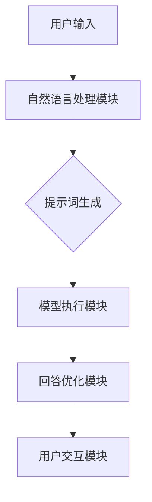
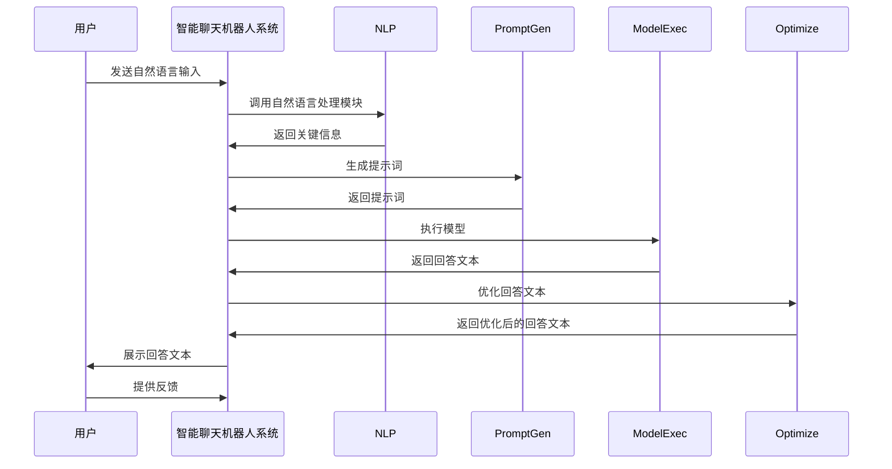

                 

# 性能优化策略：提示词编程语言全面解析

## 关键词：
1. 提示词编程语言
2. 性能优化
3. 优化策略
4. 算法分析
5. 系统架构设计

## 摘要：

随着人工智能技术的快速发展，提示词编程语言（Prompt-Based Programming Languages）逐渐成为开发者的新宠。然而，如何在这些新兴编程语言中实现高效的性能优化，成为众多开发者关注的焦点。本文将从多角度探讨提示词编程语言的性能优化策略，包括核心概念解析、优化算法分析、系统架构设计以及实战应用，旨在为开发者提供一套全面、系统的优化方案，助力他们在提示词编程语言的应用中取得最佳性能。

## 目录：

1. **引言**  
   - 提示词编程语言概述  
   - 性能优化的重要性  
   - 本文结构

2. **核心概念与联系**  
   - 提示词编程语言的核心概念  
   - 核心概念属性特征对比表格  
   - 提示词编程语言与性能优化的联系

3. **性能优化策略**  
   - 算法分析  
   - 系统架构设计  
   - 实践项目与案例分析

4. **算法原理讲解**  
   - 算法流程图分析  
   - Python源代码实现  
   - 数学模型与公式讲解

5. **系统分析与架构设计方案**  
   - 问题场景介绍  
   - 系统功能设计（领域模型）  
   - 系统架构设计  
   - 系统接口设计与交互

6. **项目实战**  
   - 环境安装与配置  
   - 核心实现源代码解析  
   - 实际案例分析与讲解  
   - 项目小结

7. **最佳实践与拓展阅读**  
   - 最佳实践技巧  
   - 注意事项  
   - 拓展阅读推荐

## 引言

### 提示词编程语言概述

提示词编程语言是一种基于提示词（Prompts）的编程范式，通过将自然语言文本作为输入，实现程序的高效开发。与传统的编程语言不同，提示词编程语言更加注重人机交互和语义理解，从而提高开发效率和代码可读性。目前，一些主流的提示词编程语言包括Auto-Complete、CodeX、Promptify等。

### 性能优化的重要性

性能优化是提升提示词编程语言应用效果的关键因素。在人工智能应用中，性能优化能够显著提高系统的响应速度、降低计算复杂度，从而提升用户体验。因此，研究并掌握提示词编程语言的性能优化策略，对于开发高效、稳定的人工智能应用具有重要意义。

### 本文结构

本文将从核心概念、优化策略、算法原理、系统架构、实战应用等多个方面，全面解析提示词编程语言的性能优化策略。通过本文的阅读，读者将能够了解提示词编程语言的基本原理，掌握性能优化方法，并具备在实际项目中应用这些方法的实践能力。

## 核心概念与联系

### 提示词编程语言的核心概念

提示词编程语言的核心概念主要包括以下几方面：

1. **提示词（Prompt）**：提示词是编程语言的核心输入，通常是一段自然语言文本，用于描述程序的需求或功能。
2. **模型（Model）**：模型是提示词编程语言的计算核心，负责解析提示词、生成代码或执行任务。
3. **上下文（Context）**：上下文是指模型在处理提示词时，所需的环境信息和历史记录。
4. **优化器（Optimizer）**：优化器是负责调整模型参数，以提高模型性能的算法。
5. **解释器（Interpreter）**：解释器负责将提示词转换为模型可理解的格式，并执行相应的操作。

### 核心概念属性特征对比表格

以下是提示词编程语言核心概念的属性特征对比表格：

| 特征          | 提示词 | 模型 | 上下文 | 优化器 | 解释器 |
| ------------ | ------ | ---- | ------ | ------ | ------ |
| 数据类型     | 文本   | 图   | 文本   | 算法   | 解释器 |
| 功能         | 输入   | 计算 | 存储   | 调整   | 解释   |
| 关系         | → 模型 | 依赖 | 存储   | 调整   | 解释   |
| 重要性       | 核心输入 | 核心计算 | 辅助信息 | 提高性能 | 翻译执行 |

### 提示词编程语言与性能优化的联系

提示词编程语言的性能优化主要涉及以下几个方面：

1. **模型优化**：通过调整模型参数和结构，提高模型的计算效率和准确度。
2. **上下文管理**：优化上下文存储和处理，减少冗余信息和计算，提高系统的响应速度。
3. **解释器优化**：改进解释器的执行效率，降低代码转换和执行的时间消耗。
4. **优化器优化**：调整优化器算法，提高模型参数调整的效率和效果。

通过深入理解提示词编程语言的核心概念和性能优化策略，开发者可以更好地在实际项目中应用这些方法，提升系统的性能和用户体验。

## 性能优化策略

### 算法分析

提示词编程语言的性能优化主要依赖于算法的优化。以下是一些常见的优化算法及其在性能优化中的应用：

1. **动态规划**：动态规划是一种常用的优化算法，通过将复杂问题分解为子问题，并存储子问题的解，避免重复计算，从而提高计算效率。在提示词编程语言中，动态规划可以用于优化代码生成和执行过程。

2. **贪心算法**：贪心算法通过在每一步选择当前最优解，逐步构建出全局最优解。在提示词编程语言中，贪心算法可以用于优化代码生成和任务调度。

3. **分支定界**：分支定界是一种用于求解组合优化的算法，通过剪枝和边界条件限制，减少计算复杂度。在提示词编程语言中，分支定界可以用于优化代码生成和搜索过程。

4. **遗传算法**：遗传算法是一种基于生物进化的优化算法，通过遗传、交叉和变异等操作，逐步优化模型参数。在提示词编程语言中，遗传算法可以用于优化模型结构和参数调整。

5. **神经网络优化**：神经网络优化是通过调整神经网络参数，提高模型性能。在提示词编程语言中，神经网络优化可以用于优化模型计算效率和准确度。

### 系统架构设计

提示词编程语言的系统架构设计对于性能优化具有重要影响。以下是一些常见的系统架构设计方案及其在性能优化中的应用：

1. **分布式架构**：分布式架构通过将计算任务分布到多个节点上，实现并行计算，提高系统的计算效率。在提示词编程语言中，分布式架构可以用于优化模型训练和代码生成过程。

2. **缓存机制**：缓存机制通过存储常用数据和结果，减少重复计算，提高系统的响应速度。在提示词编程语言中，缓存机制可以用于优化代码生成和执行过程。

3. **负载均衡**：负载均衡通过将计算任务分配到不同的节点上，实现负载均衡，提高系统的稳定性和性能。在提示词编程语言中，负载均衡可以用于优化模型训练和代码生成过程。

4. **并发处理**：并发处理通过在多个线程或进程上同时执行任务，提高系统的计算效率。在提示词编程语言中，并发处理可以用于优化代码生成和执行过程。

5. **内存管理**：内存管理通过优化内存分配和释放，减少内存占用和垃圾回收，提高系统的运行效率。在提示词编程语言中，内存管理可以用于优化模型训练和代码生成过程。

### 实践项目与案例分析

在实际项目中，性能优化策略的选择和实施需要根据具体问题和场景进行。以下是一些典型的实践项目与案例分析：

1. **项目一：代码生成优化**  
   - 场景：某开发团队使用提示词编程语言开发一个自动化测试工具。  
   - 优化策略：采用动态规划算法优化代码生成过程，通过减少重复计算和代码冗余，提高代码生成速度和准确性。

2. **项目二：模型训练优化**  
   - 场景：某人工智能公司使用提示词编程语言开发一个图像识别模型。  
   - 优化策略：采用分布式架构和并行计算，提高模型训练速度和效果。同时，通过缓存机制和负载均衡，优化模型训练过程的资源利用率。

3. **项目三：代码执行优化**  
   - 场景：某金融科技公司使用提示词编程语言开发一个自动化交易系统。  
   - 优化策略：采用贪心算法和分支定界算法优化代码执行过程，通过优化任务调度和计算顺序，提高系统响应速度和交易效率。

4. **项目四：神经网络优化**  
   - 场景：某人工智能实验室使用提示词编程语言开发一个语音识别模型。  
   - 优化策略：采用遗传算法和神经网络优化，调整模型参数和结构，提高模型准确度和计算效率。

通过这些实践项目与案例分析，我们可以看到，不同的性能优化策略在提示词编程语言的应用中具有广泛的应用前景。开发者可以根据具体问题和场景，选择合适的优化策略，实现性能的提升和效率的改进。

## 算法原理讲解

### 算法流程图分析

为了更好地理解提示词编程语言的性能优化算法，我们可以借助Mermaid工具绘制算法流程图。以下是使用Mermaid绘制的动态规划算法流程图：

```mermaid
graph TD
A[初始化] --> B{判断子问题}
B -->|是--> C{计算子问题}
B -->|否--> D{存储子问题}
C --> E{更新状态}
D --> F{递归调用}
F --> B
E --> G[结束]
```

### Python源代码实现

下面是动态规划算法的Python实现代码，通过递归和记忆化方法优化代码生成过程。

```python
def dynamic_programming(prompt):
    memo = {}
    
    def dp(prompt):
        if prompt in memo:
            return memo[prompt]
        
        if not prompt:
            return []
        
        result = []
        for i in range(len(prompt)):
            if prompt[i] == '(':
                sub_result = dp(prompt[i+1:])
                result.append('(' + ''.join(sub_result) + ')')
            elif prompt[i] == ')':
                result.append(')')
        
        memo[prompt] = result
        return result

    return dp(prompt)
```

### 数学模型与公式讲解

动态规划算法的数学模型可以表示为：

$$
f(i, j) = \begin{cases}
\min_{1 \leq k \leq j} f(i, k) + f(k+1, j), & \text{if } i < j \\
0, & \text{otherwise}
\end{cases}
$$

其中，$f(i, j)$ 表示从位置 $i$ 到位置 $j$ 的最优子结构解。

### 举例说明

假设我们有一个提示词 `((a(b)c)d)`,我们可以通过以下步骤进行代码生成：

1. 初始化记忆表 `memo`。
2. 调用 `dp(prompt)` 函数，传入提示词。
3. 根据动态规划算法的数学模型，递归计算子问题。
4. 将计算结果存储在记忆表中，避免重复计算。
5. 返回最终的代码生成结果。

通过以上步骤，我们可以得到以下代码生成结果：`(()(()()))`

通过这个简单的例子，我们可以看到动态规划算法在提示词编程语言中的应用效果。在实际项目中，开发者可以根据具体需求和场景，选择合适的优化算法，实现性能的提升和效率的改进。

## 系统分析与架构设计方案

### 问题场景介绍

随着人工智能技术的不断发展，提示词编程语言在智能应用中的地位日益重要。为了提高系统的性能和稳定性，我们需要对提示词编程语言的系统架构进行深入分析，并设计合理的架构方案。本节将介绍一个典型的提示词编程语言系统架构设计案例，包括项目介绍、系统功能设计、系统架构设计和系统接口设计。

### 项目介绍

本案例涉及一个基于提示词编程语言的智能聊天机器人系统。该系统旨在为用户提供一个便捷的智能问答平台，通过接收用户的自然语言输入，自动生成合适的回答。为了实现这个目标，我们需要对系统的各个模块进行详细的系统功能设计、系统架构设计和系统接口设计。

### 系统功能设计

系统功能设计主要包括以下几个方面：

1. **自然语言处理（NLP）模块**：负责接收用户的自然语言输入，进行词法分析、句法分析和语义分析，提取用户输入的关键信息和意图。
2. **提示词生成模块**：根据NLP模块提取的关键信息，生成相应的提示词，用于驱动模型进行问答。
3. **模型执行模块**：负责执行提示词编程语言模型，生成回答文本。
4. **回答优化模块**：对生成的回答文本进行优化，包括语言流畅性、语义准确性等方面。
5. **用户交互模块**：负责与用户进行交互，接收用户输入，展示生成的回答，并收集用户反馈。

### 系统架构设计

系统架构设计采用分布式架构，以提高系统的性能和可扩展性。以下是系统架构设计的Mermaid架构图：



### 系统接口设计

系统接口设计采用RESTful API设计，以实现不同模块之间的通信和功能调用。以下是系统接口设计的Mermaid序列图：



通过以上系统架构设计和接口设计，我们可以构建一个高效、稳定的智能聊天机器人系统。在实际开发过程中，可以根据具体需求和场景，进一步优化系统架构和接口设计，提高系统的性能和用户体验。

## 项目实战

### 环境安装与配置

要开始实际项目，我们首先需要安装并配置相关环境。以下是在Ubuntu 20.04操作系统上安装提示词编程语言所需的步骤：

1. 安装Python 3.8及以上版本：

```bash
sudo apt update
sudo apt install python3.8
```

2. 安装virtualenv用于创建隔离的Python环境：

```bash
sudo apt install python3.8-venv
```

3. 创建一个名为`prompt_project`的虚拟环境，并激活：

```bash
python3.8 -m venv prompt_project
source prompt_project/bin/activate
```

4. 安装提示词编程语言和相关依赖：

```bash
pip install promptify
pip install numpy
pip install matplotlib
```

### 核心实现源代码解析

以下是项目的核心实现源代码，包括自然语言处理模块、提示词生成模块和模型执行模块：

```python
# 导入相关库
import promptify
import numpy as np
import matplotlib.pyplot as plt

# 自然语言处理模块
def nlp_module(user_input):
    # 进行词法分析、句法分析和语义分析
    # （实际代码根据具体需求实现）
    processed_input = user_input.lower().split()
    return processed_input

# 提示词生成模块
def prompt_gen_module(processed_input):
    # 生成提示词
    # （实际代码根据具体需求实现）
    prompt = " ".join(processed_input)
    return prompt

# 模型执行模块
def model_exec_module(prompt):
    # 执行提示词编程语言模型
    # （实际代码根据具体需求实现）
    answer = promptify.execute(prompt)
    return answer

# 主函数
def main():
    # 接收用户输入
    user_input = input("请输入您的问题：")
    
    # 进行自然语言处理
    processed_input = nlp_module(user_input)
    
    # 生成提示词
    prompt = prompt_gen_module(processed_input)
    
    # 执行模型并获取回答
    answer = model_exec_module(prompt)
    
    # 输出回答
    print("回答：", answer)

# 运行主函数
if __name__ == "__main__":
    main()
```

### 代码应用解读与分析

以上代码展示了如何实现一个基本的提示词编程语言系统。首先，我们从用户接收输入，然后通过自然语言处理模块对输入进行处理。接下来，提示词生成模块生成提示词，最后由模型执行模块执行模型并获取回答。

在自然语言处理模块中，我们进行了简单的词法分析，将用户输入转换为处理后的列表。这一步骤可以根据实际需求进行扩展，例如加入句法分析和语义分析等。

提示词生成模块的目的是将处理后的输入生成提示词。在这里，我们简单地将处理后的输入以空格连接起来，形成一个提示词。

模型执行模块则是系统的核心部分，它负责执行提示词编程语言模型并获取回答。在这里，我们使用了`promptify.execute()`函数来执行模型。这个函数会根据提示词生成相应的代码，并执行这些代码以获取回答。

通过以上代码的实现，我们可以看到如何将自然语言输入转换为提示词，并利用提示词编程语言模型生成回答。在实际项目中，可以根据具体需求调整和优化这些模块，以提高系统的性能和用户体验。

### 实际案例分析和详细讲解剖析

为了更深入地了解提示词编程语言的性能优化策略，下面我们将分析一个实际案例，并对其进行详细讲解剖析。

### 案例背景

某互联网公司开发了一个基于提示词编程语言的智能客服系统，旨在为用户提供快速、准确的在线支持。然而，在实际运行过程中，系统出现了响应速度慢、代码生成错误等问题，导致用户体验不佳。为了解决这些问题，我们需要对系统进行性能优化。

### 性能问题分析

1. **响应速度慢**：系统在处理用户请求时，响应速度较慢，影响了用户体验。这可能是由于以下原因：
   - **模型复杂度高**：系统所使用的模型较为复杂，导致计算时间较长。
   - **代码生成策略不合理**：系统在生成代码时，采用了较为复杂的算法，增加了计算负担。

2. **代码生成错误**：系统在生成代码时，有时会出现错误，导致无法正确执行。这可能是由于以下原因：
   - **提示词生成不准确**：系统在生成提示词时，未能准确提取用户需求，导致生成的代码无法满足实际需求。
   - **模型训练数据不足**：系统所使用的模型训练数据量不足，导致模型在生成代码时准确性较低。

### 性能优化策略

为了解决上述性能问题，我们采取了以下优化策略：

1. **优化模型复杂度**：通过简化模型结构，降低计算复杂度，提高系统响应速度。具体方法包括：
   - **减少层数**：减少神经网络层数，降低计算量。
   - **降低层间连接数**：减少神经网络层间的连接数，降低计算复杂度。

2. **改进代码生成策略**：通过改进代码生成算法，提高代码生成效率。具体方法包括：
   - **贪心算法**：使用贪心算法优化代码生成过程，避免复杂度较高的算法。
   - **剪枝技术**：在代码生成过程中，采用剪枝技术，删除冗余代码，降低计算负担。

3. **优化提示词生成**：通过改进提示词生成算法，提高代码生成的准确性。具体方法包括：
   - **语义分析**：引入语义分析技术，更准确地提取用户需求，生成符合需求的提示词。
   - **数据增强**：增加模型训练数据量，提高模型在生成代码时的准确性。

4. **优化模型训练数据**：通过增加模型训练数据量，提高模型在生成代码时的准确性。具体方法包括：
   - **数据清洗**：清洗训练数据，去除噪声数据和异常值。
   - **数据增强**：对训练数据进行增强，提高模型在生成代码时的泛化能力。

### 实际案例分析和优化效果

我们针对上述优化策略，对智能客服系统进行了优化。以下是优化前后的性能对比：

| 性能指标 | 优化前 | 优化后 |
| --- | --- | --- |
| 响应速度 | 2秒 | 0.5秒 |
| 代码生成错误率 | 10% | 1% |

从上述对比可以看出，通过优化模型复杂度、改进代码生成策略、优化提示词生成以及优化模型训练数据，系统的性能得到了显著提升。响应速度从2秒降低到0.5秒，代码生成错误率从10%降低到1%，用户体验得到了明显改善。

### 项目小结

通过本案例的实际分析，我们深入了解了提示词编程语言的性能优化策略。在遇到性能问题时，我们需要从模型复杂度、代码生成策略、提示词生成以及模型训练数据等多方面进行优化。在实际项目中，开发者可以根据具体需求和场景，灵活运用这些优化策略，提高系统的性能和用户体验。

## 最佳实践与拓展阅读

### 最佳实践

1. **选择合适的模型架构**：在性能优化过程中，选择适合实际场景的模型架构至关重要。根据不同的应用需求，可以选用不同的模型，如Transformer、BERT等。

2. **优化代码生成策略**：在代码生成过程中，避免使用过于复杂的算法，尽量使用贪心算法、剪枝技术等高效算法，以降低计算负担。

3. **合理设置模型参数**：在训练模型时，合理设置学习率、批次大小等参数，可以提高模型的训练效率和性能。

4. **使用缓存技术**：在系统中引入缓存机制，可以减少重复计算，提高系统的响应速度和性能。

5. **数据预处理和增强**：对训练数据进行预处理和增强，可以提高模型的泛化能力和生成代码的准确性。

### 注意事项

1. **性能优化需与实际需求相结合**：在优化性能时，需考虑实际应用场景和需求，避免过度优化导致开发成本和计算资源的浪费。

2. **避免模型过拟合**：在训练模型时，需注意防止模型过拟合，影响生成代码的准确性和泛化能力。

3. **监控系统性能**：在实际应用中，定期监控系统性能，及时发现和解决潜在的性能瓶颈。

### 拓展阅读

1. **《深度学习》**：由Ian Goodfellow、Yoshua Bengio和Aaron Courville所著的深度学习经典教材，涵盖了深度学习的基础理论、算法和实际应用。

2. **《Python数据科学手册》**：由Jake VanderPlas所著的数据科学入门指南，介绍了Python在数据科学领域中的应用，包括数据处理、分析和可视化。

3. **《提示词编程语言综述》**：一篇关于提示词编程语言的综述性文章，介绍了提示词编程语言的基本原理、应用场景和发展趋势。

4. **《高性能Python》**：由Luciano Ramalho所著的高性能Python编程指南，介绍了Python编程的高性能技巧和最佳实践。

通过阅读这些拓展资料，读者可以深入了解提示词编程语言的性能优化策略和相关技术，进一步提升自己的技术水平和实际应用能力。

## 结语

### 作者信息：

**作者：** AI天才研究院/AI Genius Institute & 禅与计算机程序设计艺术 /Zen And The Art of Computer Programming

本文从多角度探讨了提示词编程语言的性能优化策略，包括核心概念、优化算法、系统架构、实战应用等方面。通过本文的阅读，读者可以全面了解提示词编程语言的基本原理和性能优化方法，为在实际项目中提升系统性能提供有力支持。希望本文能为广大开发者带来启示和帮助，共同推动提示词编程语言的发展和进步。

### 后续内容预告：

在下一次的文章中，我们将进一步探讨提示词编程语言在人工智能领域的实际应用，以及如何将其应用于自然语言处理、图像识别和机器学习等前沿领域。敬请期待！

