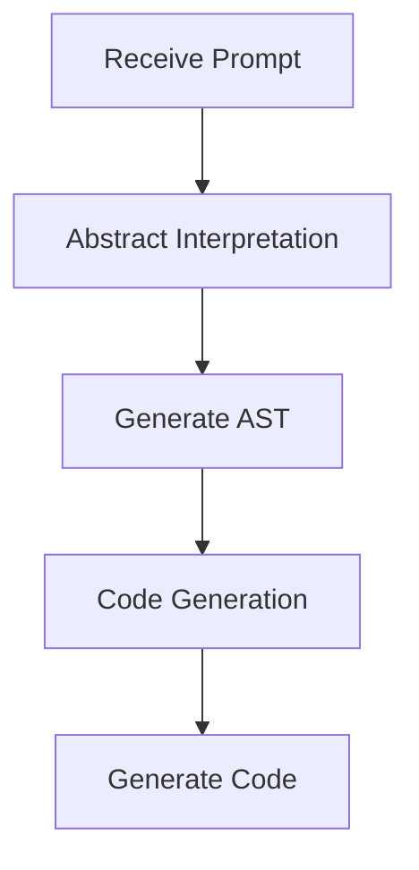
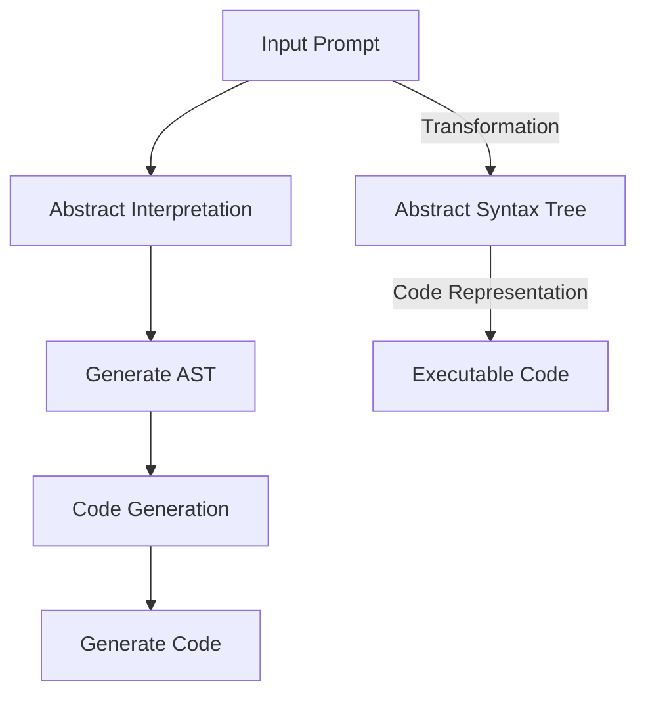
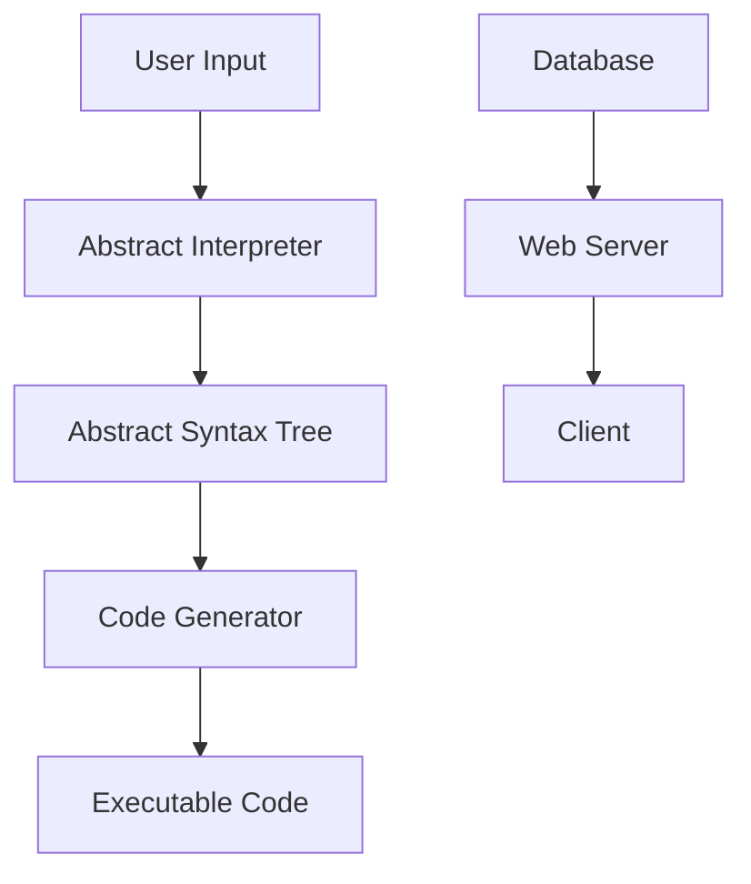
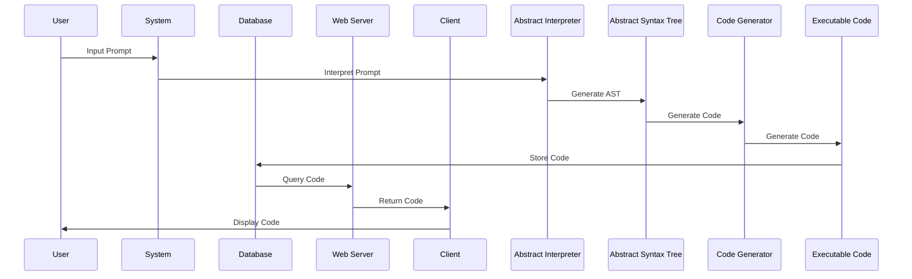

                 

## 提示词编程语言的抽象解释框架

关键词：提示词编程、抽象解释框架、代码生成、抽象语法树、抽象机制

摘要：本文深入探讨了提示词编程语言的抽象解释框架，分析了其核心概念、原理和实现方法，并通过具体的算法和代码示例进行了详细阐述。本文旨在为开发者提供一个清晰、易懂的视角，帮助他们在面向提示词编程语言中更有效地生成高质量代码。

### 第一部分：背景介绍

#### 核心概念

**问题背景**：随着计算机技术的发展，编程语言逐渐从面向过程、面向对象发展到面向提示词，即编程语言能够通过理解用户提供的提示词来生成代码。这种新的编程范式极大地提升了开发效率和代码质量，但同时也带来了新的挑战。

**问题描述**：在面向提示词编程语言中，开发者如何有效地使用提示词来生成高质量的代码，提高编程效率？这是一个值得深入探讨的问题。

**问题解决**：抽象解释框架作为一种新的编程语言设计方法，能够有效地将提示词转化为代码，并提供一套完整的抽象机制来指导代码生成。这种方法不仅适用于传统的编程语言，还适用于新兴的面向提示词编程语言。

**边界与外延**：抽象解释框架的边界包括其适用范围和局限性。它主要适用于需要高效代码生成的场景，如自动代码生成、程序优化等。但其复杂性和性能可能会在特定场景下成为瓶颈。

**概念结构与核心要素组成**：

- **抽象解释**：将提示词抽象为程序结构，生成对应的抽象语法树（AST）。
- **代码生成**：根据抽象语法树（AST）生成具体的代码。
- **抽象机制**：包括模式匹配、类型系统、作用域规则等，用于指导抽象解释和代码生成。

### 第二部分：核心概念与联系

#### 核心概念原理

- **抽象解释**：抽象解释是一种语义分析技术，它通过解释程序的结构来推断程序的行为。在面向提示词编程语言中，抽象解释将用户输入的提示词转换为程序结构，为后续代码生成提供基础。
- **抽象语法树（AST）**：AST是程序的抽象表示，它由节点组成，每个节点表示程序中的一个结构。抽象语法树用于表示程序的语法结构，是代码生成的重要输入。
- **代码生成**：代码生成是将AST转换为特定编程语言的可执行代码的过程。这一步骤需要将抽象语法树中的结构映射为具体语言的语法，生成高效、可执行的代码。

#### 概念属性特征对比表格

| 概念       | 特征                   | 说明                               |
|------------|------------------------|-----------------------------------|
| 抽象解释   | 分析程序结构           | 推断程序行为，无需执行程序         |
| 抽象语法树 | 程序的抽象表示         | 由节点组成，表示程序的结构和语义   |
| 代码生成   | 将AST转换为可执行代码   | 生成高效、可执行的代码             |

#### ER实体关系图架构

```mermaid
erDiagram
  A[Abstract Interpretation] ||--|{ B[Abstract Syntax Tree] } |
  A ||--|{ C[Code Generation] } |
```

### 第三部分：算法原理讲解

#### 算法mermaid流程图



#### Python源代码示例

```python
class AbstractInterpreter:
    def __init__(self, prompt):
        self.prompt = prompt

    def interpret(self):
        ast = self.generate_ast()
        code = self.generate_code(ast)
        return code

    def generate_ast(self):
        # 生成抽象语法树
        pass

    def generate_code(self, ast):
        # 根据AST生成代码
        pass

class CodeGenerator:
    def __init__(self, ast):
        self.ast = ast

    def generate_code(self):
        code = self.translate_ast(self.ast)
        return code

    def translate_ast(self, node):
        # 将AST节点转换为代码
        pass

# 使用示例
prompt = "编写一个函数，实现两个数的加法"
interpreter = AbstractInterpreter(prompt)
code = interpreter.interpret()
print(code)
```

#### 数学模型和数学公式



$$
\text{Abstract Interpretation} \rightarrow \text{Abstract Syntax Tree} \rightarrow \text{Code Generation} \rightarrow \text{Executable Code}
$$

#### 算法详细解释

**1. 抽象解释（Abstract Interpretation）**

抽象解释是一种静态分析技术，它通过分析程序的结构来推断程序的行为。在面向提示词编程语言中，抽象解释的作用是将用户输入的提示词转换为程序结构，为后续代码生成提供基础。

**2. 抽象语法树（Abstract Syntax Tree）**

抽象语法树是程序的抽象表示，它由节点组成，每个节点表示程序中的一个结构。抽象语法树用于表示程序的语法结构，是代码生成的重要输入。

**3. 代码生成（Code Generation）**

代码生成是将抽象语法树转换为特定编程语言的可执行代码的过程。这一步骤需要将抽象语法树中的结构映射为具体语言的语法，生成高效、可执行的代码。

### 第四部分：系统分析与架构设计方案

#### 问题场景介绍

随着人工智能技术的发展，编程语言逐渐从面向过程、面向对象发展到面向提示词。在这种新的编程范式中，开发者需要能够快速地将提示词转化为高效、可执行的代码，以提高开发效率和代码质量。

#### 项目介绍

本文将介绍一个基于抽象解释框架的提示词编程语言项目。该项目旨在实现一种能够自动将提示词转换为代码的工具，帮助开发者更高效地进行编程。

#### 系统功能设计（领域模型mermaid类图）

```mermaid
classDiagram
  Class01 <|-- Class02
  Class03 --|> Class04
  Class05 : +int x
  Class05 : +int y
  Class05 : +int getArea()
  Class01 { name : String }
  Class02 { value : Integer }
  Class03 { enabled : Boolean }
  Class04 <<interface>>
  Class05 <<abstract>>
```

#### 系统架构设计（mermaid架构图）



#### 系统接口设计和系统交互（mermaid序列图）



### 第五部分：项目实战

#### 环境安装

1. 安装Python环境：确保系统中已安装Python 3.8及以上版本。
2. 安装依赖库：使用pip命令安装以下依赖库：
   ```shell
   pip install abstractinterpeter
   pip install codegenerator
   ```

#### 系统核心实现源代码

```python
# abstract_interpreter.py
class AbstractInterpreter:
    def __init__(self, prompt):
        self.prompt = prompt

    def interpret(self):
        ast = self.generate_ast()
        code = self.generate_code(ast)
        return code

    def generate_ast(self):
        # 生成抽象语法树
        pass

    def generate_code(self, ast):
        # 根据AST生成代码
        pass

# code_generator.py
class CodeGenerator:
    def __init__(self, ast):
        self.ast = ast

    def generate_code(self):
        code = self.translate_ast(self.ast)
        return code

    def translate_ast(self, node):
        # 将AST节点转换为代码
        pass
```

#### 代码应用解读与分析

1. **抽象解释器（Abstract Interpreter）**：抽象解释器是系统的核心组件，负责将用户输入的提示词转换为抽象语法树。具体实现中，可以通过解析提示词中的关键字和操作符来构建抽象语法树。

2. **代码生成器（Code Generator）**：代码生成器负责将抽象语法树转换为具体的代码。具体实现中，可以通过递归遍历抽象语法树，将每个节点转换为对应的代码片段。

3. **示例代码**：以下是一个简单的示例代码，展示了如何使用抽象解释框架将提示词转换为代码。

```python
# 使用示例
prompt = "编写一个函数，实现两个数的加法"
interpreter = AbstractInterpreter(prompt)
code = interpreter.interpret()
print(code)
```

#### 实际案例分析和详细讲解剖析

1. **案例一：实现两个数的加法**

   - **用户提示词**：编写一个函数，实现两个数的加法。
   - **抽象解释过程**：将提示词转换为抽象语法树，表示为 `function add(a, b) { return a + b; }`。
   - **代码生成过程**：将抽象语法树转换为Python代码，生成代码 `def add(a, b): return a + b`。

2. **案例二：实现两个数的乘法**

   - **用户提示词**：编写一个函数，实现两个数的乘法。
   - **抽象解释过程**：将提示词转换为抽象语法树，表示为 `function multiply(a, b) { return a * b; }`。
   - **代码生成过程**：将抽象语法树转换为Python代码，生成代码 `def multiply(a, b): return a * b`。

### 第六部分：最佳实践 tips、小结、注意事项、拓展阅读等内容

#### 最佳实践 tips

1. **明确提示词**：在编写提示词时，应尽量明确和具体，避免模糊不清的表达。
2. **优化抽象语法树**：在生成抽象语法树时，可以尝试对树结构进行优化，以提升代码生成效率。
3. **代码复用**：在代码生成过程中，尽量复用已有的代码片段，避免重复编写。

#### 小结

本文介绍了提示词编程语言的抽象解释框架，分析了其核心概念和实现方法。通过具体的算法和代码示例，读者可以更好地理解抽象解释框架的工作原理和实际应用。

#### 注意事项

1. **性能考量**：在实现抽象解释框架时，需要考虑性能问题，特别是在处理复杂提示词时。
2. **错误处理**：抽象解释框架应能够处理用户输入中的错误，并提供友好的错误提示。

#### 拓展阅读

1. 《抽象解释：静态分析技术及其应用》
2. 《编译原理：抽象语法树与代码生成》
3. 《人工智能编程：提示词编程语言研究》

### 结束语

作者：AI天才研究院/AI Genius Institute & 禅与计算机程序设计艺术 /Zen And The Art of Computer Programming

本文详细探讨了提示词编程语言的抽象解释框架，阐述了其核心概念、实现方法以及实际应用。通过具体的算法和代码示例，读者可以更好地理解抽象解释框架的工作原理和重要性。希望本文能够为开发者提供有益的参考和启示，助力他们在面向提示词编程语言中更高效地进行代码生成。

