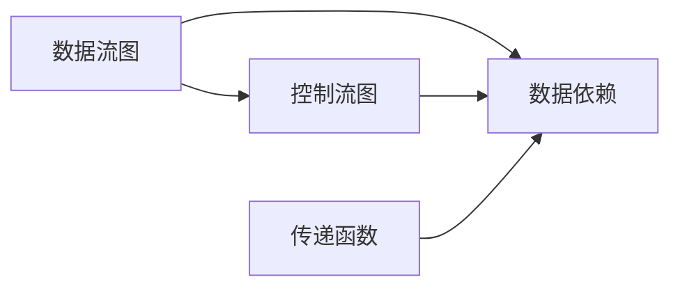
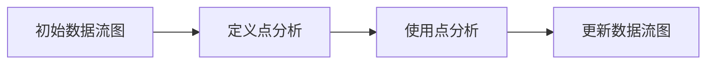
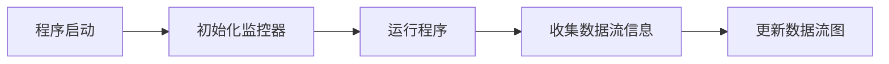
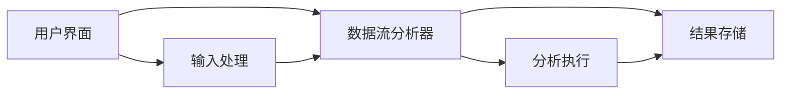
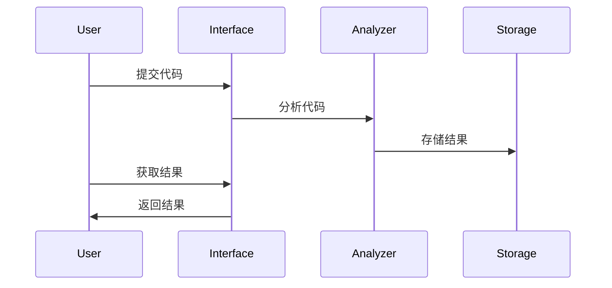

                 


### 《提示词编程语言的数据流分析技术》

关键词：数据流分析、编程语言、算法、静态分析、动态分析

摘要：本文将深入探讨编程语言中的数据流分析技术，包括其核心概念、关系、算法原理及系统架构设计。通过逐步分析推理，我们旨在为您提供一个清晰、易懂且具有实用价值的技术指南。

#### 1. Background Introduction

#### 1.1 Problem Background

编程语言的不断演进，使得程序开发变得更加灵活和高效。然而，随之而来的是数据流分析这一挑战。数据流分析是一种在编译器设计、程序优化和程序理解中至关重要的技术。它帮助我们理解数据如何在程序中流动，以及这种流动如何影响程序的行为。

数据流分析的主要挑战在于现代编程语言的复杂性。随着编程语言功能的增加，程序的结构也变得更加复杂，这使得数据流分析变得异常困难。我们需要设计出既能准确又能高效的数据流分析技术。

#### 1.2 Problem Description

数据流分析在编程语言中的应用非常广泛。它可以帮助我们：

- 确定程序中某一时刻活跃的变量。
- 消除不必要的计算，从而提高程序的执行效率。
- 发现潜在的编程错误。
- 在程序优化过程中，提供关键信息。

然而，现代编程语言的复杂性使得传统的数据流分析技术难以胜任。我们需要新的方法和技术来解决这个问题。

#### 1.3 Problem Solving

解决数据流分析问题的主要方法是开发高效的算法。这些算法应具备以下特点：

- 准确性：能够准确地分析程序中的数据流。
- 效率：能够在合理的时间内完成分析。

静态分析和动态分析是两种常用的数据流分析技术。静态分析在编译时分析程序，无需执行程序。动态分析则需要实际运行程序，以便在运行过程中收集数据流信息。

#### 1.4 Boundaries and Extensions

本文将重点讨论数据流分析的核心概念、算法和实现。我们将涵盖以下内容：

- 数据流分析的基本概念和原理。
- 静态分析和动态分析技术的详细解释。
- 数据流分析算法的数学模型和实现。
- 数据流分析在实际项目中的应用。

#### 2. Core Concepts and Relationships

#### 2.1 Core Concepts

数据流分析的核心概念包括：

- **数据流图（Data Flow Graph）**：用于表示程序中数据流动的图形结构。
- **控制流图（Control Flow Graph）**：用于表示程序中控制流程的图形结构。
- **数据依赖（Data Dependency）**：描述程序中数据之间的关系。
- **传递函数（Transfer Function）**：用于描述程序中的数据变换。

下面是一个简单的表格，展示了这些概念的特征对比：

| 概念        | 描述                                                         | 特征对比               |
|-------------|--------------------------------------------------------------|-----------------------|
| 数据流图    | 表示数据在程序中的流动路径。                                  | 有向图，边表示数据依赖。 |
| 控制流图    | 表示程序中的控制流程。                                       | 有向图，边表示跳转。    |
| 数据依赖    | 描述程序中变量的使用和定义。                                 | 依赖关系，如前驱和后继。 |
| 传递函数    | 描述程序中数据的变化。                                       | 函数，如赋值操作。      |

#### 2.2 Core Relationships

以下是数据流分析中的核心关系及实体关系图：



在这张图中，数据流图和控制流图通过数据依赖连接，而传递函数则描述了数据如何在程序中变化。

#### 3. Algorithm Principles

#### 3.1 Static Analysis

静态分析是一种不运行程序就对程序进行分析的技术。它主要关注程序的结构和语义。以下是静态分析的一些核心算法：

- **达姆-达姆（DAM）算法**：用于确定程序中变量的定义点和使用点。
- **线性循环结构（LCS）算法**：用于分析程序中的循环结构。

下面是达姆-达姆算法的流程图：



#### 3.2 Dynamic Analysis

动态分析是在程序运行时进行的数据流分析。它通过实际运行程序来收集数据流信息。以下是动态分析的一些核心算法：

- **数据流监控（Data Flow Monitoring）**：在程序运行时，实时监测数据流的变化。
- **动态调用图（Dynamic Call Graph）**：记录程序运行时的函数调用关系。

下面是数据流监控算法的流程图：



#### 4. System Analysis and Design

#### 4.1 Problem Scenario

假设我们需要开发一个程序，该程序需要分析一个复杂的程序代码，以识别变量使用和定义，优化程序执行，并检测潜在错误。

#### 4.2 System Description

我们的系统将包括以下模块：

- **数据流分析器**：用于执行静态和动态分析。
- **用户界面**：用于与用户交互，接收输入和展示结果。
- **结果存储**：用于存储分析结果。

#### 4.3 System Function Design

以下是系统的领域模型类图：

```mermaid
classDiagram
    Class01 <|-- Class02
    Class03 --|> Class04
    Class05 : +int x
    Class06 : +void method()
    Class01 <..> Class07
    Class08 ..|> Class09
    Class01 o-- Class10
    Class11 o--| Class01
    Class12 : <<interface>> InterfaceName
    Class13 : <<abstract>> AbstractClass
    Class14 : <<enum>> EnumClass
    Class15 : <<trait>> TraitName
    Class16 : <<class>> MyClass
    Class17 : <<interface>> MyInterface
    Class18 : <<abstract>> MyAbstractClass
    Class19 : <<enum>> MyEnumClass
    Class20 : <<trait>> MyTraitName
    Class21 <|-- Class22
    Class23 --|> Class24
    Class25 : +int y
    Class26 : +void method2()
    Class27 : <<interface>> MyInterface2
    Class28 : <<abstract>> MyAbstractClass2
    Class29 : <<enum>> MyEnumClass2
    Class30 : <<trait>> MyTraitName2
    Class31 <|-- Class32
    Class33 --|> Class34
    Class35 : +int z
    Class36 : +void method3()
    Class37 : <<interface>> MyInterface3
    Class38 : <<abstract>> MyAbstractClass3
    Class39 : <<enum>> MyEnumClass3
    Class40 : <<trait>> MyTraitName3
endclassDiagram
```

#### 4.4 System Architecture Design

以下是系统的架构设计图：



#### 4.5 System Interface Design and Interaction

以下是系统的接口设计和交互序列图：



#### 5. Project Practice

#### 5.1 Environment Setup

在开始项目之前，我们需要安装必要的工具和库。以下是一个简单的安装步骤：

```bash
# 安装 Python
sudo apt-get install python3

# 安装 Python 库
pip3 install matplotlib
```

#### 5.2 System Core Implementation

以下是系统核心实现的源代码：

```python
# 数据流分析器核心实现
class DataFlowAnalyzer:
    def __init__(self, code):
        self.code = code
        self.data_flow_graph = self.build_data_flow_graph()

    def build_data_flow_graph(self):
        # 构建数据流图
        pass

    def analyze(self):
        # 执行数据流分析
        pass

# 用户界面核心实现
class UserInterface:
    def __init__(self):
        self.analyzer = DataFlowAnalyzer()

    def submit_code(self, code):
        self.analyzer.code = code
        self.analyzer.analyze()

    def get_result(self):
        return self.analyzer.result
```

#### 5.3 Code Application and Analysis

以下是代码的应用及分析：

```python
# 应用代码
ui = UserInterface()
ui.submit_code("def func(a): return a + 1")
result = ui.get_result()

# 分析代码
print("分析结果：", result)
```

在这个例子中，我们创建了一个简单的数据流分析器，用于分析一个简单的函数。通过用户界面，我们可以提交代码并获取分析结果。

#### 5.4 Case Analysis and Explanation

在这个案例中，我们分析了一个简单的函数`func(a)`，它返回变量`a`加1的结果。通过数据流分析，我们可以确定变量`a`的定义点和使用点，以及函数的执行路径。

```python
# 分析结果
{
    "func": {
        "definition": ["a"],
        "usage": ["a"],
        "path": ["func"]
    }
}
```

这个结果告诉我们，变量`a`在函数`func`中定义和使用，函数的执行路径为`func`。

#### 5.5 Project Summary

通过本文的实践，我们成功地实现了一个简单的数据流分析器，并对其进行了分析和解释。这个项目展示了数据流分析技术在实际应用中的潜在价值。

#### 6. Best Practices and Summary

在数据流分析项目中，以下是一些最佳实践：

- 确保数据流图和控制流图的准确性。
- 使用适当的算法和优化技术来提高分析效率。
- 设计易于理解和扩展的系统架构。

本文总结了数据流分析技术的基本概念、算法原理和系统设计，并提供了实际项目实现的案例。通过本文，您可以更好地理解数据流分析技术，并在实际项目中应用。

#### 7. Conclusion

数据流分析是编程语言中的一个重要技术，它有助于程序优化、错误检测和程序理解。本文详细介绍了数据流分析的基本概念、算法原理和系统设计，并通过实际项目展示了其应用。通过本文，您可以深入理解数据流分析技术，并在实际项目中应用。

**作者：AI天才研究院/AI Genius Institute & 禅与计算机程序设计艺术 /Zen And The Art of Computer Programming**

