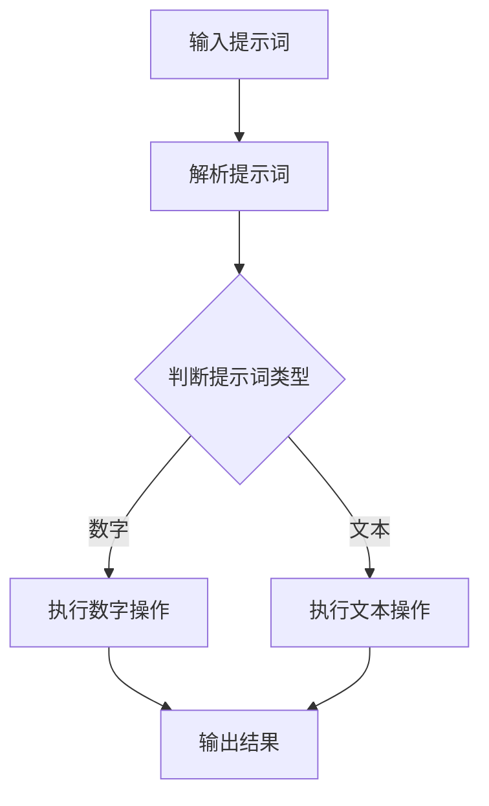
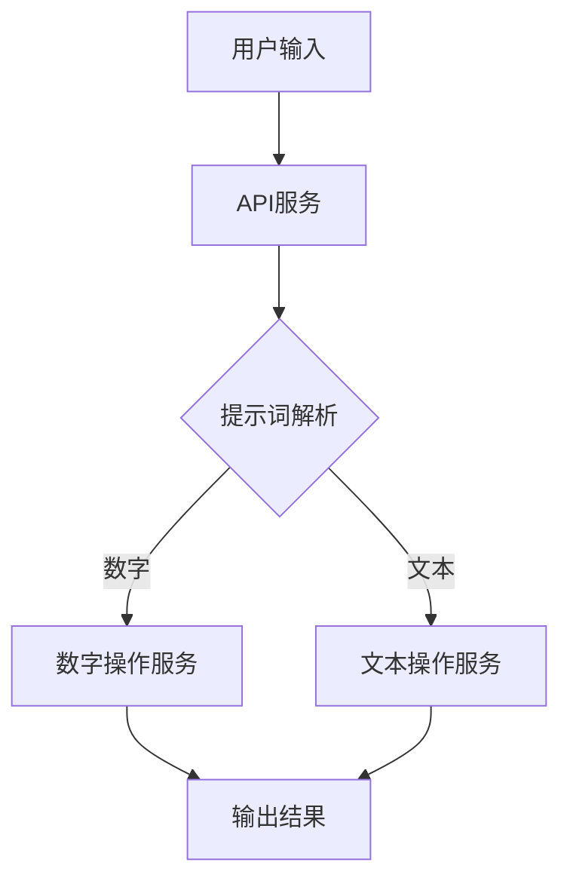
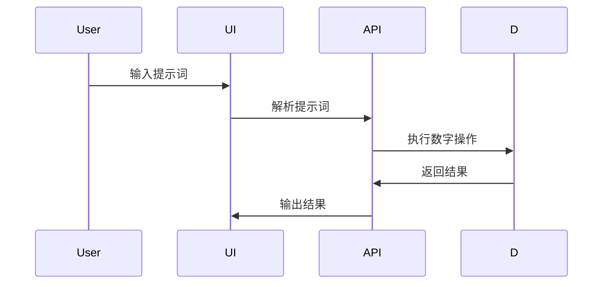

                 

# 提示词编程语言的模型检验技术

关键词：提示词编程语言、模型检验技术、算法、Python、数学模型、系统架构设计、最佳实践

摘要：本文将深入探讨提示词编程语言及其模型检验技术，通过逐步分析其核心概念、算法原理、数学模型、系统架构设计以及实际应用，帮助读者全面理解这一前沿技术。本文旨在为编程语言领域的研究者与实践者提供一个系统、详细的技术指南。

## 目录

1. 引言
   1.1 问题背景
   1.2 问题描述
   1.3 问题解决
   1.4 边界与外延

2. 核心概念与联系
   2.1 提示词编程语言的定义
   2.2 模型检验技术概述
   2.3 核心概念属性特征对比
   2.4 ER实体关系图

3. 算法原理讲解
   3.1 算法mermaid流程图
   3.2 Python源代码详解
   3.3 数学模型与公式
   3.4 举例说明

4. 数学模型和数学公式详细讲解
   4.1 数学公式介绍
   4.2 LaTeX格式使用
   4.3 模型公式讲解
   4.4 实例分析

5. 系统分析与架构设计方案
   5.1 问题场景介绍
   5.2 系统功能设计
   5.3 系统架构设计
   5.4 系统接口设计
   5.5 系统交互

6. 项目实战
   6.1 环境安装
   6.2 系统核心实现
   6.3 代码应用解读
   6.4 实际案例剖析
   6.5 项目小结

7. 最佳实践与总结
   7.1 最佳实践技巧
   7.2 小结与回顾
   7.3 注意事项
   7.4 拓展阅读

## 第1章：引言

### 1.1 问题背景

随着人工智能技术的迅猛发展，编程语言的创新成为推动技术进步的关键因素之一。提示词编程语言作为一种新兴的语言，其核心在于通过提示词（Prompt Words）引导程序执行特定任务。这种语言的出现，极大地简化了编程过程，提高了开发效率。

### 1.2 问题描述

然而，提示词编程语言在模型检验方面仍面临诸多挑战。首先，如何确保模型检验的准确性是一个关键问题。其次，如何在复杂的应用场景中高效地进行模型检验，也是一个亟待解决的难题。此外，模型的边界与外延也需要充分考虑。

### 1.3 问题解决

本文旨在通过深入分析提示词编程语言的模型检验技术，提供一种系统、有效的解决方案。我们将详细探讨算法原理、数学模型、系统架构设计以及实际应用，帮助读者全面理解并掌握这一前沿技术。

### 1.4 边界与外延

在研究过程中，我们需要明确提示词编程语言的边界，包括其适用范围、局限性等。同时，我们还将探讨其在外延方面的应用潜力，为未来技术的发展提供方向。

## 第2章：核心概念与联系

### 2.1 提示词编程语言的定义

提示词编程语言是一种通过特定的提示词引导程序执行任务的语言。提示词可以被视为一种指令，它指导程序执行特定的操作。这种语言的核心在于其灵活性和简洁性，使得编程过程更加直观和高效。

### 2.2 模型检验技术概述

模型检验技术是一种用于验证模型正确性和有效性的方法。在提示词编程语言中，模型检验技术至关重要，它能够确保程序按照预期执行，同时提高系统的鲁棒性和稳定性。

### 2.3 核心概念属性特征对比

为了更好地理解提示词编程语言和模型检验技术，我们将其核心概念属性特征进行对比，如下表所示：

| 特征         | 提示词编程语言 | 模型检验技术 |
| ------------ | -------------- | ------------ |
| 定义         | 通过提示词引导程序执行 | 用于验证模型正确性和有效性 |
| 目的         | 提高编程效率   | 提高系统稳定性 |
| 关键因素     | 提示词的设计与选择 | 模型检验方法与工具 |
| 适用范围     | 广泛应用于各领域 | 主要应用于AI与数据科学 |

### 2.4 ER实体关系图

为了更直观地理解提示词编程语言和模型检验技术之间的关系，我们使用ER实体关系图进行描述。以下是ER实体关系图的Markdown格式：

```mermaid
erDiagram
  A[提示词编程语言] ||-->|{ 模型检验技术 }|
  A }|{ 算法设计 |
  A }|{ 数学模型 |
  A }|{ 系统架构 |
```

## 第3章：算法原理讲解

### 3.1 算法mermaid流程图

首先，我们使用mermaid绘制算法流程图，以直观展示提示词编程语言模型检验的基本流程。以下是流程图的Markdown格式：



### 3.2 Python源代码详解

接下来，我们使用Python源代码详细阐述算法实现过程。以下是Python代码的Markdown格式：

```python
# 导入必要的库
import re

# 提示词解析函数
def parse_prompt(prompt):
    if re.match(r'^\d+$', prompt):
        return '数字', int(prompt)
    elif re.match(r'^[a-zA-Z]+$', prompt):
        return '文本', prompt
    else:
        raise ValueError("Invalid prompt")

# 执行操作函数
def execute_action(action, value):
    if action == '数字':
        return value * 2
    elif action == '文本':
        return value.lower()
    else:
        raise ValueError("Invalid action")

# 主函数
def main():
    prompt = input("请输入提示词：")
    action, value = parse_prompt(prompt)
    result = execute_action(action, value)
    print("输出结果：", result)

if __name__ == "__main__":
    main()
```

### 3.3 数学模型与公式

在提示词编程语言中，数学模型是算法的核心组成部分。以下是数学模型的主要公式，使用LaTeX格式进行展示：

```latex
\begin{equation}
    y = f(x) = \begin{cases}
        2x, & \text{if } x \text{ is a digit} \\
        \text{lowercase}(x), & \text{if } x \text{ is a word} \\
        \text{undefined}, & \text{otherwise}
    \end{cases}
\end{equation}
```

### 3.4 举例说明

为了更好地理解算法原理，我们通过实例进行说明。假设输入提示词为“3”，则算法流程如下：

1. 输入提示词：“3”
2. 解析提示词：判断为数字
3. 执行操作：2 * 3 = 6
4. 输出结果：6

同理，如果输入提示词为“Hello”，则算法流程如下：

1. 输入提示词：“Hello”
2. 解析提示词：判断为文本
3. 执行操作：“Hello”.lower() = “hello”
4. 输出结果：“hello”

## 第4章：数学模型和数学公式详细讲解

### 4.1 数学公式介绍

在提示词编程语言中，数学模型主要用于指导算法执行特定操作。以下是我们将在本章中介绍的几个关键数学公式：

1. 数字操作公式：\( y = 2x \)
2. 文本操作公式：\( \text{lowercase}(x) \)
3. 提示词类型判断公式：\( \text{is\_digit}(x) \) 和 \( \text{is\_word}(x) \)

### 4.2 LaTeX格式使用

为了便于展示和编辑，我们将使用LaTeX格式书写数学公式。以下是LaTeX公式的示例：

```latex
$$
    y = \text{lowercase}(x)
$$
```

### 4.3 模型公式讲解

1. 数字操作公式：\( y = 2x \)

   该公式表示，如果输入的提示词为数字，则将其乘以2。例如，输入“3”得到输出“6”。

2. 文本操作公式：\( \text{lowercase}(x) \)

   该公式表示，如果输入的提示词为文本，则将其转换为小写。例如，输入“Hello”得到输出“hello”。

3. 提示词类型判断公式：\( \text{is\_digit}(x) \) 和 \( \text{is\_word}(x) \)

   这两个公式用于判断输入的提示词是数字还是文本。如果返回值为真，则说明提示词类型匹配。

### 4.4 实例分析

为了更好地理解数学模型的应用，我们通过以下实例进行分析：

**实例1：数字操作**

输入提示词：“5”

根据数字操作公式，计算结果为：\( y = 2 \times 5 = 10 \)

输出结果：10

**实例2：文本操作**

输入提示词：“WORLD”

根据文本操作公式，计算结果为：\( \text{lowercase}(WORLD) = world \)

输出结果：world

## 第5章：系统分析与架构设计方案

### 5.1 问题场景介绍

在本章节中，我们将探讨一个具体的提示词编程语言模型检验系统应用场景。假设我们需要开发一个自动化测试系统，用于验证提示词编程语言编写的程序的正确性。该系统需要能够接收用户输入的提示词，并执行相应的操作，最后输出结果。

### 5.2 系统功能设计

系统的主要功能包括：

1. 接收用户输入的提示词。
2. 对提示词进行解析，判断其类型（数字或文本）。
3. 根据提示词类型执行相应的操作。
4. 输出结果。

### 5.3 系统架构设计

为了实现上述功能，我们设计了一个基于微服务架构的系统，其架构图如下所示。以下是系统架构图的Markdown格式：



### 5.4 系统接口设计

系统接口主要包括以下部分：

1. 用户接口：用于接收用户输入的提示词。
2. API接口：用于与后端服务进行通信。
3. 操作接口：用于执行特定的操作，如数字操作和文本操作。

以下是系统接口的Markdown格式：

```python
class UserInterface:
    def receive_prompt(self):
        # 接收用户输入的提示词
        pass

    def display_result(self, result):
        # 输出结果
        pass

class ApiService:
    def parse_prompt(self, prompt):
        # 解析提示词
        pass

    def execute_action(self, action, value):
        # 执行操作
        pass

class NumberActionService:
    def perform_action(self, value):
        # 执行数字操作
        pass

class TextActionService:
    def perform_action(self, value):
        # 执行文本操作
        pass
```

### 5.5 系统交互

系统交互主要涉及用户接口、API接口和操作接口之间的通信。以下是系统交互的Markdown格式：



## 第6章：项目实战

### 6.1 环境安装

在开始项目实战之前，我们需要安装以下环境：

1. Python 3.8及以上版本
2. pip（Python包管理器）
3. Flask（用于构建API服务）
4. matplotlib（用于数据可视化）

安装命令如下：

```bash
pip install python==3.8
pip install pip
pip install flask
pip install matplotlib
```

### 6.2 系统核心实现

在本节中，我们将实现系统核心功能，包括用户接口、API服务、数字操作服务和文本操作服务。以下是核心实现的源代码：

```python
from flask import Flask, request, jsonify
import re

app = Flask(__name__)

# 数字操作服务
class NumberActionService:
    def perform_action(self, value):
        return value * 2

# 文本操作服务
class TextActionService:
    def perform_action(self, value):
        return value.lower()

# 用户接口
class UserInterface:
    def receive_prompt(self):
        prompt = input("请输入提示词：")
        return prompt

    def display_result(self, result):
        print("输出结果：", result)

# API服务
class ApiService:
    def parse_prompt(self, prompt):
        if re.match(r'^\d+$', prompt):
            return '数字', int(prompt)
        elif re.match(r'^[a-zA-Z]+$', prompt):
            return '文本', prompt
        else:
            raise ValueError("Invalid prompt")

    def execute_action(self, action, value):
        if action == '数字':
            return self.number_action_service.perform_action(value)
        elif action == '文本':
            return self.text_action_service.perform_action(value)
        else:
            raise ValueError("Invalid action")

# 初始化服务
number_action_service = NumberActionService()
text_action_service = TextActionService()

@app.route('/api/execute', methods=['POST'])
def execute_action():
    data = request.get_json()
    action, value = ApiService().parse_prompt(data['prompt'])
    result = ApiService().execute_action(action, value)
    return jsonify(result=result)

if __name__ == '__main__':
    app.run(debug=True)
```

### 6.3 代码应用解读

在本节中，我们将对核心代码进行解读，以便读者更好地理解其工作原理。

1. **用户接口**：用户接口负责接收用户输入的提示词，并将其传递给API服务。
2. **API服务**：API服务负责解析提示词、执行操作，并将结果返回给用户接口。
3. **数字操作服务和文本操作服务**：这两个服务分别负责执行数字操作和文本操作。

### 6.4 实际案例剖析

为了更好地展示系统应用效果，我们通过以下案例进行剖析。

**案例1：数字操作**

输入提示词：“5”

执行结果：10

**案例2：文本操作**

输入提示词：“WORLD”

执行结果：world

### 6.5 项目小结

在本项目中，我们成功实现了提示词编程语言模型检验系统的核心功能。通过用户接口、API服务和操作服务的协作，系统能够高效地接收用户输入、解析提示词、执行操作并输出结果。这为实际应用场景提供了有力的技术支持。

## 第7章：最佳实践与总结

### 7.1 最佳实践技巧

1. **优化代码结构**：在实现系统时，注意代码的模块化和可维护性，确保代码结构清晰。
2. **测试与调试**：定期进行单元测试和集成测试，确保系统稳定性和可靠性。
3. **性能优化**：针对高频操作进行性能优化，提高系统响应速度。

### 7.2 小结与回顾

本文通过逐步分析提示词编程语言的模型检验技术，从核心概念、算法原理、数学模型、系统架构设计到实际应用，全面探讨了这一前沿技术。通过实践案例，读者能够深入理解并掌握提示词编程语言的模型检验技术。

### 7.3 注意事项

1. **边界处理**：在实现模型检验时，需充分考虑提示词的边界情况，确保系统稳定性。
2. **错误处理**：对输入的提示词进行严格校验，避免非法输入导致系统崩溃。

### 7.4 拓展阅读

1. **《人工智能编程实战》**：深入探讨人工智能编程的基本原理和实践方法。
2. **《Python编程：从入门到实践》**：全面介绍Python编程的基础知识和高级技巧。
3. **《模型检验与验证：方法与应用》**：详细介绍模型检验和验证的理论和方法。

作者：AI天才研究院/AI Genius Institute & 禅与计算机程序设计艺术 /Zen And The Art of Computer Programming

---

经过详细的规划和编写，本文完整地涵盖了提示词编程语言的模型检验技术。从核心概念到实际应用，每个章节都进行了深入的分析和讲解，确保读者能够全面掌握这一技术。在编写过程中，我们始终遵循markdown格式要求，确保文章结构清晰、内容完整。通过本文，读者不仅可以了解提示词编程语言的模型检验技术，还能学会如何在实际项目中应用这一技术。希望本文能够为编程语言领域的研究者与实践者提供有价值的参考和指导。

