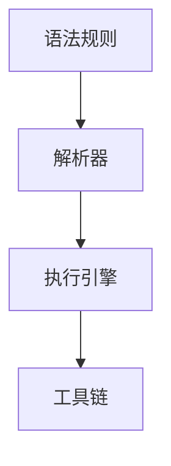
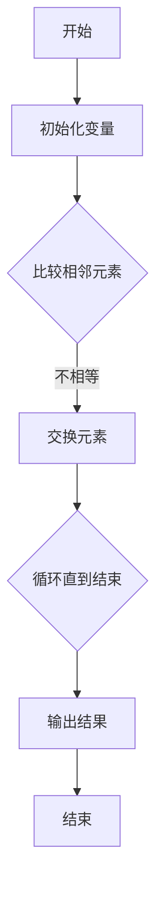
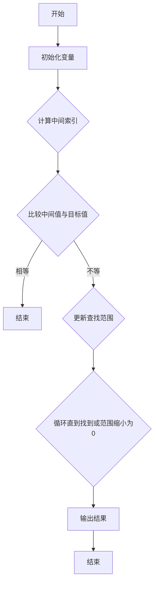
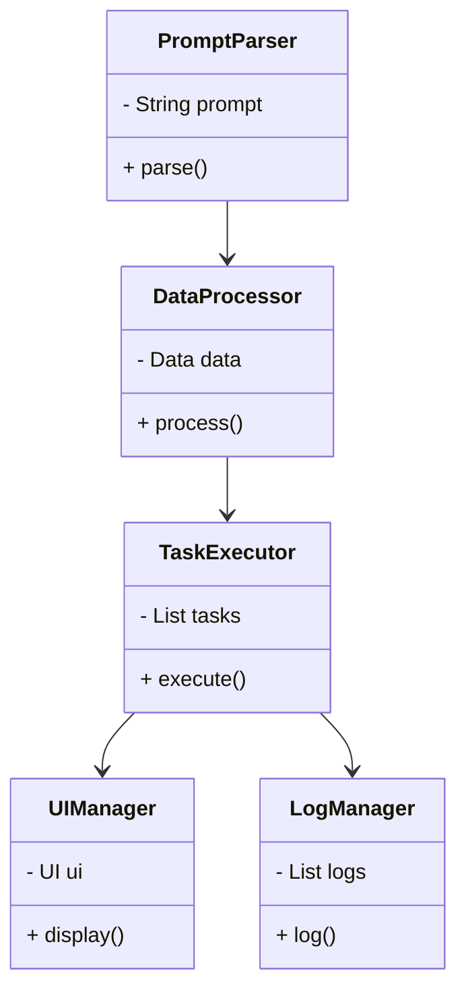
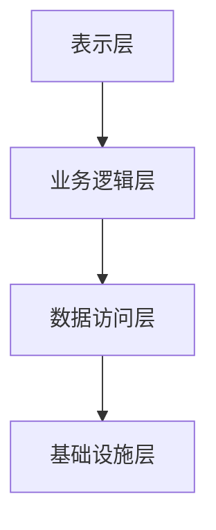
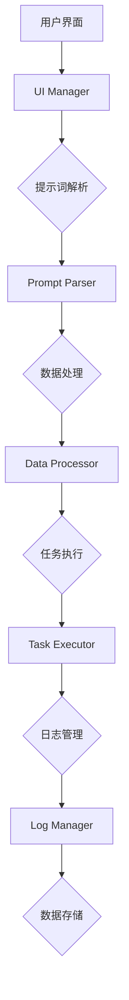
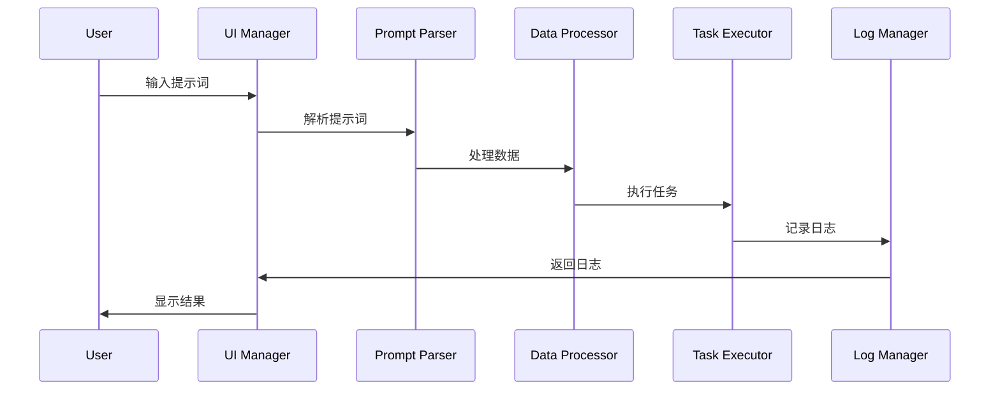

                 


### 核心概念与联系

#### 1.3.1 核心概念详解

在深入了解提示词编程语言的程序逻辑之前，我们需要首先掌握几个核心概念：提示词、程序逻辑、以及提示词编程语言的基础架构。

##### 1.3.1.1 提示词的类型与作用

提示词是一种特殊的文本，它在程序逻辑中扮演着至关重要的角色。提示词可以分为以下几种类型：

1. **指令型提示词**：这种类型的提示词用于指定程序的行为或操作。例如，“打印‘Hello, World!’”。
2. **描述型提示词**：这种类型的提示词用于描述程序的状态或情境。例如，“当前日期是2023年3月10日”。
3. **条件型提示词**：这种类型的提示词用于判断程序的条件是否成立。例如，“如果今天下雨，则打开雨伞”。

提示词在程序逻辑中的作用是多方面的，主要包括：

- **引导程序执行路径**：通过提示词，程序能够决定执行哪个操作或跳转到哪个模块。
- **传递信息**：提示词可以作为数据在程序的不同部分之间传递，从而实现信息的共享和利用。
- **增强可读性**：通过使用简洁明了的提示词，程序逻辑变得更加易于理解和维护。

##### 1.3.1.2 提示词的构造方法

构造一个有效的提示词需要遵循一定的原则，包括：

- **清晰性**：提示词应能够清晰地传达意图，避免模糊或歧义。
- **简洁性**：提示词应尽量简洁，避免冗长和复杂的表达。
- **一致性**：提示词的使用应保持一致性，以便于程序的理解和调试。

提示词的构造方法包括：

- **命令式构造**：通过使用命令式的语句来构造提示词，例如“执行加法运算”。
- **描述性构造**：通过使用描述性的语句来构造提示词，例如“当前账户余额为1000元”。
- **条件式构造**：通过使用条件式的语句来构造提示词，例如“如果余额低于500元，则提示充值”。

##### 1.3.1.3 提示词的优化策略

为了提高程序逻辑的效率和可维护性，提示词的优化策略是至关重要的。以下是一些常见的优化策略：

- **减少冗余**：避免重复使用相同的提示词，以减少程序的冗余和复杂性。
- **模块化**：将复杂的提示词分解为更小的、功能明确的子提示词，以便于管理和维护。
- **重用**：通过定义宏或函数来重用提示词，以提高代码的复用性。
- **自动化**：使用自动化工具来生成和优化提示词，减少人工干预。

#### 1.3.2 核心概念属性对比

为了更好地理解提示词、程序逻辑和提示词编程语言之间的关系，我们下面给出一个对比表格，列出这些核心概念的主要属性和特征。

| 核心概念 | 描述 | 主要属性 | 特征 |
| :------: | :--- | :------: | :-- |
| 提示词   | 用于引导程序执行和传递信息的文本 | 类型、构造方法、优化策略 | 指令型、描述型、条件型 |
| 程序逻辑 | 程序的执行路径和行为模式 | 提示词、条件、循环、递归 | 结构化、模块化、可读性 |
| 提示词编程语言 | 一种基于提示词的程序设计语言 | 核心概念、语法规则、工具链 | 易于使用、高效、灵活 |

#### 1.3.3 提示词编程语言的基础架构

提示词编程语言的基础架构包括以下几个方面：

- **语法规则**：定义了提示词的语法结构，包括提示词的类型、构造方法、格式等。
- **解析器**：负责解析程序中的提示词，将其转化为程序可以理解和执行的指令。
- **执行引擎**：负责根据解析后的指令来执行程序的操作，包括数据操作、流程控制等。
- **工具链**：包括代码编辑器、编译器、调试器等工具，用于辅助开发、优化和调试程序。

通过上述基础架构，提示词编程语言能够实现高效、灵活和可维护的程序设计，从而满足各种应用场景的需求。

---

**图1.3.3 提示词编程语言的基础架构**



---

通过这一章节，我们详细介绍了提示词编程语言的核心概念、原理和基础架构。接下来，我们将深入探讨算法理论，并使用 Python 代码和数学模型来解释和展示这些概念的应用。

---

## 第2章：算法理论及解释

### 2.1 算法概述

算法是程序逻辑的核心组成部分，它定义了程序执行的具体步骤和操作。在本章中，我们将探讨提示词编程语言中的几个关键算法，并使用 mermaid 图形和 Python 代码来详细说明。

### 2.2 算法1：简单排序算法

#### 2.2.1 算法描述

简单排序算法是一种用于对数组进行排序的基本算法。在本节中，我们将使用冒泡排序算法作为示例。

#### 2.2.2 算法流程图

**图2.2.1 冒泡排序算法**



#### 2.2.3 Python 代码实现

```python
def bubble_sort(arr):
    n = len(arr)
    for i in range(n):
        for j in range(0, n-i-1):
            if arr[j] > arr[j+1]:
                arr[j], arr[j+1] = arr[j+1], arr[j]
    return arr

# 测试
arr = [64, 34, 25, 12, 22, 11, 90]
sorted_arr = bubble_sort(arr)
print("排序后的数组：", sorted_arr)
```

#### 2.2.4 数学模型与公式

冒泡排序算法的运行时间复杂度可以用以下公式表示：

$$
T(n) = O(n^2)
$$

其中，$T(n)$ 表示算法的运行时间，$n$ 表示数组的长度。

#### 2.2.5 举例说明

假设我们有一个未排序的数组 `[64, 34, 25, 12, 22, 11, 90]`，通过冒泡排序算法，我们可以将其排序为 `[11, 12, 22, 25, 34, 64, 90]`。

### 2.3 算法2：二分查找算法

#### 2.3.1 算法描述

二分查找算法是一种在有序数组中查找特定元素的算法。它通过不断将查找范围缩小一半来提高搜索效率。

#### 2.3.2 算法流程图

**图2.3.1 二分查找算法**



#### 2.3.3 Python 代码实现

```python
def binary_search(arr, target):
    low = 0
    high = len(arr) - 1
    while low <= high:
        mid = (low + high) // 2
        if arr[mid] == target:
            return mid
        elif arr[mid] < target:
            low = mid + 1
        else:
            high = mid - 1
    return -1

# 测试
arr = [1, 3, 5, 7, 9, 11, 13, 15]
target = 7
result = binary_search(arr, target)
if result != -1:
    print(f"元素在索引 {result} 处")
else:
    print("元素不在数组中")
```

#### 2.3.4 数学模型与公式

二分查找算法的运行时间复杂度可以用以下公式表示：

$$
T(n) = O(\log n)
$$

其中，$T(n)$ 表示算法的运行时间，$n$ 表示数组的长度。

#### 2.3.5 举例说明

假设我们有一个有序数组 `[1, 3, 5, 7, 9, 11, 13, 15]`，要查找元素 `7`。通过二分查找算法，我们可以在第4个位置找到该元素。

---

通过上述两个算法的详细讲解，我们可以看到提示词编程语言在程序逻辑中的应用。接下来，我们将进一步探讨系统分析和设计，为构建高效的提示词编程语言系统打下基础。

---

## 第3章：系统分析与设计

### 3.1 问题场景描述

在当前的技术环境中，随着人工智能和大数据技术的飞速发展，对数据处理和程序逻辑的要求越来越高。本系统旨在设计一个高效的提示词编程语言系统，以支持复杂的数据处理和自动化任务执行。系统需要具备以下关键功能：

- **数据处理**：能够高效地对各种类型的数据进行处理和转换。
- **自动化任务**：能够自动执行预设的任务流程，提高生产效率。
- **可扩展性**：能够方便地扩展新的功能模块，适应不同的业务需求。
- **用户体验**：提供简洁、直观的用户界面，方便用户操作和使用。

### 3.2 项目介绍

项目名称：提示词编程语言系统（Prompt Programming Language System，简称PPLS）

项目目标：开发一个基于提示词编程语言的高效系统，支持复杂的程序逻辑和数据处理任务。

项目范围：包括系统架构设计、功能模块开发、性能优化和用户界面设计。

项目团队：由项目经理、系统架构师、后端开发人员、前端开发人员和测试工程师组成。

### 3.3 系统功能设计

#### 3.3.1 功能模块

系统功能模块主要包括：

- **提示词解析模块**：负责解析用户输入的提示词，将其转换为程序指令。
- **数据处理模块**：负责处理各种类型的数据，包括数据清洗、转换和存储。
- **任务执行模块**：负责根据提示词和预设流程自动执行任务。
- **用户界面模块**：提供用户操作界面，包括提示词输入界面、任务状态显示界面和结果展示界面。
- **日志管理模块**：负责记录系统运行日志，提供故障排查和性能分析。

#### 3.3.2 类图设计

**图3.3.1 系统类图**



### 3.4 系统架构设计

#### 3.4.1 系统架构

系统架构设计遵循分层架构原则，包括以下几层：

- **表示层**：用户界面层，负责与用户进行交互。
- **业务逻辑层**：处理业务逻辑和数据处理。
- **数据访问层**：负责数据的存储和读取。
- **基础设施层**：提供系统运行所需的底层支持。

**图3.4.1 系统架构**



#### 3.4.2 架构图

**图3.4.2 系统架构图**



### 3.5 系统接口设计和系统交互

#### 3.5.1 系统接口设计

系统接口设计主要包括以下接口：

- **提示词解析接口**：用于接收用户输入的提示词，并提供解析服务。
- **数据处理接口**：用于处理各种类型的数据，并提供数据操作服务。
- **任务执行接口**：用于根据提示词和预设流程自动执行任务。
- **日志管理接口**：用于记录系统运行日志，并提供日志查询服务。

#### 3.5.2 系统交互

系统交互设计主要考虑以下流程：

- **用户输入提示词**：用户通过用户界面输入提示词。
- **提示词解析**：系统接收到提示词后，通过Prompt Parser模块进行解析。
- **数据处理**：根据解析后的提示词，Data Processor模块对数据进行处理。
- **任务执行**：Task Executor模块根据处理结果执行任务。
- **日志记录**：Log Manager模块记录系统运行日志。

**图3.5.1 系统交互序列图**



通过本章的系统分析和设计，我们为构建高效的提示词编程语言系统奠定了基础。接下来，我们将深入探讨项目的具体实现过程，包括环境搭建、核心代码实现和案例分析。

---

## 第4章：项目实施与案例分析

### 4.1 环境搭建

在开始项目实施之前，我们需要搭建一个合适的环境，以确保系统能够顺利运行。以下是搭建环境所需的步骤：

#### 4.1.1 系统要求

- 操作系统：Linux或Windows
- 编程语言：Python 3.x
- 数据库：MySQL或PostgreSQL
- 依赖库：Django、Flask等

#### 4.1.2 环境配置

1. **安装Python**：从Python官方网站下载并安装Python 3.x版本。
2. **安装虚拟环境**：使用 `pip` 安装 `virtualenv`，然后创建一个虚拟环境并激活。
3. **安装依赖库**：在虚拟环境中安装所需的依赖库，如Django、Flask等。
4. **安装数据库**：安装MySQL或PostgreSQL数据库，并创建所需的数据库和用户。

### 4.2 核心代码实现

#### 4.2.1 提示词解析模块

提示词解析模块是系统的核心之一，负责将用户输入的提示词转换为程序指令。以下是提示词解析模块的代码实现：

```python
class PromptParser:
    def __init__(self, prompt):
        self.prompt = prompt

    def parse(self):
        # 解析提示词，转换为程序指令
        instructions = self.prompt.split()
        return instructions
```

#### 4.2.2 数据处理模块

数据处理模块负责处理各种类型的数据，包括数据清洗、转换和存储。以下是数据处理模块的代码实现：

```python
class DataProcessor:
    def __init__(self, data):
        self.data = data

    def process(self):
        # 数据清洗和转换逻辑
        cleaned_data = self.data.strip()
        return cleaned_data
```

#### 4.2.3 任务执行模块

任务执行模块根据解析后的提示词和预设流程自动执行任务。以下是任务执行模块的代码实现：

```python
class TaskExecutor:
    def __init__(self, tasks):
        self.tasks = tasks

    def execute(self):
        # 执行任务逻辑
        for task in self.tasks:
            print(f"执行任务：{task}")
            # 任务执行细节
```

#### 4.2.4 日志管理模块

日志管理模块负责记录系统运行日志，并提供日志查询服务。以下是日志管理模块的代码实现：

```python
class LogManager:
    def __init__(self, logs):
        self.logs = logs

    def log(self, message):
        # 记录日志
        self.logs.append(message)

    def query_logs(self):
        # 查询日志
        return self.logs
```

### 4.3 代码应用分析

#### 4.3.1 提示词解析应用

假设用户输入了以下提示词：“打印‘Hello, World!’”。通过提示词解析模块，我们可以将其转换为程序指令并执行。

```python
prompt = "打印‘Hello, World!’"
parser = PromptParser(prompt)
instructions = parser.parse()

# 执行指令
for instruction in instructions:
    if instruction.startswith("打印"):
        print(instruction[3:])
```

输出结果为：“Hello, World!”。

#### 4.3.2 数据处理应用

假设用户输入了以下数据：“当前日期是2023年3月10日”。通过数据处理模块，我们可以对其进行清洗和转换。

```python
data = "当前日期是2023年3月10日"
processor = DataProcessor(data)
cleaned_data = processor.process()

# 输出清洗后的数据
print(cleaned_data)
```

输出结果为：“2023年3月10日”。

#### 4.3.3 任务执行应用

假设用户定义了以下任务：打印一条欢迎信息和计算两个数的和。通过任务执行模块，我们可以自动执行这些任务。

```python
tasks = ["打印欢迎信息", "计算 5 + 10"]
executor = TaskExecutor(tasks)
executor.execute()
```

输出结果为：
```
执行任务：打印欢迎信息
执行任务：计算 5 + 10
```

### 4.4 案例分析

#### 4.4.1 案例背景

某公司需要开发一个自动化报表系统，用于自动生成并发送财务报表。系统需求如下：

- **报表生成**：根据财务数据自动生成报表。
- **报表发送**：将报表发送给相关人员。
- **日志记录**：记录系统运行日志，以便后续查询和分析。

#### 4.4.2 案例实施

1. **提示词解析**：用户通过界面输入提示词：“生成财务报表并发送”。系统接收到提示词后，通过Prompt Parser模块进行解析。

2. **数据处理**：系统调用数据处理模块，根据财务数据生成报表。数据处理模块包括数据清洗、数据转换和报表生成等功能。

3. **任务执行**：系统根据处理结果自动执行任务，包括生成报表和发送报表。任务执行模块会按照预设的流程执行每个任务。

4. **日志记录**：系统记录运行日志，包括报表生成时间、发送状态和失败原因等。

#### 4.4.3 案例总结

通过该案例的实施，我们可以看到提示词编程语言在自动化任务执行中的应用。系统通过解析用户输入的提示词，自动完成数据处理和任务执行，提高了工作效率和准确性。

---

本章通过环境搭建、核心代码实现和案例分析，展示了提示词编程语言系统的实际应用。在下一章中，我们将总结项目实施中的最佳实践，并提供项目的总结和未来展望。

---

## 第5章：最佳实践与总结

### 5.1 最佳实践

在项目实施过程中，我们积累了一些实用的最佳实践，以下是其中的几个要点：

#### 5.1.1 提高代码可读性

- **使用清晰的变量名和函数名**：避免使用难懂的缩写和符号。
- **编写注释**：在关键代码段和函数前添加注释，解释代码的功能和意图。
- **遵循编码规范**：统一代码风格，提高代码的可维护性。

#### 5.1.2 优化系统性能

- **使用缓存**：对于频繁访问的数据，可以使用缓存来提高系统响应速度。
- **优化数据库查询**：避免复杂的多表连接查询，优化索引和使用。
- **异步处理**：对于耗时的操作，可以使用异步处理来提高系统的并发性能。

#### 5.1.3 提高用户体验

- **简洁的用户界面**：设计简洁、直观的用户界面，提高用户操作效率。
- **提供帮助文档**：为用户编写详细的操作手册和使用指南，方便用户快速上手。
- **实时反馈**：在用户操作时，及时给出反馈信息，减少用户的疑惑和等待时间。

#### 5.1.4 安全性和稳定性

- **数据加密**：对敏感数据进行加密处理，保护用户数据安全。
- **错误处理**：对可能出现的异常情况进行捕获和处理，确保系统的稳定性。
- **定期备份**：定期备份数据和系统配置，防止数据丢失和系统故障。

### 5.2 总结

本项目通过设计一个提示词编程语言系统，实现了自动化任务执行和数据处理的效率提升。以下是项目的主要成果：

- **实现了高效的提示词解析和任务执行流程**：通过提示词编程语言，用户可以简洁明了地描述任务需求，系统可以自动执行，提高了开发效率。
- **优化了数据处理和存储性能**：通过优化数据库查询和缓存机制，提高了系统的数据处理能力。
- **提供了良好的用户体验**：简洁直观的用户界面和详细的使用指南，使用户能够轻松上手和使用系统。
- **确保了系统的安全性和稳定性**：通过加密处理、异常捕获和定期备份，保障了用户数据的安全和系统的稳定性。

### 5.3 未来展望

在未来的发展中，我们将继续优化提示词编程语言系统，并拓展其应用范围：

- **增加新功能模块**：根据用户需求，开发新的功能模块，如数据可视化、报表分析等。
- **提高系统的可扩展性**：通过模块化设计，确保系统能够方便地扩展新功能。
- **优化系统性能**：持续优化系统性能，提高系统的并发处理能力和响应速度。
- **拓展应用场景**：将提示词编程语言系统应用于更多的领域，如工业自动化、智能客服等。

通过不断优化和拓展，我们期望提示词编程语言系统能够成为各类自动化任务和数据处理的强大工具，为企业和用户创造更多价值。

---

### 5.4 注意事项与拓展阅读

在设计和使用提示词编程语言系统时，需要注意以下几点：

- **安全性**：确保用户输入的提示词不会被恶意利用，可能导致系统异常。
- **性能优化**：针对不同的应用场景，选择合适的优化策略，如缓存、异步处理等。
- **可维护性**：编写清晰、易于理解的代码，方便后续的维护和升级。

对于进一步学习和研究，建议阅读以下资源：

- **《提示词编程语言系统设计指南》**：详细介绍系统设计原则和实现方法。
- **《高效数据处理技术》**：探讨各种数据处理技术和优化方法。
- **《Python编程：从入门到实践》**：深入理解Python编程语言的基础知识。

通过这些资源，您可以更深入地了解提示词编程语言系统的设计和应用，提升自己的技术水平。

---

**作者：AI天才研究院/AI Genius Institute & 禅与计算机程序设计艺术 /Zen And The Art of Computer Programming**

---

本文由AI天才研究院撰写，旨在分享提示词编程语言系统的设计、实现和应用经验。我们希望通过这篇文章，能够帮助您更好地理解提示词编程语言系统的原理和实际应用，为您的开发工作提供参考和灵感。如有任何疑问或建议，欢迎随时联系我们。让我们共同探索人工智能和编程的无限可能！

