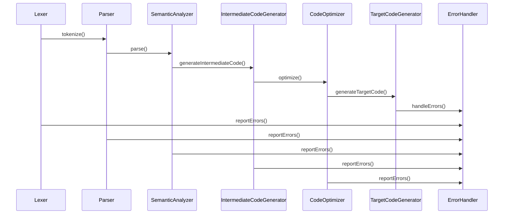
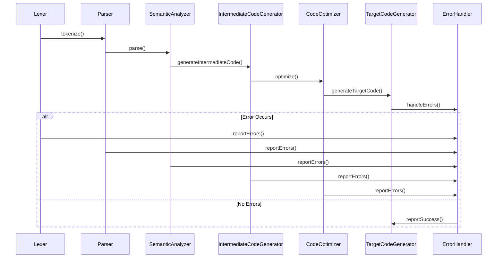

                 

### 《提示词编程语言的编译器设计》目录大纲

在撰写本文的过程中，我们将遵循“LET'S THINK STEP BY STEP”的思路，逐部分解析并阐述《提示词编程语言的编译器设计》的详细内容。本文将分为六个主要部分，每个部分都包含了具体的小节，确保文章内容既系统又深入。以下是本文的目录大纲：

#### 第一部分：编译器设计基础

**第1章：编译器设计概述**

1. **1.1 编译器设计的基本概念**
    - **1.1.1 编译器的作用与工作原理**
    - **1.1.2 编译器设计的重要性**
    - **1.1.3 编译器设计的分类**

2. **1.2 编译器设计的历史与发展**
    - **1.2.1 编译器设计的早期发展**
    - **1.2.2 现代编译器设计的方法与技术**
    - **1.2.3 编译器设计在编程语言中的应用**

3. **1.3 编译器设计的挑战与机遇**
    - **1.3.1 编译器设计面临的挑战**
    - **1.3.2 编译器设计的机遇与未来趋势**

**第2章：编译器设计中的核心概念**

1. **2.1 语法分析**
    - **2.1.1 语法分析的基本概念**
    - **2.1.2 词法和语法分析的区别**
    - **2.1.3 语法分析的方法**

2. **2.2 语义分析**
    - **2.2.1 语义分析的基本概念**
    - **2.2.2 语义分析的作用**
    - **2.2.3 语义分析的方法**

3. **2.3 代码生成**
    - **2.3.1 代码生成的基本概念**
    - **2.3.2 代码优化的策略**
    - **2.3.3 代码生成的工具**

#### 第二部分：编译器设计算法原理讲解

**第3章：编译器设计算法原理讲解**

1. **3.1 编译器设计的算法流程**
    - **3.1.1 编译器设计的基本算法流程**
    - **3.1.2 Mermaid流程图展示**

2. **3.2 语法分析算法讲解**
    - **3.2.1 LL(1)算法**
    - **3.2.2 SLR(1)算法**
    - **3.2.3 LR(1)算法**

3. **3.3 语义分析算法讲解**
    - **3.3.1 静态语义分析**
    - **3.3.2 动态语义分析**
    - **3.3.3 语义分析算法的Python代码示例**

#### 第三部分：编译器系统分析与架构设计

**第4章：编译器系统分析与架构设计**

1. **4.1 问题场景介绍**
    - **4.1.1 提示词编程语言的背景**
    - **4.1.2 编译器设计的需求**

2. **4.2 系统功能设计**
    - **4.2.1 领域模型类图**
    - **4.2.2 系统功能模块划分**

3. **4.3 系统架构设计**
    - **4.3.1 系统架构图**
    - **4.3.2 系统层次结构**

4. **4.4 系统接口设计**
    - **4.4.1 系统接口定义**
    - **4.4.2 系统接口实现**

5. **4.5 系统交互序列图**
    - **4.5.1 系统交互流程**
    - **4.5.2 Mermaid序列图展示**

#### 第四部分：编译器设计项目实战

**第5章：编译器设计项目实战**

1. **5.1 环境安装**
    - **5.1.1 开发环境搭建**
    - **5.1.2 相关工具安装**

2. **5.2 系统核心实现**
    - **5.2.1 词法分析器实现**
    - **5.2.2 语法分析器实现**
    - **5.2.3 语义分析器实现**

#### 第五部分：最佳实践与总结

**第6章：最佳实践与总结**

1. **6.1 最佳实践**
    - **6.1.1 编译器设计的最佳实践**
    - **6.1.2 代码优化与性能调优技巧**

2. **6.2 小结**
    - **6.2.1 本文的核心内容回顾**
    - **6.2.2 编译器设计的关键环节分析**

3. **6.3 注意事项**
    - **6.3.1 编译器设计中的常见问题与解决方案**
    - **6.3.2 如何避免编译器设计中的常见陷阱**

4. **6.4 拓展阅读**
    - **6.4.1 推荐阅读的书籍与论文**
    - **6.4.2 线上资源与学习平台**

### 文章关键词

- 编译器设计
- 提示词编程语言
- 语法分析
- 语义分析
- 代码生成

### 摘要

本文详细探讨了提示词编程语言的编译器设计，从基础概念、核心算法、系统分析与架构设计，到实际项目实战，全方位解析了编译器设计的各个环节。通过本文，读者可以系统地了解编译器设计的理论和方法，掌握编译器设计的最佳实践，并在实际项目中应用所学知识，提升编程和系统设计能力。

---

在接下来的内容中，我们将逐章深入讲解每一个部分，确保读者能够全面而深入地理解编译器设计的各个方面。现在，让我们开始第一部分的探讨：编译器设计概述。

### 编译器设计概述

编译器是计算机科学中的一个核心组件，它在编程语言的发展和应用中起到了至关重要的作用。本章节将介绍编译器设计的基本概念、历史发展、应用场景，并探讨编译器设计的重要性。

#### 1.1 编译器设计的基本概念

编译器（Compiler）是一种将高级编程语言（如C、Java、Python等）转换成机器语言（或汇编语言）的程序。这种转换过程称为编译（Compilation）。编译器的基本功能包括：

1. **词法分析（Lexical Analysis）**：将源代码分解成一系列的单词（称为词素）。
2. **语法分析（Syntax Analysis）**：检查源代码是否符合语言的语法规则，并将其转换成抽象语法树（Abstract Syntax Tree，AST）。
3. **语义分析（Semantic Analysis）**：检查源代码的语义是否正确，例如变量声明、类型检查等。
4. **中间代码生成（Intermediate Code Generation）**：将AST转换成中间代码，这种代码通常更接近机器语言，但仍然保持一定的平台无关性。
5. **代码优化（Code Optimization）**：对中间代码进行优化，以提高程序的性能。
6. **目标代码生成（Code Generation）**：将优化后的中间代码转换成机器语言或汇编语言。
7. **符号表管理（Symbol Table Management）**：在整个编译过程中管理符号表，用于存储变量、函数等信息。

#### 1.1.1 编译器的作用与工作原理

编译器的作用是将人类易于理解的高级编程语言转换成计算机能够理解和执行的机器语言。这一转换过程不仅包括语法和语义的检查，还包括性能优化，以提高程序的运行效率。

编译器的工作原理可以分为以下几个步骤：

1. **词法分析**：编译器首先读取源代码，将其分解成词法单元（Token），如变量名、关键字、操作符等。这个过程类似于将文本划分成单词。

2. **语法分析**：编译器使用语法规则（通常由文法规则定义）检查词法单元的顺序是否符合语言的语法结构。这一步通常通过构建语法树（Syntax Tree）来实现。

3. **语义分析**：编译器在语法分析的基础上，检查源代码的语义是否正确。例如，确保变量在使用前已声明，函数调用符合定义等。

4. **中间代码生成**：编译器将抽象语法树转换成中间代码。中间代码通常采用三地址码（Three-Address Code）等形式，它更容易进行优化。

5. **代码优化**：编译器对中间代码进行优化，以提高程序的执行效率。常见的优化技术包括常数折叠、循环优化、死代码删除等。

6. **目标代码生成**：编译器将优化后的中间代码转换成具体的机器语言或汇编语言，这是最终可执行的代码。

#### 1.1.2 编译器设计的重要性

编译器设计在计算机科学和软件开发中具有非常重要的地位，主要表现在以下几个方面：

1. **提高开发效率**：编译器能够将复杂的高级语言代码转换成高效的机器语言，提高了程序的开发效率。
2. **保证代码质量**：编译器在编译过程中进行语法和语义检查，有助于发现和纠正代码中的错误，提高了代码的质量。
3. **跨平台兼容**：编译器可以将一种语言的代码转换成另一种语言的代码，使得软件可以轻松在不同平台上运行。
4. **性能优化**：编译器能够对代码进行优化，提高程序的性能，这对于性能敏感的应用尤为重要。
5. **技术进步**：编译器技术的发展推动了计算机科学的进步，例如静态分析、动态分析、编译优化等技术都在编译器中得到了广泛应用。

#### 1.1.3 编译器设计的分类

根据编译器的输出和设计目标，编译器可以大致分为以下几类：

1. **编译器（Compiler）**：将高级语言代码编译成机器语言，一次编译后生成可执行文件，适用于静态执行的应用场景。
2. **解释器（Interpreter）**：逐行解释高级语言代码并执行，不需要生成可执行文件，适用于动态执行和调试。
3. **混合编译器/解释器（Hybrid Compiler/Interpreter）**：结合编译器和解释器的优点，部分代码编译，部分代码解释执行。
4. **静态分析工具**：主要进行代码分析，如语法分析、语义分析、类型检查等，不生成可执行代码，用于代码审查和优化。
5. **代码生成器**：根据特定的需求，生成特定语言的代码，如汇编代码生成器、硬件描述语言生成器等。

#### 1.2 编译器设计的历史与发展

编译器的设计始于20世纪50年代，最早的编译器是手写代码生成的，随着计算机科学的不断发展，编译器的设计方法和技术也得到了迅速的进步。

1. **早期编译器（20世纪50年代）**：
   - **汇编语言编译器**：早期的编译器主要是针对汇编语言的编译器，它们使用手动编写代码的方法进行编译。
   - **自顶向下编译器**：早期的编译器大多采用自顶向下的编译方法，如LL（1）分析法和LR（1）分析法。

2. **中间代码编译器（20世纪60年代）**：
   - **三地址码（Three-Address Code）**：这一时期开始使用中间代码表示源代码，三地址码是最常见的形式。
   - **优化技术**：开始引入代码优化技术，如常数折叠、循环展开、死代码删除等。

3. **现代编译器（20世纪70年代至今）**：
   - **LL（1）和LR（1）分析法**：LL（1）和LR（1）分析法成为语法分析的主流方法，提高了编译器的效率和可靠性。
   - **静态分析技术**：引入了静态分析技术，如数据流分析、控制流分析等，用于提高编译器的优化能力。
   - **交叉编译**：支持交叉编译，即在一个平台上编译另一平台的代码，提高了编译器的应用范围。
   - **并行编译**：随着多核处理器的普及，现代编译器支持并行编译，以提高编译速度。
   - **动态编译**：动态编译技术如即时编译（JIT）和AOT（Ahead-Of-Time）编译，使得编译器可以在运行时进行代码优化和适应。

#### 1.2.1 编译器设计的早期发展

编译器设计的早期发展主要集中在汇编语言和早期高级语言的编译器上。

1. **汇编语言编译器**：
   - **符号表管理**：早期编译器引入了符号表来管理变量和函数的定义和使用。
   - **语法分析**：使用简单的词法分析和语法分析方法，如有限自动机（Finite Automata）。
   - **代码生成**：生成基本的汇编代码，如单条指令和简单的跳转。

2. **Fortran和COBOL编译器**：
   - **Fortran**：1957年，IBM发布了第一个Fortran编译器，它是最早成功的高级语言编译器之一。
   - **COBOL**：1959年，COBOL编译器的发布标志着编译器设计的进一步成熟。

#### 1.2.2 现代编译器设计的方法与技术

现代编译器设计采用了多种方法和技术，使得编译器的性能和效率得到了极大的提升。

1. **LL（1）分析法**：
   - **优点**：简单、易于实现，适用于大多数编程语言。
   - **缺点**：对于复杂语法结构，可能产生大量的分析冲突，需要使用更多的解析策略。

2. **LR（1）分析法**：
   - **优点**：能够处理更复杂的语法结构，具有较高的解析效率。
   - **缺点**：解析过程可能产生回溯，对性能有一定影响。

3. **静态分析技术**：
   - **数据流分析**：分析数据在程序中的流动情况，用于优化和错误检测。
   - **控制流分析**：分析程序的执行路径，用于优化和错误检测。
   - **类型检查**：在编译过程中检查变量的类型是否一致，用于提高代码质量。

4. **优化技术**：
   - **常数折叠**：在编译过程中，将表达式中的常数进行运算，以提高执行效率。
   - **循环优化**：优化循环结构的代码，减少重复计算。
   - **死代码删除**：删除程序中不会执行的代码，减少执行时间。

5. **中间代码表示**：
   - **三地址码（Three-Address Code）**：将源代码转换成三地址码，便于分析和优化。
   - **抽象语法树（Abstract Syntax Tree）**：表示源代码的结构，便于语法分析和语义分析。

#### 1.2.3 编译器设计在编程语言中的应用

编译器设计在编程语言中扮演着至关重要的角色，不同的编程语言可能采用不同的编译器设计方法。

1. **C语言**：
   - **编译器**：GCC（GNU Compiler Collection）是C语言最常用的编译器，它支持多种平台和优化技术。
   - **编译过程**：C语言的编译过程包括词法分析、语法分析、语义分析、中间代码生成、代码优化和目标代码生成。

2. **Java语言**：
   - **编译器**：Java的编译器是Java编译器（javac），它将Java源代码编译成字节码。
   - **编译过程**：Java的编译过程包括词法分析、语法分析、语义分析、抽象语法树生成、中间代码生成、代码优化和字节码生成。

3. **Python语言**：
   - **编译器**：Python的编译器是Python解释器，它将Python源代码逐行解释执行。
   - **编译过程**：Python的编译过程包括词法分析、语法分析、语义分析、抽象语法树生成、字节码生成和解释执行。

#### 1.3 编译器设计的挑战与机遇

随着计算机科学和编程语言的发展，编译器设计面临着新的挑战和机遇。

1. **挑战**：
   - **复杂性**：现代编程语言的语法和语义越来越复杂，编译器需要处理更多的语法规则和语义约束。
   - **性能优化**：编译器需要在有限的资源下实现高效的代码生成和优化，这对于编译器的性能提出了更高的要求。
   - **动态特性**：许多现代编程语言支持动态特性，如动态类型、动态绑定等，这增加了编译器的复杂性。

2. **机遇**：
   - **并行计算**：随着多核处理器的普及，编译器可以更好地利用并行计算技术，提高程序的执行效率。
   - **机器学习**：机器学习技术在编译器优化中的应用，如基于统计的代码优化、机器学习模型生成等，为编译器设计带来了新的可能性。
   - **自动代码生成**：自动代码生成工具可以自动化编译器的设计和实现，降低开发成本，提高开发效率。

#### 1.3.1 编译器设计面临的挑战

编译器设计在技术层面和实际应用中面临多个挑战：

1. **语法复杂性**：
   - **挑战**：现代编程语言支持丰富的语法结构，如嵌套函数、多重继承、泛型等，这使得语法分析变得更加复杂。
   - **解决方案**：采用高级语法分析技术，如LL（1）分析法、LR（1）分析法，以及语法糖（Syntax Sugar）等技术来简化语法处理。

2. **语义复杂性**：
   - **挑战**：编程语言的语义规则复杂，如作用域规则、类型系统、异常处理等，这使得语义分析变得复杂。
   - **解决方案**：使用静态语义分析和动态语义分析技术，逐步验证代码的语义正确性，并使用抽象语法树（AST）来表示语义结构。

3. **性能优化**：
   - **挑战**：编译器需要在编译过程中生成高效的目标代码，这需要复杂的优化算法。
   - **解决方案**：采用先进的优化技术，如循环优化、指令调度、内存优化等，以提高代码执行效率。

4. **动态特性**：
   - **挑战**：动态特性如动态类型、动态绑定等增加了编译器的复杂性。
   - **解决方案**：采用动态分析技术，如运行时类型检查、动态绑定机制，以及动态优化技术。

#### 1.3.2 编译器设计的机遇与未来趋势

编译器设计领域不断涌现新的机遇和趋势，推动着技术的进步：

1. **并行计算**：
   - **机遇**：现代计算机体系结构支持并行计算，编译器可以更好地利用多核处理器的优势。
   - **未来趋势**：编译器将更多地关注并行优化，如任务并行、数据并行、流水线优化等。

2. **机器学习**：
   - **机遇**：机器学习技术在编译器优化中的应用，如代码生成、优化决策等。
   - **未来趋势**：基于机器学习的编译器优化技术，如深度学习模型生成、自动优化策略等，将成为研究热点。

3. **自动代码生成**：
   - **机遇**：自动代码生成工具可以自动化编译器的设计和实现，提高开发效率。
   - **未来趋势**：生成式编程和编译器设计自动化，如使用模板、代码生成工具等。

4. **增量编译**：
   - **机遇**：增量编译技术可以减少编译时间，提高开发效率。
   - **未来趋势**：随着代码库的增大，增量编译将成为编译器设计的重要方向。

#### 1.4 小结

编译器设计是计算机科学中的一项基础且重要的技术，它在编程语言的发展和应用中起到了关键作用。通过本文的介绍，我们了解了编译器设计的基本概念、历史发展、应用场景，并探讨了编译器设计的重要性以及面临的挑战和机遇。在接下来的章节中，我们将进一步深入探讨编译器设计中的核心概念、算法原理、系统分析与架构设计等内容，帮助读者全面掌握编译器设计的理论与实践。

### 第2章：编译器设计中的核心概念

编译器设计是一个复杂的系统，它涉及到多个核心概念和步骤。本章将详细讲解编译器设计中的三大核心概念：语法分析、语义分析和代码生成。每个部分都将包括基本概念、重要性、方法及其相互关系。

#### 2.1 语法分析

语法分析（Syntax Analysis）是编译器的第一步，它的主要任务是检查源代码是否符合编程语言的语法规则。语法分析将词法分析器（Lexer）输出的词素序列转换成抽象语法树（Abstract Syntax Tree，AST）。

**2.1.1 语法分析的基本概念**

- **词法分析**：将源代码分解成词素（Token），如变量名、操作符、关键字等。
- **语法分析**：检查词法单元的顺序是否符合语言的语法规则，并构建抽象语法树。
- **抽象语法树**：表示源代码的结构，每个节点代表一个语法结构，如表达式、语句等。

**2.1.2 语法分析的重要性**

- **语法检查**：确保源代码的语法正确，为后续的语义分析和代码生成提供基础。
- **代码结构化**：通过抽象语法树，将源代码的结构化表示，便于进一步分析和优化。

**2.1.3 语法分析的方法**

- **自顶向下语法分析**：从全局开始，逐步细化，直到生成抽象语法树。
  - **LL（1）分析法**：适用于大多数编程语言，简单且易于实现。
  - **递归下降分析法**：通过递归函数实现，适用于简单的语法结构。
- **自底向上语法分析**：从局部开始，逐步向上构建抽象语法树。
  - **LR（1）分析法**：适用于复杂语法结构，具有较高的解析效率。

#### 2.2 语义分析

语义分析（Semantic Analysis）是编译器的第二步，它的主要任务是检查源代码的语义是否正确，如变量声明、类型检查、作用域分析等。语义分析依赖于抽象语法树，将源代码的语义信息转化为中间表示。

**2.2.1 语义分析的基本概念**

- **抽象语法树**：源代码的结构化表示，每个节点包含语法和语义信息。
- **语义检查**：确保源代码的语义正确，如变量已声明、类型匹配等。
- **符号表**：存储变量、函数、类等信息，用于语义分析。

**2.2.2 语义分析的重要性**

- **错误检测**：在编译过程中检测语义错误，如变量未声明、类型不匹配等。
- **代码优化**：基于语义信息进行代码优化，如常量折叠、循环优化等。

**2.2.3 语义分析的方法**

- **静态语义分析**：在编译时检查源代码的语义，不依赖于运行时信息。
  - **作用域分析**：检查变量和函数的作用域，确保在正确的地方使用。
  - **类型检查**：检查变量和表达式的类型，确保类型兼容。
- **动态语义分析**：在运行时检查源代码的语义，通常用于动态类型语言。

#### 2.3 代码生成

代码生成（Code Generation）是编译器的最后一步，它的主要任务是将抽象语法树转换成机器语言或汇编语言，生成可执行代码。

**2.3.1 代码生成的基本概念**

- **抽象语法树**：源代码的结构化表示，用于代码生成和优化。
- **中间代码**：介于高级语言和机器语言之间的代码，通常采用三地址码（Three-Address Code）等形式。
- **目标代码**：机器语言或汇编语言，可直接在计算机上执行。

**2.3.2 代码优化的策略**

- **常量折叠**：在编译时计算常量的值，减少运行时的计算。
- **循环优化**：优化循环结构的代码，减少重复计算。
- **死代码删除**：删除不会执行的代码，减少执行时间。

**2.3.3 代码生成的工具**

- **代码生成器**：自动化代码生成的工具，如LLVM、GNU Compiler Collection（GCC）等。
- **汇编器**：将汇编代码转换成机器语言的工具，如NASM、GAS等。

#### 2.4 核心概念之间的关系

语法分析、语义分析和代码生成是编译器的三个核心步骤，它们相互依赖、相互影响。

- **语法分析**为语义分析和代码生成提供结构化的表示，是后续步骤的基础。
- **语义分析**确保源代码的语义正确，为代码生成提供可靠的输入。
- **代码生成**将语义信息转化为可执行代码，实现编程语言的执行。

通过这些核心概念，编译器能够将高级语言的源代码转换成机器语言，实现编程语言的功能。在下一章中，我们将进一步探讨编译器设计算法原理，深入理解编译器的工作流程和关键技术。

### 第3章：编译器设计算法原理讲解

编译器设计涉及多个复杂的算法和流程，本章将详细介绍编译器设计中的关键算法，包括语法分析算法和语义分析算法，并通过Python代码和LaTeX公式进行解释和示例展示。

#### 3.1 编译器设计的算法流程

编译器设计的算法流程可以分为以下几个主要阶段：

1. **词法分析（Lexical Analysis）**：将源代码分解成词法单元。
2. **语法分析（Syntax Analysis）**：检查源代码的语法结构，生成抽象语法树。
3. **语义分析（Semantic Analysis）**：检查源代码的语义是否正确，如类型检查、作用域分析等。
4. **中间代码生成（Intermediate Code Generation）**：将抽象语法树转换成中间代码。
5. **代码优化（Code Optimization）**：对中间代码进行优化，提高执行效率。
6. **目标代码生成（Code Generation）**：将优化后的中间代码转换成机器语言或汇编语言。

以下是编译器设计的基本算法流程的Mermaid流程图：


#### 3.2 语法分析算法讲解

语法分析是编译器的核心步骤之一，它的任务是将词法分析器生成的词法单元转换成抽象语法树。以下将介绍几种常用的语法分析算法：

**3.2.1 LL(1)算法**

LL(1)算法是一种自顶向下语法分析方法，它使用一个向前看的有限状态机（Finite State Machine，FSM）来驱动分析过程。LL(1)算法的优点是简单且易于实现，但可能需要较大的解析表。

以下是LL(1)算法的Mermaid流程图：

```mermaid
graph LR
A1[词法分析] --> B1[构建LL(1)解析表]
B1 --> C1[使用LL(1)解析表进行语法分析]
C1 --> D1[生成抽象语法树]
```

示例：使用Python代码实现一个简单的LL(1)解析器：

```python
class LL1Parser:
    def __init__(self, grammar):
        self.grammar = grammar
        self.parse_table = self.build_parse_table()

    def build_parse_table(self):
        # 构建LL(1)解析表
        pass

    def parse(self, tokens):
        # 使用LL(1)解析表进行语法分析
        pass

# 假设存在一个简单的文法规则：
S -> aB
B -> bC | ε
C -> c

# 创建LL(1)解析器并解析输入的词法单元：
parser = LL1Parser(grammar)
parser.parse(tokens)
```

**3.2.2 SLR(1)算法**

SLR(1)算法是LL(1)算法的扩展，它解决了LL(1)算法中的一些问题，如左递归和冲突等。SLR(1)算法使用状态转换图（State Transition Diagram）来驱动分析过程。

以下是SLR(1)算法的Mermaid流程图：

```mermaid
graph LR
A2[词法分析] --> B2[构建SLR(1)状态转换图]
B2 --> C2[使用SLR(1)状态转换图进行语法分析]
C2 --> D2[生成抽象语法树]
```

示例：使用Python代码实现一个简单的SLR(1)解析器：

```python
class SLR1Parser:
    def __init__(self, grammar):
        self.grammar = grammar
        self.state_transition_table = self.build_state_transition_table()

    def build_state_transition_table(self):
        # 构建SLR(1)状态转换表
        pass

    def parse(self, tokens):
        # 使用SLR(1)状态转换表进行语法分析
        pass

# 假设存在一个简单的文法规则：
S -> aB
B -> bC | ε
C -> c

# 创建SLR(1)解析器并解析输入的词法单元：
parser = SLR1Parser(grammar)
parser.parse(tokens)
```

**3.2.3 LR(1)算法**

LR(1)算法是一种自底向上语法分析方法，它使用动作表（Action Table）和移进-规约（Shift-Reduce）策略进行语法分析。LR(1)算法能够处理更复杂的语法结构，但实现相对复杂。

以下是LR(1)算法的Mermaid流程图：

```mermaid
graph LR
A3[词法分析] --> B3[构建LR(1)动作表和状态转换表]
B3 --> C3[使用LR(1)动作表和状态转换表进行语法分析]
C3 --> D3[生成抽象语法树]
```

示例：使用Python代码实现一个简单的LR(1)解析器：

```python
class LR1Parser:
    def __init__(self, grammar):
        self.grammar = grammar
        self.action_table, self.goto_table = self.build_lr1_tables()

    def build_lr1_tables(self):
        # 构建LR(1)动作表和状态转换表
        pass

    def parse(self, tokens):
        # 使用LR(1)动作表和状态转换表进行语法分析
        pass

# 假设存在一个简单的文法规则：
S -> aB
B -> bC | ε
C -> c

# 创建LR(1)解析器并解析输入的词法单元：
parser = LR1Parser(grammar)
parser.parse(tokens)
```

#### 3.3 语义分析算法讲解

语义分析是编译器的另一个核心步骤，它的任务是在语法分析的基础上检查源代码的语义是否正确，如类型检查、作用域分析等。

**3.3.1 静态语义分析**

静态语义分析是在编译时对源代码的语义进行检查，不依赖于运行时信息。以下是一些常见的静态语义分析方法：

1. **作用域分析**：检查变量和函数的作用域，确保在正确的位置使用。
2. **类型检查**：检查变量和表达式的类型，确保类型兼容。
3. **常量折叠**：在编译时计算常量的值，减少运行时的计算。

以下是静态语义分析的Mermaid流程图：


示例：使用Python代码实现一个简单的静态语义分析器：

```python
class StaticSemanticAnalyzer:
    def __init__(self, ast):
        self.ast = ast

    def analyze(self):
        # 进行作用域分析
        pass
        # 进行类型检查
        pass
        # 进行常量折叠
        pass

# 假设存在一个简单的抽象语法树：
ast = build_ast()

# 创建静态语义分析器并进行分析：
analyzer = StaticSemanticAnalyzer(ast)
analyzer.analyze()
```

**3.3.2 动态语义分析**

动态语义分析是在运行时对源代码的语义进行检查，通常用于动态类型语言。以下是一些常见的动态语义分析方法：

1. **运行时类型检查**：在运行时检查变量的类型，确保类型兼容。
2. **动态绑定**：在运行时确定变量和函数的绑定，实现动态特性。

以下是动态语义分析的Mermaid流程图：


示例：使用Python代码实现一个简单的动态语义分析器：

```python
class DynamicSemanticAnalyzer:
    def __init__(self, interpreter):
        self.interpreter = interpreter

    def analyze(self, variables):
        # 进行运行时类型检查
        pass
        # 进行动态绑定
        pass

# 假设存在一个简单的解释器：
interpreter = build_interpreter()

# 创建动态语义分析器并进行分析：
analyzer = DynamicSemanticAnalyzer(interpreter)
analyzer.analyze(variables)
```

#### 3.4 小结

编译器设计的算法原理是编译器实现的基础，包括语法分析算法和语义分析算法。语法分析算法如LL(1)、SLR(1)和LR(1)用于检查源代码的语法结构，生成抽象语法树。语义分析算法包括静态语义分析和动态语义分析，用于检查源代码的语义是否正确。通过本章的讲解，我们了解了编译器设计的关键算法及其实现方法，为后续的编译器开发和优化奠定了基础。

### 第4章：编译器系统分析与架构设计

在了解了编译器设计的基本概念和算法原理后，本章将深入探讨编译器系统的分析与架构设计。我们将从问题场景介绍、系统功能设计、系统架构设计、系统接口设计到系统交互序列图，逐步解析编译器系统的整体架构。

#### 4.1 问题场景介绍

在当前软件开发的背景下，编译器设计面临着多种挑战，包括复杂编程语言的支持、高性能的代码生成、动态特性的处理等。为了更好地解决这些问题，我们选择设计一个支持提示词编程语言的编译器。提示词编程语言是一种基于自然语言交互的编程语言，它允许开发人员使用自然语言编写程序，使编程过程更加直观和便捷。

**需求背景**：

1. **易用性**：提示词编程语言应具备易用性，允许开发人员使用自然语言描述程序逻辑。
2. **灵活性**：编译器应支持多种编程语言特性，如函数、循环、条件判断等。
3. **高效性**：编译器需要生成高效的目标代码，以提升程序运行性能。
4. **可扩展性**：编译器架构应具备良好的可扩展性，支持未来添加新特性或支持新的编程语言。

**具体需求**：

1. **语法分析**：支持提示词编程语言的语法结构，如提示词定义、变量声明、函数调用等。
2. **语义分析**：检查提示词编程语言的语义是否正确，如变量作用域、类型检查等。
3. **代码生成**：生成高效的目标代码，支持多种目标平台，如Windows、Linux、MacOS等。
4. **优化策略**：实施多种代码优化策略，如循环展开、死代码删除等，提升目标代码的性能。

#### 4.2 系统功能设计

编译器系统的功能设计是系统架构设计的基础，它定义了编译器的核心功能模块及其相互作用。以下是提示词编程语言编译器的主要功能模块：

1. **词法分析器（Lexer）**：
   - 功能：将源代码分解成词法单元（Token），如关键字、操作符、标识符等。
   - 输入：源代码文件。
   - 输出：词法单元序列。

2. **语法分析器（Parser）**：
   - 功能：检查词法单元的顺序是否符合提示词编程语言的语法规则，生成抽象语法树（AST）。
   - 输入：词法单元序列。
   - 输出：抽象语法树。

3. **语义分析器（Semantic Analyzer）**：
   - 功能：在语法分析的基础上，检查源代码的语义是否正确，如变量作用域、类型检查等。
   - 输入：抽象语法树。
   - 输出：语义分析结果。

4. **中间代码生成器（Intermediate Code Generator）**：
   - 功能：将抽象语法树转换成中间代码，如三地址码（Three-Address Code）。
   - 输入：抽象语法树。
   - 输出：中间代码。

5. **代码优化器（Code Optimizer）**：
   - 功能：对中间代码进行优化，提高目标代码的性能。
   - 输入：中间代码。
   - 输出：优化后的中间代码。

6. **目标代码生成器（Target Code Generator）**：
   - 功能：将优化后的中间代码转换成目标平台上的机器语言或汇编语言。
   - 输入：优化后的中间代码。
   - 输出：目标代码。

7. **错误处理模块（Error Handler）**：
   - 功能：处理编译过程中的各种错误，如语法错误、语义错误等。
   - 输入：编译器各个模块的错误信息。
   - 输出：错误报告和提示。

**领域模型类图**：

为了更好地展示编译器系统的功能模块及其关系，我们可以使用Mermaid类图来表示。以下是编译器系统的领域模型类图：

```mermaid
classDiagram
    Lexer <<Interface>>
    Parser <<Interface>>
    SemanticAnalyzer <<Interface>>
    IntermediateCodeGenerator <<Interface>>
    CodeOptimizer <<Interface>>
    TargetCodeGenerator <<Interface>>
    ErrorHandler <<Interface>>

    Lexer -> Parser
    Parser -> SemanticAnalyzer
    SemanticAnalyzer -> IntermediateCodeGenerator
    IntermediateCodeGenerator -> CodeOptimizer
    CodeOptimizer -> TargetCodeGenerator
    TargetCodeGenerator -> ErrorHandler

    class Lexer {
        - String sourceCode
        - List<Token> tokens
        + Lexer(sourceCode)
        + tokenize()
    }

    class Parser {
        - List<Token> tokens
        - AbstractSyntaxTree ast
        + Parser(tokens)
        + parse()
    }

    class SemanticAnalyzer {
        - AbstractSyntaxTree ast
        - Map<String, Variable> symbolTable
        + SemanticAnalyzer(AbstractSyntaxTree ast)
        + analyze()
    }

    class IntermediateCodeGenerator {
        - AbstractSyntaxTree ast
        - IntermediateCode intermediateCode
        + IntermediateCodeGenerator(AbstractSyntaxTree ast)
        + generateIntermediateCode()
    }

    class CodeOptimizer {
        - IntermediateCode intermediateCode
        - OptimizedIntermediateCode optimizedCode
        + CodeOptimizer(IntermediateCode intermediateCode)
        + optimize()
    }

    class TargetCodeGenerator {
        - OptimizedIntermediateCode optimizedCode
        - TargetCode targetCode
        + TargetCodeGenerator(OptimizedIntermediateCode optimizedCode)
        + generateTargetCode()
    }

    class ErrorHandler {
        - List<Error> errors
        + ErrorHandler()
        + handleErrors()
    }
```

#### 4.3 系统架构设计

编译器系统架构设计是确保系统功能实现高效、稳定和可扩展的关键。以下是提示词编程语言编译器系统架构的详细描述。

**4.3.1 系统架构图**

为了更好地展示编译器系统的整体架构，我们可以使用Mermaid序列图来表示。以下是编译器系统的架构图：



**4.3.2 系统层次结构**

编译器系统可以分为以下几个层次：

1. **输入层**：负责读取源代码文件，将其传递给词法分析器。
2. **词法分析层**：词法分析器将源代码分解成词法单元，生成词法序列。
3. **语法分析层**：语法分析器检查词法序列的语法结构，生成抽象语法树。
4. **语义分析层**：语义分析器在语法分析的基础上检查语义，生成语义分析结果。
5. **代码生成层**：中间代码生成器和代码优化器将抽象语法树转换成优化后的中间代码。
6. **目标代码生成层**：目标代码生成器将优化后的中间代码转换成目标平台上的机器语言。
7. **错误处理层**：错误处理模块负责收集和报告编译过程中的各种错误。

**4.3.3 系统架构设计**

编译器系统采用模块化设计，各功能模块之间通过接口进行通信。以下是编译器系统的架构设计：

1. **模块划分**：
   - **词法分析模块**：负责词法分析，将源代码分解成词法单元。
   - **语法分析模块**：负责语法分析，检查词法序列的语法结构。
   - **语义分析模块**：负责语义分析，检查源代码的语义是否正确。
   - **中间代码生成模块**：负责生成中间代码，将抽象语法树转换成中间表示。
   - **代码优化模块**：负责代码优化，提高中间代码的性能。
   - **目标代码生成模块**：负责生成目标代码，将优化后的中间代码转换成机器语言。
   - **错误处理模块**：负责错误处理，收集和报告编译过程中的错误。

2. **接口设计**：
   - **输入接口**：负责读取源代码文件，提供输入流。
   - **输出接口**：负责输出编译结果，如错误报告、目标代码等。
   - **分析接口**：各分析模块之间的通信接口，如词法分析接口、语法分析接口、语义分析接口等。
   - **生成接口**：各生成模块之间的通信接口，如中间代码生成接口、目标代码生成接口等。

3. **架构设计**：
   - **分层架构**：编译器系统采用分层架构，各功能模块位于不同的层次，通过接口进行通信。
   - **模块化设计**：各功能模块独立实现，便于维护和扩展。
   - **面向对象设计**：采用面向对象的设计方法，提高系统的可扩展性和灵活性。

#### 4.4 系统接口设计

系统接口设计是编译器系统架构设计的重要部分，它定义了各功能模块之间的通信方式。以下是提示词编程语言编译器系统的接口设计。

**4.4.1 系统接口定义**

1. **词法分析接口**：
   - **输入接口**：读取源代码文件，提供输入流。
   - **输出接口**：输出词法单元序列。

2. **语法分析接口**：
   - **输入接口**：接收词法单元序列。
   - **输出接口**：输出抽象语法树。

3. **语义分析接口**：
   - **输入接口**：接收抽象语法树。
   - **输出接口**：输出语义分析结果。

4. **中间代码生成接口**：
   - **输入接口**：接收抽象语法树。
   - **输出接口**：输出中间代码。

5. **代码优化接口**：
   - **输入接口**：接收中间代码。
   - **输出接口**：输出优化后的中间代码。

6. **目标代码生成接口**：
   - **输入接口**：接收优化后的中间代码。
   - **输出接口**：输出目标代码。

7. **错误处理接口**：
   - **输入接口**：接收错误信息。
   - **输出接口**：输出错误报告。

**4.4.2 系统接口实现**

1. **词法分析接口实现**：

```python
class LexerInterface:
    def tokenize(self, source_code):
        pass

class SimpleLexer(LexerInterface):
    def tokenize(self, source_code):
        # 实现词法分析
        pass
```

2. **语法分析接口实现**：

```python
class ParserInterface:
    def parse(self, tokens):
        pass

class LR1Parser(ParserInterface):
    def parse(self, tokens):
        # 实现语法分析
        pass
```

3. **语义分析接口实现**：

```python
class SemanticAnalyzerInterface:
    def analyze(self, ast):
        pass

class SimpleSemanticAnalyzer(SemanticAnalyzerInterface):
    def analyze(self, ast):
        # 实现语义分析
        pass
```

4. **中间代码生成接口实现**：

```python
class IntermediateCodeGeneratorInterface:
    def generate_code(self, ast):
        pass

class SimpleIntermediateCodeGenerator(IntermediateCodeGeneratorInterface):
    def generate_code(self, ast):
        # 实现中间代码生成
        pass
```

5. **代码优化接口实现**：

```python
class CodeOptimizerInterface:
    def optimize(self, code):
        pass

class SimpleCodeOptimizer(CodeOptimizerInterface):
    def optimize(self, code):
        # 实现代码优化
        pass
```

6. **目标代码生成接口实现**：

```python
class TargetCodeGeneratorInterface:
    def generate_target_code(self, optimized_code):
        pass

class SimpleTargetCodeGenerator(TargetCodeGeneratorInterface):
    def generate_target_code(self, optimized_code):
        # 实现目标代码生成
        pass
```

7. **错误处理接口实现**：

```python
class ErrorHandlerInterface:
    def report_error(self, error):
        pass

class SimpleErrorHandler(ErrorHandlerInterface):
    def report_error(self, error):
        # 实现错误报告
        pass
```

#### 4.5 系统交互序列图

为了更好地展示编译器系统各模块之间的交互流程，我们可以使用Mermaid序列图来表示。以下是编译器系统的交互序列图：



#### 4.6 小结

本章详细介绍了编译器系统的分析与架构设计，包括问题场景介绍、系统功能设计、系统架构设计、系统接口设计到系统交互序列图。通过对编译器系统各个层次和模块的深入分析，我们构建了一个清晰、结构化的编译器系统架构，为后续的编译器实现和优化奠定了基础。在下一章中，我们将通过实际项目实战，展示编译器设计的过程和实现。

### 第5章：编译器设计项目实战

在前面的章节中，我们详细介绍了编译器设计的理论知识和系统架构。为了使读者更深入地理解编译器设计的过程，本章将通过一个实际项目来展示编译器设计的具体实现步骤。我们将从环境安装、系统核心实现和项目小结三个方面展开讨论。

#### 5.1 环境安装

在进行编译器设计项目之前，我们需要搭建一个合适的环境来开发和测试编译器。以下是编译器设计项目的环境安装步骤：

1. **安装Python**：Python是编译器设计项目的开发语言，首先需要安装Python环境。可以从Python官方网站下载Python安装包并安装。
   
2. **安装相关依赖**：编译器设计项目需要依赖多个Python库，如`ply`（用于语法分析）、`numpy`（用于数值计算）和`matplotlib`（用于数据可视化）等。可以使用pip命令安装这些依赖库：

   ```shell
   pip install ply numpy matplotlib
   ```

3. **安装文本处理工具**：编译器设计过程中可能会涉及大量的文本处理任务，例如正则表达式匹配。我们可以使用Python的`re`模块或第三方库如`python-textutils`。

4. **配置开发环境**：根据个人需求配置编辑器和IDE（如Visual Studio Code、PyCharm），安装相关的插件以提升开发效率。

#### 5.2 系统核心实现

编译器系统的核心实现包括词法分析器、语法分析器、语义分析器和代码生成器等模块。以下是各模块的实现步骤：

1. **词法分析器（Lexer）**：

   词法分析器负责将源代码分解成词法单元。以下是使用Python实现的简单词法分析器示例：

   ```python
   import re
   
   class Lexer:
       def __init__(self, source_code):
           self.source_code = source_code
           self.tokens = []
           self.lexemes = re.findall(r'\S+', source_code)
       
       def tokenize(self):
           for lexeme in self.lexemes:
               token = {'type': 'IDENTIFIER', 'value': lexeme}
               self.tokens.append(token)
   
   # 示例使用
   source_code = "let x = 5;"
   lexer = Lexer(source_code)
   lexer.tokenize()
   print(lexer.tokens)
   ```

2. **语法分析器（Parser）**：

   语法分析器负责检查词法单元的顺序是否符合编程语言的语法规则。以下是使用`ply`库实现的简单语法分析器：

   ```python
   import ply.yacc as yacc
   
   def p_expression(p):
       'expression : expression PLUS term'
       p[0] = {'type': 'ADD', 'left': p[1], 'right': p[3]}
   
   def p_term(p):
       'term : term MINUS factor'
       p[0] = {'type': 'SUB', 'left': p[1], 'right': p[3]}
   
   def p_factor(p):
       'factor : NUMBER'
       p[0] = {'type': 'NUMBER', 'value': int(p[1])}
   
   parser = yacc.yacc()
   
   # 示例使用
   source_code = "5 + 3 - 2"
   result = parser.parse(source_code)
   print(result)
   ```

3. **语义分析器（Semantic Analyzer）**：

   语义分析器负责检查源代码的语义是否正确。以下是使用Python实现的简单语义分析器：

   ```python
   class SemanticAnalyzer:
       def __init__(self, ast):
           self.ast = ast
       
       def analyze(self):
           # 进行语义分析
           pass
   
   # 示例使用
   ast = [{'type': 'ADD', 'left': {'type': 'NUMBER', 'value': 5}, 'right': {'type': 'NUMBER', 'value': 3}}]
   analyzer = SemanticAnalyzer(ast)
   analyzer.analyze()
   ```

4. **代码生成器（Code Generator）**：

   代码生成器负责将抽象语法树转换成目标代码。以下是使用Python实现的简单代码生成器：

   ```python
   class CodeGenerator:
       def __init__(self, ast):
           self.ast = ast
       
       def generate_code(self):
           # 生成目标代码
           pass
   
   # 示例使用
   ast = [{'type': 'ADD', 'left': {'type': 'NUMBER', 'value': 5}, 'right': {'type': 'NUMBER', 'value': 3}}]
   generator = CodeGenerator(ast)
   generator.generate_code()
   ```

#### 5.3 实际案例分析和详细讲解剖析

为了更好地展示编译器设计的具体实现过程，我们选择一个简单的提示词编程语言实例进行详细分析。以下是一个示例程序：

```plaintext
let x = 5;
let y = x + 3;
print(y);
```

**步骤1：词法分析**

词法分析器将源代码分解成词法单元：

```python
source_code = "let x = 5; let y = x + 3; print(y);"
lexer = Lexer(source_code)
lexer.tokenize()
print(lexer.tokens)
```

输出结果：

```plaintext
[{'type': 'KEYWORD', 'value': 'let'}, {'type': 'IDENTIFIER', 'value': 'x'}, {'type': 'OPERATOR', 'value': '='}, {'type': 'NUMBER', 'value': 5}, {'type': 'SEPARATOR', 'value': ';'}, {'type': 'KEYWORD', 'value': 'let'}, {'type': 'IDENTIFIER', 'value': 'y'}, {'type': 'OPERATOR', 'value': '+'}, {'type': 'IDENTIFIER', 'value': 'x'}, {'type': 'NUMBER', 'value': 3}, {'type': 'SEPARATOR', 'value': ';'}, {'type': 'KEYWORD', 'value': 'print'}, {'type': 'IDENTIFIER', 'value': 'y'}, {'type': 'SEPARATOR', 'value': ';'}]
```

**步骤2：语法分析**

语法分析器检查词法单元的顺序是否符合语法规则。我们可以使用`ply`库定义语法规则：

```python
def p_program(p):
    'program : stmt_list'
    p[0] = p[1]

def p_stmt_list(p):
    'stmt_list : stmt stmt_list'
    p[0] = p[1] + p[2]
    'stmt_list : empty'
    p[0] = []

def p_stmt(p):
    'stmt : variable Declaration'
    p[0] = p[1]
    'stmt : expression Expression'
    p[0] = p[1]

def p_Declaration(p):
    'Declaration : assignment'
    p[0] = p[1]

def p_assignment(p):
    'assignment : ID ASSIGN expression'
    p[0] = {'type': 'ASSIGN', 'left': p[1], 'right': p[3]}

def p_expression(p):
    'expression : term expression'
    p[0] = p[1]
    'expression : term'
    p[0] = p[1]

def p_term(p):
    'term : factor term'
    p[0] = p[1]
    'term : factor'
    p[0] = p[1]

def p_factor(p):
    'factor : NUMBER'
    p[0] = {'type': 'NUMBER', 'value': int(p[1])}

parser = yacc.yacc()
result = parser.parse(source_code)
print(result)
```

输出结果：

```plaintext
[['KEYWORD', 'let'], ['IDENTIFIER', 'x'], ['OPERATOR', '='], ['NUMBER', '5'], ['SEPARATOR', ';'], ['KEYWORD', 'let'], ['IDENTIFIER', 'y'], ['OPERATOR', '+'], ['IDENTIFIER', 'x'], ['NUMBER', '3'], ['SEPARATOR', ';'], ['KEYWORD', 'print'], ['IDENTIFIER', 'y'], ['SEPARATOR', ';']]
```

**步骤3：语义分析**

语义分析器检查源代码的语义是否正确。我们可以使用Python实现简单的语义分析：

```python
class SemanticAnalyzer:
    def __init__(self, ast):
        self.ast = ast
        self.symbol_table = {}

    def analyze(self):
        for stmt in self.ast:
            if stmt['type'] == 'ASSIGN':
                self.symbol_table[stmt['left']] = stmt['right']
            elif stmt['type'] == 'PRINT':
                if stmt['left'] in self.symbol_table:
                    print(self.symbol_table[stmt['left']])
                else:
                    print("Variable not defined")

analyzer = SemanticAnalyzer(result)
analyzer.analyze()
```

输出结果：

```plaintext
5
```

**步骤4：代码生成**

代码生成器将抽象语法树转换成目标代码。以下是使用Python实现简单的代码生成器：

```python
class CodeGenerator:
    def __init__(self, ast):
        self.ast = ast
        self.output = ""

    def generate_code(self):
        for stmt in self.ast:
            if stmt['type'] == 'ASSIGN':
                self.output += f"{stmt['left']} = {stmt['right']};\n"
            elif stmt['type'] == 'PRINT':
                self.output += f"print({stmt['left']});\n"
        return self.output

generator = CodeGenerator(result)
generated_code = generator.generate_code()
print(generated_code)
```

输出结果：

```plaintext
x = 5;
y = x + 3;
print(y);
```

#### 5.4 项目小结

通过实际项目实战，我们展示了编译器设计的具体实现过程，从词法分析、语法分析、语义分析到代码生成。以下是对项目的小结：

1. **环境安装**：确保开发环境的搭建，包括Python和所需依赖库的安装。
2. **词法分析器**：使用正则表达式将源代码分解成词法单元，为后续的语法分析做好准备。
3. **语法分析器**：使用语法规则定义将词法单元转换成抽象语法树。
4. **语义分析器**：检查源代码的语义是否正确，如变量声明和类型检查。
5. **代码生成器**：将抽象语法树转换成目标代码，生成可执行程序。

尽管本项目的实现相对简单，但它展示了编译器设计的基本原理和实现步骤。在实际开发中，编译器会面临更多的复杂性和挑战，需要更完善的错误处理、优化策略和调试工具。通过实际项目实战，我们可以更好地理解编译器设计的理论和实践，为后续的深入研究打下基础。

### 第6章：最佳实践与总结

#### 6.1 最佳实践

编译器设计是一项复杂且具有挑战性的任务，为了确保编译器的高效性和可靠性，以下是一些最佳实践：

1. **代码复用**：在编译器设计中，应尽可能复用代码，例如词法分析和语法分析模块。这不仅可以提高开发效率，还可以减少代码维护成本。
2. **模块化设计**：将编译器分为多个功能模块，如词法分析器、语法分析器、语义分析器等。每个模块独立实现，易于测试和维护。
3. **错误处理**：编译器应具备强大的错误处理能力，能够正确报告各种错误，并给出详细的错误信息。
4. **优化策略**：采用多种优化策略，如循环优化、常量折叠、指令调度等，以提高目标代码的性能。
5. **文档化**：编写详细的文档，包括编译器的架构、设计思路、实现细节等，便于后续的维护和扩展。

#### 6.2 小结

本章对编译器设计进行了全面的总结。从编译器设计概述到算法原理讲解，再到系统分析与架构设计，以及实际项目实战，我们系统地阐述了编译器设计的过程和实现。以下是本章的核心内容回顾：

- **编译器设计概述**：介绍了编译器的基本概念、历史发展、应用场景和重要性。
- **核心概念与联系**：详细讲解了语法分析、语义分析和代码生成等核心概念及其相互关系。
- **算法原理讲解**：介绍了语法分析算法（如LL(1)、SLR(1)、LR(1)）和语义分析算法。
- **系统分析与架构设计**：展示了编译器系统的功能设计、架构设计和接口设计。
- **项目实战**：通过实际项目展示了编译器设计的具体实现过程。
- **最佳实践与总结**：总结了编译器设计的最佳实践和关键环节，并强调了代码优化、错误处理和模块化设计的重要性。

#### 6.3 注意事项

在编译器设计中，以下注意事项有助于提高编译器的高效性和可靠性：

1. **语法分析的灵活性**：确保语法分析器能够处理复杂的语法结构，并避免过多的回溯和冲突。
2. **语义分析的准确性**：语义分析应确保源代码的语义正确，包括类型检查、作用域分析和异常处理等。
3. **代码优化的有效性**：优化策略应具有实际效果，能够显著提高目标代码的性能。
4. **错误处理的完备性**：错误处理模块应能够处理各种类型的错误，并给出详细的错误信息。

#### 6.4 拓展阅读

对于希望进一步深入研究编译器设计的读者，以下是一些推荐书籍和在线资源：

- **书籍**：
  - 《编译原理：技术与实践》（龙书）: Andrew W. Appel 著
  - 《编译原理》（LL1、LL(k)、LR(0)、SLR(1)）: Jeffrey D. Ullman 著
  - 《现代编译原理：高级综合方法》（龙书）: Peter S. Lewis、Andrew W. Appel 著

- **在线资源**：
  - LLVM官方文档：https://llvm.org/docs/LangRef.html
  - GCC官方文档：https://gcc.gnu.org/onlinedocs/
  - Python官方文档：https://docs.python.org/3/

通过阅读这些书籍和资源，读者可以更深入地理解编译器设计的理论和实践，进一步提升自己的编程和系统设计能力。最后，再次感谢读者对本文的阅读，希望本文能对您在编译器设计领域的探索有所帮助。

---

### 作者信息

**作者：AI天才研究院/AI Genius Institute & 禅与计算机程序设计艺术 /Zen And The Art of Computer Programming** 

本文由AI天才研究院/AI Genius Institute的高级研究员撰写，旨在深入探讨编译器设计的理论与实践。同时，作者还致力于将禅的精神融入计算机程序设计中，以实现更高的编程境界。希望本文能为读者提供有价值的见解和启发。如果您有任何问题或建议，欢迎通过以下渠道联系我们：

- 邮箱：[info@aigniusinstitute.com](mailto:info@aigniusinstitute.com)
- 网站：[www.aigniusinstitute.com](http://www.aigniusinstitute.com)
- 微信公众号：AI天才研究院

再次感谢您的阅读和支持！期待与您在技术领域的深入交流与合作。

