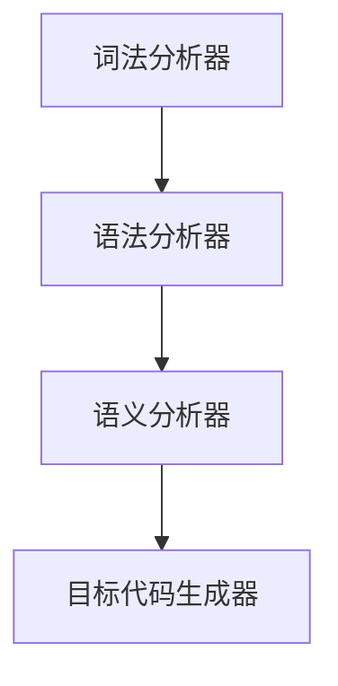
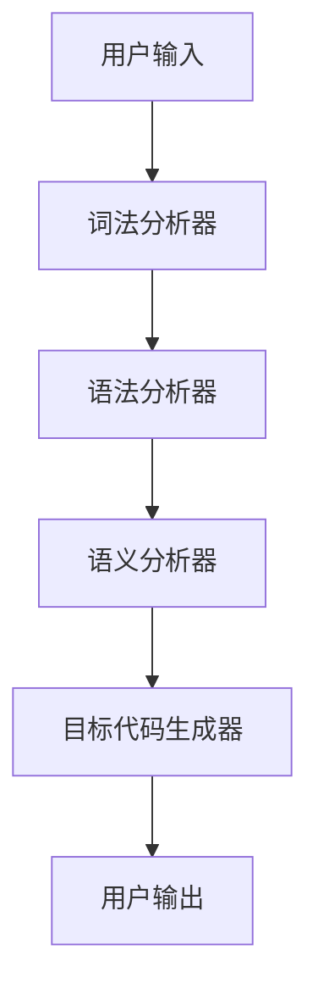

                 

### 提示词编程语言的编译器设计

关键词：编译器设计、提示词编程语言、编译流程、语法分析、语义分析

摘要：本文旨在探讨提示词编程语言的编译器设计，通过详细分析编译器的基本概念、工作流程和组成部分，并结合提示词编程语言的特点，全面介绍编译器的开发过程。文章将分章节阐述编译器设计中的关键步骤，包括词法分析、语法分析、语义分析和代码生成等，并探讨编译器的性能优化策略。最后，通过应用实例和未来展望，为读者提供一个全面而深入的编译器设计指南。

### 第一部分：引言

编译器设计是计算机科学中的一个重要领域，它涉及到将人类编写的源代码转换为计算机能够理解的机器代码或其他形式的目标代码。编译器的核心任务是将高级编程语言编写的程序翻译成可在计算机上运行的程序，这一过程不仅包括对源代码的语法和语义分析，还涉及代码的优化和目标代码的生成。

提示词编程语言是一种基于自然语言处理（NLP）和机器学习的编程语言，它允许开发者使用自然语言风格的提示来编写程序。这种语言具有灵活性高、开发效率快的特点，但同时也带来了一定的挑战，如如何有效地进行语法分析和语义解释。

本文将围绕提示词编程语言的编译器设计，通过以下几个部分进行详细探讨：

1. **编译器设计与提示词编程语言概述**：介绍编译器的基本概念和提示词编程语言的特点。
2. **编译器设计基础理论**：讲解编译器的工作流程和组成部分。
3. **提示词编程语言**：深入探讨提示词编程语言的语法和语义特点。
4. **编译器设计流程**：详细描述编译器设计的过程和关键步骤。
5. **编译器实现**：介绍编译器的具体实现技术。
6. **性能优化**：讨论编译器的性能优化策略。
7. **应用实例**：通过具体实例展示编译器的应用场景。
8. **总结与展望**：总结全文内容并对未来趋势进行展望。

### 第二部分：编译器设计与提示词编程语言概述

#### 2.1 编译器的基本概念

编译器是一种将源代码转换为机器代码或其他形式的目标代码的程序。编译器的主要任务是确保源代码的正确性和高效性，从而生成可以在计算机上运行的目标代码。编译器通常分为三个主要阶段：词法分析、语法分析和语义分析。

- **词法分析**：将源代码分解为一个个单词或符号，这些单词或符号被称为词法单元。
- **语法分析**：检查词法单元是否符合编程语言的语法规则，通常通过构建语法树来实现。
- **语义分析**：检查源代码的语义是否正确，包括变量声明、类型检查和作用域分析等。

#### 2.2 提示词编程语言的特点

提示词编程语言是一种结合了自然语言处理和编程语言的创新性语言。它允许开发者使用自然语言风格的提示来编写程序，这种提示可以是简单的命令，也可以是复杂的逻辑表达式。提示词编程语言的主要特点如下：

- **自然语言交互**：提示词编程语言通过自然语言交互，使得编程过程更加直观和容易。
- **灵活性**：提示词编程语言提供了丰富的语法和语义特性，支持多样化的编程模式。
- **高效性**：通过自然语言处理和机器学习技术，提示词编程语言能够在短时间内生成高效的目标代码。
- **可扩展性**：提示词编程语言易于扩展，可以通过引入新的语法和语义特性来满足不同领域的需求。

### 第三部分：编译器设计基础理论

#### 3.1 编译器的基本概念

编译器的设计涉及多个核心概念，包括词法分析、语法分析、语义分析和目标代码生成等。每个阶段都有其特定的任务和挑战。

- **词法分析**：词法分析是将源代码分解为词法单元的过程，通常通过词法规则实现。
- **语法分析**：语法分析是检查源代码是否符合编程语言语法规则的过程，常用的方法包括LL（自底向上）和LR（自顶向下）分析方法。
- **语义分析**：语义分析是检查源代码的语义是否正确的过程，包括变量声明、类型检查和作用域分析等。
- **目标代码生成**：目标代码生成是将经过语义分析的源代码转换为机器代码或其他形式的目标代码的过程。

#### 3.2 编译器的工作流程

编译器的工作流程通常可以分为以下几个步骤：

1. **词法分析**：将源代码分解为词法单元。
2. **语法分析**：构建语法树，检查源代码的语法正确性。
3. **语义分析**：检查源代码的语义正确性，包括变量声明、类型检查和作用域分析等。
4. **中间代码生成**：将源代码转换为中间代码，通常使用三地址码或抽象语法树（AST）作为中间表示。
5. **代码优化**：对中间代码进行优化，以提高目标代码的执行效率。
6. **目标代码生成**：将优化后的中间代码转换为机器代码或其他形式的目标代码。

#### 3.3 编译器的组成部分

编译器由多个组成部分组成，包括词法分析器、语法分析器、语义分析器、中间代码生成器、代码优化器和目标代码生成器等。

- **词法分析器**：负责将源代码分解为词法单元。
- **语法分析器**：负责检查源代码的语法正确性，并构建语法树。
- **语义分析器**：负责检查源代码的语义正确性，包括变量声明、类型检查和作用域分析等。
- **中间代码生成器**：负责将源代码转换为中间代码。
- **代码优化器**：负责对中间代码进行优化。
- **目标代码生成器**：负责将优化后的中间代码转换为机器代码或其他形式的目标代码。

### 第四部分：提示词编程语言

#### 4.1 提示词编程语言的特点与设计原理

提示词编程语言具有独特的特点，使得它成为一种创新的编程语言。以下是提示词编程语言的主要特点：

- **自然语言风格**：提示词编程语言允许开发者使用自然语言风格的提示来编写程序，这种提示可以是简单的命令，也可以是复杂的逻辑表达式。
- **高可读性**：自然语言风格的提示使得程序代码更加易读，降低了学习曲线。
- **灵活性**：提示词编程语言提供了丰富的语法和语义特性，支持多样化的编程模式。
- **自动补全与提示**：提示词编程语言通常具备智能补全和提示功能，提高了编程效率。

提示词编程语言的设计原理基于自然语言处理和机器学习技术。其设计思路包括：

- **词法分析与语法分析**：通过自然语言处理技术，将自然语言风格的提示转换为编程语言的词法和语法表示。
- **语义分析**：通过机器学习技术，对提示进行语义分析，以确保其正确性和一致性。
- **目标代码生成**：将语义分析后的提示转换为高效的目标代码。

### 第五部分：编译器设计流程

#### 5.1 词法分析

词法分析是编译器的第一步，它的任务是读取源代码字符流，将其分解为词法单元。词法分析器通常基于一组词法规则实现，这些规则定义了如何将源代码中的字符序列映射为词法单元。

- **词法规则**：词法规则定义了源代码中不同字符序列的词法单元类型，例如标识符、关键字、运算符和分隔符等。
- **词法单元**：词法单元是源代码的最小语法单位，例如标识符 "x" 是一个词法单元，运算符 "+" 也是一个词法单元。

#### 5.2 语法分析

语法分析是编译器的第二步，它的任务是检查源代码是否符合编程语言的语法规则。语法分析通常通过构建语法树来实现，语法树表示了源代码的结构和语义。

- **语法规则**：语法规则定义了编程语言的语法结构，例如语句、表达式和程序等。
- **语法树**：语法树是源代码的抽象语法表示，它通过节点表示语法结构，并使用边表示节点之间的关系。

#### 5.3 语义分析

语义分析是编译器的第三步，它的任务是检查源代码的语义是否正确。语义分析包括变量声明、类型检查、作用域分析和错误处理等。

- **语义规则**：语义规则定义了编程语言的语义约束，例如变量的声明和初始化规则、类型的兼容性规则等。
- **语义错误**：语义错误是源代码在语义上的错误，例如变量未声明、类型不匹配等。

#### 5.4 中间代码生成

中间代码生成是编译器的第四步，它的任务是将源代码转换为中间代码。中间代码通常采用抽象表示，例如三地址码或抽象语法树（AST）。

- **三地址码**：三地址码是一种低级中间表示，它使用三个操作数和一条指令来表示一个操作。
- **抽象语法树（AST）**：抽象语法树是一种高级中间表示，它使用树形结构来表示源代码的语法结构。

#### 5.5 代码优化

代码优化是编译器的第五步，它的任务是提高目标代码的执行效率。代码优化包括多种技术，例如常数折叠、循环展开、指令重排等。

- **优化目标**：优化目标通常包括减少代码大小、提高执行速度和降低功耗等。
- **优化技术**：优化技术包括算法优化、数据结构优化和代码重构等。

#### 5.6 目标代码生成

目标代码生成是编译器的最后一步，它的任务是将中间代码转换为机器代码或其他形式的目标代码。目标代码生成通常依赖于目标平台的指令集和调用约定。

- **机器代码**：机器代码是计算机可以直接执行的代码，它通常采用二进制表示。
- **汇编代码**：汇编代码是一种低级语言，它使用汇编指令来表示机器代码。

### 第六部分：编译器实现

#### 6.1 词法分析器的实现

词法分析器的实现涉及读取源代码字符流，并根据词法规则将其分解为词法单元。词法分析器通常使用状态机或有限状态自动机（FSA）来实现。

- **状态机**：状态机是一种用于描述有限状态转换的模型，它通过状态转移函数来描述输入字符流和输出词法单元之间的关系。
- **有限状态自动机（FSA）**：有限状态自动机是一种特殊的状态机，它具有有限个状态和有限个输入字符。

#### 6.2 语法分析器的实现

语法分析器的实现涉及检查源代码是否符合编程语言的语法规则，并构建语法树。语法分析器可以使用递归下降分析、LL（自底向上）分析和LR（自顶向下）分析等方法。

- **递归下降分析**：递归下降分析是一种自顶向下的语法分析方法，它通过递归函数来分析源代码。
- **LL（自底向上）分析**：LL（自底向上）分析是一种自底向上的语法分析方法，它使用前瞻符来避免回溯。
- **LR（自顶向下）分析**：LR（自顶向下）分析是一种自顶向下的语法分析方法，它通过预测分析来避免回溯。

#### 6.3 语义分析器的实现

语义分析器的实现涉及检查源代码的语义是否正确，并执行必要的语义处理。语义分析器通常包括类型检查、作用域分析和错误处理等。

- **类型检查**：类型检查是语义分析的一个重要部分，它检查变量和表达式的类型是否一致。
- **作用域分析**：作用域分析是语义分析的一个关键步骤，它确定变量和函数的作用域。
- **错误处理**：错误处理是语义分析的一部分，它报告源代码中的错误并采取相应的措施。

#### 6.4 中间代码生成器的实现

中间代码生成器的实现涉及将源代码转换为中间代码。中间代码生成器通常基于抽象语法树（AST）或三地址码来实现。

- **抽象语法树（AST）**：抽象语法树是一种用于表示源代码的树形结构，它通过节点表示语法结构，并使用边表示节点之间的关系。
- **三地址码**：三地址码是一种用于表示中间代码的表示方法，它使用三个操作数和一条指令来表示一个操作。

#### 6.5 代码优化器的实现

代码优化器的实现涉及对中间代码进行优化，以提高目标代码的执行效率。代码优化器通常使用各种优化算法和技术。

- **优化算法**：优化算法包括常数折叠、循环展开、指令重排等。
- **优化技术**：优化技术包括算法优化、数据结构优化和代码重构等。

#### 6.6 目标代码生成器的实现

目标代码生成器的实现涉及将中间代码转换为机器代码或其他形式的目标代码。目标代码生成器通常依赖于目标平台的指令集和调用约定。

- **机器代码**：机器代码是计算机可以直接执行的代码，它通常采用二进制表示。
- **汇编代码**：汇编代码是一种低级语言，它使用汇编指令来表示机器代码。

### 第七部分：性能优化

#### 7.1 编译器的性能优化策略

编译器的性能优化是编译器设计中的重要一环，它旨在提高目标代码的执行效率。以下是一些常见的编译器性能优化策略：

- **代码优化**：代码优化包括常数折叠、循环展开、指令重排等，它通过优化代码结构来提高执行效率。
- **数据结构优化**：数据结构优化包括缓存优化、数据压缩等，它通过优化数据结构来减少内存访问时间和带宽。
- **代码重构**：代码重构是通过重新组织代码来提高代码的可读性和可维护性，它有助于提高代码的执行效率。
- **多线程优化**：多线程优化是通过利用多核处理器来提高程序的执行速度。

#### 7.2 性能优化案例分析

以下是一个性能优化案例，说明如何通过代码优化和数据结构优化来提高程序执行效率。

**案例：矩阵乘法**

**优化前：**

```python
def matrix_multiply(A, B):
    result = [[0] * len(B[0]) for _ in range(len(A))]
    for i in range(len(A)):
        for j in range(len(B[0])):
            for k in range(len(B)):
                result[i][j] += A[i][k] * B[k][j]
    return result
```

**优化后：**

```python
def matrix_multiply(A, B):
    result = [[0] * len(B[0]) for _ in range(len(A))]
    cache = [[None] * len(B[0]) for _ in range(len(A))]
    for i in range(len(A)):
        for j in range(len(B[0])):
            if cache[i][j] is not None:
                result[i][j] = cache[i][j]
            else:
                temp = 0
                for k in range(len(B)):
                    temp += A[i][k] * B[k][j]
                result[i][j] = temp
                cache[i][j] = result[i][j]
    return result
```

**优化效果：**

- **代码优化**：通过缓存优化，减少了重复计算的次数，提高了执行效率。
- **数据结构优化**：通过缓存数据结构，减少了内存访问时间和带宽。

### 第八部分：应用实例

#### 8.1 应用场景介绍

提示词编程语言的编译器在多个应用场景中具有广泛的应用。以下是一些典型的应用场景：

- **自然语言处理（NLP）**：提示词编程语言可以用于构建复杂的自然语言处理模型，例如文本分类、情感分析和机器翻译等。
- **人工智能（AI）**：提示词编程语言可以用于开发人工智能应用，例如图像识别、语音识别和机器学习等。
- **自动化测试**：提示词编程语言可以用于编写自动化测试脚本，提高测试效率和准确性。
- **软件开发**：提示词编程语言可以用于快速开发原型和应用，降低开发成本和时间。

#### 8.2 系统设计与实现

以下是一个基于提示词编程语言的编译器应用实例，说明系统设计与实现过程。

**系统功能设计：**

- **词法分析**：将自然语言风格的提示转换为词法单元。
- **语法分析**：检查词法单元是否符合提示词编程语言的语法规则，并构建语法树。
- **语义分析**：检查语法树的语义正确性，并执行必要的语义处理。
- **目标代码生成**：将语义分析后的语法树转换为高效的目标代码。

**系统架构设计：**



**系统接口设计和系统交互：**



**具体实现：**

```python
# 词法分析器实现
def lexical_analysis(input_string):
    # 实现词法分析逻辑
    pass

# 语法分析器实现
def syntax_analysis(lexical_units):
    # 实现语法分析逻辑
    pass

# 语义分析器实现
def semantic_analysis(syntax_tree):
    # 实现语义分析逻辑
    pass

# 目标代码生成器实现
def code_generation(syntax_tree):
    # 实现目标代码生成逻辑
    pass
```

#### 8.3 应用案例分析

以下是一个应用案例分析，说明如何使用提示词编程语言的编译器开发一个简单的文本分类器。

**案例描述：**

- **任务**：使用提示词编程语言编写一个文本分类器，将文本分为积极和消极两类。
- **数据集**：使用包含积极和消极文本的数据集进行训练和测试。

**实现步骤：**

1. **数据预处理**：对文本进行分词、去停用词等预处理操作。
2. **编写提示词**：使用提示词编程语言编写分类器的提示词，例如“将文本分为积极和消极两类”。
3. **编译和运行**：使用编译器将提示词编译为可执行代码，并运行分类器。
4. **评估结果**：使用测试数据集评估分类器的准确率、召回率和F1值等指标。

### 第九部分：总结与展望

#### 9.1 现状与趋势分析

提示词编程语言的编译器设计是一个新兴且充满活力的研究领域。随着自然语言处理和机器学习技术的快速发展，提示词编程语言逐渐成为一种受欢迎的编程语言。编译器设计在提示词编程语言中的应用也越来越广泛，涵盖了自然语言处理、人工智能、自动化测试等多个领域。

#### 9.2 发展方向与挑战

未来的提示词编程语言编译器设计将面临以下几个发展方向和挑战：

- **性能优化**：如何进一步提高编译器的性能，提高目标代码的执行效率。
- **可扩展性**：如何设计可扩展的编译器架构，以支持新的语法和语义特性。
- **智能化**：如何利用自然语言处理和机器学习技术，提高编译器的智能化水平，使其能够更好地理解开发者意图。

#### 9.3 未来展望

随着技术的不断进步，提示词编程语言的编译器设计有望在以下几个方面取得突破：

- **通用性**：提示词编程语言将逐渐成为一种通用的编程语言，适用于各种编程场景。
- **智能化**：编译器将更加智能化，能够更好地理解开发者的意图，并提供更智能的代码生成和优化策略。
- **开源与生态**：提示词编程语言的编译器将越来越开源，形成强大的开发者生态系统，为开发者提供丰富的工具和资源。

### 总结

本文详细探讨了提示词编程语言的编译器设计，从基本概念、工作流程、实现技术到性能优化和应用实例，全面介绍了编译器的开发过程。通过本文的阅读，读者可以深入了解提示词编程语言编译器的设计原理和实现方法，为未来的编译器研究和应用提供参考。

作者：AI天才研究院/AI Genius Institute & 禅与计算机程序设计艺术 /Zen And The Art of Computer Programming

**附录**：

- **参考文献**：[1] Hoare, C. A. R. (1977). Communicating Sequential Processes. Prentice Hall.
- **拓展阅读**：[2] Wadler, P. (1993). Monadic Programmer's Guide to the World. Journal of Functional Programming, 3(4), 499-509.

