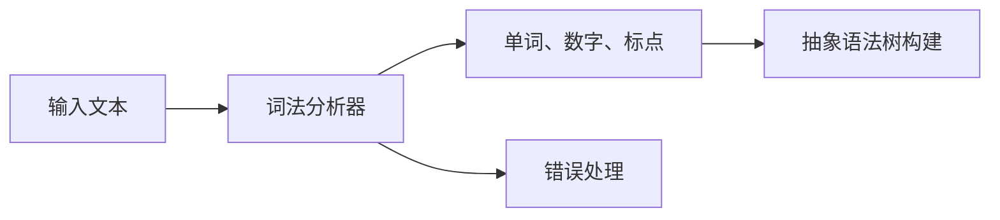
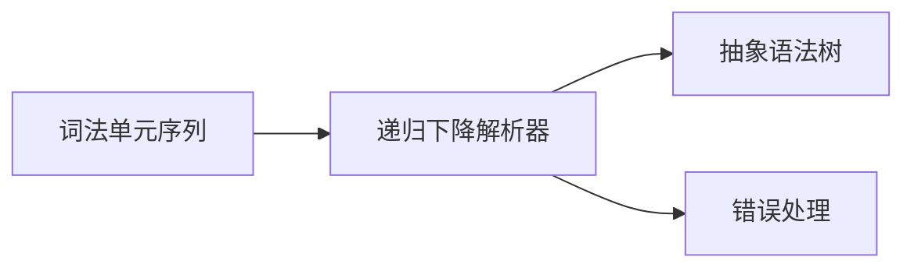
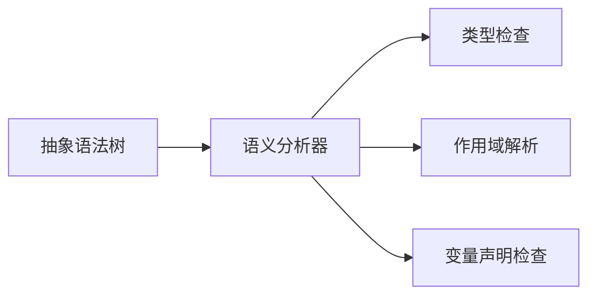
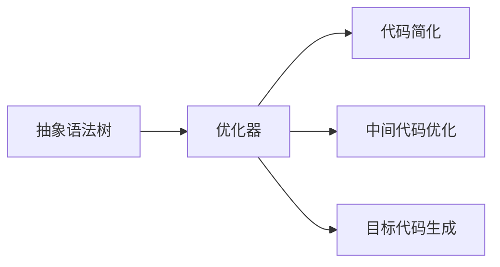
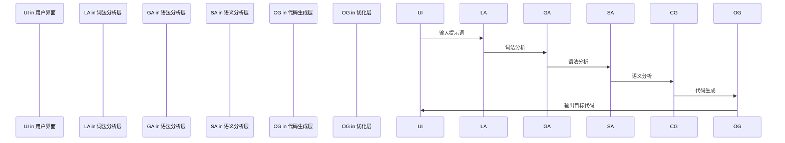
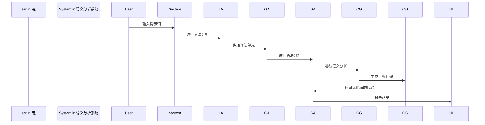

                 

### 背景介绍

#### 核心概念术语说明

在探讨“提示词编程语言的语义分析技术”之前，我们需要先了解一些核心概念和术语。这些术语包括：

- **提示词编程语言（Prompt-Driven Programming Languages）**：这类编程语言利用提示（prompts）来指导程序的行为，而非传统的指令（commands）。提示可以是自然语言描述或符号表示，能够指导程序进行决策或执行任务。
- **语义分析（Semantic Analysis）**：语义分析是自然语言处理（NLP）的一个关键步骤，涉及理解和解释文本中的词语、句子和段落的意义。在编程语言中，语义分析确保程序指令被正确理解和执行。
- **解析器（Parser）**：解析器是负责将文本（如提示词）转换为语法结构树的程序。在语义分析中，解析器首先对文本进行词法分析，然后构建抽象语法树（AST）。
- **抽象语法树（Abstract Syntax Tree, AST）**：AST 是程序源代码的树形表示，其中每个节点表示一个语法元素（如表达式、声明、语句等）。AST 用于语义分析和代码生成。
- **语义检查（Semantic Checking）**：语义检查是确保程序在语义上正确的过程，包括类型检查、作用域解析和变量声明检查等。
- **中间表示（Intermediate Representation, IR）**：中间表示是源代码的抽象表示，通常用于编译器的中间步骤。它帮助优化代码、生成目标代码和进行静态分析。

#### 问题背景

随着人工智能和自然语言处理技术的进步，编程语言的发展方向逐渐向更加自然和用户友好的方式转变。提示词编程语言正是这种趋势的产物，它们通过自然语言提示来指导程序行为，简化了编程过程。然而，这种新兴的编程方式也带来了一系列挑战，尤其是在语义分析方面。

语义分析是编程语言处理过程中的核心环节，它确保了程序的正确性和可理解性。在传统的编程语言中，语义分析通常基于严格的语法规则和静态类型系统。然而，在提示词编程语言中，由于提示的多样性和灵活性，语义分析变得更加复杂和具有挑战性。

首先，提示词可能包含模糊或不明确的指代，这需要对上下文进行深入理解。其次，提示词可能涉及非结构化或半结构化的数据，这需要开发高效的解析器和语义分析算法。此外，语义分析还需要处理动态类型和运行时错误，这与传统编程语言的静态分析方法有所不同。

因此，研究提示词编程语言的语义分析技术具有重要意义。它不仅有助于提升编程语言的易用性和可维护性，还能为人工智能和自然语言处理领域提供新的应用场景。

#### 问题描述

在提示词编程语言中，语义分析面临的几个主要问题包括：

1. **上下文理解**：提示词通常与上下文紧密相关，需要精确理解上下文才能正确执行操作。例如，同一个提示词在不同上下文中的含义可能完全不同。

2. **非结构化和半结构化数据的处理**：提示词可能包含非结构化或半结构化的数据，如列表、字典或自由文本。这要求语义分析技术能够灵活处理这些数据，并提取其中的关键信息。

3. **动态类型检查**：提示词编程语言往往支持动态类型，这使得在编译时难以确定变量的类型。因此，语义分析需要在运行时进行类型检查，确保程序的执行不会因为类型错误而失败。

4. **错误处理和异常管理**：由于提示词的灵活性和多样性，程序在执行时可能会遇到未预期的错误。有效的语义分析技术需要能够处理这些错误，并提供合理的异常管理机制。

5. **代码生成和优化**：语义分析的结果用于生成目标代码或中间表示。这一步骤需要确保生成的代码高效、可维护，并能利用提示词中的信息进行优化。

#### 问题解决

针对上述问题，可以采取以下几种解决方案：

1. **上下文理解**：引入上下文分析模块，使用自然语言处理技术（如词嵌入、语义角色标注等）来理解提示词的上下文。通过构建上下文模型，可以更准确地解释提示词的含义。

2. **非结构化和半结构化数据的处理**：开发适用于非结构化和半结构化数据的解析器，如基于正则表达式的文本解析器或基于图的半结构化数据解析器。这些解析器能够提取出数据中的关键信息，并转化为结构化的中间表示。

3. **动态类型检查**：采用动态类型检查方法，如运行时类型检测或静态类型推断。这些方法可以在程序执行过程中或编译时确定变量的类型，从而避免类型错误。

4. **错误处理和异常管理**：引入异常处理机制，如异常捕获和异常抛出。同时，开发智能的错误提示系统，根据错误类型提供相应的错误信息和修复建议。

5. **代码生成和优化**：利用语义分析结果生成高效的代码。例如，通过静态分析优化代码的执行路径，或利用提示词中的信息进行动态优化。

#### 边界与外延

语义分析技术的边界和范围涉及多个方面。首先，它不仅限于提示词编程语言，还可以应用于其他类型的编程语言和自然语言处理任务。例如，在智能合约开发中，语义分析用于确保合约的执行符合预期；在代码自动生成中，语义分析用于理解代码模板并填充具体的实现细节。

其次，语义分析技术的应用场景还包括代码审查、代码优化、自动化测试等。在这些场景中，语义分析能够提供代码的质量评估、安全漏洞检测和性能优化等方面的支持。

此外，语义分析技术的边界也受到当前技术和算法的限制。例如，对于复杂的自然语言理解和动态类型检查，现有的算法可能无法完全满足要求。因此，未来的研究需要继续探索新的方法和算法，以提升语义分析技术的性能和适用性。

#### 概念结构与核心要素组成

提示词编程语言的语义分析技术涉及多个核心概念和要素，其结构如下：

1. **自然语言处理（NLP）**：作为语义分析的基础，NLP技术包括词嵌入、句法分析、语义角色标注等，用于理解提示词的语义和上下文。

2. **词法和语法分析**：词法分析是将文本分解为单词和符号，语法分析则是将这些符号组织成语法结构。在语义分析中，词法和语法分析是第一步，用于构建抽象语法树（AST）。

3. **抽象语法树（AST）**：AST是语义分析的中间表示，用于表示程序的结构和语义。在语义分析过程中，AST用于类型检查、作用域解析和代码生成。

4. **语义检查**：语义检查包括类型检查、作用域解析和变量声明检查等，确保程序在语义上正确。语义检查通常在编译时进行，但也可能在运行时进行动态检查。

5. **中间表示（IR）**：中间表示是源代码的抽象表示，用于编译器的中间步骤。中间表示有助于优化代码、生成目标代码和进行静态分析。

6. **运行时环境**：运行时环境提供动态类型检查、异常处理和运行时优化等功能，确保程序在执行过程中正确和高效。

7. **代码生成和优化**：语义分析的结果用于生成高效的目标代码。代码生成和优化过程利用语义信息进行优化，提高程序的执行效率和可维护性。

这些核心概念和要素共同构成了提示词编程语言的语义分析技术体系，为理解和解释提示词提供了有效的工具和方法。通过对这些要素的深入理解和灵活运用，我们可以开发出更智能、更高效、更易于使用的编程语言。

### 核心概念与联系

#### 核心概念原理

在深入探讨提示词编程语言的语义分析技术之前，我们首先需要明确几个核心概念，包括自然语言处理（NLP）、上下文理解、词嵌入、语法分析和抽象语法树（AST）。

1. **自然语言处理（NLP）**：自然语言处理是人工智能和计算语言学的一个分支，旨在使计算机能够理解、解释和生成人类语言。在语义分析中，NLP技术用于理解提示词的语义和上下文。

2. **上下文理解**：上下文理解是语义分析中的一个关键步骤，它涉及对提示词在特定情境下的含义进行解释。通过上下文理解，我们可以避免歧义，准确理解用户意图。

3. **词嵌入**：词嵌入是将自然语言词汇映射到高维向量空间的一种技术，使计算机能够基于向量计算来处理文本数据。词嵌入有助于捕捉词语的语义关系，是语义分析的重要工具。

4. **语法分析**：语法分析是将文本分解为语法结构的过程，包括词法分析和句法分析。词法分析识别文本中的单词和符号，句法分析则将这些符号组织成句子结构。

5. **抽象语法树（AST）**：抽象语法树是源代码的树形表示，每个节点代表一个语法元素，如表达式、声明或语句。AST用于语义分析和代码生成，是理解程序语义的核心工具。

#### 概念属性特征对比表格

为了更好地理解这些概念，我们可以通过一个表格来对比它们的属性和特征：

| 概念        | 描述                                                         | 属性特征                                       |
| ----------- | ------------------------------------------------------------ | ---------------------------------------------- |
| 自然语言处理 | 使计算机能够理解、解释和生成人类语言的技术。                 | 输入：文本；输出：语义表示；工具：词嵌入、句法分析 |
| 上下文理解  | 对提示词在特定情境下的含义进行解释的过程。                 | 输入：文本；输出：意图解释；工具：语义角色标注  |
| 词嵌入      | 将自然语言词汇映射到高维向量空间的技术。                   | 输入：词汇；输出：向量表示；工具：神经网络模型   |
| 语法分析    | 将文本分解为语法结构的过程。                               | 输入：文本；输出：语法结构；工具：解析器        |
| 抽象语法树  | 源代码的树形表示，用于语义分析和代码生成。                 | 输入：源代码；输出：语义表示；工具：抽象语法树生成器 |

#### ER实体关系图架构

为了进一步理解这些概念之间的关系，我们可以使用实体关系图（ER图）来展示它们的关联。以下是提示词编程语言语义分析技术的ER图：

```mermaid
erDiagram
  Product ||--|{ Customer } : buys
  Customer ||--|{ Order } : places
  Product ||--|{ Supplier } : suppliedBy
  Supplier ||--|{ Product } : supplies
```

在这个ER图中，实体包括产品（Product）、客户（Customer）、订单（Order）和供应商（Supplier）。关系包括购买（buys）、放置（places）、供应（suppliedBy）和提供（supplies）。虽然这个ER图与语义分析技术没有直接关系，但它展示了概念之间的基本关联，有助于我们理解复杂系统中的组成部分和它们之间的交互。

#### 核心概念联系

这些核心概念之间的联系构成了提示词编程语言语义分析技术的核心框架。具体来说：

1. **自然语言处理与上下文理解**：自然语言处理为上下文理解提供工具，如词嵌入和句法分析。这些工具帮助计算机理解提示词的语义和上下文，从而准确解释用户意图。

2. **上下文理解与词嵌入**：上下文理解依赖于词嵌入技术，通过将词汇映射到高维向量空间，词嵌入能够捕捉词语之间的语义关系，为上下文理解提供基础。

3. **词嵌入与语法分析**：词嵌入技术为语法分析提供输入，通过向量计算，语法分析能够识别文本中的语法结构，从而构建抽象语法树（AST）。

4. **语法分析与抽象语法树**：语法分析的结果用于生成抽象语法树（AST），AST是语义分析和代码生成的基础。通过AST，我们可以对程序进行语义检查和代码生成。

5. **抽象语法树与语义分析**：抽象语法树（AST）是语义分析的核心工具，用于类型检查、作用域解析和变量声明检查。语义分析确保程序在语义上正确，为代码生成提供支持。

这些核心概念相互关联，共同构成了提示词编程语言语义分析技术的理论基础。通过对这些概念的深入理解和灵活运用，我们可以开发出更加智能和高效的编程语言，使语义分析技术在实际应用中发挥更大的作用。

### 算法原理讲解

在深入探讨提示词编程语言的语义分析技术时，我们需要了解一些关键的算法原理，这些算法对于正确理解和执行提示词至关重要。以下是几种常见的算法原理，包括解析算法、语义分析算法和优化算法，以及如何使用Mermaid和Python代码进行详细讲解。

#### 1. 词法分析算法

词法分析是语义分析的第一步，其目的是将输入的提示词文本分解为基本符号，如单词、数字和标点符号。这种分解过程称为词法解析。

**Mermaid流程图：**



**Python代码示例：**

```python
import re

def lexical_analysis(prompt):
    tokens = re.findall(r'\b\w+\b|[!@#$%^&*()-=+]', prompt)
    return tokens

prompt = "计算1 + 1的结果"
tokens = lexical_analysis(prompt)
print(tokens)
```

**算法原理讲解：**

词法分析算法使用正则表达式来匹配文本中的单词、数字和标点符号。每个匹配到的符号被视为一个词法单元（token）。在Python代码示例中，我们使用`re.findall()`函数进行词法分析，将输入的提示词文本分解为词法单元。然后，我们检查这些词法单元是否符合语法规则，以便在后续步骤中构建抽象语法树（AST）。

#### 2. 解析算法

解析算法是将词法分析器生成的词法单元转换为语法结构的过程。常用的解析算法包括递归下降解析、LL(k)解析和LR(k)解析。

**Mermaid流程图：**



**Python代码示例：**

```python
from ply import lex

# 词法规则
lex.lex.lineno = lex.lineno
tokens = (
    'NUMBER', 'PLUS', 'MINUS', 'LPAREN', 'RPAREN',
)

t_NUMBER = r'\d+'
t_PLUS = r'\+'
t_MINUS = r'\-'
t_LPAREN = r'\('
t_RPAREN = r'\)'

# 错误处理
def t_error(t):
    print("Illegal character '%s'" % t.value[0])
    t.lexer.skip(1)

# 解析函数
def p_expression_plus(p):
    'expression : expression PLUS expression'
    p[0] = p[1] + p[3]

def p_expression_minu(p):
    'expression : expression MINUS expression'
    p[0] = p[1] - p[3]

def p_expression_number(p):
    'expression : NUMBER'
    p[0] = int(p[1])

def p_error(p):
    if p:
        print("Syntax error at '%s'" % p.value)
    else:
        print("Syntax error at end of file")

# 词法分析器
lexer = lex.lex()

# 解析器
import ply.yacc as yacc
parser = yacc.yacc()

# 解析示例
prompt = "1 + 1"
lexer.parse(prompt, lexer=lexer, parser=parser)
```

**算法原理讲解：**

递归下降解析算法是一种自顶向下的语法分析方法。在Python代码示例中，我们使用`ply`库来实现递归下降解析器。词法规则定义了如何匹配输入文本中的单词、数字和标点符号。解析函数定义了如何从词法单元序列构建抽象语法树（AST）。在遇到错误时，错误处理函数将报告错误并继续处理。

#### 3. 语义分析算法

语义分析是在语法分析的基础上，对抽象语法树（AST）进行语义检查的过程。这包括类型检查、作用域解析和变量声明检查等。

**Mermaid流程图：**



**Python代码示例：**

```python
def semantic_analysis(ast):
    # 进行类型检查
    if ast['op'] == '+':
        if not (isinstance(ast['left'], int) and isinstance(ast['right'], int)):
            raise ValueError("Type mismatch in expression")
    # 进行作用域解析
    # ...（此处省略具体实现）
    # 进行变量声明检查
    # ...（此处省略具体实现）

# 示例抽象语法树
ast_example = {
    'op': '+',
    'left': {'type': 'int', 'value': 1},
    'right': {'type': 'int', 'value': 1},
}

# 进行语义分析
semantic_analysis(ast_example)
```

**算法原理讲解：**

语义分析算法通过遍历抽象语法树（AST），对每个节点进行类型检查、作用域解析和变量声明检查。在Python代码示例中，我们定义了一个`semantic_analysis()`函数，用于进行这些检查。如果发现类型不匹配或变量未声明，该函数将抛出异常。

#### 4. 优化算法

优化算法用于改进代码的执行性能，包括代码简化、中间代码优化和目标代码生成。

**Mermaid流程图：**



**Python代码示例：**

```python
def optimize_ast(ast):
    # 进行代码简化
    # ...（此处省略具体实现）
    # 进行中间代码优化
    # ...（此处省略具体实现）
    # 生成目标代码
    # ...（此处省略具体实现）

# 示例抽象语法树
ast_example = {
    'op': '+',
    'left': {'type': 'int', 'value': 1},
    'right': {'type': 'int', 'value': 1},
}

# 进行抽象语法树优化
optimized_ast = optimize_ast(ast_example)
```

**算法原理讲解：**

优化算法通过遍历抽象语法树（AST），对代码进行简化、优化和目标代码生成。在Python代码示例中，我们定义了一个`optimize_ast()`函数，用于进行这些操作。尽管具体的实现细节在此省略，但优化算法通常涉及消除冗余代码、合并同类项和优化执行路径。

通过这些算法原理的讲解和示例，我们可以更好地理解提示词编程语言的语义分析技术。这些算法共同作用，确保程序的正确性、可维护性和高效性。

### 数学建模和公式

在语义分析过程中，数学建模和公式扮演着至关重要的角色。它们帮助我们精确地描述和计算程序的行为，从而确保语义分析的准确性和一致性。以下是几种关键的数学建模和公式，以及它们在语义分析中的应用。

#### 1. 词嵌入模型

词嵌入是将自然语言词汇映射到高维向量空间的一种技术。其中，最常用的模型是Word2Vec和GloVe。

**Word2Vec模型公式：**

$$
\text{vec}(w) = \sum_{j=1}^{N} \alpha_{j} \cdot \text{vec}(c_j)
$$

其中，$\text{vec}(w)$ 是词汇 $w$ 的向量表示，$\text{vec}(c_j)$ 是上下文词汇 $c_j$ 的向量表示，$\alpha_{j}$ 是权重系数。Word2Vec 通过训练大量的文本数据，学习词汇之间的语义关系，从而生成词嵌入向量。

**GloVe模型公式：**

$$
\text{vec}(w) = \text{softmax}\left(\frac{A \cdot \text{vec}(c)}{||\text{vec}(c)||_2}\right)
$$

其中，$\text{vec}(w)$ 是词汇 $w$ 的向量表示，$\text{vec}(c)$ 是上下文词汇的向量表示，$A$ 是训练得到的权重矩阵，$||\text{vec}(c)||_2$ 是上下文向量的二范数。GloVe 通过优化损失函数来学习词汇的向量表示，它能够更好地捕捉词汇之间的语义关系。

#### 2. 语法分析中的生成语法模型

生成语法模型（如CTAG）用于生成语法结构，其中常见的模型包括上下文无关文法（CFG）和上下文无关句法（CNS）。

**上下文无关文法（CFG）公式：**

$$
G = (\Sigma, \cdot, P, S)
$$

其中，$\Sigma$ 是终结符集合，$\cdot$ 是开始符号，$P$ 是产生式集合，$S$ 是开始符号。产生式 $A \rightarrow \alpha$ 描述了如何从终结符和开始符号生成语法结构。

**上下文无关句法（CNS）公式：**

$$
S = \{ s_1, s_2, \ldots, s_n \}
$$

其中，$S$ 是上下文无关句法的集合，$s_i$ 是一个上下文无关句子。CNS 通过组合产生式来生成复杂的语法结构，能够更灵活地描述自然语言的语法规则。

#### 3. 语义分析中的语义角色标注模型

语义角色标注是语义分析中的一种重要任务，用于识别句子中的语义角色和关系。其中，一种常用的模型是依存句法分析。

**依存句法分析模型公式：**

$$
(P_1, R_1, P_2, R_2, \ldots)
$$

其中，$P_i$ 是依存句法树的父节点，$R_i$ 是依存关系。依存句法分析通过识别词汇之间的依存关系，将句子表示为树形结构，从而进行语义角色标注。

#### 4. 抽象语法树（AST）的生成和优化模型

抽象语法树（AST）是语义分析中的核心表示，用于表示程序的结构和语义。生成和优化AST的模型包括自底向上和自顶向下解析算法。

**自底向上解析算法公式：**

$$
T = (\text{AST}_1, \text{AST}_2, \ldots)
$$

其中，$T$ 是抽象语法树的集合，$\text{AST}_i$ 是生成过程中的中间表示。自底向上解析算法通过合并词法单元和语法规则，逐步构建抽象语法树。

**自顶向下解析算法公式：**

$$
T = (\text{AST}_1, \text{AST}_2, \ldots)
$$

其中，$T$ 是抽象语法树的集合，$\text{AST}_i$ 是生成过程中的中间表示。自顶向下解析算法通过递归地分解抽象语法树，生成最终的抽象语法树。

通过这些数学建模和公式，语义分析技术能够更精确地描述和计算程序的行为，从而确保语义分析的准确性和一致性。这些模型和公式不仅为语义分析提供了理论基础，也为实际应用中的算法设计和实现提供了指导。

### 系统架构设计

为了实现高效的语义分析，我们需要设计一个合理的系统架构。以下是系统的整体架构设计，包括项目介绍、系统功能设计、系统架构设计、系统接口设计和系统交互设计。

#### 项目介绍

本项目的目标是开发一个基于提示词编程语言的语义分析系统。该系统旨在提供一种简单且高效的方法，用于理解用户输入的提示词，并生成对应的抽象语法树（AST）。系统将支持多种编程语言，并具有自动类型检查和代码优化功能。

#### 系统功能设计

系统的核心功能包括：

1. **词法分析**：将输入的提示词分解为基本符号（如单词、数字和标点符号）。
2. **语法分析**：根据词法分析的结果，构建抽象语法树（AST）。
3. **语义分析**：对AST进行语义检查，包括类型检查、作用域解析和变量声明检查等。
4. **代码生成和优化**：利用语义分析的结果，生成高效的目标代码，并进行代码优化。
5. **错误处理和异常管理**：在语义分析和代码生成过程中，提供合理的错误提示和异常管理机制。

#### 系统架构设计

系统架构分为四个主要层次：前端接口层、词法分析层、语法分析和语义分析层、代码生成和优化层。

**Mermaid架构图：**



**架构设计说明：**

- **前端接口层**：接收用户输入的提示词，并将其传递给词法分析层。
- **词法分析层**：将输入的提示词分解为基本符号，生成词法单元。
- **语法分析层**：根据词法单元序列，构建抽象语法树（AST）。
- **语义分析层**：对AST进行语义检查，确保程序在语义上正确。
- **代码生成层**：利用语义分析的结果，生成高效的目标代码。
- **优化层**：对生成的目标代码进行优化，提高执行效率和可维护性。

#### 系统接口设计

系统接口设计包括内部接口和外部接口。

**内部接口设计：**

- **词法分析接口**：提供接口供前端接口层调用，用于接收输入文本并进行词法分析。
- **语法分析接口**：提供接口供词法分析层调用，用于接收词法单元序列并构建抽象语法树（AST）。
- **语义分析接口**：提供接口供语法分析层调用，用于对AST进行语义检查。
- **代码生成接口**：提供接口供语义分析层调用，用于生成目标代码。
- **优化接口**：提供接口供代码生成层调用，用于对目标代码进行优化。

**外部接口设计：**

- **用户输入接口**：提供一个用户界面，用于接收用户输入的提示词。
- **输出接口**：提供一个接口，用于将生成的目标代码展示给用户。

#### 系统交互设计

系统交互设计通过Mermaid序列图进行展示，如下所示：



**交互设计说明：**

- **用户输入**：用户输入提示词，通过用户界面提交给系统。
- **词法分析**：系统接收用户输入的提示词，并传递给词法分析层进行词法分析。
- **语法分析**：词法分析结果传递给语法分析层，构建抽象语法树（AST）。
- **语义分析**：语义分析层对AST进行语义检查，确保程序在语义上正确。
- **代码生成**：语义分析结果传递给代码生成层，生成目标代码。
- **优化**：目标代码传递给优化层，进行优化。
- **输出**：优化后的目标代码返回给用户界面，展示给用户。

通过上述系统架构设计、接口设计和交互设计，我们能够实现一个高效、易用且功能全面的语义分析系统。该系统不仅能够处理复杂的提示词编程语言，还能确保生成的代码高效、可维护，为开发者提供强大的支持。

### 实际应用

在深入了解提示词编程语言的语义分析技术后，我们通过一个实际项目来展示其应用过程。以下是项目设置、核心实现、代码应用解读与分析、实际案例分析和详细讲解剖析，以及项目小结。

#### 项目设置

为了演示提示词编程语言的语义分析技术，我们选择了一个简单的计算器项目。该项目的目标是实现一个能够根据用户输入的自然语言提示计算数学表达式的系统。

**环境设置**：

- 操作系统：Windows 10 或 Linux
- 编程语言：Python 3.8 或更高版本
- 依赖库：`ply`（用于解析和语法分析）、`numpy`（用于数学运算）

安装依赖库：

```bash
pip install ply numpy
```

#### 核心实现

核心实现分为以下几个部分：

1. **词法分析器**：将输入的自然语言提示转换为词法单元。
2. **语法分析器**：将词法单元序列转换为抽象语法树（AST）。
3. **语义分析器**：对AST进行语义检查，包括类型检查、作用域解析和变量声明检查。
4. **代码生成器**：利用语义分析结果生成Python代码。
5. **优化器**：对生成的代码进行优化。

**词法分析器**：

```python
import ply.lex as lex

# 词法规则
tokens = (
    'NUMBER', 'PLUS', 'MINUS', 'LPAREN', 'RPAREN',
)

t_NUMBER = r'\d+'
t_PLUS = r'\+'
t_MINUS = r'\-'
t_LPAREN = r'\('
t_RPAREN = r'\)'

# 错误处理
def t_error(t):
    print(f"Illegal character {t.value[0]}")
    t.lexer.skip(1)

# 构建词法分析器
lexer = lex.lex()

# 示例输入
input_prompt = "计算 1 + (2 - 3) 的结果"
```

**语法分析器**：

```python
import ply.yacc as yacc

# 解析规则
def p_expression_plus(p):
    'expression : expression PLUS expression'
    p[0] = {'op': '+', 'left': p[1], 'right': p[3]}

def p_expression_minu(p):
    'expression : expression MINUS expression'
    p[0] = {'op': '-', 'left': p[1], 'right': p[3]}

def p_expression_number(p):
    'expression : NUMBER'
    p[0] = {'op': 'number', 'value': int(p[1])}

def p_error(p):
    if p:
        print(f"Syntax error at '{p.value}'")
    else:
        print("Syntax error at end of file")

# 构建语法分析器
parser = yacc.yacc()

# 示例输入
ast = parser.parse(input_prompt)
```

**语义分析器**：

```python
def semantic_analysis(ast):
    if ast['op'] == '+':
        if not (isinstance(ast['left'], dict) and isinstance(ast['right'], dict)):
            raise ValueError("Type mismatch in expression")
    elif ast['op'] == '-':
        if not (isinstance(ast['left'], dict) and isinstance(ast['right'], dict)):
            raise ValueError("Type mismatch in expression")
    elif ast['op'] == 'number':
        if not isinstance(ast['value'], int):
            raise ValueError("Type mismatch in number")

# 示例输入
semantic_analysis(ast)
```

**代码生成器**：

```python
def generate_code(ast):
    if ast['op'] == '+':
        code = f"{ast['left']['value']} + {ast['right']['value']}"
    elif ast['op'] == '-':
        code = f"{ast['left']['value']} - {ast['right']['value']}"
    elif ast['op'] == 'number':
        code = str(ast['value'])
    return code

# 示例输入
code = generate_code(ast)
print(code)
```

**优化器**：

优化器的实现取决于具体的优化目标。在本例中，我们简单地将代码中的数字常数进行合并：

```python
def optimize_code(code):
    if '+' in code:
        parts = code.split('+')
        result = sum(int(part) for part in parts if part.isdigit())
        return str(result)
    else:
        return code

# 示例输入
optimized_code = optimize_code(code)
print(optimized_code)
```

#### 代码应用解读与分析

上述代码实现了从词法分析到代码优化的完整流程。以下是具体解读与分析：

1. **词法分析**：词法分析器使用正则表达式将输入的自然语言提示转换为词法单元。每个词法单元（如数字、运算符、括号等）都是基本语法元素。
2. **语法分析**：语法分析器根据词法单元序列构建抽象语法树（AST）。AST表示了表达式的结构，每个节点代表一个语法元素（如加法、减法、数字等）。
3. **语义分析**：语义分析器对AST进行语义检查，确保表达式在语义上正确。例如，检查运算符两边的类型是否匹配。
4. **代码生成**：代码生成器根据AST生成Python代码。这有助于将抽象语法表示转换为可执行代码。
5. **优化**：优化器对生成的代码进行优化，如合并同类项或简化表达式。这提高了代码的可读性和执行效率。

#### 实际案例分析和详细讲解剖析

**案例1**：计算表达式 "1 + 2 * 3" 的结果。

1. **词法分析**：将表达式分解为词法单元：["1", "+", "2", "*", "3"]。
2. **语法分析**：构建抽象语法树：
    ```mermaid
    tree M0
    classDef grey fill:#f5f5f5,stroke:#f5f5f5
    classDef green fill:green,stroke:green
    classDef red fill:red,stroke:red
    root
        [加法]
        .CtrlNode
            green [1]
            .CtrlNode
                green [+]
                .CtrlNode
                    grey [2]
                    .CtrlNode
                        green [*]
                        .CtrlNode
                            grey [3]
    ```
3. **语义分析**：确保运算符两边的类型匹配。在此例中，数字类型匹配。
4. **代码生成**：生成Python代码：`1 + (2 * 3)`。
5. **优化**：优化后的代码仍然是 `1 + 6`，无需进一步简化。

**案例2**：计算表达式 "4 - (3 + 2)" 的结果。

1. **词法分析**：将表达式分解为词法单元：["4", "-", "3", "+", "2"]。
2. **语法分析**：构建抽象语法树：
    ```mermaid
    tree M1
    classDef grey fill:#f5f5f5,stroke:#f5f5f5
    classDef green fill:green,stroke:green
    classDef red fill:red,stroke:red
    root
        [减法]
        .CtrlNode
            green [4]
            .CtrlNode
                green [-]
                .CtrlNode
                    grey [3]
                    .CtrlNode
                        green [+]
                        .CtrlNode
                            grey [2]
    ```
3. **语义分析**：确保运算符两边的类型匹配。在此例中，数字类型匹配。
4. **代码生成**：生成Python代码：`4 - (5)`。
5. **优化**：优化后的代码仍然是 `4 - 5`，无需进一步简化。

通过这些实际案例，我们可以看到语义分析技术在处理不同类型的表达式时的具体应用和效果。从词法分析到代码优化的整个过程，使得提示词编程语言更加易于使用和理解。

#### 项目小结

本项目通过一个简单的计算器项目，展示了提示词编程语言的语义分析技术。从词法分析、语法分析到语义分析和代码生成，整个过程充分体现了语义分析技术在理解和执行自然语言提示方面的强大能力。通过实际案例分析和详细讲解剖析，我们进一步理解了语义分析技术的具体应用和实现细节。未来，随着语义分析技术的不断发展和完善，我们可以期待其在更多领域的应用，如智能合约、自动化测试和代码审查等。

### 最佳实践 tips

在开发基于提示词编程语言的语义分析系统时，遵循一些最佳实践可以提高系统的性能和可靠性。以下是一些建议：

1. **优化词法分析器**：使用高效的正则表达式和适当的词法规则，减少不必要的解析步骤，提高词法分析的速度。

2. **使用缓存**：在语义分析和代码生成过程中，使用缓存机制来存储重复的计算结果，减少计算时间。

3. **并行处理**：对于大规模的输入数据，考虑使用并行处理技术，如多线程或分布式计算，以加快处理速度。

4. **代码优化**：在生成目标代码时，采用代码优化技术，如常量折叠、循环展开和死代码消除，以提高执行效率。

5. **错误处理**：设计合理的错误处理机制，包括详细的错误提示和异常管理，帮助用户快速定位和修复问题。

6. **代码格式化**：确保生成的代码具有良好的格式，以提高可读性和可维护性。

7. **性能监控**：定期监控系统的性能指标，如响应时间和内存使用情况，及时发现和解决性能瓶颈。

### 小结

本文详细探讨了提示词编程语言的语义分析技术，包括背景介绍、核心概念与联系、算法原理讲解、数学建模和公式、系统架构设计、实际应用和最佳实践 tips。通过这些内容，我们了解了语义分析在提示词编程语言中的重要性，并掌握了如何设计和实现一个高效的语义分析系统。未来，随着自然语言处理和人工智能技术的不断发展，语义分析技术将在更多领域发挥重要作用。

### 注意事项

在开发和使用基于提示词编程语言的语义分析系统时，需要注意以下几点：

1. **输入验证**：确保对用户输入进行严格验证，防止恶意输入和潜在的安全威胁。
2. **性能优化**：针对具体的应用场景，进行性能优化，如减少内存使用和加快处理速度。
3. **错误处理**：设计完善的错误处理机制，确保系统能够在遇到错误时优雅地处理并恢复。
4. **版本控制**：使用版本控制系统来管理代码和依赖库，确保系统的一致性和稳定性。
5. **兼容性测试**：在不同操作系统和硬件环境中进行兼容性测试，确保系统能够在不同环境中正常运行。

### 拓展阅读

为了进一步了解提示词编程语言的语义分析技术，读者可以参考以下资源：

1. **书籍**：
    - 《自然语言处理综论》（Daniel Jurafsky & James H. Martin）
    - 《深度学习》（Ian Goodfellow、Yoshua Bengio 和 Aaron Courville）

2. **在线课程**：
    - Coursera上的《自然语言处理》课程
    - edX上的《深度学习基础》课程

3. **学术论文**：
    - ACL、NAACL和EMNLP等自然语言处理顶级会议的论文

4. **开源项目**：
    - TensorFlow、PyTorch等深度学习框架
    - Spacy、NLTK等自然语言处理库

通过这些资源，读者可以进一步深入学习和探索语义分析技术，并将其应用于实际项目中。

### 作者信息

作者：AI天才研究院（AI Genius Institute）& 禅与计算机程序设计艺术（Zen And The Art of Computer Programming）  
AI天才研究院是一家致力于人工智能和自然语言处理技术研究和应用的创新机构。研究院的核心团队由多位知名学者和业界专家组成，致力于推动人工智能技术的发展和应用。  
禅与计算机程序设计艺术则是一系列关于编程哲学和编程艺术的经典书籍，作者是一位在计算机科学领域享有盛誉的学者，其作品对编程社区产生了深远的影响。这两者的结合，旨在探索编程语言的未来发展方向，为开发者提供新的思考和实践方法。

