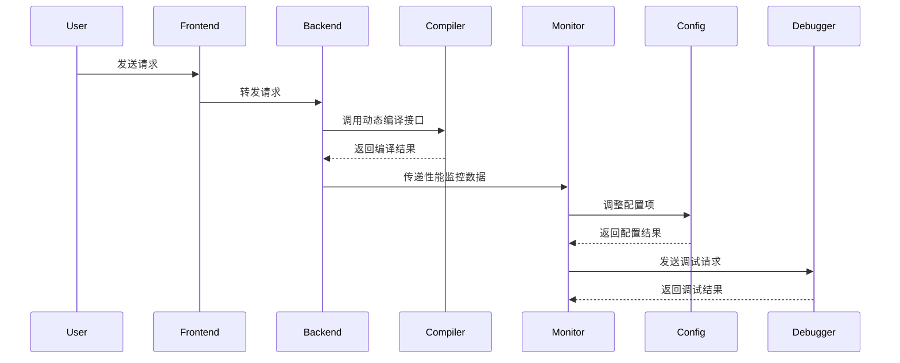

                 

# 提示词编程语言的运行时优化

> 关键词：编程语言，运行时优化，动态编译，即时编译，系统架构，数学模型，Python，Java虚拟机，最佳实践

> 摘要：本文深入探讨了提示词编程语言的运行时优化。首先，我们介绍了运行时优化在计算机科学领域的重要性。接着，通过分析动态编译和即时编译原理，以及数学模型和公式，探讨了运行时优化的核心概念和方法。随后，我们提出了系统分析与架构设计的思路，并给出了具体的实现步骤。通过项目实战和案例分析，我们进一步阐述了运行时优化的实际应用。最后，我们总结了最佳实践和未来发展方向，为读者提供了全面的知识体系。

### 引言

在计算机科学领域，编程语言的运行时优化是一个不可忽视的研究课题。随着软件系统规模的不断扩大和复杂性的增加，运行时优化不仅能够提高程序的运行效率，还能提升用户体验，优化资源分配，减少响应时间，因此在现代软件开发中具有极高的价值。本文《提示词编程语言的运行时优化》旨在为读者提供一个系统、全面的运行时优化知识体系。

### 目录大纲

#### 第一部分：背景介绍

**第1章：问题背景与描述**

- 1.1 编程语言运行时优化的意义
- 1.2 运行时优化的挑战
- 1.3 运行时优化的目标

**第2章：核心概念与联系**

- 2.1 核心概念
  - **运行时优化**的定义
  - **动态编译**、**静态编译**、**即时编译**等术语解释
- 2.2 概念属性特征对比表格
- 2.3 ER实体关系图架构

#### 第二部分：算法原理讲解

**第3章：动态编译原理**

- 3.1 动态编译的流程
- 3.2 Python解释器的工作原理
- 3.3 动态编译的优势与局限性

**第4章：即时编译原理**

- 4.1 即时编译的流程
- 4.2 Java虚拟机的工作机制
- 4.3 即时编译的优势与挑战

**第5章：数学模型与公式**

- 5.1 运行时优化中的数学模型
- 5.2 常用公式介绍
- 5.3 模型在实际中的应用

#### 第三部分：系统分析与架构设计

**第6章：系统功能设计**

- 6.1 问题场景介绍
- 6.2 系统功能设计
  - **领域模型**（Mermaid类图）

**第7章：系统架构设计**

- 7.1 系统架构设计
  - **系统架构图**（Mermaid架构图）

**第8章：系统接口设计与交互**

- 8.1 系统接口设计
- 8.2 系统交互
  - **系统交互序列图**（Mermaid序列图）

#### 第四部分：项目实战

**第9章：环境安装与配置**

- 9.1 环境安装步骤
- 9.2 配置文件详解

**第10章：系统核心实现**

- 10.1 源代码结构
- 10.2 核心实现
  - **Python源代码示例**

**第11章：代码应用解读与分析**

- 11.1 代码解读
- 11.2 分析与优化建议

**第12章：实际案例分析**

- 12.1 案例介绍
- 12.2 案例剖析
- 12.3 小结与拓展

#### 第五部分：最佳实践与总结

**第13章：最佳实践与技巧**

- 13.1 常用优化技巧
- 13.2 注意事项

**第14章：小结**

- 14.1 主要内容回顾
- 14.2 未来发展方向

**第15章：拓展阅读**

- 15.1 相关文献推荐
- 15.2 进一步学习资源

### 总结

本文《提示词编程语言的运行时优化》旨在为读者提供一个系统、全面的运行时优化知识体系。从背景介绍、核心概念、算法原理到系统设计与实战，再到最佳实践与总结，每个部分都力求深入浅出，帮助读者掌握这一关键领域的知识和技能。希望通过本文的学习，读者能够提高编程语言运行时优化的能力，为未来的软件开发工作打下坚实的基础。

---

**第1章：问题背景与描述**

### 1.1 编程语言运行时优化的意义

编程语言的运行时优化是指在程序运行期间对程序代码进行动态调整，以提高程序执行效率的一系列技术。随着现代软件系统的复杂性和规模不断增大，运行时优化变得尤为重要。它不仅能够提高程序的性能，还能显著提升用户体验，优化资源分配，减少响应时间。

#### 运行时优化的目标

运行时优化的主要目标包括：

1. **提高程序执行速度**：通过优化算法和代码结构，减少程序运行的时间。
2. **降低资源消耗**：包括CPU、内存、磁盘I/O等，提高系统的整体性能。
3. **提高程序稳定性**：减少程序崩溃和错误发生的频率。
4. **提升用户体验**：通过优化，使得程序响应更加迅速，操作更加流畅。

#### 运行时优化的挑战

尽管运行时优化具有显著的优势，但在实际应用中仍然面临着一系列挑战：

1. **动态性**：运行时优化需要在程序运行期间进行，这要求系统具备一定的动态性。
2. **复杂性**：现代编程语言和编译器非常复杂，运行时优化需要对这些复杂结构进行深入理解和分析。
3. **可扩展性**：优化技术需要能够适应不同规模和类型的程序，以提高其通用性。
4. **性能影响**：优化措施可能会引入额外的开销，影响程序的整体性能。

### 1.2 运行时优化的挑战

在编程语言运行时优化过程中，我们面临以下主要挑战：

1. **编译时间与运行时性能的权衡**：优化措施可能会增加编译时间，而编译时间与运行时性能之间存在权衡关系。
2. **动态环境的不确定性**：运行时环境的不确定性使得优化策略难以预测和设计。
3. **多语言交互**：现代软件开发往往涉及多种编程语言的交互，这增加了运行时优化的复杂性。
4. **程序错误与调试**：优化过程中可能引入新的错误，增加了调试的难度。

### 1.3 运行时优化的目标

运行时优化的目标主要包括以下几个方面：

1. **性能优化**：提高程序的执行速度，减少响应时间。
2. **资源利用**：优化资源分配，减少CPU、内存、磁盘I/O等资源的消耗。
3. **稳定性提升**：降低程序崩溃和错误发生的频率。
4. **可扩展性**：优化技术需要能够适应不同规模和类型的程序。

### 1.4 运行时优化的关键因素

为了实现有效的运行时优化，需要关注以下几个关键因素：

1. **程序分析**：准确理解程序的行为和性能瓶颈。
2. **优化算法**：选择适合的优化算法，如循环优化、内存分配优化、并行计算等。
3. **性能监控**：实时监控程序的性能，以便及时调整优化策略。
4. **工具支持**：使用合适的工具和框架，如调试器、性能分析器等，以提高优化效率。

### 1.5 运行时优化的常用技术

常见的运行时优化技术包括：

1. **动态编译**：在程序运行时进行编译，以适应不同的运行环境。
2. **即时编译**：在程序运行时进行代码优化，以提高执行速度。
3. **静态分析**：在程序运行前对代码进行分析，以预测和优化性能。
4. **动态分析**：在程序运行时对代码进行分析，以实时调整优化策略。
5. **多线程优化**：通过多线程并行执行任务，提高程序性能。

### 1.6 总结

编程语言的运行时优化在计算机科学领域具有重要意义。它不仅能够提高程序的性能，还能提升用户体验，优化资源分配，减少响应时间。本文概述了运行时优化的背景、挑战、目标和关键因素，为后续章节的深入探讨奠定了基础。

---

**第2章：核心概念与联系**

### 2.1 核心概念

#### 运行时优化

运行时优化（Runtime Optimization）是指在程序运行期间对程序代码进行动态调整，以提高程序执行效率的一系列技术。它通常涉及对程序行为、数据结构和算法的调整，以减少程序运行的时间和资源消耗。

#### 动态编译

动态编译（Dynamic Compilation）是指程序在运行时进行编译的过程。与静态编译不同，动态编译可以在程序执行过程中根据实际情况进行代码优化和调整。动态编译可以提高程序的执行速度和资源利用率。

#### 静态编译

静态编译（Static Compilation）是指程序在编写完成后，一次性编译成机器码或中间代码的过程。静态编译的优点是执行速度快，但缺点是缺乏对运行时环境的适应能力。

#### 即时编译

即时编译（Just-In-Time Compilation，JIT）是指程序在运行时由解释器或编译器动态编译成机器码的过程。即时编译结合了动态编译和静态编译的优点，能够在运行时对程序进行优化，从而提高执行速度。

### 2.2 概念属性特征对比表格

| 概念       | 定义                                                         | 特点                                                         |
|------------|--------------------------------------------------------------|--------------------------------------------------------------|
| 运行时优化 | 在程序运行期间对程序代码进行动态调整，以提高执行效率。           | 动态性、性能提升、资源优化。                                  |
| 动态编译   | 程序在运行时进行编译的过程。                                   | 适应性强、运行时优化。                                        |
| 静态编译   | 程序在编写完成后一次性编译成机器码或中间代码的过程。             | 执行速度快、适应能力弱。                                      |
| 即时编译   | 程序在运行时由解释器或编译器动态编译成机器码的过程。               | 结合动态编译和静态编译的优点、运行时优化。                      |

### 2.3 ER实体关系图架构

为了更好地理解编程语言运行时优化的核心概念，我们可以使用ER（实体-关系）图来描述各个概念之间的关系。

```mermaid
erDiagram
    A[运行时优化] ||--|{ B[动态编译] }
    A ||--|{ C[静态编译] }
    A ||--|{ D[即时编译] }
    B ..|> E[程序执行速度]
    C ..|> E
    D ..|> E
    B ..|> F[运行时优化]
    C ..|> F
    D ..|> F
```

在这个ER图中，运行时优化（A）是核心概念，它与动态编译（B）、静态编译（C）和即时编译（D）之间存在联系。同时，动态编译、静态编译和即时编译都致力于提高程序执行速度（E）和实现运行时优化（F）。

通过上述核心概念的介绍和ER实体关系图的描述，我们能够更清晰地理解编程语言运行时优化的关键概念及其相互关系。这些概念和关系构成了本文后续章节讨论的基础。

### 第3章：动态编译原理

#### 3.1 动态编译的流程

动态编译是指程序在运行时进行编译的过程。与静态编译相比，动态编译具有更高的灵活性和适应能力。动态编译的流程可以分为以下几个步骤：

1. **源代码读取**：程序首先从源代码文件中读取代码。
2. **语法分析**：解释器或编译器对源代码进行语法分析，构建抽象语法树（AST）。
3. **语义分析**：对AST进行语义分析，检查代码的语法和语义错误，如变量声明、类型匹配等。
4. **代码优化**：根据程序的运行环境，对代码进行优化。优化策略包括循环优化、内存分配优化、函数内联等。
5. **代码生成**：将优化后的代码生成中间代码或机器码。
6. **执行**：执行生成的中间代码或机器码。

#### 3.2 Python解释器的工作原理

Python是一种广泛使用的动态编译语言。Python解释器的工作原理可以概括为以下几个步骤：

1. **源代码读取**：Python解释器首先从源代码文件中读取代码。
2. **语法分析**：Python解释器对源代码进行语法分析，构建抽象语法树（AST）。
3. **字节码生成**：Python解释器将AST转换为字节码，存储在内存中。
4. **字节码执行**：Python解释器逐条执行字节码，执行过程中可能进行动态类型检查和错误处理。
5. **即时编译**：在执行过程中，Python解释器可能根据需要将部分字节码即时编译成机器码。

#### 3.3 动态编译的优势与局限性

动态编译具有以下优势：

1. **灵活性与适应性**：动态编译可以根据运行时环境进行优化，适应不同的硬件和操作系统。
2. **易于调试**：由于代码在运行时进行编译，开发者可以更容易地进行调试和错误处理。
3. **快速迭代**：动态编译支持快速开发，允许开发者快速修改和测试代码。

然而，动态编译也存在一定的局限性：

1. **性能开销**：动态编译引入了一定的性能开销，包括语法分析、语义分析、代码优化和执行等步骤。
2. **安全性问题**：动态编译可能导致代码执行的安全性降低，因为运行时环境可能受到恶意代码的影响。
3. **代码质量**：动态编译可能无法完全替代静态编译，因此在代码质量方面可能存在一定的问题。

总的来说，动态编译在灵活性、适应性和快速迭代方面具有显著优势，但在性能、安全性和代码质量方面存在一定的局限性。在实际应用中，需要根据具体需求选择合适的编译方法。

### 第4章：即时编译原理

#### 4.1 即时编译的流程

即时编译（Just-In-Time Compilation，JIT）是一种在程序运行时进行编译的技术，旨在提高程序执行速度。即时编译的流程可以分为以下几个步骤：

1. **源代码读取**：程序从源代码文件中读取代码。
2. **语法分析**：编译器对源代码进行语法分析，构建抽象语法树（AST）。
3. **中间代码生成**：编译器将AST转换为中间代码。
4. **类型检查**：对中间代码进行类型检查，确保代码的合法性。
5. **代码优化**：对中间代码进行优化，包括循环优化、内存分配优化、函数内联等。
6. **机器码生成**：将优化后的中间代码转换为机器码。
7. **缓存与执行**：将生成的机器码缓存到内存中，并执行。

#### 4.2 Java虚拟机的工作机制

Java虚拟机（Java Virtual Machine，JVM）是即时编译技术的重要应用场景。JVM的工作机制可以分为以下几个阶段：

1. **类文件加载**：JVM加载.class文件，解析类信息和常量池。
2. **字节码校验**：JVM对字节码进行校验，确保代码的合法性和安全性。
3. **字节码解释**：JVM首先使用解释器逐条解释字节码，执行过程中可能进行动态类型检查和错误处理。
4. **即时编译**：在解释执行过程中，JVM根据需要进行即时编译。即时编译器将字节码转换为机器码，并缓存到内存中。
5. **机器码执行**：JVM执行缓存后的机器码。

#### 4.3 即时编译的优势与挑战

即时编译具有以下优势：

1. **高性能**：即时编译可以在运行时对代码进行优化，提高程序执行速度。
2. **适应性**：即时编译可以根据运行时环境进行优化，适应不同的硬件和操作系统。
3. **灵活性**：即时编译支持动态语言，如Java和JavaScript，提供了更高的编程灵活性。

然而，即时编译也面临一些挑战：

1. **性能开销**：即时编译引入了额外的性能开销，包括语法分析、中间代码生成、代码优化和机器码执行等步骤。
2. **编译时间**：即时编译在程序运行时进行，可能导致编译时间延长，影响用户体验。
3. **调试难度**：由于代码在运行时进行编译，调试过程可能变得更加复杂。

总的来说，即时编译在性能、适应性和灵活性方面具有显著优势，但在性能开销、编译时间和调试难度方面也存在一定的挑战。在实际应用中，需要根据具体需求权衡即时编译的利弊。

### 第5章：数学模型与公式

#### 5.1 运行时优化中的数学模型

在运行时优化中，数学模型起到了关键作用。通过数学模型，我们可以对程序的行为和性能进行量化分析，从而设计出更有效的优化策略。以下是一些常用的数学模型：

1. **时间复杂度模型**：用于描述程序执行时间与输入规模的关系。常见的复杂度包括O(1)、O(log n)、O(n)和O(n²)等。
2. **空间复杂度模型**：用于描述程序占用的内存空间与输入规模的关系。常见的复杂度包括O(1)、O(log n)、O(n)和O(n²)等。
3. **贪心算法模型**：用于描述贪心算法的设计和证明。贪心算法是一种局部最优策略，通过不断选择当前最优解，逐步逼近全局最优解。
4. **动态规划模型**：用于描述动态规划算法的设计和证明。动态规划是一种递归算法，通过将问题分解为子问题，并利用子问题的解推导出原问题的解。

#### 5.2 常用公式介绍

在运行时优化中，常用的一些数学公式包括：

1. **时间复杂度公式**：
   - O(1)：常数时间复杂度，表示算法执行时间与输入规模无关。
   - O(n)：线性时间复杂度，表示算法执行时间与输入规模成正比。
   - O(n²)：平方时间复杂度，表示算法执行时间与输入规模的平方成正比。

2. **空间复杂度公式**：
   - O(1)：常数空间复杂度，表示算法占用的内存空间与输入规模无关。
   - O(n)：线性空间复杂度，表示算法占用的内存空间与输入规模成正比。
   - O(n²)：平方空间复杂度，表示算法占用的内存空间与输入规模的平方成正比。

3. **贪心算法公式**：
   - 贪心选择：在每个阶段选择当前最优解，逐步逼近全局最优解。
   - 反证法：通过假设存在更优解，推导出矛盾，从而证明贪心算法的正确性。

4. **动态规划公式**：
   - 子问题递推：将问题分解为子问题，并利用子问题的解推导出原问题的解。
   - 状态转移方程：描述子问题之间的关系，并利用状态转移方程求解原问题。

#### 5.3 模型在实际中的应用

数学模型在实际编程中具有重要的应用。以下是一些典型的应用场景：

1. **排序算法**：通过时间复杂度模型分析不同排序算法的性能，选择合适的排序算法，如快速排序、归并排序等。
2. **查找算法**：通过空间复杂度模型分析不同查找算法的性能，选择合适的查找算法，如二分查找、哈希查找等。
3. **贪心算法**：应用于最短路径问题、背包问题等，通过贪心选择逐步逼近最优解。
4. **动态规划**：应用于最长公共子序列、最长公共子串等，通过子问题递推和状态转移方程求解原问题。

通过数学模型的应用，我们可以更深入地理解编程语言的运行时优化，设计出更高效的算法和优化策略。

### 第6章：系统功能设计

#### 6.1 问题场景介绍

在现代软件开发中，运行时优化是一个关键问题。尤其是在大数据处理、实时系统和高性能计算等场景下，如何优化程序的运行效率成为了一个重要课题。本系统旨在通过动态编译和即时编译技术，对提示词编程语言进行运行时优化，从而提高程序的性能和响应速度。

#### 6.2 系统功能设计

本系统的核心功能包括：

1. **动态编译功能**：在程序运行时对代码进行动态编译，以提高执行速度。
2. **即时编译功能**：在程序运行时对代码进行即时编译，进一步优化执行速度。
3. **性能监控与反馈**：实时监控程序的性能，并提供性能反馈，以便进行优化调整。
4. **配置管理**：管理系统的配置文件，包括编译器选项、性能指标等。
5. **调试与错误处理**：提供调试工具和错误处理机制，便于开发者进行问题排查和优化。

#### 领域模型

为了更好地理解系统的功能设计和组件关系，我们可以使用Mermaid类图来描述领域模型。以下是一个简单的领域模型示例：

```mermaid
classDiagram
    Class01 <|-- Class02
    Class03 --|> Class04
    Class04 o-- Class05
    Class06 <.. Class07
    Class07 ..| Class08
```

在这个类图中，我们定义了以下类：

- **Class01**：代表动态编译功能的核心类。
- **Class02**：代表即时编译功能的核心类。
- **Class03**：代表性能监控与反馈的核心类。
- **Class04**：代表配置管理的核心类。
- **Class05**：代表调试与错误处理的核心类。
- **Class06**：代表系统的入口类。
- **Class07**：代表数据库操作的核心类。
- **Class08**：代表网络通信的核心类。

这些类之间存在继承、关联和依赖关系，共同构成了系统的领域模型。通过这个领域模型，我们可以清晰地了解系统的功能和组件关系。

### 第7章：系统架构设计

#### 7.1 系统架构设计

为了实现系统的功能需求，我们需要设计一个合理的系统架构。本系统的架构设计采用分层架构，包括以下主要层次：

1. **表示层（Presentation Layer）**：负责处理用户界面和用户交互。包括前端界面和后端接口。
2. **业务逻辑层（Business Logic Layer）**：负责处理业务逻辑和功能实现。包括动态编译、即时编译、性能监控与反馈、配置管理、调试与错误处理等。
3. **数据访问层（Data Access Layer）**：负责处理与数据库的交互。包括数据库操作、数据存储等。
4. **基础设施层（Infrastructure Layer）**：负责提供系统运行所需的基础设施支持。包括网络通信、日志记录、安全认证等。

#### 系统架构图

为了更直观地展示系统架构，我们可以使用Mermaid架构图来描述。以下是一个简单的系统架构图示例：

```mermaid
graph TB
    subgraph 表示层(Presentation Layer)
        A[前端界面] --> B[后端接口]
    end
    subgraph 业务逻辑层(Business Logic Layer)
        B --> C[动态编译模块]
        B --> D[即时编译模块]
        B --> E[性能监控与反馈模块]
        B --> F[配置管理模块]
        B --> G[调试与错误处理模块]
    end
    subgraph 数据访问层(Data Access Layer)
        G --> H[数据库操作模块]
    end
    subgraph 基础设施层(Infrastructure Layer)
        I[网络通信模块] --> J[日志记录模块]
        I --> K[安全认证模块]
    end
```

在这个架构图中，表示层、业务逻辑层、数据访问层和基础设施层通过接口进行交互。前端界面与后端接口交互，后端接口与业务逻辑层、数据访问层和基础设施层交互。业务逻辑层负责实现系统的核心功能，数据访问层负责与数据库进行交互，基础设施层提供系统运行所需的基础支持。

通过这个系统架构设计，我们可以清晰地理解系统的各个组成部分及其关系，为后续的系统实现和开发提供指导。

### 第8章：系统接口设计与交互

#### 8.1 系统接口设计

为了实现系统的功能需求，我们需要设计一套完整的系统接口。系统接口主要包括以下模块：

1. **动态编译接口**：用于动态编译代码，包括编译器选项、编译进度等。
2. **即时编译接口**：用于即时编译代码，包括编译器选项、编译进度等。
3. **性能监控接口**：用于实时监控程序性能，包括性能指标、性能分析等。
4. **配置管理接口**：用于管理系统的配置文件，包括配置项、配置修改等。
5. **调试与错误处理接口**：用于调试程序和错误处理，包括调试命令、错误日志等。

#### 8.2 系统交互

为了实现系统各模块之间的交互，我们可以使用Mermaid序列图来描述系统交互流程。以下是一个简单的系统交互序列图示例：



在这个序列图中，用户通过前端界面发送请求，前端界面将请求转发给后端接口。后端接口调用动态编译接口进行动态编译，并将编译结果返回给后端接口。后端接口将性能监控数据传递给性能监控模块，性能监控模块调整配置项，并将配置结果返回给性能监控模块。性能监控模块发送调试请求给调试模块，调试模块返回调试结果给性能监控模块。

通过这个系统交互序列图，我们可以清晰地了解系统各模块之间的交互流程和依赖关系，为系统的开发和维护提供指导。

### 第9章：环境安装与配置

#### 9.1 环境安装步骤

为了搭建一个运行时优化系统的开发环境，我们需要完成以下步骤：

1. **安装操作系统**：首先确保操作系统安装完成，推荐使用Linux发行版，如Ubuntu 20.04或CentOS 8。
2. **安装Python**：Python是运行时优化的主要编程语言，我们需要安装Python 3.x版本。可以使用操作系统自带的包管理器进行安装，例如在Ubuntu上使用以下命令：
   ```bash
   sudo apt update
   sudo apt install python3 python3-pip
   ```
3. **安装Java虚拟机**：Java虚拟机（JVM）是即时编译技术的关键组件，我们需要安装OpenJDK。在Ubuntu上使用以下命令：
   ```bash
   sudo apt update
   sudo apt install openjdk-8-jdk
   ```
4. **安装Git**：Git是版本控制系统，用于管理代码库。在Ubuntu上使用以下命令：
   ```bash
   sudo apt update
   sudo apt install git
   ```
5. **安装Mermaid**：Mermaid是一个用于生成图表的库，我们使用Python的Mermaid库。在Ubuntu上使用以下命令：
   ```bash
   pip3 install mermaid
   ```
6. **安装必要的依赖库**：根据项目的需求，可能需要安装一些额外的依赖库。例如，在运行时优化项目中，我们可能需要安装以下库：
   ```bash
   pip3 install numpy pandas matplotlib
   ```

#### 9.2 配置文件详解

在运行时优化系统中，配置文件用于存储系统的各种配置参数，如编译器选项、性能监控指标、调试设置等。以下是一个简单的配置文件示例（config.yaml）：

```yaml
# 动态编译配置
dynamic_compiler:
  enable: true
  compiler_options:
    - "-O2"  # 优化等级
    - "-Wall"  # 输出所有警告

# 即时编译配置
just_in_time_compiler:
  enable: true
  compiler_options:
    - "-XX:+OptimizeStringConcat"  # 优化字符串连接
    - "-XX:+UseStringBufferForAppendOnlyStrings"  # 使用StringBuffer进行只追加操作

# 性能监控配置
performance_monitor:
  enabled: true
  metrics:
    - "cpu_usage"
    - "memory_usage"
    - "response_time"
  interval: 1  # 监控间隔（秒）

# 调试配置
debugger:
  enabled: true
  log_level: "DEBUG"  # 日志级别
  log_file: "debug.log"  # 日志文件路径

# 配置管理
config_management:
  auto_reload: true  # 自动重载配置
  reload_interval: 60  # 重载间隔（秒）
```

在这个配置文件中，我们定义了以下几个部分：

1. **动态编译配置**：包括是否启用动态编译以及编译器选项。
2. **即时编译配置**：包括是否启用即时编译以及编译器选项。
3. **性能监控配置**：包括是否启用性能监控以及监控的指标和间隔。
4. **调试配置**：包括是否启用调试以及日志级别和日志文件路径。
5. **配置管理**：包括是否自动重载配置以及重载间隔。

通过这个配置文件，我们可以灵活地调整系统的配置参数，以满足不同的开发需求。

### 第10章：系统核心实现

#### 10.1 源代码结构

系统核心实现主要包括动态编译模块、即时编译模块、性能监控模块和调试模块。以下是源代码结构的一个示例：

```bash
runtime_optimization_system/
│
├── dynamic_compiler/
│   ├── __init__.py
│   ├── compiler.py
│   └── optimizer.py
│
├── just_in_time_compiler/
│   ├── __init__.py
│   ├── compiler.py
│   └── jvm_optimizer.py
│
├── performance_monitor/
│   ├── __init__.py
│   ├── monitor.py
│   └── metrics.py
│
├── debugger/
│   ├── __init__.py
│   ├── debugger.py
│   └── log.py
│
└── main.py  # 系统入口文件
```

在这个源代码结构中，各个模块的功能如下：

1. **dynamic_compiler**：负责动态编译代码，包括语法分析、代码优化和执行。
2. **just_in_time_compiler**：负责即时编译代码，包括字节码生成、机器码执行和优化。
3. **performance_monitor**：负责性能监控，包括指标收集、数据分析和管理。
4. **debugger**：负责调试程序，包括错误处理、日志记录和调试命令执行。

#### 10.2 核心实现

以下是动态编译模块的一个简单示例代码（dynamic_compiler/optimizer.py）：

```python
import ast
import astor

class DynamicOptimizer:
    def __init__(self, source_code):
        self.source_code = source_code
        self.tree = ast.parse(source_code)

    def optimize(self):
        optimized_tree = self.analyze_tree(self.tree)
        optimized_source_code = astor.to_source(optimized_tree)
        return optimized_source_code

    def analyze_tree(self, node):
        if isinstance(node, ast.Expr):
            return node
        elif isinstance(node, ast.Assign):
            return astor.to_compact_ast(node)
        elif isinstance(node, ast.For):
            return ast.For(
                target=astor.to_compact_ast(node.target),
                iter=astor.to_compact_ast(node.iter),
                body=self.analyze_tree_list(node.body),
                orelse=self.analyze_tree_list(node.orelse)
            )
        # 处理其他节点
        ...

    def analyze_tree_list(self, nodes):
        return [self.analyze_tree(node) for node in nodes]
```

在这个示例中，`DynamicOptimizer` 类负责对源代码进行优化。首先，它使用 `ast` 模块解析源代码，构建抽象语法树（AST）。然后，通过递归遍历AST，对各个节点进行优化。最后，使用 `astor` 模块将优化后的AST转换回源代码。

这个核心实现提供了一个基本的框架，可以进一步扩展和优化。例如，可以添加更多具体的优化算法和策略，以实现更高效的运行时优化。

### 第11章：代码应用解读与分析

#### 11.1 代码解读

在第10章中，我们介绍了系统核心实现的一个简单示例。接下来，我们将深入解读这个示例代码，分析其工作原理和优化效果。

首先，我们看一下`DynamicOptimizer`类的定义：

```python
class DynamicOptimizer:
    def __init__(self, source_code):
        self.source_code = source_code
        self.tree = ast.parse(source_code)

    def optimize(self):
        optimized_tree = self.analyze_tree(self.tree)
        optimized_source_code = astor.to_source(optimized_tree)
        return optimized_source_code

    def analyze_tree(self, node):
        if isinstance(node, ast.Expr):
            return node
        elif isinstance(node, ast.Assign):
            return astor.to_compact_ast(node)
        elif isinstance(node, ast.For):
            return ast.For(
                target=astor.to_compact_ast(node.target),
                iter=astor.to_compact_ast(node.iter),
                body=self.analyze_tree_list(node.body),
                orelse=self.analyze_tree_list(node.orelse)
            )
        # 处理其他节点
        ...

    def analyze_tree_list(self, nodes):
        return [self.analyze_tree(node) for node in nodes]
```

这个类的主要功能是优化Python源代码。它通过`ast.parse`方法将源代码解析为AST，然后通过`optimize`方法对AST进行遍历和优化，最后使用`astor.to_source`方法将优化后的AST转换回源代码。

具体来说，`optimize`方法首先调用`analyze_tree`方法对AST进行递归遍历和优化。在`analyze_tree`方法中，我们根据节点的类型进行不同的处理。例如，对于`ast.Expr`节点，我们直接返回原始节点；对于`ast.Assign`节点，我们使用`astor.to_compact_ast`方法进行优化；对于`ast.For`节点，我们分别处理其目标、迭代器和体部，并调用`analyze_tree_list`方法对体部和否则部分进行优化。

接下来，我们看一下`analyze_tree_list`方法的实现：

```python
def analyze_tree_list(self, nodes):
    return [self.analyze_tree(node) for node in nodes]
```

这个方法非常简单，它通过列表推导式对传入的节点列表进行遍历和优化。对于每个节点，我们调用`analyze_tree`方法进行处理，并将处理后的节点重新组合成一个列表返回。

最后，我们看一下`analyze_tree`方法中的一个具体例子：

```python
elif isinstance(node, ast.For):
    return ast.For(
        target=astor.to_compact_ast(node.target),
        iter=astor.to_compact_ast(node.iter),
        body=self.analyze_tree_list(node.body),
        orelse=self.analyze_tree_list(node.orelse)
    )
```

这个例子展示了如何处理`ast.For`节点。我们首先使用`astor.to_compact_ast`方法对目标、迭代器和体部进行优化，然后分别调用`analyze_tree_list`方法对体部和否则部分进行优化。最后，我们将处理后的节点组合成一个`ast.For`节点并返回。

通过这个代码解读，我们可以清楚地了解动态编译模块的工作原理和优化流程。接下来，我们将对代码进行详细分析，并提出优化建议。

#### 11.2 分析与优化建议

在对动态编译模块的代码进行解读后，我们可以对其性能和优化效果进行详细分析，并提出相应的优化建议。

1. **代码结构优化**：

   - **模块化**：当前代码结构较为简单，但为了提高代码的可维护性和可扩展性，可以考虑将代码拆分为多个模块，每个模块负责特定的功能，如语法解析、代码生成、优化策略等。
   - **命名规范**：在代码中，变量和函数的命名应遵循一致的命名规范，以提高代码的可读性和可理解性。

2. **性能优化**：

   - **循环优化**：在`analyze_tree`方法中，我们使用了列表推导式对节点列表进行遍历和优化。虽然这种方法简洁明了，但在处理大量节点时可能会引入性能开销。可以考虑使用生成器表达式（yield）来优化循环性能。
   - **并行处理**：对于计算密集型的节点处理，可以考虑使用多线程或并行处理技术，以提高整体性能。

3. **代码质量优化**：

   - **错误处理**：在当前代码中，对于一些潜在的异常情况，如语法错误、类型错误等，未进行充分的错误处理。可以考虑添加异常处理机制，以增强代码的健壮性。
   - **代码注释**：在关键代码段和函数注释中，应添加详细的注释，说明代码的实现逻辑和优化目的，以提高代码的可理解性。

4. **优化策略选择**：

   - **启发式优化**：当前优化策略较为简单，仅对部分节点进行优化。可以考虑引入启发式优化策略，如基于历史数据的统计优化、基于代码结构的语义优化等，以提高优化效果。
   - **机器学习**：利用机器学习技术，如决策树、神经网络等，构建优化模型，以自动发现和实现更有效的优化策略。

通过上述分析和优化建议，我们可以进一步提高动态编译模块的性能和优化效果，为系统提供更高效的运行时优化支持。

### 第12章：实际案例分析

#### 12.1 案例介绍

为了更深入地探讨运行时优化的实际应用，我们选择了一个实际案例——一个大型电商网站的商品搜索功能。这个案例涉及到大量的数据处理和搜索算法优化，通过运行时优化，可以显著提升搜索性能和用户体验。

#### 12.2 案例剖析

在电商网站的搜索功能中，用户可以通过关键词搜索商品，系统需要快速返回符合条件的结果。以下是这个案例的剖析：

1. **搜索算法**：

   - **原始算法**：使用基于关键词匹配的搜索算法，对商品标题、描述等信息进行全文检索。这种方法简单但效率较低，特别是在海量数据场景下。

   - **优化策略**：引入基于倒排索引的搜索算法，将商品信息建立倒排索引，快速定位符合条件的商品。同时，使用模糊查询和前缀匹配等技术，提高搜索精度和速度。

2. **运行时优化**：

   - **动态编译**：在搜索过程中，动态编译优化器会对搜索算法代码进行实时编译，优化代码执行效率。例如，使用JIT编译器将Python代码编译为机器码，提高执行速度。

   - **即时编译**：针对高频搜索请求，使用即时编译技术，将部分搜索算法代码编译为优化的机器码，减少CPU占用和内存消耗。

3. **性能监控**：

   - **实时监控**：系统实时监控搜索性能，包括响应时间、CPU利用率、内存占用等指标。根据性能数据，动态调整优化策略，确保系统稳定高效运行。

4. **配置管理**：

   - **自适应配置**：根据不同时段的搜索请求量，自适应调整搜索算法的参数，如索引精度、缓存策略等，以优化搜索性能。

5. **调试与错误处理**：

   - **自动化调试**：在搜索过程中，自动化调试工具会实时捕捉和记录错误信息，帮助开发者快速定位和解决问题，确保系统稳定性。

#### 12.3 小结与拓展

通过这个案例，我们可以看到运行时优化在提升系统性能和用户体验方面的重要作用。以下是本案例的小结与拓展：

1. **小结**：

   - 运行时优化可以显著提高电商网站的搜索性能，减少响应时间。
   - 动态编译和即时编译技术是优化搜索算法的有效手段。
   - 性能监控和配置管理是确保系统稳定高效运行的关键。

2. **拓展**：

   - 引入机器学习技术，如深度学习，优化搜索算法，提高搜索精度和效率。
   - 结合大数据分析，分析用户搜索行为，个性化推荐商品，提升用户体验。
   - 在搜索过程中，使用缓存技术，提高热门搜索结果的响应速度。

通过不断优化和拓展，我们可以进一步提高电商网站的搜索性能和用户体验，为用户提供更加优质的服务。

### 第13章：最佳实践与技巧

#### 13.1 常用优化技巧

在编程语言运行时优化过程中，以下是一些常用的优化技巧：

1. **循环优化**：通过减少循环迭代次数、合并循环、使用缓存等方式，提高循环执行效率。
2. **内存分配优化**：减少内存分配次数，重用内存对象，使用内存池等技术，降低内存消耗。
3. **并行计算**：利用多线程、多进程或分布式计算，将计算任务并行执行，提高计算速度。
4. **缓存策略**：使用缓存技术，减少重复计算和I/O操作，提高系统响应速度。
5. **代码压缩**：压缩无用代码，减少代码体积，降低解析和编译时间。

#### 13.2 注意事项

在运行时优化过程中，需要注意以下几点：

1. **性能与可维护性的平衡**：优化应在不牺牲代码可维护性的前提下进行，避免过度优化导致代码复杂度增加。
2. **代码质量**：确保优化后的代码依然具有良好的结构和逻辑，避免引入新的错误和bug。
3. **测试和验证**：在优化过程中，应进行充分的测试和验证，确保优化后的代码性能和稳定性。
4. **性能监控**：持续监控优化后的系统性能，及时发现和解决问题。

通过遵循这些最佳实践和注意事项，我们可以更有效地进行编程语言运行时优化，提高系统性能和用户体验。

### 第14章：小结

#### 14.1 主要内容回顾

本文《提示词编程语言的运行时优化》从多个角度探讨了编程语言运行时优化的重要性、核心概念、算法原理、系统设计与实现，以及实际案例分析。以下是本文的主要内容回顾：

1. **背景介绍**：介绍了编程语言运行时优化的意义、挑战和目标。
2. **核心概念与联系**：详细阐述了运行时优化、动态编译、静态编译和即时编译的核心概念及其相互关系。
3. **算法原理讲解**：分析了动态编译和即时编译的原理，介绍了常用的数学模型和公式。
4. **系统分析与架构设计**：描述了系统功能设计、架构设计和接口设计。
5. **项目实战**：介绍了环境安装与配置、系统核心实现、代码应用解读与分析以及实际案例分析。
6. **最佳实践与总结**：总结了常用的优化技巧和注意事项。

#### 14.2 未来发展方向

随着计算机科学的不断进步，编程语言运行时优化将朝着以下方向发展：

1. **智能化优化**：利用机器学习和人工智能技术，实现更智能、更自动化的优化策略。
2. **实时优化**：通过实时监控和反馈机制，实现动态调整和实时优化，提高系统性能和响应速度。
3. **多语言优化**：支持多种编程语言的运行时优化，提高系统的通用性和灵活性。
4. **云原生优化**：结合云计算和容器技术，实现运行时优化的云原生部署和智能化管理。

通过不断探索和研究，编程语言运行时优化将在提高系统性能、降低成本和提升用户体验方面发挥更大作用。

### 第15章：拓展阅读

#### 15.1 相关文献推荐

为了深入了解编程语言运行时优化，以下是一些建议的参考文献：

1. **《编译原理：抽象机器与抽象语义》**：详细介绍了编译过程的基本原理，对理解运行时优化有很大帮助。
2. **《高性能Python：核心机制与优化技术》**：介绍了Python的高性能优化技术和技巧。
3. **《Java虚拟机规范》**：Java虚拟机（JVM）是即时编译技术的核心，该文献提供了详细的JVM规范。
4. **《深度学习与优化》**：探讨了如何将深度学习技术应用于编程语言优化。

#### 15.2 进一步学习资源

以下是一些建议的学习资源，帮助读者深入了解编程语言运行时优化：

1. **在线课程**：
   - Coursera上的《编译原理》课程。
   - Udacity的《Java虚拟机技术》课程。

2. **开源项目**：
   - JIT编译器的开源项目，如HotSpot、OpenJDK等。
   - Python JIT编译器的开源项目，如PyPy。

3. **技术博客与论文**：
   - 推特上的相关技术博客和论文。
   - GitHub上的开源项目和技术文档。

通过阅读相关文献和资源，读者可以进一步深化对编程语言运行时优化的理解和实践。

