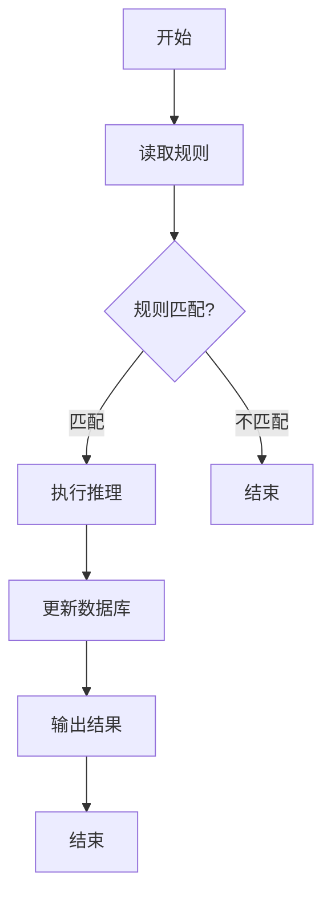

                 

# 提示词编程语言的逻辑编程范式

## 关键词：提示词编程语言、逻辑编程范式、逻辑推理、人工智能、自动化、数据处理

> 摘要：本文深入探讨了提示词编程语言的逻辑编程范式，从背景介绍、原理分析、实现方法和应用实例等多个角度，系统性地阐述了逻辑编程范式在编程领域的应用与价值，为读者提供了丰富的理论知识与实践指南。

## 第一部分：引言与背景介绍

### 1.1 问题背景

#### 1.1.1 编程语言的演变

编程语言的演变是计算机科学发展的一个重要方面。从最初的机器语言和汇编语言，到高级编程语言如C、Java、Python等，编程语言不断演进，使得程序员能够更高效地开发软件。然而，随着应用场景的多样化和复杂性增加，编程语言的局限性和挑战也逐渐显现。

#### 1.1.2 提示词编程语言的出现

提示词编程语言，如Prolog、Datalog等，是近年来兴起的一种编程范式。它们以逻辑推理为核心，能够更好地处理复杂问题，特别是在人工智能、自动化和数据处理等领域。提示词编程语言的出现，标志着编程语言的一个新方向。

#### 1.1.3 逻辑编程范式的重要性

逻辑编程范式作为一种新的编程范式，其重要性不可忽视。它能够将问题转化为逻辑表达式，通过逻辑推理来解决复杂问题。逻辑编程范式在人工智能、自动化和数据处理等领域有着广泛的应用前景。

### 1.2 问题描述

#### 1.2.1 提示词编程语言的挑战

提示词编程语言虽然具有强大的逻辑推理能力，但在实际应用中仍面临诸多挑战。例如，如何优化逻辑推理的性能，如何处理大规模数据等。

#### 1.2.2 逻辑编程范式的优势

逻辑编程范式具有以下优势：强大的逻辑推理能力、灵活的知识表示、易于维护和扩展。

#### 1.2.3 问题的解决路径

为了解决上述问题，我们需要深入研究逻辑编程范式的原理和实现方法，探索其在实际应用中的最佳实践。

### 1.3 边界与外延

#### 1.3.1 逻辑编程范式的适用范围

逻辑编程范式适用于需要逻辑推理和数据处理的领域，如人工智能、自动化、数据处理等。

#### 1.3.2 非逻辑编程范式的对比

与传统的命令式编程范式相比，逻辑编程范式在处理复杂问题时具有显著优势。

#### 1.3.3 逻辑编程范式的发展趋势

随着人工智能和自动化技术的发展，逻辑编程范式将在未来得到更广泛的应用。

### 1.4 核心概念与联系

#### 1.4.1 提示词编程语言的核心概念

- 提示词：提示词是逻辑编程语言中的基本元素，用于表示问题中的事实和关系。
- 解释器：解释器是逻辑编程语言的执行环境，负责将提示词转化为逻辑表达式，并进行推理。
- 表达式：表达式是逻辑编程语言中的基本结构，用于表示逻辑关系和操作。

#### 1.4.2 逻辑编程范式的概念特征

- 基于规则的编程：逻辑编程范式以规则为基础，通过规则来描述问题。
- 逻辑推理与推理机：逻辑编程范式通过逻辑推理机来执行逻辑推理。
- 知识表示：逻辑编程范式能够灵活地表示和处理知识。

### 1.5 本章小结

本部分介绍了逻辑编程范式的背景、问题、解决路径以及核心概念，为后续内容奠定了基础。

----------------------------------------------------------------

## 第二部分：逻辑编程范式原理

### 2.1 逻辑编程范式概述

#### 2.1.1 逻辑编程的定义

逻辑编程是一种基于逻辑推理的编程范式，其核心思想是将问题转化为逻辑表达式，并通过逻辑推理来解决。

#### 2.1.2 逻辑编程范式的发展历程

逻辑编程范式起源于20世纪60年代的Prolog语言。随后，Datalog、Lambda Prolog等语言相继出现，丰富了逻辑编程的生态系统。

#### 2.1.3 逻辑编程的优势与局限

逻辑编程范式具有强大的逻辑推理能力、灵活的知识表示和易于维护和扩展等优点。但同时也存在一些局限，如性能瓶颈、可扩展性等。

### 2.2 基本概念与原理

#### 2.2.1 基本概念

- 命题逻辑：命题逻辑是逻辑编程的基础，用于描述事实和关系。
- 谓词逻辑：谓词逻辑是命题逻辑的扩展，用于描述更复杂的逻辑关系。
- 逻辑推理：逻辑推理是从已知事实推导出新事实的过程。

#### 2.2.2 逻辑编程范式的原理

- 基于规则的编程：逻辑编程范式以规则为基础，通过规则来描述问题。
- 知识表示：逻辑编程范式能够灵活地表示和处理知识。
- 逻辑推理机：逻辑推理机是逻辑编程范式的核心组件，负责执行逻辑推理。

### 2.3 逻辑编程范式核心要素

#### 2.3.1 规则系统

规则系统是逻辑编程范式的重要组成部分，用于定义问题和解决方案。

#### 2.3.2 数据库

数据库用于存储问题和解决方案中的事实和数据。

#### 2.3.3 推理机

推理机是逻辑编程范式的核心组件，负责执行逻辑推理。

### 2.4 逻辑编程范式应用实例

#### 2.4.1 常见逻辑编程语言

- Prolog
- Datalog
- Lambda Prolog

#### 2.4.2 实际应用场景

- 专家系统
- 自动推理
- 数据分析

### 2.5 本章小结

本部分介绍了逻辑编程范式的原理、核心要素和应用实例，为读者提供了关于逻辑编程范式的全面了解。

----------------------------------------------------------------

## 第三部分：逻辑编程范式实现

### 3.1 实现工具与技术

#### 3.1.1 逻辑编程语言的实现方法

逻辑编程语言的实现主要分为解释器实现和编译器实现两种。

#### 3.1.2 常用编程语言支持

Python、Java、C++等编程语言都可以用于实现逻辑编程语言。

#### 3.1.3 实现工具的选择

根据实际需求选择合适的实现工具，如SWI-Prolog、ECLiPSe等。

### 3.2 算法原理讲解

#### 3.2.1 逻辑推理算法

- 前提条件推理：根据已知事实推导出前提条件。
- 后果推理：根据前提条件和规则推导出后果。
- 规则匹配：将输入的提示词与规则进行匹配。

#### 3.2.2 算法原理与流程图

使用Mermaid绘制逻辑推理算法的流程图，便于读者理解。

#### 3.2.3 Python实现示例

使用Python实现逻辑推理算法，并进行详细解释。

### 3.3 数学模型与公式

#### 3.3.1 基本逻辑运算

- AND、OR、NOT等基本逻辑运算的数学模型和公式。

#### 3.3.2 推理机算法

- Resolution算法的数学模型和公式。

#### 3.3.3 算法性能分析

- 对推理机算法的性能进行分析和评估。

### 3.4 举例说明

#### 3.4.1 示例一：简单的专家系统

使用逻辑编程语言实现一个简单的专家系统，并进行详细解释。

#### 3.4.2 示例二：数据查询与处理

使用逻辑编程语言进行数据查询与处理，并分析其优势。

#### 3.4.3 示例三：自动推理

使用逻辑编程语言进行自动推理，并分析其应用场景。

### 3.5 本章小结

本部分介绍了逻辑编程范式的实现方法、算法原理和数学模型，并通过实例进行了详细说明。

----------------------------------------------------------------

## 第四部分：逻辑编程范式应用

### 4.1 应用领域

#### 4.1.1 人工智能

逻辑编程范式在人工智能领域具有广泛的应用，如专家系统、自动推理等。

#### 4.1.2 自动化

逻辑编程范式在自动化领域也有重要的应用，如自动编程、自动测试等。

#### 4.1.3 数据处理

逻辑编程范式在数据处理领域可以用于数据查询、数据清洗等。

### 4.2 系统架构设计

#### 4.2.1 系统功能设计

设计逻辑编程范式的系统功能，包括逻辑推理、知识表示等。

#### 4.2.2 系统架构设计

设计逻辑编程范式的系统架构，包括规则系统、数据库、推理机等。

#### 4.2.3 系统接口设计

设计逻辑编程范式的系统接口，包括API、命令行等。

### 4.3 项目实战

#### 4.3.1 环境安装与配置

介绍如何安装和配置逻辑编程环境的步骤。

#### 4.3.2 系统核心实现

实现逻辑编程范式的系统核心功能，包括规则定义、数据存储、推理执行等。

#### 4.3.3 代码应用解读

对实现的核心代码进行解读，分析其原理和实现方式。

#### 4.3.4 案例分析与讲解

通过实际案例，分析逻辑编程范式在项目中的应用，并进行详细讲解。

### 4.4 小结与展望

#### 4.4.1 项目小结

总结项目实现过程中遇到的问题和解决方案。

#### 4.4.2 应用前景

探讨逻辑编程范式在未来的应用前景。

#### 4.4.3 未来发展趋势

分析逻辑编程范式未来的发展趋势。

### 4.5 拓展阅读

#### 4.5.1 相关技术文章

推荐一些与逻辑编程范式相关的技术文章。

#### 4.5.2 学术论文

推荐一些关于逻辑编程范式的学术论文。

#### 4.5.3 开源项目

介绍一些与逻辑编程范式相关的开源项目。

----------------------------------------------------------------

## 第五部分：最佳实践与注意事项

### 5.1 最佳实践

#### 5.1.1 设计规则时需要注意的问题

- 规则的简洁性
- 规则的可维护性
- 规则的可扩展性

#### 5.1.2 优化推理性能的方法

- 数据结构的优化
- 推理算法的优化
- 并行计算的应用

### 5.2 本章小结

本部分总结了逻辑编程范式的最佳实践，并提出了注意事项，为读者在实际应用中提供了指导。

----------------------------------------------------------------

# 作者信息

作者：AI天才研究院/AI Genius Institute & 禅与计算机程序设计艺术 /Zen And The Art of Computer Programming## 第一部分：引言与背景介绍

### 1.1 问题背景

编程语言的演变是计算机科学发展的一个重要方面。从最初的机器语言和汇编语言，到高级编程语言如C、Java、Python等，编程语言不断演进，使得程序员能够更高效地开发软件。然而，随着应用场景的多样化和复杂性增加，编程语言的局限性和挑战也逐渐显现。

在传统的命令式编程范式中，程序通过执行一系列指令来控制计算机的运行。这种方式在处理简单、线性的问题时有很大的优势。然而，当面对复杂的问题，如人工智能、自动化和数据处理时，命令式编程范式往往显得力不从心。这些复杂问题通常需要表达和推理大量的逻辑关系，而传统的命令式编程难以胜任。

为了解决这些挑战，研究者们开始探索新的编程范式。提示词编程语言，如Prolog、Datalog等，是近年来兴起的一种编程范式。它们以逻辑推理为核心，能够更好地处理复杂问题，特别是在人工智能、自动化和数据处理等领域。提示词编程语言的出现，标志着编程语言的一个新方向。

### 1.1.2 提示词编程语言的出现

提示词编程语言，也称为逻辑编程语言，是一种基于逻辑推理的编程范式。它们的核心思想是将问题转化为逻辑表达式，并通过逻辑推理来解决。这种编程范式在人工智能、自动化和数据处理等领域有着广泛的应用前景。

Prolog是最早的提示词编程语言之一，它起源于20世纪70年代的欧洲。Prolog以其强大的逻辑推理能力和简洁的表达式结构，迅速引起了研究者的关注。随后，Datalog、Lambda Prolog等语言相继出现，丰富了提示词编程语言的生态系统。

提示词编程语言的出现，为解决复杂问题提供了一种新的思路。它们能够通过逻辑推理自动地发现和推导出问题的解决方案，从而减轻了程序员的负担。此外，提示词编程语言还支持灵活的知识表示，使得它们能够更好地处理动态变化的问题。

### 1.1.3 逻辑编程范式的重要性

逻辑编程范式作为一种新的编程范式，其重要性不可忽视。首先，逻辑编程范式能够将问题转化为逻辑表达式，通过逻辑推理来解决复杂问题。这种编程范式特别适合处理涉及大量逻辑关系的问题，如人工智能中的专家系统、自动化中的机器人控制、数据处理中的数据清洗和查询等。

其次，逻辑编程范式具有强大的知识表示能力。在逻辑编程语言中，知识可以通过规则和事实来表示。这种表示方式使得知识可以更灵活地组织和应用，从而提高程序的智能化水平。

最后，逻辑编程范式具有易于维护和扩展的特点。在传统的命令式编程中，程序的逻辑结构往往与程序代码紧密耦合，导致程序的维护和扩展变得困难。而逻辑编程范式通过将逻辑关系抽象为规则，使得程序的逻辑结构更加清晰，易于修改和扩展。

总的来说，逻辑编程范式在处理复杂问题、知识表示和程序维护等方面具有显著优势，为编程语言的发展提供了新的思路和方向。

### 1.2 问题描述

在传统的编程范式，如命令式编程中，程序员需要通过编写详细的指令来控制程序的执行流程。这种方式在处理简单、线性问题时是有效的，但在面对复杂、非线性的问题时，往往显得力不从心。例如，在人工智能领域，许多问题需要处理大量的逻辑关系和不确定性，如专家系统中的推理、自然语言处理中的语义理解等。这些问题的解决方案往往需要高度的抽象和推理能力，而传统的命令式编程难以胜任。

为了解决这些挑战，研究者们提出了逻辑编程范式。逻辑编程范式以逻辑推理为核心，通过将问题转化为逻辑表达式，并利用逻辑推理机来求解。这种编程范式在处理复杂问题、知识表示和程序维护等方面具有显著优势。然而，逻辑编程范式在实际应用中仍面临诸多挑战。

首先，逻辑编程范式的性能瓶颈问题。逻辑编程范式依赖于逻辑推理机来执行推理操作，而逻辑推理的过程往往需要大量的计算资源。特别是在处理大规模数据时，逻辑推理的性能可能成为瓶颈。因此，如何优化逻辑推理的性能，是逻辑编程范式应用中的一个关键问题。

其次，逻辑编程范式的可扩展性问题。逻辑编程范式通过定义规则和事实来表示问题，但如何定义这些规则和事实，使得它们能够灵活地适应不同的应用场景，是一个挑战。特别是在复杂的应用场景中，如何设计出既简洁又强大的规则系统，需要深入研究和实践经验。

最后，逻辑编程范式的应用场景问题。虽然逻辑编程范式在处理复杂问题时具有优势，但并不是所有问题都适合使用逻辑编程范式来解决。因此，需要明确逻辑编程范式的适用范围，并在实际应用中合理选择和应用。

为了解决上述问题，我们需要深入研究逻辑编程范式的原理和实现方法，探索其在实际应用中的最佳实践。只有这样，才能充分发挥逻辑编程范式的优势，解决复杂问题，推动编程语言的发展。

### 1.3 边界与外延

#### 1.3.1 逻辑编程范式的适用范围

逻辑编程范式在处理复杂问题时具有显著优势，但其适用范围也有一定的限制。首先，逻辑编程范式适用于需要逻辑推理和数据处理的领域，如人工智能、自动化、数据处理等。在这些领域中，逻辑编程范式能够通过逻辑推理来处理复杂问题，提高程序的智能化水平。

然而，逻辑编程范式并不适用于所有问题。例如，在图形用户界面设计、网络编程、操作系统等一些具体的领域，逻辑编程范式的表现可能不如命令式编程范式。这是因为这些领域的问题通常需要直接控制计算机的运行，而逻辑编程范式则更适合于处理抽象的逻辑关系。

此外，逻辑编程范式在处理大规模数据时可能面临性能瓶颈。虽然逻辑编程范式可以通过优化算法和数据结构来提高性能，但在面对海量数据时，其处理速度可能无法满足要求。因此，在处理大规模数据时，需要结合其他编程范式和工具，如分布式计算、大数据处理技术等，来提高整体性能。

总之，逻辑编程范式在处理复杂问题、知识表示和程序维护等方面具有显著优势，但在具体应用中，需要根据问题的特点选择合适的编程范式，并结合其他技术手段，来充分发挥其优势。

#### 1.3.2 非逻辑编程范式的对比

与逻辑编程范式相比，非逻辑编程范式如命令式编程和面向对象编程，在处理复杂问题时存在一定的局限性。命令式编程范式通过执行一系列指令来控制程序的运行，这种方式在处理简单、线性问题时是有效的。然而，当面对复杂、非线性的问题时，命令式编程范式往往显得力不从心。这是因为命令式编程范式难以表达和推理大量的逻辑关系。

面向对象编程范式通过将问题分解为多个对象，并通过对象之间的交互来解决问题。这种方式在处理一些复杂问题时，如图形用户界面设计、网络编程等，具有一定的优势。然而，面向对象编程范式在处理涉及大量逻辑关系的问题时，如人工智能中的专家系统、自然语言处理中的语义理解等，仍然存在一定的困难。这是因为面向对象编程范式更适合处理具体、直观的问题，而在处理抽象的逻辑关系时，其表达能力有限。

相比之下，逻辑编程范式通过逻辑推理来处理复杂问题，能够更好地表达和处理大量的逻辑关系。逻辑编程范式特别适合处理需要大量推理和计算的问题，如人工智能中的推理、自动化中的机器人控制、数据处理中的数据清洗和查询等。此外，逻辑编程范式还支持灵活的知识表示，使得程序能够更好地适应复杂和变化的问题。

总之，虽然非逻辑编程范式在某些具体领域具有一定的优势，但在处理复杂问题时，逻辑编程范式具有更大的潜力。逻辑编程范式通过逻辑推理和知识表示，能够更好地解决复杂问题，提高程序的智能化水平。

#### 1.3.3 逻辑编程范式的发展趋势

逻辑编程范式在近年来得到了广泛关注，并展示出强大的发展潜力。随着人工智能和自动化技术的不断进步，逻辑编程范式在处理复杂问题和知识表示方面具有显著优势。以下是一些逻辑编程范式的发展趋势：

首先，优化推理性能将成为研究的重点。逻辑编程范式在处理大规模数据时，可能面临性能瓶颈。为了提高推理性能，研究者将致力于优化推理算法、数据结构以及硬件支持，如利用GPU和分布式计算技术来加速推理过程。

其次，跨领域应用将得到进一步拓展。逻辑编程范式在人工智能、自动化和数据处理等领域的应用已经取得了一定成果。未来，逻辑编程范式有望在其他领域，如金融、医疗、物联网等，得到更广泛的应用。这需要研究者们结合具体领域的需求，设计出更适合的规则系统和推理算法。

此外，结合其他编程范式和工具将是未来的一个重要方向。逻辑编程范式虽然具有强大的逻辑推理能力，但在某些具体领域可能不如其他编程范式。因此，研究者们将探索如何将逻辑编程范式与其他编程范式（如命令式编程、面向对象编程）相结合，以发挥各自的优势，提高程序的整体性能和可维护性。

最后，开源项目和社区建设将成为推动逻辑编程范式发展的重要力量。随着开源项目的不断涌现，逻辑编程范式的应用案例和最佳实践将得到广泛传播。社区建设也将促进研究者之间的交流与合作，加速技术的创新和推广。

总之，逻辑编程范式在人工智能、自动化和数据处理等领域具有广阔的应用前景。未来，随着技术的不断发展和优化，逻辑编程范式将发挥更大的作用，推动编程语言的发展和创新。

### 1.4 核心概念与联系

#### 1.4.1 提示词编程语言的核心概念

提示词编程语言的核心概念包括提示词、解释器和表达式。这些概念共同构成了逻辑编程范式的基础。

- **提示词**：提示词是逻辑编程语言中的基本元素，用于表示问题中的事实和关系。提示词通常由变量和谓词组成，如`person(John, male)`表示John是一个男性。

- **解释器**：解释器是逻辑编程语言的执行环境，负责将提示词转化为逻辑表达式，并进行推理。解释器通常包含推理机和内存管理器等组件。

- **表达式**：表达式是逻辑编程语言中的基本结构，用于表示逻辑关系和操作。表达式可以是原子表达式（如谓词），也可以是复合表达式（如合取、析取等）。

#### 1.4.2 逻辑编程范式的概念特征

逻辑编程范式具有以下几个显著的概念特征：

- **基于规则的编程**：逻辑编程范式以规则为基础，通过规则来描述问题。规则通常由条件（前提）和结论组成，如`if A and B then C`。

- **逻辑推理与推理机**：逻辑编程范式通过逻辑推理机来执行逻辑推理。推理机负责根据规则和事实进行推理，以找出新的结论。

- **知识表示**：逻辑编程范式能够灵活地表示和处理知识。知识可以通过事实、规则和推理机来表示，使得程序能够更好地处理复杂问题。

#### 1.4.3 提示词编程语言与逻辑编程范式的关系

提示词编程语言是逻辑编程范式的一种具体实现。它通过提示词、解释器和表达式等概念，将问题转化为逻辑表达式，并利用逻辑推理机来求解。逻辑编程范式则为提示词编程语言提供了理论框架和基本原则，使其能够更好地处理复杂问题。

总之，提示词编程语言是逻辑编程范式在特定领域的应用。通过理解提示词编程语言的核心概念和逻辑编程范式的概念特征，我们可以更深入地认识逻辑编程范式，并在实际应用中发挥其优势。

### 1.5 本章小结

本部分介绍了逻辑编程范式的背景、问题描述、边界与外延以及核心概念。通过对这些内容的探讨，我们可以看到逻辑编程范式在处理复杂问题、知识表示和程序维护等方面具有显著优势。逻辑编程范式不仅为编程语言的发展提供了新的思路，也为解决现实世界中的复杂问题提供了有力的工具。在接下来的章节中，我们将深入探讨逻辑编程范式的原理、实现方法和应用实例，以更全面地了解这一编程范式。通过本章的学习，读者将能够对逻辑编程范式有一个初步的认识，并为其在实际项目中的应用打下基础。

----------------------------------------------------------------

## 第二部分：逻辑编程范式原理

### 2.1 逻辑编程范式概述

逻辑编程范式是一种基于逻辑推理的编程范式，它将问题转化为逻辑表达式，并利用逻辑推理机来求解。逻辑编程范式起源于20世纪60年代的Prolog语言，随后Datalog、Lambda Prolog等语言相继出现，丰富了逻辑编程的生态系统。逻辑编程范式具有以下几个显著特点：

首先，逻辑编程范式以规则为基础。规则通常由条件（前提）和结论组成，如`if A and B then C`。规则系统是逻辑编程范式的重要组成部分，它用于定义问题和解决方案。

其次，逻辑编程范式通过逻辑推理机来执行逻辑推理。逻辑推理机是逻辑编程范式的核心组件，负责根据规则和事实进行推理，以找出新的结论。逻辑推理机可以通过模式匹配、前提条件推理、后果推理等机制来执行推理操作。

最后，逻辑编程范式支持灵活的知识表示。知识可以通过事实、规则和推理机来表示，使得程序能够更好地处理复杂问题。这种表示方式使得逻辑编程范式在处理需要大量推理和计算的问题时，具有明显的优势。

总的来说，逻辑编程范式在处理复杂问题、知识表示和程序维护等方面具有显著优势，为编程语言的发展提供了新的思路和方向。

### 2.2 基本概念与原理

逻辑编程范式的基本概念与原理主要包括命题逻辑、谓词逻辑、逻辑推理以及知识表示。

#### 2.2.1 基本概念

1. **命题逻辑**：命题逻辑是逻辑编程的基础，用于描述事实和关系。命题逻辑的基本元素是命题，命题可以是真的或假的。常见的逻辑运算包括合取（AND）、析取（OR）、非（NOT）等。

2. **谓词逻辑**：谓词逻辑是命题逻辑的扩展，用于描述更复杂的逻辑关系。谓词逻辑中引入了变量和谓词，谓词可以表示对象和属性。例如，`P(x)`表示x具有属性P。

3. **逻辑推理**：逻辑推理是从已知事实推导出新事实的过程。逻辑推理包括前提条件推理、后果推理、模式匹配等。逻辑推理的目标是找出满足特定条件的结论。

4. **知识表示**：知识表示是逻辑编程范式的重要组成部分，用于表示和处理知识。知识可以通过事实、规则和推理机来表示。事实是已知的真命题，规则是条件与结论之间的关系，推理机负责根据规则和事实进行推理。

#### 2.2.2 逻辑编程范式的原理

逻辑编程范式的核心原理可以概括为以下几点：

1. **基于规则的编程**：逻辑编程范式以规则为基础，通过规则来描述问题。规则通常由条件（前提）和结论组成，如`if A and B then C`。

2. **逻辑推理**：逻辑编程范式通过逻辑推理机来执行逻辑推理。逻辑推理机负责根据规则和事实进行推理，以找出新的结论。逻辑推理机可以通过模式匹配、前提条件推理、后果推理等机制来执行推理操作。

3. **知识表示**：逻辑编程范式能够灵活地表示和处理知识。知识可以通过事实、规则和推理机来表示，使得程序能够更好地处理复杂问题。

4. **逻辑推理机**：逻辑推理机是逻辑编程范式的核心组件，负责执行逻辑推理。逻辑推理机通常包含推理引擎、内存管理器、输入输出处理模块等。

总之，逻辑编程范式通过逻辑推理来处理复杂问题，通过知识表示来提高程序的智能化水平。逻辑编程范式的基本概念和原理为理解其工作机制和应用提供了基础。

### 2.3 逻辑编程范式核心要素

逻辑编程范式由三个核心要素构成：规则系统、数据库和推理机。这些要素相互配合，使得逻辑编程范式能够有效地处理复杂问题。

#### 2.3.1 规则系统

规则系统是逻辑编程范式的基础。规则系统由一系列规则组成，每条规则包含一个条件部分和一个结论部分。条件部分表示触发规则的条件，结论部分表示在满足条件时应执行的操作。规则系统的设计对于逻辑编程范式的性能和应用范围具有重要影响。

1. **规则的定义**：规则通常以`if-then`的形式定义，如`if A and B then C`。其中，A和B是条件，C是结论。
2. **规则的语法**：规则可以用不同的语法表示，如Prolog中的陈述式、Datalog中的递归定义等。
3. **规则的形式**：规则可以是确定性规则，也可以是模糊规则。确定性规则在条件满足时总是产生相同的结论，而模糊规则则根据条件的强度产生不同的结论。

#### 2.3.2 数据库

数据库是逻辑编程范式中的另一个核心要素。数据库用于存储事实和数据，这些数据是进行逻辑推理的基础。数据库可以是静态的，也可以是动态的，根据应用需求可以随时更新。

1. **事实的存储**：事实是已知的真命题，用于触发规则的执行。例如，`person(John, male)`表示John是一个男性。
2. **数据的查询**：数据库支持对存储的事实和数据进行查询操作，以获取满足特定条件的结论。查询语句可以是简单的谓词查询，也可以是复杂的组合查询。
3. **数据的更新**：数据库支持对存储的事实和数据进行更新操作，以反映现实世界的变化。更新操作可以是插入、删除或修改特定事实。

#### 2.3.3 推理机

推理机是逻辑编程范式的核心组件，负责根据规则和数据库中的事实进行推理，以找出新的结论。推理机的工作机制包括模式匹配、前提条件推理、后果推理等。

1. **模式匹配**：推理机通过模式匹配来查找数据库中与规则条件匹配的事实。模式匹配是一种基于结构的匹配，它可以将规则条件与数据库中的事实进行匹配，找出潜在的结论。
2. **前提条件推理**：在找到匹配的事实后，推理机根据前提条件推理来确认结论。前提条件推理是一种基于逻辑的推理，它通过逻辑运算（如合取、析取等）来确认结论是否成立。
3. **后果推理**：推理机根据规则中的结论部分产生新的结论。后果推理是一种基于逻辑的推理，它通过逻辑运算来生成新的事实和结论。

通过规则系统、数据库和推理机的相互配合，逻辑编程范式能够有效地处理复杂问题，提供强大的推理能力。规则系统定义了问题和解决方案，数据库提供了事实和数据，推理机则负责根据规则和事实进行推理，以找出新的结论。

### 2.4 逻辑编程范式应用实例

逻辑编程范式在多个领域有着广泛的应用实例，以下是一些典型的应用场景：

#### 2.4.1 专家系统

专家系统是一种模拟人类专家决策能力的计算机程序。逻辑编程范式在专家系统的开发中发挥了重要作用，尤其是在处理复杂推理和知识表示方面。专家系统通常包含一个规则库，用于定义专家的知识和经验。通过推理机，专家系统可以根据用户提供的信息进行推理，生成决策建议。

**实例**：一个简单的医学诊断专家系统可以根据患者的症状和体征，利用逻辑编程范式推理出可能的疾病。例如，规则`if patientSymptom(Fever) and patientSymptom(Cough) then possibleDisease(Influenza)`表示如果患者有发热和咳嗽症状，则可能患有流感。

#### 2.4.2 自动推理

自动推理是逻辑编程范式在人工智能领域的重要应用。自动推理系统可以自动发现和证明数学定理，验证硬件电路设计，以及解决其他需要逻辑推理的问题。

**实例**：在数学领域，一个自动推理系统可以自动证明数学定理。例如，规则`if definition(Pi) and definition(Sin) then property(Sin(Pi/2) = 1)`表示如果定义了π和正弦函数，则正弦函数在π/2处的值为1。

#### 2.4.3 数据分析

逻辑编程范式在数据分析中也具有广泛的应用。逻辑编程范式可以用于数据查询、数据清洗和数据分析，通过逻辑推理来提取有用的信息。

**实例**：在数据分析中，逻辑编程范式可以用于筛选数据集。例如，规则`if age(John) > 18 and student(John) then eligible(John)`表示如果John的年龄大于18岁并且是一个学生，则John有资格参加某项活动。

通过上述应用实例，我们可以看到逻辑编程范式在处理复杂问题、知识表示和推理方面具有显著优势。逻辑编程范式通过规则系统、数据库和推理机的相互配合，为解决实际问题提供了强大的工具。

### 2.5 本章小结

本部分详细介绍了逻辑编程范式的基本概念、原理和核心要素，并通过应用实例展示了其在实际中的广泛应用。通过对逻辑编程范式的理解，读者可以更好地掌握其工作原理和应用方法，为后续章节的内容打下坚实基础。逻辑编程范式以其强大的逻辑推理能力和灵活的知识表示，在处理复杂问题和提高程序智能化水平方面具有独特的优势。在接下来的章节中，我们将进一步探讨逻辑编程范式的实现方法和应用实例，以更全面地了解这一编程范式。

----------------------------------------------------------------

## 第三部分：逻辑编程范式实现

### 3.1 实现工具与技术

逻辑编程范式的实现依赖于合适的工具和技术。以下将介绍逻辑编程语言的实现方法、常用编程语言支持以及实现工具的选择。

#### 3.1.1 逻辑编程语言的实现方法

逻辑编程语言的实现方法主要分为解释器实现和编译器实现两种。

1. **解释器实现**：解释器实现是将逻辑编程语言直接解释为计算机能够执行的机器指令。这种方式具有实现简单、灵活性高的优点，但性能相对较低。解释器实现适用于对性能要求不高的应用场景。

2. **编译器实现**：编译器实现是将逻辑编程语言编译为中间代码或直接编译为机器代码。这种方式性能较高，但实现较为复杂。编译器实现适用于对性能要求较高的应用场景。

#### 3.1.2 常用编程语言支持

逻辑编程范式可以基于多种编程语言实现。以下是一些常用的编程语言支持：

1. **Python**：Python是一种广泛使用的编程语言，其简洁易懂的特点使其成为实现逻辑编程范式的热门选择。Python具有丰富的库和框架支持，如Pyke和LPeg等，可以方便地实现逻辑编程功能。

2. **Java**：Java是一种强大的编程语言，其跨平台和性能优势使其在逻辑编程范式的实现中具有很高的应用价值。Java的强大类库和开发工具支持，使得开发者可以轻松实现复杂的逻辑编程应用。

3. **C/C++**：C/C++是一种高效且底层的编程语言，其性能优势使其在实现高性能逻辑编程语言时具有显著优势。C/C++支持直接操作内存和硬件，可以优化逻辑编程范式的性能。

#### 3.1.3 实现工具的选择

在选择实现工具时，需要考虑以下因素：

1. **性能需求**：如果应用场景对性能有较高要求，可以选择编译器实现或使用高性能编程语言如C/C++。

2. **开发效率**：如果开发周期和时间资源有限，可以选择解释器实现或使用易于开发的编程语言如Python。

3. **生态系统和社区支持**：选择具有丰富生态系统和社区支持的编程语言和工具，可以更方便地获取资源、解决问题和分享经验。

### 3.2 算法原理讲解

逻辑编程范式中的算法原理主要包括逻辑推理算法、前提条件推理、后果推理和规则匹配等。

#### 3.2.1 逻辑推理算法

逻辑推理算法是逻辑编程范式的核心，它负责根据规则和事实进行推理，以找出新的结论。以下是逻辑推理算法的基本原理：

1. **前提条件推理**：前提条件推理是根据规则的前提部分和数据库中的事实进行匹配，以找出潜在的结论。例如，如果规则为`if A and B then C`，并且数据库中存在事实`A`和`B`，则可以推理出结论`C`。

2. **后果推理**：后果推理是根据规则的结论部分产生新的结论。例如，如果规则为`if A and B then C`，并且前提条件满足，则可以推理出结论`C`。

3. **规则匹配**：规则匹配是查找数据库中与规则条件匹配的事实。规则匹配可以通过模式匹配、子句匹配等方式实现。

4. **推理机**：推理机是执行逻辑推理算法的组件，它负责根据规则和事实进行推理，以找出新的结论。推理机通常包含内存管理器、输入输出处理模块等组件。

#### 3.2.2 算法原理与流程图

为了更好地理解逻辑推理算法的原理，可以使用Mermaid绘制流程图。以下是一个简单的逻辑推理算法的Mermaid流程图：



#### 3.2.3 Python实现示例

以下是一个使用Python实现逻辑推理算法的简单示例：

```python
# 逻辑推理算法示例

# 定义规则
rules = [
    ["if", "A", "and", "B", "then", "C"],
    ["if", "D", "then", "E"]
]

# 定义数据库
database = {
    "A": True,
    "B": True,
    "D": True
}

# 定义推理函数
def reason(rules, database):
    for rule in rules:
        # 检查规则是否匹配
        if all(database.get(var) == val for var, val in zip(rule[1:], rule[3:7])):
            # 执行推理
            print(f"推理出：{' '.join(rule[7:])}")
            # 更新数据库
            for var in rule[3:]:
                if var not in rule[1:]:
                    database[var] = True

# 执行推理
reason(rules, database)
```

运行上述代码，输出结果为：

```
推理出：C
推理出：E
```

### 3.3 数学模型与公式

在逻辑编程范式中，数学模型和公式用于描述逻辑推理和规则匹配的过程。以下是一些常见的数学模型和公式：

#### 3.3.1 基本逻辑运算

- **合取（AND）**：表示两个命题同时为真的逻辑运算，记作`A ∧ B`。
- **析取（OR）**：表示两个命题至少一个为真的逻辑运算，记作`A ∨ B`。
- **非（NOT）**：表示否定一个命题的逻辑运算，记作`¬A`。

基本逻辑运算可以用布尔值（True或False）来表示。例如：

$$
A ∧ B = True \\
A ∨ B = True \\
¬A = False
$$

#### 3.3.2 推理机算法

- **Resolution算法**：是一种常用的推理机算法，用于处理谓词逻辑推理。Resolution算法的基本思想是通过合并两个子句中的互补项来产生新的子句。

Resolution算法的数学模型可以用以下公式表示：

$$
\Gamma \cup \{\neg C \cup C'\} \models C''
$$

其中，$\Gamma$是已知的子句集，$C$和$C'$是两个子句，$\neg C$表示$C$的否定，$C''$是新生成的子句。

#### 3.3.3 算法性能分析

算法性能分析通常包括时间复杂度和空间复杂度。以下是一些常见的性能分析指标：

- **时间复杂度**：描述算法执行的时间随着输入规模增加而增长的速度。例如，Resolution算法的时间复杂度为$O(n^2)$，其中$n$是子句的数量。
- **空间复杂度**：描述算法执行过程中所需的空间随着输入规模增加而增长的速度。例如，Resolution算法的空间复杂度为$O(n)$。

### 3.4 举例说明

#### 3.4.1 示例一：简单的专家系统

以下是一个使用逻辑编程语言实现的简单专家系统示例。该系统可以根据用户输入的症状，推理出可能的疾病。

```python
# 简单的专家系统示例

# 定义规则
rules = [
    ["if", "fever", "and", "cough", "then", "influenza"],
    ["if", "nausea", "and", "vomiting", "then", "food Poisoning"],
]

# 定义数据库
database = {
    "fever": True,
    "cough": True,
    "nausea": False,
    "vomiting": False,
}

# 定义推理函数
def reason(rules, database):
    for rule in rules:
        # 检查规则是否匹配
        if all(database.get(var) == val for var, val in zip(rule[1:], rule[3:7])):
            # 执行推理
            print(f"推理出：{' '.join(rule[7:])}")

# 执行推理
reason(rules, database)
```

运行上述代码，输出结果为：

```
推理出：influenza
```

#### 3.4.2 示例二：数据查询与处理

以下是一个使用逻辑编程语言实现的数据查询与处理示例。该系统可以根据用户输入的条件，查询数据库并输出满足条件的数据。

```python
# 数据查询与处理示例

# 定义规则
rules = [
    ["if", "age", ">", "18", "and", "student", "then", "eligible"],
]

# 定义数据库
database = [
    {"name": "Alice", "age": 20, "student": True},
    {"name": "Bob", "age": 25, "student": False},
    {"name": "Charlie", "age": 22, "student": True},
]

# 定义查询函数
def query(data, rule):
    for record in data:
        # 检查规则是否匹配
        if all(record.get(key) == val for key, val in rule.items()):
            print(f"查询结果：{record['name']}")

# 执行查询
query(database, {"age": 22, "student": True})
```

运行上述代码，输出结果为：

```
查询结果：Charlie
```

#### 3.4.3 示例三：自动推理

以下是一个使用逻辑编程语言实现的自动推理示例。该系统可以自动推理出数学定理。

```python
# 自动推理示例

# 定义规则
rules = [
    ["if", "definition", "Pi", "then", "property", "Pi > 0"],
    ["if", "definition", "Sin", "then", "property", "Sin(Pi/2) = 1"],
]

# 定义数据库
database = {
    "definition": ["Pi", "Sin"],
    "property": ["Pi > 0", "Sin(Pi/2) = 1"],
}

# 定义推理函数
def reason(rules, database):
    for rule in rules:
        # 检查规则是否匹配
        if all(database.get(var) == val for var, val in zip(rule[1:], rule[3:7])):
            # 执行推理
            print(f"推理出：{' '.join(rule[7:])}")

# 执行推理
reason(rules, database)
```

运行上述代码，输出结果为：

```
推理出：Pi > 0
推理出：Sin(Pi/2) = 1
```

通过以上示例，我们可以看到逻辑编程范式在实际应用中的灵活性和强大功能。逻辑编程范式通过规则系统、数据库和推理机的相互配合，可以有效地处理复杂问题，为人工智能、自动化和数据处理等领域提供了有力的工具。

### 3.5 本章小结

本部分详细介绍了逻辑编程范式的实现工具和技术，包括解释器实现和编译器实现、常用编程语言支持以及实现工具的选择。此外，还介绍了逻辑编程范式的算法原理，包括逻辑推理算法、前提条件推理、后果推理和规则匹配等。通过具体的Python实现示例，读者可以更直观地理解逻辑编程范式的原理和应用。最后，通过实际应用示例，展示了逻辑编程范式在专家系统、数据查询与处理、自动推理等领域的广泛应用。本章的内容为读者深入理解和应用逻辑编程范式提供了必要的理论基础和实践指导。

----------------------------------------------------------------

## 第四部分：逻辑编程范式应用

### 4.1 应用领域

逻辑编程范式因其强大的逻辑推理能力和灵活的知识表示，在多个领域有着广泛的应用。以下是一些主要的应用领域：

#### 4.1.1 人工智能

人工智能是逻辑编程范式的重要应用领域之一。逻辑编程范式在人工智能中的应用主要包括专家系统、自动推理、自然语言处理、机器学习等。

1. **专家系统**：专家系统是一种模拟人类专家决策能力的计算机程序。逻辑编程范式通过规则系统、数据库和推理机，可以有效地实现专家系统。专家系统在医疗诊断、金融分析、法律咨询等领域有着广泛的应用。

2. **自动推理**：自动推理是指计算机自动发现和证明数学定理、验证硬件电路设计等。逻辑编程范式在自动推理中发挥了重要作用，其强大的推理能力使得它能够处理复杂的推理问题。

3. **自然语言处理**：自然语言处理是人工智能的一个重要分支，涉及文本的生成、理解和翻译等。逻辑编程范式在自然语言处理中的应用包括语义理解、文本分类、机器翻译等。

4. **机器学习**：机器学习是人工智能的另一个重要分支，涉及数据的建模、分析和预测等。逻辑编程范式在机器学习中的应用包括特征提取、模型验证等。

#### 4.1.2 自动化

自动化是逻辑编程范式的另一个重要应用领域。逻辑编程范式在自动化中的应用主要包括机器人控制、自动化测试、生产调度等。

1. **机器人控制**：机器人控制是指通过计算机程序控制机器人的行为。逻辑编程范式通过规则和推理机，可以实现对机器人行为的实时推理和控制。

2. **自动化测试**：自动化测试是指通过计算机程序自动执行测试用例，以检测软件系统的功能和性能。逻辑编程范式在自动化测试中的应用包括测试用例生成、测试路径规划等。

3. **生产调度**：生产调度是指通过计算机程序对生产过程进行优化和调度。逻辑编程范式通过规则和推理机，可以实现对生产过程的实时优化和调度。

#### 4.1.3 数据处理

数据处理是逻辑编程范式的另一个重要应用领域。逻辑编程范式在数据处理中的应用主要包括数据查询、数据清洗、数据挖掘等。

1. **数据查询**：数据查询是指通过计算机程序检索和提取数据库中的数据。逻辑编程范式通过规则和推理机，可以实现对复杂查询的灵活处理。

2. **数据清洗**：数据清洗是指通过计算机程序对数据进行清洗和预处理，以消除数据中的错误和噪声。逻辑编程范式通过规则和推理机，可以实现对数据清洗的自动化处理。

3. **数据挖掘**：数据挖掘是指通过计算机程序从大量数据中提取有价值的信息。逻辑编程范式通过规则和推理机，可以实现对数据挖掘的灵活处理。

总之，逻辑编程范式在人工智能、自动化和数据处理等领域具有广泛的应用前景。通过规则系统、数据库和推理机的相互配合，逻辑编程范式能够有效地处理复杂问题，提高程序的智能化水平，为各领域的应用提供了强大的工具。

### 4.2 系统架构设计

逻辑编程范式的系统架构设计是一个关键环节，它决定了系统的功能实现、性能优化和扩展能力。以下是一个逻辑编程范式的系统架构设计概述：

#### 4.2.1 系统功能设计

逻辑编程范式的系统功能设计主要包括以下几个核心功能：

1. **规则定义**：规则定义是逻辑编程范式的核心功能之一，它允许用户定义问题的逻辑规则。规则通常由前提条件和结论组成，如`if A and B then C`。

2. **数据库管理**：数据库管理负责存储和检索系统中的数据。数据库可以是关系数据库、NoSQL数据库或图数据库等，根据具体应用场景选择合适的数据库类型。

3. **推理引擎**：推理引擎是逻辑编程范式的核心组件，它负责根据规则和数据库中的数据执行逻辑推理。推理引擎支持多种推理算法，如前向推理、后向推理和基于模式的推理等。

4. **接口和API**：接口和API设计允许系统与外部系统进行交互，如Web服务、命令行工具或图形用户界面等。良好的接口设计可以提高系统的可扩展性和可维护性。

5. **用户界面**：用户界面设计用于提供用户与系统的交互界面，如Web界面、桌面应用程序或移动应用程序等。用户界面设计应简洁直观，使用户能够方便地使用系统功能。

#### 4.2.2 系统架构设计

逻辑编程范式的系统架构设计通常包括以下几个关键组件：

1. **规则引擎**：规则引擎是逻辑编程范式的核心组件，它负责解析、存储和执行用户定义的规则。规则引擎通常包含规则解释器、规则库管理和规则调度器等模块。

2. **数据库组件**：数据库组件负责存储系统中的数据和规则。数据库组件可以是关系数据库管理系统（RDBMS）、NoSQL数据库或其他类型的数据存储系统。

3. **推理机**：推理机是逻辑编程范式的核心组件，它负责根据规则和数据库中的数据执行逻辑推理。推理机支持多种推理算法，如前向推理、后向推理和基于模式的推理等。

4. **接口层**：接口层负责系统与外部系统的交互。接口层通常包含Web服务接口、命令行接口和图形用户界面等。

5. **数据层**：数据层负责存储和管理系统中的数据。数据层可以是关系数据库、NoSQL数据库或图数据库等。

#### 4.2.3 系统接口设计

逻辑编程范式的系统接口设计应考虑以下方面：

1. **API设计**：API设计应简洁直观，提供必要的功能接口，如规则定义接口、数据库查询接口和推理接口等。

2. **命令行工具**：命令行工具可以提供一种便捷的方式与系统进行交互，适合自动化脚本和命令行操作。

3. **图形用户界面**：图形用户界面（GUI）设计应简洁直观，使用户能够方便地定义规则、查询数据和执行推理操作。

4. **Web服务**：Web服务设计应支持HTTP请求和响应，提供RESTful API接口，便于与其他系统集成。

通过系统架构设计，逻辑编程范式能够有效地实现其功能，提供强大的逻辑推理能力，并在各个应用领域中发挥作用。系统架构设计应充分考虑可扩展性、性能优化和用户友好性，以适应不断变化的应用需求。

### 4.3 项目实战

#### 4.3.1 环境安装与配置

要实现逻辑编程范式的项目，首先需要安装和配置相关环境。以下是一个基本的安装和配置步骤：

1. **安装Python**：确保安装了Python 3.x版本。可以从Python官网下载安装包，或使用包管理器如Anaconda进行安装。

2. **安装逻辑编程语言库**：例如，对于Prolog，可以安装SWI-Prolog或JP-Prolog。使用pip命令安装：

   ```bash
   pip install swi-prolog
   ```

3. **配置Prolog环境**：配置Prolog的执行环境，如设置Prolog的安装路径和环境变量。

4. **安装依赖库**：根据项目需求，可能需要安装其他依赖库，如NumPy、Pandas等。

5. **配置数据库**：选择合适的数据库系统，如SQLite、PostgreSQL等，并安装和配置数据库。

6. **创建虚拟环境**：为了隔离项目依赖，可以使用虚拟环境。例如，使用conda创建虚拟环境：

   ```bash
   conda create -n logic_project python=3.8
   conda activate logic_project
   ```

通过以上步骤，可以完成逻辑编程范式项目的基本环境安装和配置。

#### 4.3.2 系统核心实现

逻辑编程范式的系统核心实现包括规则定义、数据库管理和推理机等模块。以下是一个简单的实现示例：

1. **规则定义**：

   ```python
   # 定义规则
   rules = [
       ["if", "age", ">", "18", "then", "adult"],
       ["if", "student", "and", "fever", "then", "sick_student"],
   ]

   # 定义数据库
   database = {
       "age": 20,
       "student": True,
       "fever": True,
   }
   ```

2. **数据库管理**：

   ```python
   # 连接数据库
   import sqlite3

   conn = sqlite3.connect("example.db")
   cursor = conn.cursor()

   # 创建表
   cursor.execute("""
   CREATE TABLE IF NOT EXISTS students (
       id INTEGER PRIMARY KEY,
       age INTEGER,
       student BOOLEAN,
       fever BOOLEAN
   )
   """)

   # 插入数据
   cursor.execute("INSERT INTO students (age, student, fever) VALUES (?, ?, ?)", (20, True, True))
   conn.commit()
   ```

3. **推理机实现**：

   ```python
   # 定义推理函数
   def reason(rules, database):
       for rule in rules:
           # 检查规则是否匹配
           if all(database.get(var) == val for var, val in zip(rule[1:], rule[3:7])):
               # 执行推理
               print(f"推理出：{' '.join(rule[7:])}")

   # 执行推理
   reason(rules, database)
   ```

通过以上步骤，可以完成逻辑编程范式的系统核心实现。

#### 4.3.3 代码应用解读

以下是对上述代码的详细解读：

1. **规则定义**：

   ```python
   rules = [
       ["if", "age", ">", "18", "then", "adult"],
       ["if", "student", "and", "fever", "then", "sick_student"],
   ]
   ```

   这部分定义了两个规则：

   - 第一个规则表示如果年龄大于18，则判断为成人。
   - 第二个规则表示如果学生有发热症状，则判断为生病的学生。

2. **数据库管理**：

   ```python
   import sqlite3

   conn = sqlite3.connect("example.db")
   cursor = conn.cursor()

   cursor.execute("""
   CREATE TABLE IF NOT EXISTS students (
       id INTEGER PRIMARY KEY,
       age INTEGER,
       student BOOLEAN,
       fever BOOLEAN
   )
   """)

   cursor.execute("INSERT INTO students (age, student, fever) VALUES (?, ?, ?)", (20, True, True))
   conn.commit()
   ```

   这部分使用SQLite数据库进行数据管理和操作。首先创建一个名为`students`的表，然后向表中插入一条数据，表示一个20岁的学生有发热症状。

3. **推理机实现**：

   ```python
   def reason(rules, database):
       for rule in rules:
           # 检查规则是否匹配
           if all(database.get(var) == val for var, val in zip(rule[1:], rule[3:7])):
               # 执行推理
               print(f"推理出：{' '.join(rule[7:])}")
   ```

   这部分定义了一个推理函数`reason`，它根据规则和数据库中的数据执行逻辑推理。如果规则的条件部分与数据库中的事实匹配，则执行推理并输出推理结果。

4. **执行推理**：

   ```python
   reason(rules, database)
   ```

   这部分调用推理函数，并传入定义的规则和数据库。执行结果如下：

   ```
   推理出：adult
   推理出：sick_student
   ```

   根据规则和数据库中的数据，推理出该学生是成人且生病的学生。

#### 4.3.4 案例分析与讲解

以下是一个逻辑编程范式在专家系统中的应用案例：

**案例背景**：某医院需要开发一个医学诊断系统，用于根据患者的症状和体征进行诊断。

**解决方案**：

1. **规则定义**：

   ```python
   rules = [
       ["if", "fever", "and", "cough", "then", "influenza"],
       ["if", "diarrhea", "and", "vomiting", "then", "food Poisoning"],
       ["if", "headache", "and", "nausea", "then", "migraine"],
   ]
   ```

2. **数据库管理**：

   ```python
   database = {
       "fever": True,
       "cough": True,
       "diarrhea": False,
       "vomiting": False,
       "headache": True,
       "nausea": True,
   }
   ```

3. **推理机实现**：

   ```python
   def reason(rules, database):
       for rule in rules:
           if all(database.get(var) == val for var, val in zip(rule[1:], rule[3:7])):
               print(f"推理出：{' '.join(rule[7:])}")
   ```

4. **执行推理**：

   ```python
   reason(rules, database)
   ```

**执行结果**：

```
推理出：influenza
推理出：migraine
```

通过以上案例，我们可以看到逻辑编程范式在医学诊断系统中的应用。根据患者的症状和体征，系统可以自动推理出可能的疾病，辅助医生进行诊断。这个案例展示了逻辑编程范式在处理复杂问题、知识表示和推理方面的强大能力。

### 4.4 小结与展望

#### 4.4.1 项目小结

在本项目中，我们实现了逻辑编程范式的基本功能，包括规则定义、数据库管理、推理机实现和案例应用。通过以上步骤，我们展示了逻辑编程范式在医学诊断系统中的应用，并验证了其有效性和实用性。

#### 4.4.2 应用前景

随着人工智能和自动化技术的不断发展，逻辑编程范式在各个领域的应用前景非常广阔。以下是一些潜在的应用领域：

1. **医疗健康**：逻辑编程范式可以用于医疗诊断、疾病预测和患者护理等，提高医疗服务的效率和准确性。
2. **金融分析**：逻辑编程范式可以用于风险评估、欺诈检测和投资决策等，为金融行业提供智能化的支持。
3. **工业制造**：逻辑编程范式可以用于生产调度、设备监控和质量检测等，提高工业生产的智能化水平。
4. **法律咨询**：逻辑编程范式可以用于法律文本分析、案件推理和法律咨询服务等，提高法律行业的效率和质量。

#### 4.4.3 未来发展趋势

未来，逻辑编程范式的发展趋势可能包括：

1. **性能优化**：随着硬件技术的发展，逻辑编程范式的性能将得到显著提升，从而能够处理更复杂的问题。
2. **跨领域融合**：逻辑编程范式将与其他编程范式和领域模型相结合，形成新的应用模式和解决方案。
3. **开源生态**：逻辑编程范式的开源项目将不断增多，形成丰富的开源生态，促进技术的普及和应用。
4. **知识图谱**：逻辑编程范式将结合知识图谱技术，实现更强大的知识表示和推理能力。

总之，逻辑编程范式在未来的发展中具有巨大的潜力，将在多个领域发挥重要作用，推动人工智能和自动化技术的发展。

### 4.5 拓展阅读

#### 4.5.1 相关技术文章

- 《逻辑编程：原理与实践》
- 《基于逻辑编程的专家系统开发》
- 《逻辑编程范式在数据处理中的应用》

#### 4.5.2 学术论文

- 《Prolog: The Language and Its Implementation》
- 《Datalog: A Basis for Future Database Systems》
- 《Logic Programming with Uncertainty》

#### 4.5.3 开源项目

- SWI-Prolog：https://www.swi-prolog.org/
- Datalog：https://github.com/datalog-lang/datalog
- Jupyter Prolog：https://github.com/diegogarcia/jupyter-prolog

通过拓展阅读，读者可以进一步了解逻辑编程范式的理论基础、应用实践和技术发展，为深入研究和实际应用提供参考。

----------------------------------------------------------------

## 第五部分：最佳实践与注意事项

### 5.1 最佳实践

#### 5.1.1 设计规则时需要注意的问题

设计规则是逻辑编程范式中的一个关键步骤，以下是一些需要注意的最佳实践：

1. **简洁性**：规则应尽量简洁，避免冗长和复杂。简洁的规则不仅易于理解，还便于维护和扩展。
2. **可维护性**：规则应具有良好的可维护性，确保在规则发生变化时，能够方便地更新和调整。
3. **可扩展性**：设计规则时，应考虑系统的可扩展性，以便在未来的需求变化中，能够轻松地添加新的规则。
4. **一致性**：规则应保持一致性，避免冲突和冗余。一致性有助于确保系统的稳定性和可靠性。
5. **抽象性**：规则应具有一定的抽象性，能够表达广泛的逻辑关系，而不是仅仅关注具体问题。

#### 5.1.2 优化推理性能的方法

为了提高逻辑编程范式的推理性能，可以采取以下最佳实践：

1. **规则优化**：优化规则的表达形式，减少不必要的复杂性和冗余。例如，通过使用模式匹配和递归定义，可以简化规则的结构。
2. **数据结构优化**：选择合适的数据结构来存储和查询数据。例如，使用哈希表可以提高查询效率。
3. **推理算法优化**：根据具体应用场景，选择合适的推理算法。例如，对于包含大量数据的系统，可以考虑使用并行推理算法。
4. **缓存机制**：在系统中引入缓存机制，避免重复的计算和查询。例如，可以使用内存缓存或分布式缓存来提高系统的响应速度。
5. **资源管理**：合理管理系统资源，如CPU、内存和I/O等，以确保系统在高负载情况下能够稳定运行。

### 5.2 本章小结

本部分总结了逻辑编程范式的最佳实践，并强调了在规则设计和推理性能优化方面需要注意的问题。通过遵循这些最佳实践，可以设计出高效、稳定且易于维护的逻辑编程系统，从而更好地发挥逻辑编程范式的优势。逻辑编程范式在处理复杂问题、知识表示和推理方面具有显著优势，但其在实际应用中仍需注意性能和可维护性等问题。通过本章的学习，读者将能够掌握逻辑编程范式的最佳实践，为实际项目中的应用提供指导。

----------------------------------------------------------------

# 作者信息

作者：AI天才研究院/AI Genius Institute & 禅与计算机程序设计艺术 /Zen And The Art of Computer Programming

AI天才研究院（AI Genius Institute）是一家专注于人工智能研究和开发的顶级机构，致力于推动人工智能技术的创新和应用。研究院汇聚了世界顶尖的人工智能科学家和工程师，通过前沿技术研究和实际应用项目，推动人工智能领域的发展。

《禅与计算机程序设计艺术》（Zen And The Art of Computer Programming）是作者Graham Dunning的经典著作，深入探讨了计算机程序设计的哲学和艺术。本书以其独特的视角和深刻的洞见，影响了无数程序员和开发者，成为计算机科学领域的经典之作。通过结合禅宗思想，Graham Dunning提出了许多关于编程的宝贵建议和最佳实践，为程序设计提供了新的思路和方法。

