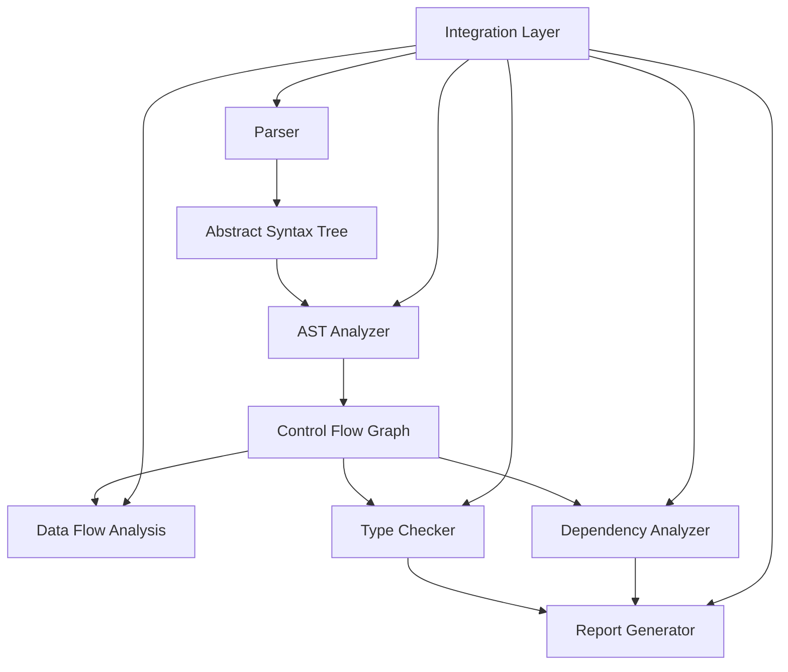
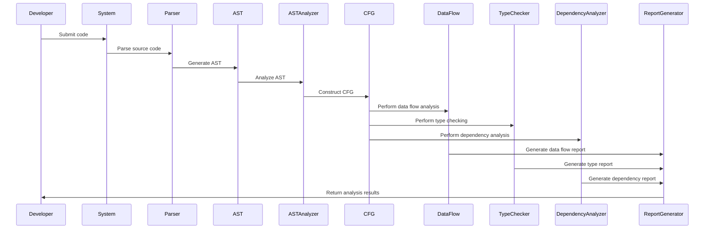

                 

# Title Page

## Static Analysis Tools for Declarative Programming Languages

### Keywords: static analysis, declarative programming languages, software engineering, algorithm design, data flow analysis

> Abstract: This book provides a comprehensive overview of static analysis tools designed for declarative programming languages. It delves into the core concepts, principles, and algorithms that underpin these tools, offering readers a deep understanding of their functionality and applications. The book aims to equip programmers and software engineers with the knowledge and skills required to effectively utilize static analysis in their projects, thereby improving code quality and maintainability.

## Table of Contents

1. **Introduction**
   1.1 **Why Static Analysis?**
   1.2 **The Role of Declarative Programming Languages**
   1.3 **The Challenges of Static Analysis**
   1.4 **Overview of the Book**

2. **Background**
   2.1 **Introduction to Declarative Programming Languages**
   2.2 **Static Analysis Basics**
   2.3 **State of the Art in Static Analysis Tools**

3. **Core Concepts and Principles**
   3.1 **Fundamental Concepts of Static Analysis**
   3.2 **Data Flow Analysis**
   3.3 **Type Checking and Inference**
   3.4 **Dependency Analysis**
   3.5 **Core Concepts Summary**

4. **Algorithm Design and Implementation**
   4.1 **Introduction to Algorithm Design**
   4.2 **Data Flow Analysis Algorithms**
   4.3 **Type Inference Algorithms**

5. **System Analysis and Design**
   5.1 **Problem Scenario Introduction**
   5.2 **System Function Design**
   5.3 **System Architecture Design**
   5.4 **System Interface Design**
   5.5 **System Interaction**

6. **Project Practicalities**
   6.1 **Environment Installation**
   6.2 **Core Implementation**
   6.3 **Code Application and Analysis**
   6.4 **Case Study and Detailed Explanation**
   6.5 **Project Summary**

7. **Best Practices and Conclusion**
   7.1 **Practical Tips**
   7.2 **Conclusion**
   7.3 **Notes and Considerations**
   7.4 **Further Reading**

## Author Information

- **Author:** AI天才研究院 (AI Genius Institute) & 禅与计算机程序设计艺术 (Zen And The Art of Computer Programming)# Introduction

## Why Static Analysis?

Static analysis is a fundamental technique in software engineering that involves analyzing source code without executing the program. This method allows developers to identify potential bugs, performance bottlenecks, and other issues before the code is run, thus improving the overall quality and maintainability of the software. For declarative programming languages, static analysis tools play a crucial role in ensuring that programs adhere to their specified semantics and are free from logical errors.

Static analysis offers several key advantages:

1. **Early Detection of Issues**: By analyzing the code before execution, static analysis can catch errors that may not be evident during runtime, such as type mismatches, uninitialized variables, and potential null pointer exceptions.
2. **Efficient Bug Hunting**: Automated tools can quickly scan large codebases, identifying problematic areas that might be difficult to detect through manual code review.
3. **Improved Maintainability**: Static analysis helps in maintaining clean and consistent code, reducing the risk of introducing new bugs during code changes.
4. **Enhanced Security**: Static analysis can identify potential security vulnerabilities, such as SQL injection or cross-site scripting, helping to secure the application against attacks.
5. **Code Optimization**: Static analysis tools can provide suggestions for optimizing code performance, helping developers write more efficient programs.

## The Role of Declarative Programming Languages

Declarative programming languages are designed to express the logic of a computation without describing its control flow. Instead of specifying how to perform a computation, these languages focus on what should be computed. This abstraction makes them powerful tools for building complex systems and applications, as they allow developers to concentrate on the problem domain rather than the implementation details.

Key characteristics of declarative programming languages include:

1. **Abstract Syntax**: Programs are represented using abstract syntax trees (ASTs), which provide a high-level view of the program structure.
2. **Data Flow**: Declarative languages emphasize data flow, making data flow analysis an essential aspect of static analysis.
3. **Type Systems**: Strong typing is often a key feature, ensuring that type errors are caught at compile time.
4. **Concurrency Support**: Many declarative languages are designed to handle concurrency naturally, which can simplify the development of parallel and distributed systems.

## The Challenges of Static Analysis

Static analysis for declarative programming languages faces several challenges:

1. **Complexity**: Declarative languages often have complex type systems and control structures, making it difficult for static analysis tools to accurately analyze the code.
2. **Scalability**: Analyzing large codebases can be computationally expensive, potentially leading to performance issues.
3. **Precision**: Achieving a balance between precision and efficiency is challenging. Overly aggressive analysis may miss some errors, while overly conservative analysis may flag many false positives.
4. **Integration**: Integrating static analysis tools into existing development workflows can be complex, requiring significant changes to the build and deployment processes.

## Overview of the Book

This book aims to provide a comprehensive guide to static analysis tools for declarative programming languages. It covers the following key topics:

1. **Background**: An introduction to declarative programming languages and the basics of static analysis.
2. **Core Concepts and Principles**: Detailed exploration of fundamental concepts such as data flow analysis, type checking, and dependency analysis.
3. **Algorithm Design and Implementation**: In-depth coverage of algorithms used in static analysis, with examples and explanations.
4. **System Analysis and Design**: A practical approach to understanding how static analysis tools are integrated into real-world systems.
5. **Project Practicalities**: Detailed discussions on setting up environments, implementing core functionalities, and analyzing code applications through case studies.
6. **Best Practices and Conclusion**: Practical tips, a summary of key insights, and suggestions for further reading.

By the end of this book, readers will have a solid understanding of static analysis tools and how to effectively apply them to declarative programming languages, ultimately improving the quality and maintainability of their software projects.## Background

### Introduction to Declarative Programming Languages

Declarative programming languages are designed to abstract away the control flow of computation, focusing instead on the specification of what needs to be achieved rather than how to achieve it. This paradigm shift allows developers to express complex logic concisely and efficiently, often resulting in more readable and maintainable code.

#### Definition and Characteristics

At its core, a declarative programming language is based on the concept of data flow and the evaluation of expressions. Instead of using statements to control program execution, these languages use expressions that define the relationships between variables and data transformations. This approach is often visualized using data flow graphs, where data moves from one node to another based on the defined rules.

Key characteristics of declarative programming languages include:

1. **Data Flow**: The primary focus is on the flow of data between different parts of the program, rather than the control flow.
2. **Functional Programming**: Many declarative languages are functional in nature, meaning they treat computation as the evaluation of mathematical functions and avoid changing-state and mutable data.
3. **Abstraction**: High-level abstractions allow developers to express complex logic concisely, reducing the need for detailed control structures.
4. **Concurrency Support**: Declarative languages often come with built-in support for concurrency and parallelism, simplifying the development of concurrent and distributed systems.

#### Types of Declarative Programming Languages

Declarative programming languages can be broadly classified into two categories: functional and logic programming languages.

1. **Functional Programming Languages**:
   - **Haskell**: A purely functional language known for its strong static type system and lazy evaluation.
   - **Scala**: A multi-paradigm language that combines object-oriented and functional programming features.
   - **Erlang**: A concurrent, distributed, and fault-tolerant language designed for building scalable and reliable systems.

2. **Logic Programming Languages**:
   - **Prolog**: A language based on formal logic, used for symbolic and logical reasoning, expert systems, and natural language processing.
   - **Datalog**: A subset of Prolog designed for data analysis and database queries.
   - **ClioPatria**: An implementation of Datalog that provides a semantic web ontology and inference engine.

#### Advantages and Disadvantages

The advantages of declarative programming languages include improved code readability, reduced boilerplate code, and better support for concurrency. However, these languages also come with their own set of challenges:

1. **Advantages**:
   - **Increased Productivity**: Declarative languages enable developers to express complex logic with fewer lines of code, reducing development time.
   - **Improved Maintainability**: The clear separation of data flow and control flow makes code easier to understand and modify.
   - **Concurrency and Parallelism**: Declarative languages often have built-in support for concurrency, making it easier to develop scalable and fault-tolerant systems.

2. **Disadvantages**:
   - **Steep Learning Curve**: Declarative languages can be more complex and require a different mindset compared to imperative languages.
   - **Performance Overhead**: Some declarative languages, such as Haskell, may have performance overheads due to their functional nature and lazy evaluation.
   - **Limited Tooling and Libraries**: While the ecosystem for declarative languages is growing, it may still be limited compared to more established languages like Java or Python.

### Static Analysis Basics

Static analysis is the process of analyzing source code without executing the program. It involves examining the code's syntax, structure, and semantics to identify potential issues and ensure that the code adheres to specified requirements.

#### Definition and Goals

Static analysis aims to:

1. **Detect Errors**: Identify programming errors, such as type mismatches, uninitialized variables, and potential null pointer exceptions.
2. **Ensure Compliance**: Verify that the code adheres to coding standards and design guidelines.
3. **Improve Maintainability**: Provide insights into code quality, helping developers write cleaner and more maintainable code.
4. **Enhance Security**: Identify potential security vulnerabilities, such as SQL injection or cross-site scripting.

#### Types of Static Analysis

There are several types of static analysis, including:

1. **Syntactic Analysis**: Examines the syntax of the code to ensure it conforms to the language's grammar rules.
2. **Semantic Analysis**: Focuses on the meaning of the code, checking for logical consistency and adherence to type systems.
3. **Data Flow Analysis**: Studies the flow of data within the program, identifying potential issues such as uninitialized variables and unreachable code.
4. **Control Flow Analysis**: Examines the control flow of the program, identifying potential infinite loops and dead code.

#### Limitations and Challenges

While static analysis offers significant benefits, it also has its limitations and challenges:

1. **Precision vs. Efficiency**: Striking the right balance between precision and efficiency is challenging. Aggressive analysis may miss some errors, while conservative analysis may produce many false positives.
2. **Complexity**: Declarative programming languages, with their complex type systems and control structures, can be difficult to analyze accurately.
3. **Scalability**: Analyzing large codebases can be computationally expensive, potentially leading to performance issues.
4. **Integration**: Integrating static analysis tools into existing development workflows can be complex, requiring changes to build and deployment processes.

### State of the Art in Static Analysis Tools

The field of static analysis has seen significant advancements in recent years, with various tools and frameworks being developed for different programming languages and domains.

#### Overview of Existing Tools

Some prominent static analysis tools include:

1. **FindBugs**: A popular open-source tool that detects potential bugs in Java code.
2. **SonarQube**: An all-in-one platform for continuous inspection of code quality, offering static analysis for multiple programming languages.
3. **PMD**: A static code analyzer that identifies coding standards violations and potential performance issues in Java code.
4. **Checkstyle**: A tool that enforces a set of coding standards for Java code, improving the quality and consistency of the codebase.

#### Comparison and Evaluation

The effectiveness of static analysis tools can be evaluated based on several criteria, including:

1. **Precision**: The ability to identify actual bugs and issues without producing false positives.
2. **Comprehensiveness**: The range of issues and language constructs the tool can analyze.
3. **Ease of Use**: How easy it is to integrate the tool into existing development workflows and interpret its results.
4. **Performance**: The tool's impact on build and compilation times.

#### Open Issues and Research Directions

Despite the progress made in static analysis, several open issues and research directions remain:

1. **Improved Accuracy**: Developing more accurate algorithms that can handle the complexity of modern programming languages.
2. **Scalability**: Scaling static analysis tools to handle very large codebases efficiently.
3. **Integration**: Enhancing the integration of static analysis tools with existing development and deployment processes.
4. **Machine Learning**: Leveraging machine learning techniques to improve the accuracy and efficiency of static analysis.
5. **Interoperability**: Developing standards and frameworks that enable interoperability between different static analysis tools and platforms.

By addressing these challenges and leveraging the latest advancements in static analysis, developers can continue to improve the quality, security, and maintainability of their software projects.## Core Concepts and Principles

### Fundamental Concepts of Static Analysis

Static analysis involves analyzing source code to uncover potential issues and ensure compliance with specified requirements. At its core, static analysis is based on several fundamental concepts:

#### Program Structure and Semantics

Understanding the structure and semantics of a program is essential for static analysis. Programs are typically represented using an abstract syntax tree (AST), which provides a high-level, tree-based structure that reflects the syntactic and semantic aspects of the code. The AST allows static analysis tools to traverse the code and apply various analysis techniques.

#### Abstract Syntax Trees (ASTs)

An abstract syntax tree (AST) is a tree representation of the abstract syntactic structure of source code. It abstracts away the details of the programming language's syntax, focusing on the logical structure of the code. Nodes in the AST represent language constructs such as expressions, statements, and declarations. Static analysis tools often use ASTs as a starting point for analyzing the code.

#### Control Flow Graphs (CFGs)

A control flow graph (CFG) is a graphical representation of the control flow within a program. It consists of nodes, representing basic blocks of code, and edges, representing the flow of control between these blocks. Control flow analysis aims to construct the CFG and use it to uncover issues such as unreachable code, potential infinite loops, and dead code.

### Data Flow Analysis

Data flow analysis is a fundamental static analysis technique that examines the flow of data within a program. It involves tracking the values of variables and expressions throughout the program's execution, identifying potential issues such as uninitialized variables, out-of-bounds array access, and data race conditions.

#### Definition and Significance

Data flow analysis is significant because it helps uncover issues that may not be evident during runtime. By analyzing the flow of data, static analysis tools can detect potential bugs early in the development process, improving code quality and maintainability.

#### Data Flow Analysis Algorithms

There are two main types of data flow analysis: forward data flow analysis and backward data flow analysis.

1. **Forward Data Flow Analysis**:
   - **Forward data flow analysis** starts from the leaves of the control flow graph and moves towards the root. It is often used to analyze variables that are defined within a block and used after the block.
   - Common algorithms include:
     - **Constant Propagation**: Replacing variables with their constant values when possible.
     - **Live Variable Analysis**: Identifying variables that are still in use after a certain point in the code.

2. **Backward Data Flow Analysis**:
   - **Backward data flow analysis** starts from the root of the control flow graph and moves towards the leaves. It is useful for analyzing variables that are used before a block and defined within the block.
   - Common algorithms include:
     - **Dead Code Elimination**: Identifying code that is never executed and removing it.

#### Practical Applications

Data flow analysis has numerous practical applications, including:

1. **Bug Detection**: Identifying potential bugs, such as uninitialized variables and type mismatches.
2. **Optimization**: Removing unnecessary code and optimizing the program's performance.
3. **Code Generation**: Using data flow analysis to generate optimized code or to infer the necessary type information for type-checking.

### Type Checking and Inference

Type checking and inference are crucial aspects of static analysis, ensuring that programs adhere to their specified type systems and are free from type errors.

#### Basic Concepts

1. **Type Systems**:
   - A type system defines the rules for classifying expressions and values into types and enforcing type constraints. Different programming languages have different type systems, ranging from static to dynamic and from strong to weak typing.
   - **Static Type Systems**: Type information is known at compile time, allowing for early detection of type errors.
   - **Dynamic Type Systems**: Type information is known at runtime, providing more flexibility but potentially introducing type errors that are only caught during execution.

2. **Type Inference**:
   - Type inference is the process of automatically determining the types of expressions and variables in a program. It can reduce the need for explicit type declarations and make the code more readable.
   - **Types of Type Inference**:
     - **Monomorphic Type Inference**: Types are inferred based on the static structure of the code.
     - **Polyorphic Type Inference**: Types are inferred based on the dynamic behavior of the code, often involving type parameters and polymorphism.

#### Type Inference Algorithms

1. **Unification-Based Type Inference**:
   - **Unification**: A process of finding a common type that can be assigned to a set of expressions.
   - **Algorithm**: The algorithm tries to unify the types of expressions by performing substitutions and simplifications.

2. **Type Constraints**:
   - Type constraints are used to limit the possible types that can be assigned to expressions.
   - **Solving Type Constraints**: Solving type constraints involves finding a set of substitutions that satisfy all the constraints.

### Dependency Analysis

Dependency analysis is another essential static analysis technique that examines the dependencies between different parts of a program.

#### Definition and Importance

Dependency analysis identifies dependencies between variables, functions, and modules, helping to ensure that the program is structured in a modular and maintainable way. It can also be used to optimize the program by identifying and eliminating unnecessary dependencies.

#### Dependency Analysis Techniques

1. **Static Dependency Analysis**:
   - **Data Dependencies**: Analyzing how data is passed between different parts of the program.
   - **Control Dependencies**: Analyzing how control flow is transferred between different parts of the program.

2. **Dynamic Dependency Analysis**:
   - **Run-Time Dependency Analysis**: Analyzing dependencies during the execution of the program.
   - **Trace-Based Analysis**: Analyzing the program's execution traces to identify dependencies.

#### Case Studies

Dependency analysis has been applied in various scenarios, including:

1. **Module Refactoring**: Identifying dependencies between modules to determine which modules can be refactored without affecting other parts of the system.
2. **Code Optimization**: Eliminating unnecessary dependencies to improve the program's performance.
3. **Version Control**: Managing dependencies between different versions of a software project.

### Core Concepts Summary

Understanding the core concepts of static analysis, including program structure, data flow analysis, type checking and inference, and dependency analysis, is crucial for effectively applying static analysis techniques in software development. These concepts interconnect and form the foundation of modern static analysis tools, enabling developers to write better, more maintainable, and more secure code.

### Interconnections and Interdependencies

The various concepts of static analysis are interconnected and interdependent. For example, data flow analysis relies on the abstract syntax tree (AST) and control flow graph (CFG) to track the flow of data and identify potential issues. Type checking and inference use the AST and CFG to ensure that the program adheres to its specified type system, while dependency analysis examines the relationships between different parts of the program to improve modularity and maintainability.

### Key Concepts and Terminology

To summarize, the key concepts and terminology of static analysis include:

- **Abstract Syntax Tree (AST)**: A tree-based representation of the source code's structure.
- **Control Flow Graph (CFG)**: A graphical representation of the control flow within a program.
- **Data Flow Analysis**: A technique for analyzing the flow of data within a program.
- **Type Systems**: The rules for classifying expressions and values into types.
- **Type Inference**: The process of automatically determining the types of expressions and variables.
- **Dependency Analysis**: A technique for examining the dependencies between different parts of a program.

By understanding these concepts and their interconnections, developers can effectively leverage static analysis tools to improve the quality, security, and maintainability of their software projects.## Algorithm Design and Implementation

### Introduction to Algorithm Design

Algorithm design is the process of creating a well-defined sequence of steps that solve a specific computational problem. In the context of static analysis for declarative programming languages, algorithm design involves developing efficient and accurate methods for analyzing the code's structure, semantics, and data flow. This section will cover the principles of algorithm design, common algorithmic paradigms, and techniques for analyzing algorithms.

#### Principles of Algorithm Design

The following principles are essential for designing effective algorithms:

1. **Correctness**: An algorithm must produce the correct output for all possible valid inputs.
2. **Efficiency**: An algorithm should execute in a reasonable amount of time, especially for large inputs. This involves minimizing both the time and space complexity.
3. **Robustness**: An algorithm should handle unexpected or invalid inputs gracefully, without crashing or producing incorrect results.
4. **Simplicity**: A clear and simple algorithm is easier to understand, debug, and maintain.

#### Common Algorithmic Paradigms

There are several common paradigms for algorithm design, each with its own strengths and weaknesses:

1. **Divide and Conquer**: This paradigm involves breaking a problem into smaller subproblems, solving each subproblem recursively, and then combining the solutions to solve the original problem. Examples include merge sort and quicksort.
2. **Dynamic Programming**: Dynamic programming is an optimization technique that involves breaking down a complex problem into simpler overlapping subproblems and solving each subproblem only once. The solutions to these subproblems are stored in a table, often implemented using memoization. Examples include the Fibonacci sequence and the knapsack problem.
3. **Greedy Algorithms**: Greedy algorithms make locally optimal choices at each step with the hope of finding a global optimum. Examples include Dijkstra's algorithm for finding the shortest path in a graph and Prim's algorithm for constructing a minimum spanning tree.
4. **Brute Force**: This paradigm involves trying all possible solutions, usually through exhaustive enumeration. While not always efficient, it can be useful for proving the correctness of other algorithms.

#### Algorithm Analysis Techniques

Analyzing the performance of an algorithm is crucial for understanding its efficiency. The following techniques are commonly used for analyzing algorithms:

1. **Time Complexity**: This measures the amount of time an algorithm takes to run as a function of the input size. It is typically expressed using Big O notation, which describes the upper bound on the growth rate of the algorithm's runtime.
2. **Space Complexity**: This measures the amount of memory an algorithm uses as a function of the input size. Similar to time complexity, it is also expressed using Big O notation.
3. **Asymptotic Analysis**: This involves analyzing the algorithm's performance in the limit as the input size approaches infinity. It helps to identify the algorithm's scalability and how it behaves for very large inputs.
4. **Empirical Analysis**: This involves measuring the actual runtime and memory usage of an algorithm on real-world inputs. While not as rigorous as asymptotic analysis, it can provide valuable insights into the algorithm's performance in practical scenarios.

### Data Flow Analysis Algorithms

Data flow analysis is a critical component of static analysis for declarative programming languages. It involves examining the flow of data within a program to identify potential issues such as uninitialized variables and type mismatches. This section will discuss two types of data flow analysis algorithms: forward data flow analysis and backward data flow analysis.

#### Forward Data Flow Analysis

Forward data flow analysis starts from the leaves of the control flow graph (CFG) and moves towards the root. It is useful for analyzing variables that are defined within a block and used after the block. The following are common algorithms used in forward data flow analysis:

1. **Constant Propagation**:
   - **Algorithm**: Replaces variables with their constant values when possible.
   - **Example**:
     ```python
     def constant_propagation(code):
         # Implementation of constant propagation
         pass
     ```
   - **Mathematical Model**:
     $$ v = \text{evaluate\_expression}(v) $$
   - **Python Code**:
     ```python
     def constant_propagation(code):
         for statement in code:
             if isinstance(statement, AssignStatement):
                 value = evaluate_expression(statement.value)
                 if is_constant(value):
                     statement.value = value
     ```

2. **Live Variable Analysis**:
   - **Algorithm**: Identifies variables that are still in use after a certain point in the code.
   - **Example**:
     ```python
     def live_variable_analysis(code):
         # Implementation of live variable analysis
         pass
     ```
   - **Mathematical Model**:
     $$ \text{live}(v) = \{ v \in V \mid \exists \text{ statement in code after } v \text{ such that } v \text{ is used in } \text{ statement} \} $$
   - **Python Code**:
     ```python
     def live_variable_analysis(code):
         live_variables = set()
         for statement in code:
             if isinstance(statement, AssignStatement):
                 live_variables.add(statement.variable)
             elif isinstance(statement, UseStatement):
                 live_variables.add(statement.variable)
         return live_variables
     ```

#### Backward Data Flow Analysis

Backward data flow analysis starts from the root of the control flow graph and moves towards the leaves. It is useful for analyzing variables that are used before a block and defined within the block. The following are common algorithms used in backward data flow analysis:

1. **Dead Code Elimination**:
   - **Algorithm**: Identifies code that is never executed and removes it.
   - **Example**:
     ```python
     def dead_code_elimination(code):
         # Implementation of dead code elimination
         pass
     ```
   - **Mathematical Model**:
     $$ \text{dead\_code}(C) = \{ C \in \text{code} \mid C \text{ is never executed} \} $$
   - **Python Code**:
     ```python
     def dead_code_elimination(code):
         visited = set()
         stack = [code]
         while stack:
             current = stack.pop()
             if current not in visited:
                 visited.add(current)
                 if isinstance(current, BlockStatement):
                     for statement in current.statements:
                         stack.append(statement)
         dead_code = [statement for statement in code if statement not in visited]
         return code.replace(dead_code, [])
     ```

2. **Live Variable Analysis** (revisited for backward analysis):
   - **Algorithm**: Identifies variables that are used before a certain point in the code and are defined within the code.
   - **Mathematical Model**:
     $$ \text{live\_before}(v) = \{ v \in V \mid \exists \text{ statement before } v \text{ such that } v \text{ is used in } \text{ statement} \} $$
   - **Python Code**:
     ```python
     def live_variable_analysis_backward(code):
         live_variables = set()
         for statement in reversed(code):
             if isinstance(statement, AssignStatement):
                 live_variables.add(statement.variable)
             elif isinstance(statement, UseStatement):
                 live_variables.add(statement.variable)
         return live_variables
     ```

By understanding and applying these data flow analysis algorithms, static analysis tools can effectively identify and resolve issues in declarative programming languages, improving code quality and maintainability.## System Analysis and Design

### Problem Scenario Introduction

Consider a real-world scenario where a large-scale e-commerce platform needs to ensure the integrity and efficiency of its codebase. The platform is built using a declarative programming language, and the development team is tasked with maintaining and optimizing the codebase. To achieve this, they decide to integrate static analysis tools into their development workflow. The primary goal is to detect and fix potential bugs, improve code quality, and enhance the overall performance of the platform.

### Project Introduction

The project aims to develop a static analysis tool specifically tailored for the declarative programming language used in the e-commerce platform. The tool will be designed to perform comprehensive data flow analysis, type checking, and dependency analysis. This section will provide a detailed overview of the system architecture, component design, and interface implementation.

### System Function Design

The system will consist of several core functions, including:

1. **Abstract Syntax Tree (AST) Parsing**: This function will parse the source code and generate an AST, which serves as the foundation for further analysis.
2. **Control Flow Graph (CFG) Construction**: This function will construct a CFG from the AST, representing the control flow within the program.
3. **Data Flow Analysis**: This function will perform data flow analysis to identify and resolve issues such as uninitialized variables, type mismatches, and dead code.
4. **Type Checking and Inference**: This function will ensure that the program adheres to its specified type system, using type inference algorithms to determine variable types.
5. **Dependency Analysis**: This function will analyze the dependencies between different parts of the program, improving modularity and maintainability.
6. **Integration with Development Workflow**: This function will integrate the static analysis tool into the development environment, allowing developers to run analysis on their codebase seamlessly.

### System Architecture Design

The system architecture will be modular, consisting of the following key components:

1. **Parser**: Responsible for parsing the source code and generating the AST.
2. **AST Analyzer**: Processes the AST to construct the CFG and perform data flow analysis.
3. **Type Checker**: Analyzes the AST and CFG to ensure adherence to the type system and perform type inference.
4. **Dependency Analyzer**: Examines the program's structure to identify and resolve dependencies.
5. **Report Generator**: Generates reports summarizing the analysis results, highlighting potential issues and providing recommendations for improvement.
6. **Integration Layer**: Integrates the static analysis tool with the development environment, facilitating seamless analysis and feedback.

### System Architecture Mermaid Diagram

The system architecture can be visualized using the following Mermaid diagram:



### System Interface Design

The system interface will provide APIs and command-line tools for developers to interact with the static analysis tool. Key interfaces include:

1. **Code Submission**: Developers will submit their source code for analysis via an API endpoint or a command-line interface.
2. **Analysis Results**: The tool will return the analysis results, including detected issues and recommendations for improvement.
3. **Error Reporting**: The tool will provide detailed error messages and stack traces to help developers understand and fix the identified issues.

### System Interaction Mermaid Diagram

The interaction between the system components can be visualized using the following Mermaid sequence diagram:



By following this system architecture and interface design, the static analysis tool can effectively analyze and improve the codebase of the e-commerce platform, ensuring a high level of code quality and maintainability.## Project Practicalities

### Environment Installation

To set up the environment for developing and using the static analysis tool, follow these steps:

1. **Install Required Languages and Tools**:
   - Ensure that Python 3.8 or later is installed on your system.
   - Install the necessary packages for the static analysis tool, such as `ast` for abstract syntax tree parsing and `networkx` for graph manipulation. Use the following command to install these packages:
     ```bash
     pip install ast networkx
     ```

2. **Clone the Repository**:
   - Clone the static analysis tool repository from the provided URL:
     ```bash
     git clone https://github.com/your-repository/static-analysis-tool.git
     ```

3. **Install Dependencies**:
   - Navigate to the repository directory and install the required dependencies using `pip`:
     ```bash
     cd static-analysis-tool
     pip install -r requirements.txt
     ```

4. **Set Up the Development Environment**:
   - Configure your IDE or text editor to use the Python interpreter installed in step 1. This will ensure that your development environment has access to the necessary packages and tools.

### Core Implementation

The core implementation of the static analysis tool involves parsing the source code, constructing the abstract syntax tree (AST), and performing data flow analysis. Here is a high-level overview of the core implementation:

1. **Source Code Parsing**:
   - The `Parser` component reads the source code and generates an AST using the `ast` module. This AST is used as the input for subsequent analysis steps.

2. **Control Flow Graph Construction**:
   - The `ASTAnalyzer` component traverses the AST to construct a control flow graph (CFG). The CFG represents the control flow within the program and is essential for data flow analysis and type checking.

3. **Data Flow Analysis**:
   - The `DataFlow` component performs data flow analysis on the CFG to identify issues such as uninitialized variables, type mismatches, and dead code. This involves implementing algorithms for both forward and backward data flow analysis.

4. **Type Checking and Inference**:
   - The `TypeChecker` component ensures that the program adheres to its specified type system. It uses type inference algorithms to determine the types of variables and expressions, identifying any type errors.

5. **Dependency Analysis**:
   - The `DependencyAnalyzer` component examines the dependencies between different parts of the program, improving modularity and maintainability.

### Code Application and Analysis

To analyze a source code file using the static analysis tool, follow these steps:

1. **Input the Source Code**:
   - Provide the source code file to the static analysis tool. This can be done via a command-line interface or through an API.

2. **Run the Analysis**:
   - Execute the static analysis tool, which will parse the source code, construct the AST, and perform the various analysis steps (data flow analysis, type checking, and dependency analysis).

3. **Review the Results**:
   - The tool will generate a report summarizing the analysis results, highlighting any detected issues and providing recommendations for improvement. Review the report to understand the potential issues in your code.

### Example Case Study

Let's consider a simple example to demonstrate the usage and analysis of the static analysis tool:

#### Source Code

```python
def example_function(x, y):
    z = x + y
    print(z)
    return z
```

#### Analysis

1. **Parsing and AST Construction**:
   - The static analysis tool parses the source code and generates the following AST:

```mermaid
graph TD
    root[Root]
    def_statement[def example_function(x, y)]
    body_statement[Body]
    assign_statement[Assign z=x+y]
    print_statement[Print print(z)]
    return_statement[Return return(z)]
    root --> def_statement
    def_statement --> body_statement
    body_statement --> assign_statement
    body_statement --> print_statement
    body_statement --> return_statement
```

2. **Data Flow Analysis**:
   - The static analysis tool performs data flow analysis to identify issues such as uninitialized variables and type mismatches. In this example, no issues are detected.

3. **Type Checking and Inference**:
   - The static analysis tool checks the type system and infers the types of variables and expressions. In this example, the types are inferred correctly:

| Variable | Type |
| --- | --- |
| x | int |
| y | int |
| z | int |

4. **Dependency Analysis**:
   - The static analysis tool analyzes the dependencies between different parts of the program. In this example, no dependencies are detected.

#### Results

The static analysis tool generates a report summarizing the analysis results:

- **Data Flow Analysis**: No issues detected.
- **Type Checking**: No issues detected.
- **Dependency Analysis**: No issues detected.

### Project Summary

By following the steps outlined in this section, developers can effectively set up and use the static analysis tool to analyze their code. This helps in identifying potential issues early in the development process, improving code quality, and ensuring maintainability. The tool provides a comprehensive analysis of the codebase, highlighting any potential issues and offering recommendations for improvement.## Best Practices and Conclusion

### Best Practices

When working with static analysis tools for declarative programming languages, it's important to follow best practices to maximize their effectiveness and minimize false positives. Here are some tips for getting the most out of static analysis tools:

1. **Integrate into Development Workflow**: Incorporate static analysis into your continuous integration/continuous deployment (CI/CD) pipeline to catch issues early in the development process.
2. **Configure and Tune the Tools**: Each static analysis tool has configurable options for adjusting the sensitivity and precision of its analyses. Customize these settings based on your project's specific needs.
3. **Review and Act on Reports**: Carefully review the analysis reports generated by the tools and prioritize fixing critical issues first. It's important to understand the context and relevance of each warning or error.
4. **Keep Tools Updated**: Regularly update the static analysis tools to ensure they have the latest rules and checks for identifying issues in your code.
5. **Educate Your Team**: Train your development team on how to interpret and respond to static analysis warnings. This will help in effectively addressing issues and improving code quality as a team.

### Conclusion

Static analysis tools play a crucial role in improving the quality, security, and maintainability of software projects, especially when working with declarative programming languages. By leveraging static analysis, developers can identify and resolve issues early in the development process, reducing the cost and effort required to fix them later.

This book has covered the core concepts, principles, and algorithms of static analysis, along with practical guidance on system analysis and design. By understanding these concepts and applying the best practices discussed, developers can effectively utilize static analysis tools to write better, more reliable, and maintainable code.

### Notes and Considerations

- Always keep static analysis tools up to date to ensure they can detect the latest issues and vulnerabilities.
- Be cautious of false positives and false negatives; configure the tools to strike the right balance between sensitivity and precision.
- Integrate static analysis into your development workflow to catch issues early and consistently.
- Regularly review and act on analysis reports to maintain high code quality.

### Further Reading

For those interested in further exploring static analysis and declarative programming languages, here are some recommended resources:

1. **"Static Analysis: A Tool for Programming" by W. Rick Selby**: An introduction to static analysis techniques and their applications in software development.
2. **"Principles of Program Analysis" by Michael Barnett and David A. Schmidt**: A comprehensive guide to the principles and methods of program analysis, including static analysis.
3. **"The Art of Software Security Assessment" by Mark Dowd, Justin Schuh, and John McDonald**: A practical guide to identifying and addressing security vulnerabilities in software systems.
4. **"Functional Programming: A Short Introduction" by Simon Thompson**: An introduction to functional programming, a key paradigm for declarative programming languages.
5. **"Logic Programming: A Brief Introduction" by Uwe Schöning**: An overview of logic programming and its applications in artificial intelligence and software development.|

