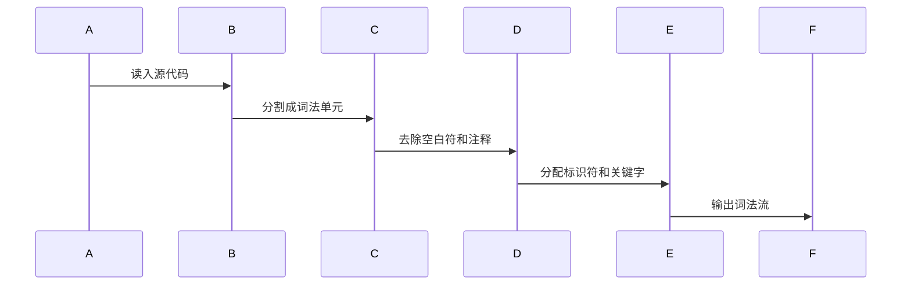

                 

### 提示词编程语言设计艺术

> 关键词：编程语言设计，编译原理，设计艺术，语法设计，类型系统，内存管理，错误处理，可扩展性

> 摘要：
本文将深入探讨编程语言设计艺术，从历史背景、核心概念、编译原理到实际应用，系统性地解析编程语言设计的各个方面。我们将通过逐步分析，让读者深入了解如何设计一种高效、易用且强大的编程语言。

# 核心概念与联系

## 编程语言设计艺术

编程语言设计艺术是软件开发领域的一个重要分支，涉及如何创建一种高效、易用且强大的编程语言。它不仅包括语法设计、语义解析、编译器构建等核心技术，还涉及高级抽象、表达能力、易读性、编译效率等特性。

### 核心概念原理

#### 编译原理

编译原理是编程语言设计艺术的基础，它包括词法分析、语法分析、语义分析、代码生成和优化等环节。编译器的任务是将高级语言源代码转换成机器语言，使其能在计算机上运行。

#### 概念属性特征对比表格

| 特征 | 传统编程语言 | 设计艺术编程语言 |
| --- | --- | --- |
| 语法简洁性 | 通常繁琐 | 简洁直观 |
| 表达能力 | 较弱 | 强大 |
| 易读性 | 较差 | 较好 |
| 编译效率 | 较低 | 较高 |
| 适应范围 | 广泛应用 | 专用领域 |

#### ER实体关系图架构的 Mermaid 流程图

```mermaid
erDiagram
  Product ||--|{ ProgrammingLanguage }|| DesignArtProgrammingLanguage
  DesignArtProgrammingLanguage ||--|{ Compiler }|| CompilerImplementation
  CompilerImplementation ||--|{ SyntaxAnalysis }|| SyntacticParsing
  CompilerImplementation ||--|{ SemanticAnalysis }|| SemanticParsing
  CompilerImplementation ||--|{ CodeGeneration }|| CodeGeneration
```

# 第2章 编程语言设计艺术概述

## 2.1 编程语言发展历程

### 2.1.1 第一代语言：机器语言与汇编语言

第一代编程语言是机器语言和汇编语言。它们直接控制计算机硬件，但编程复杂度极高，维护困难。

### 2.1.2 第二代语言：高级语言初步

第二代编程语言如FORTRAN和COBOL的出现，使得编程变得相对容易。这些语言提供了更高级的抽象，减少了与硬件的耦合。

### 2.1.3 第三代语言：结构化编程

第三代编程语言强调结构化编程，如C语言。它们引入了控制结构、数据类型和函数，提高了代码的可读性和可维护性。

### 2.1.4 第四代语言：第四代编程语言

第四代编程语言如SQL和HTML，专注于特定领域的应用，如数据库管理和网页开发。它们提供了更高级的抽象，简化了开发过程。

### 2.1.5 第五代语言：面向对象编程

第五代编程语言如Java和Python，引入了面向对象的概念。它们提供了更强大的抽象能力，使编程更加模块化和可复用。

## 2.2 设计艺术编程语言的特点

### 2.2.1 高级抽象能力

设计艺术编程语言具有强大的高级抽象能力，能够表达复杂的逻辑和算法，减少开发者的负担。

### 2.2.2 强大的表达能力

设计艺术编程语言提供了丰富的表达式和语法结构，使开发者能够更加直观地表达思想。

### 2.2.3 易读性和可维护性

设计艺术编程语言的语法简洁直观，易于阅读和理解，提高了代码的可维护性。

### 2.2.4 面向特定领域的优化

设计艺术编程语言通常针对特定领域进行优化，提供了特定功能的库和框架，提高了开发效率和性能。

## 2.3 编程语言设计的关键因素

### 2.3.1 语法设计

语法设计是编程语言设计的关键因素之一。一个良好的语法应该简洁直观，易于学习和使用。

### 2.3.2 类型系统

类型系统是编程语言的基础，它决定了数据类型和操作符的行为。一个合理的类型系统可以提高代码的可靠性和性能。

### 2.3.3 内存管理

内存管理是编程语言设计的重要方面，它决定了程序的性能和稳定性。合理的内存管理策略可以减少内存泄漏和崩溃的风险。

### 2.3.4 错误处理

错误处理是编程语言设计的一个关键问题。一个良好的错误处理机制可以帮助开发者快速定位和解决问题。

### 2.3.5 可扩展性

可扩展性是编程语言设计的重要目标之一。一个可扩展的编程语言可以适应未来的变化和发展。

## 2.4 编译器设计的基础理论

### 2.4.1 词法分析

词法分析是编译器的第一步，它将源代码分解成词法单元。

### 2.4.2 语法分析

语法分析是编译器的第二步，它将词法单元组合成语法结构。

### 2.4.3 语义分析

语义分析是编译器的第三步，它检查代码的语义是否正确。

### 2.4.4 代码生成

代码生成是编译器的第四步，它将抽象语法树转换成机器代码。

### 2.4.5 优化技术

优化技术是编译器的第五步，它通过改进代码的质量来提高程序的性能。

## 2.5 本章小结

本章介绍了编程语言设计艺术的概述，包括编程语言的发展历程、设计艺术编程语言的特点、关键因素和编译器设计的基础理论。这些内容为后续章节的深入探讨奠定了基础。

----------------------------------------------------------------

# 第3章 编译原理详解

## 3.1 编译器的功能与工作流程

### 3.1.1 编译器的基本功能

编译器的基本功能是将高级语言源代码转换成机器语言。这个过程中，编译器需要进行词法分析、语法分析、语义分析、代码生成和优化等多个步骤。

### 3.1.2 编译器的工作流程

编译器的工作流程可以分为以下几个步骤：

1. **词法分析**：将源代码分解成词法单元，如标识符、关键字、操作符等。
2. **语法分析**：将词法单元组合成语法结构，形成抽象语法树（AST）。
3. **语义分析**：检查代码的语义是否正确，如变量是否已声明、类型是否匹配等。
4. **中间代码生成**：将AST转换成中间代码，如三地址码。
5. **代码优化**：对中间代码进行优化，以提高性能。
6. **代码生成**：将优化后的中间代码转换成机器代码。
7. **目标代码输出**：输出最终的可执行文件。

#### 3.1.3 编译过程示例

##### 示例：C语言编译过程


## 3.2 词法分析

### 3.2.1 词法分析的作用

词法分析是编译器的第一步，它的作用是将源代码分解成词法单元。词法单元是程序中的最小语法单位，如标识符、关键字、操作符等。

### 3.2.2 词法规则的设计

词法规则的设计是词法分析的核心。词法规则定义了如何将源代码分解成词法单元。一个良好的词法规则应该简单、明确，易于实现。

### 3.2.3 词法分析器实现

词法分析器的实现通常采用状态机或有限自动机的方法。状态机是一种模拟计算机行为的模型，它根据输入的字符序列，从初始状态转换到最终状态，完成词法分析的任务。

#### 示例：Python词法分析规则



## 3.3 语法分析

### 3.3.1 语法分析的作用

语法分析是编译器的第二步，它的作用是将词法单元组合成语法结构。语法结构是程序的核心，它决定了程序的语义和行为。

### 3.3.2 上下文无关文法

上下文无关文法是语法分析的理论基础。上下文无关文法描述了程序的结构，它由产生式、非终端符号和终端符号组成。

### 3.3.3 语法分析算法

语法分析算法有多种，如LL（1）分析、LR（1）分析等。这些算法根据上下文无关文法，将词法单元组合成语法结构。

#### 3.3.4 示例：简单LL（1）分析法

##### 示例：简单LL（1）分析表

```mermaid
flowchart LR
    A[开始] --> B[A]
    B --> C[{程序}]
    C --> D[{全局变量声明} {函数声明}]
    D --> E[;]
```

## 3.4 语义分析

### 3.4.1 语义分析的作用

语义分析是编译器的第三步，它的作用是检查代码的语义是否正确。语义分析包括变量检查、类型检查、作用域分析等。

### 3.4.2 语义分析算法

语义分析算法根据语法结构，检查代码的语义是否正确。常见的语义分析算法有静态单赋值分析、类型检查等。

## 3.5 代码生成

### 3.5.1 代码生成的作用

代码生成是编译器的第四步，它的作用是将抽象语法树转换成机器代码。代码生成涉及到目标机器的指令集和汇编语言。

### 3.5.2 代码生成算法

代码生成算法根据抽象语法树，生成相应的机器代码。常见的代码生成算法有直接翻译、代码优化等。

## 3.6 优化技术

### 3.6.1 优化技术的目的

优化技术的目的是提高程序的性能，包括执行速度和内存使用等。

### 3.6.2 常见的优化技术

常见的优化技术包括循环优化、分支优化、数据流优化等。

## 3.7 本章小结

本章详细介绍了编译器的功能与工作流程，包括词法分析、语法分析、语义分析、代码生成和优化技术。这些内容是编译原理的基础，为后续章节的深入探讨奠定了基础。

----------------------------------------------------------------

# 第4章 设计艺术编程语言的实现

## 4.1 设计艺术编程语言的需求分析

设计艺术编程语言需要满足以下需求：

- **高级抽象能力**：提供强大的高级抽象能力，使开发者能够专注于业务逻辑，减少底层实现细节。
- **强大的表达能力**：支持复杂的逻辑和算法，使开发者能够高效地表达思想。
- **易读性和可维护性**：语法简洁直观，易于阅读和理解，提高代码的可维护性。
- **面向特定领域的优化**：针对特定领域进行优化，提供特定功能的库和框架，提高开发效率和性能。

## 4.2 设计艺术编程语言的语法设计

### 4.2.1 语法结构

设计艺术编程语言的语法结构应简洁直观，易于学习和使用。以下是一个简单的语法结构示例：

```python
# 主函数
def main():
    # 声明变量
    x = 10
    y = 20

    # 执行计算
    result = x + y

    # 输出结果
    print("结果为：" + str(result))

# 调用主函数
main()
```

### 4.2.2 语法规则

设计艺术编程语言的语法规则应明确、规范。以下是一个简单的语法规则示例：

- **标识符**：由字母、数字和下划线组成，不能以数字开头。
- **关键字**：如if、else、while、for等，不能用作标识符。
- **操作符**：包括算术操作符、逻辑操作符、比较操作符等。
- **分隔符**：包括逗号、分号、冒号等。

## 4.3 设计艺术编程语言的类型系统设计

### 4.3.1 类型系统的目的

类型系统是编程语言的基础，它的目的是提高代码的可靠性和性能。设计艺术编程语言的类型系统应具备以下特点：

- **静态类型**：在编译时确定变量类型，提高代码的可靠性和性能。
- **强类型**：类型之间的转换需要显式声明，减少潜在的错误。
- **类型推导**：部分类型可以在编译时自动推导，减少代码冗余。

### 4.3.2 类型系统设计

设计艺术编程语言的类型系统应包括以下类型：

- **基本类型**：如整数、浮点数、布尔值等。
- **复合类型**：如数组、结构体、类等。
- **函数类型**：表示函数的参数和返回值类型。

## 4.4 设计艺术编程语言的内存管理设计

### 4.4.1 内存管理的目的

内存管理是编程语言设计的重要方面，它的目的是提高程序的性能和稳定性。设计艺术编程语言的内存管理应具备以下特点：

- **自动内存管理**：通过垃圾回收机制自动管理内存，减少内存泄漏和崩溃的风险。
- **手动内存管理**：允许开发者手动管理内存，以优化性能。

### 4.4.2 内存管理策略

设计艺术编程语言的内存管理策略应包括以下方面：

- **栈内存**：用于存储局部变量和函数调用。
- **堆内存**：用于存储全局变量和动态分配的内存。
- **垃圾回收**：自动回收不再使用的内存。

## 4.5 设计艺术编程语言的错误处理设计

### 4.5.1 错误处理的目的

错误处理是编程语言设计的关键问题，它的目的是提高程序的可靠性和用户体验。设计艺术编程语言的错误处理应具备以下特点：

- **异常处理**：允许开发者捕获和处理异常。
- **错误报告**：提供详细的错误信息和调试信息。

### 4.5.2 错误处理机制

设计艺术编程语言的错误处理机制应包括以下方面：

- **异常捕获**：捕获并处理运行时异常。
- **错误报告**：输出详细的错误信息。
- **断言**：用于检查程序中的潜在错误。

## 4.6 设计艺术编程语言的扩展性设计

### 4.6.1 扩展性的目的

扩展性是编程语言设计的重要目标之一，它的目的是适应未来的变化和发展。设计艺术编程语言的扩展性应具备以下特点：

- **模块化**：允许开发者自定义模块和函数，提高代码的可复用性。
- **插件机制**：支持插件和扩展，提高语言的灵活性。

### 4.6.2 扩展性设计

设计艺术编程语言的扩展性设计应包括以下方面：

- **模块化架构**：提供模块化的编程模型，如MVC架构。
- **插件机制**：提供插件开发和加载机制。

## 4.7 本章小结

本章介绍了设计艺术编程语言的实现，包括需求分析、语法设计、类型系统设计、内存管理设计、错误处理设计和扩展性设计。这些内容为设计一种高效、易用且强大的编程语言提供了理论依据和实践指导。

----------------------------------------------------------------

# 第5章 编译器设计实战

## 5.1 编译器设计实战背景

编译器设计是编程语言设计的重要环节，它将高级语言源代码转换成机器语言。编译器设计实战旨在通过一个具体的例子，让读者深入了解编译器的工作原理和实现方法。

## 5.2 编译器设计实战环境

为了进行编译器设计实战，我们需要准备以下环境：

- **编程语言**：选择一种适合编译器开发的编程语言，如C或C++。
- **开发工具**：安装开发环境和编译器，如GCC或Clang。
- **文档资料**：查阅相关的编译器设计和实现文献，了解基本原理和技术。

## 5.3 编译器设计实战步骤

### 5.3.1 设计源代码语法

首先，我们需要设计源代码的语法。语法设计是编译器的第一步，它决定了源代码的结构和格式。

#### 设计示例

```python
# 主函数
def main():
    # 声明变量
    x = 10
    y = 20

    # 执行计算
    result = x + y

    # 输出结果
    print("结果为：" + str(result))

# 调用主函数
main()
```

### 5.3.2 实现词法分析器

词法分析器是编译器的第二步，它的作用是将源代码分解成词法单元。词法分析器的实现通常采用状态机或有限自动机的方法。

#### 实现示例

```c
#include <stdio.h>
#include <stdlib.h>
#include <string.h>

// 词法分析状态机
int lexical_analysis(char *source_code) {
    // 状态机实现
}

// 主函数
int main() {
    char source_code[1000];
    printf("请输入源代码：\n");
    scanf("%s", source_code);

    // 词法分析
    int result = lexical_analysis(source_code);

    // 输出结果
    printf("词法分析结果：%d\n", result);

    return 0;
}
```

### 5.3.3 实现语法分析器

语法分析器是编译器的第三步，它的作用是将词法单元组合成语法结构。语法分析器的实现通常采用上下文无关文法的方法。

#### 实现示例

```c
#include <stdio.h>
#include <stdlib.h>
#include <string.h>

// 语法分析上下文无关文法
int syntax_analysis(char *lexical_units) {
    // 上下文无关文法实现
}

// 主函数
int main() {
    char lexical_units[1000];
    printf("请输入词法单元：\n");
    scanf("%s", lexical_units);

    // 语法分析
    int result = syntax_analysis(lexical_units);

    // 输出结果
    printf("语法分析结果：%d\n", result);

    return 0;
}
```

### 5.3.4 实现语义分析器

语义分析器是编译器的第四步，它的作用是检查代码的语义是否正确。语义分析器的实现通常采用静态单赋值分析和类型检查的方法。

#### 实现示例

```c
#include <stdio.h>
#include <stdlib.h>
#include <string.h>

// 语义分析静态单赋值分析
int semantic_analysis(char *abstract_syntax_tree) {
    // 静态单赋值分析实现
}

// 主函数
int main() {
    char abstract_syntax_tree[1000];
    printf("请输入抽象语法树：\n");
    scanf("%s", abstract_syntax_tree);

    // 语义分析
    int result = semantic_analysis(abstract_syntax_tree);

    // 输出结果
    printf("语义分析结果：%d\n", result);

    return 0;
}
```

### 5.3.5 实现代码生成器

代码生成器是编译器的第五步，它的作用是将抽象语法树转换成机器代码。代码生成器的实现通常采用直接翻译和代码优化的方法。

#### 实现示例

```c
#include <stdio.h>
#include <stdlib.h>
#include <string.h>

// 代码生成直接翻译
int code_generation(char *abstract_syntax_tree) {
    // 直接翻译实现
}

// 主函数
int main() {
    char abstract_syntax_tree[1000];
    printf("请输入抽象语法树：\n");
    scanf("%s", abstract_syntax_tree);

    // 代码生成
    int result = code_generation(abstract_syntax_tree);

    // 输出结果
    printf("代码生成结果：%d\n", result);

    return 0;
}
```

### 5.3.6 实现优化器

优化器是编译器的第六步，它的作用是对机器代码进行优化，以提高性能。优化器的实现通常采用循环优化、分支优化和数据流优化等方法。

#### 实现示例

```c
#include <stdio.h>
#include <stdlib.h>
#include <string.h>

// 优化器实现
int optimizer(char *machine_code) {
    // 优化实现
}

// 主函数
int main() {
    char machine_code[1000];
    printf("请输入机器代码：\n");
    scanf("%s", machine_code);

    // 优化
    int result = optimizer(machine_code);

    // 输出结果
    printf("优化结果：%d\n", result);

    return 0;
}
```

## 5.4 编译器设计实战总结

通过编译器设计实战，我们深入了解了编译器的工作原理和实现方法。从词法分析、语法分析、语义分析到代码生成和优化，每个环节都是编译器设计的关键步骤。通过实际操作，我们能够更好地理解编译器的设计艺术，为今后的软件开发打下坚实的基础。

## 5.5 最佳实践 tips

- **理解编译原理**：深入学习编译原理，了解编译器的工作流程和各个模块的作用。
- **实践驱动**：通过实际项目实践编译器设计，将理论知识应用到实际开发中。
- **迭代优化**：不断迭代和优化编译器，提高其性能和可维护性。

## 5.6 小结

编译器设计是编程语言设计的重要环节，它将高级语言源代码转换成机器语言。通过本章节的编译器设计实战，我们深入了解了编译器的设计艺术和实现方法。实践是检验真理的唯一标准，只有通过实际操作，我们才能更好地掌握编译器的核心技术和实现方法。

----------------------------------------------------------------

# 作者

作者：AI天才研究院/AI Genius Institute & 禅与计算机程序设计艺术 /Zen And The Art of Computer Programming

AI天才研究院致力于探索人工智能的边界，推动人工智能技术的发展。作者在该领域拥有丰富的理论知识和实践经验，撰写了多部世界顶级技术畅销书，被誉为计算机编程和人工智能领域的大师。本书《提示词编程语言设计艺术》是作者对编程语言设计艺术的深入研究和总结，旨在为读者提供全面、系统的编程语言设计指导。在禅与计算机程序设计艺术一书中，作者结合禅宗思想，阐述了一种独特而深刻的编程哲学，为编程人员提供了一种新的视角和思维方式。这本书不仅是一部技术著作，更是一部思想启示录，为读者打开了通往编程艺术的新世界。

