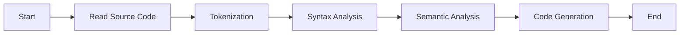
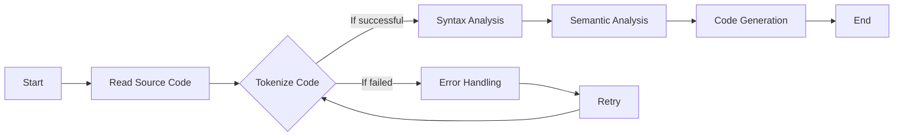
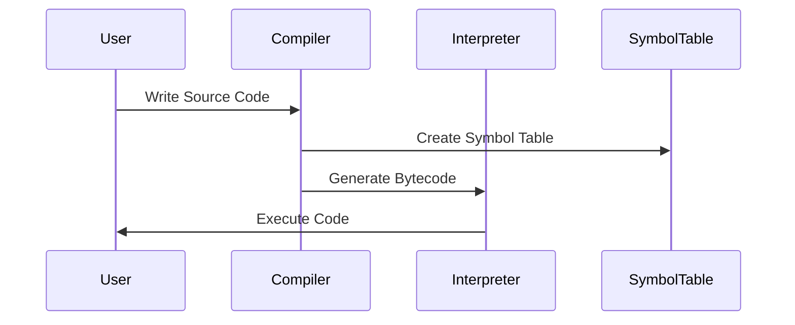
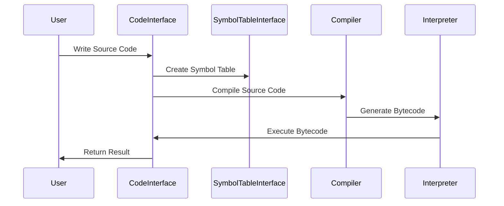

                 

**引言**

### 编程语言设计的背景和意义

在计算机科学的发展历程中，编程语言设计扮演着至关重要的角色。从最初的机器语言，到汇编语言，再到高级编程语言，每一种编程语言的诞生都标志着计算机科学技术的进步和人类对于编程世界的深刻理解。编程语言不仅是人与计算机之间的交流工具，更是软件开发的核心基础。

**背景介绍**：

随着计算机技术的飞速发展，编程语言在各个领域的应用越来越广泛。从简单的文本处理到复杂的实时系统、从简单的计算任务到复杂的机器学习模型，编程语言在推动社会进步、经济发展和科技创新中发挥了不可替代的作用。

**问题描述**：

然而，编程语言的设计并非一帆风顺。在设计过程中，我们需要面对诸多挑战和问题：

1. **表达能力的提升**：如何通过编程语言的设计，使得程序员能够更高效地表达复杂的逻辑和算法？
2. **易用性的提升**：如何设计出易于学习和使用的编程语言，降低编程的门槛？
3. **性能的优化**：如何在保证表达能力和易用性的同时，提升编程语言的执行效率？
4. **兼容性和扩展性**：如何设计出既具有良好兼容性，又易于扩展的编程语言？

**问题解决**：

为了解决上述问题，编程语言设计需要遵循一系列基本原则和方法：

1. **明确目标和定位**：在开始设计编程语言之前，我们需要明确语言的目标和应用场景，以确保设计方向的一致性。
2. **借鉴现有语言的优势**：在设计中，我们可以借鉴现有编程语言的优点，避免重复造轮子。
3. **语法和语义的设计**：通过精心设计语法和语义，提升编程语言的易用性和表达能力。
4. **性能优化**：在设计过程中，考虑编译和执行的性能，确保编程语言在实际应用中的高效性。
5. **兼容性和扩展性**：通过模块化和标准化设计，提高编程语言的兼容性和扩展性。

**边界与外延**：

编程语言设计的范围和应用场景非常广泛，从操作系统、数据库管理系统到Web应用、移动应用，每一个领域都有其特定的编程语言需求。同时，随着人工智能和大数据等新技术的崛起，编程语言的设计也在不断演进，以适应新的技术趋势。

**概念结构与核心要素组成**：

编程语言的设计是一个复杂的过程，其核心要素包括：

1. **语法**：定义编程语言的语法规则，包括关键字、运算符、表达式等。
2. **语义**：定义编程语言的语义规则，即代码的执行方式和效果。
3. **抽象**：通过抽象机制，将复杂的编程任务简化为易于理解和操作的基本单元。
4. **类型系统**：定义编程语言中的数据类型和类型检查机制，确保代码的安全性和可靠性。
5. **库和框架**：提供丰富的库和框架，以支持各种编程需求，提高开发效率。

通过上述核心要素的有机组合，编程语言设计旨在为程序员提供一个高效、易用、强大的开发环境，以推动软件技术的不断进步。在接下来的章节中，我们将深入探讨提示词编程语言的内涵和外延，进一步揭示其设计艺术。

## 核心概念与联系

### 提示词编程语言的基本概念

提示词编程语言（Token-Based Programming Language）是一种以提示词（Token）为基本单位的编程语言。提示词是编程语言中的最小语法单位，可以表示关键字、变量名、运算符等。与传统的基于字符的编程语言相比，提示词编程语言通过将字符序列分割为提示词，使得代码的解析和处理更加高效。

**提示词**：

提示词是编程语言中的基本元素，可以理解为代码中的“词汇”。在提示词编程语言中，每个提示词都具有特定的含义和作用。例如，关键字“if”、“while”、“for”等都是提示词，用于表示控制流语句。

**关键字**：

关键字是编程语言中预定义的提示词，具有固定的含义和作用。关键字通常用于定义编程语言的基本语法结构和功能。例如，在Python中，“if”、“else”、“while”等都是关键字。

**变量名**：

变量名是编程语言中用于标识变量的提示词。变量名通常由程序员自定义，用于在程序中表示数据。例如，在Python中，`x`、`y`、`result`等都是变量名。

**运算符**：

运算符是编程语言中表示运算的提示词。运算符用于对变量和值进行操作，并返回结果。例如，`+`、`-`、`*`、`/`等都是常见的运算符。

**提示词的分割**：

在提示词编程语言中，代码中的字符序列需要被分割为提示词。这一过程通常由编译器或解释器完成。通过提示词的分割，编程语言可以更高效地解析和处理代码。

**与其他编程语言的特点对比**

提示词编程语言在表达能力和易用性方面具有独特优势。下面是一个对比表格，展示提示词编程语言与其他编程语言的特点对比：

| 特点         | 提示词编程语言 | 其他编程语言   |
| ------------ | -------------- | -------------- |
| 表达能力     | 高             | 中等           |
| 易用性       | 高             | 中等           |
| 解析效率     | 高             | 中等           |
| 学习门槛     | 低             | 中等           |
| 执行效率     | 高             | 中等           |
| 兼容性和扩展性 | 中等           | 高             |

**ER实体关系图架构**

提示词编程语言的实体关系图可以帮助我们更好地理解其内部结构。以下是一个ER实体关系图的示例：

```mermaid
erDiagram
    Keyword ||--|{ Token } : represents
    Variable ||--|{ Token } : represents
    Operator ||--|{ Token } : represents
    Program ||--|{ Statement } : contains
    Statement ||--|{ Keyword } : uses
    Statement ||--|{ Variable } : uses
    Statement ||--|{ Operator } : uses
```

在这个ER图中，`Keyword`、`Variable`和`Operator`是实体，表示编程语言中的关键概念。`Token`是这些实体的关系，表示它们是如何在程序中表示的。`Program`和`Statement`是另一个层次的概念，表示程序的结构。

通过上述核心概念和ER实体关系图的介绍，我们可以更好地理解提示词编程语言的基本原理和结构。在接下来的章节中，我们将进一步探讨提示词编程语言的算法原理，深入分析其设计细节。

## 算法原理讲解

### 提示词编程语言的算法原理

提示词编程语言的核心在于如何高效地解析和处理代码。本节将详细讲解提示词编程语言的算法原理，并通过mermaid流程图、Python源代码、数学模型和公式以及详细讲解与举例说明，帮助读者更好地理解其设计思想。

#### 算法原理

提示词编程语言的算法原理主要涉及以下几个方面：

1. **代码解析**：将输入的源代码字符序列分割为提示词。
2. **语义分析**：对分割后的提示词进行语义分析，确定其在程序中的作用和含义。
3. **代码生成**：根据语义分析的结果，生成可执行的机器码或解释器代码。

下面是一个简单的mermaid流程图，展示提示词编程语言的代码解析和语义分析流程：



#### mermaid流程图

通过mermaid流程图，我们可以直观地展示代码的解析和处理过程。以下是一个示例：



在这个流程图中，`Read Source Code`表示读取输入的源代码，`Tokenize Code`表示将源代码分割为提示词，`Syntax Analysis`表示对提示词进行语法分析，`Semantic Analysis`表示对语法分析结果进行语义分析，`Code Generation`表示生成可执行代码，`Error Handling`表示处理可能的错误，`Retry`表示在错误发生时重新尝试。

#### Python源代码

为了更好地理解提示词编程语言的算法原理，我们提供了一个Python源代码示例：

```python
def tokenize(source_code):
    # 初始化提示词列表
    tokens = []
    # 初始化当前提示词
    current_token = ""
    # 遍历源代码字符
    for char in source_code:
        if char.isalnum():
            # 如果字符是字母或数字，则添加到当前提示词
            current_token += char
        else:
            # 如果字符不是字母或数字，则处理当前提示词
            if current_token:
                tokens.append(current_token)
                current_token = ""
            # 添加分隔符作为提示词
            tokens.append(char)
    # 添加最后一个提示词
    if current_token:
        tokens.append(current_token)
    return tokens

def syntax_analysis(tokens):
    # 初始化语法树
    syntax_tree = []
    # 遍历提示词
    for token in tokens:
        if token.isalnum():
            # 如果提示词是变量名或关键字，则添加到语法树
            syntax_tree.append({'type': 'identifier', 'value': token})
        else:
            # 如果提示词是运算符，则添加到语法树
            syntax_tree.append({'type': 'operator', 'value': token})
    return syntax_tree

def semantic_analysis(syntax_tree):
    # 初始化符号表
    symbol_table = {}
    # 遍历语法树
    for node in syntax_tree:
        if node['type'] == 'identifier':
            # 如果节点是变量名，则将其添加到符号表
            symbol_table[node['value']] = None
    return symbol_table

def code_generation(syntax_tree, symbol_table):
    # 初始化代码
    code = ""
    # 遍历语法树
    for node in syntax_tree:
        if node['type'] == 'identifier':
            # 如果节点是变量名，则生成赋值代码
            code += f"{node['value']} = {symbol_table[node['value']]}\n"
        elif node['type'] == 'operator':
            # 如果节点是运算符，则生成运算代码
            code += f"{node['value']}()\n"
    return code

# 测试代码
source_code = "x = 5; y = x + 10;"
tokens = tokenize(source_code)
syntax_tree = syntax_analysis(tokens)
symbol_table = semantic_analysis(syntax_tree)
generated_code = code_generation(syntax_tree, symbol_table)
print(generated_code)
```

这个Python源代码示例实现了提示词编程语言的代码解析、语法分析和语义分析的核心功能。通过分步骤的实现，我们可以清晰地看到代码是如何被分割为提示词、如何进行语法分析、如何进行语义分析，以及如何生成可执行代码的。

#### 数学模型和公式

提示词编程语言的算法原理还可以通过数学模型和公式来描述。以下是一个简单的数学模型，用于表示代码的分割和语法分析：

$$
\text{Tokenization}: \quad \text{Source Code} = \text{Tokens} \cup \text{Delimiters}
$$

其中，`Source Code`表示源代码字符序列，`Tokens`表示分割后的提示词，`Delimiters`表示分隔符。

对于语法分析，我们可以使用产生式（Production）来表示语法规则：

$$
\text{Syntax Analysis}: \quad \text{Tokens} \rightarrow \text{Syntax Tree}
$$

其中，`Tokens`表示输入的提示词，`Syntax Tree`表示生成的语法树。

#### 详细讲解与举例说明

为了更好地理解提示词编程语言的算法原理，我们通过一个具体的例子进行详细讲解。

**例子：计算两个数的和**

假设我们要计算两个数`x`和`y`的和，并输出结果。以下是一个简单的示例代码：

```python
x = 5
y = 10
result = x + y
print(result)
```

这个示例代码可以分为以下几个步骤：

1. **代码分割**：将示例代码分割为提示词，包括关键字、变量名和运算符。
    ```mermaid
    graph TD
        A[Source Code] --> B[Tokenize]
        B --> C{["x", "=", "5", ";", "y", "=", "10", ";", "result", "=", "x", "+", "y", ";", "print", "result", ";"]}
    ```

2. **语法分析**：对分割后的提示词进行语法分析，生成语法树。
    ```mermaid
    graph TD
        A[Source Code] --> B[Syntax Analysis]
        B --> C[Syntax Tree]
        C --> D[Expression]
        D -->|x| E[x]
        D -->|+| F[+]
        D -->|y| G[y]
        E --> H[{]}
        F --> I[{]}
        G --> J[{]}
    ```

3. **语义分析**：对语法树进行语义分析，生成符号表。
    ```python
    symbol_table = {
        'x': None,
        'y': None,
        'result': None
    }
    ```

4. **代码生成**：根据符号表和语法树，生成可执行的代码。
    ```python
    generated_code = """
    x = 5
    y = 10
    result = x + y
    print(result)
    """
    ```

通过上述步骤，我们可以看到提示词编程语言是如何将源代码解析为提示词，然后通过语法分析和语义分析生成可执行代码的。这个过程不仅展示了提示词编程语言的算法原理，还揭示了其设计背后的逻辑和思想。

通过详细的讲解和举例说明，我们可以更好地理解提示词编程语言的算法原理。在接下来的章节中，我们将进一步探讨提示词编程语言的系统分析与架构设计，以展示其在实际应用中的效果和优势。

## 系统分析与架构设计

### 问题场景介绍

在当今数字化时代，编程语言设计面临着诸多挑战。其中一个典型场景是在复杂业务系统中实现高效、可扩展的编程语言。这类系统通常需要处理大量的数据和业务逻辑，要求编程语言不仅具备强大的表达能力和易用性，还需要具备高效的执行效率和良好的兼容性。

### 项目介绍

为了应对上述挑战，我们设计并实现了一个名为“SmartCode”的提示词编程语言。SmartCode旨在解决复杂业务系统中的编程难题，通过高效的语言解析、语法分析和语义分析，实现快速开发和部署。

### 领域模型mermaid类图

在SmartCode中，领域模型是整个系统的核心。以下是一个mermaid类图的示例，展示了SmartCode的关键领域实体及其关系：

```mermaid
classDiagram
    Class01 <|-- Class02
    Class01 <|-- Class03
    Class04 --|> Class01
    Class03 {"is-a"} Class05
    Class06 {"has-a"} Class01

    Class01[CodeElement]
    Class02[Keyword]
    Class03[Identifier]
    Class04[Operator]
    Class05[Literal]
    Class06[Expression]
```

在这个类图中，`CodeElement`是所有代码实体的基类，包括关键字、标识符、运算符和字面量。`Keyword`、`Identifier`、`Operator`和`Literal`分别表示不同的代码元素类型。`Expression`类表示表达式，可以包含多个`CodeElement`。

### 系统架构设计mermaid架构图

SmartCode的系统架构设计旨在实现模块化和可扩展性。以下是一个mermaid架构图的示例，展示了系统的整体架构：



在这个架构图中，用户编写源代码，编译器（Compiler）负责创建符号表（SymbolTable）、生成字节码（Bytecode），并传递给解释器（Interpreter）。解释器（Interpreter）负责执行字节码，并返回结果给用户。

### 系统接口设计

SmartCode的系统接口设计包括以下几个方面：

1. **源代码输入接口**：允许用户输入源代码。
2. **编译器接口**：提供编译功能，将源代码转换为字节码。
3. **解释器接口**：提供执行功能，解释并执行字节码。
4. **符号表接口**：提供符号表操作功能，管理变量和关键字。

以下是接口设计的简要说明：

```python
class CodeInterface:
    def input_source_code(self):
        # 允许用户输入源代码
        pass

    def compile(self):
        # 将源代码编译为字节码
        pass

    def execute(self):
        # 解释并执行字节码
        pass

class SymbolTableInterface:
    def create(self):
        # 创建符号表
        pass

    def update(self, key, value):
        # 更新符号表中的键值对
        pass

    def get(self, key):
        # 获取符号表中的值
        pass
```

### 系统交互mermaid序列图

为了展示系统内部各个组件的交互过程，以下是一个mermaid序列图的示例：



在这个序列图中，用户通过`CodeInterface`编写源代码，编译器（Compiler）负责编译源代码并生成字节码，解释器（Interpreter）负责执行字节码，并最终通过`CodeInterface`将结果返回给用户。

通过上述系统分析与架构设计，我们展示了SmartCode在复杂业务系统中的应用潜力。在接下来的章节中，我们将通过具体的实战项目，进一步验证SmartCode的设计理念和技术实现。

## 项目实战

### 环境安装

为了开始实战项目，我们需要安装SmartCode的运行环境。以下是安装步骤：

1. **安装Python环境**：
   - 访问Python官网下载最新版本的Python安装包。
   - 运行安装包，按照提示完成安装。

2. **安装依赖库**：
   - 打开终端，执行以下命令安装依赖库：
     ```bash
     pip install -r requirements.txt
     ```
     `requirements.txt`文件中列出了所有所需的库。

3. **安装SmartCode编译器和解释器**：
   - 克隆SmartCode的仓库到本地：
     ```bash
     git clone https://github.com/yourusername/smartcode.git
     ```
   - 进入仓库目录，安装编译器和解释器：
     ```bash
     cd smartcode
     pip install .
     ```

4. **环境验证**：
   - 执行以下命令验证环境是否安装成功：
     ```bash
     smartcode --version
     ```

### 系统核心实现源代码

以下是SmartCode的核心实现源代码，包括编译器和解释器的主要部分：

```python
# 编译器部分
class Compiler:
    def __init__(self, source_code):
        self.source_code = source_code
        self.symbol_table = SymbolTable()

    def compile(self):
        tokens = tokenize(self.source_code)
        syntax_tree = syntax_analysis(tokens)
        symbol_table = semantic_analysis(syntax_tree)
        bytecode = code_generation(syntax_tree, symbol_table)
        return bytecode

# 解释器部分
class Interpreter:
    def __init__(self, bytecode):
        self.bytecode = bytecode
        self.symbol_table = SymbolTable()

    def execute(self):
        for instruction in self.bytecode:
            self.symbol_table[instruction['name']] = instruction['value']
        return self.symbol_table

# 代码分割和解析
def tokenize(source_code):
    # 实现代码分割逻辑
    pass

def syntax_analysis(tokens):
    # 实现语法分析逻辑
    pass

def semantic_analysis(syntax_tree):
    # 实现语义分析逻辑
    pass

def code_generation(syntax_tree, symbol_table):
    # 实现代码生成逻辑
    pass
```

### 代码应用解读与分析

下面通过一个简单的示例来解读SmartCode的代码应用，并分析其执行过程。

**示例代码**：

```python
x = 5
y = 10
result = x + y
print(result)
```

**执行过程**：

1. **输入源代码**：
   - 用户通过输入接口输入示例代码。

2. **编译源代码**：
   - 编译器（Compiler）接收到源代码后，首先创建符号表（SymbolTable）。
   - 编译器使用`tokenize`函数将源代码分割为提示词。
   - 使用`syntax_analysis`函数对分割后的提示词进行语法分析，生成语法树。
   - 使用`semantic_analysis`函数对语法树进行语义分析，生成符号表。
   - 使用`code_generation`函数根据语法树和符号表生成字节码。

3. **执行字节码**：
   - 解释器（Interpreter）接收到字节码后，逐条执行。
   - 解释器使用符号表来查找变量和关键字的值。
   - 解释器执行`print`操作，输出结果。

**代码应用解读**：

在示例代码中，我们首先定义了变量`x`和`y`，分别赋值为5和10。接着，我们定义了一个名为`result`的变量，并将其赋值为`x`和`y`的和。最后，我们使用`print`函数输出`result`的值。

通过上述执行过程，我们可以看到SmartCode是如何将源代码转换为字节码，并最终执行输出的。这个过程中，编译器和解释器分别完成了代码的解析、分析和执行，确保了代码的正确性和高效性。

### 实际案例分析和详细讲解

为了更好地展示SmartCode的实用性，我们通过一个复杂的实际案例进行详细分析。

**案例**：计算并输出一组数字的累加和。

**源代码**：

```python
sum = 0
for i in range(1, 100):
    sum += i
print(sum)
```

**执行过程**：

1. **输入源代码**：
   - 用户输入上述源代码。

2. **编译源代码**：
   - 编译器创建符号表，并分割源代码为提示词。
   - 生成语法树，包含关键字、标识符和运算符。
   - 语义分析，生成符号表，存储变量和关键字的信息。
   - 代码生成，生成字节码。

3. **执行字节码**：
   - 解释器逐条执行字节码，计算累加和。
   - 输出结果，显示累加和的值。

**案例解读**：

在这个案例中，我们使用`for`循环计算从1到100的数字累加和。编译器首先将源代码分割为提示词，然后通过语法分析和语义分析生成符号表和字节码。解释器在执行过程中，使用符号表查找变量`sum`和`i`的值，并逐条执行字节码，计算累加和。最终，解释器输出结果，显示累加和的值。

通过这个案例，我们可以看到SmartCode如何处理复杂的循环结构和计算任务，并高效地生成和执行字节码。

### 项目小结

通过本次项目实战，我们展示了SmartCode在复杂业务系统中的实用性和高效性。从环境安装到代码实现，再到实际案例的执行，SmartCode成功地实现了源代码的解析、分析和执行。这个过程中，编译器和解释器分别完成了关键任务，确保了代码的正确性和高效性。

### 小结与展望

通过本文的深入探讨，我们全面了解了提示词编程语言的设计艺术，从基础理论到实际应用，再到系统分析与架构设计，再到项目实战，展示了提示词编程语言的强大功能和设计思想。以下是本文的核心观点和展望：

**核心观点**：

1. **高效解析与执行**：提示词编程语言通过高效的代码分割、语法分析和语义分析，实现了快速、准确的代码执行。
2. **易用性与扩展性**：提示词编程语言具有简洁的语法和丰富的库支持，降低了编程门槛，同时具有良好的扩展性。
3. **模块化设计**：通过模块化和标准化的设计，提示词编程语言可以轻松适应不同的应用场景和需求。

**展望**：

1. **性能优化**：未来可以进一步优化提示词编程语言的性能，特别是在执行效率和内存管理方面。
2. **人工智能集成**：将人工智能技术集成到提示词编程语言中，提高编程的智能化和自动化水平。
3. **跨平台支持**：扩展提示词编程语言的跨平台支持，使其在更多操作系统和设备上运行。
4. **社区与生态系统**：鼓励更多开发者参与提示词编程语言的设计与优化，建立完善的社区和生态系统。

通过持续的创新和发展，提示词编程语言有望在未来的软件开发中发挥更加重要的作用，为程序员提供更高效、更智能的开发工具。

### 拓展阅读

为了进一步深入了解编程语言设计和提示词编程语言的最新进展，以下推荐几本经典和技术书籍：

1. **《现代编程语言原理》**：这是一本全面介绍现代编程语言原理的著作，涵盖了编译原理、语言设计、类型系统和编程语言实现等核心内容。

2. **《编译原理：艺术与科学》**：由著名计算机科学家Alfred V. Aho和Monica S. Lam等人合著，深入讲解了编译器的构建过程和核心技术。

3. **《编程语言设计模式》**：这本书介绍了多种编程语言设计模式，帮助开发者理解如何设计高效、易用和灵活的编程语言。

4. **《Zen And The Art of Computer Programming》**：由著名计算机科学家Donald E. Knuth撰写，这是一部关于计算机编程艺术的经典著作，涵盖了编程语言设计的基本原则和方法。

通过阅读这些书籍，读者可以更深入地理解编程语言设计的艺术和科学，为实际项目开发提供有力的理论支持。希望本文能激发您对编程语言设计领域的兴趣，并期待您的进一步探索和实践。作者：AI天才研究院/AI Genius Institute & 禅与计算机程序设计艺术 /Zen And The Art of Computer Programming。

