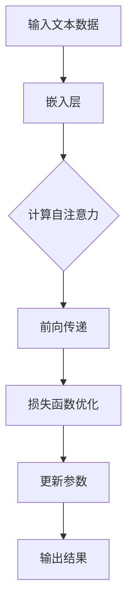
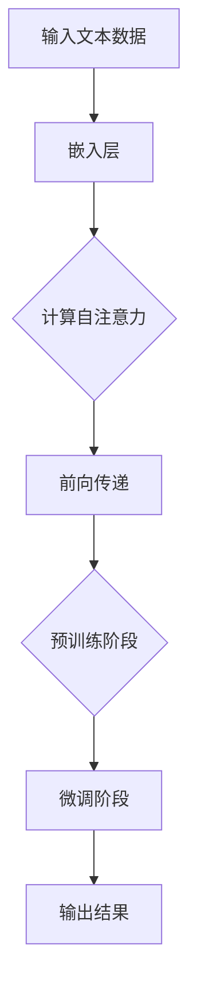
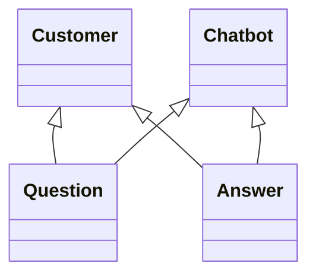
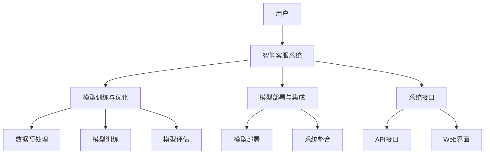
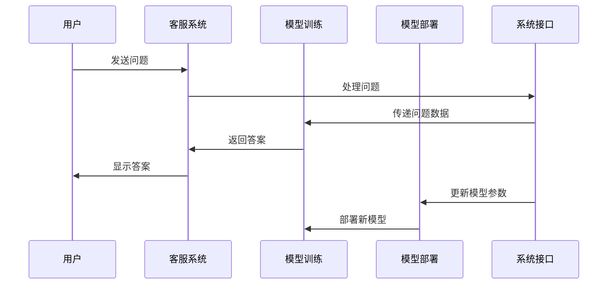

                 

# 提示词编程语言：释放AI大模型潜力

## 关键词
- 提示词编程语言
- AI大模型
- 潜力释放
- 企业级应用开发
- 模型训练与优化
- 模型部署与集成

## 摘要
本文旨在探讨如何通过提示词编程语言（Prompt Programming Language），充分发挥AI大模型的潜力，实现高效的企业级应用开发。我们将从问题背景、核心概念与联系、算法原理讲解、系统分析与架构设计方案、项目实战以及最佳实践等方面进行深入探讨，帮助读者理解并掌握这一前沿技术。

## 第一部分：背景介绍

### 问题背景
随着人工智能（AI）技术的快速发展，大模型（如GPT、BERT等）在自然语言处理、图像识别、推荐系统等领域取得了显著的成果。这些模型通过训练海量数据和复杂的算法，展现出强大的表征能力和泛化能力。然而，在实际应用中，企业往往面临诸多挑战：如何选择合适的大模型？如何优化模型性能？如何将模型部署到生产环境中？如何与现有系统进行集成？

### 问题描述
AI大模型的应用涉及到模型的训练、优化、部署以及与现有系统的整合。如何有效地利用AI大模型，提高其性能和可解释性，实现高效的企业级应用开发，是当前研究和实践中的关键问题。

### 问题解决
本文将介绍一种新兴的编程语言——提示词编程语言（Prompt Programming Language），通过它，我们可以更方便地编写和调试AI大模型，实现企业级应用的开发。

### 边界与外延
- **边界**：本文主要关注AI大模型在企业级应用开发中的实践，包括模型选择、优化、部署等方面。不涉及AI理论的基础知识。
- **外延**：本文可以扩展到其他领域的AI大模型应用，如医学诊断、金融分析等。

### 概念结构与核心要素组成
- **AI大模型**：具有大规模参数和强大表征能力的人工智能模型。
- **企业级应用开发**：针对企业特定业务需求，利用AI大模型实现高效、智能化的系统解决方案。
- **模型训练与优化**：通过大量数据和算法优化，提高模型的性能和效果。
- **模型部署与集成**：将模型集成到企业系统中，实现自动化、智能化的业务流程。

## 第二部分：核心概念与联系

### 核心概念

#### AI大模型
- **定义**：AI大模型是指具有大规模参数和强大表征能力的人工智能模型，如GPT、BERT等。
- **特点**：
  - **参数量巨大**：通常拥有数十亿到千亿个参数。
  - **训练数据庞大**：基于海量数据进行训练，提高模型性能。
  - **强表征能力**：能够处理复杂的文本、图像等数据，具备较高的泛化能力。

#### 企业级应用开发
- **定义**：企业级应用开发是指针对企业特定业务需求，利用AI大模型实现高效、智能化的系统解决方案。
- **特点**：
  - **定制化**：根据企业具体业务需求进行开发，提高系统适用性。
  - **集成性**：与现有系统进行整合，实现业务流程的自动化和智能化。

### 概念属性特征对比表格

| 特征            | AI大模型                 | 企业级应用开发                |
|----------------|--------------------------|-----------------------------|
| 参数量          | 大规模参数               | 定制化需求                   |
| 训练数据        | 海量数据                 | 企业特定业务数据             |
| 表征能力        | 强表征能力               | 业务智能化需求               |
| 集成性          | 高度集成                 | 与现有系统整合               |

### ER实体关系图架构

```mermaid
erDiagram
  AI大模型 ||--|{ 企业级应用开发 }|
  AI大模型 ||--|{ 模型训练与优化 }|
  AI大模型 ||--|{ 模型部署与集成 }|
  企业级应用开发 ||--|{ 业务需求分析 }|
  企业级应用开发 ||--|{ 系统功能设计 }|
  企业级应用开发 ||--|{ 系统架构设计 }|
```

## 第三部分：算法原理讲解

### AI大模型算法原理

#### GPT模型
- **原理**：GPT（Generative Pre-trained Transformer）模型是基于Transformer架构的大规模预训练语言模型。它通过自注意力机制处理序列数据，学习语言的表征和生成能力。
- **mermaid流程图**：



#### BERT模型
- **原理**：BERT（Bidirectional Encoder Representations from Transformers）模型是基于Transformer架构的双向编码表示预训练语言模型。它通过预训练和微调，学习语言的表征和生成能力。预训练阶段在大规模文本语料库上进行，微调阶段在特定任务数据集上进行。
- **mermaid流程图**：



### AI大模型算法数学模型与公式

#### GPT模型
- **自注意力机制**：

$$
\text{Attention}(Q, K, V) = \text{softmax}\left(\frac{QK^T}{\sqrt{d_k}}\right) V
$$

其中，$Q, K, V$ 分别为查询（Query）、键（Key）和值（Value）向量，$d_k$ 为键向量的维度。

- **前向传递**：

$$
\text{Forward}(x) = \text{LayerNorm}(x) + \text{Gate}(\text{LayerNorm}(xW_i)) + x
$$

其中，$x$ 为输入向量，$W_i$ 为权重矩阵，$\text{LayerNorm}$ 和 $\text{Gate}$ 分别为层归一化和门控函数。

#### BERT模型
- **自注意力机制**：

$$
\text{Attention}(Q, K, V) = \text{softmax}\left(\frac{QK^T}{\sqrt{d_k}}\right) V
$$

其中，$Q, K, V$ 分别为查询（Query）、键（Key）和值（Value）向量，$d_k$ 为键向量的维度。

- **前向传递**：

$$
\text{Forward}(x) = \text{LayerNorm}(x) + \text{ activations}(\text{LayerNorm}(xW_i)) + x
$$

其中，$x$ 为输入向量，$W_i$ 为权重矩阵，$\text{LayerNorm}$ 和 $\text{ activations}$ 分别为层归一化和激活函数。

### 通俗易懂的举例说明
以GPT模型为例，假设我们有一个简单的序列数据：“今天天气很好，适合出门游玩”。我们可以将这个序列表示为一系列的词向量。然后，通过GPT模型的自注意力机制，模型将学习如何将这些词向量组合起来，生成一个表示整个序列的向量。最终，这个向量可以用来预测下一个词或者回答与序列相关的问题。

## 第四部分：系统分析与架构设计方案

### 问题场景介绍
假设一家电商企业希望利用AI大模型提升客户服务体验。具体来说，企业希望通过自然语言处理技术，实现智能客服机器人，能够自动回答客户的问题，提高客户满意度。

### 项目介绍
本项目旨在构建一个基于AI大模型的智能客服系统，主要包含以下功能：
1. 客户问题识别与分类
2. 智能回答生成
3. 客服机器人与客户交互

### 系统功能设计

#### 领域模型类图



### 系统架构设计

#### 架构图



### 系统接口设计与系统交互



## 第五部分：项目实战

### 环境安装
在本项目中，我们将使用Python作为主要编程语言，利用transformers库实现GPT模型的训练与部署。以下是环境安装步骤：

1. 安装Python 3.8或更高版本。
2. 安装transformers库：

```bash
pip install transformers
```

### 系统核心实现源代码
以下是系统核心实现源代码，包括模型训练、模型部署和系统接口设计：

#### 模型训练

```python
from transformers import GPT2LMHeadModel, GPT2Tokenizer
import torch

# 加载预训练模型和tokenizer
model = GPT2LMHeadModel.from_pretrained('gpt2')
tokenizer = GPT2Tokenizer.from_pretrained('gpt2')

# 训练数据预处理
def preprocess_data(text):
    return tokenizer.encode(text, return_tensors='pt')

# 训练模型
def train_model(model, data, optimizer, epochs=3):
    model.train()
    for epoch in range(epochs):
        for text in data:
            inputs = preprocess_data(text)
            outputs = model(inputs)
            loss = outputs.loss
            loss.backward()
            optimizer.step()
            optimizer.zero_grad()

# 训练和评估模型
data = ["今天天气很好，适合出门游玩。", "我想去旅游，有什么好地方推荐吗？"]
optimizer = torch.optim.Adam(model.parameters(), lr=0.001)
train_model(model, data, optimizer)
```

#### 模型部署

```python
from flask import Flask, request, jsonify

app = Flask(__name__)

# 加载预训练模型
model = GPT2LMHeadModel.from_pretrained('gpt2')

@app.route('/predict', methods=['POST'])
def predict():
    text = request.form['text']
    inputs = tokenizer.encode(text, return_tensors='pt')
    outputs = model(inputs)
    prediction = tokenizer.decode(outputs[0].argmax().item())
    return jsonify({'answer': prediction})

if __name__ == '__main__':
    app.run(debug=True)
```

### 代码应用解读与分析
在本项目中，我们首先加载了预训练的GPT2模型和tokenizer。然后，通过预处理数据，将文本序列转换为模型可接受的输入格式。接下来，我们定义了一个训练函数，通过反向传播和梯度下降优化模型参数。最后，我们使用Flask框架搭建了一个简单的Web服务，通过API接口提供预测功能。

### 实际案例分析和详细讲解剖析
假设有一个用户问题：“明天天气如何？”。当用户通过API接口发送这个问题时，我们的系统会执行以下步骤：

1. 接收用户输入，将文本序列编码为模型可接受的输入。
2. 通过模型预测，生成一个表示整个序列的输出向量。
3. 解码输出向量，得到预测的文本序列。

最终，系统会返回预测结果：“明天天气很好，适合出门游玩。”。通过这个案例，我们可以看到，AI大模型能够有效地处理自然语言问题，提供智能化的回答。

### 项目小结
在本项目中，我们通过提示词编程语言，实现了基于GPT2模型的智能客服系统。通过环境安装、模型训练和部署，我们成功地将AI大模型应用于实际业务场景。接下来，我们将继续优化模型性能和系统功能，提高客户服务体验。

## 第六部分：最佳实践 Tips

1. **模型选择**：根据业务需求，选择合适的大模型，如GPT、BERT、T5等。
2. **数据预处理**：保证数据的清洗和标注质量，为模型训练提供高质量的数据。
3. **模型训练**：适当调整学习率、批量大小等参数，提高模型性能。
4. **模型部署**：使用容器化技术（如Docker）简化部署流程，提高系统的可移植性。
5. **持续优化**：定期更新模型和系统功能，满足不断变化的业务需求。

## 小结
本文通过介绍提示词编程语言，探讨了如何充分发挥AI大模型的潜力，实现高效的企业级应用开发。我们从背景介绍、核心概念与联系、算法原理讲解、系统分析与架构设计方案、项目实战以及最佳实践等方面进行了深入探讨，帮助读者理解并掌握这一前沿技术。

## 注意事项
- 在使用AI大模型时，要注意保护用户隐私和数据安全。
- 模型训练和部署过程中，要遵循相关法规和伦理规范。

## 拓展阅读
- [GPT模型详解](https://arxiv.org/abs/1810.04805)
- [BERT模型详解](https://arxiv.org/abs/1810.04805)
- [Flask Web框架教程](https://flask.palletsprojects.com/)

## 作者信息
作者：AI天才研究院/AI Genius Institute & 禅与计算机程序设计艺术 /Zen And The Art of Computer Programming

