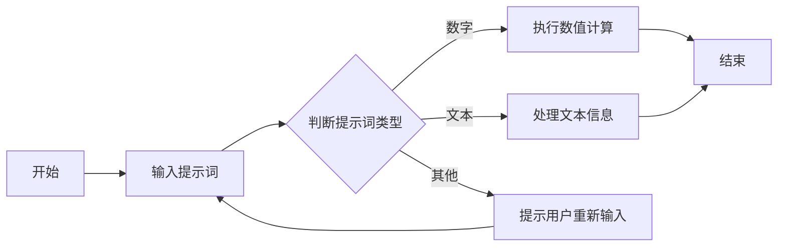

                 

# 提示词编程：AI时代的新型人机交互范式

## 关键词：提示词编程，人工智能，人机交互，交互范式，AI时代

## 摘要：
本文深入探讨了AI时代的新型人机交互范式——提示词编程。首先，我们概述了传统人机交互的局限性以及AI时代对交互方式的变革需求。接着，详细介绍了提示词编程的概念、原理、技术架构和关键流程。通过对比分析提示词编程与其他人机交互技术的优劣，展望了其发展前景。本文旨在为读者提供关于提示词编程的全面理解，促进其在实际应用中的推广和发展。

## 第一部分：背景介绍

### 第1章：提示词编程：AI时代的新型人机交互范式

#### 1.1 问题背景

##### 1.1.1 传统人机交互方式的局限性
传统的人机交互方式主要依赖于图形用户界面（GUI）、命令行界面（CLI）等。这些方式在一定程度上提高了用户操作的便捷性，但仍然存在以下局限性：
- **操作复杂**：特别是对于技术不熟练的用户，命令行界面操作复杂，难以掌握。
- **学习成本高**：图形用户界面虽然直观，但操作步骤繁多，需要用户花费较长时间学习。
- **交互受限**：传统的交互方式往往依赖于特定的界面和设备，难以实现跨平台和跨设备的交互。

##### 1.1.2 AI时代下的交互需求变革
随着人工智能技术的迅速发展，人们对人机交互的需求发生了显著变化：
- **自然交互**：用户希望与机器进行更为自然、流畅的对话，类似于与人类交流。
- **智能化响应**：用户期望系统能够根据上下文和需求提供智能化、个性化的服务。
- **便捷操作**：用户希望操作过程更加简便，无需复杂的步骤和操作。

##### 1.1.3 提示词编程的概念与价值
提示词编程是一种新型的交互范式，通过向系统输入简单的提示词，系统自动执行相应的任务。其核心在于将复杂的操作过程简化为简单的文字指令，大大降低了用户的操作难度，提高了交互效率。提示词编程的价值主要体现在以下几个方面：
- **简化操作**：用户无需掌握复杂的界面和命令，通过简单的提示词即可完成任务。
- **智能化响应**：系统根据提示词自动识别任务类型，提供智能化响应，提高用户体验。
- **跨平台兼容**：提示词编程具有跨平台的特性，用户可以在不同的设备和平台上使用相同的交互方式。

#### 1.2 问题描述

##### 1.2.1 人机交互面临的挑战
在传统的人机交互方式中，用户需要通过点击、拖拽、输入命令等方式与系统进行交互，这不仅操作繁琐，而且用户体验不佳。在AI时代，人机交互面临以下挑战：
- **多样性需求**：用户需求日益多样化，传统交互方式难以满足。
- **智能化需求**：用户期望系统能够具备智能化的响应能力，提供个性化的服务。
- **操作便捷性**：用户希望交互过程更加简单、便捷。

##### 1.2.2 提示词编程在解决交互难题中的应用
提示词编程通过将复杂的操作过程简化为简单的文字指令，有效地解决了传统人机交互的难题。其应用主要体现在以下几个方面：
- **命令简化**：用户只需输入简单的提示词，即可触发系统执行复杂的操作。
- **上下文理解**：系统通过上下文理解，自动识别用户的意图，提供智能化响应。
- **跨平台兼容**：提示词编程具有跨平台特性，用户可以在不同设备和平台上使用相同的交互方式。

##### 1.2.3 提示词编程的优势与局限
提示词编程在解决人机交互难题方面具有显著优势，但也存在一定的局限：
- **优势**：
  - 简化操作：通过简单的文字指令，用户无需掌握复杂的界面和命令。
  - 智能化响应：系统根据提示词自动识别任务类型，提供智能化响应。
  - 跨平台兼容：提示词编程具有跨平台的特性，适用于不同设备和平台。
- **局限**：
  - 提示词限制：提示词的表述可能存在一定的局限性，无法完全覆盖所有用户需求。
  - 系统学习：系统需要不断学习和优化，以适应不同用户的交互习惯和需求。

#### 1.3 问题解决

##### 1.3.1 提示词编程的基本原理
提示词编程的基本原理是通过自然语言处理技术，将用户的简单提示词转化为机器可执行的指令，从而实现人机交互。其核心包括以下几个方面：
- **自然语言理解**：系统通过自然语言处理技术，解析用户的提示词，理解其意图。
- **任务识别与执行**：系统根据提示词的意图，识别相应的任务类型，并自动执行。
- **反馈与优化**：系统根据用户的反馈，不断优化提示词编程的体验。

##### 1.3.2 提示词编程的模型与算法
提示词编程涉及到多种模型和算法，包括自然语言处理、机器学习、深度学习等。以下是一些常用的模型与算法：
- **词嵌入模型**：将提示词转化为向量表示，方便后续处理。
- **序列到序列模型**：用于将提示词转换为相应的操作指令。
- **注意力机制**：用于提高模型对提示词的理解能力，更好地捕捉上下文信息。
- **强化学习**：用于优化系统的交互体验，提高任务执行的准确性。

##### 1.3.3 提示词编程的实现方法
提示词编程的实现方法主要包括以下几个方面：
- **数据收集与预处理**：收集大量的用户交互数据，进行预处理，以便于后续训练。
- **模型训练与优化**：使用机器学习和深度学习算法，对模型进行训练和优化，以提高交互效果。
- **系统部署与维护**：将训练好的模型部署到服务器，实现实时交互，并进行持续维护和更新。

#### 1.4 边界与外延

##### 1.4.1 提示词编程的应用领域
提示词编程具有广泛的应用领域，包括但不限于以下方面：
- **智能家居**：用户可以通过简单的提示词，控制家居设备的开关、调节等。
- **智能助手**：用户可以通过提示词与智能助手进行交流，获取信息、执行任务。
- **企业办公**：用户可以通过提示词完成文档处理、日程管理、任务分配等办公任务。
- **医疗健康**：用户可以通过提示词与医疗系统交互，获取健康咨询、预约挂号等服务。

##### 1.4.2 提示词编程与其他人机交互技术的对比
提示词编程与传统的人机交互技术相比，具有以下优势：
- **操作简便**：用户只需输入简单的提示词，即可完成任务。
- **跨平台兼容**：提示词编程适用于不同设备和平台。
- **智能化响应**：系统可以根据提示词提供智能化、个性化的服务。

与智能语音助手相比，提示词编程具有以下优势：
- **指令精准**：提示词编程通过简单的文字指令，可以更准确地表达用户意图。
- **上下文理解**：提示词编程可以更好地理解用户的上下文信息，提供更个性化的服务。

##### 1.4.3 提示词编程的发展趋势
随着人工智能技术的不断发展，提示词编程将呈现出以下发展趋势：
- **自然语言理解能力提升**：通过深度学习和强化学习等技术，提升系统的自然语言理解能力，提供更精准的交互体验。
- **跨平台兼容性增强**：随着物联网和移动设备的发展，提示词编程将具有更强的跨平台兼容性。
- **智能化水平提升**：通过大数据和机器学习技术，提升系统的智能化水平，提供更个性化的服务。

#### 1.5 概念结构与核心要素组成

##### 1.5.1 提示词编程的核心概念
提示词编程的核心概念包括：
- **提示词**：用户输入的文字指令，用于指示系统执行特定任务。
- **自然语言处理**：将用户的简单提示词转化为机器可执行的指令。
- **任务执行**：系统根据提示词的意图，执行相应的任务。

##### 1.5.2 提示词编程的技术架构
提示词编程的技术架构主要包括：
- **自然语言处理模块**：负责解析用户的提示词，理解其意图。
- **任务执行模块**：根据提示词的意图，执行相应的任务。
- **反馈与优化模块**：根据用户的反馈，优化系统的交互体验。

##### 1.5.3 提示词编程的关键流程
提示词编程的关键流程包括：
- **提示词输入**：用户输入简单的提示词。
- **意图理解**：系统解析提示词，理解用户的意图。
- **任务执行**：系统根据意图执行相应的任务。
- **反馈与优化**：系统根据用户的反馈，优化交互体验。

#### 1.6 本章小结
本章从背景介绍、问题分析、解决方案等多个角度，全面探讨了提示词编程这一新型人机交互范式。通过本章的学习，读者可以了解到提示词编程的概念、原理、技术架构和关键流程，为后续章节的深入学习打下基础。

## 第二部分：核心概念与联系

### 第2章：提示词编程原理

#### 2.1 提示词编程原理
提示词编程是一种基于自然语言处理和人工智能技术的交互范式，通过用户输入简单的提示词，系统自动执行相应的任务。其核心原理包括以下几个方面：

##### 2.1.1 提示词的定义与作用
提示词是指用户输入的简单文字指令，用于指示系统执行特定任务。提示词具有以下作用：
- **简化操作**：用户无需掌握复杂的界面和命令，通过简单的提示词即可完成任务。
- **提高效率**：系统可以根据提示词自动识别任务类型，快速执行操作。
- **个性化服务**：系统可以根据用户的交互习惯和需求，提供个性化的服务。

##### 2.1.2 提示词编程的模型原理
提示词编程的模型原理主要包括以下几个方面：
- **自然语言处理**：通过自然语言处理技术，解析用户的提示词，理解其意图。
- **任务识别与执行**：根据提示词的意图，识别相应的任务类型，并自动执行。
- **反馈与优化**：根据用户的反馈，不断优化系统的交互体验。

##### 2.1.3 提示词编程的关键算法
提示词编程涉及到多种关键算法，包括自然语言处理、机器学习、深度学习等。以下是一些常用的算法：
- **词嵌入算法**：将提示词转化为向量表示，方便后续处理。
- **序列到序列模型**：用于将提示词转换为相应的操作指令。
- **注意力机制**：用于提高模型对提示词的理解能力，更好地捕捉上下文信息。
- **强化学习**：用于优化系统的交互体验，提高任务执行的准确性。

#### 2.2 提示词编程技术架构
提示词编程的技术架构主要包括以下几个关键组件：

##### 2.2.1 提示词编程的系统架构
提示词编程的系统架构主要包括：
- **前端界面**：用户输入提示词的界面。
- **后端服务器**：处理提示词的解析、任务执行和反馈等操作。
- **数据库**：存储用户的交互数据，用于模型的训练和优化。

##### 2.2.2 提示词编程的关键组件
提示词编程的关键组件包括：
- **自然语言处理组件**：负责解析用户的提示词，理解其意图。
- **任务执行组件**：根据提示词的意图，执行相应的任务。
- **反馈与优化组件**：根据用户的反馈，优化系统的交互体验。

##### 2.2.3 提示词编程的数据处理流程
提示词编程的数据处理流程主要包括以下几个步骤：
- **数据收集**：收集用户的交互数据，包括提示词和执行结果。
- **数据预处理**：对收集到的数据进行清洗和预处理，以便于后续训练。
- **模型训练**：使用机器学习和深度学习算法，对模型进行训练和优化。
- **模型部署**：将训练好的模型部署到服务器，实现实时交互。

#### 2.3 提示词编程关键流程
提示词编程的关键流程包括以下几个步骤：

##### 2.3.1 提示词的生成与处理
- **提示词输入**：用户在前端界面输入简单的提示词。
- **提示词解析**：后端服务器接收提示词，进行解析，理解用户的意图。

##### 2.3.2 提示词的传递与理解
- **意图识别**：系统根据提示词的内容，识别用户意图。
- **任务分配**：系统根据意图，分配相应的任务。

##### 2.3.3 提示词的反馈与优化
- **任务执行**：系统执行分配的任务。
- **用户反馈**：用户对任务执行结果进行反馈。
- **模型优化**：系统根据用户反馈，优化模型的交互体验。

#### 2.4 概念属性特征对比表格

| 特征名称 | 描述 |
|----------|------|
| 提示词   | 用户输入的简单文字指令，用于指示系统执行特定任务 |
| 编程     | 通过自然语言处理技术，将用户的简单提示词转化为机器可执行的指令 |
| 交互     | 用户与系统之间的互动过程，包括提示词的输入、任务执行和反馈等 |

#### 2.5 ER实体关系图架构

```mermaid
erDiagram
  人机交互 ||--|{ 提示词 }
  提示词 ||--|{ 编程 }
  编程 ||--|{ 交互 }
```

#### 2.6 本章小结
本章详细介绍了提示词编程的核心概念、技术架构和关键流程，为读者提供了对提示词编程的全面理解。通过本章的学习，读者可以了解到提示词编程的基本原理，以及其在实际应用中的关键组件和流程。

## 第三部分：算法原理讲解

### 第3章：算法原理讲解

#### 3.1 算法原理概述
提示词编程的算法原理主要包括以下几个方面：

##### 3.1.1 提示词编程算法的基本原理
提示词编程算法的基本原理是通过自然语言处理技术，将用户的简单提示词转化为机器可执行的指令。具体流程如下：
- **自然语言理解**：系统通过自然语言处理技术，解析用户的提示词，理解其意图。
- **任务识别与执行**：系统根据提示词的意图，识别相应的任务类型，并自动执行。
- **反馈与优化**：系统根据用户的反馈，不断优化交互体验。

##### 3.1.2 提示词编程算法的分类
提示词编程算法可以根据不同的分类标准进行划分，常见的分类方法包括：
- **基于规则的方法**：通过预设的规则，将提示词转化为相应的操作指令。
- **基于模型的方法**：使用机器学习或深度学习模型，自动学习用户的交互习惯，提供更准确的交互体验。
- **混合方法**：结合基于规则和基于模型的方法，实现更灵活、更准确的交互。

##### 3.1.3 提示词编程算法的核心特点
提示词编程算法的核心特点包括：
- **自然语言理解能力**：系统需要具备强大的自然语言理解能力，能够准确解析用户的提示词。
- **任务识别与执行能力**：系统需要能够根据提示词的意图，准确识别任务类型，并执行相应的操作。
- **反馈与优化能力**：系统需要能够根据用户的反馈，不断优化交互体验，提供更个性化的服务。

#### 3.2 算法流程图
提示词编程的算法流程图如下所示：



#### 3.3 Python源代码实现
以下是一个简单的Python示例，演示了如何实现提示词编程算法：

```python
def process_prompt(prompt):
    try:
        # 尝试执行数值计算
        result = float(prompt)
        return f"计算结果：{result}"
    except ValueError:
        try:
            # 尝试处理文本信息
            if "你好" in prompt:
                return "你好！有什么可以帮助你的？"
            else:
                return "抱歉，无法理解你的指令。"
        except ValueError:
            # 提示用户重新输入
            return "请输入有效的提示词。"

# 测试代码
prompt = input("请输入提示词：")
print(process_prompt(prompt))
```

#### 3.4 算法原理详细讲解

##### 3.4.1 提示词类型判断的数学模型
提示词类型判断可以通过分类模型来实现。一个简单的数学模型如下：

$$
f(prompt) =
\begin{cases}
    1 & \text{如果 prompt 是数字} \\
    2 & \text{如果 prompt 是文本信息} \\
    0 & \text{如果 prompt 是其他类型}
\end{cases}
$$

该模型通过判断提示词是否为数字或文本信息，来确定其类型。在实际应用中，可以使用更复杂的分类模型，如支持向量机（SVM）、随机森林（Random Forest）等，以提高分类的准确性。

##### 3.4.2 提示词的意图理解
提示词的意图理解是提示词编程算法的核心。一个简单的意图理解模型可以如下定义：

$$
Intent = f(NLP_Result)
$$

其中，$NLP_Result$ 是自然语言处理的结果，例如词嵌入向量。$f$ 函数可以根据词嵌入向量的特征，判断提示词的意图。在实际应用中，可以使用神经网络模型，如卷积神经网络（CNN）或循环神经网络（RNN），来更好地理解提示词的意图。

##### 3.4.3 提示词编程算法的优化
提示词编程算法的优化主要关注两个方面：一是提高自然语言理解能力，二是提高任务执行的准确性。

- **自然语言理解能力**：可以通过增加训练数据、调整模型参数、使用预训练模型等方法，提高模型的自然语言理解能力。
- **任务执行的准确性**：可以通过引入反馈机制、使用强化学习等方法，提高模型在任务执行过程中的准确性。

##### 3.4.4 实例说明
以下是一个简单的实例，说明如何使用提示词编程算法执行任务：

- **输入提示词**：“明天天气如何？”
- **自然语言理解**：系统通过自然语言处理技术，将提示词转化为词嵌入向量。
- **意图理解**：系统根据词嵌入向量的特征，判断意图为查询天气信息。
- **任务执行**：系统调用天气查询接口，获取明天的天气信息。
- **反馈**：系统将天气信息返回给用户。

通过这个实例，可以看出提示词编程算法是如何工作的。在实际应用中，提示词编程算法可以根据具体的任务需求，进行灵活调整和优化。

#### 3.5 本章小结
本章详细介绍了提示词编程算法的原理、流程、实现方法以及优化策略。通过本章的学习，读者可以了解到提示词编程算法的基本原理和实现方法，为实际应用中的交互设计提供参考。同时，本章还探讨了提示词编程算法的优化方向，为未来研究提供了启示。

