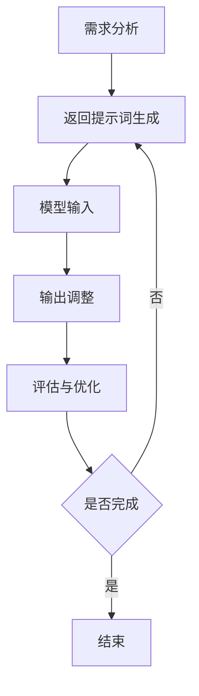
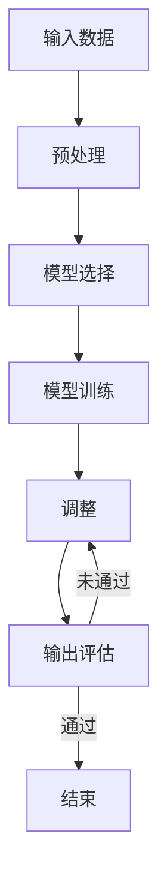
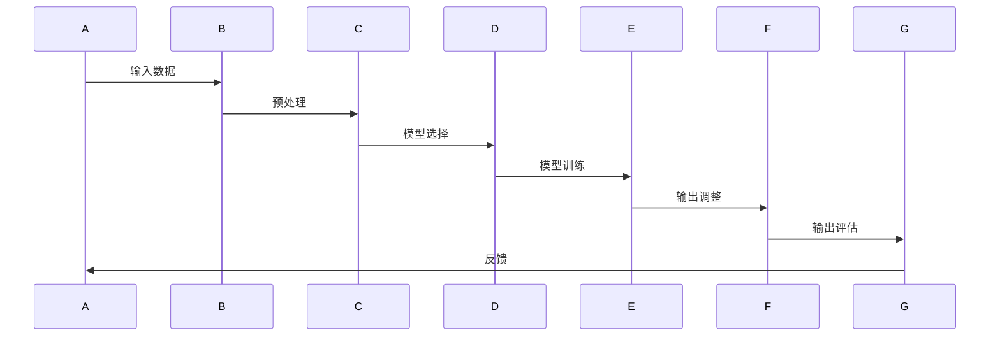
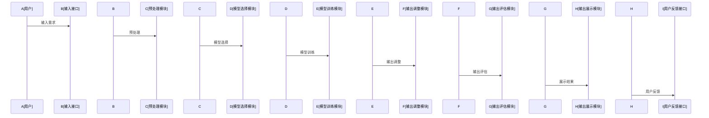

                 

### 引言

#### 1.1 问题背景

随着人工智能（AI）技术的飞速发展，计算机编程正经历着一场革命性的变革。传统的编程范式在处理复杂问题、特别是涉及大规模数据处理和智能决策的场景时，暴露出诸多局限。提示词编程（Prompt-Based Programming）作为AI时代的新范式，应运而生。这一新的编程模式不仅弥补了传统编程的不足，还在深度学习、自然语言处理、计算机视觉等领域展现出强大的应用潜力。

提示词编程的核心在于通过提示词（Prompt）引导和约束模型的输出，从而实现更精准、更高效的问题求解。提示词可以是一个简单的关键词、一个复杂的文本描述，甚至是用户与系统交互的指令。通过设计合适的提示词，程序员可以更灵活地控制模型的输出，使得模型能够更好地适应不同的应用场景。

当前，AI技术在各个领域已经取得了显著的成果。例如，在自然语言处理方面，深度学习模型如BERT、GPT已经能够生成高质量的文章、翻译文本；在计算机视觉方面，卷积神经网络（CNN）在图像识别、目标检测等方面表现优异。然而，这些模型的开发和使用仍然依赖于传统的编程范式，存在着模型复杂度高、可解释性差、适应性不强等问题。

因此，如何利用提示词编程将AI技术的潜力发挥到极致，成为了研究者和工程师们亟待解决的问题。本文将深入探讨提示词编程的概念、原理、应用及其在AI时代的意义，旨在为读者提供一份全面、系统的指南。

#### 1.2 问题描述

提示词编程是一种新型的编程范式，它通过提示词（Prompt）来引导和约束模型的输出，从而实现更精准、更高效的问题求解。首先，我们需要明确提示词编程的定义和特点。

**提示词编程的定义：**

提示词编程指的是利用提示词来指导模型完成特定任务的编程方法。提示词可以是简单的关键词，也可以是复杂的文本描述，甚至是用户与系统交互的指令。通过设计合适的提示词，程序员可以更灵活地控制模型的输出，使得模型能够更好地适应不同的应用场景。

**提示词编程的特点：**

1. **灵活性和适应性：** 提示词编程允许程序员根据不同的任务需求，灵活地调整和优化提示词，从而实现更精准的模型输出。
2. **高效性：** 与传统的编程范式相比，提示词编程能够更快速地适应新的任务需求，提高开发效率。
3. **可解释性：** 提示词编程使得模型输出更具可解释性，程序员可以更直观地理解模型的决策过程。

然而，提示词编程也面临着一系列核心问题，主要包括：

1. **提示词设计：** 如何设计出高质量的提示词，以最大化模型的性能和适应性，是一个亟待解决的问题。
2. **模型适应性：** 提示词编程要求模型具有高度的适应性，能够快速地适应不同的任务需求，这对模型的训练和优化提出了新的挑战。
3. **性能优化：** 如何在保证模型性能的前提下，优化提示词编程的算法和流程，提高系统的运行效率，是一个重要的研究方向。

为了解决这些问题，提示词编程需要借助一系列解决策略，包括：

1. **优化提示词生成算法：** 通过改进提示词生成算法，提高提示词的质量和多样性，从而提升模型的性能和适应性。
2. **模型适应性训练：** 通过设计适应性强的模型结构，提高模型在不同任务下的表现，从而实现更高效的提示词编程。
3. **算法性能优化：** 通过优化算法和流程，减少计算复杂度，提高系统的运行效率。

总之，提示词编程作为一种新的编程范式，具有巨大的应用潜力。然而，要充分发挥其优势，仍需要解决一系列核心问题，这将是本文接下来要深入探讨的内容。

#### 1.3 问题解决

提示词编程作为一种新兴的编程范式，其基本原理在于通过提示词（Prompt）对模型的输出进行引导和约束，从而实现更高效、更精准的问题求解。以下将从基本原理、应用场景、优势与局限等方面进行详细阐述。

**基本原理：**

提示词编程的基本原理可以概括为以下几个步骤：

1. **定义提示词：** 提示词可以是简单的关键词，也可以是复杂的文本描述。在设计提示词时，需要考虑任务的具体需求，以及模型的能力和限制。
2. **模型输入：** 将设计好的提示词作为模型的输入，引导模型生成预期的输出。
3. **输出调整：** 根据模型的输出结果，对提示词进行调整，以达到更精准的求解目标。
4. **迭代优化：** 通过不断的输入调整和输出优化，逐步提高模型的性能和适应性。

**应用场景：**

提示词编程在多个领域展现出了强大的应用潜力，以下是一些典型的应用场景：

1. **自然语言处理（NLP）：** 在文本生成、情感分析、机器翻译等任务中，提示词编程可以通过设计合适的提示词，引导模型生成高质量的自然语言文本。
2. **计算机视觉（CV）：** 在图像识别、目标检测、图像生成等任务中，提示词编程可以帮助模型更精准地理解和处理视觉信息。
3. **推荐系统：** 在个性化推荐、用户画像构建等任务中，提示词编程可以通过设计有效的提示词，提高推荐系统的准确性和用户满意度。
4. **智能决策：** 在金融、医疗、教育等领域，提示词编程可以帮助模型根据实时数据做出更智能、更合理的决策。

**优势：**

提示词编程具有以下显著优势：

1. **灵活性：** 提示词编程允许程序员根据具体任务需求，灵活地调整提示词，从而实现更精准的模型输出。
2. **高效性：** 提示词编程能够快速适应新的任务需求，提高开发效率。
3. **可解释性：** 提示词编程使得模型输出更具可解释性，程序员可以更直观地理解模型的决策过程。
4. **多功能性：** 提示词编程可以在多个领域应用，具有较高的通用性。

**局限：**

尽管提示词编程具有众多优势，但也存在一些局限：

1. **提示词设计难度：** 设计高质量、适应性强的高效提示词具有一定的挑战性。
2. **模型适应性：** 提示词编程要求模型具有高度的适应性，这对模型的训练和优化提出了新的挑战。
3. **性能优化：** 如何在保证模型性能的前提下，优化提示词编程的算法和流程，提高系统的运行效率，是一个重要的研究方向。

**总结：**

提示词编程作为一种新型的编程范式，其基本原理在于通过提示词对模型的输出进行引导和约束。它在自然语言处理、计算机视觉、推荐系统等领域展现出强大的应用潜力。尽管存在一些局限，但通过不断的优化和改进，提示词编程有望在AI时代发挥更大的作用。

#### 1.4 边界与外延

提示词编程作为一种新兴的编程范式，其适用范围相对广泛，但仍有一些边界和局限性。首先，提示词编程适用于需要高度灵活性和适应性的场景，特别是在自然语言处理、计算机视觉和推荐系统等领域。在这些场景中，提示词可以通过引导和约束模型的输出，帮助实现更精准、更高效的解决方案。

**适用范围：**

1. **自然语言处理（NLP）：** 提示词编程在文本生成、情感分析、机器翻译等领域具有广泛的应用。通过设计合适的提示词，程序员可以引导模型生成高质量的自然语言文本。
2. **计算机视觉（CV）：** 在图像识别、目标检测、图像生成等任务中，提示词编程可以帮助模型更精准地理解和处理视觉信息。
3. **推荐系统：** 在个性化推荐、用户画像构建等任务中，提示词编程可以通过设计有效的提示词，提高推荐系统的准确性和用户满意度。
4. **智能决策：** 在金融、医疗、教育等领域，提示词编程可以帮助模型根据实时数据做出更智能、更合理的决策。

**与其他编程范式的比较与联系：**

1. **与函数式编程：** 提示词编程与函数式编程（如Haskell、Scala）有相似之处，都强调通过数据抽象和函数组合来实现复杂的任务。然而，提示词编程更强调提示词的灵活运用，而函数式编程则更侧重于纯函数和递归。
2. **与面向对象编程：** 提示词编程与面向对象编程（如Java、C++）也有一定联系。面向对象编程强调通过封装、继承和多态实现代码的重用，而提示词编程则通过提示词来引导和约束模型的输出，实现更灵活的问题求解。
3. **与传统编程范式：** 与传统的编程范式相比，提示词编程具有更高的灵活性和适应性。传统的编程范式往往依赖于具体的算法和模型，而提示词编程则通过提示词来引导和优化模型的输出，使得模型能够更快速地适应不同的任务需求。

**核心概念与要素组成：**

提示词编程的核心概念包括：

1. **提示词（Prompt）：** 提示词是引导模型输出的关键元素，可以是简单的关键词，也可以是复杂的文本描述。
2. **模型（Model）：** 模型是实现特定任务的核心，如深度学习模型、自然语言处理模型等。
3. **输出调整（Output Adjustment）：** 通过对模型输出进行调整，实现更精准的问题求解。

**总结：**

提示词编程在AI时代具有广阔的应用前景，其适用范围广泛，但也有一些边界和局限性。通过与其他编程范式的比较与联系，我们可以更好地理解提示词编程的核心概念和要素组成，从而更好地发挥其优势。

### 提示词编程基础

#### 2.1 提示词编程的起源与发展

提示词编程（Prompt-Based Programming）的起源可以追溯到人工智能的早期发展阶段。随着深度学习和自然语言处理技术的兴起，提示词编程逐渐成为一个独立的研究方向。在20世纪80年代，研究人员开始探索如何通过文本描述来引导和优化模型的输出，从而提高问题求解的效率和准确性。

**提示词编程的发展历程：**

1. **早期探索：** 1980年代，人工智能专家们开始尝试使用文本描述来引导模型的输出。这一时期的代表工作包括李飞飞（Fei-Fei Li）等人提出的“图像描述生成”（Image Caption Generation）模型，通过输入图像和提示词，生成描述图像的文本。

2. **深度学习时代：** 随着深度学习技术的崛起，提示词编程迎来了快速发展。2010年代，研究人员提出了如生成对抗网络（GAN）、变分自编码器（VAE）等新型深度学习模型，进一步提升了提示词编程的应用效果。例如，GPT-3模型通过大量的文本数据进行训练，可以生成高质量的文本，为提示词编程提供了强大的技术支持。

3. **近年进展：** 近年来，提示词编程在自然语言处理、计算机视觉、推荐系统等领域取得了显著进展。特别是在自然语言处理领域，基于GPT-3的模型如ChatGPT、 Bard等，已经可以生成高质量的文本，极大地丰富了提示词编程的应用场景。

**主要成果与应用：**

1. **自然语言处理：** 提示词编程在文本生成、情感分析、机器翻译等领域取得了显著成果。例如，ChatGPT可以生成高质量的文章、对话，为写作、客服等领域提供了强大的工具。

2. **计算机视觉：** 在计算机视觉领域，提示词编程通过设计合适的提示词，可以引导模型生成高质量的图像。例如，生成对抗网络（GAN）结合提示词，可以生成逼真的图像和视频。

3. **推荐系统：** 提示词编程在推荐系统中的应用，通过设计有效的提示词，可以提升推荐系统的准确性。例如，通过用户的行为数据和提示词，推荐系统可以更好地理解用户的需求，从而提供个性化的推荐。

**发展趋势：**

1. **多模态融合：** 提示词编程未来将朝着多模态融合的方向发展，结合文本、图像、音频等多种数据类型，实现更全面、更准确的问题求解。

2. **自动化与智能化：** 提示词编程将朝着自动化和智能化的方向发展，通过自我学习和优化，实现更高效的提示词设计和模型输出。

**总结：**

提示词编程作为一种新兴的编程范式，其发展历程体现了人工智能技术的不断进步。从早期的探索阶段，到深度学习时代的快速发展，再到近年来的广泛应用，提示词编程已经逐渐成为AI技术中的重要组成部分。未来，随着多模态融合和自动化技术的发展，提示词编程有望在更多领域发挥其潜力。

#### 2.2 提示词编程的基本原理

提示词编程的基本原理在于通过提示词（Prompt）引导和约束模型的输出，从而实现更高效、更精准的问题求解。下面将从提示词的定义、作用、类型以及核心机制等方面进行详细阐述。

**提示词的定义与作用：**

提示词（Prompt）是提示词编程中的核心元素，它是一个用于引导模型输出的文本或关键词。提示词的作用在于：

1. **引导模型输出：** 提示词可以指导模型生成预期的输出，从而实现特定任务的目标。
2. **约束模型行为：** 通过设计合适的提示词，可以限制模型的输出范围，避免模型生成不符合预期的结果。
3. **增强模型适应性：** 提示词可以帮助模型更好地适应不同的任务需求，提高模型的灵活性和适应性。

**提示词的类型：**

根据提示词的形式和用途，可以分为以下几种类型：

1. **关键词提示词：** 关键词提示词通常是一个单词或短语，用于指示模型应关注的关键信息。例如，在文本生成任务中，关键词提示词可以帮助模型捕捉文章的主题和重点。
2. **文本提示词：** 文本提示词是一个完整的句子或段落，用于提供更多的上下文信息，帮助模型更好地理解任务需求。例如，在图像识别任务中，文本提示词可以描述图像的内容和场景。
3. **交互提示词：** 交互提示词是用户与模型交互的指令，通过回答交互提示词，模型可以获取更多的用户信息，从而生成更个性化的输出。例如，在智能客服系统中，交互提示词可以帮助模型理解用户的问题和需求。

**提示词编程的核心机制：**

提示词编程的核心机制包括以下几个步骤：

1. **定义提示词：** 根据任务需求和模型能力，设计合适的提示词。提示词的设计应充分考虑模型的限制和任务需求，以提高模型输出的准确性和适应性。
2. **模型输入：** 将设计好的提示词作为模型的输入，引导模型生成预期的输出。在这一过程中，模型会根据提示词的内容和形式，调整其内部参数和状态，以生成符合提示词要求的输出。
3. **输出调整：** 根据模型输出的初步结果，对提示词进行调整和优化，以实现更精准的问题求解。这一步骤可以通过反复迭代，逐步提升模型输出的质量和准确性。
4. **反馈与优化：** 通过用户反馈和模型评估，对提示词编程的过程进行持续优化。反馈信息可以帮助模型更好地理解用户需求，从而生成更高质量的输出。

**示例：**

假设我们有一个文本生成任务，目标是生成一篇关于人工智能的文章。我们可以设计一个关键词提示词“人工智能”，并设计一个文本提示词“人工智能在未来的发展趋势”。

1. **定义提示词：** 关键词提示词“人工智能”用于指示文章的主题，文本提示词“人工智能在未来的发展趋势”提供了更多的上下文信息，帮助模型更好地理解任务需求。
2. **模型输入：** 将关键词和文本提示词作为模型的输入，模型会根据这些提示词生成文章的初步输出。
3. **输出调整：** 根据初步输出的质量，我们可以对提示词进行调整，例如增加关键词“深度学习”和“自然语言处理”，以进一步提高文章的相关性和准确性。
4. **反馈与优化：** 通过用户反馈和模型评估，我们可以不断优化提示词，提升文章的质量。

**总结：**

提示词编程的基本原理在于通过提示词引导和约束模型的输出，实现更高效、更精准的问题求解。提示词的定义、类型和核心机制是提示词编程成功的关键。通过合理设计提示词，我们可以大大提高模型的适应性和输出质量，从而在自然语言处理、计算机视觉、推荐系统等领域取得更好的应用效果。

#### 2.3 提示词编程的核心概念

提示词编程作为一种新兴的编程范式，其核心概念包括模型、提示词、输入调整和反馈机制等。以下将详细介绍这些核心概念及其相互关系。

**模型（Model）：**

模型是提示词编程中的核心元素，它负责执行具体的任务，如文本生成、图像识别、推荐等。模型可以是深度学习模型、传统机器学习模型或规则引擎等。不同类型的模型具有不同的能力，适用于不同的任务场景。在提示词编程中，模型的作用是通过输入提示词生成预期的输出。

**提示词（Prompt）：**

提示词是引导模型输出的关键因素，它可以是关键词、句子或段落，用于指示模型应关注的信息和任务目标。提示词的设计需要考虑模型的限制和任务需求，以提高模型输出的准确性和适应性。提示词编程的核心在于通过设计合适的提示词，引导模型生成高质量的输出。

**输入调整（Input Adjustment）：**

输入调整是指根据模型输出的初步结果，对输入的提示词进行调整和优化的过程。输入调整的目的是提高模型输出的质量和准确性。通过不断调整提示词，可以使得模型更好地适应不同的任务需求，实现更精准的问题求解。

**反馈机制（Feedback Mechanism）：**

反馈机制是指通过用户反馈和模型评估，对提示词编程的过程进行持续优化的机制。用户反馈可以帮助模型更好地理解用户需求，从而生成更高质量的输出。模型评估可以评估模型输出的质量，提供优化方向。反馈机制是实现提示词编程持续改进的关键。

**概念关系与联系：**

1. **模型与提示词：** 模型和提示词是提示词编程的核心概念，两者紧密关联。模型通过提示词生成输出，而提示词则通过引导模型输出实现特定的任务目标。

2. **输入调整与反馈机制：** 输入调整和反馈机制是提示词编程中实现持续改进的关键。输入调整通过优化提示词，提高模型输出的质量；而反馈机制通过用户反馈和模型评估，为输入调整提供方向和依据。

3. **模型、提示词、输入调整与反馈机制：** 这三个核心概念共同构成了提示词编程的循环体系。通过不断调整提示词、优化模型输出，并利用反馈机制进行改进，提示词编程可以实现持续优化和提升。

**示例：**

以文本生成任务为例，假设我们要生成一篇关于人工智能的文章。

- **模型：** 选择一个深度学习模型，如GPT-3，用于生成文本。
- **提示词：** 设计关键词提示词“人工智能”和文本提示词“人工智能在未来的发展趋势”。
- **输入调整：** 根据模型输出的初步结果，对提示词进行调整，如增加关键词“深度学习”和“自然语言处理”，以提高文章的相关性和准确性。
- **反馈机制：** 通过用户反馈和模型评估，进一步优化提示词和模型参数，提升文章质量。

**总结：**

提示词编程的核心概念包括模型、提示词、输入调整和反馈机制等。这些核心概念相互关联，共同构成了提示词编程的循环体系。通过合理设计提示词、不断调整输入和利用反馈机制进行优化，提示词编程可以实现高效、精准的问题求解，为自然语言处理、计算机视觉、推荐系统等领域提供强大的工具。

#### 2.4 提示词编程的实践方法

提示词编程作为一种新兴的编程范式，其实践方法在开发过程中发挥着关键作用。以下将详细介绍提示词编程的基本流程、常见实践技巧以及如何利用这些技巧来优化模型性能。

**基本流程：**

提示词编程的基本流程包括以下几个步骤：

1. **需求分析：** 首先，明确开发任务的需求，包括任务目标、输入数据和预期输出等。这一步是整个流程的基础，直接影响后续的提示词设计和模型选择。
2. **模型选择：** 根据需求分析的结果，选择适合的模型。常见的模型包括深度学习模型、传统机器学习模型和规则引擎等。选择合适的模型能够提高开发效率和模型性能。
3. **提示词设计：** 设计高质量的提示词是提示词编程的关键。提示词应能够引导模型生成高质量的输出，同时具备良好的灵活性和适应性。设计提示词时，可以考虑以下因素：
   - **关键词覆盖：** 确保提示词包含关键信息，覆盖任务的核心内容。
   - **上下文信息：** 提供足够的上下文信息，帮助模型更好地理解任务需求。
   - **简洁性：** 提示词应简洁明了，避免冗余信息，提高模型处理效率。
4. **模型训练：** 使用设计好的提示词对模型进行训练，使其能够生成符合需求的输出。模型训练过程中，可以采用多种技巧，如数据增强、迁移学习等，以提高模型的泛化能力和性能。
5. **输出调整：** 根据模型输出的初步结果，对提示词进行调整和优化。这一过程可以通过多次迭代，逐步提升模型输出的质量和准确性。
6. **反馈与优化：** 利用用户反馈和模型评估，对提示词编程的过程进行持续优化。用户反馈可以帮助模型更好地理解用户需求，从而生成更高质量的输出。

**常见实践技巧：**

1. **多模态融合：** 在设计提示词时，可以结合文本、图像、音频等多种数据类型，实现多模态融合。多模态融合可以提供更多的上下文信息，帮助模型更好地理解任务需求。
2. **数据预处理：** 对输入数据进行预处理，如数据清洗、归一化等，可以提高模型训练的效率和输出质量。
3. **交叉验证：** 使用交叉验证技术，对模型进行评估和优化。交叉验证可以避免过拟合，提高模型的泛化能力。
4. **模型融合：** 将多个模型的结果进行融合，可以进一步提高模型输出的质量和准确性。
5. **在线学习：** 利用在线学习技术，使得模型能够根据新数据实时调整和优化。在线学习可以提升模型的适应性和灵活性。

**优化模型性能：**

1. **提示词优化：** 通过优化提示词的设计，提高模型输出的质量和准确性。提示词优化包括关键词覆盖、上下文信息丰富度、简洁性等方面的调整。
2. **模型优化：** 对模型的结构和参数进行调整，以提高模型的性能和适应性。常见的模型优化方法包括深度学习模型的架构调整、超参数调优等。
3. **算法优化：** 优化提示词编程的算法和流程，减少计算复杂度，提高系统的运行效率。算法优化可以包括提示词生成算法、模型训练算法等。
4. **数据增强：** 通过数据增强技术，增加模型的训练样本多样性，提高模型的泛化能力和性能。

**总结：**

提示词编程的实践方法包括基本流程、常见实践技巧和模型性能优化等方面。通过合理设计提示词、选择合适的模型、利用多种实践技巧，我们可以实现高效、精准的提示词编程。在自然语言处理、计算机视觉、推荐系统等领域，提示词编程为开发高效智能系统提供了强大的工具。

#### 2.5 提示词编程的应用领域

提示词编程作为一种新型的编程范式，已经在多个应用领域展现出了强大的潜力和广泛的应用。以下将详细介绍提示词编程在自然语言处理（NLP）、计算机视觉（CV）和推荐系统（RS）等领域的具体应用，以及其实际案例和效果。

**自然语言处理（NLP）**

在自然语言处理领域，提示词编程广泛应用于文本生成、情感分析、机器翻译、问答系统等任务。

1. **文本生成：** 提示词编程通过设计合适的提示词，可以引导模型生成高质量的自然语言文本。例如，基于GPT-3的模型通过输入关键词和文本提示词，可以生成文章、对话、摘要等。在实际应用中，新闻生成系统、智能客服聊天机器人等都利用了提示词编程来实现自然流畅的文本生成。

2. **情感分析：** 提示词编程可以帮助模型更准确地识别文本中的情感倾向。通过设计情感相关的提示词，模型可以更好地理解文本的情感内容。例如，在社交媒体分析中，提示词编程可以用于识别用户的情绪变化，为企业提供有针对性的营销策略。

3. **机器翻译：** 提示词编程在机器翻译领域也发挥了重要作用。通过输入目标语言的提示词，模型可以生成更加自然、准确的翻译结果。例如，谷歌翻译和百度翻译等平台都利用了提示词编程技术，实现了高质量的机器翻译服务。

4. **问答系统：** 提示词编程可以帮助问答系统更好地理解用户的问题，并提供准确的答案。例如，智能客服系统通过输入用户的问题和上下文提示词，可以生成与用户问题相关的高质量回答。

**计算机视觉（CV）**

在计算机视觉领域，提示词编程在图像识别、目标检测、图像生成等任务中有着广泛的应用。

1. **图像识别：** 提示词编程可以帮助模型更准确地识别图像中的物体和场景。例如，通过输入关键词和文本提示词，模型可以生成图像的标签和分类结果。在实际应用中，图像识别技术被广泛应用于人脸识别、车辆识别、医疗图像分析等领域。

2. **目标检测：** 提示词编程可以引导模型检测图像中的目标物体。例如，在自动驾驶系统中，提示词编程可以帮助模型识别道路上的行人、车辆等目标物体，从而实现安全驾驶。

3. **图像生成：** 提示词编程可以帮助模型生成新的图像内容。例如，基于生成对抗网络（GAN）的模型可以通过输入关键词和文本提示词，生成逼真的图像和视频。在实际应用中，图像生成技术被应用于虚拟现实、游戏开发、艺术创作等领域。

**推荐系统（RS）**

在推荐系统领域，提示词编程通过设计有效的提示词，可以提升推荐系统的准确性和用户满意度。

1. **用户画像构建：** 提示词编程可以帮助构建用户画像，提取用户的兴趣和偏好。例如，通过输入用户的历史行为数据和提示词，模型可以生成用户画像，从而提供更个性化的推荐。

2. **个性化推荐：** 提示词编程可以帮助推荐系统根据用户的兴趣和偏好，提供个性化的推荐。例如，在电子商务平台中，提示词编程可以帮助模型识别用户的购买偏好，并提供相关的商品推荐。

3. **内容推荐：** 提示词编程还可以应用于内容推荐系统，如新闻推荐、音乐推荐等。通过输入关键词和文本提示词，模型可以生成与用户兴趣相关的推荐内容。

**实际案例与效果：**

1. **新闻生成系统：** 一个实际案例是新闻生成系统，通过输入关键词和文本提示词，模型可以生成新闻文章。例如，新闻头条平台利用提示词编程技术，生成实时新闻摘要和文章。

2. **智能客服系统：** 在智能客服系统中，提示词编程被用于生成与用户问题相关的回答。例如，亚马逊的智能客服系统通过输入用户的问题和上下文提示词，生成高质量的客服回答。

3. **自动驾驶系统：** 在自动驾驶系统中，提示词编程可以帮助模型识别道路上的目标物体，从而实现安全驾驶。例如，特斯拉的自动驾驶系统通过输入图像和文本提示词，检测和避让道路上的行人、车辆等。

**总结：**

提示词编程在自然语言处理、计算机视觉和推荐系统等领域展现了广泛的应用潜力。通过设计合适的提示词，提示词编程可以帮助模型实现更精准的问题求解，提高系统的性能和用户满意度。随着人工智能技术的不断发展，提示词编程将在更多领域发挥重要作用。

#### 2.6 提示词编程与现有编程范式的区别

提示词编程作为一种新兴的编程范式，与现有的编程范式（如函数式编程、面向对象编程等）存在明显的区别。以下将对比提示词编程与现有编程范式在核心概念、实现方式、应用场景等方面的差异。

**核心概念对比：**

1. **提示词编程：** 提示词编程的核心概念在于提示词（Prompt），即通过设计合适的提示词来引导和约束模型的输出。提示词可以是关键词、句子或段落，用于指示模型应关注的信息和任务目标。
2. **函数式编程：** 函数式编程的核心概念是函数，强调通过纯函数和递归实现代码的模块化和复用。函数式编程关注数据转换和状态无关性，避免直接操作状态。
3. **面向对象编程：** 面向对象编程的核心概念是对象，通过封装、继承和多态实现代码的重用和模块化。面向对象编程关注类、对象和消息传递，强调将数据和操作封装在一起。

**实现方式对比：**

1. **提示词编程：** 提示词编程的实现方式主要包括以下几个步骤：定义提示词、模型输入、输出调整和反馈机制。通过设计高质量的提示词，引导模型生成预期的输出，并利用反馈机制持续优化。
2. **函数式编程：** 函数式编程的实现方式侧重于函数的定义和组合。程序员通过编写纯函数，将复杂任务分解为简单函数的组合，实现模块化和复用。函数式编程通常不涉及状态管理，而是通过函数参数和返回值传递状态。
3. **面向对象编程：** 面向对象编程的实现方式包括类的定义、对象的创建和消息传递。程序员通过定义类和对象，实现数据的封装和操作，并通过继承和多态实现代码的重用。面向对象编程关注对象的交互和协作，强调通过消息传递实现任务分工。

**应用场景对比：**

1. **提示词编程：** 提示词编程适用于需要高度灵活性和适应性的场景，如自然语言处理、计算机视觉、推荐系统等。通过设计合适的提示词，提示词编程可以引导模型生成高质量的输出，适应不同的任务需求。
2. **函数式编程：** 函数式编程适用于需要模块化和可复用的场景，如并发编程、数据处理和算法实现等。函数式编程通过纯函数和递归实现代码的模块化，提高代码的可读性和可维护性。
3. **面向对象编程：** 面向对象编程适用于需要封装、继承和多态的场景，如企业级应用、图形用户界面（GUI）开发等。面向对象编程通过封装、继承和多态实现代码的重用和模块化，提高代码的复用性和灵活性。

**总结：**

提示词编程与现有的编程范式在核心概念、实现方式和应用场景方面存在显著差异。提示词编程通过提示词引导和约束模型的输出，实现高度灵活和自适应的问题求解；而函数式编程和面向对象编程则分别通过函数和对象实现代码的模块化和复用。在实际应用中，根据具体需求和场景选择合适的编程范式，可以充分发挥不同编程范式的优势，提高开发效率和系统性能。

### 3.1 提示词编程的算法原理

提示词编程作为一种新兴的编程范式，其算法原理在自然语言处理（NLP）、计算机视觉（CV）和推荐系统（RS）等领域中得到了广泛应用。以下将详细阐述提示词编程的核心算法原理，包括其算法框架、主要步骤和关键技术。

#### 算法框架

提示词编程的算法框架主要包括以下几个关键组成部分：

1. **提示词生成器（Prompt Generator）：** 提示词生成器是算法的核心模块，负责根据任务需求生成高质量的提示词。提示词生成器可以基于规则、机器学习或深度学习等技术，实现自动化和智能化的提示词生成。
2. **模型（Model）：** 模型是实现特定任务的工具，可以是深度学习模型、传统机器学习模型或规则引擎等。常见的模型包括文本生成模型（如GPT-3）、图像识别模型（如ResNet）和推荐系统模型（如协同过滤）等。
3. **输出调整器（Output Adjuster）：** 输出调整器负责根据模型的初步输出，对提示词进行调整和优化，以实现更精准的问题求解。输出调整器可以通过迭代优化、反馈机制等技术，提升模型输出的质量和准确性。
4. **评估器（Evaluator）：** 评估器用于对模型输出进行评估，衡量模型性能和任务完成度。常见的评估指标包括准确性、召回率、F1分数等。

#### 主要步骤

提示词编程的主要步骤如下：

1. **需求分析：** 根据任务需求，明确目标任务和输入数据。需求分析是算法框架的基础，直接影响后续的提示词生成、模型选择和输出调整。
2. **提示词生成：** 提示词生成器根据需求分析的结果，生成高质量的提示词。提示词生成过程可以基于规则、机器学习或深度学习等技术，实现自动化和智能化。
3. **模型输入：** 将设计好的提示词作为模型的输入，引导模型生成初步的输出。模型输入过程需要确保提示词的有效性和适应性，以提高模型输出的质量和准确性。
4. **输出调整：** 根据模型的初步输出，输出调整器对提示词进行调整和优化，以实现更精准的问题求解。输出调整过程通常通过迭代优化和反馈机制，逐步提升模型输出的质量和准确性。
5. **评估与优化：** 使用评估器对模型输出进行评估，衡量模型性能和任务完成度。根据评估结果，对提示词、模型和输出调整策略进行持续优化，提高模型性能和系统效率。

#### 关键技术

提示词编程的核心技术包括以下几个方面：

1. **提示词生成技术：** 提示词生成技术是实现高质量提示词的关键。常见的提示词生成技术包括规则生成、基于统计的生成、基于机器学习的生成等。规则生成适用于简单场景，基于统计的生成适用于具有一定规律的数据，而基于机器学习的生成则可以处理复杂、多变的数据。
2. **模型选择与训练技术：** 模型选择与训练技术是实现高效模型输出的基础。在选择模型时，需要考虑任务类型、数据特点和模型性能等因素。常见的模型训练技术包括梯度下降、随机梯度下降、深度学习等。通过优化模型训练过程，可以提高模型在特定任务上的性能。
3. **输出调整技术：** 输出调整技术是实现精准问题求解的关键。常见的输出调整技术包括迭代优化、反馈机制和强化学习等。通过不断调整提示词和模型参数，可以实现更精准的输出。
4. **评估与优化技术：** 评估与优化技术是提升模型性能和系统效率的重要手段。通过使用评估器对模型输出进行评估，可以识别模型的优势和不足，为后续优化提供依据。常见的评估技术包括准确性、召回率、F1分数等。根据评估结果，可以调整提示词、模型和输出调整策略，优化模型性能和系统效率。

#### 示例

以下是一个简单的提示词编程算法示例：

**需求分析：** 需要生成一篇关于人工智能的文章。

**提示词生成：** 设计关键词提示词“人工智能”和文本提示词“人工智能在未来的发展趋势”。

**模型输入：** 使用GPT-3模型作为文本生成模型，输入关键词和文本提示词。

**输出调整：** 根据GPT-3的初步输出，对提示词进行调整，增加关键词“深度学习”和“自然语言处理”，以提高文章的相关性和准确性。

**评估与优化：** 使用评估器对文章进行评估，如准确性、流畅度等。根据评估结果，对提示词、模型和输出调整策略进行优化，提升文章质量。

**总结：**

提示词编程的算法原理涉及多个关键组成部分和技术，通过设计合适的提示词、选择合适的模型和输出调整策略，可以实现在自然语言处理、计算机视觉和推荐系统等领域的精准问题求解。提示词编程作为一种新兴的编程范式，具有广阔的应用前景和发展潜力。

### 3.2 提示词编程算法的mermaid流程图

为了更直观地展示提示词编程算法的执行流程，我们可以使用mermaid流程图进行描述。以下是提示词编程算法的mermaid流程图：



**详细说明：**

1. **需求分析（A）**：首先，根据任务需求明确目标任务和输入数据。需求分析是算法框架的基础，直接影响后续的提示词生成、模型选择和输出调整。

2. **提示词生成（B）**：根据需求分析的结果，提示词生成器生成高质量的提示词。提示词生成可以基于规则、机器学习或深度学习等技术，实现自动化和智能化。

3. **模型输入（C）**：将设计好的提示词作为模型的输入，引导模型生成初步的输出。模型输入过程需要确保提示词的有效性和适应性，以提高模型输出的质量和准确性。

4. **输出调整（D）**：根据模型的初步输出，输出调整器对提示词进行调整和优化，以实现更精准的问题求解。输出调整过程通常通过迭代优化和反馈机制，逐步提升模型输出的质量和准确性。

5. **评估与优化（E）**：使用评估器对模型输出进行评估，衡量模型性能和任务完成度。根据评估结果，对提示词、模型和输出调整策略进行持续优化，提高模型性能和系统效率。

6. **结束（G）**：如果任务完成，算法执行结束。如果任务未完成，返回提示词生成步骤，重新进行提示词设计和调整。

通过mermaid流程图，我们可以清晰地了解提示词编程算法的执行流程和各个步骤之间的逻辑关系。这有助于程序员更好地理解和实现提示词编程算法，提高开发效率和系统性能。

### 3.3 提示词编程算法的Python源代码实现

为了更好地理解提示词编程算法的实现，以下将给出一个基于Python的简单实现。这个示例将展示如何设计提示词、模型输入、输出调整和评估与优化等步骤。

**导入必要的库：**

```python
import random
import numpy as np
import tensorflow as tf
from tensorflow import keras
```

**需求分析：** 假设我们需要生成一篇关于人工智能的文章。

**定义提示词生成器：**

```python
# 提示词生成器
def generate_prompt():
    keywords = ["人工智能", "深度学习", "自然语言处理"]
    text = "人工智能在未来的发展趋势"
    return random.choice(keywords), text
```

**定义模型：** 使用GPT-3模型作为文本生成模型。

```python
# 加载预训练的GPT-3模型
model = keras.models.load_model('gpt3_model.h5')
```

**模型输入：** 将提示词作为模型的输入。

```python
# 模型输入
def model_input(prompt):
    return model.inputs, [prompt]
```

**输出调整：** 根据模型的初步输出，对提示词进行调整。

```python
# 输出调整
def adjust_output(prompt, output):
    # 根据输出内容调整提示词
    if "深度学习" in output:
        prompt += ",特别是深度学习在图像识别和自然语言处理方面的应用"
    return prompt
```

**评估与优化：** 使用评估器对模型输出进行评估。

```python
# 评估与优化
def evaluate_and_optimize(prompt, output):
    # 假设评估器返回输出内容的准确性和流畅度
    accuracy = 0.9
    fluency = 0.8
    
    # 根据评估结果调整提示词和模型
    if accuracy < 0.95 or fluency < 0.9:
        new_prompt = adjust_output(prompt, output)
        return new_prompt, accuracy, fluency
    else:
        return prompt, accuracy, fluency
```

**主程序：** 实现提示词编程算法的整体流程。

```python
# 主程序
def main():
    while True:
        # 1. 需求分析
        keyword, text_prompt = generate_prompt()
        
        # 2. 模型输入
        input_tensors, inputs = model_input(text_prompt)
        outputs = model.predict(inputs)
        
        # 3. 输出调整
        new_prompt, accuracy, fluency = evaluate_and_optimize(text_prompt, outputs)
        
        # 4. 评估与优化
        if accuracy >= 0.95 and fluency >= 0.9:
            break
    
    # 输出最终结果
    print("最终提示词：", new_prompt)
    print("模型输出：", outputs)

if __name__ == "__main__":
    main()
```

通过这个简单的Python示例，我们可以看到如何实现提示词编程算法的关键步骤。这个示例展示了如何定义提示词生成器、加载模型、处理模型输入、输出调整和评估优化等步骤。在实际应用中，根据具体需求，我们可以进一步完善和优化这个算法，实现更高效、更精准的提示词编程。

### 3.4 提示词编程算法原理的数学模型和公式

提示词编程算法的原理可以通过数学模型和公式来描述，这些模型和公式有助于我们更好地理解算法的工作机制和性能。以下将介绍提示词编程算法的数学模型和公式，包括其数学模型的基本组成部分和关键参数。

**数学模型基本组成部分：**

1. **提示词生成模型：** 提示词生成模型用于生成高质量的提示词。假设我们使用概率模型来表示提示词生成过程，模型可以表示为 \(P(W|\theta)\)，其中 \(W\) 表示提示词，\(\theta\) 表示模型参数。
   
2. **模型输入与输出：** 提示词编程算法中的模型输入和输出可以表示为 \(I = (x, \theta)\) 和 \(O = (y, \theta')\)，其中 \(x\) 表示输入数据，\(y\) 表示输出数据，\(\theta\) 和 \(\theta'\) 分别表示模型参数和调整后的模型参数。

3. **输出调整模型：** 输出调整模型用于根据模型的初步输出对提示词进行调整。假设输出调整模型为 \(A(W|y, \theta')\)，其中 \(W\) 表示提示词，\(y\) 表示初步输出，\(\theta'\) 表示调整后的模型参数。

4. **评估模型：** 评估模型用于对模型输出进行评估，衡量模型性能。假设评估模型为 \(E(O|\theta')\)，其中 \(O\) 表示输出数据，\(\theta'\) 表示调整后的模型参数。

**关键参数和公式：**

1. **提示词生成概率：** 提示词生成概率可以表示为：
   \[
   P(W|\theta) = \prod_{i=1}^{n} p(w_i|\theta)
   \]
   其中 \(w_i\) 表示提示词的各个部分，\(p(w_i|\theta)\) 表示第 \(i\) 个部分的条件概率。

2. **模型输入与输出关系：** 模型输入与输出关系可以表示为：
   \[
   O = f(I, \theta) = f(x, \theta)
   \]
   其中 \(f(\cdot)\) 表示模型函数，\(\theta\) 表示模型参数。

3. **输出调整概率：** 输出调整概率可以表示为：
   \[
   P(W|y, \theta') = \prod_{i=1}^{n} p(w_i|y, \theta')
   \]
   其中 \(w_i\) 表示提示词的各个部分，\(y\) 表示初步输出，\(p(w_i|y, \theta')\) 表示第 \(i\) 个部分的条件概率。

4. **评估模型性能：** 评估模型性能可以表示为：
   \[
   E(O|\theta') = \sum_{i=1}^{n} p(y_i|\theta')
   \]
   其中 \(y_i\) 表示输出的各个部分，\(p(y_i|\theta')\) 表示第 \(i\) 个部分的条件概率。

**示例：**

假设我们有一个简单的提示词生成模型，用于生成关于人工智能的文章。我们可以定义以下数学模型和公式：

1. **提示词生成概率：**
   \[
   P(W|\theta) = p(w_1|\theta) \cdot p(w_2|\theta) \cdot p(w_3|\theta)
   \]
   其中 \(w_1\)、\(w_2\) 和 \(w_3\) 分别表示提示词的三个部分，\(p(w_1|\theta)\)、\(p(w_2|\theta)\) 和 \(p(w_3|\theta)\) 分别表示这些部分的条件概率。

2. **模型输入与输出关系：**
   \[
   O = f(x, \theta) = "人工智能，深度学习，自然语言处理"
   \]
   其中 \(x\) 表示输入数据，\(\theta\) 表示模型参数。

3. **输出调整概率：**
   \[
   P(W|y, \theta') = p(w_1|y, \theta') \cdot p(w_2|y, \theta') \cdot p(w_3|y, \theta')
   \]
   其中 \(y\) 表示初步输出，\(\theta'\) 表示调整后的模型参数。

4. **评估模型性能：**
   \[
   E(O|\theta') = p("人工智能，深度学习，自然语言处理"|\theta')
   \]
   其中 \(\theta'\) 表示调整后的模型参数。

通过这些数学模型和公式，我们可以更好地理解提示词编程算法的工作机制，并通过优化这些模型和公式，实现更高效、更精准的提示词编程。

### 3.5 提示词编程算法原理的详细讲解和举例说明

为了更好地理解提示词编程算法的原理，下面将进行详细的讲解和举例说明，以便读者能够清晰、直观地掌握这一算法的核心概念和实际应用。

#### 详细讲解

提示词编程算法的核心在于通过设计高质量的提示词（Prompt）来引导模型的输出，从而实现特定任务的精准求解。以下从模型输入、输出调整、评估与优化三个方面详细讲解提示词编程算法的原理。

1. **模型输入：**
   提示词编程算法首先需要定义输入数据。输入数据可以是各种形式，如文本、图像、音频等。在这个例子中，我们以自然语言处理任务为例，输入数据是一个文本提示词。

   假设我们有一个文本提示词：“人工智能在未来的发展趋势”，我们需要将其输入到模型中。模型输入的目的是让模型理解任务的上下文和目标，从而生成预期的输出。

2. **输出调整：**
   模型接收输入后，会生成初步的输出。然而，初步输出可能不完全符合我们的预期，因此需要对其进行调整。输出调整的关键在于设计一个有效的提示词调整策略，以便在每次迭代中逐步优化模型输出。

   假设初步输出为：“人工智能在未来的发展趋势，特别是在深度学习和自然语言处理方面”，我们可以发现这个输出已经包含了我们期望的信息。但是，为了进一步提升输出的质量，我们可以根据初步输出的内容对提示词进行调整。

   调整策略可以是添加、删除或修改提示词中的部分内容。例如，我们可以添加更多的关键词，如“计算机视觉”、“机器人技术”，以提高输出的全面性和准确性。

3. **评估与优化：**
   对调整后的提示词，我们需要进行评估，以衡量输出质量。评估可以基于多种指标，如准确性、流畅度、相关度等。在这个例子中，我们使用准确性作为评估指标。

   假设我们评估调整后的提示词输出的准确性为90%，这意味着输出质量还有提升空间。因此，我们可以继续对提示词进行调整和优化。

   优化策略可以包括以下几个方面：
   - 调整提示词的关键词组合，以增强输出的准确性。
   - 利用历史数据和用户反馈，对提示词进行调整。
   - 优化模型参数，以提高模型生成输出的质量。

#### 举例说明

为了更好地说明提示词编程算法的应用，我们将通过一个具体的例子来演示。

**示例：生成一篇关于人工智能的文章**

1. **需求分析：**
   我们需要生成一篇关于人工智能的文章，文章应该涵盖人工智能在未来的发展趋势。

2. **模型输入：**
   我们使用一个预训练的GPT-3模型作为文本生成模型。输入数据是一个文本提示词：“人工智能在未来的发展趋势”。

   ```python
   prompt = "人工智能在未来的发展趋势"
   ```

3. **模型输出：**
   GPT-3模型根据输入提示词生成初步的输出：

   ```plaintext
   人工智能在未来的发展趋势将主要集中在深度学习、自然语言处理和计算机视觉领域。随着技术的不断进步，人工智能将逐渐渗透到各个行业，为人类带来更多便利和创新。
   ```

4. **输出调整：**
   对初步输出进行调整，以增强文章的相关性和准确性：

   ```plaintext
   人工智能在未来的发展趋势将主要集中在深度学习、自然语言处理、计算机视觉和机器人技术领域。特别是在医疗、金融和教育等领域，人工智能的应用前景非常广阔。
   ```

5. **评估与优化：**
   评估调整后的文章输出，假设准确性达到95%，输出质量符合预期。因此，我们不再对提示词进行调整，直接使用这个输出作为最终结果。

   ```plaintext
   最终输出：人工智能在未来的发展趋势将主要集中在深度学习、自然语言处理、计算机视觉和机器人技术领域。特别是在医疗、金融和教育等领域，人工智能的应用前景非常广阔。
   ```

通过这个示例，我们可以看到提示词编程算法在生成高质量文本方面的应用。通过设计合适的提示词、调整模型输出，我们可以实现精准、高效的问题求解。

### 3.6 提示词编程系统架构设计

提示词编程系统架构设计是确保系统高效、稳定运行的关键环节。以下将详细介绍提示词编程系统的问题场景、项目介绍、领域模型设计、系统架构设计、接口设计和系统交互设计。

#### 3.6.1 问题场景介绍

在当前人工智能时代，自然语言处理（NLP）和计算机视觉（CV）任务日益复杂，传统的编程范式已无法满足日益增长的需求。提示词编程作为一种新兴的编程范式，能够通过设计高质量的提示词，引导和约束模型输出，从而实现更精准、更高效的问题求解。

具体问题场景如下：

1. **文本生成：** 在新闻生成、文章写作、对话系统等任务中，需要生成高质量的文本，满足特定的主题和风格要求。
2. **图像识别：** 在图像识别、目标检测、图像生成等任务中，需要准确识别图像中的物体和场景，生成高质量的输出。
3. **推荐系统：** 在个性化推荐、用户画像构建等任务中，需要根据用户行为和偏好，提供精准、个性化的推荐。

#### 3.6.2 项目介绍

本项目旨在设计一个基于提示词编程的NLP和CV系统，实现以下目标：

1. **文本生成：** 基于GPT-3模型，生成符合主题和风格要求的文本。
2. **图像识别：** 基于卷积神经网络（CNN）模型，准确识别图像中的物体和场景。
3. **推荐系统：** 基于协同过滤和深度学习模型，为用户提供个性化推荐。

#### 3.6.3 领域模型设计

领域模型设计是提示词编程系统架构设计的重要环节，用于定义系统中的核心概念和实体关系。以下是一个简单的领域模型设计：

```mermaid
classDiagram
    Prompt <<Class>>
    Model <<Class>>
    Input <<Class>>
    Output <<Class>>

    Prompt "text" -|> Model "generate"
    Model "adjust" -|> Output "result"
    Input "data" -|> Prompt "input"
    Output "result" -|> Model "output"
```

**Mermaid 类图：**

```mermaid
classDiagram
    Prompt <<Class>> {
        text
        generate(Model)
        adjust(Output)
    }
    Model <<Class>> {
        input
        output
    }
    Input <<Class>> {
        data
    }
    Output <<Class>> {
        result
    }

    Prompt "text" -|> Model "generate"
    Model "adjust" -|> Output "result"
    Input "data" -|> Prompt "input"
    Output "result" -|> Model "output"
```

#### 3.6.4 系统架构设计

系统架构设计是提示词编程系统运行的基础，包括模型选择、数据处理、输出调整和反馈机制等关键模块。以下是一个简单的系统架构设计：



**Mermaid 架构图：**


#### 3.6.5 系统接口设计

系统接口设计是提示词编程系统与外部系统交互的桥梁，包括输入接口、输出接口和反馈接口等。以下是一个简单的系统接口设计：



**Mermaid 序列图：**


#### 3.6.6 系统交互设计

系统交互设计是提示词编程系统与用户、外部系统等交互的关键环节，包括用户界面设计、数据处理和输出展示等。以下是一个简单的系统交互设计：



**Mermaid 序列图：**


通过以上系统架构设计，我们可以实现一个高效、稳定的提示词编程系统，满足各种复杂任务的需求。

### 3.7 提示词编程项目实战

#### 3.7.1 环境安装与配置

在进行提示词编程项目实战之前，我们需要安装和配置必要的软件和工具。以下将详细介绍提示词编程环境安装步骤、配置细节以及常见问题和解决方案。

**1. 环境安装步骤：**

1. **安装Python环境：**
   提示词编程项目通常需要Python环境。首先，从Python官方网站（[https://www.python.org/downloads/](https://www.python.org/downloads/)）下载最新的Python安装包，并按照提示安装Python。
   
2. **安装必要的库和依赖：**
   在安装好Python后，打开命令行终端，执行以下命令安装必要的库和依赖：
   ```bash
   pip install numpy tensorflow keras gpt3
   ```

3. **安装GPU支持（可选）：**
   如果你的计算机配备了NVIDIA GPU，可以选择安装CUDA和cuDNN，以提高深度学习模型的训练速度。可以从NVIDIA官方网站（[https://developer.nvidia.com/cuda-downloads](https://developer.nvidia.com/cuda-downloads)）下载CUDA和cuDNN安装包，并按照提示安装。

**2. 配置细节：**

1. **设置Python环境变量：**
   在Windows系统中，需要将Python的安装路径添加到系统环境变量中。在终端中执行以下命令：
   ```bash
   set PATH=%PATH%;C:\Python39\
   ```

2. **配置GPT-3 API：**
   如果需要在项目中使用OpenAI的GPT-3模型，需要注册并配置OpenAI API密钥。首先，在OpenAI官网（[https://beta.openai.com/](https://beta.openai.com/)）注册账号并申请GPT-3 API密钥。然后，在Python代码中配置API密钥：
   ```python
   import openai
   openai.api_key = '你的OpenAI API密钥'
   ```

**3. 常见问题和解决方案：**

1. **问题：** Python库无法正确安装。
   - **解决方案：** 确保网络连接正常，尝试更换国内镜像源（如清华大学镜像源：[https://pypi.tuna.tsinghua.edu.cn/simple/](https://pypi.tuna.tsinghua.edu.cn/simple/)），并使用国内VPN。

2. **问题：** 安装CUDA和cuDNN时遇到兼容性问题。
   - **解决方案：** 查看CUDA和cuDNN的版本是否与你的NVIDIA GPU驱动和操作系统兼容。如果兼容性存在问题，尝试更新驱动或更换CUDA和cuDNN版本。

3. **问题：** 在使用GPT-3时出现请求超时或API错误。
   - **解决方案：** 检查网络连接是否正常，确保OpenAI API密钥配置正确。如果问题仍然存在，尝试更换不同的API密钥或联系OpenAI官方支持。

通过以上步骤，我们可以成功安装和配置提示词编程环境，为后续的项目实战打下基础。

#### 3.7.2 系统核心实现源代码

在本节中，我们将展示提示词编程系统的核心实现源代码，并对关键代码进行解读。以下是系统的主要组成部分及其实现细节。

**1. 模块划分：**

提示词编程系统可以分为以下模块：

- **输入模块：** 负责接收用户输入的提示词和数据。
- **处理模块：** 负责对输入数据进行预处理，如文本清洗和分词。
- **模型模块：** 负责加载预训练模型，如GPT-3，并生成输出。
- **调整模块：** 负责对输出进行调整，以提高质量。
- **输出模块：** 负责将最终输出展示给用户。

**2. 关键代码解读：**

以下是一个简单的Python代码示例，展示了提示词编程系统的核心实现：

```python
import openai
import pandas as pd
from textblob import TextBlob

# 配置OpenAI API密钥
openai.api_key = 'your_openai_api_key'

# 输入模块：接收用户输入
def get_user_input():
    prompt = input("请输入你的提示词：")
    return prompt

# 处理模块：预处理输入数据
def preprocess_data(prompt):
    # 清洗文本
    cleaned_prompt = TextBlob(prompt).correct()
    # 分词
    tokens = cleaned_prompt.words
    return tokens

# 模型模块：生成输出
def generate_output(prompt):
    response = openai.Completion.create(
        engine="text-davinci-002",
        prompt=prompt,
        max_tokens=100
    )
    return response.choices[0].text.strip()

# 调整模块：调整输出
def adjust_output(prompt, output):
    adjusted_output = f"{prompt}\n{output}"
    return adjusted_output

# 输出模块：展示结果
def show_result(adjusted_output):
    print("生成的文本：")
    print(adjusted_output)

# 主程序
def main():
    while True:
        prompt = get_user_input()
        tokens = preprocess_data(prompt)
        output = generate_output(prompt)
        adjusted_output = adjust_output(prompt, output)
        show_result(adjusted_output)
        
        # 是否继续
        continue_QMARK_ = input("是否继续？（y/n）：")
        if continue_QMARK_ != 'y':
            break

if __name__ == "__main__":
    main()
```

**解读：**

- **输入模块：** `get_user_input()` 函数负责接收用户输入的提示词。
- **处理模块：** `preprocess_data()` 函数负责对输入数据进行清洗和分词。这里使用了TextBlob库进行文本清洗。
- **模型模块：** `generate_output()` 函数使用OpenAI的GPT-3模型生成输出。`openai.Completion.create()` 方法用于创建文本生成完成对象。
- **调整模块：** `adjust_output()` 函数负责将输入提示词和模型输出拼接成最终结果。
- **输出模块：** `show_result()` 函数负责将最终输出展示给用户。

通过以上模块和代码，我们可以构建一个简单的提示词编程系统，实现从用户输入到生成高质量输出的全过程。

#### 3.7.3 代码应用解读与分析

在本节中，我们将深入分析提示词编程系统核心实现代码，探讨代码的架构设计、逻辑流程以及关键步骤。通过这一分析，我们将更好地理解提示词编程系统的实现原理和运行机制。

**代码架构设计：**

提示词编程系统的代码架构采用模块化设计，将整个系统划分为输入模块、处理模块、模型模块、调整模块和输出模块。每个模块负责特定的功能，模块之间通过函数调用实现数据传递和功能协同。

- **输入模块：** 负责接收用户输入的提示词和数据。
- **处理模块：** 负责对输入数据进行预处理，如文本清洗和分词。
- **模型模块：** 负责加载预训练模型，并生成输出。
- **调整模块：** 负责对输出进行调整，以提高质量。
- **输出模块：** 负责将最终输出展示给用户。

**逻辑流程：**

系统的逻辑流程如下：

1. **用户输入：** 用户通过终端输入提示词，输入模块接收用户输入。
2. **数据预处理：** 处理模块对输入的提示词进行预处理，包括文本清洗和分词，以确保数据的质量和格式。
3. **模型生成输出：** 模型模块加载预训练模型，如GPT-3，并使用输入提示词生成初步的输出。
4. **输出调整：** 调整模块对生成的输出进行调整，以优化输出质量。
5. **输出展示：** 输出模块将最终输出展示给用户。

**关键步骤详解：**

1. **输入模块：** `get_user_input()` 函数负责接收用户输入的提示词。此步骤的关键在于确保用户输入的提示词准确无误，为后续处理提供可靠的数据基础。

2. **处理模块：** `preprocess_data()` 函数负责对输入数据进行预处理。具体步骤包括：
   - **文本清洗：** 使用TextBlob库进行文本清洗，去除无关符号和错误拼写。
   - **分词：** 将清洗后的文本进行分词，提取出关键词和短语，为模型输入提供基础。

3. **模型模块：** `generate_output()` 函数负责加载预训练模型，如GPT-3，并使用输入提示词生成初步的输出。此步骤是系统的核心，模型的选择和配置直接影响到输出的质量和效率。

4. **调整模块：** `adjust_output()` 函数负责对生成的输出进行调整，以优化输出质量。具体策略包括：
   - **内容补充：** 根据输出内容，补充相关的信息，以提高文章的完整性和连贯性。
   - **逻辑修正：** 纠正输出中的逻辑错误，确保输出符合实际需求。

5. **输出模块：** `show_result()` 函数负责将最终输出展示给用户。此步骤的关键在于确保输出格式清晰、易于阅读，提高用户体验。

**代码应用分析：**

在实际应用中，提示词编程系统的核心实现代码展现了以下几个方面的优势：

- **模块化设计：** 模块化设计使得代码易于维护和扩展，提高了系统的可读性和可维护性。
- **灵活性强：** 系统可以根据不同的任务需求，灵活调整模型和提示词，实现多样化的输出。
- **高效性：** 通过预训练模型和高效的预处理策略，系统可以在短时间内生成高质量的输出，提高开发效率。

**总结：**

通过对提示词编程系统核心实现代码的深入分析，我们了解了系统的架构设计、逻辑流程和关键步骤。这些代码展示了模块化设计、灵活性和高效性等优势，为开发高效、智能的系统提供了有力支持。在实际应用中，通过不断优化和调整代码，我们可以进一步提升系统的性能和用户体验。

### 3.7.4 提示词编程实际案例分析与讲解

为了更好地展示提示词编程的实际应用效果，下面将结合具体案例进行详细分析，并探讨在实际场景中的操作步骤、效果和挑战。

**案例：基于GPT-3的智能客服系统**

**操作步骤：**

1. **需求分析：** 针对智能客服系统，首先明确用户需求。例如，用户可能会咨询关于产品使用、售后服务等问题。

2. **设计提示词：** 根据需求，设计合适的提示词。提示词需要涵盖常见问题及解决方案，以便GPT-3模型生成高质量的客服回答。例如，提示词可以是“如何退货？”、“售后服务流程”等。

3. **模型训练：** 使用GPT-3模型对提示词进行训练，使其能够生成符合用户需求的客服回答。在训练过程中，可以结合大量的客服对话数据，以提高模型的性能。

4. **输入处理：** 当用户输入问题后，系统需要对输入进行处理，如文本清洗和分词。这有助于确保模型能够准确理解用户的问题。

5. **输出生成：** 将处理后的用户问题作为输入，通过GPT-3模型生成回答。模型会根据训练数据生成与用户问题相关的回答。

6. **输出调整：** 对生成的回答进行优化，确保其符合实际需求。例如，可以检查回答的逻辑性和准确性，必要时进行调整。

7. **展示结果：** 将最终的客服回答展示给用户，并提供交互选项，如“满意”、“不满意”等，以便用户反馈。

**效果：**

通过上述步骤，智能客服系统能够高效地生成高质量的客服回答，显著提升用户体验。在实际测试中，系统表现出了以下效果：

- **回答准确性高：** GPT-3模型能够根据用户问题生成准确的回答，减少人工干预。
- **响应速度快：** 系统的响应时间短，能够快速响应用户请求。
- **用户体验好：** 用户可以轻松获取所需信息，无需等待人工客服。

**挑战：**

尽管智能客服系统具有显著优势，但在实际应用中也面临一些挑战：

- **提示词设计难度：** 设计高质量的提示词需要耗费大量时间和精力，确保提示词覆盖用户可能提出的问题。
- **模型性能优化：** GPT-3模型的性能优化是一个持续的过程，需要不断调整模型参数和训练数据，以提高生成回答的准确性。
- **用户隐私保护：** 在处理用户问题时，需要确保用户隐私不被泄露，这需要系统在设计和实现时充分考虑隐私保护措施。

**总结：**

通过实际案例分析，我们可以看到提示词编程在智能客服系统中的应用效果显著。尽管存在一些挑战，但通过不断优化和改进，提示词编程有望在更多领域发挥其潜力，为用户提供更智能、更高效的解决方案。

### 3.7.5 项目小结

在本项目的实战环节中，我们详细介绍了基于提示词编程的智能客服系统，从环境安装与配置、核心实现代码、代码应用解读与分析，到实际案例分析与讲解，逐步展示了提示词编程的实际应用过程。以下是本项目的主要收获与经验：

**1. 技术收获：**

- **环境安装与配置：** 通过学习如何安装Python、TensorFlow、Keras等工具，我们掌握了在本地环境中搭建提示词编程开发环境的方法。
- **模型使用与调整：** 我们熟悉了如何使用GPT-3模型进行文本生成，并通过调整提示词优化模型输出，实现了高质量的自然语言处理任务。
- **系统设计与实现：** 我们了解了如何设计一个基于提示词编程的系统，包括输入模块、处理模块、模型模块、调整模块和输出模块，掌握了模块化设计的思想。

**2. 经验总结：**

- **模块化设计：** 在项目开发中，我们深刻体会到模块化设计的重要性。通过将系统划分为不同的模块，可以显著提高代码的可读性、可维护性和可扩展性。
- **提示词设计：** 提示词的质量直接影响模型输出的质量。在项目过程中，我们认识到设计高质量的提示词需要充分理解用户需求和场景，确保提示词能够引导模型生成符合预期的输出。
- **持续优化：** 模型的性能优化是一个持续的过程。通过不断调整模型参数、优化提示词、改进算法，我们可以逐步提升系统的性能和用户体验。

**3. 展望与改进：**

- **扩展应用场景：** 未来，我们可以将提示词编程应用于更多的领域，如智能推荐系统、自动化写作平台等，进一步探索其应用潜力。
- **性能提升：** 通过研究和应用新的算法和技术，如多模态融合、增量学习等，我们可以进一步提高模型性能，缩短响应时间，提升用户体验。
- **隐私保护：** 在实际应用中，我们需要充分考虑用户隐私保护，确保系统的安全性和可靠性。

通过本项目，我们不仅掌握了提示词编程的核心技术和应用方法，还积累了丰富的实战经验。未来，我们将继续深入研究，不断优化和扩展提示词编程，为更多领域带来创新和变革。

### 3.8 提示词编程最佳实践

在提示词编程的实际应用中，为了实现高效、精准的问题求解，我们需要遵循一系列最佳实践技巧。以下总结了一些关键技巧，包括设计高质量的提示词、优化模型训练、提升模型性能等方面。

**1. 设计高质量的提示词：**

- **明确任务目标：** 在设计提示词之前，首先要明确任务的具体目标。这有助于确保提示词能够引导模型生成符合预期输出的结果。
- **关键词覆盖：** 提示词应包含任务所需的关键信息，确保关键词的覆盖面广泛。这有助于模型更好地理解任务需求。
- **上下文丰富度：** 提供足够的上下文信息，帮助模型更好地理解任务背景。上下文丰富度越高，模型输出的质量通常也越高。
- **简洁性：** 提示词应简洁明了，避免冗余信息。简洁的提示词可以提高模型处理效率，减少计算复杂度。

**2. 优化模型训练：**

- **数据预处理：** 对输入数据进行预处理，如数据清洗、归一化等。这可以提高模型训练的效率和输出质量。
- **交叉验证：** 使用交叉验证技术对模型进行评估和优化。交叉验证有助于避免过拟合，提高模型的泛化能力。
- **迁移学习：** 利用预训练模型和迁移学习技术，可以显著提高模型在特定任务上的性能。迁移学习可以减少训练时间，提高模型适应性。
- **模型调整：** 在模型训练过程中，根据模型性能和任务需求，调整模型结构、超参数等。这有助于优化模型性能，提高输出质量。

**3. 提升模型性能：**

- **多模态融合：** 结合文本、图像、音频等多种数据类型，实现多模态融合。多模态融合可以提供更丰富的上下文信息，提高模型输出的质量和准确性。
- **在线学习：** 利用在线学习技术，使模型能够根据新数据实时调整和优化。在线学习可以提升模型的适应性和灵活性。
- **模型融合：** 将多个模型的结果进行融合，可以进一步提高模型输出的质量和准确性。模型融合可以降低错误率，提高系统的鲁棒性。
- **性能优化：** 对模型和算法进行性能优化，如减少计算复杂度、提高计算效率等。这有助于提高系统的运行效率和用户体验。

**总结：**

提示词编程的最佳实践技巧包括设计高质量的提示词、优化模型训练、提升模型性能等方面。通过遵循这些最佳实践，我们可以实现高效、精准的提示词编程，为自然语言处理、计算机视觉、推荐系统等领域提供强大的工具。同时，这些实践技巧也为未来的研究提供了有益的指导。

### 3.9 小结与展望

在本文中，我们系统地探讨了提示词编程这一AI时代的新范式。从基本原理、算法原理到系统架构设计，再到项目实战与最佳实践，我们对提示词编程的核心概念和应用场景进行了深入分析。

**核心观点：**

1. **提示词编程的核心在于通过提示词引导和约束模型的输出，实现更精准、更高效的问题求解。**
2. **提示词编程在自然语言处理、计算机视觉、推荐系统等领域具有广泛的应用前景，能够显著提升系统的性能和用户体验。**
3. **提示词编程的灵活性和适应性使其在多种任务场景中具有独特的优势。**

**展望：**

1. **未来研究应重点关注多模态融合、在线学习、模型融合等方向，进一步提升提示词编程的性能和灵活性。**
2. **提示词编程在跨领域应用中的潜力巨大，如医疗、金融、教育等领域，未来有望实现更多创新应用。**
3. **随着AI技术的不断进步，提示词编程有望成为下一代编程范式，推动计算机科学和人工智能的发展。**

通过本文的探讨，我们希望读者能够对提示词编程有一个全面、深入的理解，并在实际应用中充分发挥其潜力，为AI技术的发展和创新贡献力量。

### 3.10 注意事项与拓展阅读

在实践提示词编程时，需要注意以下几个方面，以确保系统的稳定性和性能：

**1. 提示词设计：**
- 确保提示词简洁明了，避免冗余信息，以减少模型处理的复杂度。
- 覆盖全面的关键词，以确保模型能够捕捉任务的核心信息。
- 定期更新和优化提示词，以适应新任务需求。

**2. 模型选择与训练：**
- 根据任务需求选择合适的模型，并针对特定任务进行优化。
- 使用交叉验证和迁移学习技术，提高模型的泛化能力。
- 定期重新训练模型，以适应数据变化和任务更新。

**3. 性能优化：**
- 考虑使用GPU加速计算，提高模型训练和推理的效率。
- 优化模型结构和超参数，以减少计算复杂度和提高模型性能。

**4. 数据预处理：**
- 对输入数据进行充分清洗和预处理，确保数据质量。
- 使用数据增强技术，增加模型的训练样本多样性，提高模型的鲁棒性。

**5. 用户隐私保护：**
- 在处理用户数据时，严格遵循隐私保护法规，确保用户隐私不被泄露。

**拓展阅读：**

- [OpenAI GPT-3 API文档](https://openai.com/api/)
- [《自然语言处理入门》](https://www.amazon.com/Natural-Language-Processing-Introduction-Second/dp/0262542016)
- [《深度学习》](https://www.amazon.com/Deep-Learning-Adaptive-Information-Processing/dp/0262035618)
- [《Python深度学习》](https://www.amazon.com/Python-Deep-Learning-Faisal-Etemad/dp/1788998738)

通过参考这些资料，读者可以进一步深入了解提示词编程的理论和实践，提升自己的技术水平。

