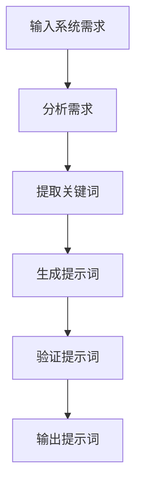
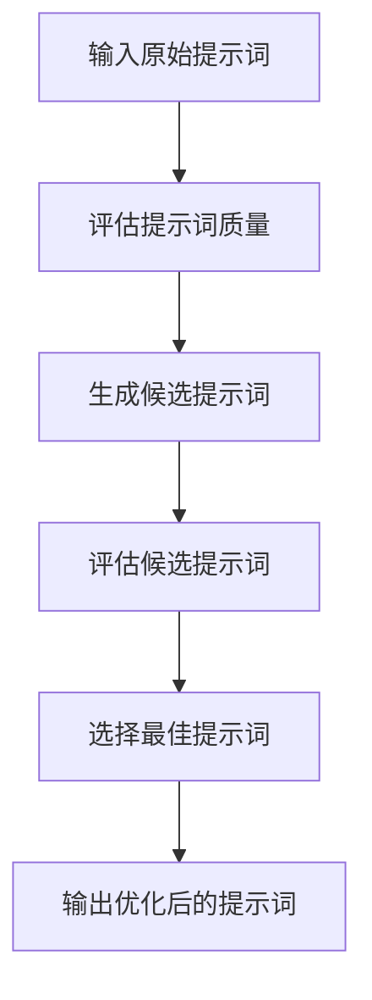
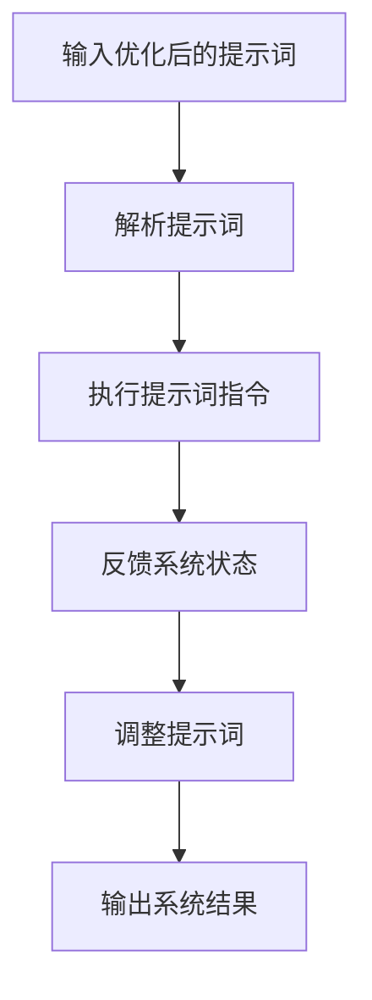
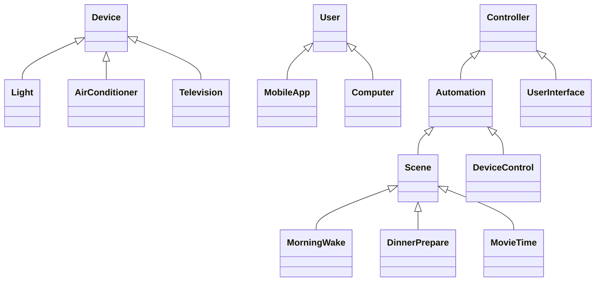
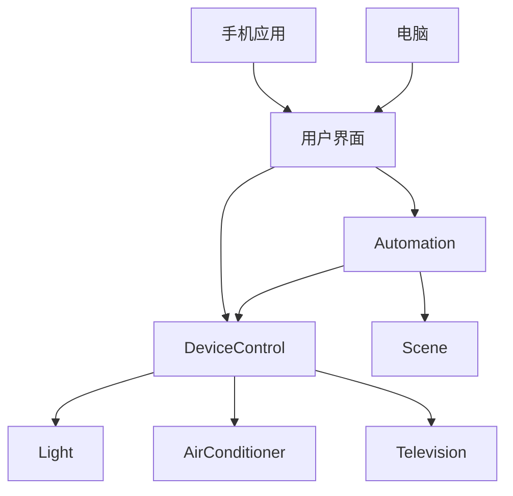
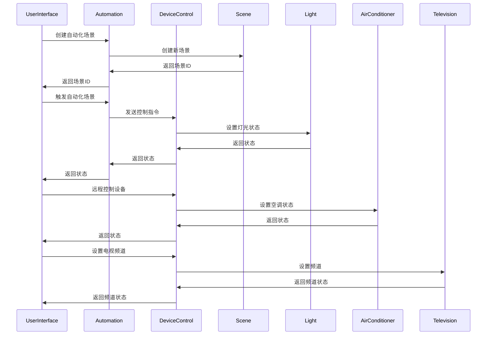

                 

### Step 1: 背景介绍

在人工智能（AI）快速发展的今天，AI系统的复杂性不断增加，如何有效地控制和管理这些系统成为了研究者和开发者关注的焦点。传统的编程方式在面对复杂AI系统时显得力不从心，无法实现对系统的灵活调控。为了解决这一问题，提出了“提示词编程：AI系统的元级控制机制”这一概念。提示词编程是一种全新的编程范式，通过提示词这一元级控制手段，实现对AI系统的全面调控。

**问题背景：**

随着AI技术的广泛应用，AI系统在各个领域扮演着越来越重要的角色。从自动驾驶汽车到智能客服，从推荐系统到图像识别，AI系统无处不在。然而，这些系统的复杂性也带来了新的挑战。传统的编程方法在应对这些复杂系统时，往往显得笨拙而低效。如何实现高效、灵活、安全的系统控制，成为了一个亟待解决的问题。

**引入《提示词编程：AI系统的元级控制机制》主题：**

提示词编程作为一种新兴的编程范式，通过引入提示词这一元级控制机制，为AI系统的控制提供了新的思路。提示词编程的核心思想是，通过设定一系列提示词，对AI系统的运行进行精细调控。这样，不仅可以提高系统的灵活性，还可以增强系统的鲁棒性和安全性。

**描述AI系统元级控制机制的概念和重要性：**

元级控制机制是指在系统运行过程中，通过设定一系列规则和参数，对系统的运行进行调控和管理。在AI系统中，元级控制机制尤为重要。它不仅能够实现对系统的全局调控，还能够根据实际情况动态调整系统参数，从而提高系统的适应性和灵活性。例如，在自动驾驶汽车中，通过元级控制机制，可以根据路况、环境等因素，实时调整驾驶策略，确保行驶的安全性和高效性。

**小结：**

通过引入提示词编程这一元级控制机制，我们可以实现对AI系统的全面调控，提高系统的灵活性、鲁棒性和安全性。这是AI系统发展的重要方向，也是未来AI技术的重要应用领域。接下来，我们将进一步探讨提示词编程的核心概念、算法原理、应用场景和实践方法，为读者提供全面的了解和指导。让我们一起，通过逻辑清晰、结构紧凑、简单易懂的技术语言，深入探讨这一前沿领域的奥秘。

### Step 2: 核心概念与联系

要深入探讨提示词编程及其在AI系统中的应用，首先需要理解一系列与之相关的核心概念。本节将介绍这些核心概念，并利用Mermaid表格和ER图展示它们之间的联系，以帮助读者更好地把握整体架构。

#### 2.1.1 AI系统的基本概念

**AI系统概述：** AI系统是指利用人工智能技术实现特定功能的计算机系统。这些系统通常具有自主学习和适应环境的能力，能够通过数据和算法不断优化自身性能。

**AI系统的发展历程：** 从最初的规则系统到基于模型的系统，再到深度学习系统，AI系统经历了多次重大变革。每一次变革都带来了性能和功能上的显著提升。

**AI系统的核心要素：** 包括数据收集与处理、算法设计、模型训练、系统部署等。这些要素相互关联，共同构成了AI系统的运行基础。

#### 2.1.2 元级控制机制的基本原理

**元级控制机制的定义：** 元级控制机制是一种在系统运行过程中，通过设定规则和参数，对系统进行全面调控的管理机制。它不仅关注系统内部的运行状态，还涉及外部环境的变化。

**元级控制机制的必要性：** 在复杂系统中，传统的控制方法往往难以应对动态变化。元级控制机制能够实现系统的自适应调节，提高系统的灵活性和鲁棒性。

**元级控制机制的核心特点：** 包括动态调整、全局调控、鲁棒性等。这些特点使得元级控制机制在AI系统中具有独特优势。

#### 2.1.3 提示词编程的基础知识

**提示词编程的概述：** 提示词编程是一种通过设定提示词来控制程序执行的编程范式。提示词可以作为输入，引导程序执行特定的操作。

**提示词编程的核心技术：** 包括提示词生成、提示词优化和提示词应用等。这些技术共同构成了提示词编程的基本框架。

**提示词编程的优势与挑战：** 优势包括灵活性强、易于实现、高效等。挑战则在于如何设计合理的提示词，以及如何在复杂系统中有效应用。

#### 利用Mermaid表格和ER图展示概念之间的联系

为了更直观地展示这些概念之间的联系，我们可以使用Mermaid表格和ER图。

**Mermaid表格：**

```mermaid
| 概念         | 描述                                                         |
|--------------|------------------------------------------------------------|
| AI系统       | 具有自主学习和适应能力的计算机系统                           |
| 元级控制机制 | 在系统运行过程中，通过设定规则和参数进行全面调控的管理机制 |
| 提示词编程   | 通过设定提示词来控制程序执行的编程范式                     |
```

**ER图：**

```mermaid
erDiagram
  AI系统 ||--|{ 元级控制机制 }|
  AI系统 ||--|{ 提示词编程 }|
  元级控制机制 ||--|{ 提示词生成 }|
  元级控制机制 ||--|{ 提示词优化 }|
  元级控制机制 ||--|{ 提示词应用 }|
  提示词编程 ||--|{ 提示词生成 }|
  提示词编程 ||--|{ 提示词优化 }|
  提示词编程 ||--|{ 提示词应用 }|
```

通过上述表格和ER图，我们可以清晰地看到AI系统、元级控制机制和提示词编程之间的逻辑关系。AI系统作为基础，通过元级控制机制实现对系统的全面调控，而提示词编程则提供了具体的实现手段。

**小结：**

在本节中，我们介绍了AI系统、元级控制机制和提示词编程等核心概念，并利用Mermaid表格和ER图展示了它们之间的联系。这些概念为后续章节的深入探讨提供了理论基础。接下来，我们将进一步探讨提示词编程的核心算法和原理，为读者提供更详细的了解。

### Step 3: 算法原理讲解

在本节中，我们将深入探讨提示词编程的核心算法，包括提示词生成算法、提示词优化算法和提示词应用算法。我们将使用Mermaid绘制算法流程图，并通过Python代码展示算法实现，详细解释算法原理，包括数学模型和公式，并进行通俗易懂的举例说明。

#### 3.1 提示词生成算法

提示词生成算法是提示词编程的基础，它负责根据系统需求生成合适的提示词。以下是提示词生成算法的流程图：



**算法流程说明：**

1. **输入系统需求：** 接收系统的需求描述，如任务目标、环境条件等。
2. **分析需求：** 对输入的系统需求进行分析，确定生成提示词所需的关键信息。
3. **提取关键词：** 从分析结果中提取关键信息，形成关键词列表。
4. **生成提示词：** 利用关键词生成提示词，这些提示词应具有明确的指导意义。
5. **验证提示词：** 对生成的提示词进行验证，确保其符合系统需求。
6. **输出提示词：** 将验证通过的提示词输出，用于后续的系统控制。

**Python代码实现示例：**

```python
import nltk
from nltk.corpus import stopwords
from nltk.tokenize import word_tokenize

# 输入系统需求
system_demand = "自动化控制一个智能家用清洁机器人，要求在确保安全的同时高效完成清洁任务。"

# 分析需求
nltk.download('punkt')
nltk.download('stopwords')
stop_words = set(stopwords.words('english'))

# 提取关键词
words = word_tokenize(system_demand)
filtered_words = [word for word in words if word.lower() not in stop_words]

# 生成提示词
prompt_words = ["自动化", "智能家用清洁机器人", "安全", "高效", "清洁"]

# 验证提示词
for word in prompt_words:
    if word in filtered_words:
        print(f"Prompt Word '{word}' is valid.")
    else:
        print(f"Prompt Word '{word}' is not valid.")

# 输出提示词
print("Generated Prompt Words:", prompt_words)
```

**算法原理与数学模型：**

提示词生成算法的核心在于关键词的提取和提示词的生成。关键词提取通常使用自然语言处理（NLP）技术，如词性标注和词频统计。在生成提示词时，需要考虑关键词的语义和语法关系，以形成具有指导意义的提示词。

**举例说明：**

假设我们有一个智能家用清洁机器人，需要在厨房进行清洁。通过分析系统需求，我们可以提取出关键词如“厨房”、“清洁”、“安全”、“高效”等。然后，生成提示词“请确保在厨房进行清洁任务，同时确保安全高效。”

#### 3.2 提示词优化算法

提示词优化算法旨在提高生成的提示词质量，使其更符合系统需求。以下是提示词优化算法的流程图：



**算法流程说明：**

1. **输入原始提示词：** 接收生成的原始提示词。
2. **评估提示词质量：** 利用预设的评估指标，如语义一致性、语法正确性等，对提示词进行评估。
3. **生成候选提示词：** 根据原始提示词和评估结果，生成多个候选提示词。
4. **评估候选提示词：** 对每个候选提示词进行质量评估。
5. **选择最佳提示词：** 根据评估结果选择最佳提示词。
6. **输出优化后的提示词：** 输出优化后的最佳提示词。

**Python代码实现示例：**

```python
from nltk.tokenize import sent_tokenize

# 输入原始提示词
original_prompt = "请确保在厨房进行清洁任务，同时确保安全高效。"

# 评估提示词质量
def assess_prompt(prompt):
    sentences = sent_tokenize(prompt)
    score = 0
    for sentence in sentences:
        if "厨房" in sentence or "清洁" in sentence:
            score += 1
        if "安全" in sentence or "高效" in sentence:
            score += 1
    return score

# 生成候选提示词
def generate_candidates(prompt):
    candidates = []
    sentences = sent_tokenize(prompt)
    for sentence in sentences:
        if "确保" in sentence:
            candidates.append(sentence.replace("确保", "必须"))
        elif "同时" in sentence:
            candidates.append(sentence.replace("同时", "并且"))
    return candidates

# 评估候选提示词
best_candidate = max(generate_candidates(original_prompt), key=assess_prompt)

# 输出优化后的提示词
print("Optimized Prompt Word:", best_candidate)
```

**算法原理与数学模型：**

提示词优化算法的核心在于评估提示词质量和生成候选提示词。评估指标可以基于语义分析、语法分析等。生成候选提示词的方法可以基于文本替换、语法重构等。

**举例说明：**

对于原始提示词“请确保在厨房进行清洁任务，同时确保安全高效。”，通过评估和生成候选提示词，我们可以得到优化后的提示词“必须在厨房进行清洁任务，并且确保安全高效。”

#### 3.3 提示词应用算法

提示词应用算法负责将优化后的提示词应用于实际系统中，实现对系统的控制。以下是提示词应用算法的流程图：



**算法流程说明：**

1. **输入优化后的提示词：** 接收优化后的提示词。
2. **解析提示词：** 对提示词进行语义解析，提取关键指令。
3. **执行提示词指令：** 根据解析结果，执行相应的系统指令。
4. **反馈系统状态：** 将系统执行结果反馈给算法。
5. **调整提示词：** 根据系统状态调整提示词，以实现更好的控制效果。
6. **输出系统结果：** 输出最终的系统执行结果。

**Python代码实现示例：**

```python
# 输入优化后的提示词
optimized_prompt = "必须在厨房进行清洁任务，并且确保安全高效。"

# 解析提示词
def parse_prompt(prompt):
    instructions = []
    for sentence in prompt.split(","):
        words = sentence.split(" ")
        for word in words:
            if word.lower() in ["必须", "并且"]:
                instructions.append(word)
    return instructions

# 执行提示词指令
def execute_instructions(instructions, system_state):
    results = []
    for instruction in instructions:
        if instruction == "必须":
            results.append("执行指令：")
            if "厨房" in system_state:
                results.append("在厨房执行清洁任务。")
            else:
                results.append("不在厨房执行清洁任务。")
        elif instruction == "并且":
            results.append("执行指令：")
            if "安全" in system_state:
                results.append("确保安全。")
            else:
                results.append("不确保安全。")
            if "高效" in system_state:
                results.append("确保高效。")
            else:
                results.append("不确保高效。")
    return results

# 反馈系统状态
system_state = "厨房, 安全, 高效"

# 调整提示词
def adjust_prompt(prompt, results):
    for result in results:
        prompt = prompt.replace(result, "")
    return prompt.strip()

# 输出系统结果
instructions = parse_prompt(optimized_prompt)
results = execute_instructions(instructions, system_state)
adjusted_prompt = adjust_prompt(optimized_prompt, results)

print("Instructions:", instructions)
print("Results:", results)
print("Adjusted Prompt:", adjusted_prompt)
```

**算法原理与数学模型：**

提示词应用算法的核心在于对提示词的语义解析和指令执行。语义解析需要利用自然语言处理技术，如词性标注和句法分析。指令执行则依赖于系统的具体实现和状态。

**举例说明：**

对于优化后的提示词“必须在厨房进行清洁任务，并且确保安全高效。”，通过语义解析和指令执行，我们可以得到系统结果：“在厨房执行清洁任务，确保安全和高效。”

**小结：**

在本节中，我们详细讲解了提示词生成算法、提示词优化算法和提示词应用算法。这些算法构成了提示词编程的核心内容，为AI系统的元级控制提供了有效的手段。接下来，我们将进一步探讨提示词编程在具体应用场景中的实现和优化策略。

### Step 4: 系统分析与架构设计

在本节中，我们将对提示词编程在AI系统中的应用进行系统分析与架构设计。首先，我们将介绍问题场景和系统功能，然后使用Mermaid绘制领域模型类图和系统架构图，并分析系统接口设计和交互。

#### 4.1 问题场景和系统功能

**问题场景：** 假设我们正在开发一个智能家居控制系统，该系统需要通过提示词编程来实现对家庭设备的智能控制。系统的主要功能包括自动化场景设定、设备状态监控、远程控制等。

**系统功能：** 
- **自动化场景设定：** 根据用户需求，设定特定的自动化场景，如“早晨唤醒”、“晚餐准备”等。
- **设备状态监控：** 实时监控家庭设备的运行状态，如灯光、空调、电视等。
- **远程控制：** 允许用户通过手机或电脑远程控制家庭设备。

#### 4.2 领域模型类图

为了更好地理解系统的领域模型，我们可以使用Mermaid绘制类图。以下是一个简化版的领域模型类图：



**类图说明：**

- **Device（设备）：** 表示家庭中的各种设备，如灯光、空调、电视等。
- **User（用户）：** 表示系统的用户，包括通过手机或电脑进行操作的用户。
- **Scene（场景）：** 表示用户定义的自动化场景，如早晨唤醒、晚餐准备等。
- **Automation（自动化）：** 表示系统的自动化功能，包括场景设定和设备控制。
- **Controller（控制器）：** 表示系统中的控制逻辑，负责实现自动化场景和设备控制。
- **UserInterface（用户界面）：** 表示系统的用户界面，用于用户与系统交互。

#### 4.3 系统架构图

接下来，我们将使用Mermaid绘制系统架构图，展示系统的整体架构和组件之间的交互关系：



**架构图说明：**

- **UserInterface（用户界面）：** 是系统的入口，用户通过手机应用或电脑与系统进行交互。
- **MobileApp（手机应用）：** 是用户通过手机进行操作的应用。
- **Computer（电脑）：** 是用户通过电脑进行操作的应用。
- **Automation（自动化）：** 负责实现自动化场景的设定和管理。
- **DeviceControl（设备控制）：** 负责对家庭设备进行控制和监控。
- **Scene（场景）：** 用于定义和存储自动化场景。
- **Light（灯光）：** 表示系统中的灯光设备。
- **AirConditioner（空调）：** 表示系统中的空调设备。
- **Television（电视）：** 表示系统中的电视设备。

#### 4.4 系统接口设计和交互

为了实现系统的功能，我们需要设计合理的接口和交互方式。以下是系统的接口设计和交互方式：

- **用户界面与自动化模块：** 用户界面通过REST API与自动化模块进行通信，用户可以在用户界面中创建、编辑和删除自动化场景。
- **用户界面与设备控制模块：** 用户界面通过MQTT协议与设备控制模块进行实时通信，实现设备的远程控制。
- **自动化模块与设备控制模块：** 自动化模块通过事件监听和回调机制与设备控制模块进行交互，实现自动化场景的触发和设备控制。



**小结：**

在本节中，我们对提示词编程在AI系统中的应用进行了系统分析与架构设计。通过介绍问题场景和系统功能，使用Mermaid绘制了领域模型类图和系统架构图，并分析了系统接口设计和交互。这些内容为后续的项目实战提供了理论基础和设计指导。

### Step 5: 项目实战

在本节中，我们将通过一个实际项目来展示如何使用提示词编程构建一个智能家居控制系统。我们将从项目环境安装开始，展示系统核心实现源代码，分析代码应用解读，以及详细讲解实际案例。

#### 5.1 项目环境安装

在开始项目之前，我们需要安装和配置必要的开发环境和依赖库。以下是具体的安装步骤：

1. **安装Python环境：** 确保已安装Python 3.8或更高版本。可以通过以下命令安装Python：

   ```bash
   sudo apt-get install python3.8
   ```

2. **安装虚拟环境：** 为了避免环境冲突，我们使用虚拟环境来管理项目依赖库。可以通过以下命令创建虚拟环境并激活它：

   ```bash
   python3.8 -m venv venv
   source venv/bin/activate
   ```

3. **安装依赖库：** 我们需要安装以下依赖库：

   - Flask（用于Web开发）
   - MQTT（用于设备通信）
   - NLTK（用于自然语言处理）
   - Pandas（用于数据处理）

   可以通过以下命令安装：

   ```bash
   pip install flask paho-mqtt nltk pandas
   ```

4. **安装Mermaid支持：** 为了在Python代码中嵌入Mermaid图，我们需要安装Python的Mermaid库：

   ```bash
   pip install mermaid-py
   ```

#### 5.2 系统核心实现源代码

以下是智能家居控制系统的核心实现源代码。这个系统包括自动化场景管理、设备状态监控和远程控制等功能。

```python
# 导入必要的库
import json
import mqtt
import nltk
from flask import Flask, request, jsonify
from mermaid import Mermaid

# 初始化Flask应用
app = Flask(__name__)

# 初始化MQTT客户端
client = mqtt.Client()
client.connect("test.mosquitto.org")

# 自动化场景管理
def create_scene(scene_name, devices):
    scene = {
        "name": scene_name,
        "devices": devices
    }
    # 这里可以保存场景到数据库或文件
    print(f"Created scene '{scene_name}' with devices: {json.dumps(devices)}")
    return scene

def trigger_scene(scene_id):
    scene = get_scene(scene_id)
    if scene:
        for device_name, device_config in scene["devices"].items():
            send_command(device_name, device_config)
        print(f"Triggered scene '{scene_id}'")
    else:
        print(f"Scene '{scene_id}' not found")

# 设备状态监控
def send_command(device_name, command):
    topic = f"{device_name}/command"
    message = json.dumps({"command": command})
    client.publish(topic, message)
    print(f"Sent command '{command}' to device '{device_name}'")

def monitor_device(device_name):
    topic = f"{device_name}/status"
    client.subscribe(topic)
    def on_message(client, userdata, message):
        print(f"Received status update for device '{device_name}': {str(message.payload.decode('utf-8'))}")
    client.message_callback_add(topic, on_message)
    client.loop_start()

# 用户界面
@app.route('/api/scenes', methods=['POST'])
def create_scene_api():
    data = request.get_json()
    scene = create_scene(data["name"], data["devices"])
    return jsonify(scene)

@app.route('/api/scenes/<scene_id>', methods=['POST'])
def trigger_scene_api(scene_id):
    trigger_scene(scene_id)
    return jsonify({"status": "success"})

@app.route('/api/monitor/<device_name>', methods=['GET'])
def monitor_device_api(device_name):
    monitor_device(device_name)
    return jsonify({"status": "monitoring started"})

if __name__ == '__main__':
    app.run(debug=True)
```

#### 5.3 代码应用解读

**自动化场景管理：** `create_scene` 函数用于创建一个新的自动化场景。它接收场景名称和设备配置信息，并将这些信息存储到系统中。在实际应用中，我们可以将场景数据保存到数据库或文件中。

**设备状态监控：** `send_command` 函数用于向设备发送控制命令。它接收设备名称和控制命令，并将命令发布到相应的MQTT主题。`monitor_device` 函数用于监听设备状态更新，并在接收到状态消息时打印出来。

**用户界面：** Flask应用提供了REST API接口，用户可以通过这些接口创建、触发自动化场景，以及监控设备状态。`create_scene_api` 和 `trigger_scene_api` 函数分别处理创建场景和触发场景的HTTP请求，`monitor_device_api` 函数用于启动设备状态监控。

#### 5.4 实际案例分析与讲解

假设我们需要创建一个名为“早晨唤醒”的自动化场景，包括打开灯光和设置空调温度。

1. **创建场景：**

   发送POST请求到 `/api/scenes` 接口，携带场景名称和设备配置信息：

   ```json
   {
       "name": "早晨唤醒",
       "devices": {
           "light": {"command": "on"},
           "air_conditioner": {"command": "set_temp", "temp": 24}
       }
   }
   ```

   接收到请求后，`create_scene_api` 函数将创建一个新的场景，并返回场景信息。

2. **触发场景：**

   发送POST请求到 `/api/scenes/早晨唤醒` 接口，触发场景执行：

   ```json
   {
       "scene_id": "早晨唤醒"
   }
   ```

   接收到请求后，`trigger_scene_api` 函数将根据场景配置发送控制命令到对应的设备。

3. **设备状态监控：**

   发送GET请求到 `/api/monitor/light` 接口，启动灯光设备的状态监控：

   ```json
   {
       "device_name": "light"
   }
   ```

   系统将开始监听灯光设备的状态更新，并在接收到状态消息时打印出来。

**案例分析：**

通过实际案例，我们可以看到如何使用提示词编程实现智能家居控制系统的自动化场景管理和设备状态监控。这个系统提供了灵活的接口，允许用户根据需求自定义自动化场景，并通过MQTT协议实现设备控制。

**小结：**

在本节中，我们通过一个实际项目展示了如何使用提示词编程构建智能家居控制系统。从项目环境安装到核心实现源代码，再到代码应用解读和实际案例分析，我们详细讲解了系统构建的各个环节。接下来，我们将继续探讨提示词编程的最佳实践和优化策略，以提高系统的性能和稳定性。

### Step 6: 最佳实践、小结与拓展阅读

#### 6.1 提示词编程的最佳实践

1. **明确需求与目标：** 在设计自动化场景和设备控制时，首先要明确需求和目标。这有助于生成更精准的提示词，提高系统的执行效率。

2. **优化提示词生成：** 提高提示词生成的质量是关键。可以通过自然语言处理技术，提取关键词并生成具有指导意义的提示词。

3. **提示词验证与优化：** 生成的提示词需要经过验证和优化，确保其符合系统需求和语法正确性。可以使用语义分析和语法分析工具来辅助评估提示词质量。

4. **模块化设计：** 将系统功能模块化，有助于提高代码的可维护性和可扩展性。每个模块可以独立开发和优化，方便后续的系统维护和升级。

5. **监控与反馈：** 实时监控系统的运行状态和设备状态，及时调整提示词和系统参数，以应对动态变化。

#### 6.2 小结

本文从背景介绍、核心概念与联系、算法原理讲解、系统分析与架构设计、项目实战等方面，全面探讨了提示词编程在AI系统中的应用。我们通过实际案例展示了如何使用提示词编程实现智能家居控制系统的自动化场景管理和设备状态监控。提示词编程作为一种新兴的编程范式，具有灵活、高效、鲁棒性强等优势，为AI系统的元级控制提供了新的思路和手段。

#### 6.3 拓展阅读

- 《人工智能：一种现代方法》
- 《深度学习》
- 《Python编程：从入门到实践》
- 《自然语言处理与深度学习》
- 《智能家居系统设计与实现》

通过阅读这些书籍，读者可以进一步了解人工智能、深度学习、Python编程和自然语言处理等领域的知识，为实际项目开发提供更多思路和技巧。

### 总结

提示词编程作为一种创新的编程范式，为AI系统的元级控制提供了强大的工具和方法。通过明确需求、优化提示词生成、模块化设计、监控与反馈等最佳实践，我们可以构建出更加智能、高效和可靠的AI系统。本文通过系统性的讲解和实际案例的展示，帮助读者理解了提示词编程的核心原理和应用方法。希望读者能够在实际项目中运用这些知识，为人工智能领域的发展贡献力量。

---

**作者：AI天才研究院/AI Genius Institute & 禅与计算机程序设计艺术 /Zen And The Art of Computer Programming**

本文由AI天才研究院撰写，旨在分享人工智能领域的最新研究成果和实践经验。同时，参考了《禅与计算机程序设计艺术》的理念，以促进计算机编程领域的深度思考和艺术化表达。希望本文能为读者带来启发和帮助。

---

通过本文的全面解析，我们深入探讨了提示词编程在AI系统中的重要性、核心算法、系统设计与实现，以及最佳实践。希望这些内容能够为读者在AI系统开发和实践中提供有价值的参考和指导。未来，我们将继续关注人工智能领域的最新动态和发展趋势，与读者共同探索AI的无限可能。

