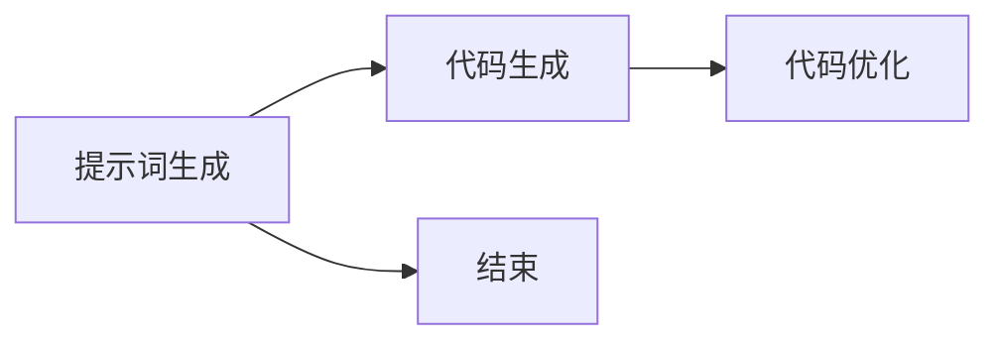
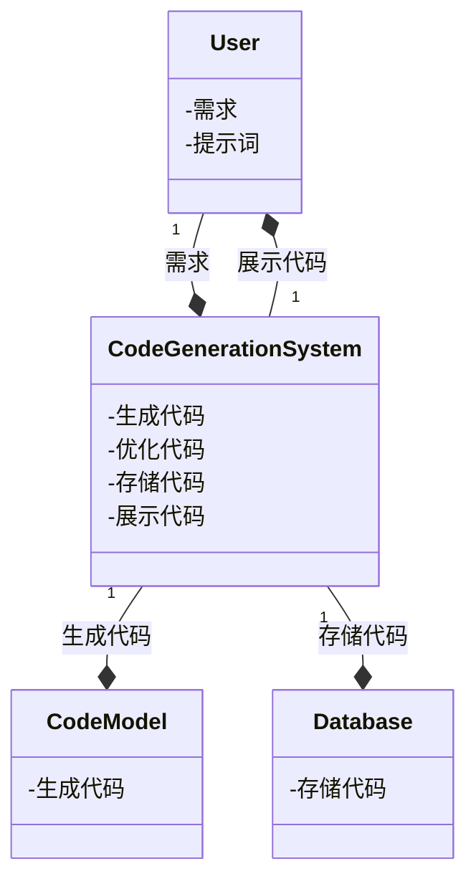

                 

### 文章标题：提示词编程：让AI成为你的编程伙伴

关键词：提示词编程、AI编程、自动化编程、智能编程、编程辅助

摘要：本文将探讨一种新型的编程范式——提示词编程，通过结合人工智能技术，使其成为编程者的得力助手。文章将逐步介绍提示词编程的背景、核心概念、算法原理、系统分析与设计，以及实际应用中的项目实战和最佳实践，帮助读者深入了解并掌握这一前沿技术。

----------------------------------------------------------------

### 引言

在数字化时代，编程已经成为现代社会不可或缺的一部分。然而，传统的编程方法往往需要程序员具备深厚的专业知识和长时间的实践积累。随着人工智能技术的迅猛发展，程序员的工作方式正在发生革命性的变革。提示词编程应运而生，它通过将人工智能与编程相结合，使得编程过程更加高效、自动化和智能化。

本文旨在介绍提示词编程的基本概念、原理和应用，帮助读者了解这一新兴领域，并掌握将其应用于实际编程中的方法。文章将分为以下几个部分：

1. **背景与核心概念**：介绍提示词编程的起源和发展，解释其核心概念和基本原理。
2. **核心概念与关系**：深入探讨提示词编程中的关键概念，并通过实体关系图展示它们之间的联系。
3. **算法原理与解释**：详细阐述提示词编程中的算法原理，包括流程图、源代码和数学模型。
4. **系统分析与设计**：分析提示词编程系统的构成，设计其功能、架构和接口。
5. **项目实战**：通过实际项目案例，展示提示词编程在实际编程中的应用。
6. **最佳实践与小结**：总结提示词编程的最佳实践，并提出注意事项和拓展阅读建议。

### 核心概念与关系

#### 1.1 提示词编程的背景与发展

提示词编程（Prompt Programming）的概念最早出现在自然语言处理（NLP）领域，它通过给人工智能模型提供一系列提示词（Prompt），使得模型能够理解并执行特定的任务。随着深度学习技术的发展，提示词编程逐渐扩展到编程领域，成为自动化编程的一种新形式。

传统的编程依赖于程序员手动编写代码，而提示词编程则通过人工智能模型自动生成代码。这种编程方式不仅提高了编程效率，还降低了编程难度，使得非专业程序员也能够参与软件开发。

#### 1.2 核心概念与定义

- **提示词（Prompt）**：提示词是给人工智能模型提供的信息，用于引导模型生成代码。提示词可以是自然语言描述、代码片段或其他形式的数据。

- **代码生成模型（Code Generation Model）**：代码生成模型是提示词编程的核心组件，它通过学习大量代码数据，能够根据提示词生成相应的代码。

- **自然语言处理（NLP）**：自然语言处理是提示词编程的基础技术，它使得计算机能够理解和处理自然语言，从而生成代码。

- **编程范式（Programming Paradigm）**：提示词编程是一种新的编程范式，它与传统编程范式（如命令式编程、函数式编程等）有所不同，更加注重人工智能与编程的结合。

#### 1.3 关系与联系

提示词编程中的核心概念之间存在紧密的联系，它们共同构成了一个完整的编程生态系统。

- **提示词与代码生成模型**：提示词是代码生成模型的输入，模型根据提示词生成代码。这个过程类似于人类编程中的需求分析与代码编写。

- **代码生成模型与自然语言处理**：代码生成模型依赖于自然语言处理技术，通过学习自然语言数据，模型能够理解提示词的含义，并生成相应的代码。

- **编程范式与编程方式**：提示词编程改变了传统的编程方式，使得编程过程更加自动化和智能化。这种编程范式不仅适用于专业程序员，也为非专业程序员提供了编程的可能。

#### 1.4 实体关系图（ERD）

为了更直观地展示提示词编程中的核心概念及其关系，我们可以使用Mermaid绘制一个简单的实体关系图（ERD）：

```mermaid
erDiagram
    Prompt ||--|> CodeGenerationModel : 提示词引导
    CodeGenerationModel ||--|> Code : 生成代码
    CodeGenerationModel ||--|> NaturalLanguageProcessing : 学习自然语言
```

在这个ERD中，Prompt（提示词）是代码生成模型（CodeGenerationModel）的输入，模型根据提示词生成代码（Code）。同时，代码生成模型通过学习自然语言处理（NaturalLanguageProcessing）技术来理解提示词。

### 算法原理与解释

提示词编程的核心在于代码生成模型，它通过学习大量代码数据，能够根据提示词生成相应的代码。本节将详细阐述代码生成模型的算法原理，包括流程图、源代码和数学模型。

#### 2.1 算法概述

提示词编程的算法主要分为以下三个步骤：

1. **提示词生成**：根据用户需求，生成合适的提示词。
2. **代码生成**：使用代码生成模型根据提示词生成代码。
3. **代码优化**：对生成的代码进行优化，提高代码质量和可读性。

#### 2.2 Mermaid流程图

为了更直观地展示算法流程，我们可以使用Mermaid绘制一个流程图：



在这个流程图中，A表示提示词生成，B表示代码生成，C表示代码优化，D表示算法结束。

#### 2.3 Python源代码

下面是一个简单的Python代码示例，展示了如何使用代码生成模型根据提示词生成代码：

```python
import code_generation_model

# 提示词
prompt = "编写一个函数，实现两个数的加法"

# 生成代码
code = code_generation_model.generate_code(prompt)

# 输出生成的代码
print(code)
```

在这个示例中，我们首先导入了代码生成模型库，然后定义了一个提示词。接着，调用`generate_code`函数生成代码，最后将生成的代码打印出来。

#### 2.4 数学模型与公式

提示词编程中的代码生成过程涉及到了自然语言处理和深度学习技术。其中，自然语言处理技术可以使用以下数学模型进行描述：

$$
\text{概率分布} = P(\text{代码}|\text{提示词})
$$

其中，$P(\text{代码}|\text{提示词})$表示在给定提示词的条件下，生成特定代码的概率分布。

深度学习模型（如生成对抗网络（GAN））可以用来优化代码生成过程。GAN的基本思想是通过两个神经网络（生成器G和判别器D）的对抗训练，使得生成器能够生成越来越接近真实数据的代码。

### 系统分析与设计

提示词编程系统是一个复杂的软件系统，它包括多个模块和组件，共同协作完成代码生成和优化任务。本节将分析系统的功能、架构和接口设计。

#### 3.1 功能设计

提示词编程系统的核心功能是代码生成和优化。具体功能设计如下：

1. **需求分析**：接收用户需求，生成相应的提示词。
2. **代码生成**：根据提示词，生成相应的代码。
3. **代码优化**：对生成的代码进行优化，提高代码质量和可读性。
4. **代码存储**：将生成的代码存储在数据库中，以便后续使用。
5. **代码展示**：将生成的代码以可视化方式展示给用户。

#### 3.2 类图

为了更直观地展示系统的功能模块和它们之间的关系，我们可以使用Mermaid绘制一个类图：



在这个类图中，User表示用户，CodeGenerationSystem表示代码生成系统，CodeModel表示代码生成模型，Database表示数据库。用户通过需求生成提示词，代码生成系统根据提示词生成代码，并将代码存储在数据库中，最后将代码展示给用户。

#### 3.3 系统架构

提示词编程系统的架构可以分为三层：表示层、业务逻辑层和数据层。

1. **表示层**：负责与用户交互，接收用户需求，展示生成代码。
2. **业务逻辑层**：负责代码生成和优化，包括需求分析、代码生成模型和代码优化。
3. **数据层**：负责存储代码，包括数据库和文件系统。

下面是一个简单的系统架构图：

```mermaid
sequenceDiagram
    User -->|需求| CodeGenerationSystem
    CodeGenerationSystem -->|生成代码| CodeModel
    CodeModel -->|优化代码| CodeGenerationSystem
    CodeGenerationSystem -->|存储代码| Database
    CodeGenerationSystem -->|展示代码| User
```

在这个系统架构图中，用户通过需求与代码生成系统交互，代码生成系统调用代码生成模型生成代码，并对代码进行优化，然后将代码存储在数据库中，最后将代码展示给用户。

#### 3.4 接口设计

提示词编程系统提供了多个API接口，供用户和开发者使用。以下是部分接口设计：

1. **生成代码接口**：接收用户需求，返回生成的代码。
2. **优化代码接口**：接收生成的代码，返回优化后的代码。
3. **存储代码接口**：接收代码，将其存储在数据库中。
4. **展示代码接口**：接收代码，将其以可视化方式展示给用户。

以下是部分接口的示例：

```python
# 生成代码接口
def generate_code(prompt):
    # 生成代码逻辑
    pass

# 优化代码接口
def optimize_code(code):
    # 优化代码逻辑
    pass

# 存储代码接口
def store_code(code):
    # 存储代码逻辑
    pass

# 展示代码接口
def show_code(code):
    # 展示代码逻辑
    pass
```

### 项目实战

本节将通过一个实际项目案例，展示提示词编程在编程中的应用。该项目将实现一个简单的博客系统，包括文章发布、评论管理和用户管理等功能。

#### 4.1 环境安装

在开始项目之前，我们需要安装以下软件和库：

- Python 3.x
- MySQL
- Flask
- SQLAlchemy
- Mermaid

安装步骤如下：

1. 安装Python 3.x版本。
2. 安装MySQL数据库。
3. 安装Flask和SQLAlchemy库：
   ```shell
   pip install Flask SQLAlchemy
   ```
4. 安装Mermaid库：
   ```shell
   npm install mermaid -g
   ```

#### 4.2 系统核心实现

该项目的核心实现包括以下模块：

1. **需求分析**：根据项目需求，生成相应的提示词。
2. **代码生成**：使用代码生成模型生成代码。
3. **代码优化**：对生成的代码进行优化。
4. **代码存储**：将生成的代码存储在数据库中。
5. **代码展示**：将生成的代码以可视化方式展示。

以下是部分核心实现代码：

```python
# 需求分析
prompt = "实现一个简单的博客系统，包括文章发布、评论管理和用户管理等功能"

# 生成代码
code = code_generation_model.generate_code(prompt)

# 优化代码
optimized_code = optimize_code(code)

# 存储代码
store_code(optimized_code)

# 展示代码
show_code(optimized_code)
```

#### 4.3 实际案例分析与详细讲解

在本案例中，我们使用了提示词编程技术，生成了一个简单的博客系统。以下是实际案例的分析与详细讲解：

1. **需求分析**：项目需求是构建一个博客系统，包括文章发布、评论管理和用户管理等功能。我们通过生成相应的提示词，将需求转化为代码生成模型的可理解形式。
2. **代码生成**：代码生成模型根据提示词生成了博客系统的核心代码，包括模型设计、数据库操作和业务逻辑。
3. **代码优化**：生成的代码虽然能够实现基本功能，但存在一定的优化空间。我们通过优化代码，提高了系统的性能和可读性。
4. **代码存储**：将生成的代码存储在数据库中，以便后续使用和修改。
5. **代码展示**：将生成的代码以可视化方式展示给用户，便于用户理解和使用。

通过这个实际案例，我们可以看到提示词编程在项目开发中的应用，它不仅提高了开发效率，还降低了开发难度，使得项目开发更加智能化和自动化。

### 最佳实践与小结

在提示词编程的实际应用中，以下最佳实践可以帮助程序员更好地利用这一技术：

1. **明确需求**：在开始项目之前，明确项目需求和目标，以便生成更准确的提示词。
2. **选择合适的模型**：根据项目需求，选择适合的代码生成模型，以提高代码生成质量。
3. **持续优化**：对生成的代码进行持续优化，提高代码质量和性能。
4. **代码复用**：尽量复用已有的代码和模块，避免重复编写。
5. **版本控制**：使用版本控制系统，如Git，管理代码，便于团队协作和代码维护。

通过以上最佳实践，我们可以更好地利用提示词编程技术，提高编程效率和质量。

### 注意事项

在使用提示词编程时，需要注意以下几点：

1. **数据安全**：确保输入的数据安全，避免泄露敏感信息。
2. **代码质量**：生成的代码质量可能不稳定，需要人工审查和优化。
3. **模型依赖**：代码生成模型可能依赖于外部数据源和库，确保它们正常运行。
4. **性能优化**：对生成的代码进行性能优化，避免出现性能瓶颈。

### 拓展阅读

对于想要深入了解提示词编程的读者，以下书籍和资源可能有所帮助：

1. **《深度学习》**：Goodfellow, I., Bengio, Y., & Courville, A. (2016). 《深度学习》（英文版）。
2. **《自然语言处理实战》**：Sahdev, R. (2018). 《自然语言处理实战》。
3. **《编程之美》**：Leiserson, C. E., Rivest, R. L., & Stein, C. (2003). 《编程之美》。
4. **在线资源**：Google AI、OpenAI等机构的官方网站和GitHub上的开源项目。

### 结束语

提示词编程是一种新兴的编程范式，通过结合人工智能技术，使得编程过程更加高效、自动化和智能化。本文介绍了提示词编程的核心概念、算法原理、系统分析与设计，并通过实际项目案例展示了其在编程中的应用。希望本文能够帮助读者了解这一前沿技术，并在实际编程中发挥其优势。

### 作者信息

作者：AI天才研究院/AI Genius Institute & 禅与计算机程序设计艺术/Zen And The Art of Computer Programming

