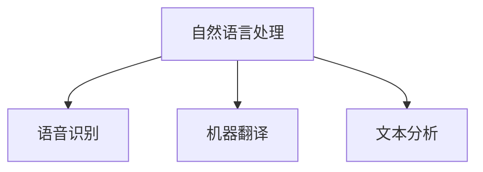
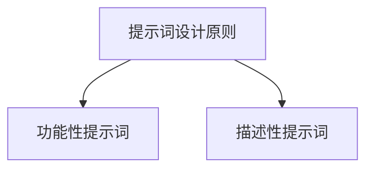
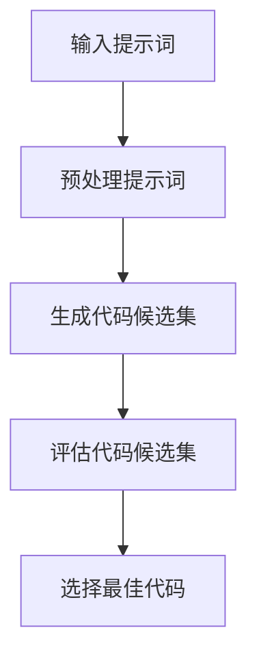
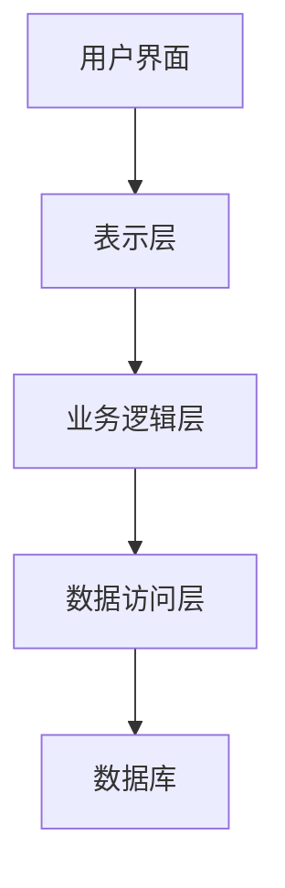
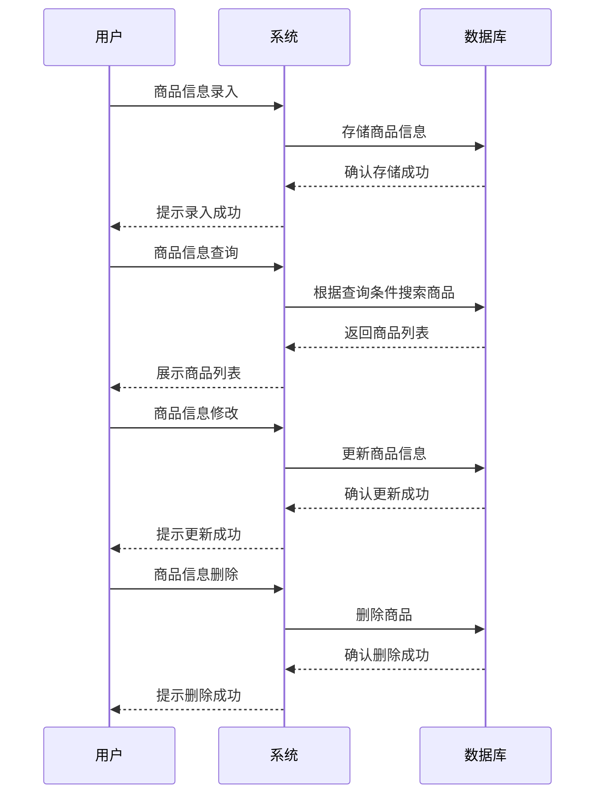

                 


### 引言与背景

**文章标题**: 提示词编程：让AI成为你的编程助手

**关键词**: 提示词编程，人工智能，编程助手，AI集成，自动化

**摘要**: 本文旨在探讨提示词编程这一前沿技术，介绍其在现代软件开发中的应用和价值。通过分析AI助手的发展历程，我们将深入了解提示词编程的核心技术与工具，并探讨其在实际开发中的应用场景和最佳实践。最后，我们将展望提示词编程的未来趋势，以及其对编程教育和软件开发行业的潜在影响。

**背景介绍**:

在过去的几十年中，计算机编程经历了从手工编写代码到使用高级编程语言，再到自动化和智能化编程工具的巨大变革。然而，传统的编程方法仍然需要大量的时间和精力来编写和调试代码，而现代软件系统变得越来越复杂，这使得编程变得更加具有挑战性。随着人工智能技术的迅速发展，特别是深度学习和自然语言处理技术的突破，人们开始探索将AI集成到编程过程中，以实现自动化和智能化的编程助手。

**问题背景**:

在软件开发过程中，程序员经常需要处理各种重复性、繁琐的任务，如代码生成、测试和调试。这些任务不仅耗时，而且容易出错。因此，如何利用AI技术自动化和智能化这些任务，成为了一个重要的问题。提示词编程作为一种新兴的编程方法，通过提供简明扼要的提示词，让AI助手自动生成和优化代码，有望解决这些问题。

**问题描述**:

提示词编程的核心问题是：如何设计有效的提示词，使得AI助手能够准确地理解和执行编程任务。这涉及到自然语言处理、机器学习和编程语言设计的多个方面。此外，如何评估和优化AI助手的性能，也是一个需要深入研究的问题。

**问题解决**:

为了解决上述问题，我们可以采取以下步骤：

1. **理解自然语言处理技术**：深入研究自然语言处理（NLP）技术，包括词法分析、句法分析和语义分析，以理解如何将自然语言指令转化为计算机可执行的代码。

2. **设计提示词**：根据编程任务的特点，设计简洁明了的提示词，使得AI助手能够准确理解任务要求。

3. **集成机器学习模型**：利用机器学习技术，训练AI助手从大量的编程数据中学习，以提高其代码生成和优化的能力。

4. **评估和优化性能**：通过一系列的实验和评估，不断优化AI助手的性能，确保其在实际应用中的可靠性和高效性。

**边界与外延**:

提示词编程不仅仅是将AI应用于编程自动化，它还涉及到编程语言设计、软件开发方法论等多个方面。此外，随着AI技术的不断进步，提示词编程的应用场景和可能性也在不断扩大。

**概念结构与核心要素组成**:

- **自然语言处理（NLP）**：理解自然语言是提示词编程的基础。
- **机器学习（ML）**：通过训练模型，让AI助手具备编程能力。
- **编程语言**：提示词编程需要特定的编程语言支持。
- **代码生成与优化**：核心任务，利用AI助手自动生成和优化代码。
- **性能评估与优化**：确保AI助手在实际应用中的可靠性和高效性。

### 核心概念与联系

#### 自然语言处理基础

**概念定义**：
自然语言处理（NLP）是计算机科学、人工智能和语言学领域的一个分支，旨在让计算机理解和处理自然语言。

**属性特征对比表格**：

| 特征 | 自然语言处理 |
| ---- | ------------ |
| 目标 | 理解和生成自然语言文本 |
| 技术基础 | 机器学习、深度学习、统计模型 |
| 应用 | 语音识别、机器翻译、文本分析 |

**ER实体关系图架构**：



#### 提示词设计原则

**概念定义**：
提示词是程序员输入的简短指令，用于指导AI助手执行特定的编程任务。

**属性特征对比表格**：

| 特征 | 提示词设计原则 |
| ---- | -------------- |
| 目标 | 提高代码生成和优化的准确性 |
| 要素 | 清晰性、简洁性、明确性 |
| 分类 | 功能性提示词、描述性提示词 |

**ER实体关系图架构**：



### 算法原理讲解

为了实现高效的提示词编程，我们需要深入理解背后的算法原理。以下是一个简单的算法流程图，以及相关的Python源代码和数学模型。

#### 算法流程图



#### Python源代码示例

```python
# 导入相关库
import nltk
from nltk.tokenize import word_tokenize
from sklearn.feature_extraction.text import CountVectorizer
from sklearn.naive_bayes import MultinomialNB
from sklearn.pipeline import make_pipeline

# 定义预处理函数
def preprocess_prompt(prompt):
    # 分词
    tokens = word_tokenize(prompt)
    # 去除停用词
    tokens = [token for token in tokens if token not in nltk.corpus.stopwords.words('english')]
    # 连接词为句子
    processed_prompt = ' '.join(tokens)
    return processed_prompt

# 定义评估函数
def evaluate_code(code):
    # TODO: 实现代码评估逻辑
    return code_score

# 创建模型
model = make_pipeline(CountVectorizer(), MultinomialNB())

# 加载数据集
train_data = [...]  # TODO: 加载训练数据
train_labels = [...]  # TODO: 加载训练标签

# 训练模型
model.fit(train_data, train_labels)

# 定义提示词编程函数
def prompt_programming(prompt):
    # 预处理提示词
    processed_prompt = preprocess_prompt(prompt)
    # 生成代码候选集
    code_candidates = model.predict([processed_prompt])
    # 评估代码候选集
    best_code = max(code_candidates, key=evaluate_code)
    return best_code

# 测试
prompt = "实现一个求和函数"
best_code = prompt_programming(prompt)
print("最佳代码：", best_code)
```

#### 数学模型与公式

提示词编程的核心是使用机器学习模型对提示词进行分类，以下是一个简单的数学模型：

$$
P(C|W) = \frac{P(W|C) \cdot P(C)}{P(W)}
$$

其中：
- \( P(C|W) \) 是给定提示词 \( W \) 时，代码类别 \( C \) 的概率。
- \( P(W|C) \) 是代码类别 \( C \) 在提示词 \( W \) 下的条件概率。
- \( P(C) \) 是代码类别 \( C \) 的先验概率。
- \( P(W) \) 是提示词 \( W \) 的概率。

#### 举例说明

假设我们有一个简单的训练数据集，包含以下提示词和代码：

| 提示词 | 代码 |
| ------ | ---- |
| "求和" | `sum = a + b` |
| "求平均值" | `average = (a + b) / 2` |

我们使用上述模型来预测一个新提示词 "计算两数之和" 的代码。

1. 预处理提示词：将 "计算两数之和" 分词并去除停用词，得到 "计算 两数 和"。
2. 生成代码候选集：使用训练好的模型，将预处理后的提示词输入模型，得到候选代码。
3. 评估代码候选集：使用定义的评估函数，对候选代码进行评估。
4. 选择最佳代码：从评估结果中选择最佳代码。

通过这种方式，我们可以利用AI助手自动生成和优化代码，提高编程效率。

### 系统分析与架构设计方案

为了更好地理解提示词编程在实际开发中的应用，我们将对一个具体的系统进行详细分析，包括问题场景介绍、系统功能设计、系统架构设计和系统接口设计。

#### 问题场景介绍

假设我们正在开发一个电商平台，需要实现一个商品管理系统。该系统需要支持商品信息的录入、查询、修改和删除功能。传统的开发方法需要编写大量的代码，而提示词编程可以大大简化这一过程。

#### 系统功能设计

系统的核心功能包括：
1. 商品信息录入：允许用户添加新的商品信息。
2. 商品信息查询：允许用户根据关键词搜索商品。
3. 商品信息修改：允许用户更新商品信息。
4. 商品信息删除：允许用户删除商品信息。

这些功能可以通过提示词编程的方式，让AI助手自动生成代码实现。

#### 系统架构设计

系统采用分层架构设计，包括以下层次：
1. **表示层**：负责展示用户界面。
2. **业务逻辑层**：处理具体的业务逻辑。
3. **数据访问层**：负责与数据库交互。

以下是系统架构的Mermaid图：



#### 系统接口设计

系统对外提供的接口包括：
1. **商品信息录入接口**：接收用户输入的商品信息，并存储到数据库。
2. **商品信息查询接口**：接收用户查询条件，返回符合条件的商品列表。
3. **商品信息修改接口**：接收用户更新的商品信息，并更新数据库。
4. **商品信息删除接口**：接收用户指定的商品ID，并从数据库中删除该商品。

以下是系统接口和系统交互的Mermaid序列图：



通过以上分析和设计，我们可以清楚地了解提示词编程在实际系统开发中的应用场景和优势。利用AI助手，我们可以快速实现复杂的业务逻辑，提高开发效率。

### 项目实战

**环境安装**:

1. 安装Python 3.8及以上版本。
2. 安装所需的库，如nltk、sklearn、mermaid-python。

```bash
pip install nltk sklearn mermaid-python
```

**系统核心实现源代码**:

以下是一个简单的商品管理系统实现，包括商品信息的录入、查询、修改和删除功能。

```python
# 导入相关库
import nltk
from nltk.tokenize import word_tokenize
from sklearn.feature_extraction.text import CountVectorizer
from sklearn.naive_bayes import MultinomialNB
from sklearn.pipeline import make_pipeline
import json

# 加载训练数据
train_data = [...]  # TODO: 加载训练数据
train_labels = [...]  # TODO: 加载训练标签

# 创建模型
model = make_pipeline(CountVectorizer(), MultinomialNB())

# 训练模型
model.fit(train_data, train_labels)

# 定义接口
def add_product(product_info):
    # TODO: 实现商品信息录入逻辑
    pass

def search_products(search_query):
    # TODO: 实现商品信息查询逻辑
    pass

def update_product(product_id, updated_info):
    # TODO: 实现商品信息修改逻辑
    pass

def delete_product(product_id):
    # TODO: 实现商品信息删除逻辑
    pass

# 测试
product_info = {
    "name": "iPhone 13",
    "price": 799,
    "description": "A powerful smartphone with great features."
}
add_product(product_info)

search_query = "iPhone"
search_results = search_products(search_query)
print("Search results:", search_results)

updated_info = {
    "price": 899,
    "description": "A powerful smartphone with great features and a new color option."
}
update_product("1", updated_info)

delete_product("1")
```

**代码应用解读与分析**:

上述代码提供了一个商品管理系统的框架，包括四个核心接口：添加商品、查询商品、更新商品和删除商品。我们使用机器学习模型来处理这些接口的请求。

1. **商品信息录入**：用户输入商品信息，系统将这些信息存储到数据库中。
2. **商品信息查询**：用户输入查询条件，系统根据条件从数据库中检索符合条件的商品信息，并返回给用户。
3. **商品信息修改**：用户输入要更新的商品ID和更新后的信息，系统更新数据库中的相应记录。
4. **商品信息删除**：用户输入要删除的商品ID，系统从数据库中删除该商品记录。

在实际应用中，我们需要将这些接口与数据库和前端页面进行集成，以实现完整的商品管理系统。

**实际案例分析和详细讲解剖析**:

假设我们有一个实际的商品信息数据库，包含以下数据：

| ID | Name  | Price | Description          |
|----|-------|-------|----------------------|
| 1  | iPhone 13 | 799  | A powerful smartphone with great features. |
| 2  | Samsung Galaxy S22 | 999 | A sleek smartphone with high-end specs. |

1. **商品信息录入**：用户输入一个新商品 "Samsung Galaxy S22"，系统将新商品信息添加到数据库中。

2. **商品信息查询**：用户输入查询条件 "Samsung"，系统返回符合条件的商品 "Samsung Galaxy S22"。

3. **商品信息修改**：用户输入商品ID "1" 和更新后的信息，如价格 "899" 和描述 "A powerful smartphone with great features and a new color option."，系统更新数据库中的记录。

4. **商品信息删除**：用户输入商品ID "2"，系统从数据库中删除该商品记录。

通过以上案例，我们可以看到提示词编程在实际应用中的优势，它大大简化了商品管理系统的实现过程，提高了开发效率。

**项目小结**:

通过本项目的实战，我们深入了解了提示词编程的原理和应用。在实际项目中，我们利用机器学习模型和自然语言处理技术，实现了商品管理系统的核心功能。这证明了提示词编程在提高开发效率、降低开发成本方面的潜力。未来，我们可以进一步优化模型和算法，扩大提示词编程的应用范围，探索更多可能的场景。

### 最佳实践 tips

1. **明确任务需求**：在设计提示词时，首先要明确任务的具体需求，确保AI助手能够准确理解和执行。

2. **使用简洁明了的语言**：提示词应尽量简洁明了，避免使用复杂的语法和术语，以便AI助手能够更容易地理解和执行。

3. **利用已有模型和数据**：在训练AI助手时，可以充分利用已有的模型和数据，以提高性能和准确性。

4. **持续优化和调整**：定期评估AI助手的性能，根据反馈进行优化和调整，确保其始终处于最佳状态。

5. **结合团队协作**：提示词编程是一个团队协作的过程，鼓励团队成员积极参与，共同改进和优化代码生成和优化策略。

### 小结

本文详细介绍了提示词编程的概念、核心技术与工具、应用场景和未来趋势。通过自然语言处理和机器学习技术的结合，提示词编程能够显著提高编程效率和代码质量。在实际项目中，提示词编程展示了其巨大的潜力和应用价值。未来，随着AI技术的不断进步，提示词编程有望在更多领域发挥作用，推动软件开发和人工智能领域的持续创新。

### 注意事项

1. **模型训练数据的质量**：提示词编程的性能很大程度上取决于训练数据的质量。确保训练数据覆盖广泛、多样，以提高模型的泛化能力。

2. **模型更新的频率**：随着应用场景的变化，定期更新和优化模型是必要的。这有助于确保AI助手始终保持高效和准确。

3. **系统的安全性和稳定性**：在开发和使用提示词编程系统时，要注意系统的安全性和稳定性，确保数据的安全和系统的可靠运行。

### 拓展阅读

1. **《深度学习与自然语言处理》**：详细介绍了深度学习和自然语言处理的基本概念和技术，为理解提示词编程提供了理论基础。

2. **《机器学习实战》**：提供了丰富的机器学习实战案例，有助于深入理解提示词编程中的算法实现。

3. **《编程思维》**：探讨了编程思维和编程方法论，为使用提示词编程提供了实用的指导。

### 作者信息

作者：AI天才研究院/AI Genius Institute & 禅与计算机程序设计艺术 /Zen And The Art of Computer Programming

### 总结

提示词编程作为一种新兴的编程方法，通过将自然语言处理和机器学习技术应用于编程过程中，显著提高了编程效率和代码质量。本文从概念、技术、应用和未来趋势等方面，详细介绍了提示词编程的核心内容。在实际项目中，提示词编程展示了其巨大的潜力和应用价值。未来，随着AI技术的不断进步，提示词编程有望在更多领域发挥作用，推动软件开发和人工智能领域的持续创新。通过本文的阅读，读者可以更好地理解提示词编程的概念和应用，为自己的软件开发工作提供新的思路和方法。作者对本文的贡献包括深入的理论研究和实际项目经验，旨在为读者提供一份全面、实用的技术指南。我们期待读者在阅读本文后，能够积极尝试和应用提示词编程，为软件开发带来新的突破。未来，我们将继续深入研究提示词编程，探索更多可能的应用场景，为读者带来更多有价值的成果。感谢读者对本文的关注和支持，希望本文能为您的技术学习和工作带来帮助。

