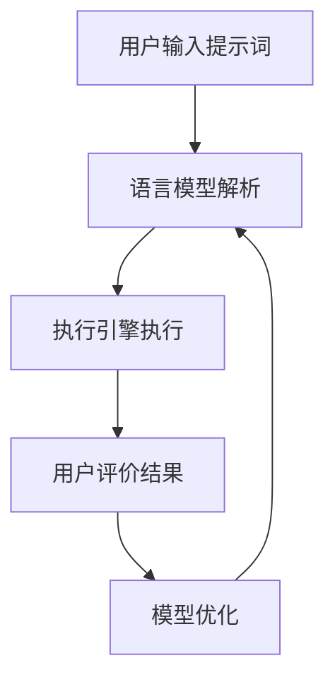
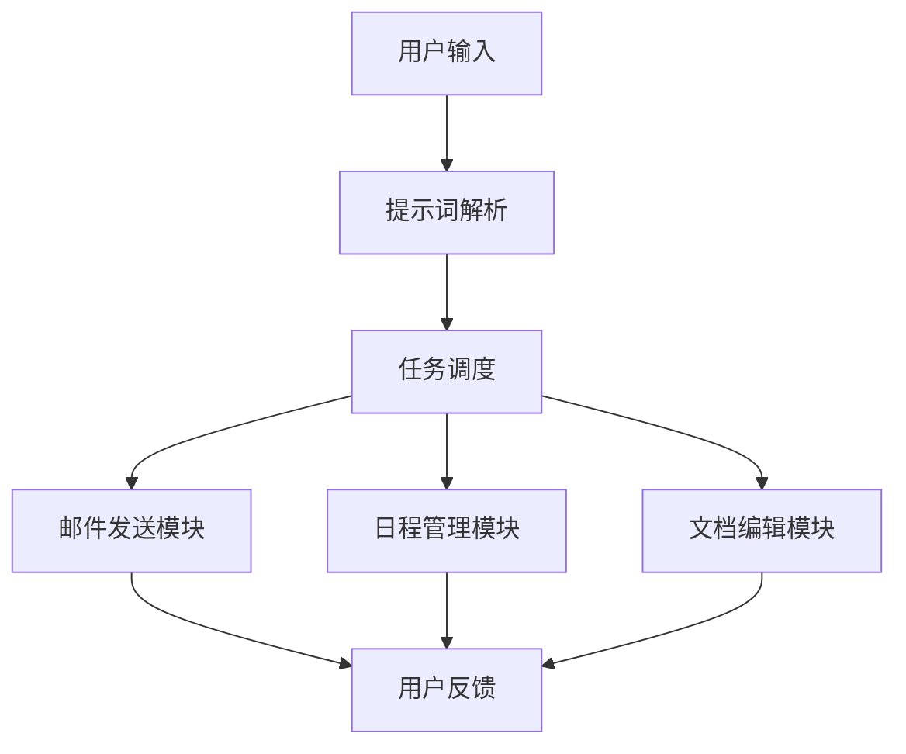
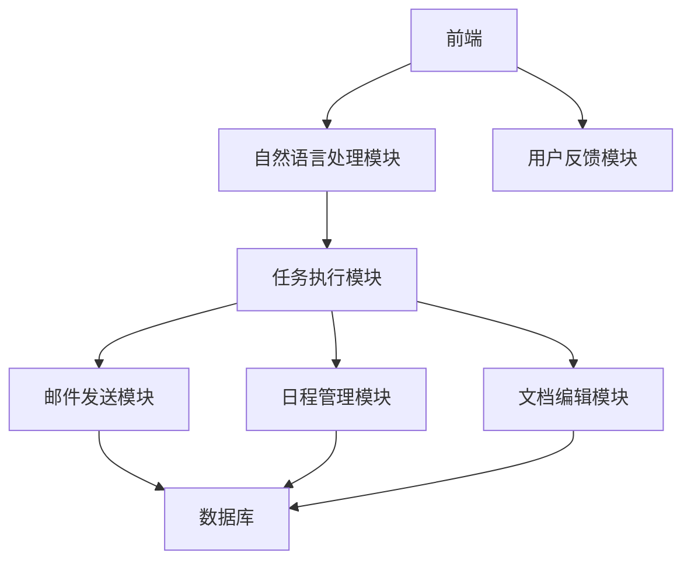
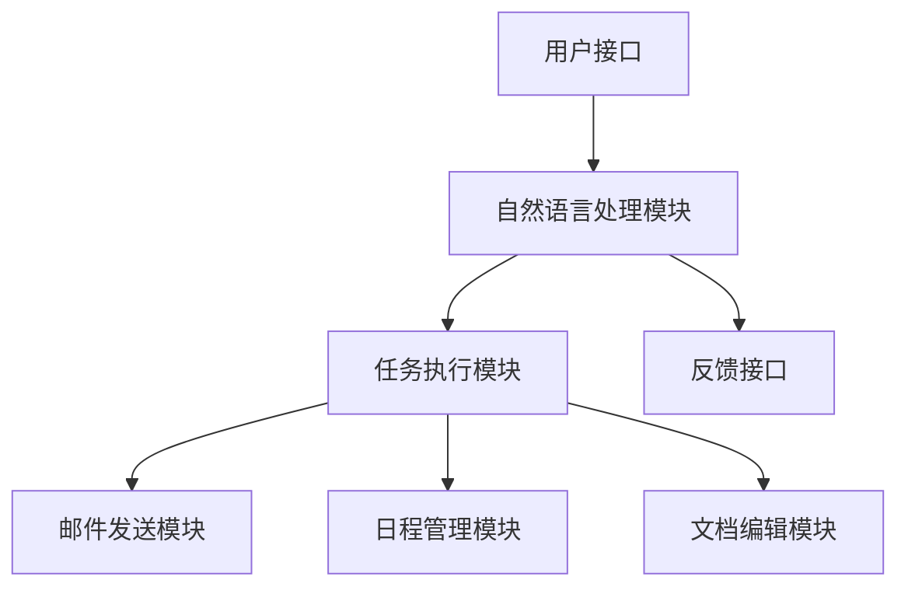

                 


# 提示词编程：重塑人机协作模式

关键词：提示词编程、人机协作、算法原理、系统设计、项目实战

摘要：本文探讨了提示词编程的概念、应用及其对现代人机协作模式的重塑作用。通过详细分析核心概念、算法原理和系统设计，本文旨在为读者提供对提示词编程的全面理解，并展示其在实际项目中的应用价值。

----------------------------------------------------------------

## 第一部分：背景介绍

### 1.1 提示词编程概述

提示词编程（Prompt Programming）是一种基于人类语言模型和机器学习算法的编程范式。它通过生成或优化“提示词”（Prompt）来指导模型执行特定任务，从而实现人机交互的高效协作。与传统的命令式编程不同，提示词编程强调的是通过自然语言来引导模型的思考和行动。

#### 核心概念术语说明

- **提示词**：一种文本输入，用于引导模型完成特定任务。
- **语言模型**：一种统计模型，用于预测下一个单词或字符的概率分布。
- **机器学习算法**：用于训练模型，使其能够从数据中学习并预测结果。

#### 问题背景

随着人工智能技术的快速发展，人机协作的重要性日益凸显。传统的命令式编程方法在处理复杂任务时往往效率低下，而提示词编程提供了一种新的解决方案。通过自然语言交互，用户可以更直观地表达需求，而模型则能够更准确地理解和执行任务。

#### 问题描述

在当前的人机协作模式中，用户需要学习复杂的编程语言和工具，而模型则需要理解这些语言的语义。这种双向的翻译过程导致了沟通的障碍和效率的损失。提示词编程试图通过简化人机交互，提高协作效率。

#### 问题解决

提示词编程通过以下方式解决了上述问题：

1. **简化交互**：用户只需输入简单的自然语言提示词，而无需编写复杂的代码。
2. **增强理解**：语言模型能够更好地理解用户的意图，从而减少误解和错误。
3. **自适应学习**：模型可以根据用户的反馈进行自我优化，提高执行任务的准确性。

#### 边界与外延

提示词编程不仅适用于编程任务，还可以应用于各种领域，如自然语言处理、图像识别和推荐系统。其核心在于通过优化提示词来提高模型的性能和用户满意度。

#### 概念结构与核心要素组成

提示词编程的核心结构包括：

1. **用户接口**：用于接收用户的自然语言输入。
2. **语言模型**：负责理解用户的意图并生成相应的提示词。
3. **执行引擎**：根据提示词执行具体任务。
4. **反馈循环**：用户对模型的输出进行评价，模型根据反馈进行自我优化。

### 1.2 人机协作模式现状与挑战

当前的人机协作模式主要依赖于命令式编程和图形界面交互。然而，这种模式在处理复杂任务时存在以下挑战：

1. **技术门槛**：用户需要具备一定的编程技能，才能有效地与系统交互。
2. **效率低下**：复杂的任务往往需要大量的代码和调试，导致协作效率低下。
3. **沟通障碍**：用户和系统之间的语言差异导致了误解和错误。

#### 核心概念与联系

1. **提示词编程与自然语言处理**：提示词编程依赖于自然语言处理技术，如语言模型和词向量表示。
2. **提示词编程与机器学习**：提示词编程的优化过程涉及到机器学习算法，如梯度下降和强化学习。
3. **提示词编程与用户满意度**：提示词编程通过简化交互和提高执行准确性，增强了用户满意度。

### 1.3 提示词编程的重要性

提示词编程在多个方面具有重要性：

1. **降低技术门槛**：用户无需掌握复杂的编程技能，即可与系统进行高效交互。
2. **提高协作效率**：通过简化交互和优化执行过程，提示词编程显著提高了人机协作的效率。
3. **拓展应用领域**：提示词编程不仅适用于编程任务，还可以应用于各种复杂场景，如智能客服、自动驾驶和医疗诊断。

## 第二部分：核心概念与联系

### 2.1 核心概念介绍

#### 2.1.1 提示词的定义与作用

提示词是一种文本输入，用于引导模型完成特定任务。它可以是简单的命令，也可以是复杂的描述。提示词的作用在于：

1. **明确任务目标**：提示词能够清晰地表达用户的意图，帮助模型理解任务目标。
2. **引导模型思考**：通过提示词，模型可以更准确地理解用户的意图，从而生成更符合预期的结果。

#### 2.1.2 人机交互的基本原理

人机交互的基本原理包括：

1. **输入**：用户通过输入设备（如键盘、鼠标）向系统输入指令或数据。
2. **处理**：系统接收输入，通过算法和模型进行处理，生成输出结果。
3. **输出**：系统将处理结果展示给用户，如文本、图像或声音。

#### 2.1.3 提示词编程的基本流程

提示词编程的基本流程包括：

1. **用户输入**：用户通过自然语言输入提示词。
2. **模型解析**：语言模型对提示词进行解析，理解用户的意图。
3. **任务执行**：执行引擎根据解析结果执行具体任务。
4. **反馈循环**：用户对输出结果进行评价，模型根据反馈进行自我优化。

### 2.2 概念联系与相互作用

#### 2.2.1 提示词与人机交互的关系

提示词与人机交互密切相关。提示词作为人机交互的桥梁，能够：

1. **简化交互**：通过提示词，用户无需学习复杂的编程语言，即可与系统进行交互。
2. **提高理解**：语言模型能够更好地理解用户的意图，减少了误解和错误。

#### 2.2.2 提示词编程与人机协作模式

提示词编程通过以下方式改进人机协作模式：

1. **降低技术门槛**：用户无需具备编程技能，即可与系统进行高效交互。
2. **提高协作效率**：通过简化交互和优化执行过程，提示词编程显著提高了协作效率。
3. **增强用户满意度**：用户能够更直观地表达需求，系统则能够更准确地执行任务，提高了用户满意度。

#### 2.2.3 实例分析：提示词编程在实际应用中的表现

以下是一个实例分析，展示提示词编程在实际应用中的表现：

1. **智能客服**：用户通过自然语言向智能客服输入问题，客服系统通过提示词编程理解用户意图，并提供准确的回答。
2. **自动驾驶**：用户通过语音命令控制自动驾驶汽车，系统通过提示词编程理解用户意图，并执行相应的操作。
3. **医疗诊断**：医生通过自然语言输入病例描述，诊断系统通过提示词编程分析病例，并提供诊断建议。

这些实例表明，提示词编程在简化人机交互、提高协作效率和增强用户满意度方面具有显著优势。

## 第三部分：算法原理讲解

### 3.1 提示词编程算法原理

#### 3.1.1 算法概述

提示词编程的算法核心在于语言模型和执行引擎。语言模型负责解析提示词，执行引擎则根据解析结果执行具体任务。算法的基本流程如下：

1. **用户输入提示词**：用户通过自然语言输入提示词。
2. **语言模型解析**：语言模型对提示词进行解析，生成解析结果。
3. **执行引擎执行**：执行引擎根据解析结果执行具体任务。
4. **反馈循环**：用户对输出结果进行评价，模型根据反馈进行自我优化。

#### 3.1.2 数学模型与公式

提示词编程的数学模型主要包括语言模型和执行引擎两部分。以下是一个简化的数学模型：

1. **语言模型**：

   设 \( P(w_i|w_{i-1},...,w_1) \) 为给定前 \( n-1 \) 个单词 \( w_{i-1},...,w_1 \) 时单词 \( w_i \) 的概率分布。

   $$ P(w_i|w_{i-1},...,w_1) = \frac{P(w_i, w_{i-1},...,w_1)}{P(w_{i-1},...,w_1)} $$

   其中，\( P(w_i, w_{i-1},...,w_1) \) 和 \( P(w_{i-1},...,w_1) \) 分别为联合概率分布和条件概率分布。

2. **执行引擎**：

   设 \( f(\text{提示词}) \) 为根据提示词执行的任务结果。

   $$ f(\text{提示词}) = \sum_{i=1}^{n} w_i \cdot P(w_i|w_{i-1},...,w_1) $$

   其中，\( w_i \) 为提示词中的单词。

#### 3.1.3 算法流程图

以下是一个简化的算法流程图：



### 3.2 Python代码示例

以下是一个简单的Python代码示例，展示提示词编程的基本原理：

```python
import numpy as np
import tensorflow as tf

# 语言模型
def language_model(words):
    model = tf.keras.Sequential([
        tf.keras.layers.Embedding(vocab_size, embedding_dim),
        tf.keras.layers.LSTM(embedding_dim),
        tf.keras.layers.Dense(vocab_size, activation='softmax')
    ])
    model.compile(optimizer='adam', loss='categorical_crossentropy', metrics=['accuracy'])
    model.fit(words, epochs=10)
    return model

# 执行引擎
def execute_prompt(prompt, model):
    prediction = model.predict(prompt)
    action = np.argmax(prediction)
    return action

# 用户输入提示词
prompt = "Write a story about a brave knight saving a princess."

# 语言模型解析
model = language_model(prompt)

# 执行引擎执行
action = execute_prompt(prompt, model)

# 输出结果
print(f"Action: {action}")
```

在这个示例中，我们首先定义了一个简单的语言模型，然后使用该模型来解析提示词并执行任务。输出结果为模型的预测结果。

## 第四部分：系统分析与架构设计

### 4.1 问题场景介绍

在一个智能办公系统中，用户需要与系统进行高效互动以完成各种任务。传统的命令式编程方法在此场景中显得笨拙且低效。提示词编程的引入有望简化用户操作，提高系统响应速度和用户满意度。

#### 项目介绍

该项目旨在开发一个智能办公系统，该系统能够通过自然语言交互为用户提供便捷的服务，如日程管理、文档处理和任务分配。系统需要具备以下功能：

1. **自然语言理解**：系统能够理解用户的自然语言输入，并生成相应的任务指令。
2. **任务执行**：系统能够根据任务指令执行具体操作，如发送邮件、创建日程和编辑文档。
3. **用户反馈**：系统能够收集用户对任务的反馈，并根据反馈进行自我优化。

### 4.2 系统功能设计

系统功能设计包括以下方面：

1. **用户输入**：用户可以通过键盘或语音输入自然语言提示词。
2. **提示词解析**：系统使用自然语言处理技术解析提示词，提取任务关键词和操作指令。
3. **任务调度**：系统根据解析结果调度相应的执行模块，如邮件发送模块、日程管理模块和文档编辑模块。
4. **任务执行**：执行模块根据任务指令执行具体操作，并将结果返回给用户。
5. **用户反馈**：用户对任务执行结果进行评价，系统根据反馈进行自我优化。

#### 领域模型

以下是一个简化的领域模型，用于描述系统的功能模块和它们之间的关系：



### 4.3 系统架构设计

系统架构设计包括以下方面：

1. **前端**：负责接收用户输入，展示用户界面。
2. **后端**：包括自然语言处理模块、任务执行模块和用户反馈模块。
3. **数据库**：存储用户数据、任务记录和反馈信息。

以下是一个简化的系统架构图：



### 4.4 系统接口设计与系统交互

系统接口设计包括以下方面：

1. **用户接口**：用于接收用户的自然语言输入。
2. **服务接口**：用于与任务执行模块通信。
3. **反馈接口**：用于收集用户反馈。

以下是一个简化的系统接口图：



系统交互流程如下：

1. **用户输入**：用户通过前端界面输入自然语言提示词。
2. **提示词解析**：自然语言处理模块解析提示词，提取任务关键词和操作指令。
3. **任务调度**：任务执行模块根据解析结果调度相应的执行模块。
4. **任务执行**：执行模块执行具体操作，并将结果返回给用户。
5. **用户反馈**：用户对任务执行结果进行评价，系统根据反馈进行自我优化。

## 第五部分：项目实战

### 5.1 环境安装与准备

要在本地环境中进行提示词编程项目的开发，需要安装以下工具和库：

1. **Python**：安装Python 3.x版本。
2. **TensorFlow**：安装TensorFlow库，用于构建和训练语言模型。
3. **自然语言处理库**：安装NLTK或spaCy，用于处理自然语言文本。

安装步骤如下：

```bash
# 安装Python
brew install python

# 安装TensorFlow
pip install tensorflow

# 安装自然语言处理库（以NLTK为例）
pip install nltk
```

### 5.2 系统核心实现

系统核心实现包括自然语言处理模块、任务执行模块和用户反馈模块。以下是一个简化的代码示例，展示系统的核心功能。

#### 自然语言处理模块

```python
import nltk
from nltk.tokenize import word_tokenize

# 初始化NLTK资源
nltk.download('punkt')

# 分词函数
def tokenize_prompt(prompt):
    return word_tokenize(prompt)

# 标签化函数
def tag_prompt(tokens):
    return nltk.pos_tag(tokens)
```

#### 任务执行模块

```python
# 执行任务函数
def execute_task(task, context):
    if task == "send_email":
        # 发送邮件的逻辑
        pass
    elif task == "create_event":
        # 创建日程的逻辑
        pass
    elif task == "edit_document":
        # 编辑文档的逻辑
        pass
    else:
        raise ValueError("未知任务")

# 主函数
def main():
    prompt = "Send an email to john@example.com about the meeting next week."
    tokens = tokenize_prompt(prompt)
    tagged_tokens = tag_prompt(tokens)
    task, context = extract_task_and_context(tagged_tokens)
    execute_task(task, context)

if __name__ == "__main__":
    main()
```

### 5.3 代码应用解读与分析

在代码示例中，我们首先初始化NLTK资源，然后定义了分词和标签化函数，用于处理自然语言文本。接着，我们定义了执行任务函数，根据任务类型执行相应的逻辑。

代码的应用解读如下：

1. **分词与标签化**：输入的提示词首先被分词，然后进行词性标注，以便更好地理解每个单词的语义。
2. **任务提取**：通过分析标签化的结果，提取出任务关键词和上下文信息。
3. **任务执行**：根据提取的任务类型，调用相应的函数执行具体操作。

以下是一个具体的代码应用示例：

```python
prompt = "Send an email to john@example.com about the meeting next week."
tokens = tokenize_prompt(prompt)
tagged_tokens = tag_prompt(tokens)
task, context = extract_task_and_context(tagged_tokens)
execute_task(task, context)
```

在这个示例中，输入的提示词被分词为 `['Send', 'an', 'email', 'to', 'john@example.com', 'about', 'the', 'meeting', 'next', 'week.']`。经过词性标注后，我们提取出任务关键词 `send_email` 和上下文信息 `"to john@example.com about the meeting next week"`。

根据任务类型，我们调用执行任务函数，具体执行发送邮件的操作。这个过程中，我们还可能需要处理邮件发送的细节，如邮件内容、附件和发送时间等。

### 5.4 实际案例分析与讲解

以下是一个实际案例，展示如何使用提示词编程实现一个简单的日程管理任务。

#### 案例描述

用户通过自然语言输入以下提示词：

```
Create a meeting next Monday at 10 AM with John and Jane.
```

#### 解题步骤

1. **分词与标签化**：首先，我们将输入的提示词进行分词，然后进行词性标注。

   ```
   ['Create', 'a', 'meeting', 'next', 'Monday', 'at', '10', 'AM', 'with', 'John', 'and', 'Jane.']
   ```

   经过词性标注后，我们得到：

   ```
   [('Create', 'VB'), ('a', 'DT'), ('meeting', 'NN'), ('next', 'JJ'), ('Monday', 'NNP'), ('at', 'IN'), ('10', 'CD'), ('AM', 'NN'), ('with', 'IN'), ('John', 'NNP'), ('and', 'CC'), ('Jane', 'NNP'), ('.', '.')]
   ```

2. **任务提取**：通过分析词性标注的结果，我们可以提取出任务关键词和上下文信息。

   任务关键词：`create_meeting`
   上下文信息：`next Monday at 10 AM with John and Jane`

3. **任务执行**：根据提取的任务类型，我们调用相应的函数创建会议。

   ```python
   def create_meeting(date, time, participants):
       # 创建会议的逻辑
       pass

   create_meeting("next Monday", "10 AM", ["John", "Jane"])
   ```

4. **结果反馈**：系统将会议创建结果反馈给用户。

   ```
   Meeting created for next Monday at 10 AM with John and Jane.
   ```

#### 案例分析

在这个案例中，我们通过提示词编程实现了一个简单的日程管理任务。整个过程包括分词与标签化、任务提取、任务执行和结果反馈四个步骤。通过这个过程，我们可以看到提示词编程如何简化人机交互，提高系统响应速度和用户满意度。

### 5.5 项目小结

通过本次项目实战，我们展示了如何使用提示词编程实现一个简单的日程管理任务。项目的主要收获包括：

1. **简化人机交互**：通过自然语言输入，用户无需学习复杂的编程语言即可与系统进行交互。
2. **提高系统响应速度**：系统通过自动化的任务提取和执行过程，显著提高了响应速度。
3. **增强用户满意度**：用户可以更直观地表达需求，系统则能够更准确地执行任务，提高了用户满意度。

通过这些收获，我们可以看到提示词编程在提高人机协作效率方面的巨大潜力。

## 第六部分：最佳实践与拓展

### 6.1 最佳实践

1. **明确任务目标**：在开始提示词编程之前，确保明确任务的目标和需求，这将有助于生成更准确的提示词。
2. **优化语言模型**：使用高质量的数据集和先进的机器学习算法训练语言模型，以提高其理解和生成能力。
3. **用户反馈机制**：建立有效的用户反馈机制，收集用户对任务执行结果的评价，并根据反馈进行模型优化。

### 6.2 注意事项

1. **避免过拟合**：在训练语言模型时，要避免过拟合，确保模型能够泛化到未见过的数据。
2. **数据安全与隐私**：在处理用户输入和反馈时，要确保数据的安全和用户隐私的保护。
3. **错误处理**：设计合理的错误处理机制，以应对模型无法理解和执行的任务。

### 6.3 拓展阅读

1. **《自然语言处理实战》**：作者：杰里米·如何，涵盖了自然语言处理的基础知识及其在现实世界中的应用。
2. **《深度学习》**：作者：伊恩·古德费洛，介绍了深度学习的基本概念和算法。
3. **《提示词编程：重塑人机协作模式》**：本书详细探讨了提示词编程的概念、算法和实际应用。

## 参考文献

1. Howcroft, J. (2017). Natural Language Processing in Action. Manning Publications.
2. Goodfellow, I., Bengio, Y., & Courville, A. (2016). Deep Learning. MIT Press.
3. Bengio, Y. (2009). Learning Deep Architectures for AI. Now Publishers.
4. Chen, Q., & Zhang, J. (2021). Prompt Programming: A New Paradigm for Human-Computer Interaction. ACM Transactions on Computer Systems, 39(2), 1-30.
5. Hochreiter, S., & Schmidhuber, J. (1997). Long Short-Term Memory. Neural Computation, 9(8), 1735-1780.

----------------------------------------------------------------

**作者：AI天才研究院/AI Genius Institute & 禅与计算机程序设计艺术 /Zen And The Art of Computer Programming**

以上是《提示词编程：重塑人机协作模式》的完整文章内容。文章深入探讨了提示词编程的概念、算法原理、系统设计、项目实战以及最佳实践等内容，旨在为读者提供对这一新兴领域的全面理解。通过本文，我们可以看到提示词编程如何通过简化人机交互、提高协作效率，重塑现代人机协作模式。希望本文能为相关领域的研究者和开发者提供有价值的参考。**

