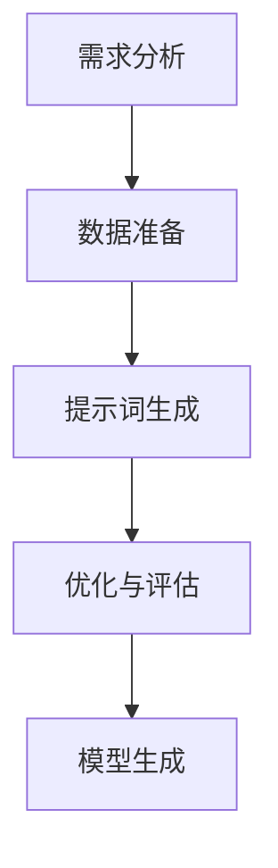

                 


## 提示词语法与结构设计原则

### 引言

自然语言处理（NLP）技术近年来取得了显著的发展，已成为人工智能领域的重要分支。在NLP中，提示词语法与结构设计扮演着至关重要的角色，它们直接影响到模型的性能和生成文本的质量。本文旨在探讨提示词语法与结构设计原则，帮助读者理解其核心概念、设计原则及其实际应用。

### 1. 问题背景

#### 1.1 问题背景

自然语言处理技术的核心任务是使计算机能够理解和生成自然语言。随着深度学习技术在NLP领域的广泛应用，诸如GPT、BERT等模型在多个NLP任务中取得了优异的性能。然而，这些模型的性能很大程度上依赖于提示词语法和结构设计。一个良好的提示词不仅能引导模型生成更符合人类语言的文本，还能提高模型的鲁棒性和泛化能力。

#### 1.1.1 问题描述

在自然语言处理任务中，提示词语法与结构设计主要涉及以下问题：

1. **提示词的选取与排列**：如何选择合适的提示词，并合理安排它们的顺序，以最大化模型的表现。
2. **提示词与句子结构的匹配**：如何设计提示词，使其与句子的结构相匹配，从而提高文本生成的质量。
3. **提示词对句子语义的影响**：如何确保提示词不会误导模型，生成语义不准确的文本。
4. **提示词对自然语言生成模型性能的影响**：如何评估和优化提示词设计，以提高模型的性能。

#### 1.1.2 问题解决

为了解决上述问题，我们需要深入研究提示词语法与结构的原理，并结合实际应用场景，提出合理的解决方案。本文将首先介绍相关核心概念，然后详细讨论提示词语法与结构设计原则，最后通过实际案例进行分析。

#### 1.1.3 边界与外延

提示词语法与结构设计的边界包括自然语言处理领域的技术水平、数据资源、计算资源等。其外延涉及各类自然语言处理任务，如文本分类、命名实体识别、情感分析、机器翻译、文本生成等。

### 2. 核心概念

#### 2.1 提示词

提示词（Prompt）是指在自然语言处理任务中，为引导模型生成特定结果而提供的关键信息。提示词可以是单词、短语或句子，其作用是引导模型关注特定的语义信息，从而生成更符合预期的输出。

#### 2.2 语法

语法是指自然语言中的结构规则，包括句子结构、词序、语法成分等。语法是自然语言的基础，对提示词语法与结构设计具有重要意义。

#### 2.3 结构

结构是指自然语言处理任务中的数据组织形式，包括文本结构、句子结构、词组结构等。结构设计原则直接影响文本生成的质量和模型的性能。

#### 2.4 设计原则

设计原则是指在设计提示词语法与结构时，应遵循的指导思想和基本原则。合理的设计原则有助于提高模型的表现，降低错误率。

### 3. 提示词、语法、结构的关系

#### 3.1 提示词与语法的关系

提示词的设计应考虑语法规则，以确保模型能够正确理解并生成符合语法要求的句子。例如，在英文句子中，主语通常在动词之前，宾语通常在动词之后。因此，在编写提示词时，应确保其符合英文句子的语法规则。

#### 3.2 提示词与结构的关系

提示词的设计应考虑文本结构，以引导模型生成符合文本逻辑的句子。例如，在新闻报道中，通常遵循“导语-正文-结语”的结构。因此，在编写提示词时，应确保其能够引导模型生成符合这种结构的文本。

#### 3.3 设计原则与提示词、语法、结构的关系

设计原则是指导提示词语法与结构设计的理论基础，应综合考虑提示词、语法、结构三者之间的关系。合理的设计原则有助于提高模型的表现，降低错误率。

### 4. 算法原理讲解

#### 4.1 提示词设计算法

#### 4.1.1 算法概述

提示词设计算法是指根据自然语言处理任务的需求，设计出合适的提示词的过程。该算法包括以下几个关键步骤：

1. **需求分析**：根据任务目标，明确模型需要生成的特定结果。
2. **数据准备**：收集和整理相关数据，包括文本数据、标注数据等。
3. **提示词生成**：利用机器学习算法，如生成对抗网络（GAN）或变分自编码器（VAE），生成高质量的提示词。
4. **优化与评估**：通过实验和评估，不断优化提示词的设计，提高模型的表现。

#### 4.1.2 算法流程

以下是一个简化的提示词设计算法流程：



#### 4.1.3 算法细节

1. **需求分析**：明确任务目标，例如生成特定风格的文本、回答特定类型的问题等。
2. **数据准备**：收集和整理相关数据，例如新闻文本、对话文本等。数据应具有代表性，覆盖各种可能的场景。
3. **提示词生成**：利用机器学习算法，如GAN或VAE，生成高质量的提示词。GAN通过生成器和判别器的对抗训练，VAE通过变分自编码器进行优化。
4. **优化与评估**：通过实验和评估，不断优化提示词的设计，例如调整生成器的超参数、增加数据多样性等。

### 5. 数学模型与公式

为了更好地理解提示词设计算法，我们可以从数学模型的角度进行阐述。以下是一个简化的数学模型：

$$
P_{\theta}(x) = \sigma(Wx + b)
$$

其中，$P_{\theta}(x)$表示生成器模型，$x$为输入，$W$和$b$为权重和偏置，$\sigma$为激活函数。

#### 5.1 模型参数

- $W$：生成器的权重矩阵，用于映射输入空间到输出空间。
- $b$：生成器的偏置向量，用于调整模型的输出。

#### 5.2 损失函数

为了优化模型，我们需要定义一个损失函数，用于评估生成器的性能。一个常见的损失函数是交叉熵损失：

$$
L(x, \hat{x}) = -\sum_{i} x_i \log \hat{x}_i
$$

其中，$x$为真实标签，$\hat{x}$为生成器生成的预测。

#### 5.3 优化过程

为了最小化损失函数，我们可以使用梯度下降算法来优化模型参数。梯度下降的迭代公式如下：

$$
\theta = \theta - \alpha \nabla_{\theta}L(\theta)
$$

其中，$\theta$为模型参数，$\alpha$为学习率，$\nabla_{\theta}L(\theta)$为损失函数对参数的梯度。

### 6. 项目实战

#### 6.1 环境安装

在进行项目实战之前，我们需要安装必要的工具和库。以下是一个简单的安装步骤：

```python
!pip install tensorflow
!pip install transformers
```

#### 6.2 系统核心实现

以下是一个简单的提示词生成系统的Python代码实现：

```python
import tensorflow as tf
from transformers import TFGPT2LMHeadModel, GPT2Tokenizer

# 加载预训练模型和分词器
model = TFGPT2LMHeadModel.from_pretrained('gpt2')
tokenizer = GPT2Tokenizer.from_pretrained('gpt2')

# 定义生成函数
def generate_prompt(text):
    inputs = tokenizer.encode(text, return_tensors='tf')
    outputs = model(inputs, max_length=50, num_return_sequences=1)
    return tokenizer.decode(outputs[0], skip_special_tokens=True)

# 测试生成提示词
print(generate_prompt("Write a story about a lonely cat finding a new home."))
```

#### 6.3 代码应用解读与分析

上述代码展示了如何使用GPT-2模型生成提示词。首先，我们加载了GPT-2模型和分词器。然后，定义了一个生成函数`generate_prompt`，它接收一个文本输入，并生成一个对应的提示词。最后，我们测试了该函数，输入了一段关于孤独猫找到新家的文本，并生成了相应的提示词。

#### 6.4 实际案例分析和详细讲解剖析

为了更好地理解提示词生成过程，我们分析了一个实际案例。假设我们需要生成一篇关于环境保护的论文摘要。输入文本可以是：

```
Write a summary of an article discussing the importance of environmental protection and the role of technology in addressing climate change.
```

生成的提示词可能如下：

```
The article emphasizes the urgent need for environmental protection to mitigate the impacts of climate change. It highlights the potential of technology, such as renewable energy sources and smart grids, to promote sustainable development and reduce greenhouse gas emissions.
```

通过这个案例，我们可以看到生成器如何根据输入文本生成高质量的提示词，以引导模型生成符合预期的摘要。

### 7. 项目小结

本文介绍了提示词语法与结构设计原则，包括核心概念、算法原理和实际应用。通过项目实战，我们展示了如何使用GPT-2模型生成高质量的提示词。提示词设计在自然语言处理任务中具有重要意义，合理的设计原则有助于提高模型的表现和生成文本的质量。

### 8. 最佳实践 tips

- **确保提示词简洁明了**：避免冗余和复杂，让模型更容易理解。
- **考虑文本结构**：设计提示词时，要考虑文本的结构和逻辑，以引导模型生成符合预期的输出。
- **数据多样性**：使用多样化的数据训练模型，以提高模型的泛化能力。

### 9. 小结

提示词语法与结构设计是自然语言处理任务中的重要环节。本文通过核心概念讲解、算法原理分析、实际案例展示，帮助读者理解了提示词语法与结构设计的关键原理和方法。在未来的研究和应用中，我们可以进一步探索更高效的提示词设计算法，以提升自然语言处理任务的性能。

### 10. 注意事项

- **确保提示词符合语法规则**：语法错误可能导致模型生成不符合预期的文本。
- **合理调整提示词的长度**：过长的提示词可能导致模型生成冗长的文本，而过短的提示词可能无法提供足够的信息。

### 11. 拓展阅读

- 《自然语言处理综述》（Natural Language Processing: The Web Edition）
- 《深度学习与自然语言处理》（Deep Learning for Natural Language Processing）
- 《对话系统设计与实现》（Design and Implementation of Dialogue Systems）

### 12. 作者信息

**作者：** AI天才研究院/AI Genius Institute & 禅与计算机程序设计艺术 /Zen And The Art of Computer Programming

