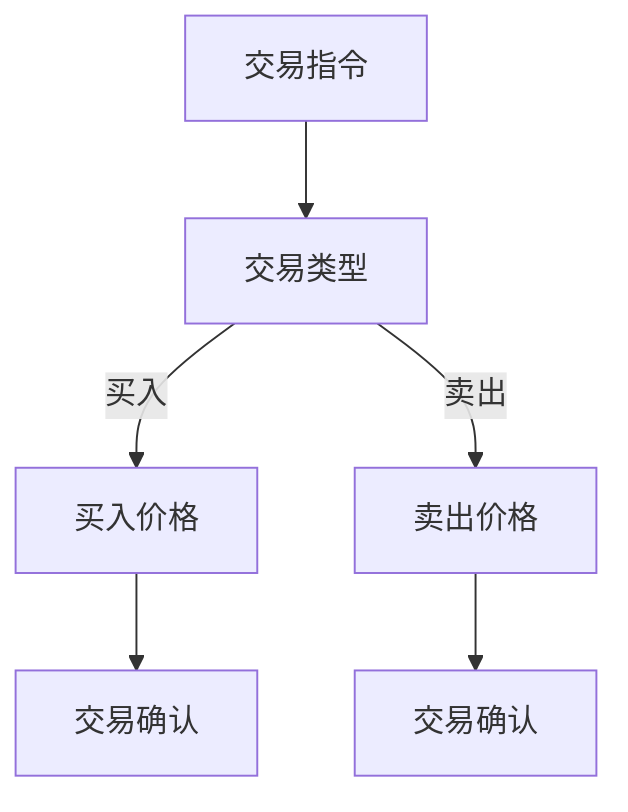
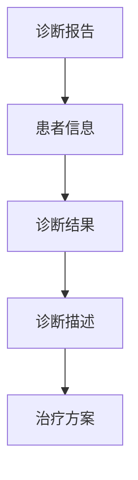
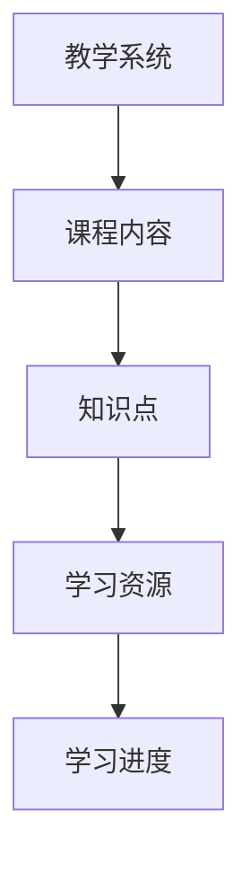

                 

### 提示词语言标准化：推动行业生态系统建设

#### 关键词：提示词语言，标准化，行业生态系统，技术博客，专业分析

> **摘要：** 本文将深入探讨提示词语言标准化的重要性及其对行业生态系统建设的推动作用。我们将逐步分析提示词语言的背景、核心概念、标准化方法，并在不同行业中应用，最终展望标准化对行业生态的未来影响。

#### 引言

随着技术的飞速发展，各个行业对信息处理和数据管理的需求日益增长。而提示词语言作为一种重要的信息交流工具，其在标准化方面的作用显得尤为关键。标准化不仅能提高信息交换的效率，还能促进不同系统之间的兼容性和互操作性，从而推动整个行业生态系统的健康发展。

本文将从以下几个方面进行探讨：

1. **背景介绍**：了解提示词语言的发展历程及其在各个行业中的应用场景。
2. **核心概念与联系**：阐述提示词语言的定义、属性及其与相关技术的关联。
3. **标准化方法**：探讨提示词语言标准化的必要性、原理和方法。
4. **行业应用**：分析标准化在不同行业中的具体应用案例。
5. **未来展望**：探讨标准化对行业生态系统建设的长远影响。

#### 第一部分：背景介绍

##### 1.1 提示词语言的发展历程

提示词语言（Keyword Language）起源于计算机编程领域，最早用于指示计算机执行特定操作。随着信息技术的不断发展，提示词语言的应用范围逐渐扩展到自然语言处理、语义网、人工智能等多个领域。其核心在于通过关键词来组织、管理和检索信息，提高信息处理的效率。

##### 1.2 提示词语言在行业中的应用场景

提示词语言在金融、医疗、教育、物流等多个行业中有着广泛的应用。例如，在金融领域，提示词语言用于自动化交易、风险控制等；在医疗领域，提示词语言有助于医疗数据的标准化和智能分析；在教育领域，提示词语言支持智能教育系统的开发和应用。

#### 第二部分：核心概念与联系

##### 2.1 提示词语言的定义与属性

提示词语言是一种基于关键词的信息组织方式，其核心在于将信息以关键词的形式进行分类和存储。提示词语言具有以下属性：

- **关键词性**：提示词是信息的核心载体，能够直观、准确地表达信息内容。
- **层次性**：提示词语言通常采用分层结构，不同层级的提示词相互关联，形成完整的信息体系。
- **扩展性**：提示词语言能够灵活扩展，适应不同应用场景的需求。

##### 2.2 提示词语言与相关技术的关联

提示词语言与自然语言处理（NLP）、语义网（Semantic Web）等技术有着密切的联系。NLP技术用于解析和处理自然语言，为提示词语言的实现提供了技术支持；语义网则通过统一资源标识符（URI）和资源描述框架（RDF）等技术，实现了提示词语言在互联网上的广泛应用。

#### 第三部分：标准化方法

##### 3.1 标准化的必要性

随着提示词语言应用领域的扩展，标准化显得尤为必要。标准化能够确保不同系统之间的互操作性，提高信息交换的效率，降低系统开发成本。此外，标准化还有助于提升行业整体技术水平，促进产业的健康发展。

##### 3.2 标准化的原理

提示词语言标准化主要涉及以下几个方面：

- **一致性**：确保不同系统和应用场景下的提示词语言具有一致性。
- **兼容性**：确保现有系统和未来系统的兼容性。
- **扩展性**：标准化体系应具备良好的扩展性，以适应未来技术的发展。

##### 3.3 标准化方法

提示词语言标准化方法包括以下几个方面：

- **需求分析**：明确标准化需求，包括应用场景、功能需求等。
- **设计标准**：制定具体的标准化方案，包括关键词规范、语法规则等。
- **实施与推广**：将标准化方案应用于实际系统开发，并推动行业内的普及。

#### 第四部分：行业应用

##### 4.1 金融行业应用

在金融领域，提示词语言标准化有助于提高交易系统的效率和准确性。例如，通过标准化交易指令中的关键词，可以实现自动化交易和风险控制。以下是一个简单的金融交易指令的标准化示例：

##### 4.2 医疗行业应用

在医疗领域，提示词语言标准化有助于医疗数据的标准化和智能分析。以下是一个医疗诊断报告的标准化示例：

##### 4.3 教育行业应用

在教育领域，提示词语言标准化支持智能教育系统的开发和应用。以下是一个智能教育系统的标准化示例：

#### 第五部分：未来展望

##### 5.1 标准化对行业生态系统建设的影响

标准化在推动行业生态系统建设方面具有重要作用。通过标准化，可以实现不同系统和应用之间的无缝连接，促进信息共享和资源整合，从而提升整个行业的创新能力和竞争力。

##### 5.2 未来发展方向

未来，提示词语言标准化将继续向更广泛、更深入的方向发展。一方面，标准化体系将不断更新和完善，以适应新技术和新应用的需求；另一方面，标准化将更加注重用户体验，提高系统的易用性和可维护性。

#### 结论

提示词语言标准化是推动行业生态系统建设的关键因素之一。通过标准化，我们可以提高信息交换的效率，降低系统开发成本，促进产业的健康发展。本文从背景介绍、核心概念与联系、标准化方法、行业应用和未来展望等方面，对提示词语言标准化进行了深入探讨，以期为读者提供有价值的参考。

#### 作者信息

- 作者：AI天才研究院/AI Genius Institute & 禅与计算机程序设计艺术 /Zen And The Art of Computer Programming

---

本文通过对提示词语言标准化进行详细分析，旨在为行业生态系统建设提供理论支持和技术指导。在未来的发展中，标准化工作将更加重要，它将为各行业的创新和发展注入新的动力。我们期待标准化工作能够持续推进，为行业的繁荣和进步贡献力量。

