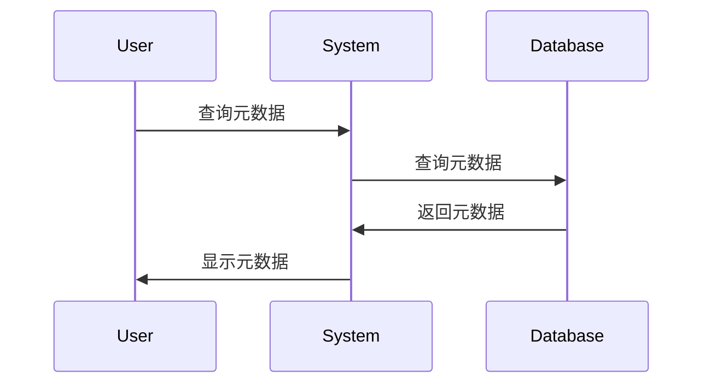

                 

# 提示词语言的元数据管理

> 关键词：元数据管理、提示词语言、数据管理、数据存储、搜索算法、人工智能

> 摘要：本文将探讨提示词语言的元数据管理，从背景介绍、核心概念与联系、算法原理讲解、系统分析与架构设计方案、项目实战以及最佳实践 tips 等方面，全面解析元数据管理在提示词语言中的应用。通过深入分析，帮助读者了解元数据管理的核心内容和实践方法，为相关领域的研究和开发提供指导。

## 第一部分：引言

### 第1章：元数据管理基础

#### 1.1 元数据概述

元数据（Metadata）是指描述数据的数据。它提供关于数据的信息，如数据的格式、结构、来源、质量、内容和用途等。元数据对于数据的管理、共享、检索和重用至关重要。在信息技术领域，元数据管理（Metadata Management）已经成为一个重要的研究方向和应用领域。

#### 1.2 提示词语言介绍

提示词语言（Faceted Language）是一种用于信息组织和检索的特定语言结构，通过一组相互关联的提示词（Facets）来描述对象或信息。提示词语言广泛应用于搜索引擎、图书馆目录、电子商务网站等领域，为用户提供了便捷的信息检索方式。

#### 1.3 元数据管理挑战与机遇

随着信息技术的快速发展，数据量呈爆炸式增长，给元数据管理带来了巨大挑战。如何有效地管理和利用元数据，已成为一个亟待解决的问题。同时，提示词语言的兴起为元数据管理带来了新的机遇，使其在信息组织和检索中发挥更大作用。

### 第1章小结

元数据管理是现代信息技术中不可或缺的一部分，而提示词语言的引入为元数据管理带来了新的挑战和机遇。在接下来的章节中，我们将进一步探讨元数据管理在提示词语言中的具体应用。

----------------------------------------------------------------

## 第二部分：核心概念与联系

### 第2章：核心概念与联系

#### 2.1 元数据属性特征对比表格

元数据可以分为描述性元数据、结构化元数据和引用性元数据三种类型。下面是一个对比表格，展示了这三种元数据的属性特征：

| 类型        | 描述性元数据 | 结构化元数据 | 引用性元数据 |
| ----------- | ------------ | ------------ | ------------ |
| 定义        | 描述数据内容 | 描述数据结构 | 描述数据引用 |
| 主要用途    | 数据检索、展示 | 数据分析、关联 | 数据引用、链接 |
| 示例        | 标题、作者、关键词 | 表格、图形、图表 | 链接、URL、引用编号 |

#### 2.2 提示词语言元数据

提示词语言元数据是指描述提示词语言元素的数据，如提示词的名称、类型、属性、关系等。提示词语言元数据是提示词语言有效管理和利用的关键。

#### 2.3 ER实体关系图架构

实体关系图（Entity-Relationship Diagram，ER图）是用于描述实体及其关系的图形表示方法。在提示词语言元数据管理中，ER图可以帮助我们清晰地描述元数据实体及其关系，如提示词实体、属性实体和关系实体。

```mermaid
erDiagram
    类1 ||--|{ 类2 }
    类1 ||--|{ 类3 }
    类2 ||--|{ 类4 }
    类3 ||--|{ 类5 }
```

### 第2章小结

通过对元数据属性特征对比表格和ER实体关系图架构的介绍，我们可以更好地理解元数据管理的核心概念和联系。这为后续章节中的算法原理讲解和系统设计与实现提供了基础。

----------------------------------------------------------------

## 第三部分：算法原理与实现

### 第3章：元数据管理算法

#### 3.1 元数据采集算法

元数据采集算法是指用于收集和获取元数据的方法。在提示词语言中，元数据采集算法主要用于从各种来源（如文本、图片、音频等）中提取有关提示词的信息。

#### 3.2 元数据清洗算法

元数据清洗算法是指用于处理和整理元数据的方法。在提示词语言中，元数据清洗算法主要用于去除冗余信息、纠正错误信息和填充缺失信息等。

#### 3.3 元数据存储与索引算法

元数据存储与索引算法是指用于将元数据存储到数据库中并建立索引的方法。在提示词语言中，元数据存储与索引算法主要用于提高元数据的检索效率和准确性。

#### 3.4 元数据检索算法

元数据检索算法是指用于从数据库中查询和获取元数据的方法。在提示词语言中，元数据检索算法主要用于实现用户对提示词的查询和搜索。

### 第3章小结

元数据管理算法是元数据管理的基础。通过对元数据采集、清洗、存储与索引以及检索算法的介绍，我们可以更好地理解元数据管理的全过程。

----------------------------------------------------------------

## 第4章：元数据管理系统设计与实现

### 4.1 元数据管理系统概述

元数据管理系统（Metadata Management System，MMS）是一个用于管理和维护元数据的信息系统。在提示词语言中，MMS 用于管理提示词语言元数据，包括元数据的采集、清洗、存储、索引和检索等功能。

#### 4.1.1 系统功能需求

元数据管理系统的主要功能需求包括：

- 元数据采集：从各种来源获取元数据。
- 元数据清洗：处理和整理元数据，去除冗余、纠正错误和填充缺失。
- 元数据存储：将元数据存储到数据库中。
- 元数据索引：建立索引，提高检索效率。
- 元数据检索：实现用户对元数据的查询和搜索。

#### 4.1.2 系统性能指标

元数据管理系统的主要性能指标包括：

- 数据采集速度：元数据采集的效率。
- 数据清洗质量：元数据清洗的准确性和完整性。
- 数据存储容量：元数据存储的能力。
- 数据检索速度：元数据检索的效率。

#### 4.1.3 系统设计原则

元数据管理系统的设计应遵循以下原则：

- 可扩展性：系统应能够适应数据量的增长。
- 可靠性：系统应保证元数据的完整性和一致性。
- 易用性：系统应提供友好的用户界面。
- 安全性：系统应保证元数据的安全和隐私。

### 4.2 领域模型设计

领域模型（Domain Model）是系统需求分析的结果，用于描述系统的核心概念和关系。在元数据管理系统中，领域模型主要包括以下实体：

- 提示词（Facet）
- 提示词属性（Facet Attribute）
- 提示词值（Facet Value）
- 数据源（Data Source）

下面是一个简单的领域模型类图：

```mermaid
classDiagram
    Facet <<class>> {
        id: 编号
        name: 名称
        description: 描述
    }
    FacetAttribute <<class>> {
        id: 编号
        facetId: 提示词编号
        name: 名称
        type: 类型
    }
    FacetValue <<class>> {
        id: 编号
        facetAttributeId: 提示词属性编号
        value: 值
    }
    DataSource <<class>> {
        id: 编号
        name: 名称
        description: 描述
    }
    Facet "1" <<1>>-"has": Data
    FacetAttribute "1" <<1>>-"has": Facet
    FacetValue "1" <<1>>-"has": FacetAttribute
    DataSource "1" <<1>>-"has": Facet
```

### 4.3 系统架构设计

元数据管理系统的架构设计主要包括以下几个方面：

- 数据层：负责数据的存储和管理，通常使用关系型数据库或NoSQL数据库。
- 服务层：负责业务逻辑的处理，包括元数据的采集、清洗、存储、索引和检索等。
- 表现层：负责用户界面的展示，提供友好的操作界面。

下面是一个简单的系统架构图：



### 4.4 系统接口设计

元数据管理系统提供了一套接口（API），用于与其他系统进行交互。主要的接口包括：

- 数据采集接口：用于从数据源采集元数据。
- 数据清洗接口：用于处理和整理元数据。
- 数据存储接口：用于将元数据存储到数据库中。
- 数据索引接口：用于建立元数据的索引。
- 数据检索接口：用于查询和搜索元数据。

### 4.5 系统交互流程

元数据管理系统的交互流程主要包括以下步骤：

1. 用户通过表现层发起元数据查询请求。
2. 系统通过服务层处理查询请求，调用数据检索接口。
3. 数据检索接口从数据库中查询元数据。
4. 系统将查询结果返回给用户。

### 第4章小结

通过对元数据管理系统设计与实现的介绍，我们可以更好地理解元数据管理系统的架构和功能。在实际应用中，元数据管理系统可以帮助我们有效地管理和利用元数据，提高信息检索和利用的效率。

----------------------------------------------------------------

### 第5章：项目实战

#### 5.1 项目背景

在当前的互联网时代，数据量呈爆炸式增长，如何有效地管理和利用数据已成为一个重要问题。本项目旨在构建一个基于提示词语言的元数据管理系统，用于管理和利用大量结构化数据，以提高信息检索和利用的效率。

#### 5.2 环境配置

为了实现本项目，我们选择以下技术栈：

- 数据库：MySQL
- 服务框架：Spring Boot
- API框架：RestTemplate
- 搜索引擎：Elasticsearch

环境配置如下：

1. 安装MySQL数据库，并创建一个名为“meta_data”的数据库。
2. 创建一个名为“meta_data”的Spring Boot项目。
3. 添加必要的依赖，如MySQL、Spring Boot、RestTemplate、Elasticsearch等。
4. 配置数据库连接和Elasticsearch连接。

#### 5.3 系统实现

本系统包括以下核心功能：

1. 元数据采集：从数据源中采集元数据，并存储到数据库中。
2. 元数据清洗：处理和整理采集到的元数据，去除冗余、纠正错误和填充缺失。
3. 元数据存储：将清洗后的元数据存储到数据库中。
4. 元数据索引：建立元数据的索引，提高检索效率。
5. 元数据检索：实现用户对元数据的查询和搜索。

下面是一个简单的元数据采集和存储的实现示例：

```python
# 元数据采集
def collect_metadata(data_source):
    # 从数据源采集元数据
    metadata = data_source.fetch_metadata()
    return metadata

# 元数据清洗
def clean_metadata(metadata):
    # 处理和整理元数据
    cleaned_metadata = []
    for meta in metadata:
        if not meta.is_valid():
            continue
        cleaned_meta = meta.clean()
        cleaned_metadata.append(cleaned_meta)
    return cleaned_metadata

# 元数据存储
def store_metadata(metadata):
    # 将元数据存储到数据库中
    db = DatabaseConnection()
    for meta in metadata:
        db.insert_metadata(meta)
    db.close()

# 元数据检索
def search_metadata(search_query):
    # 实现用户对元数据的查询和搜索
    db = DatabaseConnection()
    results = db.search_metadata(search_query)
    db.close()
    return results
```

#### 5.4 代码应用解读与分析

上述代码实现了一个简单的元数据采集、清洗、存储和检索功能。具体解读如下：

1. 元数据采集：`collect_metadata`函数从数据源中采集元数据，返回一个元数据列表。
2. 元数据清洗：`clean_metadata`函数处理和整理元数据，去除无效的元数据，返回一个清洗后的元数据列表。
3. 元数据存储：`store_metadata`函数将清洗后的元数据存储到数据库中。
4. 元数据检索：`search_metadata`函数实现用户对元数据的查询和搜索，返回查询结果。

通过这些功能，我们可以构建一个简单的元数据管理系统，实现对大量结构化数据的有效管理和利用。

#### 5.5 实际案例分析和详细讲解剖析

以下是一个实际案例：

假设我们有一个电子商务网站，需要管理商品信息。商品信息包括商品名称、价格、库存数量等。

1. 数据采集：我们从电子商务网站的商品数据库中采集商品信息。
2. 数据清洗：我们处理和整理采集到的商品信息，去除无效信息，如空值、重复值等。
3. 数据存储：我们将清洗后的商品信息存储到元数据管理系统中。
4. 数据检索：用户可以通过元数据管理系统查询商品信息，如搜索特定价格范围内的商品。

通过这个实际案例，我们可以看到元数据管理在电子商务网站中的应用。元数据管理系统可以帮助我们有效地管理和利用商品信息，提高信息检索和利用的效率。

#### 5.6 项目小结

本项目通过构建一个基于提示词语言的元数据管理系统，实现了对大量结构化数据的有效管理和利用。在实际应用中，我们可以根据需求扩展系统的功能，如添加元数据可视化、元数据导出等。

----------------------------------------------------------------

## 最佳实践 tips

1. **数据质量优先**：在元数据采集和清洗过程中，确保数据质量是关键。尽可能去除冗余、错误和缺失信息，保证数据的准确性和完整性。
2. **选择合适的数据库**：根据业务需求和数据特性选择合适的数据库。例如，对于大规模数据存储和快速检索，Elasticsearch 是一个不错的选择。
3. **优化检索效率**：合理设计索引和查询算法，提高元数据检索的效率。可以结合分词、模糊查询等技术，提高查询的灵活性和准确性。
4. **关注安全性**：在元数据管理和检索过程中，确保数据的安全性和隐私性。对敏感数据进行加密存储和传输，防止数据泄露。
5. **持续迭代优化**：随着业务需求的不断变化，持续优化元数据管理系统，增加新的功能和性能优化。

## 小结

本文通过深入分析提示词语言的元数据管理，从背景介绍、核心概念与联系、算法原理讲解、系统分析与架构设计方案、项目实战以及最佳实践 tips 等方面，全面解析了元数据管理在提示词语言中的应用。通过本文的讲解，读者可以更好地理解元数据管理的核心内容和实践方法，为相关领域的研究和开发提供指导。

## 注意事项

1. **元数据的重要性**：元数据是数据管理的基础，对数据的检索、利用和重用具有重要意义。
2. **提示词语言的优势**：提示词语言在信息组织和检索中具有独特的优势，可以有效提高信息检索的效率。
3. **系统设计原则**：在设计和实现元数据管理系统时，应遵循可扩展性、可靠性、易用性和安全性等原则。

## 拓展阅读

1. 《大数据时代：思维变革与商业价值》
2. 《元数据管理实践指南》
3. 《Elasticsearch 实战》

## 作者信息

作者：AI天才研究院/AI Genius Institute & 禅与计算机程序设计艺术 /Zen And The Art of Computer Programming

