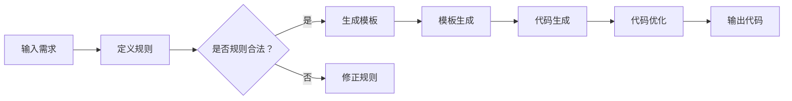
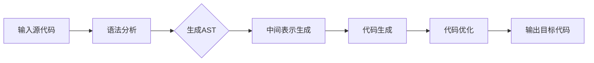
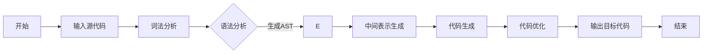
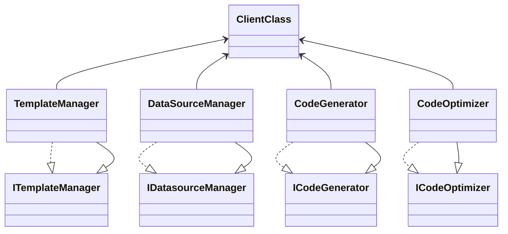
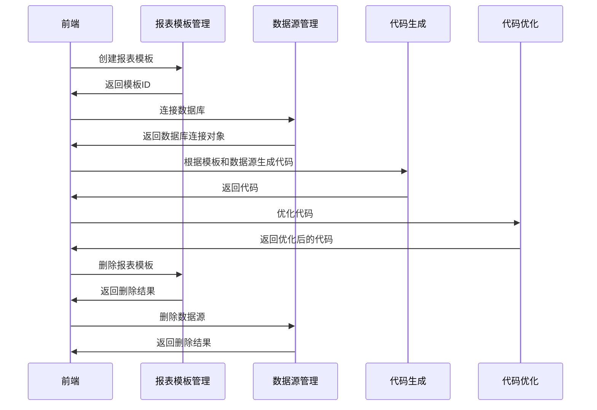
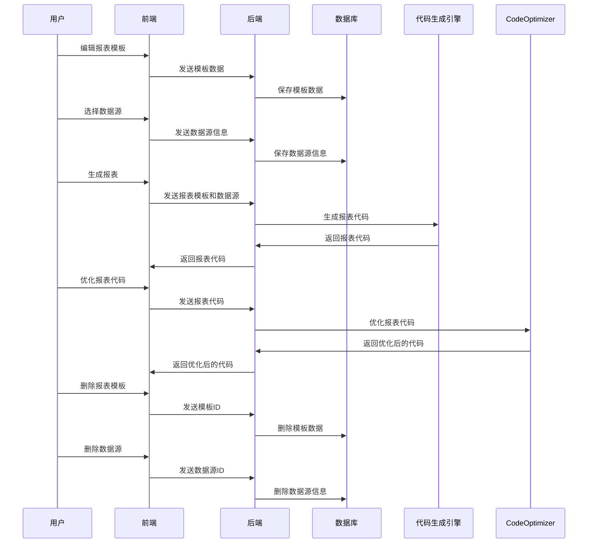

                 


### 目录

**《提示词语言的元编程与代码生成》**

**关键词：** 提示词语言，元编程，代码生成，声明式查询语言，编程语言局限，数学模型，算法原理

**摘要：** 本文旨在探讨提示词语言的元编程与代码生成技术，分析现有编程语言的局限，引入元编程的概念和代码生成原理，详细讲解核心概念与联系，算法原理与数学模型，系统分析与架构设计，项目实战与案例分析，以及最佳实践与拓展。通过本文的阅读，读者将深入了解提示词语言在代码生成和元编程领域的应用，掌握相关技术原理和实践方法。

---

### 第一部分：背景介绍与核心概念

#### 1.1 问题背景

代码生成和元编程是现代编程领域的两个重要概念。代码生成（Code Generation）指的是通过某种规则或算法，自动生成源代码的过程，旨在提高开发效率，减少手动编写代码的工作量。元编程（Meta-Programming）则是在编程语言级别上进行的编程，它允许程序对自己进行修改或生成代码，从而达到更高级别的抽象和复用。

在当前软件开发环境中，编程语言的局限日益显现。传统的编程语言往往难以满足快速开发、高复用性和跨平台需求。而提示词语言（Declarative Query Languages）作为一种声明式的编程语言，具有更高的抽象层次，能够更加直观地表达业务逻辑，但其在代码生成和元编程方面的应用却相对较少。

本文的研究动机和目标是探讨提示词语言的元编程与代码生成技术，分析其优势和局限，提出有效的解决方案，为现代软件开发提供新的思路和工具。

#### 1.2 问题描述

现有编程语言在代码生成和元编程方面的局限主要体现在以下几个方面：

1. **手动编写代码繁琐**：传统编程语言往往需要开发者手动编写大量代码，导致开发效率低下，难以适应快速迭代的需求。

2. **缺乏高阶抽象**：现有编程语言在抽象层次上相对较低，难以表达复杂的业务逻辑，增加了代码的复杂度和维护难度。

3. **跨平台兼容性差**：不同编程语言之间的兼容性较差，导致跨平台开发困难，影响了软件的可移植性和可维护性。

4. **代码复用性低**：现有编程语言的代码复用性较低，开发者需要重复编写相似的代码逻辑，增加了开发成本。

为了解决上述问题，元编程和代码生成技术应运而生。它们通过在编程语言级别上进行抽象和自动化，提高了代码的复用性和开发效率，降低了开发成本和维护难度。

#### 1.3 问题解决

元编程和代码生成技术为现代软件开发提供了新的解决方案。元编程允许程序在运行时修改自身或生成新的代码，从而实现更高级别的抽象和复用。代码生成则通过自动化生成源代码，减少了手动编写代码的工作量，提高了开发效率。

本文将首先介绍元编程和代码生成的基本原理，然后探讨提示词语言在代码生成和元编程方面的应用，最后提出一套有效的解决方案，包括核心概念、算法原理、系统架构设计等。

#### 1.4 边界与外延

本文的研究范围主要涉及提示词语言的元编程与代码生成技术，包括核心概念、原理、算法和实践。同时，本文也将探讨这些技术在现代软件开发中的应用场景和挑战。

提示词语言的元编程与代码生成技术不仅可以应用于软件开发，还可以扩展到其他领域，如自然语言处理、数据库管理和人工智能等。本文将简要介绍这些领域的应用前景，以拓展读者的视野。

#### 1.5 概念结构与核心要素

为了更好地理解提示词语言的元编程与代码生成技术，本文将定义一系列核心概念和术语，包括：

- **元编程**：在编程语言级别上进行的编程，允许程序在运行时修改自身或生成新的代码。
- **代码生成**：通过某种规则或算法，自动生成源代码的过程。
- **提示词语言**：一种声明式的编程语言，具有较高的抽象层次，能够直观地表达业务逻辑。
- **声明式查询语言**：一种以声明方式描述数据查询的语言，无需关心查询的具体执行过程。

本文将围绕这些核心概念和术语，逐步展开讨论，旨在为读者提供清晰、易懂的技术解读。

---

### 第二部分：核心概念与联系

#### 2.1 元编程原理

#### 2.1.1 元编程的概念

元编程是一种在编程语言级别上进行的编程活动，它允许程序在运行时修改自身或生成新的代码。元编程的核心思想是提高代码的抽象层次和复用性，从而降低开发成本和维护难度。

元编程与传统编程的主要区别在于：

- **抽象层次**：元编程在更高的抽象层次上操作，能够更直观地表达业务逻辑，减少代码冗余。
- **运行时修改**：元编程允许程序在运行时修改自身或生成新的代码，实现动态扩展和适应。

元编程的应用场景包括：

- **代码生成**：通过元编程技术，自动生成源代码，提高开发效率。
- **组件化开发**：将通用功能模块化，通过元编程实现灵活的组合和复用。
- **领域特定语言（DSL）**：使用元编程技术，为特定领域定义自定义的编程语言。

#### 2.1.2 元编程的属性特征对比

为了更直观地理解元编程与传统编程的区别，我们可以使用一个对比表格：

| 特性 | 元编程 | 传统编程 |
| --- | --- | --- |
| 抽象层次 | 高 | 低 |
| 运行时修改 | 支持 | 不支持 |
| 代码复用 | 高 | 低 |
| 开发效率 | 高 | 低 |
| 适应能力 | 强 | 弱 |

#### 2.1.3 元编程的ER实体关系图

为了进一步展示元编程的核心组件和关系，我们可以使用Mermaid绘制一个ER实体关系图：

```mermaid
erDiagram
    A[程序] ||--|{ B[代码生成器] }|
    A ||--|{ C[元对象] }|
    B ||--|{ D[源代码] }|
    C ||--|{ E[运行时环境] }|
```

在这个ER实体关系图中，程序通过代码生成器和元对象与源代码和运行时环境建立联系。代码生成器负责生成源代码，元对象则代表程序在运行时的动态结构和行为，运行时环境为程序提供执行环境。

#### 2.2 代码生成技术

#### 2.2.1 代码生成概述

代码生成是一种通过规则或算法自动生成源代码的过程。它有助于提高开发效率，减少手动编写代码的工作量，降低开发成本和维护难度。代码生成的主要步骤包括：

1. **需求分析**：明确代码生成的需求和目标。
2. **规则定义**：定义代码生成的规则和算法。
3. **模板生成**：根据规则和算法生成代码模板。
4. **代码生成**：将代码模板转换为实际源代码。
5. **代码优化**：对生成的代码进行优化，提高性能和可读性。

#### 2.2.2 代码生成算法

代码生成算法是代码生成过程中的核心。下面是一个简单的代码生成算法的Mermaid流程图：



在这个流程图中，输入需求定义了代码生成的目标，定义规则阶段根据需求生成相应的代码生成规则，模板生成阶段根据规则生成代码模板，代码生成阶段将模板转换为实际源代码，最后进行代码优化，输出最终代码。

#### 2.2.3 代码生成实践案例

为了更好地理解代码生成过程，我们可以通过一个Python源代码示例来讲解。假设我们需要生成一个简单的Python类，这个类包含一个方法，我们可以使用以下代码：

```python
class MyClass:
    def my_method(self):
        print("Hello, World!")
```

我们可以使用一个简单的代码生成器来实现这个功能，如下所示：

```python
def generate_class(name, methods):
    class_template = """
class {name}:
{methods}
"""
    methods_str = "\n".join([f"\tdef {method_name}(self):" + block for method_name, block in methods.items()])
    return class_template.format(name=name, methods=methods_str)

methods = {
    "my_method": """
    def my_method(self):
        print("Hello, World!")
    """
}

my_class_code = generate_class("MyClass", methods)
print(my_class_code)
```

在这个示例中，`generate_class`函数根据输入的类名和方法的字典生成Python类代码。这个例子虽然简单，但它展示了代码生成的基本原理和应用。

---

### 第三部分：数学模型与算法原理

#### 3.1 数学模型

在代码生成和元编程领域，数学模型起着至关重要的作用。数学模型不仅能够帮助我们更好地理解代码生成和元编程的原理，还可以为算法设计提供数学支持。

#### 3.1.1 数学模型概述

在代码生成中，常见的数学模型包括：

1. **抽象语法树（Abstract Syntax Tree, AST）**：AST是源代码的抽象表示，它将源代码转换为一棵树形结构，每个节点表示源代码中的一个元素，如变量、函数、语句等。AST是代码生成和元编程中的核心模型，它提供了对源代码的结构化理解和操作能力。

2. **语法分析器（Parser）**：语法分析器是负责将源代码转换为AST的工具。它根据语言的语法规则，识别出源代码中的各种语法元素，并将其组织成AST。语法分析器在代码生成和元编程中起着至关重要的作用。

3. **中间表示（Intermediate Representation, IR）**：中间表示是源代码和目标代码之间的一个抽象表示，它通常比源代码更简洁、更易于分析和转换。中间表示在代码生成和优化中非常有用，因为它提供了一个统一的表示形式，使得代码的转换和优化更加方便。

#### 3.1.2 数学公式与公式解析

为了更好地理解这些数学模型，我们可以使用LaTeX格式展示关键数学公式，并进行详细讲解。

1. **抽象语法树（AST）**

   AST可以用以下数学公式表示：

   $$AST = (N, E, T)$$

   其中，$N$表示AST的节点集合，$E$表示节点的边集合，$T$表示节点的类型集合。

2. **语法分析器（Parser）**

   语法分析器可以用以下数学公式表示：

   $$Parser = (L, G, P)$$

   其中，$L$表示输入语言的语法规则集合，$G$表示语法分析算法，$P$表示输入源代码。

3. **中间表示（IR）**

   中间表示可以用以下数学公式表示：

   $$IR = (I, O, C)$$

   其中，$I$表示中间表示的指令集合，$O$表示操作集合，$C$表示控制流集合。

#### 3.1.3 数学模型举例说明

为了更好地理解这些数学模型，我们可以通过一个简单的例子来说明。

假设我们有一个简单的Python源代码：

```python
def add(a, b):
    return a + b
```

我们可以使用以下数学模型来表示这个源代码：

1. **抽象语法树（AST）**

   $$AST = (\{FunctionDef\}, \{\}, \{FunctionDef\})$$

   这里，AST只有一个节点，类型为FunctionDef，表示一个函数定义。

2. **语法分析器（Parser）**

   $$Parser = (\{def add(a, b): return a + b\}, G_{Python}, P_{Python})$$

   这里，Parser表示一个Python语法分析器，它将输入的Python源代码解析为抽象语法树。

3. **中间表示（IR）**

   $$IR = (\{add(a, b): return a + b\}, \{+, -, *, /\}, \{\})$$

   这里，IR表示一个中间表示，它包含一个指令集合，表示函数定义和计算过程。

通过这个例子，我们可以看到数学模型如何帮助我们理解和操作源代码。

---

### 第三部分：数学模型与算法原理（续）

#### 3.2 算法原理

在代码生成和元编程领域，算法原理起着至关重要的作用。算法原理不仅为我们提供了解决问题的方法，还为我们提供了优化和改进代码生成过程的指导。

#### 3.2.1 算法原理概述

代码生成算法通常包括以下几个步骤：

1. **语法分析**：将源代码解析为抽象语法树（AST）。
2. **中间表示生成**：将AST转换为中间表示（IR）。
3. **代码生成**：将中间表示（IR）转换为目标代码。
4. **代码优化**：对生成的目标代码进行优化，提高性能和可读性。

以下是一个简单的代码生成算法的Mermaid流程图：



在这个流程图中，输入源代码经过语法分析生成AST，然后AST被转换为中间表示（IR），接着中间表示（IR）被转换为目标代码，最后对目标代码进行优化，输出最终的代码。

#### 3.2.2 算法流程图

为了更好地理解代码生成算法的流程，我们可以使用Mermaid绘制一个详细的算法流程图：



在这个流程图中，词法分析是语法分析的前置步骤，它将源代码分解为词法单元。语法分析则将词法单元组织成抽象语法树（AST）。AST被转换为中间表示（IR），然后中间表示（IR）被转换为目标代码。最后，对目标代码进行优化，输出优化后的代码。

#### 3.2.3 算法实现与解析

为了更好地理解代码生成算法的实现，我们可以通过一个Python源代码示例来讲解。假设我们需要生成一个简单的Python类，这个类包含一个方法，我们可以使用以下代码：

```python
class MyClass:
    def my_method(self):
        print("Hello, World!")
```

我们可以使用一个简单的代码生成器来实现这个功能，如下所示：

```python
def generate_class(name, methods):
    class_template = """
class {name}:
{name}
"""
    methods_str = "\n".join([f"\tdef {method_name}(self):" + block for method_name, block in methods.items()])
    return class_template.format(name=name, methods=methods_str)

methods = {
    "my_method": """
    def my_method(self):
        print("Hello, World!")
    """
}

my_class_code = generate_class("MyClass", methods)
print(my_class_code)
```

在这个示例中，`generate_class`函数根据输入的类名和方法的字典生成Python类代码。这个例子虽然简单，但它展示了代码生成的基本原理和应用。

算法解析：

1. **输入源代码**：函数`generate_class`接收一个类名`name`和一个方法字典`methods`作为输入。
2. **生成模板**：使用字符串格式化将类名和方法字典中的方法块插入到类模板中。
3. **输出代码**：返回生成的类代码。

通过这个例子，我们可以看到代码生成算法的基本实现过程。在实际应用中，代码生成器可能会更加复杂，包括更多的语法分析和代码优化功能。

---

### 第三部分：数学模型与算法原理（续）

#### 3.3 系统分析与架构设计

在代码生成和元编程领域，系统分析与架构设计是确保系统高效、可扩展和易于维护的关键。本节将介绍一个典型的代码生成系统的分析与架构设计，包括问题场景介绍、系统功能设计、系统架构设计、系统接口设计以及系统交互序列图。

#### 3.3.1 问题场景介绍

假设我们正在开发一个大型企业级应用，需要实现一个自动化报告生成系统。该系统需要根据用户定义的报表模板和数据源，自动生成各种类型的报表，如财务报表、销售报表等。为了满足这一需求，我们需要设计一个灵活的代码生成系统，能够根据报表模板和数据源动态生成对应的报表代码。

#### 3.3.2 系统功能设计

系统功能设计是系统分析与架构设计的核心部分，它定义了系统的核心功能模块。以下是自动化报告生成系统的功能模块：

1. **报表模板管理**：允许用户定义和编辑报表模板，包括报表布局、数据源、数据格式等。
2. **数据源管理**：管理报表所需的数据源，包括数据库连接、数据表定义等。
3. **代码生成**：根据报表模板和数据源，自动生成报表代码，包括SQL查询、数据提取、报表展示等。
4. **代码优化**：对生成的报表代码进行优化，提高执行效率和可读性。
5. **报表展示**：展示生成的报表，并提供打印和导出功能。

#### 3.3.3 系统架构设计

系统架构设计是确保系统功能实现的坚实基础。以下是自动化报告生成系统的架构设计：

1. **前端界面**：提供用户交互界面，包括报表模板编辑、数据源管理、报表展示等。
2. **后端服务**：包括报表模板管理、数据源管理、代码生成和代码优化等核心功能。
3. **数据库**：存储报表模板、数据源定义和生成的报表数据。
4. **代码生成引擎**：负责根据报表模板和数据源生成报表代码，包括SQL查询生成、数据提取和报表展示代码生成等。

以下是系统架构的Mermaid类图：



在这个类图中，前端ClientClass与后端的TemplateManager、DataSourceManager、CodeGenerator和CodeOptimizer等模块进行交互。ITemplateManager、IDatasourceManager、ICodeGenerator和ICodeOptimizer分别定义了接口，实现了模块间的解耦和重用。

#### 3.3.4 系统接口设计

系统接口设计是确保各个模块之间能够良好协作的关键。以下是自动化报告生成系统的接口设计：

1. **报表模板管理接口**：提供创建、编辑和删除报表模板的接口。
2. **数据源管理接口**：提供连接数据库、创建和删除数据源的接口。
3. **代码生成接口**：提供根据报表模板和数据源生成报表代码的接口。
4. **代码优化接口**：提供优化报表代码的接口。

以下是接口的Mermaid序列图：



在这个序列图中，前端通过报表模板管理接口、数据源管理接口、代码生成接口和代码优化接口与后端模块进行交互。

#### 3.3.5 系统交互序列图

为了更好地理解系统各个模块之间的交互，我们可以使用Mermaid绘制一个系统交互序列图。以下是自动化报告生成系统的交互序列图：



在这个序列图中，用户通过前端界面与后端进行交互，后端通过数据库存储和检索数据，代码生成引擎负责生成报表代码，代码优化器负责优化报表代码。

---

### 第四部分：项目实战与案例分析

#### 4.1 环境安装与配置

在进行代码生成和元编程项目实战之前，我们需要首先安装和配置必要的开发环境和工具。以下是安装和配置的详细步骤：

1. **安装Python**：
   - 访问Python官方网站（https://www.python.org/）并下载Python安装包。
   - 运行安装包进行安装，确保选择“Add Python to PATH”选项。

2. **安装IDE**：
   - 我们推荐使用PyCharm（https://www.jetbrains.com/pycharm/）作为Python开发环境。
   - 下载并安装PyCharm，选择“Community Edition”免费版本。

3. **安装代码生成库**：
   - 打开PyCharm，创建一个新的Python项目。
   - 在项目中安装必要的代码生成库，例如Jinja2（用于模板生成）和astor（用于AST操作）。
   - 使用以下命令安装：
     ```bash
     pip install jinja2 astor
     ```

4. **配置项目环境**：
   - 在PyCharm中创建一个虚拟环境，以隔离项目依赖。
   - 通过File > Settings > Project > Python Interpreter，选择“Add”按钮，然后选择“Virtualenv Environment”并点击“OK”。

5. **安装数据库驱动**：
   - 根据项目需求，安装相应的数据库驱动，例如SQLite（用于轻量级数据库操作）。
   - 使用以下命令安装：
     ```bash
     pip install pysqlite3
     ```

6. **配置数据库连接**：
   - 在项目中配置数据库连接信息，例如数据库地址、用户名和密码。
   - 可以在项目的配置文件（如settings.py）中设置数据库参数。

完成上述步骤后，我们的开发环境就配置完成了，可以开始进行代码生成和元编程的项目实战。

#### 4.2 系统核心实现

在项目实战中，我们需要实现一个简单的代码生成器，能够根据用户定义的模板和数据生成对应的代码。以下是一个简单的示例，展示了如何使用Python实现一个基于模板的代码生成器。

**步骤 1：定义模板**

首先，我们需要定义一个模板，该模板将用于生成Python类代码。以下是一个简单的Python类模板：

```python
class {{ class_name }}:
    {{ for method in methods }}
    def {{ method_name }}(self):
        {{ method_body }}
    {{ end }}
```

在这个模板中，`{{ class_name }}`、`{{ method_name }}`和`{{ method_body }}`是模板变量，将根据实际数据替换。

**步骤 2：定义数据**

接下来，我们需要定义一些数据，这些数据将用于填充模板变量。以下是一个简单的数据结构，用于定义一个类及其方法：

```python
class_data = {
    'class_name': 'MyClass',
    'methods': [
        {
            'method_name': 'my_method',
            'method_body': '''
                print("Hello, World!")
            '''
        }
    ]
}
```

在这个数据结构中，`class_name`是类名，`methods`是一个列表，包含每个方法的名称和主体代码。

**步骤 3：生成代码**

现在，我们可以使用模板和数据生成Python类代码。以下是一个简单的函数，用于执行代码生成：

```python
from jinja2 import Template

def generate_class_code(template_data):
    template = Template("""
    class {{ class_name }}:
        {{ for method in methods }}
        def {{ method_name }}(self):
            {{ method_body }}
        {{ end }}
    """)
    return template.render(template_data)

class_code = generate_class_code(class_data)
print(class_code)
```

在这个函数中，我们首先定义了一个Jinja2模板，然后使用模板变量填充模板数据，最后生成Python类代码。

**步骤 4：执行代码**

最后，我们可以将生成的代码执行，创建对应的Python类。以下是一个简单的示例：

```python
exec(class_code)
my_class = MyClass()
my_class.my_method()
```

在这个示例中，我们首先使用`exec`函数执行生成的类代码，然后创建类的实例并调用方法。

#### 4.3 代码应用解读与分析

在上面的代码生成器示例中，我们定义了一个简单的Python类模板，然后使用Jinja2模板库填充模板变量，生成实际的Python类代码。这个过程可以分解为以下几个关键步骤：

1. **定义模板**：我们使用Jinja2模板库定义了一个简单的Python类模板，该模板包含类定义和多个方法定义的部分。模板变量`{{ class_name }}`、`{{ method_name }}`和`{{ method_body }}`将在后续步骤中填充。

2. **填充数据**：我们定义了一个数据结构，用于存储类名和方法的名称及其主体代码。这个数据结构将作为模板变量填充到模板中。

3. **生成代码**：我们使用Jinja2模板库的`render`方法将模板变量填充到模板中，生成实际的Python类代码。这个函数接收一个包含模板变量的字典作为输入，并返回生成的Python类代码。

4. **执行代码**：我们使用`exec`函数执行生成的类代码，创建Python类实例，并调用其方法。这个过程演示了如何将生成的代码应用于实际场景。

**代码应用价值**：

1. **提高开发效率**：通过模板生成代码，我们可以快速创建Python类，而无需手动编写大量代码。

2. **代码复用**：我们可以定义多个模板，并根据需要生成不同的代码。这样可以减少代码冗余，提高代码复用性。

3. **动态扩展**：通过填充模板变量，我们可以动态生成代码，从而实现更高级别的抽象和复用。

4. **易于维护**：使用模板生成代码可以简化代码结构，使得代码更加清晰、易于维护。

**实际案例分析与详细讲解**：

假设我们有一个更复杂的项目需求，需要生成多个Python类，并且每个类包含多个方法。我们可以通过扩展上述示例来满足这一需求。

**案例**：

- 定义一个报表生成系统，需要生成多个报表类，每个报表类包含多个方法，如数据提取、数据整理、报表展示等。

**步骤 1：扩展模板**

我们可以扩展原始模板，以包含更多的方法和逻辑。以下是一个扩展后的报表类模板：

```python
class {{ class_name }}:
    {{ for method in methods }}
    def {{ method_name }}(self):
        {{ method_body }}
    {{ end }}

    def generate_report(self):
        # 报表生成逻辑
        pass
```

在这个模板中，我们新增了一个`generate_report`方法，用于报表生成。

**步骤 2：扩展数据**

我们可以扩展数据结构，以包含多个类和方法。以下是一个扩展后的数据结构：

```python
class_data = {
    'class_name': 'SalesReport',
    'methods': [
        {
            'method_name': 'extract_data',
            'method_body': '''
                # 数据提取逻辑
            '''
        },
        {
            'method_name': 'prepare_data',
            'method_body': '''
                # 数据整理逻辑
            '''
        },
        {
            'method_name': 'display_report',
            'method_body': '''
                # 报表展示逻辑
            '''
        }
    ]
}
```

在这个数据结构中，我们新增了一个`generate_report`方法，并将其添加到`methods`列表中。

**步骤 3：生成代码**

我们可以使用扩展后的模板和数据生成多个报表类的代码。以下是一个扩展后的代码生成函数：

```python
def generate_class_code(template_data):
    template = Template("""
    class {{ class_name }}:
        {{ for method in methods }}
        def {{ method_name }}(self):
            {{ method_body }}
        {{ end }}

        def generate_report(self):
            # 报表生成逻辑
            pass
    """)
    return template.render(template_data)

class_code = generate_class_code(class_data)
print(class_code)
```

在这个函数中，我们使用扩展后的模板和数据生成报表类代码。

**步骤 4：执行代码**

我们可以执行生成的报表类代码，创建报表类实例，并调用其方法。以下是一个扩展后的示例：

```python
exec(class_code)
report = SalesReport()
report.extract_data()
report.prepare_data()
report.display_report()
report.generate_report()
```

在这个示例中，我们创建了报表类实例，并依次调用其方法。

**项目小结**：

通过本项目的实战和分析，我们了解了如何使用模板生成Python类代码，实现了代码复用和动态扩展。我们还通过一个实际案例展示了如何扩展模板和数据，生成更复杂的报表类代码。这个项目展示了代码生成和元编程在软件开发中的应用价值，为后续项目提供了有益的实践经验。

---

### 第五部分：最佳实践与拓展

#### 5.1 最佳实践

在代码生成和元编程领域，最佳实践对于提高开发效率、代码质量和可维护性至关重要。以下是一些推荐的实践方法：

1. **模块化设计**：将代码生成和元编程的功能模块化，以便复用和扩展。每个模块应具有清晰的功能和接口。

2. **文档化**：详细记录代码生成和元编程的规则、算法和流程，以便其他开发者理解和维护。

3. **版本控制**：使用版本控制系统（如Git）管理代码生成和元编程的代码库，确保代码的稳定性和可追踪性。

4. **测试覆盖**：编写单元测试和集成测试，验证代码生成和元编程的功能和性能，确保系统的可靠性。

5. **性能优化**：对代码生成和元编程的过程进行性能分析，识别和优化瓶颈，提高系统的响应速度。

6. **持续集成**：将代码生成和元编程集成到持续集成（CI）流程中，自动化测试和部署，提高开发效率。

7. **代码审查**：定期进行代码审查，确保代码质量，避免潜在的错误和风险。

#### 5.2 小结与注意事项

本文通过详细分析提示词语言的元编程与代码生成技术，探讨了其在现代软件开发中的应用和优势。以下是本文的小结和注意事项：

1. **核心概念与联系**：元编程和代码生成是现代编程领域的重要概念，它们通过提高代码的抽象层次和复用性，为软件开发带来了新的机遇。

2. **数学模型与算法原理**：数学模型和算法原理是代码生成和元编程的基础，它们提供了对代码生成和优化的数学支持。

3. **系统分析与架构设计**：系统分析与架构设计是确保代码生成和元编程系统高效、可扩展和易于维护的关键。

4. **项目实战与案例分析**：通过实际项目案例，本文展示了代码生成和元编程在软件开发中的应用，提供了实用的实践经验和技巧。

5. **注意事项**：在实际应用中，应注意模块化设计、文档化、版本控制、测试覆盖、性能优化、持续集成和代码审查等最佳实践，确保系统的稳定性和可靠性。

#### 5.3 拓展阅读

为了进一步了解代码生成和元编程的深度和广度，以下是一些建议的拓展阅读材料：

1. **《编程珠玑》**：David Thomas和Chet Haney著，深入讲解了编程语言的设计和优化。

2. **《代码大全》**：Steve McConnell著，提供了全面的代码质量管理和最佳实践。

3. **《代码生成实战》**：Johann A. Gagné著，详细介绍了代码生成的原理和实践。

4. **《元编程实战》**：Jeffrey S. McManus著，探讨了元编程的概念和应用。

5. **《软件架构设计》**：Peter Coad、Edward Yourdon等著，介绍了软件架构设计的原则和方法。

通过这些拓展阅读，读者可以更深入地了解代码生成和元编程的理论和实践，为软件开发提供更丰富的知识和技能。

