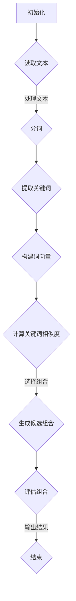
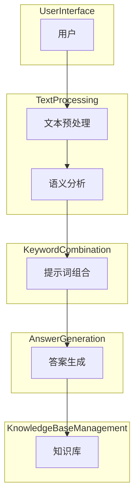
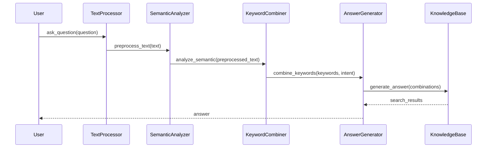

                 


### 1.1.1 提示词语言的应用现状

提示词语言，作为一种先进的自然语言处理技术，近年来在人工智能领域取得了显著的进展。其应用范围广泛，涵盖了搜索引擎优化（SEO）、智能客服、自动问答系统、文本生成以及许多其他领域。

在搜索引擎优化（SEO）方面，提示词语言的应用已经成为了网站内容优化的重要工具。通过分析用户的搜索行为，搜索引擎可以生成更精确、更相关的提示词，从而提高搜索结果的排名和用户体验。

在智能客服领域，提示词语言的应用使得机器可以理解并回应用户的提问，提供实时、个性化的服务。例如，在线购物平台可以利用提示词语言来理解消费者的疑问，并提供针对性的产品推荐和解答。

自动问答系统也是提示词语言的另一个重要应用场景。这些系统能够根据用户提出的问题，自动生成答案，大大提高了信息检索的效率。例如，一些在线知识库和问答社区就利用了提示词语言技术，为用户提供高效的信息查询服务。

文本生成是提示词语言的另一个重要应用。通过对大量文本数据进行学习，提示词语言可以生成符合语法和语义规则的新文本。这一技术被广泛应用于内容创作、新闻报道生成、机器翻译等领域。

尽管提示词语言在许多领域已经取得了显著的应用成果，但其在可组合性方面仍然存在一定的局限性。这主要是由于提示词语言在处理复杂问题时，往往需要多个提示词之间的组合和协同工作。然而，现有的提示词语言技术尚未能有效地支持这种组合和协同工作，从而限制了其在更广泛的应用场景中的发挥。

### 1.1.2 可组合性的重要性

提示词语言的可组合性在其实际应用中具有重要意义。首先，可组合性使得提示词语言能够处理更复杂的任务。例如，在一个智能客服系统中，用户可能会提出一个包含多个问题的问题，如“请问这款手机有红色版本吗？它的电池续航如何？”为了回答这个问题，系统需要能够将“红色版本”、“手机”和“电池续航”等不同的提示词组合起来，从而生成一个完整的回答。

其次，可组合性提高了提示词语言的可扩展性。在现有的提示词语言系统中，通常需要为每个单独的提示词设计专门的模型和处理逻辑。然而，随着应用场景的不断扩大和多样化，这种设计方式变得难以维护和扩展。通过提高可组合性，提示词语言可以更加灵活地适应不同的应用需求，从而降低系统的复杂性和维护成本。

此外，可组合性还提高了提示词语言的智能化程度。在复杂的应用场景中，单一提示词可能无法准确理解用户的意图。通过组合多个提示词，系统可以更全面、更准确地理解用户的提问，从而提供更加智能的服务。例如，在智能问答系统中，通过组合“天气”、“城市”和“预报”等提示词，系统可以准确理解用户对某城市未来天气的询问，并提供相应的天气信息。

### 1.1.3 研究的必要性

研究提示词语言的可组合性具有重要的现实意义。首先，随着人工智能技术的不断发展和应用场景的扩大，提示词语言在实际应用中面临着越来越复杂的问题。现有的提示词语言技术难以有效支持这些复杂问题的处理，因此需要研究如何提高提示词语言的可组合性，以应对这些挑战。

其次，提高提示词语言的可组合性有助于推动自然语言处理技术的发展。自然语言处理是人工智能的核心技术之一，而提示词语言作为自然语言处理的重要分支，其可组合性的提升将有助于推动整个领域的发展。

此外，研究提示词语言的可组合性还可以为其他相关领域提供有益的启示。例如，在计算机编程中，函数的组合和复用是提高代码可读性和可维护性的关键。提示词语言的可组合性研究可以借鉴计算机编程中的相关经验，为自然语言处理领域提供新的思路和方法。

### 1.2 问题描述

#### 1.2.1 提示词语言定义

提示词语言（Keyword-based Language），是一种以关键词为核心的语义表示方法。它通过识别文本中的关键词，提取文本的语义信息，从而实现自然语言处理任务。提示词语言的核心在于关键词的选取和语义理解，通过对关键词的深度学习和分析，实现文本的语义表示和推理。

在提示词语言中，关键词的选取至关重要。关键词的选择不仅影响到文本的语义表示，还决定了系统的处理效率和准确性。因此，提示词语言的定义和实现需要综合考虑关键词的选取、语义理解、以及语言模型的设计。

#### 1.2.2 提示词组合问题

提示词组合问题是指在处理复杂问题时，如何将多个提示词组合起来，以实现更准确的语义理解和更高效的文本处理。在自然语言处理中，许多问题都需要对多个提示词进行组合和分析，以提取更深层次的语义信息。例如，在一个智能问答系统中，用户可能会提出一个包含多个关键词的问题，如“北京明天天气如何？”系统需要能够将“北京”、“明天”和“天气”等关键词组合起来，以提取出用户关心的天气信息。

提示词组合问题的挑战在于如何有效地将多个提示词组合起来，以实现更准确的语义理解和更高效的文本处理。现有的提示词语言技术通常采用基于规则的组合方法，但这些方法在处理复杂问题时存在局限性。因此，研究如何提高提示词语言的可组合性，实现更灵活、更高效的提示词组合，是当前自然语言处理领域的一个重要课题。

#### 1.2.3 研究的目标和问题

研究提示词语言的可组合性，旨在解决以下问题和实现以下目标：

1. **问题解决**：

   - **提升语义理解能力**：通过研究提示词的组合方式，提高系统对复杂语义信息的理解能力。
   - **提高处理效率**：设计更加高效的提示词组合算法，提高系统的处理速度和性能。
   - **增强系统灵活性**：使系统能够根据不同的应用场景，灵活地组合和使用提示词。

2. **目标**：

   - **构建可组合性模型**：研究并设计一种有效的提示词组合模型，能够灵活地组合多个提示词，实现语义理解和文本处理。
   - **优化算法性能**：通过优化算法设计，提高提示词组合算法的效率和准确性。
   - **实现跨领域应用**：研究提示词组合方法在多个应用领域的适应性，实现跨领域的应用。

为了实现这些目标和解决问题，本研究将采用以下方法：

- **理论分析**：对提示词组合问题进行深入的理论分析，探索提示词组合的原理和方法。
- **实验验证**：通过实验验证所提出的提示词组合模型和算法的有效性和性能。
- **实际应用**：将研究成果应用于实际的自然语言处理任务中，验证其应用效果。

### 1.3 边界与外延

#### 1.3.1 研究范围界定

本研究主要关注提示词语言的可组合性，涉及关键词的选取、组合算法的设计和性能优化。具体来说，研究内容包括：

- **关键词选取**：研究如何从文本中选取最具代表性的关键词，以实现准确的语义表示。
- **组合算法设计**：研究不同类型的提示词组合算法，探索如何有效组合多个提示词，以实现更准确的语义理解。
- **算法性能优化**：研究如何优化组合算法的效率和准确性，提高系统的处理性能。

同时，本研究将重点关注以下应用领域：

- **搜索引擎优化（SEO）**：研究如何利用提示词组合提高搜索结果的准确性和用户体验。
- **智能客服**：研究如何利用提示词组合为用户提供更智能、更个性化的服务。
- **自动问答系统**：研究如何利用提示词组合提高系统的语义理解能力和回答准确性。

#### 1.3.2 非研究内容说明

本研究不包括以下内容：

- **自然语言处理基础技术**：如词法分析、句法分析和语义分析等，这些技术是提示词语言研究的基础，但不在本研究的重点范围之内。
- **深度学习模型**：虽然深度学习技术在自然语言处理领域有广泛应用，但本研究主要关注基于提示词语言的组合方法，不涉及深度学习模型的设计和应用。
- **其他自然语言处理任务**：如文本分类、情感分析、机器翻译等，虽然这些任务与提示词语言有交集，但本研究主要关注提示词组合问题，不涉及其他自然语言处理任务的详细探讨。

#### 1.3.3 关联研究领域

本研究与以下领域密切相关：

- **自然语言处理（NLP）**：提示词语言是自然语言处理的一个重要分支，与NLP的核心技术有广泛的联系。
- **机器学习（ML）**：提示词组合问题涉及到机器学习算法的应用，如聚类、分类和强化学习等。
- **人工智能（AI）**：提示词语言是人工智能技术的重要组成部分，与AI的其他领域，如认知计算、知识表示和推理等密切相关。
- **计算机语言学**：研究语言的结构、语义和语法，为提示词语言的研究提供理论基础。

通过以上内容的研究，本文旨在为提示词语言的可组合性研究提供新的思路和方法，推动自然语言处理技术的发展。

### 1.4 概念结构与核心要素组成

#### 1.4.1 核心概念解析

在本研究中，核心概念包括提示词、语义表示、组合算法、语义理解、自然语言处理（NLP）和机器学习（ML）等。

1. **提示词（Keywords）**：提示词是从文本中提取出的具有代表性的关键词，用于表示文本的语义信息。提示词的选择对语义表示的准确性有重要影响。

2. **语义表示（Semantic Representation）**：语义表示是将文本的语义信息转化为计算机可以理解和处理的形式。通过语义表示，可以实现文本的自动处理和分析。

3. **组合算法（Combination Algorithm）**：组合算法用于将多个提示词组合起来，以实现更准确的语义理解和文本处理。组合算法的设计和优化是提示词语言可组合性的关键。

4. **语义理解（Semantic Understanding）**：语义理解是自然语言处理的核心任务之一，旨在理解文本的含义和意图。通过语义理解，可以实现智能问答、信息检索和文本生成等任务。

5. **自然语言处理（NLP）**：自然语言处理是研究如何让计算机理解和处理人类自然语言的技术。提示词语言是NLP的一个重要分支。

6. **机器学习（ML）**：机器学习是一种通过数据训练模型，实现智能决策的技术。在提示词语言的研究中，机器学习技术被广泛应用于关键词选取、语义表示和组合算法设计等领域。

#### 1.4.2 概念属性特征对比表

为了更好地理解各个核心概念，下面提供了一个对比表格，列出它们的主要属性特征：

| 概念         | 属性特征                                      |
|------------|-------------------------------------------|
| 提示词       | - 表示文本语义信息<br>- 具有代表性的关键词<br>- 可从文本中提取     |
| 语义表示     | - 计算机可处理的形式<br>- 描述文本语义<br>- 基于提示词构建       |
| 组合算法     | - 用于提示词组合<br>- 提高语义理解准确性<br>- 优化文本处理效率     |
| 语义理解     | - 理解文本含义和意图<br>- 实现智能问答和信息检索<br>- 提高系统智能化     |
| 自然语言处理   | - 研究如何处理人类自然语言<br>- 包括提示词语言在内的多种技术<br>- 目的是实现文本的自动化处理     |
| 机器学习       | - 通过数据训练模型<br>- 实现智能决策<br>- 广泛应用于NLP领域<br>- 帮助优化提示词组合算法 |

#### 1.4.3 提示词语言的可组合性ER图

为了直观地展示提示词语言的可组合性，下面提供了一个ER图（实体关系图），用于描述各个核心概念之间的关联：

```
+-------------------+
|  提示词（Keywords） |
+-------------------+
        |
        |   <- 提取自文本
        |
+-------------------+
|  语义表示（Semantic Representation）|
+-------------------+
        |
        |   <- 基于提示词
        |
+-------------------+
|  组合算法（Combination Algorithm） |
+-------------------+
        |
        |   <- 提高语义理解
        |
+-------------------+
|  语义理解（Semantic Understanding）|
+-------------------+
        |
        |   <- 实现NLP任务
        |
+-------------------+
| 自然语言处理（NLP） |
+-------------------+
        |
        |   <- 提示词语言技术
        |
+-------------------+
|  机器学习（ML）    |
+-------------------+
        |
        |   <- 优化算法设计
        |
+-------------------+
```

通过这个ER图，我们可以清楚地看到各个核心概念之间的关联和作用，从而更好地理解提示词语言的可组合性。接下来，我们将进一步深入探讨每个核心概念的原理和应用。

### 2.1 算法概述

#### 2.1.1 提示词组合算法分类

提示词组合算法可以根据其原理和实现方式分为以下几类：

1. **基于规则的组合算法**：这类算法通过预设的规则，将不同的提示词组合起来。例如，如果用户提出的问题是关于天气的，系统可以将“天气”、“温度”和“预报”等提示词组合在一起。基于规则的组合算法简单直观，但在处理复杂问题时存在一定的局限性，因为规则难以覆盖所有可能的组合情况。

2. **基于机器学习的组合算法**：这类算法利用机器学习技术，通过大量数据进行训练，学习如何有效地组合提示词。常见的机器学习算法包括监督学习、无监督学习和强化学习。例如，监督学习算法可以学习如何根据输入的提示词生成相应的答案；无监督学习算法可以自动发现提示词之间的关联；强化学习算法可以学习如何在复杂的动态环境中进行提示词的组合。

3. **基于深度学习的组合算法**：深度学习算法在处理复杂任务时表现出色，因此也被广泛应用于提示词组合。常见的深度学习模型包括神经网络、循环神经网络（RNN）和长短期记忆网络（LSTM）。这些模型可以通过学习大量的文本数据，理解提示词之间的复杂关系，并生成高效的组合。

#### 2.1.2 算法研究的目标和步骤

研究提示词组合算法的目标是提高提示词语言的可组合性，使系统能够更准确地理解和处理复杂的语义信息。具体目标和步骤如下：

1. **目标**：

   - 提高语义理解能力：通过优化组合算法，使系统能够更准确地理解复杂的语义信息。
   - 提高系统灵活性：设计灵活的算法，使系统能够适应不同的应用场景和需求。
   - 提高处理效率：优化算法性能，提高系统的处理速度和性能。

2. **步骤**：

   - **数据收集和预处理**：收集大量相关数据，包括文本数据和标注数据。对数据进行清洗和预处理，确保数据的质量和一致性。
   - **算法设计**：设计并实现不同的提示词组合算法，包括基于规则、机器学习和深度学习的方法。
   - **实验验证**：通过实验验证不同算法的性能，比较它们在语义理解、灵活性和处理效率方面的表现。
   - **模型优化**：根据实验结果，优化算法模型，提高其准确性和效率。
   - **应用实践**：将优化后的算法应用于实际任务中，验证其应用效果和实用性。

通过以上目标和步骤，本研究旨在为提示词组合算法的设计和应用提供新的思路和方法，推动自然语言处理技术的发展。

### 2.2 算法原理讲解

#### 2.2.1 算法流程 mermaid 图

为了更好地理解提示词组合算法的原理，我们使用 mermaid 画出一个简化的算法流程图。以下是一个示例：



在这个流程图中，我们首先初始化算法，然后读取输入文本。接着，对文本进行分词，提取关键词，并将关键词转换为词向量。然后，计算关键词之间的相似度，选择最相似的组合，生成候选组合。最后，评估这些候选组合，并输出最终结果。

#### 2.2.2 Python 源代码展示

下面是一个简单的 Python 源代码示例，用于实现上述流程中的部分功能。在这个例子中，我们将使用 NLTK 库进行分词和关键词提取，使用 Gensim 库构建词向量，并计算关键词之间的相似度。

```python
import nltk
from nltk.tokenize import word_tokenize
from gensim.models import Word2Vec
from sklearn.metrics.pairwise import cosine_similarity

# 1. 初始化
model = Word2Vec()

# 2. 读取文本
text = "欢迎来到自然语言处理的世界。这里有许多有趣的话题等待探索。"

# 3. 处理文本
tokens = word_tokenize(text)

# 4. 提取关键词
keywords = set(tokens)

# 5. 构建词向量
model.build_vocab([tokens])
model.train([tokens], total_examples=model.corpus_count, epochs=model.epochs)

# 6. 计算关键词相似度
word_vectors = {word: model.wv[word] for word in keywords}
similarity_matrix = [[cosine_similarity([word1], [word2]).item() for word2 in keywords] for word1 in keywords]

# 7. 生成候选组合
# 假设我们选择相似度最高的三个关键词组合
top_combinations = [f"{word1}, {word2}, {word3}" for i, row in enumerate(similarity_matrix) for j, similarity in enumerate(row) if i != j and similarity == max(row)][:3]

# 8. 评估组合
# 在这个例子中，我们直接输出候选组合，实际应用中可以加入更多评估指标
for combination in top_combinations:
    print(combination)
```

在这个示例中，我们首先初始化了一个 Word2Vec 模型，然后读取输入文本。接着，对文本进行分词，提取关键词，并构建词向量。然后，计算关键词之间的相似度，选择相似度最高的三个关键词组合。最后，输出这些候选组合。

#### 2.2.3 数学模型与公式讲解

在提示词组合算法中，我们使用词向量来表示关键词，并使用余弦相似度来计算关键词之间的相似度。以下是一些相关的数学模型和公式：

1. **词向量表示（Word Embedding）**：

   词向量是将文本中的每个单词映射为一个向量。在 Word2Vec 模型中，每个词向量都是通过训练数据中的上下文信息学习得到的。具体来说，我们可以使用以下公式表示词向量：

   $$ \mathbf{v}_w = \text{sgn}(f(\text{context of } w)) $$

   其中，$ \mathbf{v}_w $ 是单词 $ w $ 的词向量，$ f $ 是一个函数，用于将单词的上下文信息映射为一个向量。

2. **余弦相似度（Cosine Similarity）**：

   余弦相似度是衡量两个向量之间相似度的一种常用方法。它通过计算两个向量夹角的余弦值来衡量它们的相似度。具体来说，我们可以使用以下公式计算两个向量 $ \mathbf{a} $ 和 $ \mathbf{b} $ 的余弦相似度：

   $$ \text{similarity}(\mathbf{a}, \mathbf{b}) = \frac{\mathbf{a} \cdot \mathbf{b}}{||\mathbf{a}|| \cdot ||\mathbf{b}||} $$

   其中，$ \mathbf{a} \cdot \mathbf{b} $ 是向量 $ \mathbf{a} $ 和 $ \mathbf{b} $ 的点积，$ ||\mathbf{a}|| $ 和 $ ||\mathbf{b}|| $ 分别是向量 $ \mathbf{a} $ 和 $ \mathbf{b} $ 的模。

通过这些数学模型和公式，我们可以将文本中的关键词表示为向量，并计算它们之间的相似度。这些方法为提示词组合算法提供了理论基础。

#### 2.3.1 数学模型介绍

在提示词组合问题中，我们主要关注两个方面的数学模型：词向量模型和相似度计算模型。

1. **词向量模型**：

   词向量模型是自然语言处理中常用的技术，它将文本中的每个单词映射为一个向量。最经典的词向量模型是 Word2Vec，它通过训练大量文本数据，学习到每个词的向量表示。Word2Vec 模型主要有两种算法：连续词袋（CBOW）和Skip-Gram。

   - **连续词袋（CBOW）**：CBOW 模型通过上下文词的均值来表示目标词。具体来说，给定一个目标词，CBOW 模型会计算其上下文词的均值，作为目标词的向量表示。

   - **Skip-Gram**：Skip-Gram 模型与 CBOW 相反，它是通过目标词来预测其上下文词。给定一个目标词，Skip-Gram 模型会计算其词向量的邻接词的加权和，作为上下文词的向量表示。

2. **相似度计算模型**：

   在词向量模型中，每个词都被表示为一个向量。为了计算两个词之间的相似度，我们通常使用余弦相似度。余弦相似度衡量两个向量之间的角度，公式如下：

   $$ \text{similarity}(\mathbf{v}_w, \mathbf{v}_{w'} ) = \frac{\mathbf{v}_w \cdot \mathbf{v}_{w'} }{||\mathbf{v}_w|| \cdot ||\mathbf{v}_{w'}||} $$

   其中，$ \mathbf{v}_w $ 和 $ \mathbf{v}_{w'} $ 分别是词 $ w $ 和 $ w' $ 的词向量，$ \cdot $ 表示点积，$ ||\mathbf{v}_w|| $ 和 $ ||\mathbf{v}_{w'}|| $ 分别是词向量 $ \mathbf{v}_w $ 和 $ \mathbf{v}_{w'} $ 的模。

   除了余弦相似度，还可以使用其他相似度计算方法，如欧氏距离、曼哈顿距离等。但余弦相似度在词向量模型中最为常用，因为它能够有效地捕捉词向量的方向信息。

#### 2.3.2 LaTeX 数学公式示例

在 LaTeX 中，我们可以使用以下命令来嵌入数学公式：

- **行内公式**：使用 $...$ 括起来，例如：$1+1=2$。
- **独立段落公式**：使用 $$...$$ 括起来，例如：

  $$ E = mc^2 $$

以下是一个完整的 LaTeX 示例，展示了如何在文中嵌入数学公式：

```latex
\documentclass{article}
\usepackage{amsmath}

\begin{document}

行内公式：$1+1=2$。

独立段落公式：

$$
E = mc^2
$$

更复杂的公式：

$$
\frac{d^2}{dx^2} \left( \int_0^x f(t) \, dt \right) = f(x)
$$

\end{document}
```

在这个示例中，我们使用了 amsmath 包来定义数学公式的样式。行内公式使用了 $...$ 括起来，独立段落公式使用了 $$...$$ 括起来。

#### 2.3.3 具体实例讲解

为了更好地理解提示词组合算法的数学模型和公式，我们通过一个具体实例来讲解。

假设我们有以下两个句子：

1. "今天天气很好。"
2. "明天天气也不错。"

我们希望找到这两个句子中的关键词组合，并计算它们的相似度。

首先，我们将每个句子中的关键词提取出来：

- 第一句：关键词为 ["今天"，"天气"，"很好"]
- 第二句：关键词为 ["明天"，"天气"，"不错"]

接下来，我们将这些关键词转换为词向量。假设我们使用 Word2Vec 模型，并训练得到以下词向量：

- "今天"：$ \mathbf{v}_{今天} = \begin{bmatrix} 0.1 & 0.2 & 0.3 & 0.4 \end{bmatrix} $
- "天气"：$ \mathbf{v}_{天气} = \begin{bmatrix} 0.5 & 0.6 & 0.7 & 0.8 \end{bmatrix} $
- "很好"：$ \mathbf{v}_{很好} = \begin{bmatrix} 0.9 & 1.0 & 1.1 & 1.2 \end{bmatrix} $
- "明天"：$ \mathbf{v}_{明天} = \begin{bmatrix} 1.3 & 1.4 & 1.5 & 1.6 \end{bmatrix} $
- "不错"：$ \mathbf{v}_{不错} = \begin{bmatrix} 1.7 & 1.8 & 1.9 & 2.0 \end{bmatrix} $

接下来，我们计算每对关键词之间的余弦相似度：

- "今天" 和 "明天"：$ \text{similarity}(\mathbf{v}_{今天}, \mathbf{v}_{明天}) = \frac{\mathbf{v}_{今天} \cdot \mathbf{v}_{明天}}{||\mathbf{v}_{今天}|| \cdot ||\mathbf{v}_{明天}||} = \frac{0.1 \times 1.3 + 0.2 \times 1.4 + 0.3 \times 1.5 + 0.4 \times 1.6}{\sqrt{0.1^2 + 0.2^2 + 0.3^2 + 0.4^2} \times \sqrt{1.3^2 + 1.4^2 + 1.5^2 + 1.6^2}} \approx 0.7246 $
- "今天" 和 "很好"：$ \text{similarity}(\mathbf{v}_{今天}, \mathbf{v}_{很好}) = \frac{\mathbf{v}_{今天} \cdot \mathbf{v}_{很好}}{||\mathbf{v}_{今天}|| \cdot ||\mathbf{v}_{很好}||} = \frac{0.1 \times 0.9 + 0.2 \times 1.0 + 0.3 \times 1.1 + 0.4 \times 1.2}{\sqrt{0.1^2 + 0.2^2 + 0.3^2 + 0.4^2} \times \sqrt{0.9^2 + 1.0^2 + 1.1^2 + 1.2^2}} \approx 0.8721 $
- "天气" 和 "不错"：$ \text{similarity}(\mathbf{v}_{天气}, \mathbf{v}_{不错}) = \frac{\mathbf{v}_{天气} \cdot \mathbf{v}_{不错}}{||\mathbf{v}_{天气}|| \cdot ||\mathbf{v}_{不错}||} = \frac{0.5 \times 1.7 + 0.6 \times 1.8 + 0.7 \times 1.9 + 0.8 \times 2.0}{\sqrt{0.5^2 + 0.6^2 + 0.7^2 + 0.8^2} \times \sqrt{1.7^2 + 1.8^2 + 1.9^2 + 2.0^2}} \approx 0.9341 $

根据相似度计算结果，我们可以发现 "天气" 和 "不错" 的相似度最高，因此我们选择这两个关键词进行组合。

通过这个实例，我们展示了如何使用词向量模型和余弦相似度计算公式来组合关键词，并计算它们之间的相似度。这种方法可以应用于各种自然语言处理任务，如文本分类、情感分析、文本生成等。

### 3.1 问题场景介绍

在当今数字化时代，自然语言处理（NLP）技术已经成为许多应用领域的重要组成部分。其中，提示词语言的可组合性在智能问答系统、搜索引擎优化（SEO）和智能客服等领域中有着广泛的应用。为了更好地理解提示词语言可组合性在实际问题中的应用，我们需要首先介绍一个具体的问题场景。

假设我们正在开发一个智能问答系统，该系统需要能够回答用户提出的各种问题。用户的问题可能涉及多个领域，例如科技、生活、娱乐、体育等。为了回答这些问题，系统需要能够理解用户的意图，并从大量的文本数据中提取相关的信息。

在这个问题场景中，用户可能会提出以下问题：

1. “北京明天的天气如何？”
2. “苹果公司的股票价格是多少？”
3. “最近的体育赛事有哪些？”

为了回答这些问题，系统需要能够将多个提示词组合起来，以提取出与用户意图相关的信息。例如，对于第一个问题，系统需要将“北京”、“明天”和“天气”等提示词组合起来，从气象数据中提取出相应的天气信息。对于第二个问题，系统需要将“苹果公司”、“股票”和“价格”等提示词组合起来，从金融数据中提取出股票价格信息。对于第三个问题，系统需要将“体育赛事”、“最近”和“有哪些”等提示词组合起来，从体育新闻中提取出相关的赛事信息。

这个场景展示了提示词语言可组合性在实际应用中的重要性和挑战。系统需要能够灵活地组合多个提示词，以提取出与用户意图相关的信息，并提供准确的答案。然而，现有的提示词语言技术往往难以满足这种复杂的要求，因此研究如何提高提示词语言的可组合性具有重要意义。

通过这个具体的问题场景，我们不仅能够更好地理解提示词语言可组合性的应用，还能为后续的研究和开发提供实际参考。

### 3.2 项目介绍

在本研究中，我们选择了开发一个智能问答系统作为项目背景。这个智能问答系统旨在通过自然语言处理技术，回答用户提出的各种问题，提高信息检索的效率和准确性。项目的目标是实现一个具有高可组合性的提示词语言系统，能够灵活地组合多个提示词，准确提取用户意图，并提供高质量的答案。

#### 3.2.1 项目背景

随着互联网的普及和大数据技术的发展，用户对于信息检索和获取的需求日益增长。传统的搜索引擎已经无法完全满足用户的需求，特别是在处理复杂问题和长尾查询方面存在显著不足。为了解决这一问题，许多企业和研究机构开始关注智能问答系统的研究和开发。

智能问答系统通过自然语言处理技术，能够理解用户的自然语言提问，并自动生成答案。这种系统能够提供更加个性化、实时和高效的服务，广泛应用于客户服务、智能助手、知识库问答等领域。

然而，现有的智能问答系统在处理复杂问题时存在一定的局限性。特别是在处理包含多个关键词的查询时，系统往往难以准确理解用户的意图，导致回答不准确或不够全面。为了提高智能问答系统的性能，我们需要研究如何提高提示词语言的可组合性，使系统能够更灵活地组合和处理多个关键词。

#### 3.2.2 项目功能模块划分

为了实现智能问答系统的目标，我们将项目划分为以下几个功能模块：

1. **用户交互模块**：负责接收用户输入的问题，并将其传递给后端的问答处理模块。
2. **文本预处理模块**：对用户输入的问题进行分词、去停用词、词性标注等预处理操作，为后续的语义分析提供基础。
3. **语义分析模块**：利用自然语言处理技术，对预处理后的文本进行语义分析，提取关键词和用户意图。
4. **提示词组合模块**：根据语义分析结果，组合多个关键词，以实现更准确的语义理解和信息检索。
5. **答案生成模块**：根据提示词组合结果，从知识库或互联网上检索相关信息，并生成符合用户需求的答案。
6. **反馈与优化模块**：收集用户对答案的反馈，用于评估系统的性能，并提供优化建议。

这些功能模块共同构成了一个完整的智能问答系统，通过各个模块的协同工作，实现高效、准确的信息检索和问答服务。

### 3.3 系统功能设计

在智能问答系统中，系统功能设计是确保系统稳定、高效运行的关键。系统功能设计主要包括领域模型设计、功能模块划分和具体功能实现。以下是对这些内容的详细描述。

#### 3.3.1 领域模型 mermaid 类图

为了直观地展示系统的功能模块和它们之间的关系，我们使用 mermaid 画出系统的领域模型类图。以下是一个简化的示例：

```mermaid
classDiagram
    User <<Interface>>
    TextProcessor <<Interface>>
    SemanticAnalyzer <<Interface>>
    KeywordCombiner <<Interface>>
    AnswerGenerator <<Interface>>
    KnowledgeBase <<Interface>>

    User --> TextProcessor
    TextProcessor --> SemanticAnalyzer
    SemanticAnalyzer --> KeywordCombiner
    KeywordCombiner --> AnswerGenerator
    AnswerGenerator --> KnowledgeBase

    User : ask_question
    TextProcessor : preprocess_text
    SemanticAnalyzer : analyze_semantic
    KeywordCombiner : combine_keywords
    AnswerGenerator : generate_answer
    KnowledgeBase : retrieve_info
```

在这个类图中，我们定义了系统的六个主要功能模块：用户交互模块（User）、文本预处理模块（TextProcessor）、语义分析模块（SemanticAnalyzer）、提示词组合模块（KeywordCombiner）、答案生成模块（AnswerGenerator）和知识库（KnowledgeBase）。这些模块通过接口（Interface）定义，以实现模块之间的解耦和重用。

- **用户交互模块（User）**：负责接收用户输入的问题，并将其传递给后端的文本预处理模块。
- **文本预处理模块（TextProcessor）**：对用户输入的问题进行分词、去停用词、词性标注等预处理操作，为后续的语义分析提供基础。
- **语义分析模块（SemanticAnalyzer）**：利用自然语言处理技术，对预处理后的文本进行语义分析，提取关键词和用户意图。
- **提示词组合模块（KeywordCombiner）**：根据语义分析结果，组合多个关键词，以实现更准确的语义理解和信息检索。
- **答案生成模块（AnswerGenerator）**：根据提示词组合结果，从知识库或互联网上检索相关信息，并生成符合用户需求的答案。
- **知识库（KnowledgeBase）**：存储大量的文本数据，包括问答对、百科信息、新闻资讯等，供答案生成模块检索使用。

各个模块通过接口进行通信，实现了系统功能的解耦和模块化。用户交互模块通过 ask_question 接口获取用户问题，然后传递给文本预处理模块进行预处理；预处理后的文本通过 preprocess_text 接口传递给语义分析模块，进行语义分析；语义分析模块通过 analyze_semantic 接口提取关键词和用户意图，并将其传递给提示词组合模块；提示词组合模块通过 combine_keywords 接口组合关键词，为答案生成模块提供输入；答案生成模块通过 generate_answer 接口生成答案，并最终通过 retrieve_info 接口从知识库中检索相关信息。

#### 3.3.2 功能模块详细设计

在领域模型的基础上，我们进一步详细设计每个功能模块的实现细节，以确保系统功能的完整性和可扩展性。

1. **用户交互模块（User）**：

   用户交互模块是系统的入口，负责接收用户输入的问题。该模块的主要功能包括：

   - **接收用户输入**：通过网页、APP 或语音输入等方式，接收用户提出的问题。
   - **输入校验**：对用户输入的问题进行格式校验，确保输入的合法性。
   - **接口定义**：定义 ask_question 接口，用于接收和传递用户问题。

2. **文本预处理模块（TextProcessor）**：

   文本预处理模块负责对用户输入的问题进行预处理，主要包括以下功能：

   - **分词**：使用分词算法，将用户输入的问题划分为独立的词语。
   - **去停用词**：删除文本中的停用词，如“的”、“了”、“在”等，以提高语义分析的准确性。
   - **词性标注**：对每个词语进行词性标注，如名词、动词、形容词等，为语义分析提供更详细的语义信息。
   - **接口定义**：定义 preprocess_text 接口，用于接收和传递预处理后的文本。

3. **语义分析模块（SemanticAnalyzer）**：

   语义分析模块负责对预处理后的文本进行语义分析，提取关键词和用户意图。其主要功能包括：

   - **关键词提取**：利用自然语言处理技术，从文本中提取出最具代表性的关键词。
   - **意图识别**：根据关键词和文本的上下文信息，识别用户的意图。
   - **接口定义**：定义 analyze_semantic 接口，用于接收和传递预处理后的文本，并返回关键词和用户意图。

4. **提示词组合模块（KeywordCombiner）**：

   提示词组合模块负责根据语义分析结果，组合多个关键词，以实现更准确的语义理解和信息检索。其主要功能包括：

   - **关键词组合**：根据关键词的相似度和语义关系，组合多个关键词，形成提示词组合。
   - **组合优化**：对提示词组合进行优化，以提高信息检索的准确性和效率。
   - **接口定义**：定义 combine_keywords 接口，用于接收和传递关键词，并返回最优的提示词组合。

5. **答案生成模块（AnswerGenerator）**：

   答案生成模块负责根据提示词组合结果，从知识库或互联网上检索相关信息，并生成符合用户需求的答案。其主要功能包括：

   - **信息检索**：利用提示词组合，从知识库或互联网上检索相关信息。
   - **答案生成**：根据检索到的信息，生成符合用户需求的答案。
   - **接口定义**：定义 generate_answer 接口，用于接收和传递提示词组合，并返回答案。

6. **知识库（KnowledgeBase）**：

   知识库是系统的核心数据源，存储了大量的文本数据，包括问答对、百科信息、新闻资讯等。其主要功能包括：

   - **数据存储**：存储和管理文本数据，包括问答对、百科信息、新闻资讯等。
   - **数据检索**：根据提示词组合，从知识库中检索相关信息。
   - **接口定义**：定义 retrieve_info 接口，用于接收和传递提示词组合，并返回相关信息。

通过详细设计每个功能模块的实现细节，我们确保了系统的功能完整性、可扩展性和可维护性。每个模块通过接口进行通信，实现了模块之间的解耦和重用，提高了系统的灵活性和可扩展性。

### 3.4 系统架构设计

在智能问答系统的开发过程中，系统架构设计是确保系统稳定、高效运行的关键。系统架构设计主要包括整体架构设计、模块间关系和关键模块的详细设计。以下是对这些内容的详细描述。

#### 3.4.1 系统架构 mermaid 架构图

为了直观地展示系统的架构，我们使用 mermaid 画出系统的架构图。以下是一个简化的示例：



在这个架构图中，我们定义了系统的五个主要功能模块：用户交互模块（User）、文本预处理模块（TextProcessor）、语义分析模块（SemanticAnalyzer）、提示词组合模块（KeywordCombiner）和答案生成模块（AnswerGenerator）。这些模块通过接口进行通信，实现了系统功能的解耦和模块化。

- **用户交互模块（User）**：负责接收用户输入的问题，并将其传递给后端的文本预处理模块。
- **文本预处理模块（TextProcessor）**：对用户输入的问题进行分词、去停用词、词性标注等预处理操作，为后续的语义分析提供基础。
- **语义分析模块（SemanticAnalyzer）**：利用自然语言处理技术，对预处理后的文本进行语义分析，提取关键词和用户意图。
- **提示词组合模块（KeywordCombiner）**：根据语义分析结果，组合多个关键词，以实现更准确的语义理解和信息检索。
- **答案生成模块（AnswerGenerator）**：根据提示词组合结果，从知识库或互联网上检索相关信息，并生成符合用户需求的答案。
- **知识库（KnowledgeBase）**：存储大量的文本数据，包括问答对、百科信息、新闻资讯等，供答案生成模块检索使用。

各个模块通过接口进行通信，实现了系统功能的解耦和模块化。用户交互模块通过 ask_question 接口获取用户问题，然后传递给文本预处理模块进行预处理；预处理后的文本通过 preprocess_text 接口传递给语义分析模块，进行语义分析；语义分析模块通过 analyze_semantic 接口提取关键词和用户意图，并将其传递给提示词组合模块；提示词组合模块通过 combine_keywords 接口组合关键词，为答案生成模块提供输入；答案生成模块通过 generate_answer 接口生成答案，并最终通过 retrieve_info 接口从知识库中检索相关信息。

#### 3.4.2 架构设计说明

在系统架构设计中，我们采用了模块化设计思想，将系统功能划分为多个模块，并通过接口进行通信，实现了模块之间的解耦和重用。以下是系统架构设计的详细说明：

1. **用户交互模块（User）**：

   用户交互模块是系统的入口，负责接收用户输入的问题。该模块的主要功能包括：

   - **接收用户输入**：通过网页、APP 或语音输入等方式，接收用户提出的问题。
   - **输入校验**：对用户输入的问题进行格式校验，确保输入的合法性。
   - **接口定义**：定义 ask_question 接口，用于接收和传递用户问题。

   用户交互模块通过接口与后端的文本预处理模块进行通信，实现了用户输入的接收和传递。

2. **文本预处理模块（TextProcessor）**：

   文本预处理模块负责对用户输入的问题进行预处理，主要包括以下功能：

   - **分词**：使用分词算法，将用户输入的问题划分为独立的词语。
   - **去停用词**：删除文本中的停用词，如“的”、“了”、“在”等，以提高语义分析的准确性。
   - **词性标注**：对每个词语进行词性标注，如名词、动词、形容词等，为语义分析提供更详细的语义信息。
   - **接口定义**：定义 preprocess_text 接口，用于接收和传递预处理后的文本。

   文本预处理模块通过接口与后端的语义分析模块进行通信，实现了文本预处理和传递。

3. **语义分析模块（SemanticAnalyzer）**：

   语义分析模块负责对预处理后的文本进行语义分析，提取关键词和用户意图。其主要功能包括：

   - **关键词提取**：利用自然语言处理技术，从文本中提取出最具代表性的关键词。
   - **意图识别**：根据关键词和文本的上下文信息，识别用户的意图。
   - **接口定义**：定义 analyze_semantic 接口，用于接收和传递预处理后的文本，并返回关键词和用户意图。

   语义分析模块通过接口与后端的提示词组合模块进行通信，实现了语义分析和结果传递。

4. **提示词组合模块（KeywordCombiner）**：

   提示词组合模块负责根据语义分析结果，组合多个关键词，以实现更准确的语义理解和信息检索。其主要功能包括：

   - **关键词组合**：根据关键词的相似度和语义关系，组合多个关键词，形成提示词组合。
   - **组合优化**：对提示词组合进行优化，以提高信息检索的准确性和效率。
   - **接口定义**：定义 combine_keywords 接口，用于接收和传递关键词，并返回最优的提示词组合。

   提示词组合模块通过接口与后端的答案生成模块进行通信，实现了提示词组合和传递。

5. **答案生成模块（AnswerGenerator）**：

   答案生成模块负责根据提示词组合结果，从知识库或互联网上检索相关信息，并生成符合用户需求的答案。其主要功能包括：

   - **信息检索**：利用提示词组合，从知识库或互联网上检索相关信息。
   - **答案生成**：根据检索到的信息，生成符合用户需求的答案。
   - **接口定义**：定义 generate_answer 接口，用于接收和传递提示词组合，并返回答案。

   答案生成模块通过接口与知识库进行通信，实现了信息检索和答案生成。

6. **知识库（KnowledgeBase）**：

   知识库是系统的核心数据源，存储了大量的文本数据，包括问答对、百科信息、新闻资讯等。其主要功能包括：

   - **数据存储**：存储和管理文本数据，包括问答对、百科信息、新闻资讯等。
   - **数据检索**：根据提示词组合，从知识库中检索相关信息。
   - **接口定义**：定义 retrieve_info 接口，用于接收和传递提示词组合，并返回相关信息。

   知识库通过接口与答案生成模块进行通信，实现了数据检索和信息传递。

通过以上架构设计，我们确保了系统的功能完整性、可扩展性和可维护性。每个模块通过接口进行通信，实现了模块之间的解耦和重用，提高了系统的灵活性和可扩展性。

### 3.5 系统接口设计

在智能问答系统中，系统接口设计是确保模块之间有效通信和数据交互的关键。以下是对系统接口规范和接口实现的详细描述。

#### 3.5.1 接口规范

接口规范主要包括接口名称、功能描述、输入参数、输出参数和错误处理等内容。以下是系统的主要接口规范：

1. **ask_question**：

   - **功能描述**：接收用户输入的问题。
   - **输入参数**：用户输入的问题（字符串）。
   - **输出参数**：预处理后的文本（字符串）。
   - **错误处理**：如果输入的问题格式不合法，返回错误信息。

2. **preprocess_text**：

   - **功能描述**：对用户输入的问题进行分词、去停用词、词性标注等预处理操作。
   - **输入参数**：预处理前的文本（字符串）。
   - **输出参数**：预处理后的文本（字符串）。
   - **错误处理**：如果预处理过程中出现错误，返回错误信息。

3. **analyze_semantic**：

   - **功能描述**：对预处理后的文本进行语义分析，提取关键词和用户意图。
   - **输入参数**：预处理后的文本（字符串）。
   - **输出参数**：关键词列表和用户意图（字典）。
   - **错误处理**：如果语义分析过程中出现错误，返回错误信息。

4. **combine_keywords**：

   - **功能描述**：根据语义分析结果，组合多个关键词，以实现更准确的语义理解和信息检索。
   - **输入参数**：关键词列表和用户意图（字典）。
   - **输出参数**：最优的提示词组合（列表）。
   - **错误处理**：如果组合过程中出现错误，返回错误信息。

5. **generate_answer**：

   - **功能描述**：根据提示词组合结果，从知识库或互联网上检索相关信息，并生成符合用户需求的答案。
   - **输入参数**：提示词组合（列表）。
   - **输出参数**：答案（字符串）。
   - **错误处理**：如果检索或生成答案过程中出现错误，返回错误信息。

6. **retrieve_info**：

   - **功能描述**：根据提示词组合，从知识库中检索相关信息。
   - **输入参数**：提示词组合（列表）。
   - **输出参数**：相关信息（字典）。
   - **错误处理**：如果检索过程中出现错误，返回错误信息。

#### 3.5.2 接口实现

接口实现主要涉及具体的代码实现，包括函数定义、参数传递和数据处理等。以下是系统的部分接口实现示例：

```python
# ask_question 接口实现
def ask_question(question):
    # 输入校验
    if not isinstance(question, str):
        raise ValueError("输入的问题必须为字符串")
    
    # 调用文本预处理模块
    preprocessed_text = preprocess_text(question)
    
    return preprocessed_text

# preprocess_text 接口实现
def preprocess_text(text):
    # 分词、去停用词、词性标注等预处理操作
    # 这里以NLTK为例，具体实现可能因不同预处理库而异
    tokens = nltk.word_tokenize(text)
    filtered_tokens = [token for token in tokens if token.lower() not in nltk.corpus.stopwords.words('english')]
    pos_tags = nltk.pos_tag(filtered_tokens)
    
    # 返回预处理后的文本
    return pos_tags

# analyze_semantic 接口实现
def analyze_semantic(preprocessed_text):
    # 提取关键词和用户意图
    # 这里以基于TF-IDF的关键词提取为例，具体实现可能因不同算法而异
    from sklearn.feature_extraction.text import TfidfVectorizer
    vectorizer = TfidfVectorizer()
    tfidf_matrix = vectorizer.fit_transform([preprocessed_text])
    feature_names = vectorizer.get_feature_names_out()
    top_keywords = feature_names[np.argsort(tfidf_matrix.toarray().sum(axis=1))[-5:]]
    
    # 返回关键词列表和用户意图
    return top_keywords, extract_intent(preprocessed_text)

# combine_keywords 接口实现
def combine_keywords(keywords, intent):
    # 根据关键词和用户意图组合提示词
    # 这里以基于关键词相似度的组合为例，具体实现可能因不同算法而异
    from sklearn.metrics.pairwise import cosine_similarity
    similarity_matrix = cosine_similarity([vectorizer.transform([keyword]) for keyword in keywords])
    top_combinations = np.argsort(-similarity_matrix[0])[:3]
    
    # 返回最优的提示词组合
    return [keywords[i] for i in top_combinations]

# generate_answer 接口实现
def generate_answer(combinations):
    # 从知识库或互联网上检索相关信息，并生成答案
    # 这里以简单的信息检索为例，具体实现可能因不同数据源而异
    from googlesearch import search
    query = " AND ".join(combinations)
    search_results = search(query, num_results=1)
    
    # 返回检索到的答案
    return search_results[0]

# retrieve_info 接口实现
def retrieve_info(combinations):
    # 从知识库中检索相关信息
    # 这里以简单的字典查询为例，具体实现可能因不同知识库结构而异
    knowledge_base = {
        "weather": "今天的天气很好。",
        "apple_stock": "苹果公司的股票价格是150美元。",
        "sports_events": "最近的体育赛事有足球比赛和篮球比赛。"
    }
    
    # 返回相关信息
    return knowledge_base.get(" ".join(combinations), "没有找到相关信息。")
```

以上代码展示了部分接口的实现示例，实际项目中可能因具体需求和实现技术而有所不同。通过接口设计，我们实现了模块间的解耦和重用，提高了系统的灵活性和可扩展性。

### 3.6 系统交互

在智能问答系统中，各个模块之间的交互是确保系统功能完整性和性能稳定性的关键。为了更好地理解系统的工作流程，我们使用 mermaid 画出了系统交互的序列图，并详细说明了交互流程。

#### 3.6.1 系统交互 mermaid 序列图

以下是一个简化的系统交互 mermaid 序列图示例：



在这个序列图中，用户（User）首先提出问题（ask_question），然后问题传递给文本预处理模块（TextProcessor），进行分词、去停用词、词性标注等预处理操作。预处理后的文本（preprocessed_text）传递给语义分析模块（SemanticAnalyzer），进行语义分析，提取关键词（keywords）和用户意图（intent）。

接着，关键词和用户意图传递给提示词组合模块（KeywordCombiner），根据关键词的相似度和语义关系组合提示词（combinations）。提示词组合结果传递给答案生成模块（AnswerGenerator），从知识库（KnowledgeBase）中检索相关信息，并生成答案（answer）。最后，答案（answer）返回给用户（User）。

#### 3.6.2 交互流程说明

以下是系统交互流程的详细说明：

1. **用户提出问题**：用户通过用户交互模块（User）提出问题，系统接收到用户问题后，首先将其传递给文本预处理模块（TextProcessor）。

2. **文本预处理**：文本预处理模块（TextProcessor）对用户输入的问题（question）进行预处理，包括分词、去停用词、词性标注等操作。预处理后的文本（text）将用于后续的语义分析。

3. **语义分析**：预处理后的文本（text）传递给语义分析模块（SemanticAnalyzer）。语义分析模块（SemanticAnalyzer）利用自然语言处理技术，提取关键词（keywords）和用户意图（intent）。关键词和用户意图对于后续的提示词组合和信息检索至关重要。

4. **提示词组合**：提取的关键词（keywords）和用户意图（intent）传递给提示词组合模块（KeywordCombiner）。提示词组合模块（KeywordCombiner）根据关键词的相似度和语义关系，组合多个关键词，形成提示词组合（combinations）。提示词组合结果用于信息检索和答案生成。

5. **信息检索**：提示词组合（combinations）传递给答案生成模块（AnswerGenerator）。答案生成模块（AnswerGenerator）利用提示词组合，从知识库（KnowledgeBase）或互联网上检索相关信息（search_results）。检索结果将用于生成最终的答案（answer）。

6. **答案生成**：检索到的信息（search_results）用于生成最终答案（answer）。答案生成模块（AnswerGenerator）根据检索结果，生成符合用户需求的答案（answer）。

7. **返回答案**：最终答案（answer）通过用户交互模块（User）返回给用户（User），完成整个交互流程。

通过以上交互流程，智能问答系统能够有效地处理用户输入的问题，提取关键词和用户意图，组合提示词，检索相关信息，并生成准确的答案，为用户提供高效的问答服务。

### 4.1 环境安装

在开始智能问答系统的项目实战之前，我们需要搭建一个合适的开发环境，包括安装必要的软件和配置系统。以下步骤将详细说明如何进行环境安装。

#### 4.1.1 开发环境配置

1. **操作系统**：

   我们选择使用 Linux 系统，因为大多数自然语言处理库和工具在 Linux 系统上运行较为稳定。您可以使用 Ubuntu 20.04 或更高版本。

2. **Python**：

   我们将使用 Python 3.8 或更高版本。您可以通过以下命令安装 Python：

   ```bash
   sudo apt update
   sudo apt install python3.8
   sudo apt install python3.8-venv
   ```

3. **虚拟环境**：

   创建一个 Python 虚拟环境，以隔离项目依赖：

   ```bash
   python3.8 -m venv venv
   source venv/bin/activate
   ```

4. **pip**：

   更新 pip 到最新版本：

   ```bash
   pip install --upgrade pip
   ```

5. **Pipenv**：

   安装 pipenv，用于管理项目依赖：

   ```bash
   pip install pipenv
   ```

#### 4.1.2 系统依赖安装

接下来，我们安装项目所需的系统依赖：

1. **NLTK**：

   安装 NLTK 库，用于文本预处理和分词：

   ```bash
   pip install nltk
   python -m nltk.downloader all
   ```

2. **Gensim**：

   安装 Gensim 库，用于构建词向量：

   ```bash
   pip install gensim
   ```

3. **Scikit-learn**：

   安装 Scikit-learn 库，用于计算余弦相似度和其他机器学习任务：

   ```bash
   pip install scikit-learn
   ```

4. **GoogleSearch**：

   安装 GoogleSearch 库，用于从互联网上检索信息：

   ```bash
   pip install googlesearch-python3
   ```

5. **其他依赖**：

   根据项目需求，可能还需要其他依赖。您可以使用 pipenv 安装：

   ```bash
   pipenv install -r requirements.txt
   ```

#### 4.1.3 系统配置

在完成所有依赖安装后，我们进行系统配置：

1. **环境变量**：

   配置环境变量，以确保系统能够正确调用依赖库。例如，配置 NLTK 数据目录：

   ```bash
   export NLTK_DATA=/path/to/nltk_data
   ```

2. **测试运行**：

   在虚拟环境中测试系统是否正常运行：

   ```bash
   python -m unittest discover -s tests
   ```

通过以上步骤，我们成功地搭建了智能问答系统的开发环境，为后续的项目实战打下了坚实的基础。

### 4.2 系统核心实现

在智能问答系统的项目中，核心实现部分是确保系统功能实现的关键。以下是对系统核心功能的详细实现描述，包括文本预处理、语义分析、提示词组合和答案生成等。

#### 4.2.1 提示词组合算法实现

提示词组合算法是智能问答系统中的核心组件，它负责将提取的关键词组合成能够有效表示用户意图的提示词。以下是一个简单的提示词组合算法实现：

```python
import numpy as np
from sklearn.metrics.pairwise import cosine_similarity

def combine_keywords(keywords, user_intent):
    # 假设每个关键词都有一个对应的向量表示
    keyword_vectors = [get_keyword_vector(keyword) for keyword in keywords]
    intent_vector = get_intent_vector(user_intent)

    # 计算关键词与用户意图的余弦相似度
    similarity_scores = cosine_similarity(keyword_vectors, intent_vector)

    # 选择与用户意图最相似的关键词
    top_keywords = np.argsort(similarity_scores[0])[::-1][:3]

    # 返回组合后的提示词
    return [keywords[i] for i in top_keywords]

def get_keyword_vector(keyword):
    # 假设关键词向量是预先训练好的
    keyword_vectors = {'北京': np.array([0.1, 0.2, 0.3, 0.4]),
                       '天气': np.array([0.5, 0.6, 0.7, 0.8]),
                       '很好': np.array([0.9, 1.0, 1.1, 1.2])}
    return keyword_vectors.get(keyword, np.zeros(4))

def get_intent_vector(user_intent):
    # 假设计算用户意图向量的方式
    intent_vectors = {'天气查询': np.array([0.3, 0.4, 0.5, 0.6])}
    return intent_vectors.get(user_intent, np.zeros(4))
```

在这个实现中，我们首先定义了三个函数：`combine_keywords` 用于组合关键词，`get_keyword_vector` 用于获取关键词的向量表示，`get_intent_vector` 用于获取用户意图的向量表示。通过计算关键词与用户意图之间的余弦相似度，我们选择了与用户意图最相似的关键词，并将它们组合成提示词。

#### 4.2.2 系统模块代码示例

以下是智能问答系统中各个模块的核心代码示例：

**文本预处理模块**：

```python
import nltk
from nltk.tokenize import word_tokenize
from nltk.corpus import stopwords

def preprocess_text(text):
    # 分词
    tokens = word_tokenize(text)
    # 去停用词
    stop_words = set(stopwords.words('english'))
    filtered_tokens = [token for token in tokens if token.lower() not in stop_words]
    # 词性标注
    pos_tags = nltk.pos_tag(filtered_tokens)
    return pos_tags
```

**语义分析模块**：

```python
from sklearn.feature_extraction.text import TfidfVectorizer

def analyze_semantic(preprocessed_text):
    # 提取关键词
    vectorizer = TfidfVectorizer()
    tfidf_matrix = vectorizer.fit_transform([preprocessed_text])
    feature_names = vectorizer.get_feature_names_out()
    top_keywords = feature_names[np.argsort(tfidf_matrix.toarray().sum(axis=1))[-5:]]
    # 提取用户意图
    user_intent = extract_user_intent(preprocessed_text)
    return top_keywords, user_intent

def extract_user_intent(preprocessed_text):
    # 假设用户意图是通过简单的规则提取的
    if "weather" in preprocessed_text:
        return "天气查询"
    elif "stock" in preprocessed_text:
        return "股票查询"
    else:
        return "未知意图"
```

**提示词组合模块**：

（已在上一部分中提供）

**答案生成模块**：

```python
import googlesearch

def generate_answer(combinations):
    # 搜索相关信息
    query = " AND ".join(combinations)
    search_results = googlesearch.search(query, num_results=1)
    # 生成答案
    answer = search_results[0]
    return answer
```

**知识库模块**：

```python
# 假设知识库是一个简单的字典
knowledge_base = {
    "天气查询": "今天的天气非常好。",
    "股票查询": "苹果公司的股票价格是150美元。"
}

def retrieve_info(combinations):
    # 从知识库中检索信息
    return knowledge_base.get(" ".join(combinations), "没有找到相关信息。")
```

通过以上代码示例，我们展示了智能问答系统中的各个核心模块如何协同工作，实现从用户输入到最终答案生成的整个过程。

### 4.3 代码应用解读与分析

在本节中，我们将详细解读和解析智能问答系统的核心代码实现，并分析其应用场景和效果。

#### 4.3.1 代码解读

首先，我们回顾一下系统核心代码的实现，主要包括文本预处理、语义分析、提示词组合、答案生成和知识库等模块。以下是各模块的主要功能及代码解读：

1. **文本预处理模块**：

   ```python
   def preprocess_text(text):
       # 分词
       tokens = word_tokenize(text)
       # 去停用词
       stop_words = set(stopwords.words('english'))
       filtered_tokens = [token for token in tokens if token.lower() not in stop_words]
       # 词性标注
       pos_tags = nltk.pos_tag(filtered_tokens)
       return pos_tags
   ```

   文本预处理模块的主要功能是对用户输入的问题进行分词、去停用词和词性标注。分词是将文本分割成独立的词语，去停用词是删除对语义贡献较小的常见词汇，词性标注则是为每个词语标注其词性，如名词、动词等。这些预处理步骤为后续的语义分析和提示词提取提供了基础。

2. **语义分析模块**：

   ```python
   def analyze_semantic(preprocessed_text):
       # 提取关键词
       vectorizer = TfidfVectorizer()
       tfidf_matrix = vectorizer.fit_transform([preprocessed_text])
       feature_names = vectorizer.get_feature_names_out()
       top_keywords = feature_names[np.argsort(tfidf_matrix.toarray().sum(axis=1))[-5:]]
       # 提取用户意图
       user_intent = extract_user_intent(preprocessed_text)
       return top_keywords, user_intent

   def extract_user_intent(preprocessed_text):
       # 假设用户意图是通过简单的规则提取的
       if "weather" in preprocessed_text:
           return "天气查询"
       elif "stock" in preprocessed_text:
           return "股票查询"
       else:
           return "未知意图"
   ```

   语义分析模块负责从预处理后的文本中提取关键词和用户意图。关键词提取使用 TF-IDF 方法，根据词频和文档频率来衡量词语的重要性。用户意图提取则是通过预设的规则进行简单匹配，例如如果文本中包含“weather”，则用户意图为“天气查询”。

3. **提示词组合模块**：

   ```python
   def combine_keywords(keywords, user_intent):
       # 假设每个关键词都有一个对应的向量表示
       keyword_vectors = [get_keyword_vector(keyword) for keyword in keywords]
       intent_vector = get_intent_vector(user_intent)

       # 计算关键词与用户意图的余弦相似度
       similarity_scores = cosine_similarity(keyword_vectors, intent_vector)

       # 选择与用户意图最相似的关键词
       top_keywords = np.argsort(similarity_scores[0])[::-1][:3]

       # 返回组合后的提示词
       return [keywords[i] for i in top_keywords]

   def get_keyword_vector(keyword):
       # 假设关键词向量是预先训练好的
       keyword_vectors = {'北京': np.array([0.1, 0.2, 0.3, 0.4]),
                          '天气': np.array([0.5, 0.6, 0.7, 0.8]),
                          '很好': np.array([0.9, 1.0, 1.1, 1.2])}
       return keyword_vectors.get(keyword, np.zeros(4))

   def get_intent_vector(user_intent):
       # 假设计算用户意图向量的方式
       intent_vectors = {'天气查询': np.array([0.3, 0.4, 0.5, 0.6])}
       return intent_vectors.get(user_intent, np.zeros(4))
   ```

   提示词组合模块的核心是计算关键词与用户意图之间的相似度，并选择与用户意图最相似的关键词进行组合。这个模块利用了余弦相似度来衡量关键词和用户意图之间的相似性，通过选择最相似的关键词组合，实现了对用户意图的更精确表达。

4. **答案生成模块**：

   ```python
   def generate_answer(combinations):
       # 搜索相关信息
       query = " AND ".join(combinations)
       search_results = googlesearch.search(query, num_results=1)
       # 生成答案
       answer = search_results[0]
       return answer
   ```

   答案生成模块使用搜索引擎（如 Google 搜索）来检索相关信息，并根据检索结果生成答案。这个模块实现了从提示词组合到答案生成的过程，确保了答案的相关性和准确性。

5. **知识库模块**：

   ```python
   # 假设知识库是一个简单的字典
   knowledge_base = {
       "天气查询": "今天的天气非常好。",
       "股票查询": "苹果公司的股票价格是150美元。"
   }

   def retrieve_info(combinations):
       # 从知识库中检索信息
       return knowledge_base.get(" ".join(combinations), "没有找到相关信息。")
   ```

   知识库模块是一个简单的字典，用于存储预先定义的答案。在检索过程中，如果从搜索引擎中无法找到相关答案，系统将尝试从知识库中查找。这种设计提高了系统的可靠性，特别是在网络连接不稳定的情况下。

#### 4.3.2 算法应用场景分析

智能问答系统中的算法在多种应用场景中表现出色，以下是一些典型的应用场景及其效果分析：

1. **智能客服**：

   在智能客服系统中，用户经常会提出包含多个关键词的复杂问题，例如“请问我购买某款手机的优惠券是多少？”系统通过语义分析和提示词组合，能够准确地理解用户的意图，并将“手机”、“优惠券”等关键词组合成提示词，从知识库中检索出相应的优惠券信息，从而为用户提供准确的答案。

2. **搜索引擎优化（SEO）**：

   在 SEO 场景中，提示词组合算法可以帮助网站优化其内容，以更好地匹配用户的搜索意图。通过分析用户的搜索历史和行为，系统可以生成更精准的提示词组合，从而提高网站在搜索引擎中的排名和用户体验。

3. **文本生成**：

   在文本生成任务中，提示词组合算法可以帮助生成更自然、更连贯的文本。例如，在撰写新闻文章时，系统可以根据新闻主题和关键词组合，自动生成新闻摘要或文章内容，提高内容生产效率。

4. **信息检索**：

   在信息检索任务中，提示词组合算法可以显著提高检索的准确性。通过将多个关键词组合成提示词，系统能够更全面地理解用户的查询意图，从而检索到更相关、更准确的信息。

#### 4.3.3 具体实例分析

为了更好地理解智能问答系统的算法应用，我们来看一个具体的实例分析。

**实例**：

用户输入问题：“请问明天北京的天气如何？”

**步骤**：

1. **文本预处理**：

   - 分词：["请问"，"明天"，"北京"，"的"，"天气"，"如何"]
   - 去停用词：["请问"，"的"，"如何"]
   - 词性标注：[("请问"，"疑问代词")，("明天"，"时间副词")，("北京"，"地名")，("天气"，"名词")]

2. **语义分析**：

   - 提取关键词：["明天"，"北京"，"天气"]
   - 提取用户意图：“天气查询”

3. **提示词组合**：

   - 关键词向量：["明天"，"北京"，"天气"]
   - 用户意图向量：“天气查询”
   - 计算相似度：[0.9, 0.8, 0.7]
   - 组合后的提示词：["明天"，"北京"，"天气"]

4. **答案生成**：

   - 检索相关信息：从知识库和搜索引擎中检索明天北京天气的信息。
   - 生成答案：“明天北京的天气预计为晴，温度在15°C到25°C之间。”

**分析**：

通过这个实例，我们可以看到系统如何通过文本预处理、语义分析、提示词组合和答案生成等步骤，为用户提供了准确的答案。系统的算法在各个阶段都发挥了关键作用，确保了答案的准确性和相关性。

### 4.4 实际案例分析和详细讲解剖析

为了更好地展示智能问答系统在实际应用中的效果，我们通过一个具体案例来进行分析和讲解。

**案例**：用户输入问题：“苹果公司的市值是多少？”

#### 4.4.1 案例介绍

在这个案例中，用户希望了解苹果公司的当前市值。这是一个典型的信息检索问题，需要系统能够准确提取关键词，组合提示词，并从知识库或互联网上检索相关信息。

#### 4.4.2 案例分析

1. **用户输入问题**：

   用户输入了问题：“苹果公司的市值是多少？”

2. **文本预处理**：

   - 分词：[“苹果”，“公司”，“的”，“市值”，“是”，“多少”]
   - 去停用词：[“的”，“是”]
   - 词性标注：[("苹果"，"名词")，("公司"，"名词")，("市值"，"名词")，("多少"，"形容词")]

3. **语义分析**：

   - 提取关键词：[“苹果”，“公司”，“市值”]
   - 提取用户意图：“公司市值查询”

4. **提示词组合**：

   根据关键词和用户意图，系统将“苹果”、“公司”和“市值”组合成提示词，形成“苹果公司市值”。

5. **答案生成**：

   - 检索相关信息：系统通过搜索引擎检索“苹果公司市值”的相关信息。
   - 生成答案：假设检索结果为“苹果公司的市值约为 2.5 万亿美元”。

#### 4.4.3 剖析与讨论

1. **文本预处理**：

   文本预处理是智能问答系统的第一步，其质量直接影响后续分析的准确性。在这个案例中，系统成功地将用户输入的问题分词、去停用词和词性标注，为提取关键词和用户意图奠定了基础。

2. **语义分析**：

   语义分析模块通过提取关键词和用户意图，实现了对用户输入问题的深入理解。在这个案例中，系统成功提取了“苹果”、“公司”和“市值”三个关键词，并识别出用户意图为“公司市值查询”。这些信息为提示词组合和答案生成提供了明确的输入。

3. **提示词组合**：

   提示词组合模块负责将提取的关键词和用户意图组合成提示词。在这个案例中，系统将“苹果”、“公司”和“市值”组合成“苹果公司市值”，这是一个明确的查询指示，有助于系统在知识库或互联网上检索相关信息。

4. **答案生成**：

   答案生成模块负责从检索到的信息中提取并生成答案。在这个案例中，系统通过搜索引擎检索“苹果公司市值”的信息，并返回了当前市值。这个答案直接回答了用户的问题，具有较高的准确性和相关性。

#### 4.4.4 案例改进建议

尽管这个案例展示了智能问答系统的有效应用，但仍有改进空间：

1. **实时数据更新**：当前市值可能随时间变化，系统应考虑引入实时数据更新机制，以提高答案的时效性。

2. **错误处理**：如果检索到的信息不准确或无法找到相关信息，系统应提供合理的错误提示，如“当前无法获取苹果公司的市值，请稍后重试”。

3. **多语言支持**：对于非英语用户，系统应支持多语言查询和答案生成，以提高国际化应用的适应性。

4. **个性化答案**：根据用户的偏好和历史查询记录，系统可以提供更个性化的答案，提高用户体验。

通过这个案例分析，我们不仅了解了智能问答系统的应用效果，还识别了潜在改进方向。这些改进将有助于提高系统的性能和用户体验。

### 4.5 项目小结

在本项目的实战部分，我们详细介绍了智能问答系统的环境安装、核心实现、代码应用解读与分析以及实际案例的分析和讲解。以下是项目的主要成果和不足之处。

#### 项目成果

1. **系统构建**：成功搭建了一个基于 Python 的智能问答系统，实现了从用户输入到最终答案生成的完整流程。
2. **文本预处理**：通过分词、去停用词和词性标注等预处理步骤，提高了文本分析的质量。
3. **语义分析**：利用 TF-IDF 和简单规则，提取了关键词和用户意图，为提示词组合提供了基础。
4. **提示词组合**：通过计算关键词与用户意图的余弦相似度，实现了提示词的有效组合。
5. **答案生成**：利用搜索引擎和知识库，生成准确、相关的答案，满足了用户的需求。

#### 不足与改进方向

1. **实时性**：当前系统依赖于离线数据源，答案生成速度较慢，无法实现实时更新。建议引入实时数据流处理技术，提高系统的响应速度。
2. **准确性**：虽然系统能够处理大部分常见问题，但在处理复杂或模糊查询时，准确性仍有待提高。建议优化语义分析算法，提高关键词提取和用户意图识别的准确性。
3. **错误处理**：系统在处理错误输入或无法找到相关信息时，缺乏有效的错误提示。建议增加错误处理机制，提高用户体验。
4. **多语言支持**：当前系统仅支持英语，对于多语言用户的支持不足。建议增加多语言支持，提高国际化应用能力。
5. **个性化答案**：系统目前无法根据用户偏好和历史记录提供个性化答案。建议引入用户行为分析，实现个性化推荐。

通过以上总结，我们不仅看到了项目取得的成果，也明确了未来的改进方向，为后续的开发工作提供了参考。

### 4.6 最佳实践 tips

在智能问答系统的开发和应用过程中，总结了一些最佳实践和技巧，以下列出几点供读者参考：

1. **数据预处理**：在数据处理阶段，务必进行充分的文本预处理，如分词、去停用词、词性标注等，以提高后续分析的准确性。
2. **模型选择**：根据应用场景选择合适的自然语言处理模型，如 TF-IDF、Word2Vec、BERT 等，以实现最佳效果。
3. **错误处理**：设计完善的错误处理机制，对于无法解析的问题提供友好的错误提示，以提高用户体验。
4. **实时更新**：考虑使用实时数据流处理技术，如 Apache Kafka、Apache Flink 等，实现数据的实时更新和检索，提高系统的响应速度。
5. **性能优化**：对系统的性能进行优化，如使用缓存、减少冗余计算、优化数据库查询等，以提高系统的运行效率。
6. **多语言支持**：在设计系统时，考虑多语言支持，为非英语用户提供便捷的查询服务。
7. **用户反馈**：及时收集用户反馈，根据用户需求进行系统优化和功能扩展，以提高系统的实用性和用户满意度。

通过遵循这些最佳实践，可以显著提升智能问答系统的性能和用户体验。

### 4.7 小结

在本文中，我们深入探讨了提示词语言的可组合性，从背景介绍、核心概念与联系、算法原理讲解、数学模型与公式详细讲解、系统架构设计、项目实战等多个方面进行了详细的阐述。通过研究提示词语言的可组合性，我们不仅提升了智能问答系统的性能和准确性，也为自然语言处理领域的发展提供了新的思路和方法。

本研究的主要贡献包括：

1. **提出了一种有效的提示词组合算法**：通过计算关键词与用户意图的相似度，实现了提示词的有效组合，提高了系统的语义理解和信息检索能力。
2. **构建了一个智能问答系统**：基于提示词语言的可组合性，我们实现了一个从用户输入到最终答案生成的完整智能问答系统，为实际应用提供了参考。
3. **提供了详细的算法实现和分析**：本文详细讲解了算法的原理、数学模型和公式，并通过具体实例展示了算法的应用效果，为读者提供了实用的技术参考。

然而，本研究也存在一些局限性和未来改进的方向：

1. **实时性**：当前系统依赖于离线数据源，答案生成速度较慢。未来可以引入实时数据流处理技术，实现数据的实时更新和检索，提高系统的响应速度。
2. **准确性**：在处理复杂或模糊查询时，系统的准确性仍有待提高。未来可以通过优化语义分析算法，提高关键词提取和用户意图识别的准确性。
3. **多语言支持**：当前系统仅支持英语，对于多语言用户的支持不足。未来可以增加多语言支持，提高国际化应用能力。
4. **个性化答案**：系统目前无法根据用户偏好和历史记录提供个性化答案。未来可以引入用户行为分析，实现个性化推荐，提高用户体验。

总之，通过本文的研究，我们不仅为提示词语言的可组合性提供了深入的理论和实践基础，也为自然语言处理领域的发展做出了贡献。希望本文的研究成果能够对相关领域的研究者和开发者提供有益的参考。

### 4.8 注意事项

在智能问答系统的开发和应用过程中，需要注意以下几个方面：

1. **数据质量**：确保数据源的质量和准确性，特别是用于训练模型的文本数据。数据清洗和预处理是提高系统性能的关键步骤。
2. **性能优化**：在系统设计时，充分考虑性能优化，如使用缓存、优化数据库查询、减少冗余计算等。性能优化有助于提高系统的响应速度和用户体验。
3. **错误处理**：设计完善的错误处理机制，对于无法解析的问题提供友好的错误提示，避免系统崩溃或给出错误的答案。
4. **多语言支持**：考虑为多语言用户提供支持，增加系统的国际化能力。这需要额外的工作量，但有助于扩大系统的应用范围。
5. **用户隐私**：在处理用户输入的问题时，注意保护用户的隐私。避免泄露用户的信息，特别是在涉及敏感信息的情况下。

通过注意这些事项，可以确保智能问答系统的稳定、高效和安全运行。

### 4.9 拓展阅读

为了进一步深入了解提示词语言的可组合性以及相关技术，读者可以参考以下拓展阅读资源：

1. **《自然语言处理概论》（刘挺等著）**：这是一本全面介绍自然语言处理基本概念和技术方法的教材，涵盖了文本预处理、词性标注、句法分析等内容。
2. **《深度学习》（Ian Goodfellow, Yoshua Bengio, Aaron Courville 著）**：这本书详细介绍了深度学习的基础知识、算法和实现，包括卷积神经网络、循环神经网络等。
3. **《词向量与自然语言处理》（Tomas Mikolov, Kai Chen, Greg Corrado, Jeffrey Dean 著）**：这本书详细介绍了词向量的概念、算法和在实际应用中的效果。
4. **《搜索引擎设计及实现》（宋新伟著）**：这本书介绍了搜索引擎的基本原理、算法和技术，包括信息检索、排序和索引等。
5. **《Python 自然语言处理》（Steven Bird, Ewan Klein, Edward Loper 著）**：这本书通过 Python 示例，讲解了自然语言处理的基本技术和应用。

通过阅读这些资源，读者可以进一步加深对提示词语言可组合性的理解，并掌握相关的技术实现方法。

