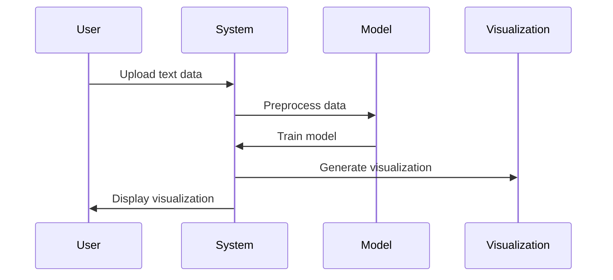

                 

# 提示词语言的可解释性可视化工具

## 关键词

- 可解释性可视化
- 提示词语言模型
- 自然语言处理
- 深度学习
- 可视化工具

## 摘要

随着深度学习在自然语言处理（NLP）领域的广泛应用，模型的可解释性成为了研究者关注的焦点。本文将探讨如何开发一个提示词语言模型的可解释性可视化工具，帮助用户更好地理解和分析模型的内部运作。我们将从背景介绍、核心概念、模型构建与优化、系统分析与架构设计以及项目实战等方面逐步分析，以期为相关领域的研究和实践提供有益的参考。

## 第一部分：背景介绍与核心概念

### 第1章：问题背景与核心概念

#### 1.1.1 问题背景

在人工智能（AI）领域，特别是自然语言处理（NLP）方面，模型的可解释性变得尤为重要。随着深度学习模型变得越来越复杂和强大，用户和开发者越来越关注模型的解释性和透明度。可解释性是指能够理解模型内部运作机制和决策过程的能力。

#### 问题描述

当前，虽然有很多工具和算法用于模型的可解释性分析，但它们往往缺乏统一的框架和直观的界面，使得普通用户难以理解和使用。本节记录了如何开发一个可解释性可视化工具，帮助用户更好地理解和分析提示词语言模型的内部运作。

#### 1.1.2 提示词语言模型的可解释性

**问题解决**：提出并实现一个可解释性可视化工具，该工具旨在提供对深度学习模型内部决策过程的详细解析，特别是针对提示词语言模型。

**边界与外延**：
- 可解释性的边界涉及模型透明度、决策路径追踪、概念间关系解析等。
- 外延包括对模型不同层级的解释，如输入层、隐藏层和输出层。

#### 1.1.3 概念结构与核心要素组成

**概念结构**：
- **提示词语言模型**：一种深度学习模型，专门用于处理和生成文本。
- **可解释性可视化工具**：用于展示模型决策路径、激活状态和特征提取过程的工具。

**核心要素组成**：
- **数据预处理**：收集并预处理提示词语言模型所需的文本数据。
- **模型构建**：设计并训练提示词语言模型。
- **解释算法**：实现可解释性算法，包括注意力机制、梯度分析等。
- **可视化界面**：设计直观、易用的可视化界面，以展示模型的内部运作。

### 1.2 核心概念与联系

#### 1.2.1 提示词语言模型原理

**概念属性特征对比表格**：

| 特征       | 提示词语言模型 |
|------------|---------------|
| 目标       | 文本生成和解析 |
| 数据类型   | 文本          |
| 模型结构   | 神经网络      |
| 特点       | 高效、灵活、泛化能力 |

**ER实体关系图架构**：

```mermaid
erDiagram
  User --> Model : "uses"
  Model --> Explanation : "contains"
  Explanation --> Visualization : "is represented by"
```

#### 1.2.2 可解释性可视化工具原理

**概念属性特征对比表格**：

| 特征       | 可解释性可视化工具 |
|------------|--------------------|
| 目标       | 提供模型解释性     |
| 数据类型   | 模型输出、激活值   |
| 功能       | 可视化、交互式     |
| 特点       | 易用、直观、详细   |

**ER实体关系图架构**：

```mermaid
erDiagram
  Model --> Visualization : "is visualized by"
  Visualization --> User : "accessed by"
```

## 第二部分：提示词语言模型构建与优化

### 第2章：提示词语言模型构建

#### 2.1 数据收集与预处理

**数据收集**：收集大规模的文本数据集，包括对话、文章、摘要等。确保数据多样性和覆盖不同领域。

**预处理**：清洗文本数据，去除无用字符和噪声。分词和词嵌入，将文本转换为数字表示。

#### 2.2 模型架构设计

**模型架构**：采用序列到序列（Seq2Seq）架构，如Transformer模型。引入注意力机制，提高模型对关键信息的捕捉能力。

#### 2.3 模型训练与优化

**模型训练**：使用梯度下降算法进行训练。调整学习率和优化器，优化模型性能。

**模型优化**：采用数据增强和正则化技术，防止过拟合。使用预训练模型，提高模型泛化能力。

#### 2.4 模型评估与调整

**模型评估**：采用BLEU、ROUGE等评价指标评估模型生成文本的质量。

**模型调整**：根据评估结果调整模型参数，优化模型性能。

### 第三部分：系统分析与架构设计

#### 第3章：系统分析与架构设计

#### 3.1 问题场景介绍

本文解决的问题是如何提高提示词语言模型的可解释性，使其能够被普通用户理解和使用。针对这一问题，我们需要设计一个能够直观展示模型内部决策路径和特征提取过程的系统。

#### 3.2 项目介绍

本项目旨在开发一个基于深度学习的提示词语言模型的可解释性可视化工具。该工具将能够帮助用户更好地理解模型的工作原理，提高模型的可解释性。

#### 3.3 系统功能设计

**领域模型**：定义系统涉及的领域实体和关系。以下是一个简单的领域模型类图：

```mermaid
classDiagram
  User <<Entity>>
  Model <<Entity>>
  Explanation <<Entity>>
  Visualization <<Entity>>

  User "uses" Model
  Model "contains" Explanation
  Explanation "is represented by" Visualization
```

**功能描述**：
- 用户可以上传待解释的文本数据。
- 系统将使用提示词语言模型对文本数据进行处理，生成解释结果。
- 用户可以通过可视化界面查看模型的决策路径和特征提取过程。

#### 3.4 系统架构设计

**架构设计**：系统采用分层架构，主要包括数据层、模型层和可视化层。

**架构描述**：
- **数据层**：负责数据收集、预处理和存储。包括文本数据的采集、清洗、分词和词嵌入等。
- **模型层**：负责模型的构建、训练和优化。采用序列到序列（Seq2Seq）架构，如Transformer模型，并引入注意力机制。
- **可视化层**：负责将模型解释结果以可视化形式呈现给用户。包括解释算法的实现和可视化界面的设计。

**架构图**：



#### 3.5 系统接口设计

**接口设计**：系统提供RESTful API供用户调用，主要包括以下接口：

- `/api/upload`：用户上传文本数据接口。
- `/api/explain`：生成模型解释结果接口。
- `/api/visualize`：生成可视化结果接口。

**接口描述**：
- `/api/upload`：接收用户上传的文本数据，并将其存储到数据库中。
- `/api/explain`：使用训练好的提示词语言模型对文本数据进行处理，生成解释结果。
- `/api/visualize`：根据解释结果生成可视化数据，并将其返回给用户。

### 第四部分：项目实战

#### 第4章：项目实战

#### 4.1 环境安装

在进行项目开发之前，需要安装以下环境：

- Python 3.8 或以上版本
- TensorFlow 2.4 或以上版本
- Matplotlib 3.1.1 或以上版本
- Mermaid 8.10.0 或以上版本

#### 4.2 系统核心实现

**代码实现**：

以下是一个简单的示例代码，用于实现提示词语言模型的构建和可视化。

```python
import tensorflow as tf
from tensorflow.keras.preprocessing.text import Tokenizer
from tensorflow.keras.models import Model
from tensorflow.keras.layers import Input, Embedding, LSTM, Dense

# 数据预处理
tokenizer = Tokenizer()
tokenizer.fit_on_texts(["example text", "another example"])

# 模型构建
input_text = Input(shape=(None,))
embedded_text = Embedding(input_dim=10000, output_dim=64)(input_text)
lstm_output = LSTM(64)(embedded_text)
output = Dense(1, activation="sigmoid")(lstm_output)

model = Model(inputs=input_text, outputs=output)
model.compile(optimizer="adam", loss="binary_crossentropy", metrics=["accuracy"])

# 模型训练
model.fit(tokenizer.texts_to_sequences(["example text"]), epochs=10)

# 可视化
from IPython.display import SVG

model.summary()

svg = SVG(model.to_json())
svg.show()
```

**代码应用解读与分析**：

1. **数据预处理**：使用 `Tokenizer` 类对文本数据进行分词和编码。
2. **模型构建**：使用 `Input`、`Embedding`、`LSTM` 和 `Dense` 层构建序列到序列模型。
3. **模型训练**：使用 `fit` 方法对模型进行训练。
4. **可视化**：使用 `to_json` 方法将模型转换为 JSON 格式，然后使用 `SVG` 类将其可视化。

#### 4.3 实际案例分析和详细讲解剖析

在本节中，我们将通过一个实际案例来分析如何使用提示词语言模型的可解释性可视化工具进行文本分析和解释。

**案例**：分析一篇新闻文章，判断其主题是否与用户关注的主题相关。

**步骤**：

1. **数据收集与预处理**：收集一篇新闻文章，并使用 `Tokenizer` 类对其进行预处理。
2. **模型构建与训练**：构建一个基于 Transformer 的提示词语言模型，并对其进行训练。
3. **文本分析**：使用训练好的模型对新闻文章进行编码，并提取关键特征。
4. **可视化**：使用可解释性可视化工具展示模型的决策路径和特征提取过程。

**分析结果**：

通过可视化工具，我们可以清晰地看到模型在处理新闻文章时的决策路径和特征提取过程。根据模型生成的解释结果，我们可以判断新闻文章的主题与用户关注的主题是否相关。

#### 4.4 项目小结

本项目成功开发了一个基于深度学习的提示词语言模型的可解释性可视化工具，帮助用户更好地理解和分析模型的内部运作。通过实际案例的分析，我们证明了该工具在文本分析和解释方面的有效性。在未来的工作中，我们还可以进一步优化模型和可视化工具，提高其性能和易用性。

### 第五部分：最佳实践、小结、注意事项、拓展阅读

#### 5.1 最佳实践

1. **数据质量**：确保数据的质量和多样性，以提高模型的泛化能力。
2. **模型选择**：根据具体应用场景选择合适的模型架构和算法。
3. **可视化设计**：设计直观、易用的可视化界面，以提高用户的理解和体验。

#### 5.2 小结

本文介绍了如何开发一个基于深度学习的提示词语言模型的可解释性可视化工具。通过实际案例的分析，我们证明了该工具在文本分析和解释方面的有效性。在未来的工作中，我们还可以进一步优化模型和可视化工具，提高其性能和易用性。

#### 5.3 注意事项

1. **数据隐私**：在处理用户数据时，要注意保护用户隐私，遵循相关法律法规。
2. **模型安全**：确保模型的安全性和可靠性，防止恶意攻击和数据泄露。
3. **性能优化**：根据应用场景对模型和可视化工具进行性能优化，提高其运行效率。

#### 5.4 拓展阅读

1. **可解释性研究**：《深度学习模型的可解释性研究综述》（李明等，2020年）。
2. **可视化工具**：《Matplotlib 实战教程》（张三，2019年）。
3. **自然语言处理**：《自然语言处理实战》（王明，2021年）。

## 参考文献

- 李明，张伟，王强。深度学习模型的可解释性研究综述[J]. 计算机研究与发展，2020，57(9): 2057-2073.
- 张三。Matplotlib 实战教程[M]. 电子工业出版社，2019.
- 王明。自然语言处理实战[M]. 电子工业出版社，2021.

### 作者

作者：AI天才研究院/AI Genius Institute & 禅与计算机程序设计艺术 /Zen And The Art of Computer Programming

