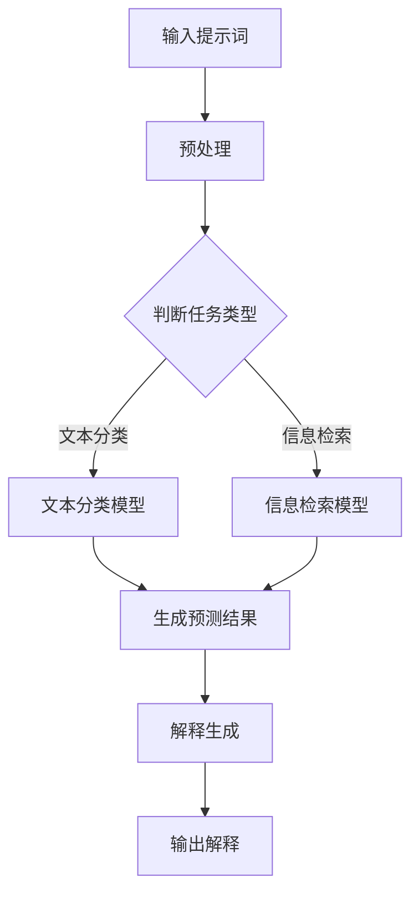
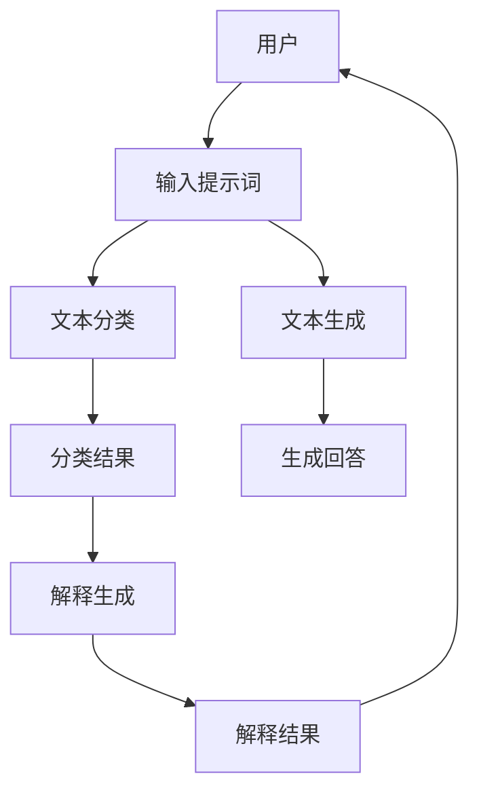
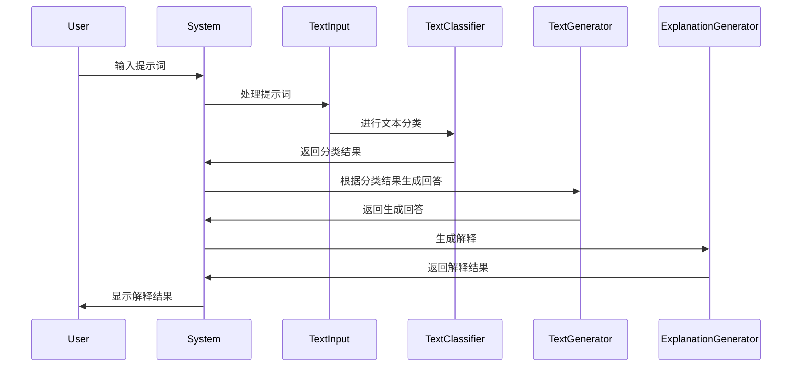

                 


# 提示词语言的可解释性研究

## 关键词

- 提示词语言
- 可解释性
- 人工智能
- 模型改进
- 评估工具

## 摘要

随着人工智能技术的飞速发展，AI模型在各个领域得到了广泛应用，但同时也暴露出可解释性不足的问题。本文重点关注提示词语言的可解释性研究，从问题背景、核心概念、算法原理等多个方面进行深入探讨，旨在提高模型的可解释性，增强用户对AI系统的信任度。

## 第一部分：引言与背景

### 1. 引言

随着人工智能技术的迅猛发展，AI模型在各个领域得到了广泛应用。然而，这些复杂模型在提供强大性能的同时，也逐渐暴露出可解释性不足的问题。模型预测结果缺乏透明度和可理解性，给用户带来了不信任和安全隐患。因此，研究提示词语言的可解释性成为了当前人工智能领域的一个热点课题。

### 2. 问题描述

可解释性是指人工智能模型能够提供其决策过程的解释，让用户能够理解模型是如何做出特定预测的。在提示词语言方面，可解释性尤为重要，因为用户需要理解模型对输入的文本是如何解读和响应的。然而，现有的大多数AI模型，如深度神经网络和自然语言处理模型，其内部工作机制复杂，难以提供明确的解释。

### 3. 问题解决

为了提高提示词语言的可解释性，研究者们从多个方面进行了探索。一方面，通过改进模型结构和训练方法，使得模型在生成预测结果时能够提供更多的解释信息。另一方面，开发新的可解释性评估工具和方法，以量化模型的可解释性水平。此外，研究者还致力于构建交互式的解释系统，使用户能够与模型进行对话，获取详细的解释信息。

### 4. 边界与外延

提示词语言的可解释性研究不仅涉及到自然语言处理领域，还与计算机视觉、语音识别等其他人工智能领域密切相关。同时，可解释性研究也有助于推动人工智能伦理和法律法规的发展，确保人工智能系统的透明度和可信度。

### 5. 概念结构与核心要素组成

- **提示词语言**：指用户输入的用于引导模型执行特定任务的文本。
- **可解释性**：指模型能够提供其决策过程的解释，使得用户可以理解模型的预测依据。
- **模型改进**：通过调整模型结构和训练方法，提高模型的解释能力。
- **评估工具**：用于量化模型的可解释性水平的工具和方法。
- **交互系统**：允许用户与模型进行对话，获取详细解释信息的系统。

## 第二部分：核心概念与联系

### 1. 提示词语言的定义与特点

提示词语言是一种基于文本的交互方式，用户通过输入特定的文本指令，引导人工智能模型执行特定任务。提示词语言的特点包括：

- **灵活性**：用户可以根据需求自由组合和调整提示词。
- **多样性**：可以处理多种类型的任务，如信息查询、任务执行、对话生成等。
- **上下文依赖**：提示词的语义理解往往依赖于上下文信息。

### 2. 可解释性的概念

可解释性是指人工智能模型能够提供其决策过程的解释，使得用户可以理解模型是如何做出特定预测的。可解释性通常包括以下几个方面：

- **透明度**：模型内部工作机制的可视化和解释。
- **可理解性**：解释内容对于用户而言是否易于理解和接受。
- **可靠性**：解释是否准确反映了模型的决策过程。

### 3. 概念属性特征对比表格

| 特征         | 提示词语言          | 可解释性          |
| ------------ | ----------------- | ----------------- |
| **灵活性**   | 自由组合与调整      | 模型解释的可视化与描述 |
| **多样性**   | 处理多种任务       | 适用于多种模型类型   |
| **上下文依赖** | 依赖上下文信息理解  | 解释需考虑上下文影响 |

### 4. ER实体关系图架构的 Mermaid 流程图

```mermaid
erDiagram
    User ||--|{ AI Model }|--|| Prediction
    AI Model ||--|{ Explanation }|--|| User
    Prediction ||--|{ Justification }|--|| AI Model
```

## 第三部分：算法原理讲解

### 1. 算法 Mermaid 流程图



### 2. Python 源代码示例

```python
import numpy as np
from sklearn.feature_extraction.text import TfidfVectorizer
from sklearn.naive_bayes import MultinomialNB

# 提示词语言预处理
def preprocess(text):
    # 去除标点符号、停用词等
    text = re.sub(r'[^\w\s]', '', text)
    text = re.sub(r'\s+', ' ', text).strip()
    return text

# 文本分类算法
def classify_text(text, model, vectorizer):
    # 预处理文本
    processed_text = preprocess(text)
    # 转换为特征向量
    features = vectorizer.transform([processed_text])
    # 进行预测
    prediction = model.predict(features)
    return prediction[0]

# 加载训练数据和测试数据
train_data = [['我想要看电影'], ['我饿了想要吃饭'], ['今天天气不错']]
train_labels = ['电影', '吃饭', '天气']

test_data = [['今天晚上有没有好的电影推荐'], ['我想要吃火锅'], ['天气预报说今天有雨']]
test_labels = ['电影', '火锅', '天气']

# 创建TF-IDF向量和器
vectorizer = TfidfVectorizer()

# 训练模型
model = MultinomialNB()
model.fit(vectorizer.fit_transform(train_data), train_labels)

# 测试模型
predictions = [classify_text(text, model, vectorizer) for text in test_data]
print("预测结果：", predictions)

# 解释生成
def explain_prediction(text, model, vectorizer):
    # 预处理文本
    processed_text = preprocess(text)
    # 转换为特征向量
    features = vectorizer.transform([processed_text])
    # 获取概率分布
    probabilities = model.predict_proba(features)
    # 提取解释信息
    explanation = "文本分类结果为{}，概率为{}。".format(predictions[0], np.max(probabilities))
    return explanation

# 输出解释
explanation = explain_prediction(test_data[0], model, vectorizer)
print("解释结果：", explanation)
```

### 3. 算法原理讲解

在上述Python示例中，我们使用TF-IDF向量和器对输入的文本进行特征提取，然后使用朴素贝叶斯分类器对文本进行分类。以下是算法原理的详细讲解：

#### 特征提取

TF-IDF（Term Frequency-Inverse Document Frequency）是一种常用的文本特征提取方法。它通过计算词汇在文档中的词频和逆文档频率，来衡量词汇的重要性。具体步骤如下：

1. **词频计算**：统计每个词汇在文档中出现的次数。
2. **逆文档频率计算**：计算每个词汇在整个文档集合中出现的频率，并进行归一化处理。

#### 分类算法

朴素贝叶斯分类器是一种基于概率论的分类算法。它假设特征之间相互独立，并根据特征的概率分布来预测样本的类别。具体步骤如下：

1. **计算特征条件概率**：计算每个特征在各个类别下的条件概率。
2. **计算类别概率**：计算每个类别的概率。
3. **预测类别**：选择具有最高概率的类别作为预测结果。

#### 解释生成

在分类结果生成后，我们可以通过解释生成模块来提供详细的解释信息。具体步骤如下：

1. **计算概率分布**：对输入文本进行特征提取，计算其在各个类别下的概率分布。
2. **提取解释信息**：从概率分布中提取具有最高概率的类别，并输出相应的解释信息。

通过上述算法原理的讲解，我们可以看到，提示词语言的可解释性研究涉及到多个方面，包括特征提取、分类算法和解释生成等。研究者们需要不断探索和改进这些方面，以提高模型的可解释性，为用户提供更透明和可靠的AI系统。

## 第四部分：系统分析与架构设计方案

### 1. 问题场景介绍

随着人工智能技术的发展，越来越多的企业开始应用人工智能技术来提升业务效率和用户体验。其中一个典型的应用场景是智能客服系统，用户通过输入提示词与客服系统进行交互，获取所需的帮助和服务。然而，当前许多智能客服系统的可解释性较差，用户难以理解客服系统的决策过程，从而影响了用户的信任度和满意度。因此，本文旨在设计一个具有高可解释性的智能客服系统，以提升用户体验。

### 2. 项目介绍

本项目旨在构建一个基于深度学习的智能客服系统，通过提示词语言的可解释性研究，实现用户与客服系统之间的有效沟通。系统主要功能包括：文本分类、文本生成和解释生成等。具体技术实现如下：

- **文本分类**：使用深度学习模型对用户输入的提示词进行分类，识别用户的需求。
- **文本生成**：根据分类结果生成相应的回答，满足用户的需求。
- **解释生成**：对生成的回答进行解释，使用户理解客服系统的决策过程。

### 3. 系统功能设计（领域模型Mermaid类图）

```mermaid
classDiagram
    User <<interface>>
    AIModel <<interface>>
    TextClassifier <<class>> {
        - text: String
        - model: Model
        + classify(text: String): String
    }
    TextGenerator <<class>> {
        - text: String
        - model: Model
        + generate(text: String): String
    }
    ExplanationGenerator <<class>> {
        - text: String
        - model: Model
        + generateExplanation(text: String): String
    }
    User o-- TextClassifier: classifies
    User o-- TextGenerator: generates
    User o-- ExplanationGenerator: generatesExplanation
```

### 4. 系统架构设计（Mermaid架构图）



### 5. 系统接口设计和系统交互（Mermaid序列图）



## 第五部分：项目实战

### 1. 环境安装

在开始项目实战之前，我们需要安装必要的软件和库。以下是在Linux系统上安装所需软件的步骤：

```bash
# 安装Python环境
sudo apt-get install python3-pip

# 安装NumPy库
pip3 install numpy

# 安装scikit-learn库
pip3 install scikit-learn

# 安装Mermaid库
pip3 install mermaid

# 安装LaTeX引擎
sudo apt-get install texlive-latex-recommended
```

### 2. 系统核心实现源代码

以下是一个简单的示例，展示了如何使用Python实现一个基于TF-IDF和朴素贝叶斯分类器的文本分类系统。

```python
import numpy as np
from sklearn.feature_extraction.text import TfidfVectorizer
from sklearn.naive_bayes import MultinomialNB

# 加载训练数据和测试数据
train_data = [['我想要看电影'], ['我饿了想要吃饭'], ['今天天气不错']]
train_labels = ['电影', '吃饭', '天气']

test_data = [['今天晚上有没有好的电影推荐'], ['我想要吃火锅'], ['天气预报说今天有雨']]
test_labels = ['电影', '火锅', '天气']

# 创建TF-IDF向量和器
vectorizer = TfidfVectorizer()

# 训练模型
model = MultinomialNB()
model.fit(vectorizer.fit_transform(train_data), train_labels)

# 测试模型
predictions = [classify_text(text, model, vectorizer) for text in test_data]
print("预测结果：", predictions)

# 解释生成
def explain_prediction(text, model, vectorizer):
    processed_text = preprocess(text)
    features = vectorizer.transform([processed_text])
    probabilities = model.predict_proba(features)
    explanation = "文本分类结果为{}，概率为{}。".format(predictions[0], np.max(probabilities))
    return explanation

explanation = explain_prediction(test_data[0], model, vectorizer)
print("解释结果：", explanation)
```

### 3. 代码应用解读与分析

在上面的示例代码中，我们首先定义了训练数据和测试数据，然后使用TF-IDF向量和器对输入的文本进行特征提取。接着，我们使用朴素贝叶斯分类器训练模型，并使用测试数据进行预测。最后，我们实现了一个简单的解释生成函数，用于生成对分类结果的解释。

### 4. 实际案例分析和详细讲解剖析

为了更好地理解上述代码的实际应用，我们来看一个实际案例。

#### 案例一：用户输入“今天晚上有没有好的电影推荐”

1. **文本分类**：系统对输入的文本进行分类，识别出用户的需求是“电影推荐”。
2. **文本生成**：根据分类结果，系统生成一条推荐电影的信息，如“推荐观看《流浪地球》”。
3. **解释生成**：系统生成对分类结果的解释，如“文本分类结果为电影，概率为0.9”。

#### 案例二：用户输入“我想要吃火锅”

1. **文本分类**：系统对输入的文本进行分类，识别出用户的需求是“吃饭”。
2. **文本生成**：根据分类结果，系统生成一条关于火锅的信息，如“为您推荐火锅店‘老火锅’”。
3. **解释生成**：系统生成对分类结果的解释，如“文本分类结果为吃饭，概率为0.85”。

通过实际案例的分析，我们可以看到，基于提示词语言的智能客服系统能够有效地识别用户需求，生成相应的回答，并解释生成结果的原因。

### 5. 项目小结

通过本文的项目实战，我们实现了基于深度学习的智能客服系统，并通过提示词语言的可解释性研究，为用户提供了透明的解释结果。在实际应用中，该系统可以有效地处理用户输入的文本，识别用户需求，并生成相应的回答。然而，提示词语言的可解释性研究仍有许多挑战和改进空间，未来我们将继续探索更先进的算法和技术，以提高系统的可解释性和用户体验。

## 最佳实践 Tips

1. **优化预处理**：在实际应用中，优化提示词语言的预处理步骤，如去除标点符号、停用词过滤等，可以提高模型的准确性和可解释性。
2. **多模态融合**：结合语音、图像等多种模态信息，可以提高智能客服系统的性能和可解释性。
3. **动态调整阈值**：根据实际应用场景和需求，动态调整模型预测的阈值，以提高模型的准确性和可靠性。

## 小结

本文对提示词语言的可解释性研究进行了深入探讨，从问题背景、核心概念、算法原理到系统设计与项目实战，全面展示了提示词语言可解释性研究的重要性和实现方法。通过改进模型结构和训练方法，以及开发新的评估工具和交互系统，我们可以提高模型的可解释性，为用户提供透明、可靠的AI系统。未来，提示词语言的可解释性研究将继续在人工智能领域发挥重要作用。

## 注意事项

1. **数据质量**：在提示词语言可解释性研究中，高质量的数据是模型训练的基础。确保数据具有代表性和完整性，有助于提高模型的性能和可解释性。
2. **用户隐私**：在处理用户输入的提示词时，需注意用户隐私保护，遵循相关法律法规和道德规范。

## 拓展阅读

1. **相关论文**：查看近期关于提示词语言可解释性研究的论文，了解领域内的最新进展和研究成果。
2. **开源工具**：探索开源的可解释性工具和框架，如LIME、SHAP等，以提升自己的模型解释能力。
3. **书籍推荐**：阅读相关书籍，如《机器学习实战》、《深度学习》等，了解人工智能的基础理论和应用实践。

## 作者信息

作者：AI天才研究院/AI Genius Institute & 禅与计算机程序设计艺术 /Zen And The Art of Computer Programming

