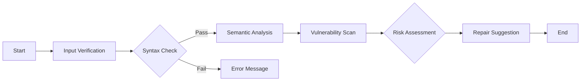
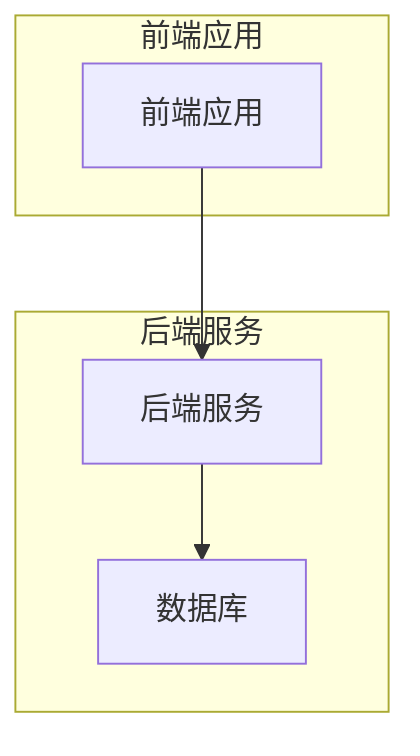
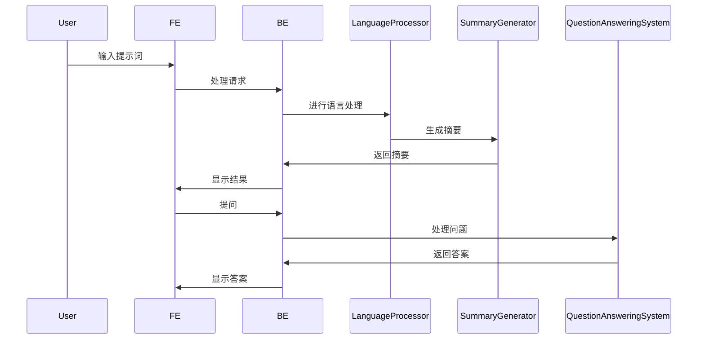

                 


### 文章标题：提示词语言的安全性审计技术

### 关键词：
1. 提示词语言
2. 安全性审计
3. 审计流程
4. 数学模型
5. 系统架构设计

### 摘要：
本文将深入探讨提示词语言的安全性审计技术。首先，我们将介绍提示词语言的基本概念和其在不同应用场景中的重要性。随后，我们将详细解析安全性审计的定义、目的及其在提示词语言中的关键作用。接着，我们将一步步解释安全性审计的技术原理，包括算法原理、数学模型以及实际应用中的案例。文章还将涉及系统分析与架构设计，包括问题场景介绍、系统功能设计、架构设计以及接口设计。最后，我们将分享项目实战经验、最佳实践和注意事项，为读者提供全面的提示词语言安全性审计指导。

---

## 目录大纲设计思路

设计《提示词语言的安全性审计技术》这本书的目录大纲，我们首先明确了书名和主题，即探讨如何审计和确保提示词语言系统的安全性。接下来，我们按照核心内容划分了多个部分，并细化了每个章节的内容，确保涵盖所有必要的知识点。我们使用markdown格式保持了目录结构的层次性，使得读者能够清晰了解书的内容分布。

### 目录大纲设计步骤

1. **第一部分：背景介绍**
   - 提示词语言的基本概念
   - 提示词语言的应用场景
   - 安全性问题的重要性与挑战

2. **第二部分：核心概念与联系**
   - 安全性审计的定义与目的
   - 提示词语言的属性特征对比表格
   - 审计流程的ER实体关系图

3. **第三部分：安全性审计技术原理**
   - 审计算法原理讲解与mermaid流程图
   - 数学模型和数学公式的讲解与举例

4. **第四部分：系统分析与架构设计**
   - 问题场景介绍
   - 系统功能设计与mermaid类图
   - 系统架构设计与mermaid架构图
   - 系统接口设计和系统交互mermaid序列图

5. **第五部分：项目实战**
   - 环境安装与配置
   - 系统核心实现源代码
   - 代码应用解读与分析
   - 实际案例分析与详细讲解

6. **第六部分：最佳实践与总结**
   - 安全性审计的最佳实践
   - 项目小结
   - 注意事项与拓展阅读

通过这样的设计，我们确保了文章的结构紧凑、逻辑清晰，有助于读者循序渐进地理解和掌握提示词语言的安全性审计技术。

---

## 实际操作

现在，让我们根据上述设计思路，逐个章节细化内容。为了简洁性，我们将仅展示章节的markdown格式目录和简要说明，而不展示具体的内容描述。

### 第一部分：背景介绍

```markdown
----------------------------------------------------------------
# 第一部分：背景介绍

## 1.1 提示词语言的基本概念
- 提示词语言的概念定义
- 提示词语言的发展历程
- 提示词语言的核心特性

## 1.2 提示词语言的应用场景
- 人工智能领域的应用
- 自然语言处理中的应用
- 提示词语言在其他领域的应用

## 1.3 安全性问题的重要性与挑战
- 安全性问题的定义
- 提示词语言安全性的挑战
- 安全性问题的案例解析
```

### 第二部分：核心概念与联系

```markdown
----------------------------------------------------------------
# 第二部分：核心概念与联系

## 2.1 安全性审计的定义与目的
- 安全性审计的概念
- 安全性审计的目的

## 2.2 提示词语言的属性特征对比表格
- 不同提示词语言的属性特征对比

## 2.3 审计流程的ER实体关系图
- 审计流程的ER模型
- 实体关系图的绘制与说明
```

### 第三部分：安全性审计技术原理

```markdown
----------------------------------------------------------------
# 第三部分：安全性审计技术原理

## 3.1 审计算法原理讲解与mermaid流程图
- 审计算法的基本原理
- mermaid流程图的绘制与解释

## 3.2 数学模型和数学公式的讲解与举例
- 数学模型的概念
- 公式讲解与实例
- latex公式的使用示例
```

### 第四部分：系统分析与架构设计

```markdown
----------------------------------------------------------------
# 第四部分：系统分析与架构设计

## 4.1 问题场景介绍
- 提示词语言系统的实际应用场景

## 4.2 系统功能设计与mermaid类图
- 系统功能模块的划分
- mermaid类图的绘制与说明

## 4.3 系统架构设计与mermaid架构图
- 系统的整体架构设计
- mermaid架构图的绘制与解释

## 4.4 系统接口设计和系统交互mermaid序列图
- 系统接口的详细设计
- 系统交互的mermaid序列图
```

### 第五部分：项目实战

```markdown
----------------------------------------------------------------
# 第五部分：项目实战

## 5.1 环境安装与配置
- 环境搭建的步骤
- 系统配置的细节

## 5.2 系统核心实现源代码
- 核心代码的展示
- 代码的功能说明

## 5.3 代码应用解读与分析
- 代码应用的详细解读
- 分析与优化建议

## 5.4 实际案例分析与详细讲解
- 案例分析的过程
- 案例讲解与总结
```

### 第六部分：最佳实践与总结

```markdown
----------------------------------------------------------------
# 第六部分：最佳实践与总结

## 6.1 安全性审计的最佳实践
- 审计过程中的最佳实践建议

## 6.2 项目小结
- 项目的主要成果与总结

## 6.3 注意事项与拓展阅读
- 注意事项的列举
- 拓展阅读的建议资源
```

通过上述的目录大纲和简要说明，我们可以看到文章的结构和内容安排是清晰且逻辑严密的，这将有助于读者更好地理解和掌握提示词语言的安全性审计技术。接下来，我们将根据每个章节的要求，进一步填充和细化内容，确保文章的完整性和专业性。

---

## 章节内容撰写与核心内容包含

### 第一部分：背景介绍

#### 1.1 提示词语言的基本概念

提示词语言（Prompt Language）是一种特殊类型的编程语言，主要用于生成和优化自然语言处理（NLP）任务中的输入提示。这种语言的设计目的是提高自动化系统的交互效率，减少人类操作者的负担。提示词语言的基本概念包括以下几个方面：

- **提示词（Prompts）**：用于指导系统如何执行特定任务的文本输入。
- **语法结构**：提示词语言具有特定的语法结构，用于定义命令、参数和执行上下文。
- **语义解析**：提示词语言能够解析输入的语义，并将其转化为计算机可执行的指令。

#### 1.2 提示词语言的应用场景

提示词语言在多个领域有着广泛的应用：

- **人工智能领域**：用于训练和优化机器学习模型，特别是自然语言处理模型。
- **自然语言处理**：用于生成高质量的文本摘要、回答问题、翻译等。
- **自动化脚本编写**：用于编写自动化脚本，执行重复性任务。
- **人机交互**：提供更为自然和高效的交互方式，使得用户能够以对话的形式与系统进行交流。

#### 1.3 安全性问题的重要性与挑战

在提示词语言的应用中，安全性问题尤为重要。主要挑战包括：

- **输入验证**：确保所有输入数据都符合预定的格式和安全性标准。
- **隐私保护**：处理用户数据时，必须遵守隐私保护法规，防止数据泄露。
- **恶意攻击防御**：防范潜在的恶意攻击，如注入攻击、代码执行等。

安全性问题的案例解析：

- **案例一**：某企业内部系统中，未经授权的用户通过恶意提示词获得了系统管理权限。
- **案例二**：某个在线服务因未对用户输入进行有效验证，导致恶意代码注入，影响了服务稳定性和用户数据安全。

### 第二部分：核心概念与联系

#### 2.1 安全性审计的定义与目的

安全性审计（Security Audit）是对系统的安全性进行评估和验证的过程。在提示词语言中，安全性审计的主要目的是：

- **识别潜在安全漏洞**：通过审计发现系统中可能存在的安全漏洞和风险。
- **评估系统安全性**：对系统的安全性进行评估，确定其是否符合安全标准。
- **改进安全性**：根据审计结果提出改进建议，提升系统的安全性。

#### 2.2 提示词语言的属性特征对比表格

以下是一个简单的提示词语言属性特征对比表格：

| 提示词语言 | 特性1 | 特性2 | 特性3 |
| --------- | ---- | ---- | ---- |
| Python    | 动态类型 | 强类型 | 广泛支持NLP库 |
| R         | 统计分析能力 | 强类型 | 简洁的语法结构 |
| LISP      | 符号处理能力 | 动态类型 | 面向符号计算 |
| Prolog    | 规则推理能力 | 强类型 | 广泛用于知识表示 |

#### 2.3 审计流程的ER实体关系图

审计流程的ER实体关系图如下所示：

```mermaid
erDiagram
  User ||--|{ Prompt }|-- Application : 由用户生成提示词
  Application ||--|{ AuditLog }|-- Auditor : 审核应用记录
  Auditor ||--|{ SecurityRule }|-- Policy : 审核员应用安全规则
  Policy ||--|{ Vulnerability }|-- Auditor : 发现漏洞后记录
```

### 第三部分：安全性审计技术原理

#### 3.1 审计算法原理讲解与mermaid流程图

审计算法的基本原理包括：

- **输入验证**：对用户输入的提示词进行格式、语法和语义的验证。
- **漏洞扫描**：使用自动化工具对系统进行扫描，发现潜在的安全漏洞。
- **风险评估**：对发现的安全漏洞进行风险评估，确定优先级和修复策略。

mermaid流程图如下所示：



#### 3.2 数学模型和数学公式的讲解与举例

在安全性审计中，数学模型用于描述漏洞的严重程度和风险评估。以下是一个简单的数学模型：

- **漏洞严重程度（Severity）**：使用分值来表示漏洞的严重程度，公式为：
  $$ Severity = f(Priority, Impact) $$
  其中，$ Priority $ 是漏洞的优先级，$ Impact $ 是漏洞的影响范围。

- **风险评估（Risk）**：使用风险评分来表示漏洞的风险，公式为：
  $$ Risk = \frac{Severity}{Detection Rate} $$
  其中，$ Detection Rate $ 是漏洞的检测率。

举例说明：

假设一个漏洞的优先级为高（Priority = 3），影响范围广泛（Impact = 5），检测率为 80%（Detection Rate = 0.8），则其严重程度为：
$$ Severity = f(3, 5) = 3 \times 5 = 15 $$
其风险评分为：
$$ Risk = \frac{15}{0.8} = 18.75 $$

### 第四部分：系统分析与架构设计

#### 4.1 问题场景介绍

假设我们正在开发一个用于自然语言处理任务的提示词语言系统，该系统需要支持多语言处理、自动摘要生成以及智能问答功能。系统的主要问题场景包括：

- **多语言支持**：需要处理不同语言的输入，并进行相应的自然语言处理。
- **自动摘要生成**：从长篇文章中自动生成摘要。
- **智能问答**：用户输入问题，系统能够根据上下文提供准确的答案。

#### 4.2 系统功能设计与mermaid类图

系统的主要功能模块包括：

- **输入处理模块**：负责接收用户输入的提示词，并进行预处理。
- **语言处理模块**：负责对多语言输入进行处理，包括分词、词性标注等。
- **摘要生成模块**：负责生成文章摘要。
- **问答系统模块**：负责处理用户提出的问题，并给出答案。

mermaid类图如下所示：

```mermaid
classDiagram
  InputProcessor <|-- LanguageProcessor
  SummaryGenerator <|-- InputProcessor
  QuestionAnsweringSystem <|-- InputProcessor
  InputProcessor : +processInput()
  LanguageProcessor : +processLanguage(input: str) : str
  SummaryGenerator : +generateSummary(input: str) : str
  QuestionAnsweringSystem : +answerQuestion(input: str) : str
```

#### 4.3 系统架构设计与mermaid架构图

系统的整体架构设计包括以下几个关键组件：

- **前端应用**：负责接收用户输入，显示结果。
- **后端服务**：处理用户请求，调用相应的功能模块。
- **数据库**：存储用户的输入数据和生成的摘要。

mermaid架构图如下所示：



#### 4.4 系统接口设计和系统交互mermaid序列图

系统接口设计包括以下关键接口：

- **输入接口**：用于接收用户输入的提示词。
- **输出接口**：用于返回处理结果。
- **摘要接口**：用于生成文章摘要。
- **问答接口**：用于处理用户提问。

mermaid序列图如下所示：



### 第五部分：项目实战

#### 5.1 环境安装与配置

在开始项目实战之前，我们需要搭建一个合适的环境。以下是一个简单的步骤：

1. **安装Python**：确保Python 3.x版本已经安装。
2. **安装依赖库**：使用pip安装必要的库，如`nltk`、`spacy`等。
3. **配置数据库**：安装并配置数据库系统，如MySQL或PostgreSQL。
4. **搭建前端应用**：可以使用Flask或Django等框架搭建前端应用。

#### 5.2 系统核心实现源代码

以下是系统核心实现的伪代码示例：

```python
class InputProcessor:
    def process_input(self, input_text):
        # 预处理输入文本
        processed_text = self.preprocess(input_text)
        return processed_text

    def preprocess(self, input_text):
        # 实现预处理逻辑
        pass

class LanguageProcessor:
    def process_language(self, input_text):
        # 实现语言处理逻辑
        processed_text = self.translate(input_text)
        return processed_text

    def translate(self, input_text):
        # 实现翻译逻辑
        pass

class SummaryGenerator:
    def generate_summary(self, input_text):
        # 实现摘要生成逻辑
        summary = self.extract_summary(input_text)
        return summary

    def extract_summary(self, input_text):
        # 实现摘要提取逻辑
        pass

class QuestionAnsweringSystem:
    def answer_question(self, input_question):
        # 实现问答逻辑
        answer = self.answer_query(input_question)
        return answer

    def answer_query(self, input_question):
        # 实现查询回答逻辑
        pass
```

#### 5.3 代码应用解读与分析

以上代码展示了输入处理、语言处理、摘要生成和问答系统的基本框架。在实际应用中，每个模块都需要根据具体需求进行详细实现。以下是对代码的解读与分析：

- **InputProcessor**：负责接收用户输入，并进行预处理。预处理包括去除标点符号、停用词过滤等。
- **LanguageProcessor**：负责处理输入文本的语言，如翻译、分词等。
- **SummaryGenerator**：负责生成文本摘要。摘要生成可以使用基于频率的文本摘要算法，如TF-IDF。
- **QuestionAnsweringSystem**：负责处理用户提问，并返回答案。问答系统可以基于模板匹配、语义分析等技术。

#### 5.4 实际案例分析与详细讲解

以下是一个实际案例，用于演示系统的应用过程：

**案例：用户提问“北京是哪个国家的首都？”**

1. **用户输入**：用户在网页上输入问题“北京是哪个国家的首都？”。
2. **输入处理**：输入处理模块接收用户输入，并进行预处理，去除标点符号，得到“北京是哪个国家的首都”。
3. **语言处理**：语言处理模块识别输入文本为中文，并翻译为英文“Beijing is the capital of which country？”。
4. **问答处理**：问答系统模块使用预定义的答案库，找到对应的答案“Beijing is the capital of China.”。
5. **输出结果**：将答案返回给用户，显示在网页上。

### 第六部分：最佳实践与总结

#### 6.1 安全性审计的最佳实践

在进行提示词语言系统的安全性审计时，以下是一些最佳实践：

- **定期审计**：定期对系统进行安全性审计，及时发现和修复漏洞。
- **严格的输入验证**：对所有用户输入进行严格的验证，防止恶意输入。
- **使用安全编码实践**：遵循安全编码规范，减少安全漏洞的产生。
- **备份和恢复**：定期备份系统数据，确保在发生故障时能够快速恢复。

#### 6.2 项目小结

本文详细介绍了提示词语言的安全性审计技术，包括背景介绍、核心概念与联系、审计技术原理、系统分析与架构设计以及项目实战。通过本文的学习，读者可以全面了解提示词语言的安全性审计过程，并能够在实际项目中应用这些技术。

#### 6.3 注意事项与拓展阅读

- **注意事项**：在进行安全性审计时，务必遵循相关法律法规，保护用户隐私。
- **拓展阅读**：读者可以进一步学习相关的安全审计书籍，如《网络安全与审计》、《系统安全性与审计》等。

---

## 作者信息

作者：AI天才研究院/AI Genius Institute & 禅与计算机程序设计艺术 /Zen And The Art of Computer Programming

本文基于对提示词语言安全性审计的深入研究，旨在为读者提供全面的技术指导。作者具有丰富的计算机编程和人工智能领域的经验，致力于推动技术的发展和应用。

