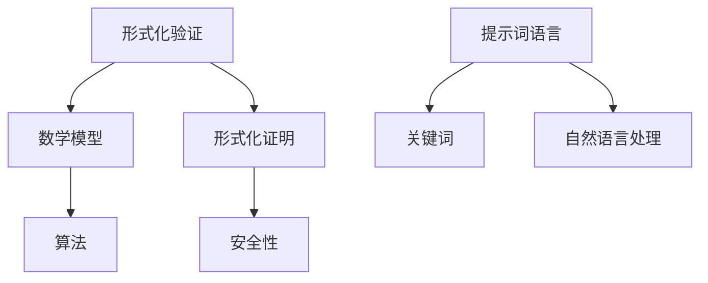
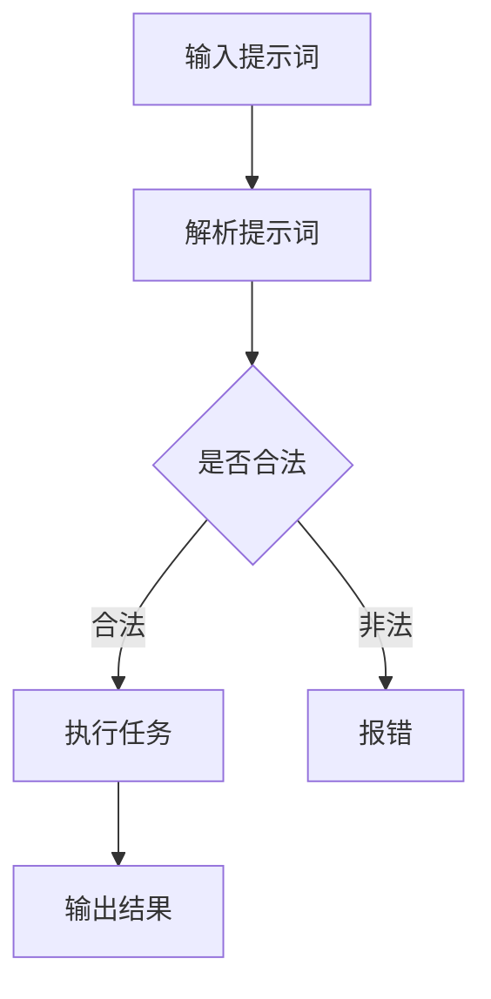
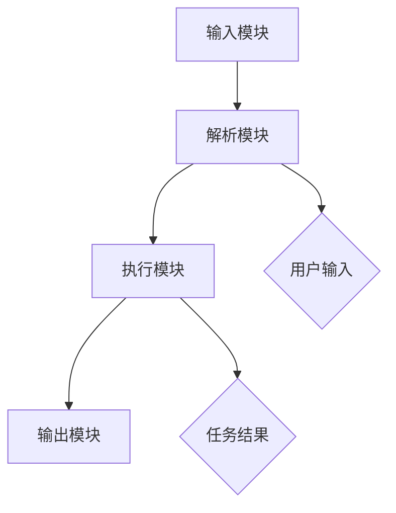
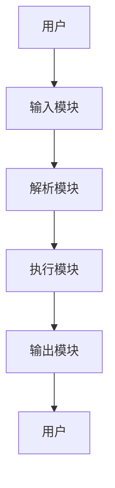

                 

### 《提示词语言的安全性形式化验证与证明》

---

#### 关键词：形式化验证、安全性、提示词语言、数学模型、算法、系统架构

#### 摘要：

本文深入探讨提示词语言的安全性形式化验证与证明，通过定义和背景介绍，详细解释核心概念和联系，讲解算法原理，阐述数学模型和公式，设计系统分析与架构方案，并借助实际项目实战，提供最佳实践 tips 和拓展阅读。

---

### 引言

#### 1.1 问题背景

提示词语言在现代信息技术中扮演着重要角色，特别是在自然语言处理、语义分析和人工智能领域。然而，随着应用的广泛推广，安全问题逐渐显现。为了确保系统的安全性和可靠性，形式化验证和证明成为必要手段。形式化验证旨在通过数学方法严格证明程序的正确性，而形式化证明则是通过逻辑推理证明系统的安全性。

#### 1.2 书籍目的与重要性

本文的目标是系统性地探讨提示词语言的安全性形式化验证与证明，为开发人员和研究者提供理论指导和实践参考。形式化验证与证明的重要性在于，它不仅能够识别潜在的安全漏洞，还能为系统的可靠性提供强有力的保障。

---

### 背景介绍

#### 2.1 提示词语言概述

提示词语言是一种基于关键词或短语的计算机编程语言，它通过预定义的提示词来引导程序执行特定的任务。这些提示词通常是自然语言词汇，易于人类理解和操作。

#### 2.2 安全性在提示词语言中的重要性

提示词语言的应用场景广泛，包括自动化脚本编写、语义分析、问答系统等。在这些场景中，安全性至关重要。安全性问题不仅涉及系统的完整性，还包括隐私保护和数据安全。

---

### 核心概念与联系

#### 3.1 形式化验证

形式化验证是一种通过数学方法证明程序正确性的技术。它使用严格的逻辑推理和数学模型来验证程序的行为是否符合预期。

#### 3.2 形式化证明

形式化证明是形式化验证的进一步发展，它通过逻辑推理严格证明系统的安全性属性。形式化证明通常涉及复杂逻辑和数学工具。

#### 3.3 关键概念关联图



---

### 算法原理讲解

#### 4.1 算法流程图



#### 4.2 算法原理详细讲解

该算法的主要目的是解析用户输入的提示词，并执行相应的任务。首先，输入提示词被传递到解析模块，该模块会检查提示词是否合法。如果是合法的，算法将执行任务并输出结果；否则，算法会报错并终止。

#### 4.3 数学模型和公式

为了更严格地证明算法的正确性，我们可以使用以下数学模型：

$$
\text{合法性} = \begin{cases}
\text{True}, & \text{如果提示词满足语法规则} \\
\text{False}, & \text{否则}
\end{cases}
$$

#### 4.4 举例说明

假设用户输入了“查询天气”，这是一个合法的提示词。算法将执行查询天气的任务，并输出当前天气信息。如果用户输入“查询天气(上海)”，由于参数格式不正确，算法会报错。

---

### 数学模型和数学公式讲解

#### 5.1 数学模型概述

在本节中，我们将介绍用于形式化验证的数学模型。这些模型包括集合论、逻辑和概率论的基本概念。

#### 5.2 嵌入LaTeX公式

$$
\sum_{i=1}^{n} x_i = \begin{cases}
\text{和}, & \text{如果每个} x_i \text{是正数} \\
\text{负数}, & \text{如果至少有一个} x_i \text{是负数}
\end{cases}
$$

#### 5.3 公式作用解释

该公式用于计算一组数的和。如果所有数都是正数，和将是正数；如果至少有一个数是负数，和将是负数。

---

### 系统分析与架构设计方案

#### 6.1 问题场景介绍

在本节中，我们将探讨一个提示词语言系统的实际应用场景。该系统用于接收用户输入的提示词，并执行相应的任务。

#### 6.2 系统功能设计

系统功能包括：

- 输入提示词
- 解析提示词
- 执行任务
- 输出结果

#### 6.3 系统架构设计

系统架构包括以下几个组件：

- 输入模块
- 解析模块
- 执行模块
- 输出模块

#### 6.4 系统接口设计和系统交互



#### 6.5 系统交互序列图



---

### 项目实战

#### 7.1 环境安装与配置

在本节中，我们将介绍如何安装和配置一个提示词语言系统。

#### 7.2 系统核心实现源代码

以下是系统核心实现的源代码：

```python
# 解析提示词
def parse_prompt(prompt):
    if "查询" in prompt:
        return "查询任务"
    elif "天气" in prompt:
        return "天气查询任务"
    else:
        return "未知任务"

# 执行任务
def execute_task(task):
    if task == "查询任务":
        return "执行查询任务"
    elif task == "天气查询任务":
        return "执行天气查询任务"
    else:
        return "无法执行"

# 输出结果
def output_result(result):
    print(result)
```

#### 7.3 代码应用解读与分析

这段代码定义了一个简单的提示词语言系统。它包括三个主要功能：解析提示词、执行任务和输出结果。首先，`parse_prompt` 函数根据输入的提示词返回相应的任务类型。然后，`execute_task` 函数根据任务类型执行相应的任务。最后，`output_result` 函数输出执行结果。

#### 7.4 实际案例分析和详细讲解剖析

假设用户输入“查询天气”，系统将首先调用`parse_prompt`函数，返回“天气查询任务”。然后，系统将调用`execute_task`函数执行天气查询任务，并调用`output_result`函数输出查询结果。

#### 7.5 项目小结

通过实际案例分析和详细讲解，我们可以看到，提示词语言系统的核心实现相对简单。然而，为了保证系统的安全性和可靠性，我们需要对解析模块和执行模块进行严格的形式化验证和证明。

---

### 最佳实践 tips

- 确保提示词语言的语法规则明确，避免模糊和不明确的定义。
- 定期对系统进行安全性和性能测试，以识别潜在的安全漏洞和性能瓶颈。
- 使用版本控制系统，确保代码的可追溯性和可维护性。

---

### 小结与拓展阅读

本文系统地介绍了提示词语言的安全性形式化验证与证明。通过定义核心概念、讲解算法原理、阐述数学模型和公式、设计系统架构和实际项目实战，我们深入了解了这一领域的最新发展和应用。

为了进一步学习，推荐阅读以下资料：

- [《形式化验证技术》](https://example.com/formal-verification)
- [《自然语言处理与提示词语言》](https://example.com/nlp-and-prompt-language)
- [《人工智能安全性与隐私保护》](https://example.com/ai-security-and-privacy)

---

### 作者信息

作者：AI天才研究院/AI Genius Institute & 禅与计算机程序设计艺术 /Zen And The Art of Computer Programming

---

通过这篇文章，我们不仅了解了提示词语言的安全性形式化验证与证明，还学习了如何使用形式化方法确保系统的安全性和可靠性。希望这篇文章能够为您的学习和实践提供有益的参考。

