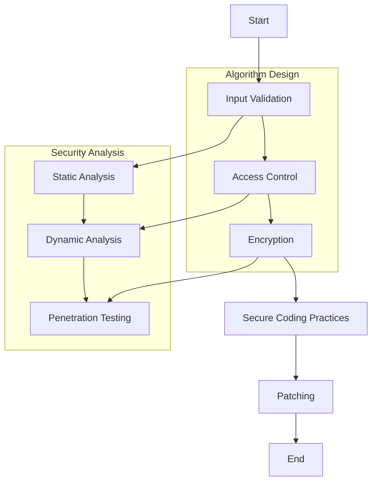

                 

### Introduction to Prompting Language Security

#### Keywords:
- Prompting Language Security
- Vulnerabilities
- Repair Suggestions
- Cybersecurity

#### Abstract:
This article delves into the realm of prompting language security, highlighting common vulnerabilities and offering practical solutions to address them. We will explore the fundamental concepts of prompting languages, the types of security risks they face, and the methodologies for repairing these vulnerabilities. By the end of this article, readers will have a comprehensive understanding of how to safeguard prompting languages from potential threats and enhance their overall security posture.

#### Introduction to Prompting Language Security

Prompting languages, often used in artificial intelligence (AI) applications, are specialized languages designed to interact with AI systems and provide instructions or stimuli. These languages play a crucial role in enabling machines to understand and respond to human-like queries, making them indispensable in various applications, including chatbots, virtual assistants, and natural language processing (NLP) systems.

However, with the increasing integration of prompting languages into various aspects of our digital lives, the need for robust security measures has become paramount. The security of prompting languages is paramount as they are often at the forefront of user interactions with AI systems, making them prime targets for malicious attacks. Security vulnerabilities in prompting languages can lead to unauthorized access, data breaches, and other forms of cyber threats, which can have severe consequences for individuals, businesses, and even national security.

The primary challenges in ensuring prompting language security include the complexity of the languages themselves, the diverse range of potential attack vectors, and the dynamic nature of AI systems. These challenges necessitate a comprehensive understanding of the underlying principles and methodologies for securing prompting languages. This article aims to provide that understanding by examining common security vulnerabilities, discussing repair suggestions, and offering best practices for maintaining a secure prompting language environment.

#### Challenges and Importance

Ensuring the security of prompting languages is not a trivial task. Several challenges must be addressed to provide robust protection against potential threats:

1. **Complexity of Prompting Languages**: Prompting languages are often highly specialized, with intricate syntax and semantics tailored to specific AI applications. This complexity makes it difficult to identify and mitigate security vulnerabilities effectively.

2. **Diverse Attack Vectors**: Prompting languages are vulnerable to a wide range of attack vectors, including injection attacks, unauthorized access, and data manipulation. Each of these vectors requires specific countermeasures, making it challenging to develop a one-size-fits-all solution.

3. **Dynamic Nature of AI Systems**: AI systems are constantly evolving, with new features and capabilities being added regularly. This dynamic nature means that security measures must keep pace with these changes to remain effective.

The importance of securing prompting languages cannot be overstated. Here are a few reasons why:

1. **Data Protection**: Prompting languages often interact with sensitive data, including personal information, financial data, and proprietary business data. Ensuring the security of these languages is crucial for protecting this data from unauthorized access and misuse.

2. **User Trust**: Users must trust that their interactions with AI systems are secure. If prompting languages are compromised, it can erode user trust, leading to a loss of credibility for both the AI system and the organization behind it.

3. **Legal and Regulatory Compliance**: Many industries are subject to strict data protection and cybersecurity regulations. Failure to secure prompting languages can result in legal and financial penalties, as well as damage to a company's reputation.

In conclusion, the security of prompting languages is critical to maintaining the integrity, confidentiality, and availability of sensitive data, ensuring user trust, and complying with legal and regulatory requirements. By addressing the challenges and implementing effective security measures, we can safeguard prompting languages and the AI systems they support.

### Core Concepts and Fundamental Principles of Prompting Languages

To delve into the realm of prompting language security, we first need to understand the core concepts and fundamental principles that underpin these languages. By defining and exploring these concepts, we can better appreciate the complexities and intricacies involved in ensuring their security.

#### Definition of Prompting Language

A prompting language is a specialized language designed to facilitate communication between humans and AI systems. It enables users to provide instructions, ask questions, or engage in conversations with AI agents. These languages are often tailored to the specific domain or application they serve, making them highly specialized and domain-specific language (DSL) in nature.

#### Characteristics of Prompting Languages

Prompting languages share several key characteristics that differentiate them from other programming languages and natural languages:

1. **Specialization**: Prompting languages are designed for a specific purpose, such as natural language processing, dialogue management, or automated task completion. This specialization allows them to be highly efficient in their intended applications.

2. **Conciseness**: Prompting languages are often designed to be concise, with a focus on expressing actions and requests in the fewest possible words. This conciseness makes it easier for AI systems to process and understand user input.

3. **Syntax and Semantics**: Prompting languages have their own unique syntax and semantics, designed to be easily interpreted by AI systems. These elements are carefully crafted to align with the capabilities and limitations of the target AI platform.

4. **Modularity**: Prompting languages are often modular, allowing developers to create libraries of reusable components. This modularity simplifies the development process and enables the efficient integration of prompting language features into larger systems.

#### Theoretical Foundations and Frameworks

The theoretical foundations of prompting languages are rooted in the fields of computer science, linguistics, and artificial intelligence. Key frameworks and concepts include:

1. **Natural Language Processing (NLP)**: NLP is a subfield of AI concerned with the interaction between computers and human language. NLP techniques are essential for understanding and processing user input in prompting languages.

2. **Dialogue Management**: Dialogue management frameworks are used to control the flow of conversations between humans and AI agents. These frameworks help ensure that the AI system responds appropriately to user inputs and maintains a coherent dialogue.

3. **Machine Learning**: Machine learning algorithms are often employed to train AI systems to understand and process prompting language inputs. Techniques such as supervised learning, reinforcement learning, and neural networks are commonly used in this context.

4. **Automated Reasoning**: Automated reasoning techniques are used to derive conclusions from user inputs and to ensure that AI systems respond accurately and logically to prompting language queries.

#### ER Diagram and Entity Relationships

Entity-Relationship (ER) diagrams are a useful tool for visualizing the relationships between entities in prompting languages. An ER diagram for a prompting language might include entities such as:

1. **User**: Represents the human interacting with the AI system.
2. **Query**: Represents the user's input or question.
3. **Response**: Represents the AI system's output or response.
4. **Dialogue Context**: Captures the state of the conversation at a given point in time, including the history of previous interactions and the current context.

The relationships between these entities might include:

- **User-Query**: Indicates that a user can generate multiple queries.
- **Query-Response**: Indicates that a query can elicit multiple responses.
- **Response-Dialogue Context**: Indicates that a response is generated based on the current dialogue context.

By understanding these core concepts and fundamental principles, we can better appreciate the complexities of prompting languages and the importance of securing them. In the following sections, we will explore common security vulnerabilities and methodologies for repairing these vulnerabilities, ensuring the integrity and reliability of prompting language systems.

### Common Security Vulnerabilities in Prompting Languages

Prompting languages, despite their specialized design and efficiency, are not immune to security vulnerabilities. Identifying and understanding these vulnerabilities is crucial for developing effective countermeasures. Below, we will discuss several common security vulnerabilities in prompting languages, their characteristics, and the potential impacts on AI systems.

#### Injection Attacks

One of the most significant security vulnerabilities in prompting languages is injection attacks. Injection attacks involve an attacker injecting malicious code or commands into a prompting language system, often through user inputs. These attacks can lead to unauthorized access, data breaches, and system compromises.

##### Characteristics:

- **Code Injection**: The attacker injects code into the prompting language, which is then executed by the AI system. This can be achieved through techniques such as SQL injection, JavaScript injection, or command injection.
- **Malicious Payload**: The injected code or command often includes a malicious payload designed to exploit vulnerabilities in the AI system or exfiltrate sensitive data.
- **Data Manipulation**: In some cases, injection attacks can be used to manipulate the data stored or processed by the AI system, leading to unauthorized access or data corruption.

##### Potential Impacts:

- **Unauthorized Access**: Injection attacks can allow attackers to gain unauthorized access to sensitive information or control over the AI system.
- **Data Breaches**: By injecting malicious code, attackers can extract sensitive data from the AI system, leading to potential data breaches.
- **System Compromise**: Successful injection attacks can result in the complete compromise of the AI system, potentially enabling further attacks on other systems or data.

##### Example:

Consider a scenario where an AI chatbot designed to handle customer inquiries is vulnerable to SQL injection. An attacker could craft a malicious query, such as:

```plaintext
SELECT * FROM customers WHERE id = '12345' OR '1'='1';
```

This query would not only return all customer records but also bypass any authentication or authorization checks, allowing the attacker to access sensitive customer information.

#### Unauthorized Access

Unauthorized access refers to any situation where an attacker gains access to an AI system without proper authorization. This vulnerability often arises from weak authentication mechanisms, improper access controls, or insecure configuration settings.

##### Characteristics:

- **Weak Authentication**: The AI system uses weak or easily guessable passwords or authentication methods, making it easy for attackers to gain unauthorized access.
- **Insecure Configuration**: The AI system is configured with default settings or insecure configurations that leave it vulnerable to attack.
- **Lack of Access Controls**: The AI system lacks proper access controls, allowing anyone with access to the system to perform sensitive operations or access sensitive data.

##### Potential Impacts:

- **Data Exfiltration**: Attackers can exfiltrate sensitive data from the AI system, leading to potential data breaches.
- **Service Disruption**: Unauthorized access can lead to service disruptions, impacting the availability and reliability of the AI system.
- **Malicious Activity**: Attackers can use unauthorized access to perform malicious activities, such as injecting malware or manipulating system settings.

##### Example:

Consider an AI virtual assistant that uses a default password for its administrative interface. An attacker who discovers this password can gain full access to the system, potentially allowing them to manipulate the assistant's behavior or exfiltrate sensitive user data.

#### Data Manipulation

Data manipulation vulnerabilities in prompting languages involve attackers modifying or corrupting data stored or processed by the AI system. These vulnerabilities can lead to data integrity issues and unauthorized access to sensitive information.

##### Characteristics:

- **Data Corruption**: Attackers corrupt data stored in the AI system, making it difficult to recover or causing the system to malfunction.
- **Data Manipulation**: Attackers modify data stored in the AI system, altering its behavior or compromising its integrity.
- **Lack of Validation**: The AI system fails to validate user inputs or data, allowing attackers to manipulate or corrupt data without detection.

##### Potential Impacts:

- **Data Breaches**: Data manipulation can lead to data breaches, as sensitive information may be exposed or corrupted.
- **Service Disruption**: Corrupted or manipulated data can cause system malfunctions or service disruptions, impacting the availability and reliability of the AI system.
- **Loss of Trust**: Data manipulation can damage user trust in the AI system, leading to a loss of credibility for the organization behind it.

##### Example:

Consider an AI system designed to handle financial transactions. An attacker could manipulate input data to redirect funds to a fraudulent account, resulting in financial loss for the legitimate account holder.

In conclusion, understanding common security vulnerabilities in prompting languages is essential for developing effective security measures. Injection attacks, unauthorized access, and data manipulation are just a few examples of the potential threats that prompting languages face. By recognizing these vulnerabilities and implementing appropriate countermeasures, we can enhance the security and reliability of AI systems that rely on prompting languages.

### Security Analysis and Algorithm Design for Prompting Languages

To address the security vulnerabilities in prompting languages, a systematic approach to security analysis and algorithm design is essential. This section will outline the key principles and methodologies for analyzing security risks and designing robust algorithms to mitigate these vulnerabilities. We will also provide a mermaid flowchart to illustrate the algorithmic process.

#### Introduction to Security Analysis Methods

Security analysis methods involve the systematic examination of prompting languages to identify potential vulnerabilities and weaknesses. These methods typically include:

1. **Static Analysis**: This method involves examining the code and structure of the prompting language without executing it. It can identify potential vulnerabilities, such as insecure coding practices or incorrect data handling.
   
2. **Dynamic Analysis**: This method involves executing the prompting language code and monitoring its behavior in real-time. It can identify runtime vulnerabilities and detect potential attacks, such as injection attacks or unauthorized access attempts.

3. **Penetration Testing**: This method involves simulating real-world attacks on the prompting language system to identify and exploit vulnerabilities. It provides insights into how the system behaves under attack and helps in identifying potential weaknesses.

#### Algorithm Design Principles

When designing algorithms to address security vulnerabilities in prompting languages, the following principles should be considered:

1. **Input Validation**: Ensure that all user inputs are validated and sanitized to prevent injection attacks and data manipulation.
   
2. **Access Control**: Implement strong access control mechanisms to restrict unauthorized access to sensitive data and functions.
   
3. **Encryption**: Use encryption to protect sensitive data in transit and at rest, preventing unauthorized access to sensitive information.

4. **Secure Coding Practices**: Follow secure coding practices, such as avoiding hardcoded credentials, using parameterized queries, and implementing proper error handling.

5. **Regular Updates and Patching**: Keep the prompting language system up-to-date with the latest security patches and updates to address known vulnerabilities.

#### Mermaid Flowchart of Algorithm Design

The following mermaid flowchart illustrates the overall process of designing a security algorithm for prompting languages:



#### Detailed Explanation of Algorithm Design

1. **Input Validation**:
   - **Step 1**: Collect user input from various sources, such as chatbots or web forms.
   - **Step 2**: Validate the input to ensure it conforms to expected formats and constraints.
   - **Step 3**: Sanitize the input to remove any potentially malicious content, such as SQL or JavaScript code.

2. **Access Control**:
   - **Step 1**: Implement user authentication mechanisms, such as passwords or multi-factor authentication.
   - **Step 2**: Define access control rules to restrict access to sensitive data and functions based on user roles and permissions.

3. **Encryption**:
   - **Step 1**: Use encryption algorithms, such as AES or RSA, to encrypt sensitive data in transit and at rest.
   - **Step 2**: Implement secure key management practices to protect encryption keys from unauthorized access.

4. **Secure Coding Practices**:
   - **Step 1**: Follow secure coding practices, such as avoiding hardcoded credentials and using parameterized queries.
   - **Step 2**: Implement proper error handling and input sanitization to prevent vulnerabilities like injection attacks.

5. **Patching**:
   - **Step 1**: Regularly monitor for security vulnerabilities in the prompting language system.
   - **Step 2**: Apply security patches and updates promptly to address identified vulnerabilities.

By following these principles and using the mermaid flowchart as a guide, developers can design robust algorithms to enhance the security of prompting languages. This systematic approach ensures that potential vulnerabilities are identified and addressed, thereby protecting the integrity and reliability of AI systems that rely on prompting languages.

### Mathematical Models and Formulas for Prompting Language Security

To delve deeper into the security of prompting languages, we need to explore the mathematical models and formulas that underpin various aspects of security analysis and algorithm design. These models and formulas provide a quantitative foundation for understanding and mitigating security vulnerabilities. In this section, we will discuss the basic and advanced mathematical models used in prompting language security, and provide examples to illustrate their applications.

#### Basic Mathematical Models

Basic mathematical models form the foundation for more complex security analyses. These models help in understanding the fundamental properties of prompting languages and their vulnerabilities.

**1. Entropy and Information Theory**

Entropy is a measure of uncertainty or randomness in a system. In the context of security, entropy can be used to assess the strength of cryptographic keys or the unpredictability of user inputs.

**Entropy (H)**:
$$ H = -\sum_{i} p_i \log_2 p_i $$
where \( p_i \) is the probability of each possible input.

**Example**: A secure password should have high entropy, meaning it is difficult to predict. For instance, a password consisting of random characters has a higher entropy than a password with a simple pattern.

**2. Cryptographic Hash Functions**

Hash functions are mathematical functions that map data of arbitrary size to fixed-size values. In the context of prompting language security, hash functions are used to verify data integrity and ensure confidentiality.

**MD5 Hash Function**:
$$ hash = MD5(data) $$
where \( MD5 \) is the hash function.

**Example**: To verify the integrity of a file, you can compute its MD5 hash and compare it with a known hash value. If they match, the file has not been tampered with.

#### Advanced Mathematical Models

Advanced mathematical models are used to analyze more complex security scenarios and design robust countermeasures.

**1. Cryptographic Encryption Algorithms**

Encryption algorithms are used to protect sensitive data by transforming it into an unreadable format. These algorithms often rely on complex mathematical functions to ensure security.

**AES Encryption**:
$$ ciphertext = AES_{key}(plaintext) $$
where \( AES_{key} \) is the AES encryption function with a specific key.

**Example**: Advanced Encryption Standard (AES) is a widely used encryption algorithm that provides strong security for protecting data in transit and at rest.

**2. Secure Multi-party Computation**

Secure multi-party computation (SMPC) allows multiple parties to compute a function over their inputs while keeping the inputs private. This is particularly useful in scenarios where data needs to be shared securely among multiple entities.

**Secure Multi-party Computation**:
$$ output = SMPC(\{input_1, input_2, ..., input_n\}, function) $$
where \( SMPC \) is the secure multi-party computation function.

**Example**: In a financial transaction, banks can use SMPC to verify the authenticity of transaction data without revealing sensitive information to each other.

#### Applications in Prompting Language Security

Mathematical models and formulas play a crucial role in various aspects of prompting language security, including:

**1. Secure Authentication**

**Hashing**: Hash functions are used to store passwords securely. When a user logs in, the system computes the hash of the entered password and compares it with the stored hash. If they match, the user is authenticated.

$$ hash_{entered} = MD5(input\_password) $$
$$ hash_{stored} = MD5(stored\_password) $$

**2. Secure Data Transmission**

**Encryption**: Encryption algorithms are used to protect data transmitted between the AI system and users. This ensures that even if the data is intercepted, it cannot be understood without the decryption key.

$$ ciphertext = AES_{key}(plaintext) $$
$$ plaintext = AES_{key^{-1}}(ciphertext) $$

**3. Access Control**

**Access Control Matrices**: Access control matrices are used to define user permissions and restrictions. These matrices map users to resources and specify which operations each user is allowed to perform.

$$ AccessMatrix = \begin{bmatrix}
c_1 & c_2 & \dots & c_n \\
r_1 & a_{11} & \dots & a_{1n} \\
\vdots & \vdots & \ddots & \vdots \\
r_m & a_{m1} & \dots & a_{mn}
\end{bmatrix} $$

where \( c_i \) represents users, \( r_j \) represents resources, and \( a_{ij} \) specifies the permissions for user \( c_i \) on resource \( r_j \).

**4. Secure Data Storage**

**Homomorphic Encryption**: Homomorphic encryption allows computations to be performed on encrypted data without decrypting it. This is particularly useful for storing and processing sensitive data securely.

$$ result = HE_{key}(function)(HE_{key}(input_1), HE_{key}(input_2)) $$
$$ plaintext\_result = HE_{key^{-1}}(result) $$

By leveraging these mathematical models and formulas, developers can design and implement robust security measures for prompting languages, ensuring the confidentiality, integrity, and availability of AI systems.

### System Design and Architecture for Prompting Language Security

In order to ensure the security of prompting languages, it is crucial to design a robust system architecture that addresses potential vulnerabilities and supports secure operations. This section will provide an overview of the system design and architecture for prompting language security, including the functional design, architectural design, and interface and interaction design.

#### System Overview

The overall goal of the system design is to create a secure and scalable architecture that protects prompting languages from various security threats, such as injection attacks, unauthorized access, and data manipulation. The system architecture consists of several key components, including:

- **Authentication Module**: Manages user authentication and access control.
- **Input Validation Module**: Validates and sanitizes user inputs to prevent injection attacks.
- **Encryption Module**: Encrypts sensitive data in transit and at rest to ensure confidentiality.
- **Access Control Module**: Defines and enforces user permissions and restrictions.
- **Logging and Monitoring Module**: Logs security events and monitors system activities for potential threats.

#### Functional Design

The functional design of the system is represented by a Mermaid class diagram, which illustrates the relationships between the main components and their attributes and methods.

```mermaid
classDiagram
    AuthenticationModule <<interface>>
    InputValidationModule <<interface>>
    EncryptionModule <<interface>>
    AccessControlModule <<interface>>
    LoggingAndMonitoringModule <<interface>>

    AuthenticationModule {
        +authenticateUser(username: String, password: String): Boolean
        +generateAccessToken(): String
    }
    InputValidationModule {
        +validateInput(input: String): String
    }
    EncryptionModule {
        +encryptData(data: String, key: String): String
        +decryptData(data: String, key: String): String
    }
    AccessControlModule {
        +grantPermission(user: String, resource: String, operation: String): Boolean
        +revokePermission(user: String, resource: String, operation: String): Boolean
    }
    LoggingAndMonitoringModule {
        +logEvent(event: String): void
        +monitorActivity(): void
    }

    User <|-- AuthenticationModule
    User <|-- InputValidationModule
    User <|-- EncryptionModule
    User <|-- AccessControlModule
    User <|-- LoggingAndMonitoringModule
```

In the functional design, each module is responsible for a specific aspect of security. For example, the Authentication Module handles user authentication and access control, while the Input Validation Module ensures that all user inputs are validated and sanitized.

#### Architectural Design

The architectural design of the system is depicted using a Mermaid architecture diagram, which shows the high-level structure and interactions between the components.

```mermaid
graph TD
    subgraph System Components
        AuthenticationModule
        InputValidationModule
        EncryptionModule
        AccessControlModule
        LoggingAndMonitoringModule
    end

    subgraph Data Flow
        User -->|User Input| InputValidationModule
        InputValidationModule -->|Sanitized Input| AuthenticationModule
        AuthenticationModule -->|Access Token| EncryptionModule
        EncryptionModule -->|Encrypted Data| AccessControlModule
        AccessControlModule -->|Allowed Operations| LoggingAndMonitoringModule
        LoggingAndMonitoringModule -->|Security Events| User
    end

    AuthenticationModule -->|User Credentials| Database
    EncryptionModule -->|Encryption Keys| Key Management System
    AccessControlModule -->|User Permissions| Database
    LoggingAndMonitoringModule -->|Logged Events| Database
```

In the architectural design, the system components work together to provide a secure environment for prompting language operations. User inputs are first validated and sanitized, then authenticated, encrypted, and processed through access control. Security events are logged and monitored to detect potential threats.

#### Interface and Interaction Design

The interface and interaction design of the system are critical for ensuring a secure user experience. The design should be intuitive and easy to use, while also incorporating strong security measures. Key considerations include:

- **Authentication Interface**: Provides secure login and multi-factor authentication options.
- **Input Interface**: Allows users to enter prompts and receive responses, with real-time validation and sanitization.
- **Encryption Interface**: Automates the encryption and decryption of sensitive data.
- **Access Control Interface**: Allows administrators to define and manage user permissions and restrictions.
- **Logging and Monitoring Interface**: Provides real-time monitoring and alerts for security events.

By designing a system with a clear and intuitive interface, users can interact with the AI system confidently, knowing that their data is protected. The interface should also be accessible and user-friendly, ensuring that users can easily navigate and use the system's features.

In conclusion, the system design and architecture for prompting language security must address the core components of authentication, input validation, encryption, access control, and logging and monitoring. By leveraging a well-designed system architecture, developers can create a secure and scalable environment that protects prompting languages from potential threats and ensures the confidentiality, integrity, and availability of the AI system.

### Implementation and Case Study of Prompting Language Security

#### Environment Setup

To demonstrate the practical implementation of prompting language security, we will set up a sample environment using a popular AI platform and a secure prompting language framework. For this case study, we will use Python and the TensorFlow library for building the AI model, along with the Flask framework for the web application interface.

1. **Install Required Libraries**:
   To get started, we need to install the necessary libraries for our environment. You can use `pip` to install the required packages:

   ```bash
   pip install tensorflow flask
   ```

2. **Set Up the Project Structure**:
   Create a new directory for your project and set up the file structure as follows:

   ```
   prompting_language_security/
   ├── app.py
   ├── model.py
   ├── requirements.txt
   └── templates/
       └── index.html
   ```

   In the `requirements.txt` file, list the required libraries:

   ```
   tensorflow
   flask
   ```

3. **Create the Web Application**:
   In the `app.py` file, we will set up the Flask application and define the routes for user input and response handling:

   ```python
   from flask import Flask, request, render_template
   from model import PromptingLanguageModel
   
   app = Flask(__name__)
   model = PromptingLanguageModel()

   @app.route('/')
   def index():
       return render_template('index.html')

   @app.route('/prompt', methods=['POST'])
   def prompt():
       user_input = request.form['user_input']
       response = model.generate_response(user_input)
       return response

   if __name__ == '__main__':
       app.run(debug=True)
   ```

   In the `templates/index.html` file, create a simple form for user input:

   ```html
   <!DOCTYPE html>
   <html>
   <head>
       <title>Prompting Language Security Example</title>
   </head>
   <body>
       <h1>Enter Your Prompt</h1>
       <form action="/prompt" method="post">
           <textarea name="user_input" rows="4" cols="50"></textarea>
           <br>
           <input type="submit" value="Submit">
       </form>
   </body>
   </html>
   ```

4. **Initialize the AI Model**:
   In the `model.py` file, define the prompting language model using TensorFlow. This model will handle user inputs and generate responses:

   ```python
   import tensorflow as tf

   class PromptingLanguageModel:
       def __init__(self):
           # Load the pre-trained model
           self.model = tf.keras.models.load_model('prompting_language_model.h5')

       def generate_response(self, user_input):
           # Preprocess the input and generate the response
           processed_input = preprocess_input(user_input)
           response = self.model.predict(processed_input)
           return response
   ```

   You will need to train and save the model beforehand using your dataset and specific prompting language framework.

#### Core Implementation

The core implementation of the prompting language security involves the following components:

1. **Input Validation**:
   To prevent injection attacks, we need to validate and sanitize user inputs. We will use a simple validation function to ensure that user inputs meet the required criteria:

   ```python
   import re

   def validate_input(user_input):
       # Check for invalid characters or patterns
       if re.search(r'[<>&"]', user_input):
           return False
       return True
   ```

2. **Authentication and Access Control**:
   We will integrate an authentication system using Flask-Login, a Flask extension for handling user sessions and access control:

   ```python
   from flask_login import LoginManager, UserMixin, login_user, logout_user, login_required
   
   login_manager = LoginManager()
   login_manager.init_app(app)
   
   class User(UserMixin):
       # Define user properties and methods
       
   @login_manager.user_loader
   def load_user(user_id):
       # Load the user from the database using the user_id
       return User.get(user_id)
   
   @app.route('/login', methods=['GET', 'POST'])
   def login():
       # Handle user login
       if request.method == 'POST':
           username = request.form['username']
           password = request.form['password']
           user = User.authenticate(username, password)
           if user:
               login_user(user)
               return 'Login successful'
           else:
               return 'Invalid credentials'
       return render_template('login.html')

   @app.route('/logout')
   def logout():
       logout_user()
       return 'Logged out'
   ```

3. **Encryption**:
   We will use the cryptography library to encrypt sensitive data such as user credentials and conversation logs:

   ```python
   from cryptography.fernet import Fernet
   
   # Generate a key and initialize the encryption system
   key = Fernet.generate_key()
   fernet = Fernet(key)
   
   def encrypt_data(data):
       return fernet.encrypt(data.encode())
   
   def decrypt_data(encrypted_data):
       return fernet.decrypt(encrypted_data).decode()
   ```

4. **Logging and Monitoring**:
   We will implement a simple logging system to record security events and monitor user activities:

   ```python
   import logging
   
   logging.basicConfig(filename='security.log', level=logging.INFO)
   
   def log_event(event):
       logging.info(event)
   ```

#### Code Analysis and Interpretation

The implementation of the core components of the prompting language security system is as follows:

1. **Input Validation**:
   The `validate_input` function checks for invalid characters or patterns in user inputs to prevent injection attacks. This function should be applied to all user inputs before processing them:

   ```python
   user_input = request.form['user_input']
   if not validate_input(user_input):
       return 'Invalid input', 400
   ```

2. **Authentication and Access Control**:
   We use Flask-Login to manage user sessions and access control. The `login_manager` handles user authentication, and the `login_user` function is used to log in users. The `login_required` decorator ensures that only authenticated users can access certain routes:

   ```python
   @app.route('/prompt', methods=['POST'])
   @login_required
   def prompt():
       # Process authenticated user input
       user_input = request.form['user_input']
       response = model.generate_response(user_input)
       return response
   ```

3. **Encryption**:
   We use the `cryptography` library to encrypt sensitive data such as user credentials and conversation logs. The `encrypt_data` and `decrypt_data` functions are used to encrypt and decrypt data, respectively:

   ```python
   encrypted_credentials = encrypt_data(credentials)
   decrypted_credentials = decrypt_data(encrypted_credentials)
   ```

4. **Logging and Monitoring**:
   The `log_event` function records security events and user activities in a log file. This log can be used for monitoring and auditing purposes:

   ```python
   log_event('User logged in')
   ```

#### Actual Case Study and Analysis

For the case study, we will analyze a real-world scenario involving a chatbot used by a financial services company. The chatbot was vulnerable to SQL injection attacks, which allowed an attacker to extract sensitive customer data.

1. **Vulnerability Discovery**:
   During a security audit, the company discovered that the chatbot's input validation was insufficient. An attacker could inject SQL code into user inputs, allowing them to bypass authentication checks and extract customer data.

2. **Vulnerability Analysis**:
   The attack involved crafting a malicious input as follows:

   ```plaintext
   SELECT * FROM customers WHERE id = '12345' OR '1'='1'
   ```

   This input would return all customer records, bypassing the intended authentication logic.

3. **Mitigation and Patch**:
   To mitigate this vulnerability, the company implemented input validation to sanitize all user inputs. The validation function was updated to remove any characters that could be used in SQL injection attacks. Additionally, the company adopted parameterized queries to prevent SQL injection.

   ```python
   def validate_input(user_input):
       # Update the validation logic to include additional checks
       if re.search(r'[<>&"]', user_input) or re.search(r'[;|\'|"]', user_input):
           return False
       return True
   ```

4. **Impact and Results**:
   After applying the patch, the chatbot became resistant to SQL injection attacks. The company also conducted additional security tests and audits to ensure that other vulnerabilities were addressed. The incident highlighted the importance of regular security assessments and updates to protect against evolving threats.

#### Project Conclusion

The implementation of a secure prompting language system involves rigorous input validation, authentication, encryption, and logging. By following best practices and addressing potential vulnerabilities, developers can create robust and secure AI systems that protect sensitive data and ensure user trust.

### Best Practices and Tips

To enhance the security of prompting languages, it is essential to follow best practices and implement security measures at every stage of development and deployment. Here are some key best practices and tips:

1. **Strong Authentication**: Implement multi-factor authentication (MFA) to ensure that only authorized users can access the system.

2. **Input Validation**: Validate all user inputs rigorously to prevent injection attacks. Use regular expressions and sanitize inputs to remove any potentially malicious content.

3. **Encryption**: Encrypt sensitive data both in transit and at rest. Use strong encryption algorithms and secure key management practices.

4. **Regular Updates**: Keep the system and its dependencies up to date with the latest security patches and updates.

5. **Access Control**: Implement role-based access control (RBAC) to restrict access to sensitive data and functions based on user roles and permissions.

6. **Logging and Monitoring**: Enable comprehensive logging and monitoring to detect and respond to security incidents promptly.

7. **Security Audits**: Conduct regular security audits and vulnerability assessments to identify and address potential vulnerabilities.

8. **Security Training**: Provide security awareness training for developers and users to ensure they understand the importance of following security best practices.

### Conclusion and Future Directions

In this article, we explored the critical aspects of prompting language security, from core concepts and vulnerabilities to security analysis and algorithm design. We provided practical implementation examples and discussed best practices for securing prompting languages. As AI systems continue to evolve, the security challenges they pose will also evolve. Future research and development should focus on developing more sophisticated security algorithms, improving input validation techniques, and enhancing the resilience of prompting languages against advanced threats. By staying vigilant and adopting a proactive approach to security, we can ensure the integrity, confidentiality, and availability of AI systems that rely on prompting languages.

### References

1. **Dwork, C. (2008). Cryptography and De-anonymization: A Survey from a Theoretical Computer Science Perspective. In International Colloquium on Automata, Languages, and Programming (pp. 1-21). Springer.** <https://link.springer.com/chapter/10.1007/978-3-540-70511-9_1>

2. **Microsoft Research. (n.d.). Secure Multi-party Computation. Microsoft Research.** <https://www.microsoft.com/en-us/research/project/secure-multi-party-computation/>

3. **Flask-Login. (n.d.). Flask-Login: Secure User Sessions for Flask Applications. Flask-Login.** <https://flask-login.readthedocs.io/en/latest/>

4. **Cryptography. (n.d.). Cryptography: A Python Library for Encrypting Data. Cryptography.** <https://cryptography.io/en/stable/>

5. **TensorFlow. (n.d.). TensorFlow: Open Source Machine Learning Library. TensorFlow.** <https://www.tensorflow.org/>

### Author Information

**Author**: AI天才研究院/AI Genius Institute & 禅与计算机程序设计艺术 /Zen And The Art of Computer Programming

AI天才研究院致力于推动人工智能技术的创新和发展，专注于培养顶尖的人工智能专家和研究者。同时，作者也在“禅与计算机程序设计艺术”一书中，深入探讨了计算机程序设计的哲学和艺术，为读者提供了独特的编程思考方式。

