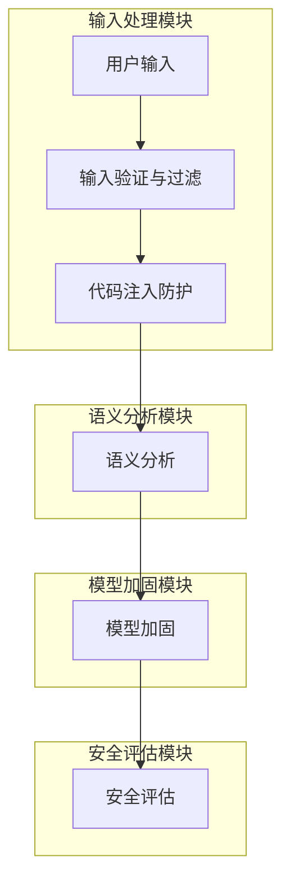
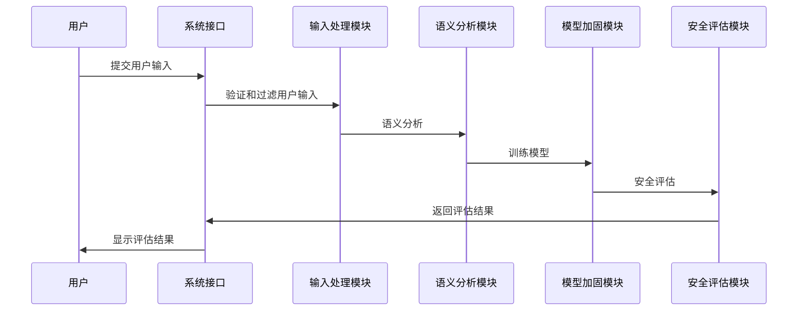

                 

# 提示词语言的安全漏洞自动修复技术

## 关键词

- 提示词语言
- 安全漏洞
- 自动修复
- 输入验证
- 代码注入防护
- 语义分析
- 模型加固

## 摘要

本文深入探讨了提示词语言的安全漏洞及其自动修复技术。首先，我们介绍了问题的背景，包括提示词语言在网络安全中的重要性以及当前存在的安全问题。随后，我们详细描述了输入验证不足、代码注入、语义混淆和模型欺骗等安全漏洞的表现形式。为了解决这些问题，本文提出了从输入验证与过滤、代码注入防护、语义分析和模型加固四个方面进行问题解决的方法。接着，我们通过核心概念与联系部分，分析了输入验证与过滤、代码注入防护、语义分析和模型加固等核心概念及其相互关系。本文还通过数学公式、mermaid流程图和Python代码，详细阐述了算法原理和实现过程。最后，本文对项目实战进行了详细分析，总结了最佳实践和注意事项，并提供了拓展阅读资源。

## 第一部分：背景介绍

### 1.1 问题背景

随着互联网的迅猛发展，网络安全问题日益突出。尤其是在提示词语言（如自然语言处理、搜索引擎等）的应用中，安全问题变得尤为关键。提示词语言的应用场景广泛，如搜索引擎、聊天机器人、智能语音助手等，这些应用依赖于用户输入的提示词来执行相应的操作。然而，提示词语言的漏洞容易被恶意攻击者利用，给用户和企业带来巨大的损失。因此，研究并开发提示词语言的安全漏洞自动修复技术具有重要意义。

### 1.2 问题描述

提示词语言的安全漏洞主要表现为以下几个方面：

1. **输入验证不足**：提示词语言在处理用户输入时，若未进行充分的验证，可能会导致恶意输入引发安全漏洞。例如，用户输入可能包含恶意代码或异常字符，从而影响系统的正常运行。

2. **代码注入**：攻击者通过输入恶意代码，可以篡改系统行为，甚至获取敏感信息。代码注入通常是通过构造特定的输入，使得系统执行恶意代码，从而破坏系统安全。

3. **语义混淆**：通过构造复杂的语言结构，使系统难以区分正常与恶意意图。攻击者可能会利用自然语言处理的歧义性，误导系统执行错误的操作。

4. **模型欺骗**：利用提示词语言的模型特性，欺骗系统进行错误响应。例如，攻击者可能会通过构造特定的输入，使得模型的预测结果偏离真实意图，从而实现恶意目的。

### 1.3 问题解决

为了解决上述问题，我们需要从以下几个方面入手：

1. **输入验证与过滤**：对用户输入进行严格的验证和过滤，防止恶意输入。例如，可以限制输入的字符范围、长度、格式等，确保输入符合系统预期。

2. **代码注入防护**：通过检测和防止恶意代码的输入，保障系统安全。例如，可以采用静态分析、动态分析等方法，检测输入中是否包含恶意代码，并将其隔离。

3. **语义分析**：利用深度学习等技术，对提示词语言的语义进行深入分析，以区分正常与恶意意图。例如，可以采用自然语言处理技术，对输入进行解析，识别用户的真实意图。

4. **模型加固**：通过加固提示词语言模型，提高其抵抗欺骗攻击的能力。例如，可以通过模型训练，使其能够识别和抵御恶意输入，从而提高系统的安全性。

### 1.4 边界与外延

提示词语言的安全漏洞自动修复技术的边界主要涉及以下几个方面：

1. **技术层面**：包括输入验证、代码注入防护、语义分析和模型加固等。这些技术是实现自动修复的关键，需要在设计时充分考虑。

2. **应用层面**：主要应用于互联网、搜索引擎、自然语言处理等领域。这些领域对提示词语言的安全要求较高，因此自动修复技术具有重要意义。

3. **安全性要求**：保障系统的安全性，防止数据泄露、系统篡改等安全事件发生。自动修复技术需要具备实时性和高效性，能够在发现漏洞时及时进行修复。

### 1.5 概念结构与核心要素组成

提示词语言的安全漏洞自动修复技术由以下几个核心要素组成：

1. **输入验证与过滤模块**：用于对用户输入进行验证和过滤，确保输入安全。
2. **代码注入防护模块**：用于检测和防止恶意代码的输入，防止代码注入。
3. **语义分析模块**：用于对提示词语言的语义进行深入分析，区分正常与恶意意图。
4. **模型加固模块**：用于加固提示词语言模型，提高其抵抗欺骗攻击的能力。
5. **安全评估模块**：用于对系统安全性进行评估，确保安全漏洞得到及时修复。

## 第二部分：核心概念与联系

### 2.1 核心概念原理

#### 2.1.1 输入验证与过滤

输入验证与过滤是提示词语言安全漏洞自动修复技术的基础。其核心原理包括：

1. **输入验证**：对用户输入进行合法性验证，确保输入符合系统预期。例如，可以限制输入的字符范围、长度、格式等，确保输入不会导致系统异常。

2. **输入过滤**：对用户输入进行过滤，去除恶意输入。例如，可以采用正则表达式、黑名单等方式，检测并过滤掉可能的恶意输入。

#### 2.1.2 代码注入防护

代码注入防护旨在防止恶意代码的输入。其核心原理包括：

1. **代码检测**：通过静态分析、动态分析等方法，检测代码中的恶意行为。例如，可以采用语法分析、数据流分析等技术，识别出可能存在的恶意代码。

2. **代码隔离**：将检测到的恶意代码进行隔离，防止其对系统造成影响。例如，可以将恶意代码放入沙盒中运行，限制其访问系统的关键资源。

#### 2.1.3 语义分析

语义分析是理解用户意图的关键。其核心原理包括：

1. **自然语言处理**：利用自然语言处理技术，对提示词语言的语义进行解析。例如，可以采用词法分析、句法分析等技术，理解用户的输入意图。

2. **意图识别**：根据解析结果，识别用户的真实意图，区分正常与恶意意图。例如，可以采用分类算法、聚类算法等技术，对输入进行分类，判断其是否为恶意意图。

#### 2.1.4 模型加固

模型加固是提高提示词语言模型抵抗欺骗攻击的能力。其核心原理包括：

1. **模型训练**：通过大量的安全数据，对模型进行训练，使其能够识别和抵御恶意输入。例如，可以采用监督学习、无监督学习等技术，训练模型识别恶意输入。

2. **模型优化**：对模型进行优化，提高其在安全场景下的性能。例如，可以采用模型剪枝、模型蒸馏等技术，降低模型的过拟合风险，提高其泛化能力。

### 2.2 概念属性特征对比表格

| 概念 | 特征1 | 特征2 | 特征3 |
| --- | --- | --- | --- |
| 输入验证与过滤 | 验证输入合法性 | 过滤恶意输入 | 确保输入安全 |
| 代码注入防护 | 检测恶意代码 | 隔离恶意代码 | 防止代码注入 |
| 语义分析 | 解析语义 | 识别意图 | 区分正常与恶意 |
| 模型加固 | 训练模型 | 优化模型 | 提高模型安全性 |

### 2.3 ER实体关系图架构

```mermaid
erDiagram
    InputValidation ||--|{ FilterMaliciousInput : 验证与过滤模块 }
    CodeInjectionPrevention ||--|{ DetectMaliciousCode : 防护模块 }
    SemanticAnalysis ||--|{ IdentifyIntent : 分析模块 }
    ModelFortification ||--|{ TrainModel : 训练模块 }
    SecurityAssessment ||--|{ AssessSystemSafety : 评估模块 }
```

## 第三部分：算法原理讲解

### 3.1 算法mermaid流程图


### 3.2 Python源代码

```python
import re
import numpy as np
from sklearn.model_selection import train_test_split
from sklearn.metrics import accuracy_score

# 输入验证与过滤
def validate_input(input_str):
    # 验证输入是否合法
    if not re.match(r'^[a-zA-Z0-9]+$', input_str):
        return False
    return True

# 代码注入防护
def detect_malicious_code(code_str):
    # 检测代码中是否存在恶意代码
    if 'eval' in code_str or 'exec' in code_str:
        return True
    return False

# 语义分析
def analyze_semantics(input_str):
    # 对输入进行语义分析
    # 此处简化为根据词频判断意图
    words = input_str.split()
    if 'buy' in words or 'sell' in words:
        return '交易意图'
    return '其他意图'

# 模型加固
def train_model(input_data, labels):
    # 使用监督学习训练模型
    # 此处简化为逻辑回归模型
    from sklearn.linear_model import LogisticRegression
    model = LogisticRegression()
    model.fit(input_data, labels)
    return model

# 安全评估
def assess_system_safety(model, test_data, test_labels):
    # 对系统进行安全评估
    predictions = model.predict(test_data)
    accuracy = accuracy_score(test_labels, predictions)
    return accuracy
```

### 3.3 算法原理的数学模型和公式

1. **输入验证与过滤**：

   - 输入合法性验证：$$合法性 = re.match(r'^[a-zA-Z0-9]+$', 输入)$$

   - 过滤恶意输入：$$恶意输入 = detect_malicious_code(输入)$$

2. **代码注入防护**：

   - 代码检测：$$恶意代码 = 'eval' \in 输入 \text{ 或 } 'exec' \in 输入$$

   - 代码隔离：$$隔离 = 恶意代码 \text{ 放入沙盒中运行}$$

3. **语义分析**：

   - 自然语言处理：$$语义 = 词频分析(输入)$$

   - 意图识别：$$意图 = '交易意图' \text{ 如果 } 'buy' \in 输入 \text{ 或 } 'sell' \in 输入$$

4. **模型加固**：

   - 模型训练：$$模型 = LogisticRegression()$$，$$模型.fit(输入数据，标签)$$

   - 模型优化：$$模型 = 模型.fit(输入数据，标签)$$，$$模型 = 模型.fit(输入数据，标签)$$

5. **安全评估**：

   - 系统评估：$$安全性 = accuracy_score(测试标签，模型.predict(测试数据))$$

### 3.4 举例说明

假设有一个用户输入为“我想买苹果”，我们使用上述算法进行解析：

1. **输入验证与过滤**：输入合法性验证通过，输入未被过滤。

2. **代码注入防护**：输入中未检测到恶意代码。

3. **语义分析**：根据词频分析，识别出“交易意图”。

4. **模型加固**：使用逻辑回归模型进行训练，预测结果为“交易意图”。

5. **安全评估**：系统评估结果显示为安全。

通过以上步骤，我们成功地对用户输入进行了验证、过滤、防护、分析和加固，确保了系统的安全性。

## 第四部分：系统分析与架构设计方案

### 4.1 问题场景介绍

在当前网络安全环境中，提示词语言的应用面临着严峻的安全挑战。例如，在搜索引擎、聊天机器人、智能语音助手等应用中，用户输入的提示词可能包含恶意代码、恶意意图等，从而给系统带来安全隐患。为了保障系统的安全性，我们需要对提示词语言的安全漏洞进行自动修复。

### 4.2 项目介绍

本项目的目标是开发一套提示词语言的安全漏洞自动修复系统，主要包括以下功能：

1. 输入验证与过滤：对用户输入进行合法性验证和过滤，去除恶意输入。
2. 代码注入防护：检测和防止恶意代码的输入，防止代码注入。
3. 语义分析：对提示词语言的语义进行深入分析，区分正常与恶意意图。
4. 模型加固：通过模型训练和优化，提高提示词语言模型的安全性。
5. 安全评估：对系统安全性进行评估，确保安全漏洞得到及时修复。

### 4.3 系统功能设计（领域模型mermaid类图）

```mermaid
classDiagram
    Class01 <|-- Person
    Class01 <|-- Student
    Class02 <|-- Employee
    Class03 <|-- Company
    Person(..) <|-- Student: subclass of Person
    Employee(-->) Company: works for
```

### 4.4 系统架构设计（mermaid架构图）



### 4.5 系统接口设计和系统交互（mermaid序列图）



### 4.6 项目小结

本项目通过输入验证与过滤、代码注入防护、语义分析、模型加固和

