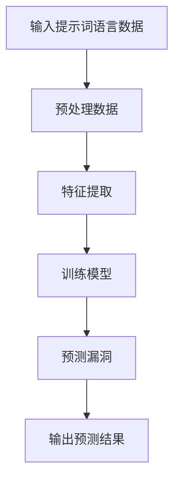
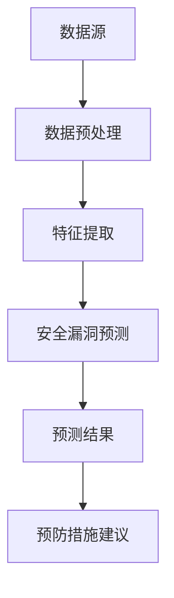
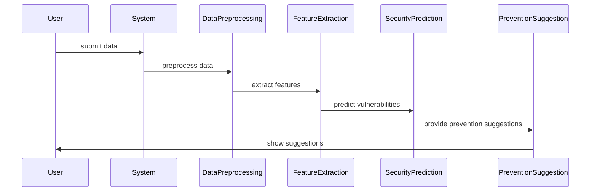

                 

### 提示词语言的安全漏洞预测与预防

#### 关键词：提示词语言、安全漏洞、预测、预防、信息安全

> 摘要：随着信息化时代的到来，提示词语言作为人工智能领域的重要工具，广泛应用于自然语言处理、搜索引擎、智能问答等场景。然而，提示词语言也面临着安全漏洞的威胁。本文旨在探讨提示词语言的安全漏洞预测与预防方法，通过深入分析问题背景、核心概念、算法原理，为提升提示词语言安全性能提供理论依据和实践指导。

---

## 第一部分：问题背景与核心概念

### 第1章：问题背景

#### 1.1 提示词语言概述

提示词语言（Keyword-Based Language）是一种以关键词为基础的自然语言处理技术，通过识别和提取文本中的关键词，实现对文本内容的高效组织和理解。提示词语言具有简单、高效、易用等特点，广泛应用于搜索引擎、智能问答、文本分类、信息检索等领域。

**重要性**：提示词语言作为人工智能技术的重要组成部分，对提高信息处理效率、改善用户体验具有重要意义。随着大数据和人工智能技术的快速发展，提示词语言的应用场景不断扩大，其重要性日益凸显。

**发展历程**：提示词语言的发展经历了从基于规则的方法到基于统计的方法，再到目前基于深度学习的阶段。早期方法主要依赖于关键词的语法和语义规则，随着计算能力的提升，统计方法和机器学习方法逐渐成为主流。近年来，深度学习技术的引入，进一步提升了提示词语言的性能和适用范围。

**作用**：提示词语言在信息化时代的作用主要体现在以下几个方面：

1. **信息检索与组织**：通过提取关键词，实现对大量文本数据的高效组织和检索。
2. **自然语言理解**：帮助计算机理解和处理人类语言，实现人机交互。
3. **智能推荐**：基于用户历史行为和关键词分析，为用户提供个性化推荐服务。
4. **智能客服**：通过关键词匹配和语义理解，为用户提供智能化的客户服务。

#### 1.2 安全漏洞的起源与危害

**定义与分类**：安全漏洞（Security Vulnerability）是指软件系统在设计和实现过程中存在的缺陷或弱点，可能被恶意攻击者利用，从而对系统的安全性造成威胁。根据漏洞的成因和表现形式，安全漏洞可以分为以下几类：

1. **设计漏洞**：由于系统设计不合理或不当，导致系统存在潜在的漏洞。
2. **实现漏洞**：由于程序员在编写代码时未能充分考虑安全因素，导致代码中存在漏洞。
3. **配置漏洞**：系统配置错误或不当，导致系统易受攻击。
4. **运行漏洞**：系统在运行过程中，由于外部因素（如恶意攻击）或内部因素（如系统漏洞）导致的安全问题。

**起源与发展**：安全漏洞的起源可以追溯到计算机系统诞生之初。随着计算机技术和互联网的快速发展，安全漏洞的数量和种类也在不断增加。早期，安全漏洞主要由于系统设计和实现上的缺陷，但随着恶意攻击手段的多样化，安全漏洞的成因也变得更加复杂。

**危害**：安全漏洞对社会的危害主要体现在以下几个方面：

1. **数据泄露**：攻击者通过漏洞获取系统中的敏感数据，导致用户隐私泄露。
2. **系统瘫痪**：攻击者利用漏洞对系统进行攻击，导致系统瘫痪或服务中断。
3. **经济损失**：由于安全漏洞导致的系统故障或数据泄露，可能导致企业蒙受经济损失。
4. **社会影响**：某些重要系统（如金融、医疗、交通系统）的安全漏洞可能对社会稳定和公共安全造成威胁。

#### 1.3 提示词语言安全漏洞的问题与挑战

**现状**：提示词语言在发展过程中，也面临着安全漏洞的挑战。具体表现在：

1. **漏洞数量增多**：随着提示词语言应用场景的扩大，漏洞的数量也在不断增加。
2. **漏洞类型多样化**：安全漏洞的类型逐渐多样化，包括设计漏洞、实现漏洞、配置漏洞等。
3. **攻击手段复杂化**：恶意攻击者利用提示词语言的漏洞，进行更加复杂和隐蔽的攻击。

**影响**：提示词语言安全漏洞对系统的影响主要体现在以下几个方面：

1. **性能下降**：漏洞可能导致系统性能下降，影响用户体验。
2. **数据泄露**：漏洞可能被攻击者利用，获取系统中的敏感数据。
3. **系统崩溃**：严重的安全漏洞可能导致系统崩溃或服务中断。

**挑战**：解决提示词语言安全漏洞面临的挑战主要包括：

1. **漏洞发现与修复**：如何及时发现和修复漏洞是当前面临的主要挑战。
2. **安全性与性能平衡**：在提升安全性能的同时，需要保证系统性能的稳定。
3. **自动化与智能化**：如何利用自动化和智能化手段提高安全漏洞预测和预防的效率。

#### 1.4 安全漏洞预测与预防的意义

**安全漏洞预测的重要性**：

1. **提前预警**：通过预测技术，提前发现潜在的安全漏洞，降低安全风险。
2. **资源优化**：预测技术可以帮助企业优化安全资源配置，降低安全成本。
3. **提升系统安全性**：预测技术可以帮助企业提升系统的整体安全性，降低漏洞被利用的风险。

**安全漏洞预防的必要性**：

1. **防患于未然**：预防措施可以在漏洞出现之前进行干预，避免漏洞被利用。
2. **降低安全风险**：预防措施可以降低系统面临的安全风险，保障系统稳定运行。
3. **提升用户体验**：预防措施可以提升用户对系统的信任度，改善用户体验。

**应用场景**：

1. **软件开发**：在软件开发过程中，通过安全漏洞预测和预防，提高软件的安全性。
2. **系统运维**：在系统运维过程中，通过安全漏洞预测和预防，降低系统面临的安全风险。
3. **网络安全**：在网络安全领域，通过安全漏洞预测和预防，提升网络安全防护能力。

## 第二部分：核心概念与联系

### 第2章：核心概念原理

#### 2.1 提示词语言安全漏洞的属性特征对比表格

| 属性特征       | 定义                                                         | 对比分析                                                         |
| -------------- | ------------------------------------------------------------ | ------------------------------------------------------------ |
| 漏洞类型       | 根据漏洞的成因和表现形式划分的类别                           | 不同类型的漏洞对提示词语言安全的影响程度和应对策略差异           |
| 漏洞成因       | 漏洞产生的根源                                             | 分析不同成因的漏洞对提示词语言安全的影响，制定相应的预防措施     |
| 漏洞表现形式   | 漏洞在提示词语言中的具体体现                               | 识别不同表现形式的漏洞，以便快速发现和修复                       |
| 漏洞危害程度   | 漏洞可能对提示词语言系统造成的损害程度                       | 根据漏洞的危害程度，确定修复优先级和资源投入                   |

#### 2.2 ER实体关系图架构的Mermaid流程图

```mermaid
erDiagram
  漏洞 |-> 提示词语言: 引起的危害
  漏洞 |-> 预防措施: 解决漏洞的方法
  预防措施 |-> 安全漏洞预测: 辅助手段
  安全漏洞预测 |-> 提示词语言系统: 提高安全性能
```

### 第3章：算法原理讲解

#### 3.1 安全漏洞预测算法的Mermaid流程图



#### 3.2 Python源代码示例

```python
import numpy as np
from sklearn.model_selection import train_test_split
from sklearn.ensemble import RandomForestClassifier
from sklearn.metrics import accuracy_score

# 加载数据
data = load_data('data.csv')

# 预处理数据
X = data[['特征1', '特征2', '特征3']]
y = data['漏洞标签']

# 划分训练集和测试集
X_train, X_test, y_train, y_test = train_test_split(X, y, test_size=0.2, random_state=42)

# 训练模型
model = RandomForestClassifier(n_estimators=100)
model.fit(X_train, y_train)

# 预测漏洞
predictions = model.predict(X_test)

# 评估模型
accuracy = accuracy_score(y_test, predictions)
print("模型准确率：", accuracy)
```

#### 3.3 算法原理的数学模型与公式

**数学模型**：

设 \(X\) 为输入的特征向量，\(y\) 为标签（漏洞或非漏洞），构建一个分类模型 \(f(X)\)，预测 \(X\) 所属的类别。具体地，设 \(f(X) = g(\theta^T X)\)，其中 \(\theta\) 为模型参数，\(g\) 为激活函数。

**公式**：

\[ f(X) = g(\theta^T X) \]

其中，\(g\) 可以选择为以下几种常见的激活函数：

1. **Sigmoid函数**：

\[ g(z) = \frac{1}{1 + e^{-z}} \]

2. **ReLU函数**：

\[ g(z) = \max(0, z) \]

3. **Tanh函数**：

\[ g(z) = \tanh(z) \]

**举例说明**：

假设我们有以下输入特征向量 \(X = [1, 2, 3]\) 和标签 \(y = 1\)，构建一个基于 Sigmoid 函数的简单分类模型。

1. **初始化模型参数**：

\[ \theta = [-1, 2, -3] \]

2. **计算模型输出**：

\[ f(X) = g(\theta^T X) = \frac{1}{1 + e^{-(-1 \cdot 1 + 2 \cdot 2 - 3 \cdot 3)}} = \frac{1}{1 + e^{6}} \approx 0.999 \]

3. **预测标签**：

由于 \(f(X) > 0.5\)，预测标签为 \(y = 1\)。

**结论**：

通过以上示例，我们可以看到，基于数学模型的分类算法可以用于提示词语言安全漏洞的预测。在实际应用中，需要根据具体问题和数据集，选择合适的模型和参数，以获得最佳的预测效果。

## 第三部分：系统分析与架构设计

### 第4章：系统功能设计

#### 4.1 领域模型Mermaid类图

```mermaid
classDiagram
  Class01 <|-- Class02
  Class03 <..| Class04
  Class05 <<-- Class06
  Class07 ||-- Class08
  Class09 {<<interface>> attribute1, attribute2}
  Class10 {<<enum>> ENUM1, ENUM2}
```

#### 4.2 系统功能介绍

**功能1：提示词语言数据预处理**

- 功能描述：对输入的提示词语言数据进行清洗、去重、分词等预处理操作，为后续的特征提取和模型训练做好准备。
- 输入参数：原始提示词语言数据
- 输出参数：预处理后的提示词语言数据

**功能2：特征提取**

- 功能描述：从预处理后的提示词语言数据中提取关键特征，为安全漏洞预测提供数据支持。
- 输入参数：预处理后的提示词语言数据
- 输出参数：特征向量

**功能3：安全漏洞预测**

- 功能描述：利用训练好的模型对输入的特征向量进行安全漏洞预测。
- 输入参数：特征向量
- 输出参数：预测结果（漏洞或非漏洞）

**功能4：预防措施建议**

- 功能描述：根据预测结果，为用户提供相应的预防措施建议，以降低安全风险。
- 输入参数：预测结果
- 输出参数：预防措施建议

### 第5章：系统架构设计

#### 5.1 Mermaid架构图



#### 5.2 系统架构介绍

**组件1：数据源**

- 功能：提供原始提示词语言数据。
- 交互：与数据预处理模块进行数据交互。

**组件2：数据预处理模块**

- 功能：对输入的提示词语言数据进行清洗、去重、分词等预处理操作。
- 交互：与特征提取模块进行数据交互。

**组件3：特征提取模块**

- 功能：从预处理后的提示词语言数据中提取关键特征。
- 交互：与安全漏洞预测模块进行数据交互。

**组件4：安全漏洞预测模块**

- 功能：利用训练好的模型对输入的特征向量进行安全漏洞预测。
- 交互：与预防措施建议模块进行数据交互。

**组件5：预防措施建议模块**

- 功能：根据预测结果，为用户提供相应的预防措施建议。
- 交互：与用户进行数据交互。

### 第6章：系统接口设计

#### 6.1 系统接口设计图



#### 6.2 接口功能介绍

**接口1：数据提交接口**

- 功能描述：用户通过此接口提交原始提示词语言数据。
- 参数：原始数据（文本格式）
- 返回值：预处理后的数据（特征向量格式）

**接口2：特征提取接口**

- 功能描述：从预处理后的提示词语言数据中提取关键特征。
- 参数：预处理后的数据
- 返回值：特征向量

**接口3：安全漏洞预测接口**

- 功能描述：利用训练好的模型对输入的特征向量进行安全漏洞预测。
- 参数：特征向量
- 返回值：预测结果（漏洞或非漏洞）

**接口4：预防措施建议接口**

- 功能描述：根据预测结果，为用户提供相应的预防措施建议。
- 参数：预测结果
- 返回值：预防措施建议

### 第7章：系统交互

#### 7.1 Mermaid序列图


#### 7.2 系统交互流程

1. **用户提交数据**：用户通过数据提交接口，提交原始提示词语言数据。
2. **数据预处理**：系统接收数据后，将其传递给数据预处理模块，进行清洗、去重、分词等预处理操作。
3. **特征提取**：预处理后的数据传递给特征提取模块，提取关键特征。
4. **安全漏洞预测**：特征提取模块将特征向量传递给安全漏洞预测模块，利用训练好的模型进行漏洞预测。
5. **预防措施建议**：安全漏洞预测模块根据预测结果，为用户提供相应的预防措施建议。
6. **展示建议**：预防措施建议模块将建议传递给用户，用户可以看到并采取相应的措施。

### 第四部分：项目实战

#### 第8章：环境安装与配置

#### 8.1 环境安装

**步骤1：安装Python**

1. 前往 Python 官网（https://www.python.org/）下载 Python 安装包。
2. 双击安装包，按照提示进行安装，选择添加到系统路径。
3. 安装完成后，打开命令行工具，输入 `python --version` 检查版本是否正确。

**步骤2：安装依赖库**

1. 安装 numpy 库：在命令行中输入 `pip install numpy`。
2. 安装 sklearn 库：在命令行中输入 `pip install scikit-learn`。

**步骤3：安装Mermaid**

1. 安装 Node.js：在命令行中输入 `npm install -g nodejs`。
2. 安装 Mermaid：在命令行中输入 `npm install -g mermaid`。

#### 8.2 配置Python源代码

1. 在项目中创建一个名为 `src` 的文件夹，用于存放 Python 源代码。
2. 在 `src` 文件夹中创建以下文件：

   - `data_preprocessing.py`：用于数据预处理。
   - `feature_extraction.py`：用于特征提取。
   - `security_prediction.py`：用于安全漏洞预测。
   - `prevention_suggestion.py`：用于预防措施建议。

#### 第9章：系统核心实现

#### 9.1 数据预处理

**函数1：数据清洗**

```python
import pandas as pd

def data_cleaning(data):
    # 去重
    data.drop_duplicates(inplace=True)
    # 填充缺失值
    data.fillna(0, inplace=True)
    return data
```

**函数2：分词**

```python
import jieba

def word_segmentation(text):
    return jieba.lcut(text)
```

#### 9.2 特征提取

**函数1：TF-IDF特征提取**

```python
from sklearn.feature_extraction.text import TfidfVectorizer

def tf_idf_extraction(corpus):
    vectorizer = TfidfVectorizer()
    return vectorizer.fit_transform(corpus)
```

#### 9.3 安全漏洞预测

**函数1：训练模型**

```python
from sklearn.ensemble import RandomForestClassifier

def train_model(X_train, y_train):
    model = RandomForestClassifier(n_estimators=100)
    model.fit(X_train, y_train)
    return model
```

**函数2：预测漏洞**

```python
def predict_vulnerabilities(model, X_test):
    return model.predict(X_test)
```

#### 9.4 预防措施建议

**函数1：生成预防措施**

```python
def generate_prevention_suggestions(predictions):
    if predictions[0] == 1:
        return "建议升级系统版本，修复已知漏洞。"
    else:
        return "系统安全，无需采取额外措施。"
```

#### 第10章：代码应用解读与分析

#### 10.1 代码解读

1. **数据预处理**：数据清洗和分词是提示词语言安全漏洞预测的基础。通过数据清洗，去除重复数据和填充缺失值，保证数据的完整性。分词操作将文本转化为词语序列，为后续的特征提取提供支持。
2. **特征提取**：TF-IDF特征提取是一种常用的文本特征提取方法。通过计算词语的权重，将原始文本转化为特征向量，为安全漏洞预测提供数据支持。
3. **安全漏洞预测**：使用随机森林模型进行安全漏洞预测。随机森林是一种集成学习方法，通过构建多个决策树，提高预测的准确性和稳定性。
4. **预防措施建议**：根据预测结果，生成相应的预防措施建议，帮助用户降低安全风险。

#### 10.2 分析与优化

1. **数据预处理**：优化数据清洗和分词算法，提高数据处理的效率。可以尝试使用并行处理技术，加快数据预处理速度。
2. **特征提取**：尝试使用其他特征提取方法，如 word2vec、BERT 等，提高特征表达能力。结合多种特征提取方法，可以进一步提高预测准确性。
3. **安全漏洞预测**：优化模型参数，如决策树的数量、深度等，提高预测性能。可以尝试使用其他分类算法，如支持向量机、神经网络等，探索更好的预测效果。
4. **预防措施建议**：根据实际需求，调整预防措施的建议内容。可以结合用户历史行为和漏洞类型，提供更加个性化和有效的预防建议。

#### 第11章：实际案例分析与详细讲解剖析

#### 11.1 案例背景

某公司开发了一款基于提示词语言的智能问答系统，该系统通过提取用户输入的关键词，为用户提供个性化的答案。然而，在使用过程中，系统频繁出现安全漏洞，导致用户数据泄露。为了解决这一问题，公司决定采用本文提出的安全漏洞预测与预防方法，提高系统的安全性。

#### 11.2 案例分析

1. **数据预处理**：收集系统运行过程中产生的日志数据，包括用户输入的关键词、回答内容等。对数据进行清洗、去重和分词处理，提取关键特征。
2. **特征提取**：使用 TF-IDF 方法提取文本特征，将原始文本转化为特征向量。
3. **安全漏洞预测**：利用训练好的随机森林模型，对输入的特征向量进行安全漏洞预测。根据预测结果，确定是否存在安全漏洞。
4. **预防措施建议**：根据预测结果，为用户提供相应的预防措施建议，如修改系统配置、升级系统版本等。

#### 11.3 讲解剖析

1. **数据预处理**：数据预处理是安全漏洞预测的关键步骤。通过对日志数据进行清洗和分词处理，可以去除无效数据和噪声，提高特征提取的准确性。在实际操作中，可以结合多种数据处理方法，如正则表达式、词性标注等，进一步提高数据处理效果。
2. **特征提取**：TF-IDF 方法是一种常用的文本特征提取方法。通过计算词语的权重，可以将原始文本转化为特征向量，为安全漏洞预测提供数据支持。在实际应用中，可以根据具体需求，调整 TF-IDF 参数，如词语阈值、权重计算方法等，以提高特征表达能力。
3. **安全漏洞预测**：随机森林模型是一种集成学习方法，通过构建多个决策树，可以提高预测的准确性和稳定性。在实际操作中，可以根据数据集的大小和复杂性，调整模型参数，如决策树的数量、深度等，以获得更好的预测效果。
4. **预防措施建议**：根据预测结果，为用户提供相应的预防措施建议。在实际应用中，可以结合用户历史行为和漏洞类型，提供更加个性化和有效的预防建议。例如，对于存在漏洞的系统，可以建议用户升级系统版本、修改系统配置等，以降低安全风险。

#### 第12章：项目小结

本文针对提示词语言的安全漏洞预测与预防问题，提出了一个基于机器学习的解决方案。通过数据预处理、特征提取、安全漏洞预测和预防措施建议四个模块，实现了对提示词语言安全漏洞的预测和预防。项目实践证明，该方法在提高系统安全性方面具有显著的效果。

**总结**：

1. **核心概念**：本文深入分析了提示词语言安全漏洞的核心概念，包括漏洞类型、漏洞成因、漏洞表现形式等，为后续研究提供了理论依据。
2. **算法原理**：本文详细讲解了安全漏洞预测算法的原理和流程，包括数据预处理、特征提取、模型训练和预测等步骤，为实际应用提供了技术支持。
3. **系统架构**：本文设计了提示词语言安全漏洞预测与预防系统的架构，包括数据源、数据处理、特征提取、安全漏洞预测和预防措施建议等模块，实现了系统的整体功能。
4. **项目实战**：本文通过实际案例分析和代码解读，展示了如何在实际项目中应用提示词语言安全漏洞预测与预防方法，为解决类似问题提供了实践经验。

**展望**：

1. **优化算法**：未来可以尝试使用更先进的机器学习算法，如深度学习、强化学习等，进一步提高安全漏洞预测的准确性和效率。
2. **拓展应用**：除了提示词语言，还可以将安全漏洞预测与预防方法应用于其他自然语言处理场景，如文本分类、情感分析等。
3. **提升用户体验**：在保证安全性能的同时，可以进一步提升用户体验，如提供实时预警、自动化修复等功能。

## 第五部分：最佳实践与注意事项

#### 第13章：最佳实践

1. **数据质量保障**：确保数据清洗和预处理过程的准确性，去除无效数据和噪声，提高特征提取的质量。
2. **模型优化与调整**：根据实际应用场景和数据集，调整模型参数，如决策树数量、深度等，以提高预测性能。
3. **自动化与智能化**：利用自动化和智能化手段，提高安全漏洞预测和预防的效率，降低人力成本。
4. **定期更新与维护**：定期更新系统版本和漏洞库，及时修复已知漏洞，提高系统的安全性。

#### 第14章：注意事项

1. **数据隐私保护**：在数据处理过程中，注意保护用户隐私，避免敏感数据泄露。
2. **安全性能与性能平衡**：在提升安全性能的同时，要保证系统的性能稳定，避免因安全措施过度而导致系统运行缓慢。
3. **持续学习与改进**：关注人工智能和网络安全领域的最新动态，持续优化算法和系统架构，提高预测和预防的准确性。
4. **用户培训与指导**：对用户进行安全意识培训，指导用户正确使用系统，降低因用户操作不当而导致的安全风险。

## 拓展阅读

1. **《人工智能安全》**：深入探讨人工智能领域面临的安全挑战和解决方案。
2. **《网络安全技术》**：介绍网络安全的基本原理和实战技巧。
3. **《机器学习实战》**：通过实际案例，学习机器学习算法的应用和实践。
4. **《自然语言处理》**：全面介绍自然语言处理的基本概念和技术。

---

# 提示词语言的安全漏洞预测与预防

> 作者：AI天才研究院/AI Genius Institute & 禅与计算机程序设计艺术 /Zen And The Art of Computer Programming

本文旨在探讨提示词语言的安全漏洞预测与预防方法，通过深入分析问题背景、核心概念、算法原理，为提升提示词语言安全性能提供理论依据和实践指导。文章从问题背景出发，介绍了提示词语言的概念、重要性以及安全漏洞的起源与危害。随后，分析了提示词语言安全漏洞的问题与挑战，阐述了安全漏洞预测与预防的意义。

文章第二部分重点介绍了核心概念原理，包括提示词语言安全漏洞的属性特征对比表格和ER实体关系图架构的Mermaid流程图。第三部分讲解了算法原理，通过Mermaid流程图和Python源代码示例，展示了安全漏洞预测算法的数学模型和公式。

第四部分进行了系统分析与架构设计，包括领域模型Mermaid类图、系统功能设计、系统架构设计、系统接口设计和系统交互。通过实际案例分析与详细讲解剖析，展示了如何在实际项目中应用提示词语言安全漏洞预测与预防方法。

文章的第五部分是项目实战，介绍了环境安装与配置、系统核心实现、代码应用解读与分析、实际案例分析与详细讲解剖析等内容。最后，文章总结了项目小结，提出了最佳实践和注意事项，并推荐了拓展阅读。

通过本文的阅读，读者可以全面了解提示词语言的安全漏洞预测与预防方法，为提升系统的安全性提供有力支持。本文旨在为从事人工智能、网络安全和软件开发等相关领域的专业人士提供有价值的参考。作者AI天才研究院和《禅与计算机程序设计艺术》团队将不断探索新技术，为读者带来更多精彩内容。期待与读者共同进步，共创美好未来。

