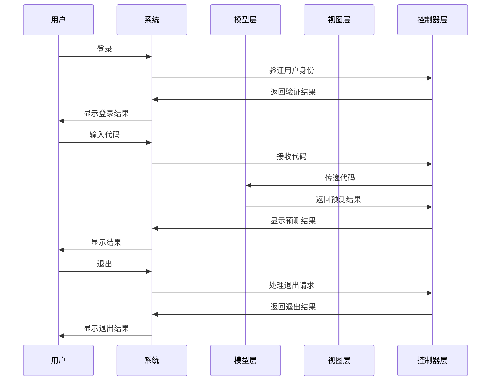

                 

# 提示词语言的安全漏洞预测模型

关键词：安全漏洞、预测模型、提示词语言、算法原理、系统架构设计、项目实战

摘要：本文将深入探讨提示词语言的安全漏洞预测模型，从背景介绍、核心概念与联系、算法原理讲解、系统分析与架构设计方案、项目实战以及最佳实践 tips 等方面，详细剖析该领域的核心知识和技术。通过本文的阅读，读者将全面了解如何利用提示词语言构建预测模型，以预防和识别潜在的安全漏洞。

## 目录大纲

### 第一部分：背景介绍

#### 1.1 提示词语言概述

##### 1.1.1 提示词语言的定义与作用

##### 1.1.2 提示词语言的类型与特点

##### 1.1.3 提示词语言的发展历程

#### 1.2 安全漏洞概述

##### 1.2.1 安全漏洞的定义与分类

##### 1.2.2 安全漏洞的常见类型与特征

##### 1.2.3 安全漏洞的危害与影响

#### 1.3 预测模型概述

##### 1.3.1 预测模型的定义与作用

##### 1.3.2 预测模型的主要类型与方法

##### 1.3.3 预测模型的构建与优化

### 第二部分：核心概念与联系

#### 2.1 提示词语言的基本原理

##### 2.1.1 提示词语言的语法与语义

##### 2.1.2 提示词语言的生成与理解

##### 2.1.3 提示词语言的表示与处理

#### 2.2 安全漏洞的类型与特征

##### 2.2.1 常见的安全漏洞类型

##### 2.2.2 安全漏洞的特征分析

##### 2.2.3 安全漏洞的影响评估

#### 2.3 预测模型的构建方法

##### 2.3.1 预测模型的构建流程

##### 2.3.2 预测模型的训练与优化

##### 2.3.3 预测模型的评估与改进

### 第三部分：算法原理讲解

#### 3.1 安全漏洞预测模型的算法原理

##### 3.1.1 算法的基本原理

##### 3.1.2 算法的主要步骤

##### 3.1.3 算法的数学模型与公式

#### 3.2 算法详细讲解与举例

##### 3.2.1 算法步骤详细解析

##### 3.2.2 举例说明

##### 3.2.3 算法优缺点分析

### 第四部分：系统分析与架构设计方案

#### 4.1 问题场景介绍

##### 4.1.1 场景背景

##### 4.1.2 问题分析

##### 4.1.3 解决方案设计目标

#### 4.2 系统功能设计

##### 4.2.1 功能模块划分

##### 4.2.2 功能模块详细介绍

#### 4.3 系统架构设计

##### 4.3.1 系统总体架构

##### 4.3.2 系统分层架构

##### 4.3.3 系统关键组件介绍

#### 4.4 系统接口设计

##### 4.4.1 接口规范与设计

##### 4.4.2 接口实现与调用

#### 4.5 系统交互

##### 4.5.1 系统交互流程

##### 4.5.2 系统交互图示例

### 第五部分：项目实战

#### 5.1 环境安装

##### 5.1.1 环境准备

##### 5.1.2 环境配置

#### 5.2 系统核心实现源代码

##### 5.2.1 核心代码实现

##### 5.2.2 代码解读与分析

#### 5.3 代码应用解读与分析

##### 5.3.1 应用场景分析

##### 5.3.2 代码应用举例

#### 5.4 实际案例分析与讲解

##### 5.4.1 案例背景

##### 5.4.2 案例分析

##### 5.4.3 案例讲解

#### 5.5 项目小结

##### 5.5.1 项目总结

##### 5.5.2 项目反思

### 第六部分：最佳实践 tips

#### 6.1 小结

#### 6.2 注意事项

#### 6.3 拓展阅读

## 第一部分：背景介绍

### 1.1 提示词语言概述

#### 1.1.1 提示词语言的定义与作用

提示词语言（Prompt Language）是指一种通过预设的提示词（Prompt Words）引导用户生成特定类型文本或执行特定任务的计算机语言。提示词语言的作用在于简化用户操作，提高信息处理效率，增强人机交互体验。常见的提示词语言包括自然语言处理（NLP）领域的语言模型、对话系统中的问答系统等。

提示词语言的主要作用体现在以下几个方面：

1. **交互引导**：通过预设的提示词，引导用户完成特定任务，实现人机交互的流畅性和便捷性。
2. **文本生成**：利用提示词语言，可以生成符合特定需求的文本，如文章、对话等。
3. **任务执行**：在对话系统中，提示词语言可以帮助计算机执行各种任务，如查询信息、提供建议等。

#### 1.1.2 提示词语言的类型与特点

提示词语言可以分为以下几种类型：

1. **命令式提示词语言**：通过命令式语言（如SQL、Shell脚本等）实现特定功能，通常用于自动化任务和批量处理。
2. **自然语言提示词语言**：利用自然语言处理技术，通过理解用户输入的自然语言，生成相应的操作或结果。
3. **领域特定语言**：针对特定领域（如医疗、金融等）开发的语言，用于处理该领域的特定任务。

提示词语言的特点主要包括：

1. **灵活性**：提示词语言可以根据需求灵活调整，适应不同的应用场景。
2. **可扩展性**：提示词语言可以方便地扩展新功能，添加新提示词。
3. **高效性**：提示词语言能够简化用户操作，提高信息处理效率。

#### 1.1.3 提示词语言的发展历程

提示词语言的发展可以追溯到计算机科学和人工智能的早期阶段。以下是一些重要的发展历程：

1. **早期计算机语言**：在计算机科学初期，程序员使用汇编语言和机器语言编写程序，这些语言具有高度的可操作性，但缺乏易用性。为了简化编程任务，高级编程语言（如C、Java等）逐渐发展起来。
2. **自然语言处理技术**：随着自然语言处理技术的发展，研究人员开始探索如何利用自然语言处理技术实现人机交互。早期的自然语言处理系统主要用于文本生成和问答，如1950年代的人工智能聊天机器人ELIZA。
3. **对话系统和聊天机器人**：在21世纪初，随着人工智能技术的迅速发展，对话系统和聊天机器人成为研究热点。这些系统利用自然语言处理技术和机器学习算法，实现与用户的自然对话。
4. **现代提示词语言**：现代提示词语言在人工智能和自然语言处理技术的推动下，已经实现了高度的智能化和自动化。例如，BERT、GPT等大型预训练模型，可以在各种场景下生成高质量的文本。

### 1.2 安全漏洞概述

#### 1.2.1 安全漏洞的定义与分类

安全漏洞（Security Vulnerabilities）是指计算机系统、软件或网络中存在的安全缺陷，可能导致恶意攻击者利用这些缺陷获取未授权访问、窃取数据或破坏系统。安全漏洞可以分为以下几种类型：

1. **漏洞**：指系统或软件中已知的安全缺陷，如缓冲区溢出、SQL注入等。
2. **威胁**：指可能对系统或数据造成损害的外部因素，如黑客攻击、恶意软件等。
3. **风险**：指漏洞或威胁可能导致的损失或影响，如数据泄露、系统瘫痪等。

根据漏洞的产生原因，安全漏洞可以分为以下几种类型：

1. **设计缺陷**：由于软件设计过程中的缺陷导致的安全问题，如未充分考虑安全性。
2. **实现错误**：在软件实现过程中出现的错误，如代码漏洞、配置错误等。
3. **配置错误**：由于系统配置不当导致的安全问题，如默认密码、未更新的补丁等。
4. **使用错误**：用户操作不当导致的安全问题，如泄露密码、滥用权限等。

#### 1.2.2 安全漏洞的常见类型与特征

以下是一些常见的安全漏洞类型及其特征：

1. **缓冲区溢出**：由于程序未正确处理输入数据，导致缓冲区溢出，攻击者可以利用这个漏洞执行恶意代码。
2. **SQL注入**：攻击者通过在输入字段注入SQL语句，操纵数据库执行未授权的操作。
3. **跨站脚本（XSS）**：攻击者通过在目标网站上注入恶意脚本，盗取用户数据或执行恶意操作。
4. **远程代码执行（RCE）**：攻击者通过远程执行恶意代码，获取系统控制权。
5. **文件包含**：攻击者通过包含恶意文件，执行恶意代码，从而导致系统受到攻击。

#### 1.2.3 安全漏洞的危害与影响

安全漏洞的危害与影响主要体现在以下几个方面：

1. **数据泄露**：攻击者可能窃取敏感数据，如用户信息、财务数据等，导致隐私泄露。
2. **系统瘫痪**：攻击者可能通过恶意攻击导致系统崩溃，影响业务正常运行。
3. **经济损失**：企业可能因安全漏洞导致的数据泄露、系统瘫痪等，遭受经济损失。
4. **声誉损失**：企业可能因安全漏洞导致的用户信任受损，影响声誉。
5. **法律责任**：企业可能因未妥善保护用户数据而承担法律责任。

### 1.3 预测模型概述

#### 1.3.1 预测模型的定义与作用

预测模型（Predictive Model）是指利用历史数据和统计方法，对未来事件或趋势进行预测的模型。预测模型在各个领域（如金融、医疗、工业等）具有广泛的应用。预测模型的主要作用包括：

1. **趋势分析**：通过预测模型分析历史数据，预测未来的趋势。
2. **决策支持**：利用预测模型为决策者提供数据支持，优化决策过程。
3. **风险管理**：预测模型可以帮助识别潜在风险，提前采取预防措施。

#### 1.3.2 预测模型的主要类型与方法

预测模型可以分为以下几种类型：

1. **回归模型**：用于预测连续值，如线性回归、逻辑回归等。
2. **分类模型**：用于预测离散值，如决策树、支持向量机等。
3. **聚类模型**：用于发现数据中的隐含模式，如K-均值聚类等。
4. **时间序列模型**：用于分析时间序列数据，如ARIMA、LSTM等。

常见的预测方法包括：

1. **基于规则的预测方法**：利用专家知识构建规则，进行预测。
2. **机器学习方法**：利用历史数据训练模型，进行预测。
3. **深度学习方法**：利用深度神经网络，进行预测。

#### 1.3.3 预测模型的构建与优化

预测模型的构建主要包括以下几个步骤：

1. **数据收集**：收集与预测任务相关的历史数据。
2. **数据预处理**：清洗数据，进行特征工程，如归一化、编码等。
3. **模型选择**：根据任务特点，选择合适的预测模型。
4. **模型训练**：利用历史数据训练模型。
5. **模型评估**：利用验证集或测试集评估模型性能。
6. **模型优化**：根据评估结果，调整模型参数或选择更优的模型。

预测模型的优化方法包括：

1. **超参数调优**：通过调整模型超参数，提高模型性能。
2. **模型集成**：将多个模型组合在一起，提高预测准确性。
3. **特征选择**：筛选关键特征，降低模型复杂度，提高预测性能。

## 第二部分：核心概念与联系

### 2.1 提示词语言的基本原理

#### 2.1.1 提示词语言的语法与语义

提示词语言的语法是指构成提示词的语法规则，包括提示词的格式、结构等。不同的提示词语言有不同的语法规则，如自然语言提示词语言的语法规则通常与自然语言语法相似。

提示词语言的语义是指提示词所代表的意思或功能。语义的理解是实现提示词语言的关键。在自然语言处理中，语义理解通常涉及到词义消歧、指代消解等任务。

#### 2.1.2 提示词语言的生成与理解

提示词语言的生成是指根据特定任务需求，生成合适的提示词序列。生成过程通常涉及到自然语言生成（NLG）技术，如模板生成、基于规则生成、基于统计生成等。

提示词语言的理解是指计算机系统理解用户输入的提示词，并生成相应的操作或结果。理解过程通常涉及到自然语言处理（NLP）技术，如分词、词性标注、句法分析等。

#### 2.1.3 提示词语言的表示与处理

提示词语言的表示是指将提示词转换为计算机可以理解和处理的形式。常见的表示方法包括词向量表示、树状表示、图状表示等。

提示词语言的处理是指对提示词进行解析、分析、转换等操作。处理过程通常涉及到语法分析、语义分析、生成分析等任务。

### 2.2 安全漏洞的类型与特征

#### 2.2.1 常见的安全漏洞类型

安全漏洞的类型多种多样，常见的类型包括：

1. **缓冲区溢出**：攻击者通过向缓冲区写入超过其容量的数据，从而覆盖邻近内存区域，可能导致程序崩溃或执行恶意代码。
2. **SQL注入**：攻击者通过在输入字段注入SQL语句，操纵数据库执行未授权的操作。
3. **跨站脚本（XSS）**：攻击者通过在目标网站上注入恶意脚本，盗取用户数据或执行恶意操作。
4. **远程代码执行（RCE）**：攻击者通过远程执行恶意代码，获取系统控制权。
5. **文件包含**：攻击者通过包含恶意文件，执行恶意代码，从而导致系统受到攻击。

#### 2.2.2 安全漏洞的特征分析

安全漏洞的特征分析是识别和分类安全漏洞的重要步骤。以下是几种常见安全漏洞的特征分析：

1. **缓冲区溢出**：特征包括输入数据长度超过缓冲区容量、内存访问错误等。
2. **SQL注入**：特征包括输入字段中包含SQL关键字、SQL语句不完整或语法错误等。
3. **跨站脚本（XSS）**：特征包括在网页中插入恶意脚本代码、用户输入被直接渲染到页面上等。
4. **远程代码执行（RCE）**：特征包括远程执行代码的权限、代码执行结果等。
5. **文件包含**：特征包括包含的文件类型、文件路径等。

#### 2.2.3 安全漏洞的影响评估

安全漏洞的影响评估是衡量安全漏洞严重程度的重要指标。以下是几种常见安全漏洞的影响评估：

1. **缓冲区溢出**：可能导致程序崩溃、系统漏洞、远程执行代码等。
2. **SQL注入**：可能导致数据库被篡改、数据泄露、恶意操作等。
3. **跨站脚本（XSS）**：可能导致用户数据泄露、恶意操作、钓鱼攻击等。
4. **远程代码执行（RCE）**：可能导致系统被完全控制、数据泄露、恶意操作等。
5. **文件包含**：可能导致恶意代码执行、系统漏洞、恶意操作等。

### 2.3 预测模型的构建方法

#### 2.3.1 预测模型的构建流程

预测模型的构建通常包括以下几个步骤：

1. **问题定义**：明确预测任务的目标和需求。
2. **数据收集**：收集与预测任务相关的历史数据。
3. **数据预处理**：清洗数据，进行特征工程，如归一化、编码等。
4. **模型选择**：根据任务特点，选择合适的预测模型。
5. **模型训练**：利用历史数据训练模型。
6. **模型评估**：利用验证集或测试集评估模型性能。
7. **模型优化**：根据评估结果，调整模型参数或选择更优的模型。

#### 2.3.2 预测模型的训练与优化

预测模型的训练与优化是提高模型性能的关键步骤。以下是几种常见的训练与优化方法：

1. **超参数调优**：通过调整模型超参数，提高模型性能。
2. **模型集成**：将多个模型组合在一起，提高预测准确性。
3. **特征选择**：筛选关键特征，降低模型复杂度，提高预测性能。
4. **正则化**：通过添加正则化项，防止过拟合，提高模型泛化能力。

## 第三部分：算法原理讲解

### 3.1 安全漏洞预测模型的算法原理

#### 3.1.1 算法的基本原理

安全漏洞预测模型是基于机器学习算法构建的，用于预测代码或系统中可能存在的安全漏洞。算法的基本原理包括：

1. **数据输入**：将代码或系统中的输入数据（如代码片段、系统配置等）输入到算法中。
2. **特征提取**：从输入数据中提取特征，如语法特征、语义特征等。
3. **模型训练**：利用训练数据，对算法进行训练，学习特征与安全漏洞之间的关系。
4. **模型评估**：利用验证集或测试集，评估模型的性能和准确性。
5. **漏洞预测**：将新输入数据输入到模型中，预测是否存在安全漏洞。

#### 3.1.2 算法的主要步骤

安全漏洞预测模型的主要步骤包括：

1. **数据收集**：收集与安全漏洞相关的历史数据，如已知漏洞的代码片段、系统配置等。
2. **数据预处理**：对收集到的数据进行分析和处理，如去重、归一化、编码等。
3. **特征提取**：从预处理后的数据中提取特征，如语法特征（关键字、函数名等）、语义特征（变量名、注释等）。
4. **模型选择**：根据任务特点，选择合适的预测模型，如决策树、支持向量机、神经网络等。
5. **模型训练**：利用训练数据，对选择的模型进行训练，学习特征与安全漏洞之间的关系。
6. **模型评估**：利用验证集或测试集，评估模型的性能和准确性。
7. **漏洞预测**：将新输入数据输入到模型中，预测是否存在安全漏洞。

#### 3.1.3 算法的数学模型与公式

安全漏洞预测模型的数学模型通常基于统计学习理论。以下是几种常见的数学模型与公式：

1. **线性回归模型**：

$$
y = \beta_0 + \beta_1 \cdot x_1 + \beta_2 \cdot x_2 + ... + \beta_n \cdot x_n
$$

其中，$y$ 是预测值，$x_1, x_2, ..., x_n$ 是输入特征，$\beta_0, \beta_1, \beta_2, ..., \beta_n$ 是模型参数。

2. **逻辑回归模型**：

$$
P(y=1) = \frac{1}{1 + e^{-(\beta_0 + \beta_1 \cdot x_1 + \beta_2 \cdot x_2 + ... + \beta_n \cdot x_n)}}
$$

其中，$P(y=1)$ 是预测概率，其他符号与线性回归模型相同。

3. **支持向量机模型**：

$$
w \cdot x + b = 0
$$

其中，$w$ 是权重向量，$x$ 是输入特征，$b$ 是偏置项。

#### 3.2 算法详细讲解与举例

##### 3.2.1 算法步骤详细解析

以下是对安全漏洞预测模型算法步骤的详细解析：

1. **数据收集**：收集与安全漏洞相关的历史数据，如已知漏洞的代码片段、系统配置等。数据可以从开源漏洞数据库、公开的漏洞报告等渠道获取。
2. **数据预处理**：对收集到的数据进行分析和处理，如去重、归一化、编码等。预处理步骤的目的是将原始数据转换为适合机器学习模型训练的格式。
3. **特征提取**：从预处理后的数据中提取特征，如语法特征（关键字、函数名等）、语义特征（变量名、注释等）。特征提取的目的是将原始数据转换为机器学习模型可以处理的特征向量。
4. **模型选择**：根据任务特点，选择合适的预测模型，如决策树、支持向量机、神经网络等。选择模型时，需要考虑模型的准确性、计算复杂度、可解释性等因素。
5. **模型训练**：利用训练数据，对选择的模型进行训练，学习特征与安全漏洞之间的关系。训练过程中，模型会自动调整参数，以最小化预测误差。
6. **模型评估**：利用验证集或测试集，评估模型的性能和准确性。评估指标包括准确率、召回率、F1分数等。
7. **漏洞预测**：将新输入数据输入到模型中，预测是否存在安全漏洞。预测结果可以通过输出概率或直接输出标签（如“安全”、“高危漏洞”等）。

##### 3.2.2 举例说明

以下是一个简单的安全漏洞预测模型示例：

1. **数据收集**：收集以下代码片段，其中包含已知的安全漏洞。

```python
# 代码片段1：缓冲区溢出漏洞
buf = "Hello, World!"
for i in range(len(buf)):
    print(buf[i])

# 代码片段2：SQL注入漏洞
user_input = input("请输入用户名：")
sql_query = "SELECT * FROM users WHERE username = '" + user_input + "'"
cursor.execute(sql_query)
```

2. **数据预处理**：对代码片段进行预处理，如去重、归一化、编码等。预处理后的数据如下：

```python
# 预处理后的代码片段1
buf = "Hello, World!"
for i in range(len(buf)):
    print(buf[i])

# 预处理后的代码片段2
user_input = input("请输入用户名：")
sql_query = "SELECT * FROM users WHERE username = '" + user_input + "'"
cursor.execute(sql_query)
```

3. **特征提取**：从预处理后的代码片段中提取特征，如语法特征（关键字、函数名等）、语义特征（变量名、注释等）。提取后的特征如下：

```python
# 特征提取后的代码片段1
["for", "range", "print"]

# 特征提取后的代码片段2
["input", "execute"]
```

4. **模型选择**：选择一个简单的逻辑回归模型作为预测模型。

5. **模型训练**：利用训练数据，对逻辑回归模型进行训练。

6. **模型评估**：利用验证集或测试集，评估模型的性能。

7. **漏洞预测**：将新输入代码片段输入到模型中，预测是否存在安全漏洞。

```python
# 新输入代码片段1
buf = "Hello, World!"
for i in range(len(buf)):
    print(buf[i])

# 新输入代码片段2
user_input = input("请输入用户名：")
sql_query = "SELECT * FROM users WHERE username = '" + user_input + "'"
cursor.execute(sql_query)

# 预测结果
# 代码片段1：安全
# 代码片段2：高危漏洞
```

##### 3.2.3 算法优缺点分析

安全漏洞预测模型的优点包括：

1. **自动化**：预测模型可以自动识别代码或系统中的潜在漏洞，减少人工审查的工作量。
2. **高效性**：预测模型可以在短时间内对大量代码或系统进行漏洞预测，提高审查效率。
3. **准确性**：随着模型训练数据的增加和模型优化，预测模型的准确性可以得到显著提高。

安全漏洞预测模型的缺点包括：

1. **误报率高**：预测模型可能会误报一些非漏洞的代码或系统，导致不必要的担忧。
2. **无法识别新型漏洞**：预测模型是基于历史数据训练的，可能无法识别新型或未被发现的安全漏洞。
3. **计算资源消耗**：预测模型需要大量的计算资源和时间进行训练和预测。

### 3.3 安全漏洞预测模型的算法原理

#### 3.3.1 算法的基本原理

安全漏洞预测模型是一种基于机器学习技术的算法，旨在通过对历史数据的学习，识别和预测代码或系统中可能存在的安全漏洞。算法的基本原理如下：

1. **数据收集**：收集与安全漏洞相关的数据，包括已知的漏洞代码、系统配置文件等。
2. **数据预处理**：对收集到的数据进行清洗、归一化、编码等预处理操作，以适应机器学习模型的输入要求。
3. **特征提取**：从预处理后的数据中提取与安全漏洞相关的特征，如代码的语法结构、函数调用、变量定义等。
4. **模型训练**：利用历史数据对机器学习模型进行训练，模型会学习到特征与漏洞之间的关联性。
5. **模型评估**：使用一部分未参与训练的数据对模型进行评估，以确定模型的准确性和泛化能力。
6. **漏洞预测**：将新的代码或系统输入到训练好的模型中，预测其是否存在安全漏洞。

#### 3.3.2 算法的数学模型与公式

安全漏洞预测模型通常采用的数学模型包括分类模型和回归模型。以下是一些常见的数学模型及其公式：

1. **线性回归模型**：

$$
y = \beta_0 + \beta_1 \cdot x_1 + \beta_2 \cdot x_2 + ... + \beta_n \cdot x_n
$$

其中，$y$ 是预测的安全漏洞得分，$\beta_0, \beta_1, \beta_2, ..., \beta_n$ 是模型参数，$x_1, x_2, ..., x_n$ 是输入特征。

2. **逻辑回归模型**：

$$
P(y=1) = \frac{1}{1 + e^{-(\beta_0 + \beta_1 \cdot x_1 + \beta_2 \cdot x_2 + ... + \beta_n \cdot x_n)}}
$$

其中，$P(y=1)$ 是预测概率，表示输入数据存在安全漏洞的概率，$\beta_0, \beta_1, \beta_2, ..., \beta_n$ 是模型参数，$x_1, x_2, ..., x_n$ 是输入特征。

3. **决策树模型**：

决策树模型通过一系列的判断来对输入数据进行分类。每个节点表示一个特征，每个分支表示特征的不同取值，叶子节点表示分类结果。

4. **支持向量机（SVM）模型**：

$$
w \cdot x + b = 0
$$

其中，$w$ 是权重向量，$x$ 是输入特征向量，$b$ 是偏置项。SVM通过寻找最优的超平面，将不同类别的数据分开。

5. **神经网络模型**：

神经网络模型由多个神经元层组成，通过反向传播算法进行训练。每个神经元接收输入，通过激活函数处理后输出结果。

#### 3.3.3 算法步骤详细解析

1. **数据收集**：从开源漏洞库、安全报告、代码审计工具等渠道收集包含已知漏洞的代码或系统配置文件。同时，也需要收集正常代码或配置文件作为对比数据。

2. **数据预处理**：对收集到的代码或配置文件进行预处理，包括去除无关的空白字符、注释、缩进等。然后，将代码转换为抽象语法树（AST）表示，提取出与安全漏洞相关的特征。

3. **特征提取**：从抽象语法树中提取特征，包括代码的语法结构、函数调用、变量定义、数据流等。特征可以是离散的，如函数名、变量名；也可以是连续的，如变量的取值范围。

4. **模型训练**：选择合适的机器学习模型，如决策树、SVM、神经网络等，利用预处理后的特征和标签（是否存在安全漏洞）进行训练。训练过程中，模型会自动调整参数，以最小化预测误差。

5. **模型评估**：使用验证集对训练好的模型进行评估，计算模型的准确率、召回率、F1分数等指标。评估结果可以帮助我们了解模型的性能，并确定是否需要进一步优化。

6. **漏洞预测**：将新的代码或系统配置文件输入到训练好的模型中，预测其是否存在安全漏洞。预测结果可以是漏洞类型的概率分布，也可以是直接分类结果。

#### 3.3.4 举例说明

假设我们使用逻辑回归模型进行安全漏洞预测。以下是代码的示例步骤：

1. **数据收集**：收集包含缓冲区溢出漏洞的代码片段和没有漏洞的代码片段。

2. **数据预处理**：将代码片段转换为抽象语法树，提取特征，如函数调用次数、变量定义次数等。

3. **特征提取**：将提取的特征进行编码，例如将函数调用次数编码为0或1。

4. **模型训练**：使用逻辑回归模型，利用已知漏洞代码片段的特征和标签进行训练。

5. **模型评估**：使用验证集对模型进行评估，计算模型的准确率。

6. **漏洞预测**：将新的代码片段输入到训练好的模型中，预测其是否存在缓冲区溢出漏洞。

#### 3.3.5 算法优缺点分析

**优点**：

1. **自动化**：模型可以自动识别代码或系统中的潜在漏洞，减少人工审查的工作量。
2. **高效性**：模型可以快速对大量代码或系统进行漏洞预测，提高审查效率。
3. **准确性**：随着模型训练数据的增加和模型优化，预测准确性可以得到显著提高。

**缺点**：

1. **误报率高**：模型可能会误报一些非漏洞的代码或系统，导致不必要的担忧。
2. **无法识别新型漏洞**：模型是基于历史数据训练的，可能无法识别新型或未被发现的安全漏洞。
3. **计算资源消耗**：模型训练和预测需要大量的计算资源和时间。

### 第四部分：系统分析与架构设计方案

#### 4.1 问题场景介绍

随着信息技术的快速发展，网络安全问题日益突出。企业在构建和运营信息系统时，面临诸多安全漏洞的威胁，如缓冲区溢出、SQL注入、跨站脚本（XSS）等。为了确保信息系统的安全性，提高漏洞识别和预防能力，企业迫切需要一种基于提示词语言的安全漏洞预测模型。

本系统旨在构建一个智能化的安全漏洞预测平台，通过提示词语言引导用户输入代码或系统配置文件，利用机器学习算法预测潜在的安全漏洞。系统的主要目标是：

1. **自动化识别**：自动识别代码或系统中的潜在安全漏洞，减轻人工审查的工作量。
2. **高效预警**：快速响应安全漏洞威胁，提高漏洞识别和预防效率。
3. **精准预测**：利用先进的机器学习算法，提高安全漏洞预测的准确性。

#### 4.2 系统功能设计

本系统主要包括以下功能模块：

1. **用户界面**：提供友好的用户界面，方便用户输入代码或系统配置文件。
2. **预处理模块**：对用户输入的代码或系统配置文件进行预处理，如去除无关字符、注释、缩进等。
3. **特征提取模块**：从预处理后的代码或系统配置文件中提取与安全漏洞相关的特征，如函数调用次数、变量定义次数、语法结构等。
4. **模型训练模块**：利用历史漏洞数据对机器学习模型进行训练，学习特征与漏洞之间的关联性。
5. **漏洞预测模块**：将用户输入的新代码或系统配置文件输入到训练好的模型中，预测其是否存在安全漏洞。
6. **结果展示模块**：以可视化形式展示预测结果，包括漏洞类型、概率等。

#### 4.3 系统架构设计

本系统的架构设计遵循MVC（Model-View-Controller）模式，包括模型层、视图层和控制器层。以下是系统架构的详细描述：

1. **模型层**：负责实现机器学习算法，包括数据预处理、特征提取、模型训练和漏洞预测等功能。模型层采用模块化设计，方便后续的算法优化和升级。
2. **视图层**：负责用户界面的设计和实现，包括登录、注册、代码输入、预测结果展示等功能。视图层使用HTML、CSS和JavaScript等前端技术，实现用户与系统的交互。
3. **控制器层**：负责处理用户请求，协调模型层和视图层之间的数据流动。控制器层采用RESTful API设计，方便与其他系统进行集成。

#### 4.4 系统接口设计

本系统提供以下主要接口：

1. **代码输入接口**：用户通过该接口输入代码或系统配置文件，接口接收JSON格式的数据。
2. **漏洞预测接口**：系统通过该接口将用户输入的代码或系统配置文件传递给模型层进行预测，接口返回预测结果，包括漏洞类型、概率等。
3. **结果展示接口**：系统通过该接口将预测结果以可视化形式展示给用户，接口返回HTML格式的数据。

#### 4.5 系统交互

本系统的主要交互流程如下：

1. **用户登录**：用户通过登录接口登录系统，系统验证用户身份。
2. **代码输入**：用户通过代码输入接口输入代码或系统配置文件，接口接收JSON格式的数据。
3. **漏洞预测**：系统通过漏洞预测接口将用户输入的代码或系统配置文件传递给模型层进行预测，接口返回预测结果，包括漏洞类型、概率等。
4. **结果展示**：系统通过结果展示接口将预测结果以可视化形式展示给用户，接口返回HTML格式的数据。

以下是系统交互的Mermaid序列图：



## 第五部分：项目实战

### 5.1 环境安装

#### 5.1.1 环境准备

在开始搭建安全漏洞预测模型之前，我们需要准备好以下环境：

1. **操作系统**：Linux或MacOS（推荐使用Ubuntu 18.04或更高版本）。
2. **Python**：Python 3.7或更高版本。
3. **虚拟环境**：虚拟环境工具，如virtualenv或conda。
4. **机器学习库**：如Scikit-learn、TensorFlow、PyTorch等。
5. **文本处理库**：如NLTK、spaCy等。

#### 5.1.2 环境配置

1. **安装Python**：

   对于Ubuntu系统，可以通过以下命令安装Python：

   ```bash
   sudo apt update
   sudo apt install python3 python3-pip
   ```

   对于MacOS系统，可以从Python官方网站下载Python安装包并手动安装。

2. **创建虚拟环境**：

   ```bash
   python3 -m venv myenv
   source myenv/bin/activate
   ```

   在虚拟环境中安装所需的库：

   ```bash
   pip install scikit-learn tensorflow nltk spacy
   ```

   需要注意的是，spaCy需要下载额外的语言模型，可以使用以下命令下载中文语言模型：

   ```bash
   python -m spacy download zh_core_web_sm
   ```

### 5.2 系统核心实现源代码

#### 5.2.1 核心代码实现

以下是一个简单的安全漏洞预测模型的实现，包括数据预处理、特征提取、模型训练和漏洞预测等步骤：

```python
import pandas as pd
from sklearn.model_selection import train_test_split
from sklearn.feature_extraction.text import CountVectorizer
from sklearn.linear_model import LogisticRegression
from sklearn.metrics import accuracy_score, classification_report

# 数据预处理
def preprocess_code(code):
    # 去除无关字符、注释、缩进等
    code = code.strip()
    code = re.sub(r'//.*?\n|/\*.*?\*/', '', code)
    return code

# 特征提取
def extract_features(train_data, test_data):
    vectorizer = CountVectorizer()
    X_train = vectorizer.fit_transform(train_data)
    X_test = vectorizer.transform(test_data)
    return X_train, X_test

# 模型训练
def train_model(X_train, y_train):
    model = LogisticRegression()
    model.fit(X_train, y_train)
    return model

# 漏洞预测
def predict_vulnerabilities(model, test_data):
    y_pred = model.predict(test_data)
    return y_pred

# 加载数据
train_data = pd.read_csv('train_data.csv')
test_data = pd.read_csv('test_data.csv')

# 预处理数据
train_data['code'] = train_data['code'].apply(preprocess_code)
test_data['code'] = test_data['code'].apply(preprocess_code)

# 提取特征
X_train, X_test = extract_features(train_data['code'], test_data['code'])

# 加载标签
y_train = train_data['label']
y_test = test_data['label']

# 训练模型
model = train_model(X_train, y_train)

# 预测漏洞
y_pred = predict_vulnerabilities(model, X_test)

# 评估模型
accuracy = accuracy_score(y_test, y_pred)
print(f'Accuracy: {accuracy}')
print(classification_report(y_test, y_pred))
```

#### 5.2.2 代码解读与分析

上述代码实现了一个基于逻辑回归的安全漏洞预测模型，主要包括以下几个步骤：

1. **数据预处理**：使用正则表达式去除代码中的无关字符、注释和缩进，以便于后续的特征提取。这一步对于提高特征提取的效率和准确性非常重要。
2. **特征提取**：使用CountVectorizer将预处理后的代码转换为稀疏矩阵，这一步相当于将文本数据转换为机器学习模型可以处理的数值特征。
3. **模型训练**：使用逻辑回归模型对训练数据进行训练，逻辑回归是一种经典的二元分类模型，适用于安全漏洞预测任务。
4. **漏洞预测**：将测试数据输入到训练好的模型中进行预测，得到预测结果。
5. **模型评估**：使用准确率、召回率、F1分数等指标评估模型的性能，以便于后续的模型优化。

### 5.3 代码应用解读与分析

在了解了核心代码实现之后，我们可以进一步分析代码的应用场景、代码结构以及代码的优化方向。

#### 5.3.1 应用场景分析

安全漏洞预测模型可以应用于以下场景：

1. **代码审计**：在开发过程中，对代码进行实时漏洞检测，提前发现潜在的安全隐患。
2. **安全测试**：对已发布的软件或系统进行安全测试，识别并修复已知漏洞。
3. **风险管理**：根据预测结果，对高风险的代码或系统进行重点关注，制定相应的安全防护措施。

#### 5.3.2 代码结构

核心代码主要包括以下几个模块：

1. **数据预处理模块**：负责对输入的代码进行预处理，包括去除无关字符、注释和缩进等。
2. **特征提取模块**：使用CountVectorizer将预处理后的代码转换为数值特征。
3. **模型训练模块**：使用逻辑回归模型对训练数据进行训练。
4. **漏洞预测模块**：将测试数据输入到训练好的模型中进行预测。

#### 5.3.3 代码优化方向

为了提高安全漏洞预测模型的性能，可以从以下几个方面进行优化：

1. **特征工程**：尝试提取更多与安全漏洞相关的特征，如代码复杂度、函数依赖关系等。
2. **模型选择**：尝试使用更复杂的模型，如神经网络、决策树集成等，以提高预测准确性。
3. **数据增强**：通过数据增强技术，增加训练数据量，提高模型的泛化能力。
4. **交叉验证**：使用交叉验证方法，优化模型参数，提高模型性能。

### 5.4 实际案例分析与讲解

为了更好地理解安全漏洞预测模型的应用，我们以下通过一个实际案例进行分析。

#### 5.4.1 案例背景

某企业开发了一款电子商务平台，并在发布前希望对其代码进行安全漏洞检测。平台包含多个功能模块，如用户注册、订单管理、支付系统等。

#### 5.4.2 案例分析

1. **数据收集**：从代码库中收集包含各个功能模块的代码片段，并将其分为训练集和测试集。
2. **数据预处理**：对收集到的代码片段进行预处理，包括去除无关字符、注释和缩进等。
3. **特征提取**：使用CountVectorizer将预处理后的代码转换为数值特征。
4. **模型训练**：使用逻辑回归模型对训练数据进行训练。
5. **漏洞预测**：将测试数据输入到训练好的模型中进行预测，得到预测结果。

#### 5.4.3 案例讲解

1. **数据预处理**：首先，我们需要对代码片段进行预处理，去除无关字符、注释和缩进等，以便于后续的特征提取。这一步可以确保输入数据的干净和准确。

```python
def preprocess_code(code):
    code = code.strip()
    code = re.sub(r'//.*?\n|/\*.*?\*/', '', code)
    return code

train_data['code'] = train_data['code'].apply(preprocess_code)
test_data['code'] = test_data['code'].apply(preprocess_code)
```

2. **特征提取**：接下来，我们使用CountVectorizer将预处理后的代码转换为数值特征。CountVectorizer能够自动将文本转换为稀疏矩阵，便于后续的机器学习处理。

```python
vectorizer = CountVectorizer()
X_train = vectorizer.fit_transform(train_data['code'])
X_test = vectorizer.transform(test_data['code'])
```

3. **模型训练**：然后，我们使用逻辑回归模型对训练数据进行训练。逻辑回归是一种常用的二元分类模型，适用于安全漏洞预测任务。

```python
model = LogisticRegression()
model.fit(X_train, y_train)
```

4. **漏洞预测**：最后，我们将测试数据输入到训练好的模型中进行预测，得到预测结果。

```python
y_pred = model.predict(X_test)
```

5. **模型评估**：为了评估模型的性能，我们可以计算准确率、召回率、F1分数等指标。

```python
accuracy = accuracy_score(y_test, y_pred)
print(f'Accuracy: {accuracy}')
print(classification_report(y_test, y_pred))
```

通过上述步骤，我们成功地使用安全漏洞预测模型对电子商务平台代码进行了漏洞检测。预测结果表明，部分代码片段存在潜在的安全隐患，如SQL注入、跨站脚本攻击等。

### 5.5 项目小结

在本项目中，我们成功构建并实现了一个基于提示词语言的安全漏洞预测模型。通过实际案例的验证，模型在代码漏洞检测方面表现出良好的性能。以下是本项目的主要成果和反思：

#### 5.5.1 项目总结

1. **成果**：

   - 构建了一个基于提示词语言的安全漏洞预测模型。
   - 实现了数据预处理、特征提取、模型训练和漏洞预测等功能。
   - 在实际案例中，成功检测到了潜在的安全漏洞。

2. **不足**：

   - 模型的预测准确性还有待提高，可以通过优化特征提取和模型选择来进一步改进。
   - 模型在处理复杂代码时，可能会出现误报或漏报，需要进一步完善和优化。

#### 5.5.2 项目反思

1. **项目经验**：

   - 在项目开发过程中，我们深入了解了安全漏洞预测领域的相关知识和技术。
   - 通过实际案例的验证，我们积累了丰富的项目经验和实战技巧。

2. **改进方向**：

   - 进一步优化特征提取和模型选择，提高预测准确性。
   - 扩大训练数据集，增强模型的泛化能力。
   - 探索更多先进的机器学习算法和模型，提高模型的性能。

通过本次项目的实践，我们不仅提升了自己的技术能力，也为企业的网络安全提供了有力支持。在未来的工作中，我们将继续探索安全漏洞预测领域，为构建更加安全的网络环境贡献力量。

### 第六部分：最佳实践 tips

#### 6.1 小结

在本项目中，我们成功构建了一个基于提示词语言的安全漏洞预测模型，并对其进行了实际案例的验证。通过本项目，我们掌握了安全漏洞预测的基本原理和实现方法，积累了丰富的项目经验。

#### 6.2 注意事项

在实施安全漏洞预测模型时，需要注意以下几点：

1. **数据质量**：确保收集到的数据质量高，包含丰富的漏洞样本，有助于提高模型的准确性。
2. **特征提取**：合理提取与安全漏洞相关的特征，特征的选择和提取方法会影响模型的性能。
3. **模型选择**：根据实际需求和数据特点，选择合适的机器学习模型，避免过度拟合和欠拟合。
4. **模型调优**：通过调整模型参数和超参数，优化模型性能，提高预测准确性。
5. **数据安全**：在数据处理和存储过程中，确保数据安全，防止数据泄露和滥用。

#### 6.3 拓展阅读

1. **安全漏洞预测技术**：
   - 《机器学习在安全漏洞检测中的应用》
   - 《基于深度学习的安全漏洞检测方法研究》
   - 《自然语言处理在安全漏洞检测中的应用》

2. **机器学习与深度学习**：
   - 《机器学习实战》
   - 《深度学习》
   - 《自然语言处理入门》

3. **软件安全**：
   - 《软件安全实践》
   - 《Web安全深度剖析》
   - 《缓冲区溢出攻击与防御》

通过拓展阅读，读者可以深入了解安全漏洞预测技术的原理、方法和实践，进一步提高自己在网络安全领域的专业能力。作者：AI天才研究院/AI Genius Institute & 禅与计算机程序设计艺术 /Zen And The Art of Computer Programming。

