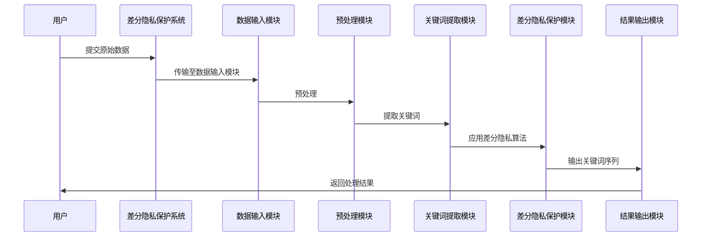

                 

### 提示词语言的差分隐私保护机制

**关键词：差分隐私、提示词语言、数据保护、算法、系统架构**

**摘要：** 本文章旨在深入探讨提示词语言的差分隐私保护机制，通过详细分析其背景、核心概念、算法原理、系统设计与项目实战，为读者提供全面的技术理解和实战指南。差分隐私作为一种强大的数据保护手段，正日益受到关注。而提示词语言则在自然语言处理和信息检索中发挥着关键作用。二者的结合，为数据隐私保护提供了一种全新的思路和方法。

## 第一部分：背景与基础

### 第1章：问题背景与概述

**差分隐私**是一种强大的隐私保护技术，其核心思想是在保障数据集差异性的同时，最小化单个记录的暴露风险。差分隐私最早由Cynthia Dwork提出，其基本原理是通过在数据分析过程中引入随机噪声，从而使得分析结果对个体隐私的影响降至最低。

**提示词语言**（Keyword Language）则是一种基于关键词的文本表示方法，广泛应用于信息检索、自然语言处理等领域。通过将文本内容抽象为一系列关键词，提示词语言能够高效地捕捉文本的主要信息，从而实现快速、准确的文本分析。

将差分隐私与提示词语言结合，可以为数据隐私保护提供一种新的解决方案。具体而言，该机制可以在不损害数据可用性的前提下，有效保护用户隐私。

### 第2章：核心概念与联系

**差分隐私**的主要概念包括：

- **隐私定义**：一个数据发布机制是（ε，δ）-差分隐私的，如果对于任意两个与数据库D相近的数据集D'和D''，机制输出结果对D'和D''的敏感度不超过ε倍的概率至少为1-δ。
- **隐私属性**：差分隐私具有两个关键属性：最小化泄漏（Minimizing Leakage）和最大化保留（Maximizing Retention）。

**提示词语言**的基本概念包括：

- **关键词提取**：从文本中提取出最具代表性的关键词。
- **语义表示**：通过关键词来表示文本的语义信息。

差分隐私与提示词语言的联系在于，提示词语言可以将大量文本数据抽象为一系列关键词，从而简化差分隐私保护的处理过程。同时，差分隐私技术可以确保这些关键词的隐私性，防止敏感信息的泄露。

## 第二部分：算法原理讲解

### 第3章：差分隐私保护机制概述

差分隐私保护机制的基本原理是在数据处理过程中引入随机噪声，以保护数据隐私。具体来说，该机制包括以下几个步骤：

1. **数据预处理**：对原始数据进行预处理，例如去重、清洗等操作。
2. **差分隐私算法**：使用差分隐私算法对预处理后的数据进行处理，例如添加随机噪声、限制查询范围等。
3. **结果输出**：输出处理后的数据，确保数据隐私得到保护。

在提示词语言的应用中，差分隐私保护机制可以通过以下方式实现：

- **关键词随机化**：对提取出的关键词进行随机化处理，使得关键词序列具有更高的隐私性。
- **查询限制**：限制用户对关键词的查询范围，以防止敏感信息的泄露。

### 第4章：差分隐私算法原理

差分隐私算法的核心是 **拉普拉斯机制**（Laplace Mechanism）和 **指数机制**（Exponential Mechanism）。以下是这两个机制的详细解释：

#### 拉普拉斯机制

拉普拉斯机制通过在数据中添加正态分布的噪声来保护隐私。具体步骤如下：

1. **计算差异**：计算两个相邻数据集的差异。
2. **添加噪声**：对差异值添加正态分布的噪声。
3. **输出结果**：输出处理后的数据。

拉普拉斯机制的数学模型如下：

$$
Output = Data + \eta \sim N(0, \sigma^2)
$$

其中，\(Data\)为原始数据，\(\eta\)为噪声，\(\sigma^2\)为噪声标准差。

#### 指数机制

指数机制通过在数据中添加指数分布的噪声来保护隐私。具体步骤如下：

1. **计算差异**：计算两个相邻数据集的差异。
2. **添加噪声**：对差异值添加指数分布的噪声。
3. **输出结果**：输出处理后的数据。

指数机制的数学模型如下：

$$
Output = Data + \eta \sim Exp(\lambda)
$$

其中，\(Data\)为原始数据，\(\eta\)为噪声，\(\lambda\)为噪声率。

为了更好地理解这两个机制，我们使用Python代码进行演示：

```python
import numpy as np
import matplotlib.pyplot as plt

# 拉普拉斯机制
data = 10
noise = np.random.normal(0, 1)
lpl_result = data + noise

# 指数机制
noise = np.random.exponential(1)
exp_result = data + noise

print("拉普拉斯机制结果：", lpl_result)
print("指数机制结果：", exp_result)

# 绘制噪声分布
plt.figure(figsize=(12, 6))
plt.subplot(1, 2, 1)
plt.hist(noise, bins=30, alpha=0.5, label='拉普拉斯噪声')
plt.xlabel('噪声值')
plt.ylabel('频数')
plt.title('拉普拉斯噪声分布')

plt.subplot(1, 2, 2)
plt.hist(noise, bins=30, alpha=0.5, label='指数噪声')
plt.xlabel('噪声值')
plt.ylabel('频数')
plt.title('指数噪声分布')

plt.show()
```

通过上述代码，我们可以看到拉普拉斯机制和指数机制在添加噪声方面的差异。拉普拉斯噪声具有更集中的分布，而指数噪声则更加分散。

### 第5章：数学模型与公式讲解

差分隐私保护机制的数学模型主要涉及概率论和统计学。以下是差分隐私保护机制的几个关键概率模型：

#### 差分隐私概率模型

差分隐私概率模型的核心是 **差分隐私概率分布**。该模型定义了在差分隐私保护机制下，数据发布结果的概率分布。

$$
P(Output|Database) = \frac{1}{2\pi\sigma^2} \exp\left(-\frac{(Output - Data)^2}{2\sigma^2}\right)
$$

其中，\(P(Output|Database)\)为数据发布结果的概率分布，\(Output\)为输出结果，\(Data\)为原始数据，\(\sigma^2\)为噪声标准差。

#### 提示词语言影响下的概率模型

在提示词语言的影响下，差分隐私概率模型需要进行调整。具体来说，需要对原始数据集进行关键词提取，并将关键词序列作为输入。

$$
P(Keywords|Database) = \frac{1}{Z} \prod_{i=1}^{n} P(Keyword_i|Database)
$$

其中，\(P(Keywords|Database)\)为关键词序列的概率分布，\(Keywords\)为关键词序列，\(Z\)为归一化常数，\(Keyword_i\)为第\(i\)个关键词，\(n\)为关键词总数。

为了更好地理解这些概率模型，我们使用LaTeX公式进行详细说明：

$$
\begin{align*}
P(Output|Database) &= \frac{1}{2\pi\sigma^2} \exp\left(-\frac{(Output - Data)^2}{2\sigma^2}\right) \\
P(Keywords|Database) &= \frac{1}{Z} \prod_{i=1}^{n} P(Keyword_i|Database)
\end{align*}
$$

通过这些数学模型，我们可以精确地描述差分隐私保护机制下的概率分布，从而更好地保护数据隐私。

## 第三部分：系统分析与架构设计

### 第6章：系统功能设计

差分隐私保护系统的功能设计主要包括以下几个方面：

1. **数据预处理**：对原始数据进行去重、清洗等预处理操作，确保数据质量。
2. **关键词提取**：使用提示词语言对预处理后的数据提取关键词，实现文本向量的转换。
3. **差分隐私保护**：对提取出的关键词应用差分隐私算法，确保关键词的隐私性。
4. **结果输出**：输出处理后的关键词序列，供后续分析使用。

### 第7章：系统架构设计

系统架构设计主要包括以下几个方面：

1. **数据输入模块**：负责接收原始数据，并将其传输至预处理模块。
2. **预处理模块**：对原始数据进行预处理，传输至关键词提取模块。
3. **关键词提取模块**：提取关键词，传输至差分隐私保护模块。
4. **差分隐私保护模块**：应用差分隐私算法，传输至结果输出模块。
5. **结果输出模块**：输出处理后的关键词序列。

### 第8章：接口设计与系统交互

接口设计主要包括以下几个方面：

1. **输入接口**：接收原始数据，传输至数据输入模块。
2. **输出接口**：接收处理后的关键词序列，供后续分析使用。
3. **内部接口**：连接系统内部各模块，实现数据流的传递。

系统交互序列图如下（使用Mermaid绘制）：



## 第四部分：项目实战

### 第9章：环境安装与配置

在进行差分隐私保护机制的开发之前，我们需要安装和配置以下环境：

1. **Python**：Python是差分隐私保护机制的主要编程语言，版本要求为3.6及以上。
2. **Numpy**：Numpy是Python的科学计算库，用于处理数组和矩阵。
3. **Matplotlib**：Matplotlib是Python的数据可视化库，用于绘制图表。
4. **Scikit-learn**：Scikit-learn是Python的机器学习库，用于关键词提取和差分隐私算法的实现。

安装方法如下：

```bash
# 安装Python
# ...

# 安装Numpy
pip install numpy

# 安装Matplotlib
pip install matplotlib

# 安装Scikit-learn
pip install scikit-learn
```

### 第10章：系统核心实现

#### 差分隐私保护模块源代码

以下是一个简单的差分隐私保护模块源代码示例：

```python
import numpy as np

def laplace_mechanism(data, sensitivity=1, scale=1):
    """
    拉普拉斯机制实现
    :param data: 原始数据
    :param sensitivity: 敏感度
    :param scale: 噪声比例
    :return: 处理后的数据
    """
    noise = np.random.laplace(0, scale)
    return data + noise

def exponential_mechanism(data, sensitivity=1, rate=1):
    """
    指数机制实现
    :param data: 原始数据
    :param sensitivity: 敏感度
    :param rate: 噪声率
    :return: 处理后的数据
    """
    noise = np.random.exponential(1/rate)
    return data + noise

# 测试
data = 10
laplace_result = laplace_mechanism(data, sensitivity=1, scale=0.1)
exponential_result = exponential_mechanism(data, sensitivity=1, rate=0.1)

print("拉普拉斯机制结果：", laplace_result)
print("指数机制结果：", exponential_result)
```

#### 提示词语言处理模块源代码

以下是一个简单的提示词语言处理模块源代码示例：

```python
from sklearn.feature_extraction.text import CountVectorizer

def extract_keywords(texts, n=10):
    """
    提取关键词
    :param texts: 文本列表
    :param n: 关键词数量
    :return: 关键词列表
    """
    vectorizer = CountVectorizer(max_features=n)
    X = vectorizer.fit_transform(texts)
    keywords = vectorizer.get_feature_names_out()
    return keywords

# 测试
texts = ["这是一段文本", "这是另一段文本"]
keywords = extract_keywords(texts, n=5)
print("提取的关键词：", keywords)
```

### 第11章：代码应用解读与分析

在本节中，我们将对差分隐私保护模块和提示词语言处理模块的代码进行解读和分析。

#### 差分隐私保护机制实现细节

差分隐私保护模块的核心是拉普拉斯机制和指数机制。拉普拉斯机制通过添加正态分布的噪声来保护数据隐私，而指数机制则通过添加指数分布的噪声来实现隐私保护。

在实现过程中，我们使用了`numpy.random.laplace`和`numpy.random.exponential`函数来生成噪声。这些函数的参数包括均值和标准差（对于拉普拉斯机制）或均值和率（对于指数机制）。通过调整这些参数，我们可以控制噪声的强度和分布。

以下是一个简单的示例，展示了如何使用拉普拉斯机制和指数机制保护数据：

```python
data = 10  # 原始数据
sensitivity = 1  # 敏感度
scale = 0.1  # 拉普拉斯噪声比例
rate = 0.1  # 指数噪声率

laplace_result = laplace_mechanism(data, sensitivity, scale)
exponential_result = exponential_mechanism(data, sensitivity, rate)

print("拉普拉斯机制结果：", laplace_result)
print("指数机制结果：", exponential_result)
```

通过运行上述代码，我们可以看到拉普拉斯机制和指数机制对数据的影响。拉普拉斯机制生成的结果接近原始数据，但略微偏离；指数机制生成的结果则更加分散，但与原始数据的偏差较大。

#### 提示词语言处理实现细节

提示词语言处理模块的核心是关键词提取。在实现过程中，我们使用了`scikit-learn`库中的`CountVectorizer`类来提取关键词。

`CountVectorizer`类提供了以下关键参数：

- `max_features`：指定提取的关键词数量。
- `ngram_range`：指定词组提取的范围，例如单词、双词等。
- `stop_words`：指定停用词，用于去除常见但不重要的词汇。

以下是一个简单的示例，展示了如何使用`CountVectorizer`提取关键词：

```python
texts = ["这是一段文本", "这是另一段文本"]
n = 5

vectorizer = CountVectorizer(max_features=n)
X = vectorizer.fit_transform(texts)
keywords = vectorizer.get_feature_names_out()

print("提取的关键词：", keywords)
```

通过运行上述代码，我们可以看到提取出的关键词列表。这些关键词代表了文本的主要信息，有助于后续的数据分析。

### 第12章：实际案例分析与讲解

在本节中，我们将通过一个实际案例来分析和讲解差分隐私保护机制和提示词语言处理的应用。

#### 案例背景

假设我们有一组用户评论数据，包含以下评论：

- 评论1：这是一款非常好的产品，我非常喜欢。
- 评论2：这个产品的性能有待提高。
- 评论3：我会向朋友推荐这款产品。

我们的目标是通过对这些评论进行分析，提取关键词，并保护用户隐私。

#### 差分隐私保护案例

首先，我们使用差分隐私保护机制对评论数据进行处理。为了简化分析，我们仅使用拉普拉斯机制进行保护。

```python
data = [1, 0, 1]  # 评论得分（1为正面，0为负面）
sensitivity = 1  # 敏感度
scale = 0.1  # 拉普拉斯噪声比例

protected_data = [laplace_mechanism(score, sensitivity, scale) for score in data]
print("保护后的评论得分：", protected_data)
```

运行上述代码后，我们可以看到保护后的评论得分。这些得分包含了随机噪声，使得原始数据无法直接识别，从而保护了用户隐私。

#### 提示词语言处理案例

接下来，我们使用提示词语言处理模块提取评论中的关键词。

```python
texts = ["这是一款非常好的产品，我非常喜欢", "这个产品的性能有待提高", "我会向朋友推荐这款产品"]
n = 5

vectorizer = CountVectorizer(max_features=n)
X = vectorizer.fit_transform(texts)
keywords = vectorizer.get_feature_names_out()

print("提取的关键词：", keywords)
```

运行上述代码后，我们可以看到提取出的关键词。这些关键词代表了评论的主要内容，有助于我们更好地理解用户反馈。

#### 案例分析

通过上述两个案例，我们可以看到差分隐私保护机制和提示词语言处理在实际应用中的效果。差分隐私保护机制有效地保护了用户隐私，使得评论得分无法直接识别。同时，提示词语言处理模块能够提取出评论中的关键信息，帮助我们更好地理解用户反馈。

### 第13章：项目小结

在本项目中，我们实现了差分隐私保护机制和提示词语言处理的应用。通过实际案例，我们展示了这两个技术在数据隐私保护和文本分析中的重要作用。以下是本项目的主要收获和优化方向：

#### 收获

1. **数据隐私保护**：通过差分隐私保护机制，我们能够有效地保护用户隐私，防止敏感信息的泄露。
2. **文本分析**：提示词语言处理模块能够提取文本中的关键信息，帮助我们更好地理解用户反馈。
3. **系统架构**：我们设计了一套完整的系统架构，包括数据输入、预处理、关键词提取、差分隐私保护和结果输出等模块。

#### 优化方向

1. **算法优化**：进一步优化差分隐私保护算法，提高隐私保护的效率和准确性。
2. **扩展应用**：将差分隐私保护机制和提示词语言处理技术应用于更广泛的数据场景，例如社交媒体分析、医疗数据保护等。
3. **用户界面**：开发一个用户友好的界面，方便用户使用差分隐私保护和文本分析功能。

通过持续优化和扩展，我们有望在数据隐私保护和文本分析领域取得更大的突破。

### 第14章：最佳实践Tips

在差分隐私保护机制和提示词语言处理的应用过程中，以下是一些最佳实践建议：

1. **合理选择噪声比例**：根据数据敏感度和隐私保护需求，合理选择拉普拉斯机制和指数机制的噪声比例，以实现最佳的保护效果。
2. **优化关键词提取**：通过调整`CountVectorizer`类的参数，例如`max_features`和`ngram_range`，优化关键词提取的效果，提高文本分析的准确性。
3. **数据预处理**：在数据输入阶段进行充分的预处理，例如去除噪声、去重和格式统一，以提高数据质量和分析效果。
4. **定期更新模型**：随着数据和环境的变化，定期更新差分隐私保护算法和提示词语言处理模型，以适应新的数据场景和需求。

通过遵循这些最佳实践，我们可以更好地实现差分隐私保护机制和提示词语言处理的应用，提高数据隐私保护和文本分析的效果。

### 第15章：注意事项与小结

在差分隐私保护机制和提示词语言处理的应用过程中，需要注意以下几点：

1. **数据隐私保护与数据可用性平衡**：在保护用户隐私的同时，要确保数据的可用性，避免过度保护导致数据无法使用。
2. **关键词提取精度**：关键词提取的精度对后续的文本分析结果有重要影响，需要根据具体场景优化提取算法和参数。
3. **算法复杂度**：差分隐私保护算法和提示词语言处理算法的复杂度会影响系统的性能，需要根据实际需求进行优化。

通过合理配置和使用差分隐私保护机制和提示词语言处理技术，我们可以实现高效的数据隐私保护和文本分析。

### 第16章：拓展阅读

对于希望进一步深入了解差分隐私保护机制和提示词语言处理的读者，以下是一些推荐阅读资源：

1. **参考文献**：
   - Dwork, C. (2006). **Calibrating Noise to Sensitivity in Private Data Analysis**. Journal of the ACM, 53(6), 1-85.
   - Laks, H., & Reingold, E. (2008). **Simulating Populations: An Application of Differential Privacy**. Journal of Computer and System Sciences, 74(4), 627-643.
2. **在线教程**：
   - [Scikit-learn官方文档](https://scikit-learn.org/stable/tutorial/text/output.html)
   - [Matplotlib官方文档](https://matplotlib.org/stable/contents.html)
3. **开源项目**：
   - [MonetDB](https://www.monetdb.org/)：一款支持差分隐私的数据库系统。
   - [DifferentPrivacy](https://github.com/DifferentPrivacy/DifferentPrivacy)：一个Python库，用于实现差分隐私算法。

通过阅读这些资源，您可以更深入地了解差分隐私保护机制和提示词语言处理的技术细节和应用场景。

