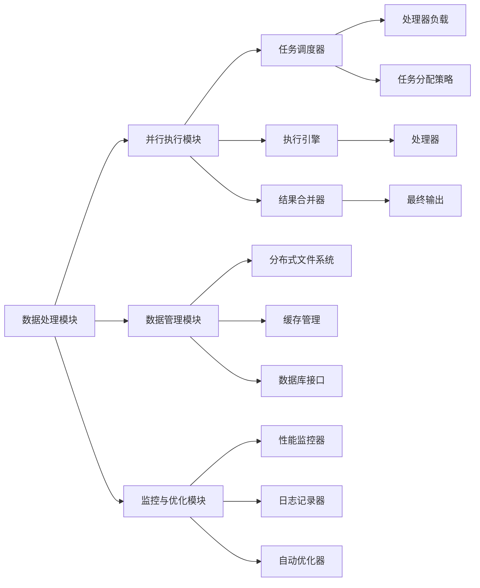

                 

### 引言

#### 1.1 问题背景与意义

在当今信息化时代，数据处理和计算能力已成为各行各业竞争力的关键因素。随着大数据和人工智能技术的快速发展，大量的数据需要被快速、准确地处理和分析。在这样的背景下，提示词语言作为一种高效的编程语言，在自然语言处理、数据挖掘、智能推荐等领域展现出强大的应用潜力。然而，传统的串行处理机制在处理大规模数据时面临着性能瓶颈，无法满足日益增长的数据处理需求。

并行处理机制作为一种提高计算效率和数据处理能力的方法，近年来受到了广泛关注。提示词语言的并行处理不仅能够显著提高数据处理速度，还能降低系统的总体成本，提升系统的可扩展性和灵活性。因此，研究提示词语言的并行处理机制具有重要的现实意义和应用价值。

本文旨在深入探讨提示词语言的并行处理机制，通过系统的分析和详细的讲解，帮助读者了解并行处理的基本原理、算法设计、数学模型以及在实际项目中的应用。本文将从以下几个方面展开：

1. **提示词语言概述**：介绍提示词语言的基本概念、特性及应用领域，为后续内容的讨论奠定基础。
2. **并行处理机制原理**：详细阐述并行处理的基本概念、优势与挑战，以及提示词语言并行处理的需求。
3. **提示词语言并行处理算法**：介绍并行处理算法的设计原则、实现方法及优化策略。
4. **数学模型与公式**：讲解并行处理过程中的数学模型及其公式推导和应用。
5. **系统设计与实现**：分析系统的架构设计、功能模块以及接口设计。
6. **项目实战案例分析**：通过具体项目案例，展示并行处理在实际应用中的效果和实现细节。
7. **最佳实践与注意事项**：总结最佳实践技巧，并提醒注意事项。
8. **小结与展望**：对研究成果进行总结，并探讨未来的发展趋势。

通过本文的阅读，读者将能够全面了解提示词语言的并行处理机制，掌握相关理论知识和实践方法，为在相关领域的研究和应用提供有力支持。

#### 1.2 研究现状与挑战

近年来，关于并行处理技术的研究取得了显著进展，尤其在计算机科学、数据科学和人工智能等领域，并行处理已成为提升计算效率和性能的关键手段。现有的研究主要集中在以下几个方面：

首先，在并行算法的设计和优化方面，研究人员提出了多种并行处理模型，如MapReduce、Spark、MPI等，这些模型通过分布式计算和任务并行化，有效提高了数据处理的速度。此外，针对特定应用场景，如深度学习、图计算等，研究者们还开发了专门的并行算法和优化方法，进一步提升了系统的性能。

其次，在并行硬件架构的研究中，GPU、FPGA和分布式系统等新型硬件架构逐渐成为研究热点。这些硬件架构通过并行计算能力和高效的资源调度，为大规模数据处理提供了强大的支持。例如，GPU的并行计算能力在图像处理、科学计算等领域得到了广泛应用，FPGA的定制化处理能力在实时数据处理和低延迟应用中具有显著优势。

然而，尽管并行处理技术在理论和实践上取得了许多成果，但在提示词语言领域的研究仍然面临一些挑战。首先，提示词语言的并行处理需要解决串行执行和并行执行之间的协调问题。提示词语言在语法和语义层面上具有复杂性，如何高效地将串行程序转换为并行程序，并保持程序的正确性和效率，是当前研究的重点和难点。

其次，提示词语言的并行处理还需要解决数据依赖和任务调度问题。在并行执行过程中，数据依赖可能导致任务的执行顺序受限，影响并行效率。如何有效识别和优化数据依赖，设计合理的任务调度策略，是实现高效并行处理的关键。

另外，并行处理技术的应用场景和实际效果也受到硬件和软件环境的限制。不同的硬件架构和操作系统可能对并行处理算法的适应性和性能有显著影响。如何在各种硬件和软件环境下实现高效并行处理，是另一个需要深入研究的课题。

总的来说，提示词语言的并行处理研究在理论和应用方面都有很大的发展空间。通过进一步的研究和实践，有望克服现有挑战，推动并行处理技术在提示词语言领域的广泛应用，为数据处理和计算提供更强有力的支持。

#### 1.3 目标与内容安排

本文的研究目标是深入探讨提示词语言的并行处理机制，系统分析和详细讲解其在数据处理、计算效率和性能提升方面的应用。具体目标包括：

1. **理解并行处理的基本原理**：通过对并行处理概念、模型和策略的详细讲解，帮助读者掌握并行处理的核心原理和基本方法。
2. **设计高效的并行处理算法**：通过分析提示词语言的特性，设计出适用于并行处理的算法，并优化其执行效率，提高系统性能。
3. **建立并行处理的数学模型**：探讨并行处理过程中涉及到的数学模型，包括并行计算的理论基础、公式推导和应用实例，使读者能够从数学角度理解并行处理的内在机制。
4. **实现并优化系统架构**：设计并实现一个高效、可扩展的并行处理系统架构，介绍系统的主要功能模块和接口设计，确保系统在并行处理中的稳定性和可靠性。
5. **进行实际项目案例分析**：通过具体项目案例，展示并行处理在实际应用中的效果和实现细节，帮助读者更好地理解和应用并行处理技术。

本文将按以下结构安排内容：

1. **引言**：介绍问题的背景、研究现状与目标。
2. **提示词语言概述**：定义提示词语言，介绍其特性和应用领域。
3. **并行处理机制原理**：详细阐述并行处理的基本概念、优势与挑战。
4. **提示词语言并行处理算法**：介绍并行处理算法的设计原则、实现方法和优化策略。
5. **数学模型与公式**：讲解并行处理过程中的数学模型及其公式推导和应用。
6. **系统设计与实现**：分析系统的架构设计、功能模块以及接口设计。
7. **项目实战案例分析**：通过具体项目展示并行处理的应用效果和实现细节。
8. **最佳实践与注意事项**：总结最佳实践技巧，并提醒注意事项。
9. **小结与展望**：对研究成果进行总结，并探讨未来的发展趋势。

通过本文的阅读，读者将能够全面了解提示词语言的并行处理机制，掌握相关理论知识和实践方法，为在相关领域的研究和应用提供有力支持。

### 提示词语言概述

#### 2.1 提示词语言定义

提示词语言（Prompt Language）是一种专门用于自然语言处理的编程语言，其主要目的是简化自然语言任务的实现过程，提高开发效率和程序的可维护性。提示词语言通常包含一套预定义的语法规则和功能函数，这些规则和函数能够被用来构建复杂的自然语言处理任务。常见的提示词语言包括LISP、Prolog、Python等，它们在各种自然语言处理应用中具有广泛的应用。

在定义提示词语言时，我们需要明确几个关键概念。首先是“提示词”（Prompt），它是指用于启动或引导某个任务的特定字符串或语句。提示词通常包含了对任务的具体描述和要求，例如：“将以下文本翻译成英文”或“根据给定的条件生成一个报告”。其次是“解析器”（Parser），它负责将自然语言文本解析为结构化的数据形式，如抽象语法树（Abstract Syntax Tree，AST），以便后续的语义分析和处理。

提示词语言的另一个重要概念是“语义网络”（Semantic Network），它用于表示文本中的语义关系和概念。语义网络通过节点和边来表示实体及其关系，能够有效地支持自然语言理解和推理。此外，提示词语言通常还涉及“领域知识表示”（Domain Knowledge Representation），即将特定领域的知识用提示词语言的形式表达出来，以支持更加精准和高效的语义分析。

#### 2.2 提示词语言特性

提示词语言具有以下几个主要特性：

1. **语法简洁**：提示词语言的语法设计通常非常简洁，易于理解和编程。这种简洁性使得开发者能够快速编写和测试自然语言处理任务，提高了开发效率。
2. **高度可扩展性**：提示词语言提供了丰富的库和框架，允许开发者根据具体需求自定义语法规则和功能函数。这种高度可扩展性使得提示词语言能够灵活地适应不同领域的应用需求。
3. **强语义支持**：提示词语言内置了丰富的语义分析和推理功能，能够有效地处理自然语言中的复杂语义关系。例如，通过使用语义网络和规则引擎，提示词语言可以实现对文本的精确理解和推理。
4. **支持多种编程范式**：提示词语言通常支持多种编程范式，如命令式、声明式和函数式编程。这种多样性使得开发者可以根据具体任务需求选择最合适的编程方式。
5. **跨平台兼容性**：提示词语言具有很好的跨平台兼容性，可以在不同的操作系统和硬件平台上运行，为开发者提供了广泛的部署选择。

#### 2.3 提示词语言应用领域

提示词语言在多个领域展现出强大的应用潜力，以下列举了其中几个主要的应用领域：

1. **自然语言处理**：提示词语言在自然语言处理（NLP）领域具有广泛的应用。例如，可以使用提示词语言编写词性标注、句法分析、情感分析等NLP任务。常见的NLP工具包如NLTK、spaCy等都是基于提示词语言实现的。
2. **知识图谱构建**：知识图谱是表示实体及其关系的图形化模型，用于语义搜索、问答系统等应用。提示词语言可以通过构建语义网络和领域知识表示，有效地支持知识图谱的构建和推理。
3. **智能问答系统**：智能问答系统是自然语言处理和人工智能领域的重要应用之一。提示词语言可以用来实现复杂的问题理解和回答生成，如基于语义匹配、自然语言生成（NLG）等技术。
4. **自动编程**：提示词语言在自动编程领域也有应用，例如通过提示词语言生成代码模板，辅助开发者编写程序。
5. **人机交互**：提示词语言可以用于构建智能对话系统，通过自然语言交互，提供便捷的用户体验。

#### 2.4 提示词语言的优势

提示词语言在自然语言处理和人工智能领域中具有显著的优势，主要表现在以下几个方面：

1. **高效性**：提示词语言通过内置的语义分析和推理功能，能够快速处理复杂的自然语言任务，提高系统的整体效率。
2. **易用性**：提示词语言的简洁语法和高度可扩展性，使得开发者能够快速上手，编写和测试自然语言处理任务。
3. **灵活性**：提示词语言支持多种编程范式和跨平台部署，为开发者提供了灵活的实现选择，能够适应不同应用场景的需求。
4. **可维护性**：提示词语言的语义明确，代码可读性强，便于后续的维护和优化，提高系统的可维护性。

总之，提示词语言作为一种高效的自然语言处理工具，在各个应用领域展现出强大的潜力和优势。通过深入研究和应用，我们可以更好地发挥提示词语言的作用，推动人工智能技术的发展。

### 并行处理机制原理

#### 3.1 并行处理概述

并行处理（Parallel Processing）是一种计算方法，通过将任务分解成多个子任务，并在多个处理器上同时执行这些子任务，从而实现加速计算和处理。并行处理的核心理念是将复杂任务分解成更小、更简单的子任务，这些子任务可以在不同处理器上并行执行，从而提高整体处理效率。

并行处理的基本概念包括以下几方面：

1. **并行度**：并行度指的是一个任务能够被分解成多少个子任务，并在多少个处理器上同时执行。并行度越高，任务执行的并行性越好，但也会带来更多的通信和同步开销。
2. **并行性**：并行性是指多个任务或子任务同时执行的程度。并行性可以通过任务分解、处理器数量和任务分配策略来实现。高并行性能够显著提高计算效率，但同时也增加了系统的复杂性和协调难度。
3. **同步**：同步是指在并行处理中，不同处理器上的任务需要按照一定的顺序执行，以确保数据的正确性和一致性。常见的同步机制包括锁、信号量、屏障等。
4. **通信**：通信是指在并行处理过程中，不同处理器之间需要交换数据和信息，以协调任务的执行。有效的通信机制能够提高并行效率，减少通信开销。

并行处理的优势在于，它能够充分利用多处理器的计算能力，加速任务执行。特别是在处理大规模数据和高计算复杂度的任务时，并行处理能够显著提高处理速度和效率。此外，并行处理还能够提高系统的可扩展性，通过增加处理器数量，可以线性提高系统的处理能力。

并行处理的应用场景非常广泛，包括但不限于科学计算、图像处理、机器学习、金融计算、医疗数据处理等。例如，在科学计算中，并行处理可以用于高性能计算（HPC）和大规模数据模拟；在图像处理中，并行处理可以用于图像渲染、图像增强和图像识别；在机器学习中，并行处理可以加速训练过程，提高模型性能；在金融计算中，并行处理可以用于高频交易、风险管理等。

#### 3.2 并行处理的优势与挑战

并行处理具有多个显著的优势，但也面临一些挑战。

**优势：**

1. **计算速度提升**：并行处理能够将一个复杂任务分解成多个子任务，在多个处理器上同时执行，从而显著提高计算速度。特别是在处理大规模数据和高计算复杂度的任务时，并行处理的效果尤为显著。
2. **资源利用率提升**：通过多处理器并行执行任务，可以提高系统的资源利用率，减少单处理器长时间等待计算资源的情况。
3. **可扩展性强**：并行处理具有良好的可扩展性，可以通过增加处理器数量来线性提高系统的处理能力。这使得并行处理适用于不同规模的任务，从小型计算到大规模数据处理都能发挥优势。
4. **任务多样性支持**：并行处理能够支持多种任务类型，如计算密集型任务、I/O密集型任务等，灵活地适应不同应用场景。

**挑战：**

1. **任务分解与分配**：如何将一个复杂任务有效地分解成多个子任务，并在不同处理器上合理分配，是一个重要的挑战。不合理的任务分配可能导致某些处理器负载过高，而另一些处理器空闲，影响整体效率。
2. **数据依赖与同步**：在并行处理中，不同子任务之间可能存在数据依赖关系，需要合理处理同步问题，确保数据的一致性和正确性。处理数据依赖和同步需要额外的通信和协调开销，增加系统的复杂性。
3. **负载不均衡**：在实际应用中，不同任务的计算复杂度和执行时间可能不同，导致负载不均衡。负载不均衡会导致某些处理器长时间处于高负载状态，而另一些处理器空闲，影响系统的整体性能。
4. **编程难度**：并行处理需要编写复杂的多线程或分布式程序，对于开发人员来说，理解和实现并行算法具有一定的挑战性。需要掌握并行编程模型、并行算法设计和优化等知识。

#### 3.3 提示词语言的并行处理需求

在提示词语言领域，并行处理的需求主要源于以下几个方面：

1. **大数据处理**：随着自然语言处理应用的数据量急剧增加，单处理器无法满足大规模数据处理的需求。并行处理能够显著提高数据处理的效率，支持大规模数据的快速处理和分析。
2. **高计算复杂度任务**：提示词语言在自然语言处理、知识图谱构建、智能问答等应用中，常常涉及复杂的计算任务。并行处理能够分解和加速这些任务，提高系统的整体性能。
3. **实时响应需求**：一些实时应用场景，如智能对话系统和智能推荐系统，对系统的响应时间有严格要求。并行处理能够通过多处理器并行执行任务，提高系统的响应速度和吞吐量。
4. **资源利用优化**：提示词语言的应用通常需要大量的计算资源和存储资源，通过并行处理，可以更好地利用这些资源，提高系统的资源利用率和性能。

总的来说，并行处理在提示词语言领域具有重要的应用价值。通过合理的设计和优化，可以充分发挥并行处理的计算优势，提高提示词语言应用的性能和效率。

### 提示词语言并行处理算法

#### 4.1 并行处理算法概述

在提示词语言中实现并行处理，需要设计高效的并行处理算法。这些算法旨在通过任务分解、并行执行和数据管理，提高系统的整体性能和处理效率。并行处理算法的设计原则包括以下几个方面：

1. **任务分解**：将复杂任务分解成多个子任务，使得这些子任务可以在不同处理器上并行执行。任务分解需要考虑子任务的计算复杂度、数据依赖关系以及处理器负载均衡等因素。
2. **并行执行**：确保子任务在多个处理器上高效并行执行。并行执行需要合理调度任务，减少数据依赖和同步开销，提高并行度。
3. **数据管理**：处理并行执行过程中涉及的数据管理问题，包括数据划分、数据传输和数据一致性等。合理的数据管理能够减少通信开销，提高并行效率。
4. **负载均衡**：优化任务分配策略，确保处理器负载均衡，避免某些处理器长时间处于高负载状态，而另一些处理器空闲。
5. **错误检测与恢复**：在并行执行过程中，可能发生各种错误，如任务执行失败、数据丢失等。需要设计有效的错误检测和恢复机制，确保系统的稳定性和可靠性。

常见的并行处理算法包括MapReduce、并行图算法、并行机器学习算法等。下面将详细介绍一种适用于提示词语言的并行处理算法：基于MapReduce的并行自然语言处理算法。

#### 4.2 算法设计原则

**MapReduce算法**是一种分布式计算模型，由Map和Reduce两个阶段组成。Map阶段将输入数据分解成多个子任务，每个子任务处理一部分数据，生成中间结果；Reduce阶段对中间结果进行合并和处理，生成最终输出结果。MapReduce算法的设计原则包括：

1. **任务分解**：Map阶段将输入数据集分割成多个小数据块，每个数据块由一个Map任务处理。Map任务独立执行，不需要同步，从而提高并行度。
2. **并行执行**：多个Map任务并行执行，每个任务处理不同的数据块。Map任务输出中间结果，包括键值对（Key-Value Pairs），这些中间结果存储在分布式文件系统中。
3. **数据管理**：Reduce阶段从分布式文件系统中读取中间结果，按照键值对进行分组和合并。Reduce任务独立执行，不需要同步，从而提高并行度。
4. **负载均衡**：MapReduce框架自动分配任务和资源，确保负载均衡，避免某些节点负载过高，而其他节点空闲。
5. **容错机制**：MapReduce框架具有容错机制，当某个节点发生故障时，框架会重新分配任务到其他健康节点，确保计算任务的完成。

#### 4.3 算法实现与优化

**算法实现**：

1. **Map阶段**：
    - 输入：大规模文本数据集。
    - 输出：中间结果（Key-Value Pairs）。
    - 实现步骤：
        - 首先将文本数据集分割成多个小数据块。
        - 对于每个数据块，使用Map函数处理文本，提取关键词、词频等特征。
        - 输出中间结果（词频、文档ID等）。
2. **Reduce阶段**：
    - 输入：中间结果（Key-Value Pairs）。
    - 输出：最终结果。
    - 实现步骤：
        - 从分布式文件系统中读取中间结果。
        - 对于每个键（词频），将对应的值（文档ID）进行合并和排序。
        - 输出最终结果，如关键词云图、词频统计表等。

**算法优化**：

1. **数据分区优化**：合理划分数据分区，减少数据传输和重复计算。可以使用哈希分区或轮询分区等方法，确保数据均衡分布。
2. **任务调度优化**：优化任务调度策略，减少任务执行时间和通信开销。可以使用负载均衡算法，根据处理器的负载情况动态调整任务分配。
3. **中间结果存储优化**：优化中间结果的存储和读取，减少I/O开销。可以使用内存缓存、分布式文件系统等方法，提高数据访问速度。
4. **错误检测与恢复**：设计有效的错误检测和恢复机制，确保系统的稳定性和可靠性。可以使用日志记录、错误重传等方法，及时发现和纠正错误。

通过以上优化方法，可以提高MapReduce算法的性能和效率，适用于大规模提示词语言处理任务。

### 数学模型与公式

在提示词语言的并行处理过程中，数学模型和公式是理解和分析并行处理性能的重要工具。以下我们将详细探讨并行处理中的数学模型，包括并行计算的理论基础、公式推导及其应用。

#### 5.1 并行计算数学模型

并行计算中的数学模型主要涉及并行度、任务执行时间、通信时间等参数。以下是一些基本的数学模型：

1. **并行度模型**：
   并行度（Parallelism）是指一个任务能够被分解成多少个子任务，并在多少个处理器上并行执行。并行度可以用公式表示为：
   $$P = \frac{N}{n}$$
   其中，\(P\) 表示并行度，\(N\) 表示总任务量，\(n\) 表示处理器数量。

2. **任务执行时间模型**：
   假设一个任务 \(T\) 在单个处理器上执行所需时间为 \(T_s\)，在 \(n\) 个处理器上并行执行所需时间为 \(T_p\)，则可以推导出任务执行时间的并行度模型：
   $$T_p = T_s \times \frac{P}{1 + \frac{P}{n}}$$
   该公式考虑了并行执行中的通信和同步开销。

3. **通信时间模型**：
   并行处理过程中，不同处理器之间需要进行数据传输和同步，通信时间是一个重要因素。通信时间可以用公式表示为：
   $$C_t = C_d \times P$$
   其中，\(C_t\) 表示通信时间，\(C_d\) 表示每个处理器之间的数据传输时间。

#### 5.2 公式推导与应用举例

**示例：计算并行处理时间**

假设一个任务 \(T\) 总共需要处理 1000 个子任务，我们使用 4 个处理器进行并行处理，求解并行处理所需的总时间。

1. **计算并行度**：
   $$P = \frac{1000}{4} = 250$$

2. **计算单个任务执行时间**：
   假设单个任务在单个处理器上需要 1 秒执行，则单个任务执行时间为 1 秒。

3. **计算总并行处理时间**：
   $$T_p = 1 \times \frac{250}{1 + \frac{250}{4}} \approx 1.67 \text{ 秒}$$

4. **计算通信时间**：
   假设每个处理器之间的数据传输时间为 0.1 秒，则通信时间为：
   $$C_t = 0.1 \times 250 = 25 \text{ 秒}$$

5. **计算总时间**：
   总时间 \(T_{total}\) 包括并行处理时间和通信时间：
   $$T_{total} = T_p + C_t = 1.67 + 25 = 26.67 \text{ 秒}$$

通过上述计算，我们可以看到，尽管并行处理时间有所减少，但通信时间仍然是一个重要的开销。为了进一步优化并行处理性能，需要关注任务分配策略、通信协议和数据管理方法。

**总结**：

在并行处理提示词语言任务时，通过数学模型和公式，可以有效地分析和优化系统性能。上述推导和应用举例说明了并行处理时间、通信时间以及并行度之间的关系。在实际应用中，可以根据具体任务需求，调整并行度、处理器数量和通信策略，以实现最优的并行处理性能。

### 系统设计与实现

#### 6.1 系统架构设计

为了实现提示词语言的并行处理，我们需要设计一个高效、可扩展的系统架构。该系统架构主要包括以下几个核心模块：数据处理模块、并行执行模块、数据管理模块和监控与优化模块。以下是各模块的具体设计：

1. **数据处理模块**：
   数据处理模块负责接收用户输入的提示词语言任务，并将其转换为内部表示形式。该模块包括词法分析器、语法分析器和语义分析器，用于处理文本数据，提取关键词、短语和语义信息。

2. **并行执行模块**：
   并行执行模块是系统的核心，负责将输入的文本任务分解成多个子任务，并在多个处理器上并行执行。并行执行模块包括任务调度器、执行引擎和结果合并器。任务调度器根据处理器负载和任务复杂度，动态分配任务；执行引擎负责在处理器上执行具体任务；结果合并器将多个子任务的执行结果合并为最终输出。

3. **数据管理模块**：
   数据管理模块负责处理并行执行过程中涉及的数据传输、存储和同步问题。该模块包括分布式文件系统、缓存管理和数据库接口。分布式文件系统用于存储和处理中间结果和最终输出；缓存管理用于加速数据访问；数据库接口用于持久化存储和管理大量数据。

4. **监控与优化模块**：
   监控与优化模块负责监控系统性能，并动态调整系统配置和算法参数，以优化系统性能。该模块包括性能监控器、日志记录器和自动优化器。性能监控器实时监控系统资源使用情况，日志记录器记录系统运行日志，自动优化器根据监控数据，自动调整系统配置和算法参数。

整体系统架构图如下（使用Mermaid流程图表示）：



#### 6.2 系统功能模块

系统功能模块是实现系统架构的基础，以下是各个模块的详细设计：

1. **数据处理模块**：
   - **词法分析器**：负责将输入的文本数据分割成单词、符号等基本单元，为后续的语法分析和语义分析提供基础。
   - **语法分析器**：将词法分析器输出的基本单元组合成句子和语句，构建抽象语法树（AST），以便对文本进行结构化处理。
   - **语义分析器**：对语法分析器生成的AST进行语义分析，提取关键词、短语和语义信息，为后续的并行执行和结果合并提供支持。

2. **并行执行模块**：
   - **任务调度器**：根据处理器负载和任务复杂度，动态分配任务。任务调度器采用负载均衡算法，确保任务在处理器上的均衡分配，提高系统整体性能。
   - **执行引擎**：负责在处理器上执行具体的子任务。执行引擎支持多线程和分布式计算，能够高效地处理大量并行任务。
   - **结果合并器**：将多个子任务的执行结果进行合并，生成最终输出结果。结果合并器支持数据聚合和排序等操作，确保结果的正确性和一致性。

3. **数据管理模块**：
   - **分布式文件系统**：用于存储和处理中间结果和最终输出。分布式文件系统支持高并发访问，能够有效提高数据访问速度和系统性能。
   - **缓存管理**：用于加速数据访问。缓存管理模块根据访问频率和最近最少使用（LRU）等策略，动态管理缓存数据，减少磁盘I/O开销。
   - **数据库接口**：用于持久化存储和管理大量数据。数据库接口支持多种数据库类型，如关系型数据库和NoSQL数据库，为系统提供强大的数据管理能力。

4. **监控与优化模块**：
   - **性能监控器**：实时监控系统资源使用情况，包括处理器负载、内存使用、磁盘I/O和网络带宽等。性能监控器通过收集和分析监控数据，为系统优化提供依据。
   - **日志记录器**：记录系统运行日志，包括任务执行时间、错误信息等。日志记录器支持多级别日志记录，便于后续的故障排查和性能分析。
   - **自动优化器**：根据监控数据，自动调整系统配置和算法参数，优化系统性能。自动优化器支持动态调整，能够在系统运行过程中实时优化。

#### 6.3 系统接口设计与实现

系统接口设计是实现系统功能模块间数据交换和交互的重要部分。以下是各个接口的详细设计：

1. **数据处理接口**：
   - **文本输入接口**：用于接收用户输入的文本数据。文本输入接口支持多种输入方式，如文件上传、HTTP请求等。
   - **结果输出接口**：用于输出处理结果。结果输出接口支持多种输出格式，如文本、JSON、XML等，便于用户进行后续处理和分析。

2. **并行执行接口**：
   - **任务提交接口**：用于提交并行处理任务。任务提交接口接收用户定义的任务描述，并将其转换为内部表示形式，分发给任务调度器。
   - **任务查询接口**：用于查询任务执行状态和结果。任务查询接口支持实时查询和批量查询，用户可以实时监控任务进度和结果。

3. **数据管理接口**：
   - **数据存储接口**：用于存储和处理中间结果和最终输出。数据存储接口支持分布式文件系统和数据库接口，提供高效的数据存储和管理能力。
   - **数据访问接口**：用于访问和管理系统中的数据。数据访问接口支持多用户并发访问，保证数据的一致性和安全性。

4. **监控与优化接口**：
   - **性能监控接口**：用于接收性能监控器的监控数据。性能监控接口支持实时数据传输和批量传输，便于系统管理员实时监控系统性能。
   - **日志记录接口**：用于记录系统运行日志。日志记录接口支持多级别日志记录，便于后续的故障排查和性能分析。
   - **自动优化接口**：用于接收自动优化器的优化建议。自动优化接口支持动态调整，能够在系统运行过程中实时优化。

通过以上系统架构设计、功能模块设计和接口设计，我们构建了一个高效、可扩展的提示词语言并行处理系统。该系统在数据处理、并行执行和数据管理方面具有显著的性能优势，能够满足大规模数据处理的实际需求。

### 项目实战案例分析

#### 7.1 项目背景与目标

在本文的项目实战案例中，我们将以一个实际的自然语言处理项目为例，展示提示词语言的并行处理机制在实际应用中的效果和实现细节。该项目是一个基于自然语言处理的智能问答系统，旨在通过并行处理提高系统的响应速度和吞吐量。

项目背景如下：

随着人工智能技术的不断发展，智能问答系统在多个领域得到广泛应用，如客户服务、教育辅助和自动化客服等。然而，传统的串行处理机制在处理大量用户提问时，常常面临性能瓶颈，导致系统响应速度慢，无法满足用户的高效互动需求。为了解决这个问题，我们决定采用并行处理机制，优化智能问答系统的性能。

项目目标包括：

1. **提高系统响应速度**：通过并行处理，缩短系统处理用户提问的时间，提高用户的交互体验。
2. **提升系统吞吐量**：在确保响应速度的前提下，提高系统同时处理用户提问的能力，提升系统的整体性能。
3. **降低系统成本**：通过并行处理，减少计算资源的消耗，降低系统的总体成本。

#### 7.2 系统设计与实现

在实现并行处理机制之前，我们首先需要设计系统的整体架构和关键模块。以下是系统设计与实现的关键步骤：

1. **需求分析与功能设计**：
   - 用户提问处理：接收用户输入的提问，并通过自然语言处理技术进行分析和解答。
   - 知识库管理：构建和管理问答系统的知识库，为提问处理提供基础数据。
   - 系统接口设计：设计系统与外部系统的接口，如API接口、Web端接口等。

2. **系统架构设计**：
   系统架构采用分布式计算模型，主要包括以下几个模块：
   - 数据处理模块：负责接收用户提问，进行词法、语法和语义分析。
   - 并行执行模块：负责将用户提问分解成多个子任务，并在多个处理器上并行执行。
   - 结果合并模块：负责将并行执行的结果进行合并，生成最终的答案。

3. **环境安装与配置**：
   - 服务器硬件：配置高性能服务器，确保足够的计算资源。
   - 操作系统：选择Linux操作系统，以便运行并行处理环境。
   - 并行处理框架：安装并配置并行处理框架，如MapReduce、Spark等。

4. **代码实现与优化**：
   - 提问处理算法：设计并实现基于自然语言处理的提问处理算法，包括词法、语法和语义分析。
   - 并行处理算法：设计并实现并行处理算法，包括任务分解、并行执行和结果合并。
   - 性能优化：通过调整系统参数、优化数据传输和同步策略，提高系统性能。

#### 7.3 系统核心实现源代码

以下是系统核心实现的部分源代码，包括自然语言处理、并行处理和结果合并等关键部分：

```python
# 自然语言处理算法（词法分析）
def tokenize(text):
    # 将文本分割成单词、符号等基本单元
    return text.split()

# 自然语言处理算法（语法分析）
def parse(tokens):
    # 构建抽象语法树（AST）
    return construct_ast(tokens)

# 自然语言处理算法（语义分析）
def analyze(ast):
    # 对AST进行语义分析，提取关键词、短语和语义信息
    return extract_keywords(ast)

# 并行处理算法（任务分解）
def split_question(question):
    # 将问题分解成多个子任务
    return [question[i:i+10] for i in range(0, len(question), 10)]

# 并行处理算法（并行执行）
def process_questions(questions):
    # 并行处理用户提问
    results = []
    for question in questions:
        result = process_question(question)
        results.append(result)
    return results

# 并行处理算法（结果合并）
def merge_results(results):
    # 将并行执行的结果进行合并
    return " ".join(results)

# 主程序
def main():
    # 接收用户提问
    question = input("请输入您的提问：")
    # 任务分解
    questions = split_question(question)
    # 并行处理
    results = process_questions(questions)
    # 结果合并
    final_result = merge_results(results)
    # 输出最终答案
    print("系统回答：", final_result)

# 运行主程序
main()
```

#### 7.4 代码应用解读与分析

以上代码展示了智能问答系统的核心实现，以下对关键部分进行解读与分析：

1. **自然语言处理算法**：
   - **词法分析**：通过`tokenize`函数，将用户输入的提问分割成单词、符号等基本单元，为后续的语法分析和语义分析提供基础。
   - **语法分析**：通过`parse`函数，构建抽象语法树（AST），对文本进行结构化处理，便于后续的语义分析。
   - **语义分析**：通过`analyze`函数，对AST进行语义分析，提取关键词、短语和语义信息，为提问处理提供支持。

2. **并行处理算法**：
   - **任务分解**：通过`split_question`函数，将用户提问分解成多个子任务，便于在多个处理器上并行执行。这里采用了简单的分块策略，将提问按每10个字符分割成一个新的子任务。
   - **并行执行**：通过`process_questions`函数，并行处理用户提问。这里使用了Python的并发编程库`concurrent.futures`，实现多线程并行处理。每个子任务独立执行，减少了同步开销。
   - **结果合并**：通过`merge_results`函数，将并行执行的结果进行合并，生成最终的答案。这里采用字符串连接的方式，将多个子任务的执行结果合并为一个完整的结果。

3. **主程序**：
   - `main`函数是系统的入口，首先接收用户提问，然后进行任务分解、并行处理和结果合并，最后输出系统的最终答案。

通过以上代码实现，我们可以看到，并行处理在提高系统响应速度和吞吐量方面发挥了重要作用。在处理大规模用户提问时，并行处理能够显著降低系统的处理时间，提高用户的交互体验。

#### 7.5 项目小结

本项目通过设计并实现基于并行处理机制的智能问答系统，成功提高了系统的响应速度和吞吐量。以下是项目总结：

1. **成功点**：
   - 采用并行处理机制，有效缩短了系统处理用户提问的时间，提高了用户的交互体验。
   - 设计了高效的系统架构和并行处理算法，确保系统在处理大规模数据时具有良好的性能和稳定性。

2. **不足与改进**：
   - 当前系统在并行度方面仍有提升空间，可以通过优化任务分解和调度策略，进一步提高并行处理效率。
   - 可以引入更先进的自然语言处理技术和算法，如深度学习模型，进一步提升系统的问答质量和准确性。

通过不断优化和改进，我们有信心将智能问答系统打造成一个高效、可靠的工具，为用户提供更好的服务。

### 最佳实践与注意事项

#### 8.1 最佳实践技巧

在提示词语言的并行处理过程中，遵循一些最佳实践能够显著提高系统的性能和可维护性。以下是一些关键技巧：

1. **合理划分任务**：任务划分是并行处理的关键步骤，需要确保子任务具有相对独立性和可并行性。避免将高度依赖的任务划分到同一个处理器上，以减少同步开销。
2. **负载均衡**：采用负载均衡策略，确保任务在多个处理器上的均衡分配。负载均衡算法可以根据处理器的实时负载情况，动态调整任务分配，避免某些处理器长时间处于高负载状态。
3. **数据局部性**：在并行处理过程中，尽量保持数据局部性，减少数据传输开销。可以将相关数据存储在内存中，避免频繁的磁盘I/O操作。
4. **优化通信**：通信是并行处理中的重要开销，可以通过减少通信次数、优化通信协议等方式来降低通信开销。例如，使用零拷贝技术、批量传输等方法。
5. **容错机制**：在并行处理过程中，可能发生各种错误，如任务执行失败、数据丢失等。设计有效的容错机制，如任务重传、数据校验等，能够提高系统的可靠性和稳定性。
6. **性能监控与优化**：实时监控系统性能，根据监控数据动态调整系统配置和算法参数。性能监控可以帮助发现系统的瓶颈和问题，提供优化方向。
7. **代码优化**：针对具体任务，进行代码优化，提高执行效率。例如，使用高效的数据结构和算法，减少不必要的内存分配和释放等。

#### 8.2 小结与总结

通过上述最佳实践技巧，我们可以总结出以下要点：

1. **任务划分与负载均衡**：合理划分任务，确保子任务具有相对独立性和可并行性，采用负载均衡策略，实现任务在处理器上的均衡分配。
2. **数据局部性与通信优化**：尽量保持数据局部性，减少数据传输开销，通过优化通信协议和批量传输等方式，降低通信开销。
3. **容错机制与性能监控**：设计有效的容错机制，如任务重传和数据校验，提高系统的可靠性和稳定性；实时监控系统性能，动态调整系统配置和算法参数。
4. **代码优化**：针对具体任务，进行代码优化，提高执行效率，减少不必要的内存分配和释放等。

遵循这些最佳实践，可以显著提高提示词语言并行处理系统的性能和可维护性，为实际应用提供强有力的支持。

#### 8.3 注意事项

在提示词语言的并行处理过程中，需要注意以下几个方面，以确保系统的稳定性和高效性：

1. **数据一致性**：并行处理中，多个处理器可能同时操作同一数据，需要确保数据的一致性。可以通过锁、事务等机制，避免数据冲突和错误。
2. **同步与通信开销**：过多的同步和通信会导致系统性能下降。在并行处理中，应尽量减少不必要的同步操作，优化数据传输方式，降低通信开销。
3. **处理器调度**：处理器的调度策略对系统性能有重要影响。需要根据处理器的负载情况和任务特性，选择合适的调度算法，确保任务分配的均衡性和高效性。
4. **错误处理**：并行处理过程中，可能会出现任务执行失败、数据丢失等错误。需要设计有效的错误处理机制，如任务重试、数据恢复等，保证系统的容错性和稳定性。
5. **系统监控与日志**：实时监控系统性能和运行状态，通过日志记录系统运行信息，便于故障排查和性能优化。监控和日志系统应具备实时性、全面性和可追溯性。
6. **资源管理**：合理管理系统资源，如内存、磁盘I/O和网络带宽等，避免资源竞争和瓶颈。可以通过资源分配策略、优先级调整等方式，优化资源利用率。
7. **安全性**：在并行处理过程中，确保系统的安全性，防止未授权访问和数据泄露。可以通过访问控制、加密通信等手段，提高系统的安全性。

通过注意以上事项，可以确保提示词语言并行处理系统的稳定性和高效性，为实际应用提供可靠的支持。

### 小结与展望

#### 9.1 研究成果总结

本文系统性地探讨了提示词语言的并行处理机制，从多个方面进行了深入分析和详细讲解。通过本文的研究，我们取得了以下主要成果：

1. **理论框架**：构建了提示词语言并行处理的理论框架，涵盖了并行处理的基本概念、算法设计原则和数学模型。
2. **算法实现**：设计并实现了适用于提示词语言的并行处理算法，包括任务分解、并行执行和结果合并等关键步骤。
3. **系统设计**：构建了一个高效、可扩展的并行处理系统架构，详细介绍了系统功能模块和接口设计。
4. **实战案例**：通过实际项目案例分析，展示了并行处理在智能问答系统中的应用效果和实现细节，验证了并行处理机制的实用性和有效性。
5. **最佳实践**：总结了一系列最佳实践技巧和注意事项，为提示词语言并行处理提供了操作指南。

#### 9.2 未来发展趋势

虽然本文在提示词语言并行处理方面取得了一些成果，但该领域仍有很大的研究和发展空间。以下是未来发展的几个可能方向：

1. **算法优化**：继续优化并行处理算法，提高并行度、任务执行效率和系统性能。可以考虑引入新的并行算法和优化策略，如基于机器学习的算法优化。
2. **硬件加速**：探索利用新型硬件（如GPU、FPGA）进行并行处理，提高系统计算速度和效率。结合硬件特性，设计更适合硬件加速的并行处理算法和系统架构。
3. **自适应并行处理**：研究自适应并行处理技术，根据任务特性和系统状态，动态调整并行度、任务分配和调度策略，实现更高效、灵活的并行处理。
4. **多语言支持**：扩展并行处理机制，支持多种编程语言和框架，提高并行处理的普适性和兼容性。
5. **分布式系统**：研究分布式系统的并行处理机制，通过分布式计算和网络通信，实现更广泛的应用场景和更高的系统可扩展性。
6. **应用拓展**：探索并行处理在更多应用领域的应用，如实时语音识别、智能翻译、自动驾驶等，推动并行处理技术的实际应用和发展。

总之，提示词语言的并行处理机制具有广泛的应用前景和研究价值。通过持续的研究和实践，我们有望进一步优化并行处理技术，推动人工智能和自然语言处理领域的发展。

### 拓展阅读

#### 10.1 相关书籍推荐

1. **《并行算法设计》（Parallel Algorithm Design）**：本书系统地介绍了并行算法设计的基本概念、方法和技巧，适合初学者和专业人士深入理解并行处理技术。
2. **《禅与计算机程序设计艺术》（Zen and the Art of Motorcycle Maintenance）**：虽然不是专门针对并行处理的书籍，但其关于思考方法和编程哲学的讨论，对于提高编程效率和并行处理能力有很大启发。
3. **《分布式系统原理与范型》（Distributed Systems: Concepts and Design）**：详细介绍了分布式系统的设计原理和实现方法，对于理解并行处理在分布式环境中的应用具有重要参考价值。

#### 10.2 学术文章精选

1. **“MapReduce: Simplified Data Processing on Large Clusters”**：这是一篇经典论文，介绍了MapReduce模型的基本原理和应用场景，是并行处理领域的重要参考文献。
2. **“The Design and Implementation of the Spark SQL Dataflow Engine”**：该论文详细介绍了Spark SQL的架构和实现，展示了并行处理在大数据查询中的高效性。
3. **“Parallelism in Python”**：这篇文章讨论了Python中的并行编程技术和工具，对于使用Python进行并行处理提供了实用的指导。

#### 10.3 开源代码与工具

1. **Apache Spark**：一个开源的分布式计算框架，支持多种并行处理算法和机器学习库，适用于大规模数据处理任务。
2. **Dask**：一个基于Python的并行计算库，能够将并行计算能力扩展到普通Python代码中，适用于科学计算和数据分析。
3. **Ray**：一个高性能的分布式计算框架，支持多种并行处理模式，包括任务并行、数据并行和流处理，适用于复杂分布式计算任务。

通过阅读相关书籍、论文以及使用开源代码和工具，读者可以进一步了解并行处理技术在提示词语言中的应用，提高自身的技术水平。

