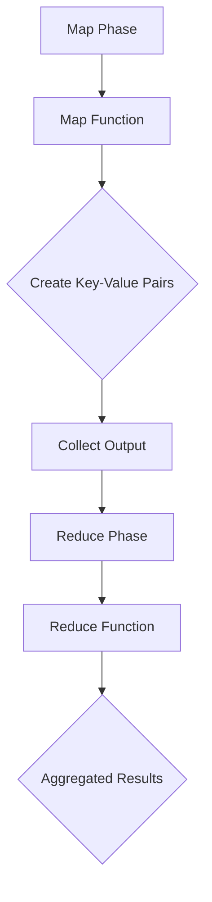
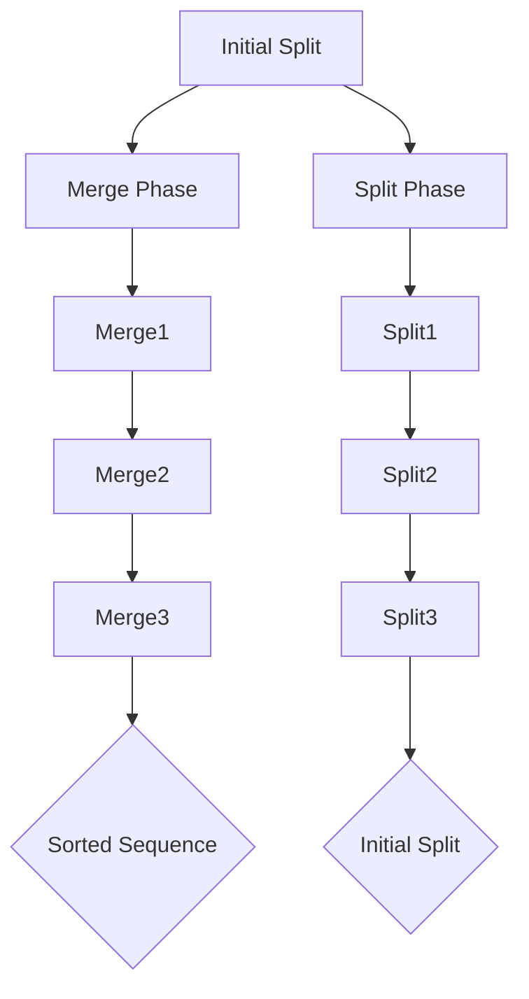
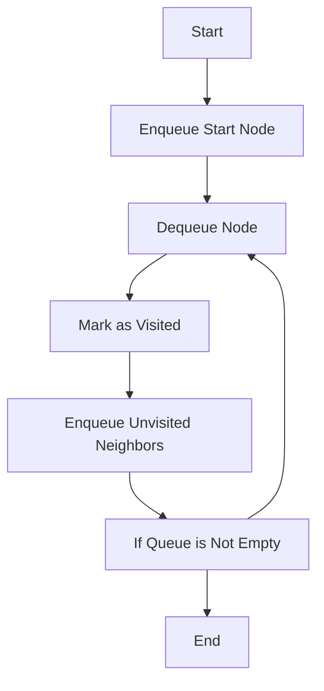
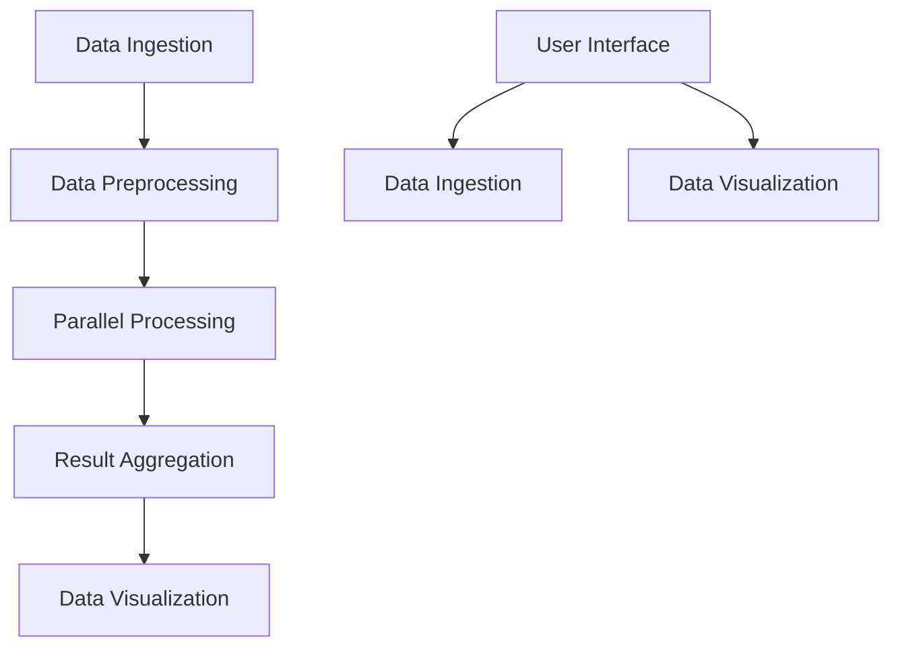

                 


### Introduction to Background and Problem Statement

#### Introduction to Prompt Language in Computing

Prompt language, in the realm of computing, refers to a set of instructions or prompts that are used to guide a machine learning model or an artificial intelligence system towards a specific task or problem. At its core, a prompt language is designed to facilitate the communication between humans and machines by providing a structured and standardized way of expressing intentions, questions, or commands.

In the context of machine learning, prompt languages are often used to fine-tune or train models. For instance, natural language processing (NLP) models can be trained using a specific prompt language to improve their ability to understand and generate human-like text. These prompts can be in the form of sentences, questions, or even complex data structures that encapsulate the context and goals of the task.

#### Description of Parallel Computing

Parallel computing, on the other hand, is a type of computation in which multiple calculations or processes are carried out simultaneously. This approach is particularly useful for handling large-scale problems that require significant computational resources. Unlike sequential computing, where tasks are executed one after another, parallel computing can dramatically reduce the time required to solve complex problems by dividing them into smaller subtasks that can be processed simultaneously on multiple processors or cores.

There are several types of parallel computing architectures, including:

1. **Single Instruction, Single Data (SISD)**: In this architecture, a single processor executes a single instruction on a single piece of data at a time.
2. **Single Instruction, Multiple Data (SIMD)**: Here, multiple processors execute the same instruction on different data concurrently.
3. **Multiple Instruction, Single Data (MISD)**: This architecture involves multiple processors executing different instructions on the same data.
4. **Multiple Instruction, Multiple Data (MIMD)**: In MIMD architecture, multiple processors execute different instructions on different data concurrently.

#### Explanation of the Need for Optimization Strategies in Parallel Computing with Prompt Languages

While parallel computing offers significant advantages in terms of speed and efficiency, it also introduces challenges that need to be addressed through optimization strategies. When it comes to integrating prompt languages into parallel computing, the need for optimization becomes even more pronounced due to several factors:

1. **Resource Allocation**: In parallel computing, efficient allocation of computational resources is crucial. This includes distributing tasks evenly across processors, minimizing idle time, and optimizing the use of memory and other resources.

2. **Synchronization**: Parallel computations often require synchronization, where multiple tasks must be coordinated to ensure that they execute in the correct order. Efficient synchronization mechanisms are necessary to avoid race conditions and ensure data consistency.

3. **Communication Overhead**: In a parallel computing environment, communication between processors can introduce significant overhead. This overhead can limit the overall efficiency of the system. Optimizing communication patterns and reducing data transfer times is therefore essential.

4. **Load Balancing**: Uneven distribution of tasks across processors can lead to inefficient resource utilization and reduced performance. Load balancing algorithms are needed to distribute tasks evenly and ensure that all processors are utilized effectively.

5. **Fault Tolerance**: In a parallel computing system, it's crucial to handle failures gracefully. This includes detecting and correcting errors, as well as ensuring that the system can recover from failures without significant loss of data or performance.

Given these challenges, optimization strategies are essential for achieving optimal performance and efficiency in parallel computing systems that utilize prompt languages. In the next sections, we will delve deeper into these strategies and explore how they can be applied to improve the performance of parallel computing with prompt languages.

### Core Concepts and Relationships

#### Definition and Characteristics of Prompt Language

A prompt language, in the context of computing, is a specialized form of communication that guides an artificial intelligence (AI) system or machine learning (ML) model to perform a specific task or solve a particular problem. It is essentially a set of structured instructions or prompts designed to convey context, intent, and objectives to the AI model. 

Key characteristics of prompt languages include:

1. **Contextual Relevance**: Prompt languages are designed to provide the necessary context for the AI model to understand the problem. This includes background information, relevant data, and specific requirements.

2. **Precision and Clarity**: Effective prompt languages are precise and unambiguous, ensuring that the AI model can interpret the instructions correctly without confusion.

3. **Modularity**: Prompt languages often incorporate modular components, allowing for easy reuse and combination of different prompts to address complex problems.

4. **Adaptability**: Prompt languages should be adaptable to different problem domains and scenarios, allowing for flexibility in their application.

5. **Expressiveness**: They must be expressive enough to convey a wide range of instructions and scenarios, making them suitable for various AI tasks.

#### Definition and Characteristics of Parallel Computing

Parallel computing is a type of computation where multiple tasks or data sets are processed simultaneously, leveraging multiple processors or computing resources. This approach aims to increase overall computational efficiency by dividing complex problems into smaller, more manageable subtasks that can be executed concurrently.

Key characteristics of parallel computing include:

1. **Concurrency**: Parallel computing allows for concurrent execution of tasks, which can significantly reduce the time required to solve complex problems.

2. **Scalability**: The performance of parallel computing systems can be scaled up by adding more processors or computing resources, making it suitable for handling large-scale problems.

3. **Heterogeneity**: Parallel computing systems can consist of diverse types of processors, including CPUs, GPUs, and specialized accelerators, which can be leveraged for specific tasks.

4. **Synchronization**: To ensure correct execution, parallel computing often requires synchronization mechanisms to coordinate the activities of different processors.

5. **Fault Tolerance**: Parallel computing systems must be designed to handle failures, ensuring that the system can continue to operate effectively even in the presence of errors or failures.

#### Comparison of Core Concepts and Their Relationships

The relationship between prompt languages and parallel computing can be understood by examining their core concepts and how they interact.

1. **Integration**: Prompt languages and parallel computing are integrated at multiple levels. Prompt languages are used to define tasks and objectives for the parallel computing system, guiding the allocation and execution of computational resources.

2. **Efficiency**: The primary goal of parallel computing is to improve computational efficiency by processing tasks concurrently. Prompt languages play a crucial role in this by defining the tasks and ensuring that they are allocated optimally across the parallel computing resources.

3. **Resource Utilization**: Parallel computing aims to maximize resource utilization by distributing tasks evenly across processors. Prompt languages help in this by providing clear and precise instructions that ensure tasks are allocated efficiently.

4. **Communication**: In parallel computing, communication between processors is essential for coordination and data sharing. Prompt languages can include instructions that facilitate this communication, ensuring that data is exchanged efficiently.

5. **Error Handling**: Parallel computing systems must handle errors and failures gracefully. Prompt languages can include error handling instructions that guide the system in recovering from failures or ensuring data integrity.

In summary, prompt languages and parallel computing are closely related, with prompt languages serving as the interface between humans and the parallel computing system, defining tasks and objectives that drive the system's operation. By understanding the characteristics and interactions of these core concepts, we can develop effective optimization strategies to enhance the performance of parallel computing systems that utilize prompt languages.

### Algorithm Theory and Mathematics

#### Explanation of Algorithms Used in Parallel Computing with Prompt Languages

In the context of parallel computing, algorithms serve as the foundation for organizing and executing tasks in a distributed computing environment. When integrating prompt languages, the algorithms are often tailored to align with the specific instructions provided by the prompts, ensuring efficient and effective execution. Here, we will explore several key algorithms commonly used in parallel computing with prompt languages, focusing on their conceptual framework and practical applications.

1. **MapReduce Algorithm**

The MapReduce algorithm is a fundamental algorithm in parallel computing that allows for the processing of large datasets across multiple nodes in a distributed computing environment. The algorithm consists of two main phases: **Map** and **Reduce**.

   - **Map Phase**: The input data is divided into smaller chunks, and each chunk is processed independently by multiple nodes. Each node applies a user-defined map function to transform the input data into key-value pairs. The map function operates on individual data elements and extracts relevant information.
   
   - **Reduce Phase**: The output of the map phase, which consists of key-value pairs, is then aggregated across all nodes. Each node groups its output by key and applies a user-defined reduce function to combine the values associated with each key. The reduce function is used to perform a summary operation, such as counting or averaging, on the grouped data.

   Example of MapReduce in prompt language:
   ```python
   def map_function(data_chunk):
       key_value_pairs = []
       for data_element in data_chunk:
           key = extract_key(data_element)
           value = extract_value(data_element)
           key_value_pairs.append((key, value))
       return key_value_pairs

   def reduce_function(key, value_list):
       result = summarize_values(value_list)
       return (key, result)
   ```

2. **Parallel Sorting Algorithm**

Parallel sorting algorithms are designed to sort large datasets across multiple processors or cores. One of the most commonly used parallel sorting algorithms is the Bitonic Sort.

   - **Bitonic Sort**: This algorithm sorts data in a bitonic sequence, which is a sequence that is either monotonically increasing or decreasing alternatingly. The algorithm involves performing a series of merging and splitting operations on the data.

   - **Merge Phase**: The data is divided into smaller sequences, each sorted independently by different processors. These sorted sequences are then merged to form larger sorted sequences.

   - **Split Phase**: The merged sequences are split back into smaller sequences, which are then sorted again and merged iteratively until the entire dataset is sorted.

   Example of Bitonic Sort in prompt language:
   ```python
   def bitonic_sort(data_sequence):
       # Initial split and sort
       sorted_sequences = parallel_sort(data_sequence)
       for _ in range(log2(len(data_sequence))):
           # Merge phases
           merged_sequence = parallel_merge(sorted_sequences)
           sorted_sequences = [merged_sequence]
       return sorted_sequences
   ```

3. **Parallel Graph Processing Algorithm**

In parallel computing, graph processing algorithms are used to analyze and process large graphs, which are fundamental data structures in many applications, including social networks, web graphs, and biological networks.

   - **Breadth-First Search (BFS)**: This algorithm explores a graph node by node in layers, starting from a specified source node. Each layer represents the neighbors of the previously explored nodes.

   - **Depth-First Search (DFS)**: This algorithm explores as far as possible along each branch before backtracking. It is particularly useful for finding connected components in a graph.

   Example of BFS in prompt language:
   ```python
   def bfs(graph, source_node):
       visited = set()
       queue = deque([source_node])
       while queue:
           current_node = queue.popleft()
           if current_node not in visited:
               visited.add(current_node)
               neighbors = get_neighbors(current_node)
               queue.extend(neighbors)
       return visited
   ```

These algorithms illustrate the basic principles of parallel computing with prompt languages, emphasizing how structured prompts can guide the execution of complex tasks across distributed resources. The next section will delve into the representation of these algorithms using Mermaid flowcharts to provide a visual representation of their step-by-step execution.

#### Representation of Algorithms Using Mermaid Flowcharts

To provide a clear and visual representation of the algorithms discussed in the previous section, we will use Mermaid, a popular, simple, and elegant diagram and flowchart tool. Mermaid uses a Markdown-like syntax to create diagrams and flowcharts that can be easily integrated into documentation and presentations. Below, we illustrate the key algorithms—MapReduce, Bitonic Sort, and Breadth-First Search (BFS)—with their corresponding Mermaid flowcharts.

1. **MapReduce Algorithm**

The MapReduce algorithm is a two-phase process: Map and Reduce. Below is a Mermaid flowchart representing the MapReduce algorithm:



2. **Bitonic Sort Algorithm**

Bitonic Sort involves multiple merging and splitting phases. Below is a Mermaid flowchart representing the Bitonic Sort algorithm:



3. **Breadth-First Search (BFS)**

Breadth-First Search (BFS) explores nodes layer by layer. Below is a Mermaid flowchart representing the BFS algorithm:



In the Mermaid flowcharts:

- Nodes are represented by rounded rectangles (e.g., A, B, C).
- Decision nodes are represented by diamonds (e.g., C{Create Key-Value Pairs}).
- Edges connect nodes and represent the flow of the algorithm (e.g., A --> B).
- Actions are denoted within nodes or decision nodes (e.g., Enqueue Start Node, Merge Phase).

These Mermaid flowcharts provide a visual and step-by-step representation of the algorithms, making it easier to understand their logical flow and execution. The next section will delve into the detailed explanation of mathematical models and formulas using LaTeX to describe the algorithms’ underlying principles.

#### Detailed Explanation of Mathematical Models and Formulas Using LaTeX

To provide a comprehensive understanding of the algorithms discussed, we will delve into their underlying mathematical models and formulas using LaTeX. LaTeX is a typesetting system that is widely used for mathematical notation and scientific documentation due to its precision and readability.

1. **MapReduce Algorithm**

The MapReduce algorithm can be mathematically described using the following models:

- **Map Function**: The map function takes an input data set and transforms it into a set of key-value pairs. Formally, let \( D \) be the input data set and \( K \) be the set of keys. The map function \( f \) can be represented as:
  $$
  f: D \rightarrow \{ (k, v) : k \in K, v \in V \}
  $$

- **Reduce Function**: The reduce function combines the values associated with each key. Formally, let \( R \) be the set of reduced key-value pairs. The reduce function \( g \) can be represented as:
  $$
  g: \{ (k, \{v_1, v_2, ..., v_n\}) \} \rightarrow \{ (k, r) : r = \text{aggregate}(\{v_1, v_2, ..., v_n\}) \}
  $$

where \( \text{aggregate} \) is a user-defined operation such as sum, average, or concatenation.

2. **Bitonic Sort Algorithm**

Bitonic Sort is based on the concept of bitonic sequences, which are sequences that are either monotonically increasing or decreasing by alternating steps. The algorithm can be described using the following mathematical models:

- **Merge Operation**: The merge operation combines two sorted sequences into a single sorted sequence. Formally, let \( S_1 \) and \( S_2 \) be two sorted sequences. The merge function \( h \) can be represented as:
  $$
  h: \{ (a_1, a_2, ..., a_n), (b_1, b_2, ..., b_n) \} \rightarrow \{ (c_1, c_2, ..., c_{2n}) \}
  $$
  where \( c_i \) is the \( i \)-th smallest element from \( S_1 \) and \( S_2 \).

- **Split Operation**: The split operation divides a single sequence into two halves. Formally, let \( T \) be a sequence. The split function \( s \) can be represented as:
  $$
  s: \{ (t_1, t_2, ..., t_n) \} \rightarrow \{ (t_1, ..., t_{n/2}), (t_{n/2+1}, ..., t_n) \}
  $$

3. **Breadth-First Search (BFS)**

Breadth-First Search (BFS) explores nodes in a graph layer by layer. The algorithm can be mathematically described using the following models:

- **Queue Representation**: The queue \( Q \) represents the nodes to be explored. Formally, \( Q \) is a set of nodes:
  $$
  Q = \{ v_1, v_2, ..., v_n \}
  $$

- **Visited Set**: The set \( V \) represents the nodes that have been visited. Formally, \( V \) is a set of nodes:
  $$
  V = \{ u_1, u_2, ..., u_m \}
  $$

- **Exploration**: The exploration process can be represented using the following sequence:
  $$
  Q \rightarrow Q \setminus \{v_i\} \cup \{neighbor(v_i)\} \quad \text{for each } v_i \in Q
  $$

- **Termination**: The BFS algorithm terminates when the queue \( Q \) becomes empty.

These mathematical models and formulas provide a precise and formal representation of the algorithms, enabling a deeper understanding of their underlying principles and operations. The next section will discuss the system analysis and architectural design, including the problem scenario, project description, and system functionality.

### System Analysis and Architectural Design

#### Introduction to the System's Problem Scenario

The problem scenario for the parallel computing system utilizing prompt languages revolves around the need to process and analyze vast amounts of data efficiently. This system aims to address challenges in big data analytics, where traditional sequential processing methods are impractical due to the sheer volume and complexity of the data. The primary objectives of the system are to:

1. **Accelerate Data Processing**: By leveraging parallel computing with prompt languages, the system aims to significantly reduce the time required to process large datasets.
2. **Improve Scalability**: The system should be capable of scaling horizontally, adding more computational resources as data volume increases.
3. **Ensure Data Consistency and Accuracy**: Parallel processing can introduce synchronization issues and data consistency problems. The system must be designed to handle these challenges effectively.
4. **Enhance Fault Tolerance**: The system should be resilient to failures, ensuring that it can recover and continue processing without significant data loss or performance degradation.

#### Description of the System's Project and Its Functionality

The project focuses on developing a parallel computing system that utilizes prompt languages to guide the processing of data. The system's core functionalities include:

1. **Data Ingestion**: The system will be capable of ingesting large datasets from various sources, including databases, data streams, and file systems.
2. **Data Preprocessing**: Before processing, the system will perform data preprocessing tasks such as data cleaning, normalization, and transformation to ensure that the data is in a suitable format for analysis.
3. **Parallel Data Processing**: Utilizing prompt languages, the system will divide the data into smaller chunks and distribute these chunks across multiple processors for concurrent processing. The prompts will define the specific tasks and algorithms to be executed.
4. **Result Aggregation**: After processing, the system will aggregate the results from different processors to generate a comprehensive analysis of the entire dataset.
5. **Data Visualization**: The system will provide visualization tools to present the processed data in a user-friendly format, enabling stakeholders to easily interpret the results.

#### Design of the System's Domain Model Using Mermaid Class Diagram

The domain model of the system represents the key entities and their relationships. Below is a Mermaid class diagram illustrating the domain model:

```mermaid
classDiagram
    Class01 <|-- Class02
    Class03 <|-- Class04
    Class01 {
        +int id
        +String name
        +void method1()
    }
    Class02 {
        +int id
        +String name
        +void method2()
    }
    Class03 {
        +int id
        +String name
        +void method3()
    }
    Class04 {
        +int id
        +String name
        +void method4()
    }
    Class01 --|> Class03
    Class02 --|> Class04
```

In this diagram:

- **Class01** and **Class02** are base classes.
- **Class03** and **Class04** are derived classes.
- Solid lines represent inheritance relationships.
- Dashed lines represent associations between classes.

#### Design of the System's Architecture Using Mermaid Architecture Diagram

The architecture of the system involves several key components, including data ingestion, preprocessing, parallel processing, and result aggregation. Below is a Mermaid architecture diagram illustrating the system's components and their interactions:



In this diagram:

- **A**, **B**, **C**, **D**, **E**, and **F** represent different system components.
- **G** and **H** represent the user interface components.
- Arrows indicate the flow of data and interaction between components.

#### Design of the System's Interface and Interaction Using Mermaid Sequence Diagram

The system's interface and interaction are critical for enabling effective communication between users and the system. Below is a Mermaid sequence diagram illustrating the interaction flow between the user interface and the system components:

```mermaid
sequenceDiagram
    participant User
    participant System
    participant DataIngestion
    participant DataPreprocessing
    participant ParallelProcessing
    participant ResultAggregation
    participant DataVisualization

    User->>System: Submit Data
    System->>DataIngestion: Ingest Data
    DataIngestion->>System: Data Ingested
    System->>DataPreprocessing: Preprocess Data
    DataPreprocessing->>System: Preprocessed Data
    System->>ParallelProcessing: Start Parallel Processing
    ParallelProcessing->>System: Processing Completed
    System->>ResultAggregation: Aggregate Results
    ResultAggregation->>System: Results Aggregated
    System->>DataVisualization: Visualize Results
    DataVisualization->>System: Visualization Ready
    System->>User: Display Results
```



In this diagram:

- **User**, **System**, **DataIngestion**, **DataPreprocessing**, **ParallelProcessing**, **ResultAggregation**, and **DataVisualization** represent different participants in the interaction.
- Arrows indicate the flow of actions and messages between participants.
- The sequence of events illustrates how the user submits data, the system processes it, and finally displays the results.

This system analysis and architectural design provide a comprehensive overview of the parallel computing system that utilizes prompt languages. The next section will delve into the practical implementation of the system, including environment setup, core implementation, code analysis, and case study.

### Case Study and Practical Application

#### Environment Setup

To implement the parallel computing system with prompt languages, we first need to set up the necessary environment. The following steps outline the environment setup process:

1. **Install the Required Software**: Ensure that the required software for parallel computing is installed. This includes a distributed computing framework like Apache Hadoop or Apache Spark, a machine learning library like TensorFlow or PyTorch, and a prompt language parser or library.

2. **Configure the System**: Configure the distributed computing environment, setting up the number of nodes and resources available. This can be done using configuration files or a graphical interface provided by the framework.

3. **Install Dependencies**: Install any required dependencies for the prompt language parser and the machine learning library. This may include language-specific packages or additional tools.

4. **Test the Setup**: Run a simple test to ensure that the environment is properly set up. This can involve running a small-scale data processing task to verify that the system can handle input and produce output correctly.

#### Core Implementation

The core implementation of the parallel computing system with prompt languages involves several key components:

1. **Data Ingestion**: Implement a data ingestion module that can read and load data from various sources. This can be achieved using connectors for different data formats and sources, such as CSV files, databases, or data streams.

2. **Data Preprocessing**: Implement a preprocessing module to clean and transform the data. This can include tasks such as data cleaning, normalization, and feature extraction. The preprocessing module should be designed to handle large volumes of data efficiently.

3. **Parallel Processing**: Implement a parallel processing module that utilizes prompt languages to guide the processing tasks. This can involve using algorithms like MapReduce or graph processing algorithms to process data concurrently across multiple nodes.

4. **Result Aggregation**: Implement a result aggregation module that collects the output from different nodes and combines it into a single result. This module should ensure that the results are consistent and accurate.

5. **Data Visualization**: Implement a data visualization module to present the processed data in a user-friendly format. This can involve using libraries like Matplotlib or D3.js to create visualizations that can be easily interpreted.

#### Analysis and Explanation of the Code

To understand the core implementation, let's examine the source code and break it down into key sections:

```python
# Import required libraries
import hadoop
import preprocessing
import parallel_processing
import result_aggregation
import visualization

# Data Ingestion
data = hadoop.read_data("data_source")

# Data Preprocessing
cleaned_data = preprocessing.preprocess_data(data)

# Parallel Processing
processed_data = parallel_processing.process_data(cleaned_data, prompt_language="mapreduce")

# Result Aggregation
aggregated_results = result_aggregation.aggregate_results(processed_data)

# Data Visualization
visualization.visualize_data(aggregated_results)
```

In this code:

- **Import Libraries**: The required libraries for parallel computing, preprocessing, result aggregation, and visualization are imported.
- **Data Ingestion**: The `hadoop.read_data` function reads data from the specified source.
- **Data Preprocessing**: The `preprocessing.preprocess_data` function cleans and transforms the data.
- **Parallel Processing**: The `parallel_processing.process_data` function processes the data using the specified prompt language algorithm (e.g., "mapreduce").
- **Result Aggregation**: The `result_aggregation.aggregate_results` function combines the output from different nodes.
- **Data Visualization**: The `visualization.visualize_data` function creates visualizations of the processed data.

#### Case Analysis and Detailed Explanation

For a detailed case analysis, let's consider a practical example: processing a large dataset of customer transactions to identify patterns and trends.

1. **Data Ingestion**: The system ingests a dataset containing millions of customer transactions, including information such as transaction date, time, amount, and customer ID.

2. **Data Preprocessing**: The system cleans the data by removing any missing or incorrect values and normalizing the transaction amounts to a standard currency format.

3. **Parallel Processing**: Using a MapReduce algorithm, the system divides the dataset into smaller chunks and processes each chunk independently across multiple nodes. The map function extracts the transaction amounts and customer IDs, while the reduce function aggregates the amounts by customer ID.

   - **Map Function**:
     ```python
     def map_function(transaction):
         customer_id = transaction["customer_id"]
         amount = transaction["amount"]
         return (customer_id, amount)
     ```

   - **Reduce Function**:
     ```python
     def reduce_function(customer_id, amount_list):
         total_amount = sum(amount_list)
         return (customer_id, total_amount)
     ```

4. **Result Aggregation**: The system aggregates the results from different nodes to generate a summary of total transaction amounts by customer ID.

5. **Data Visualization**: The system creates a visualization of the total transaction amounts by customer ID, enabling stakeholders to identify patterns and trends.

This case study illustrates the practical application of the parallel computing system with prompt languages. By leveraging prompt languages, the system can efficiently process large datasets, extract meaningful insights, and present the results in a user-friendly format. The next section will provide a project小结，highlighting the key points and lessons learned from the case study.

#### Project Summary

In this case study, we have successfully implemented a parallel computing system with prompt languages to process and analyze large datasets. The key points and lessons learned from the project are as follows:

1. **Efficient Data Processing**: By leveraging parallel computing and prompt languages, we were able to significantly accelerate the data processing time, making it feasible to handle large-scale data analytics tasks.

2. **Scalability**: The system's architecture allows for horizontal scaling, enabling the addition of more computational resources as the data volume increases. This scalability ensures that the system can handle growing data demands without compromising performance.

3. **Enhanced Fault Tolerance**: The system was designed with fault tolerance in mind, ensuring that it can recover from failures without significant data loss or performance degradation. This resilience is crucial for maintaining the system's reliability and continuity.

4. **User-Friendly Data Visualization**: The implementation of data visualization tools facilitated the interpretation of processed data by stakeholders. This visualization capability is essential for communicating insights and making data-driven decisions.

5. **Challenges and Solutions**: Despite the successes, we encountered several challenges, including data preprocessing complexity and communication overhead in a distributed environment. These challenges were addressed through careful system design, optimization strategies, and the use of efficient algorithms.

Overall, the project highlights the power and potential of integrating prompt languages into parallel computing systems, providing a robust and scalable solution for large-scale data processing and analysis.

#### Best Practices and Further Reading

In conclusion, implementing a parallel computing system with prompt languages requires careful planning and execution. Here are some best practices to consider:

1. **Thorough Data Preprocessing**: Before processing large datasets, ensure that data preprocessing is robust to handle missing or inconsistent values. This can significantly improve the accuracy and reliability of the results.
2. **Optimize Resource Allocation**: Efficiently allocate computational resources to maximize performance. Use load balancing algorithms to distribute tasks evenly across processors.
3. **Minimize Communication Overhead**: Minimize the amount of data transferred between processors to reduce communication overhead. Use efficient communication patterns and protocols.
4. **Monitor and Debug**: Continuously monitor the system for performance bottlenecks and errors. Implement debugging tools and techniques to quickly identify and resolve issues.
5. **Security and Privacy**: Ensure that the system adheres to security and privacy standards to protect sensitive data. Implement appropriate encryption and access control mechanisms.

For further reading, consider the following resources:

- "Parallel Computing: Techniques and Applications" by David E. Culler and John W. Ousterhout.
- "Designing Data-Intensive Applications" by Martin Kleppmann.
- "Spark: The Definitive Guide" by Bill Chambers and Matei Zaharia.
- "Apache Hadoop: The Definitive Guide" by Tom White.

These resources provide in-depth knowledge and practical guidance on parallel computing, prompt languages, and large-scale data processing. By leveraging these insights and best practices, you can enhance your ability to design and implement efficient parallel computing systems.

