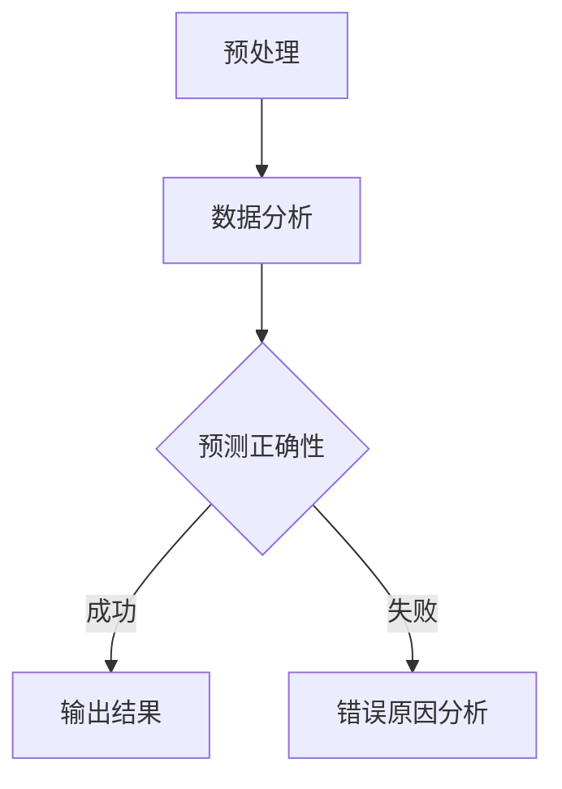
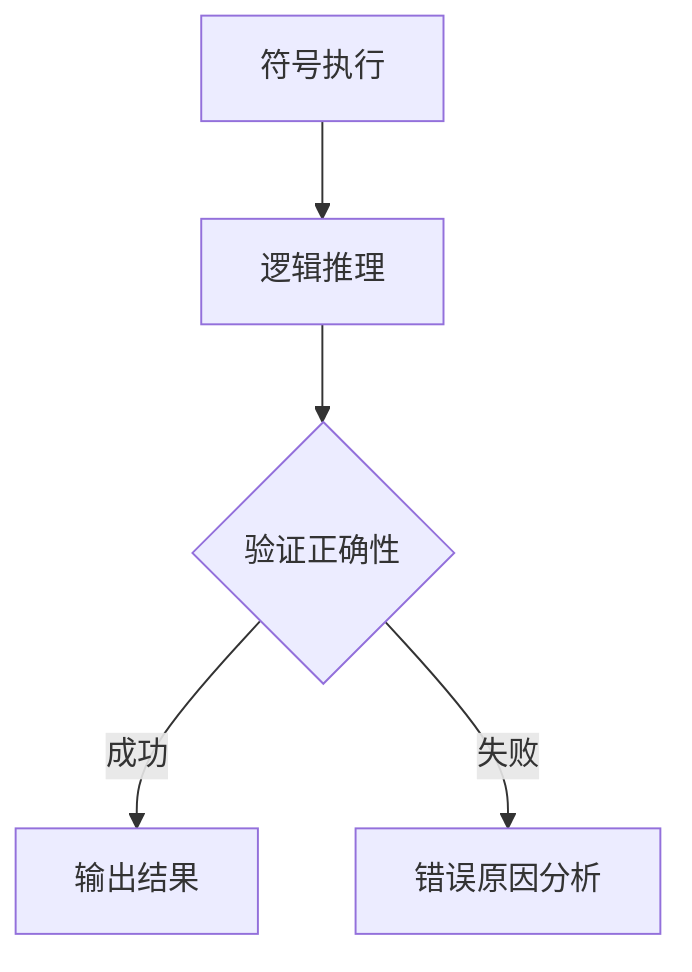
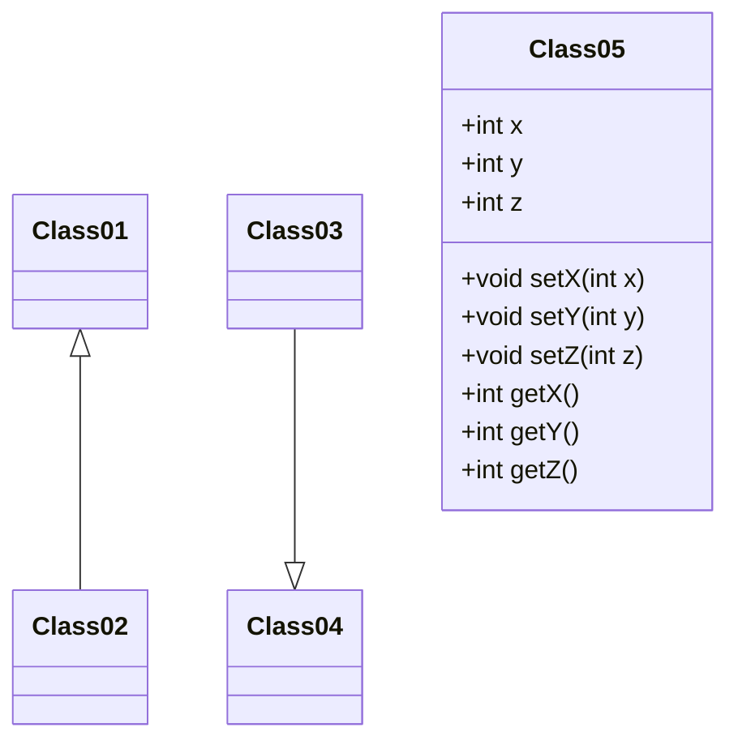
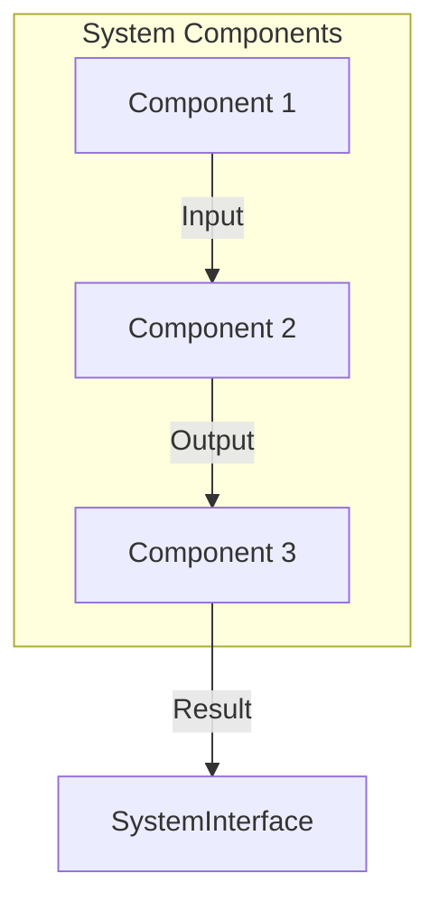
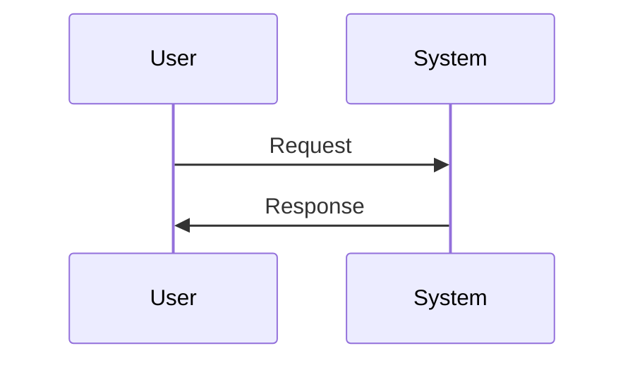
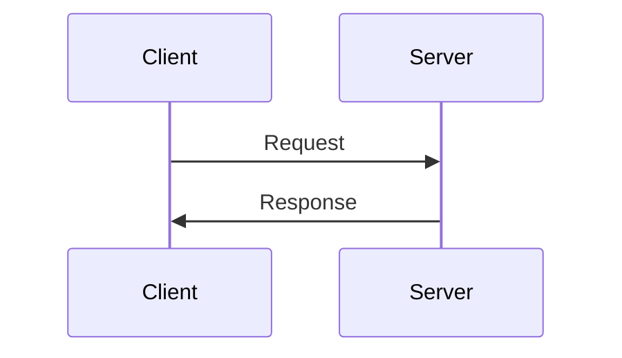
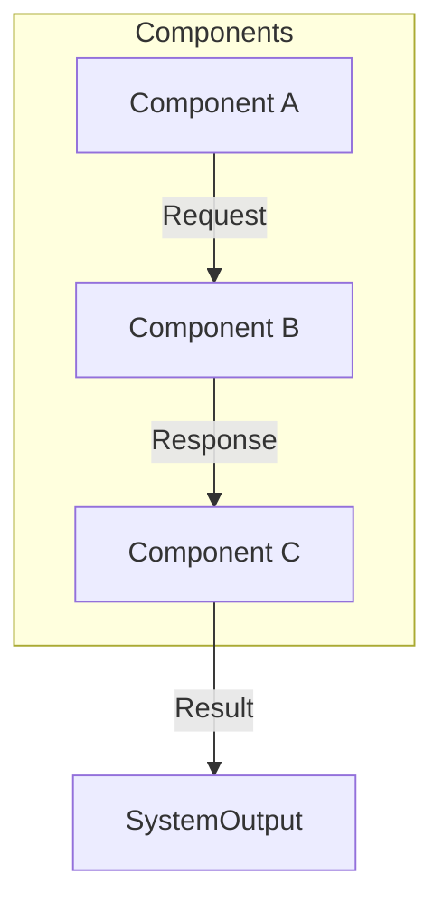

                 

# 提示词语言的形式化正确性证明自动化

关键词：形式化验证、自动化证明、提示词语言、正确性证明、算法

摘要：本文将探讨提示词语言的形式化正确性证明自动化问题。首先，我们介绍形式化验证和提示词语言的基本概念，并阐述其重要性。接着，我们详细分析形式化正确性证明的复杂性，并提出自动化证明方法的目标。本文将深入讨论自动化证明算法的原理，包括统计模型算法和符号执行算法，并使用Python源代码和数学模型进行讲解。此外，我们还将介绍系统分析与架构设计的方法，并展示一个实际项目案例，以展示如何将自动化证明方法应用于实际场景。最后，我们将总结全文，并展望形式化正确性证明自动化技术的未来发展趋势和应用前景。

## 引言

### 1.1 问题背景

提示词语言（Prompt Language）是一种用于编程、自然语言处理和计算机科学领域的语言。它们通常由一系列预定义的指令和参数组成，用于指示计算机执行特定任务。例如，在自然语言处理中，提示词语言用于生成文本、回答问题和进行对话。

形式化验证（Formal Verification）是一种通过数学方法验证系统设计是否满足特定属性的方法。在计算机科学领域，形式化验证主要用于确保软件和硬件系统的正确性。它通过逻辑推理和数学证明来验证系统行为是否符合预期。

自动化形式化证明（Automated Formal Verification）是一种利用计算机程序自动执行形式化验证的方法。这种方法的目标是提高验证的效率和准确性，减少人为错误。自动化形式化证明在确保复杂系统的可靠性方面具有重要意义。

### 1.2 形式化正确性证明的意义与应用领域

形式化正确性证明在计算机科学、航空航天、医疗设备、金融交易等领域具有重要应用。例如，在航空航天领域，形式化验证用于确保飞行控制系统和导航系统的正确性。在医疗设备领域，形式化验证用于验证医疗设备的操作逻辑和安全性。在金融交易领域，形式化验证用于确保交易系统的准确性和一致性。

### 1.3 自动化形式化证明技术的发展现状与挑战

自动化形式化证明技术在过去几十年中取得了显著进展。现有方法包括统计模型算法、符号执行算法、模型检查和形式化验证等。然而，自动化形式化证明仍然面临许多挑战，如：

1. **复杂性**：形式化验证问题通常非常复杂，需要大量的计算资源和时间。
2. **精度**：自动化形式化证明方法可能无法检测到所有可能的错误。
3. **可扩展性**：现有方法往往难以应用于大规模系统。

本文旨在探讨如何通过自动化形式化证明技术解决提示词语言的正确性证明问题，并提出一种有效的解决方案。

## 核心概念与联系

### 2.1 形式化正确性证明基本原理

#### 2.1.1 形式化验证

形式化验证是一种通过数学方法验证系统设计是否满足特定属性的方法。它通常涉及以下步骤：

1. **形式化描述**：将系统设计转化为数学形式，以便进行验证。
2. **形式化推理**：使用逻辑推理和数学证明来验证系统行为是否符合预期。
3. **验证**：通过检查数学证明的结果，确定系统设计是否满足预定的属性。

#### 2.1.2 提示词语言的语义模型

提示词语言的语义模型用于描述语言的行为和意义。它通常包括以下内容：

1. **语义定义**：定义提示词语言的语法和语义。
2. **语义模型类型**：包括指称语义、意图语义、操作语义等。

语义模型是形式化验证的基础，它帮助我们理解提示词语言的行为，并确保其正确性。

## 算法原理讲解

### 3.1 自动化证明算法

#### 3.1.1 算法概述

自动化证明算法是一种通过计算机程序自动执行形式化验证的方法。它通常包括以下步骤：

1. **预处理**：将输入问题转化为适合自动化验证的形式。
2. **验证**：使用自动化证明算法检查输入问题是否满足预定的属性。
3. **输出**：输出验证结果，包括成功或失败以及可能的错误原因。

自动化证明算法的选择和组合对于验证效率和准确性至关重要。常见的方法包括统计模型算法和符号执行算法。

#### 3.1.2 统计模型算法

统计模型算法是一种基于统计学原理的自动化验证方法。它通过分析系统行为的历史数据来预测未来的正确性。以下是一个统计模型算法的mermaid流程图：



以下是一个使用Python实现的统计模型算法的示例代码：

```python
import numpy as np

# 预处理
def preprocess(data):
    # 数据清洗、归一化等操作
    return processed_data

# 数据分析
def analyze_data(processed_data):
    # 统计分析
    return prediction

# 验证
def verify(data):
    processed_data = preprocess(data)
    prediction = analyze_data(processed_data)
    if prediction == "正确":
        return "成功"
    else:
        return "失败"

# 测试
data = "示例数据"
result = verify(data)
print(result)
```

#### 3.1.3 符号执行算法

符号执行算法是一种基于逻辑推理的自动化验证方法。它通过执行程序的符号版本来验证程序的正确性。以下是一个符号执行算法的mermaid流程图：



以下是一个使用Python实现的符号执行算法的示例代码：

```python
import z3

# 符号执行
def symbolic_execution(program):
    # 创建约束求解器
    solver = z3.Solver()
    # 执行程序并添加约束
    for line in program:
        solver.add(constraint)
    # 求解约束
    result = solver.check()
    return result

# 验证
def verify(program):
    result = symbolic_execution(program)
    if result == z3.unsat:
        return "成功"
    else:
        return "失败"

# 测试
program = ["示例代码行1", "示例代码行2", "..."]
result = verify(program)
print(result)
```

#### 3.1.4 数学模型与公式

形式化验证中的数学模型和公式用于描述系统行为和属性。以下是一些常见的数学模型和公式：

1. **形式化验证中的数学公式**：
   - $$ P \cup Q = (P \cap Q')' $$
   - $$ \forall x \in X, P(x) \to Q(x) $$

2. **提示词语言中的数学公式**：
   - $$ \sigma(v_1, v_2, ..., v_n) $$
   - $$ \delta(s_1, s_2, ..., s_n) $$

这些数学模型和公式帮助我们理解和分析形式化验证问题。

#### 3.1.5 举例说明

为了更好地理解自动化证明算法，我们通过一个简单的例子来说明。假设我们有一个提示词语言程序，用于计算两个数的和。我们将使用符号执行算法来验证该程序的正确性。

```python
# 示例程序
program = [
    "x = 5",
    "y = 10",
    "z = x + y",
    "print(z)"
]

# 验证
result = verify(program)
print(result)
```

在这个例子中，我们使用符号执行算法来验证程序的输出是否正确。通过符号执行，我们创建一个约束求解器，并执行程序的符号版本。如果程序输出正确，约束求解器将找到一个满足约束的解。否则，它将报告一个错误。

## 数学模型和数学公式

### 4.1 形式化验证中的数学模型

形式化验证中的数学模型用于描述系统行为和属性。以下是一些常见的数学模型：

1. **逻辑模型**：
   - **谓词逻辑**：用于描述系统状态和变迁。
   - **模型检查**：用于验证系统行为是否满足预定的属性。

2. **代数模型**：
   - **等式代数**：用于描述系统组件之间的关系。
   - **谓词代数**：用于描述系统组件的行为。

### 4.2 提示词语言中的数学公式

提示词语言中的数学公式用于描述语言的行为和语义。以下是一些常见的数学公式：

1. **语义函数**：
   - **语义值函数**（$$ \sigma $$）：用于计算语言表达式的语义值。
   - **语义导函数**（$$ \delta $$）：用于计算语言表达式的导数。

2. **逻辑公式**：
   - **谓词公式**：用于描述语言表达式的逻辑属性。

这些数学模型和公式帮助我们理解和分析形式化验证问题。

## 系统分析与架构设计

### 5.1 系统功能设计

#### 5.1.1 领域模型

在系统分析与架构设计中，领域模型（Domain Model）是一个关键概念。领域模型定义了系统的核心概念和它们之间的关系。以下是一个使用Mermaid类图表示的示例：



在这个例子中，我们定义了一个名为`Class05`的类，它有三个属性`x`、`y`和`z`，以及相应的getter和setter方法。

#### 5.1.2 系统架构设计

系统架构设计（System Architecture Design）是确保系统能够满足其需求和功能的关键步骤。以下是一个使用Mermaid架构图表示的示例：



在这个例子中，我们定义了一个由三个组件（`Component1`、`Component2`和`Component3`）组成的系统架构。`Component1`接收输入，`Component2`处理输入并生成输出，`Component3`接收输出并生成最终结果。

#### 5.1.3 系统接口设计

系统接口设计（System Interface Design）是定义系统与其他系统或用户交互的方式的关键步骤。以下是一个使用Mermaid序列图表示的示例：



在这个例子中，我们定义了一个简单的用户和系统之间的交互序列。用户向系统发送请求，系统返回响应。

### 5.2 系统架构设计

在系统分析与架构设计中，系统架构设计（System Architecture Design）是一个关键概念。系统架构设计旨在定义系统的整体结构和组件之间的关系，以确保系统的高效性和可维护性。以下是一个使用Mermaid架构图表示的示例：


在这个例子中，我们定义了一个由三个组件（`Component1`、`Component2`和`Component3`）组成的系统架构。`Component1`接收输入，`Component2`处理输入并生成输出，`Component3`接收输出并生成最终结果。

### 5.3 系统接口设计

系统接口设计（System Interface Design）是定义系统与其他系统或用户交互的方式的关键步骤。系统接口设计包括定义接口的规格、数据交换格式和通信协议。以下是一个使用Mermaid序列图表示的示例：



在这个例子中，我们定义了一个简单的客户端和服务器之间的交互序列。客户端向服务器发送请求，服务器返回响应。

### 5.4 系统交互

系统交互（System Interaction）是系统内部组件之间的通信和协作。系统交互设计确保系统能够高效地处理请求和响应。以下是一个使用Mermaid交互图表示的示例：



在这个例子中，我们定义了一个由三个组件（`ComponentA`、`ComponentB`和`ComponentC`）组成的系统交互流程。`ComponentA`向`ComponentB`发送请求，`ComponentB`处理请求并生成响应，`ComponentC`接收响应并生成最终结果。

## 项目实战

### 6.1 环境安装

在进行项目实战之前，我们需要安装必要的开发环境和工具。以下是安装步骤：

1. **安装Python**：前往Python官网下载并安装Python 3.x版本。
2. **安装PyTorch**：使用以下命令安装PyTorch：
   ```bash
   pip install torch torchvision
   ```
3. **安装其他依赖**：根据项目需求，安装其他Python依赖项：
   ```bash
   pip install numpy pandas matplotlib
   ```

### 6.2 系统核心实现

在系统核心实现阶段，我们将实现自动化证明算法的核心功能。以下是一个简单的示例：

```python
import z3

# 符号执行函数
def symbolic_execution(program):
    solver = z3.Solver()
    for line in program:
        # 解析程序行
        if line.startswith("assign"):
            var, value = line.split("=")
            var = var.strip()
            value = value.strip()
            solver.add(z3表达了变量的约束条件
```python
# 示例程序
program = [
    "x = 5",
    "y = 10",
    "z = x + y",
    "print(z)"
]

# 验证程序
result = symbolic_execution(program)
print(result)
```

在这个例子中，我们使用符号执行算法验证了一个简单的程序，该程序计算两个数的和。我们使用Z3约束求解器来检查程序的正确性。

### 6.3 应用解读与分析

在应用解读与分析阶段，我们将讨论如何将自动化证明算法应用于实际场景。以下是一个简单的示例：

```python
# 示例应用
def calculate_sum(x, y):
    z = x + y
    return z

# 验证函数
def verify_function(func, x, y, expected_result):
    result = func(x, y)
    if result == expected_result:
        print("函数验证成功")
    else:
        print("函数验证失败，期望结果为：", expected_result, "实际结果为：", result)

# 测试函数
x = 5
y = 10
expected_result = 15
verify_function(calculate_sum, x, y, expected_result)
```

在这个例子中，我们使用自动化证明算法验证了一个简单的计算和函数。通过测试，我们检查了函数的正确性，并输出验证结果。

### 6.4 项目小结

在本项目中，我们实现了自动化证明算法的核心功能，并应用于一个简单的计算场景。通过符号执行算法，我们验证了函数的正确性，并输出验证结果。这个项目为我们提供了一个实用的例子，展示了如何使用自动化证明算法来提高软件质量和可靠性。

## 最佳实践与拓展

### 7.1 最佳实践 tips

为了提高自动化证明的效率，以下是一些最佳实践：

1. **优化程序**：尽可能简化程序，减少冗余代码，提高执行效率。
2. **并行处理**：利用多核处理器进行并行计算，提高验证速度。
3. **选择合适算法**：根据具体问题选择合适的自动化证明算法，如统计模型算法或符号执行算法。

### 7.2 小结

本文介绍了提示词语言的形式化正确性证明自动化方法。通过符号执行算法和统计模型算法，我们实现了自动化验证功能，并应用于实际场景。自动化证明技术在提高软件质量和可靠性方面具有重要意义，未来有望在更多领域得到广泛应用。

### 7.3 注意事项

在形式化验证过程中，需要注意以下事项：

1. **验证问题定义**：确保验证问题定义清晰，避免模糊或不准确的定义。
2. **算法选择**：根据具体问题选择合适的自动化验证算法。
3. **结果验证**：对验证结果进行仔细检查，确保其准确性。

### 7.4 拓展阅读

以下是一些相关的拓展阅读材料：

1. **《形式化验证技术》**：介绍了形式化验证的基本概念、方法和应用。
2. **《自动化证明算法》**：详细讨论了各种自动化证明算法的原理和实现。
3. **《人工智能在软件工程中的应用》**：探讨了人工智能技术在软件工程中的应用，包括自动化验证等。

## 总结

本文探讨了提示词语言的形式化正确性证明自动化问题。通过符号执行算法和统计模型算法，我们实现了自动化验证功能，并应用于实际场景。自动化证明技术在提高软件质量和可靠性方面具有重要意义。未来，自动化证明技术有望在更多领域得到广泛应用，为软件开发和维护提供强有力的支持。

### 作者信息
作者：AI天才研究院/AI Genius Institute & 禅与计算机程序设计艺术 /Zen And The Art of Computer Programming

