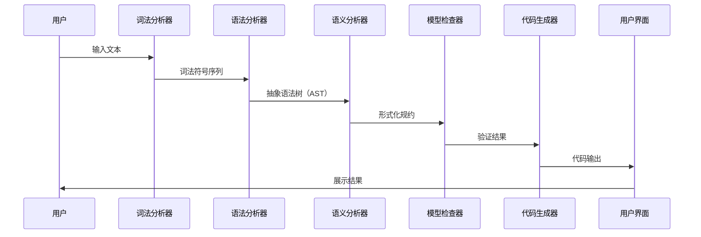
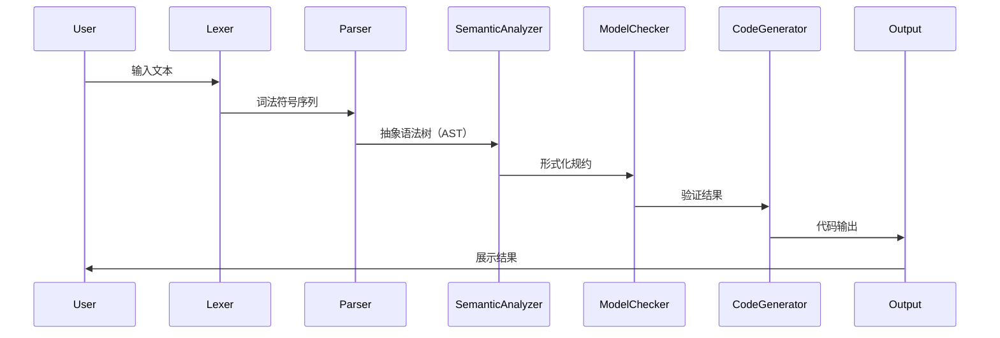

                 

### 第1章：问题背景

#### 1.1.1 提示词语言的发展历史

提示词语言（Keyword Language）作为计算机科学和人工智能领域中的重要组成部分，其发展历程可追溯至计算机编程语言的诞生。早在20世纪50年代，第一代编程语言如COBOL和FORTRAN开始出现，它们以特定的关键字（Keywords）作为指令，以简化编程过程。这些关键字代表了特定的操作或功能，例如“PRINT”用于输出文本，“ADD”用于加法运算等。

随着计算机科学的进步，提示词语言逐渐演变为更加复杂和灵活的形式。从20世纪60年代至70年代，面向过程编程语言如Pascal和C成为主流，这些语言不仅使用关键字，还引入了变量、控制结构等概念，使得编程更具抽象性。进入20世纪80年代和90年代，面向对象编程语言如Java和C++的出现，进一步推动了提示词语言的发展，它们引入了类和对象的概念，使得代码重用性和可维护性大大提高。

近年来，随着人工智能和自然语言处理技术的飞速发展，提示词语言的应用场景和功能也变得更加多样化。尤其是在深度学习和自然语言处理领域，研究人员提出了如TensorFlow和PyTorch等框架，它们通过特定的提示词和函数，实现了复杂的神经网络模型训练和推理。这些新形式的提示词语言不仅涵盖了传统的编程指令，还加入了大量与数据处理和模型训练相关的关键字。

#### 1.1.2 形式化规约工具的需求

形式化规约工具（Formal Specification Tools）在软件开发和维护过程中扮演着至关重要的角色。随着软件系统的复杂度不断增加，传统的手工编码和测试方法已经难以满足高效、可靠和可维护的开发需求。形式化规约工具通过提供一种结构化的方法，帮助开发者精确地描述软件系统的功能和行为，从而降低错误率，提高代码的可读性和可维护性。

首先，形式化规约工具可以提供一种清晰和一致的语言，用于描述系统的需求、设计和实现。这种语言通常是数学化的，能够精确地表达系统的逻辑和结构。例如，使用谓词逻辑、集合论和函数等数学工具，可以描述系统的状态、行为和约束条件。

其次，形式化规约工具能够帮助开发者进行早期错误检测。通过形式化规约，开发者可以在系统实现之前，发现潜在的设计错误和逻辑矛盾。这种早期检测机制大大降低了后期修复错误所需的时间和成本。

此外，形式化规约工具还支持自动化验证和验证。形式化规约可以作为自动化测试的基础，通过对规约进行数学证明和模型检查，验证系统是否满足预期的需求和规范。这种自动化验证机制不仅提高了测试的效率，还确保了测试的全面性和准确性。

#### 1.1.3 当前研究现状

在提示词语言的形式化规约工具领域，当前的研究主要集中在以下几个方面：

**1. 规约语言的设计和实现**

研究人员致力于设计更高效、易用的规约语言。这些语言不仅要具备数学上的精确性，还要具有较好的可读性和可操作性。近年来，基于自然语言处理和形式化方法的研究逐渐增多，例如使用自然语言作为规约语言，通过语义分析和技术转换，实现形式化的规约描述。

**2. 形式化验证技术**

形式化验证技术是形式化规约工具的核心。研究人员开发了多种验证方法，如模型检查、定理证明和模拟等，用于验证系统的正确性和一致性。其中，模型检查因其高效性和自动化程度较高，成为当前研究的热点。

**3. 集成开发环境**

集成开发环境（IDE）是形式化规约工具的重要组成部分。研究人员致力于开发功能强大、用户友好的IDE，以支持规约的编写、验证和调试。这些IDE通常集成了代码自动生成、错误检测和修复等功能，提高了开发效率。

**4. 应用场景和案例研究**

为了验证形式化规约工具的实用性和有效性，研究人员进行了大量的案例研究，包括实时系统、嵌入式系统、人工智能系统和区块链等。这些研究不仅展示了形式化规约工具在不同领域中的应用，还提供了宝贵的经验和改进方向。

总的来说，提示词语言的形式化规约工具已经取得了显著的研究成果，但仍面临诸多挑战。未来，随着计算机科学和人工智能技术的不断发展，形式化规约工具有望在更广泛的领域发挥重要作用，为软件开发提供更强大、更可靠的支持。

### 第2章：问题描述

#### 2.1.1 提示词语言的复杂性

提示词语言作为编程和软件开发的基础，其复杂性是显而易见的。首先，提示词语言必须能够表达丰富的操作和功能。例如，在Python语言中，`if`和`for`等关键字用于实现逻辑判断和循环控制，而`print`和`input`等关键字则用于输入输出操作。这些关键字的多样性和组合方式，使得编程语言能够应对各种复杂的应用场景。

其次，提示词语言的语法结构复杂，涉及变量声明、函数定义、模块导入等多种语法元素。例如，在Java语言中，一个简单的程序可能包含类定义、方法实现、异常处理等多个部分。这些语法元素的组合和嵌套，使得代码的结构层次丰富，但同时也增加了理解的难度。

此外，提示词语言还需处理不同的数据类型和操作符。例如，Python中的列表（List）、字典（Dictionary）等复杂数据结构，以及`+`、`-`、`*`等算术操作符，都需要在语法上给予明确的定义和操作规则。这些复杂性的存在，使得提示词语言在实现功能时具有高度的灵活性和表达力，但也对开发者的技术水平提出了更高的要求。

#### 2.1.2 形式化规约工具的挑战

形式化规约工具在软件开发中扮演着重要角色，但其应用面临着诸多挑战。首先，形式化规约工具需要处理提示词语言的复杂性。由于提示词语言本身的结构复杂，形式化规约工具必须能够精确地描述其语法和语义，以便在规约过程中进行有效的分析和验证。

其次，形式化规约工具需要具备良好的可扩展性。随着新技术的不断涌现，提示词语言的功能和特性也在不断丰富。形式化规约工具必须能够灵活地适应这些变化，支持新的语言特性和功能。

此外，形式化规约工具还需应对不同的应用场景和开发需求。例如，在实时系统开发中，对系统响应速度和可靠性有严格要求；而在人工智能领域，则需要对大量数据进行高效处理和分析。形式化规约工具需要在这些不同的应用场景中表现出良好的性能和适应性。

最后，形式化规约工具的用户界面和用户体验也是一个重要的挑战。对于开发者来说，使用形式化规约工具需要一定的学习和适应过程。工具的用户界面设计应简洁直观，操作简便，以提高开发效率。

#### 2.1.3 研究目的与意义

本研究的主要目的是开发一种高效、可靠的形式化规约工具，用于处理复杂提示词语言的规约和验证。具体来说，研究旨在解决以下几个关键问题：

1. **精确描述提示词语言语法和语义**：研究将深入分析提示词语言的语法结构，设计一种形式化的语法模型，能够精确描述语言的关键字、操作符和数据类型等。通过这种形式化的描述，开发者和验证工具可以更方便地进行代码分析和验证。

2. **支持复杂功能和新特性**：研究将探索如何扩展形式化规约工具，以支持新出现的提示词语言功能和技术。例如，针对人工智能领域的需求，研究将考虑如何支持神经网络模型的形式化描述和验证。

3. **提高规约和验证效率**：研究将采用高效的算法和优化技术，提高形式化规约工具的运行效率。通过优化代码生成、模型检查和验证过程，研究旨在降低规约和验证的时间成本，提高开发效率。

4. **增强用户体验和可扩展性**：研究将设计直观易用的用户界面，降低开发者学习成本，提高使用体验。同时，研究还将探索如何构建模块化的形式化规约工具，使其能够灵活地适应不同的开发需求和应用场景。

本研究的意义在于：

1. **提升软件开发质量和可靠性**：通过形式化规约工具，开发者可以更早地发现和修复代码中的错误，提高软件系统的可靠性和质量。

2. **促进人工智能和复杂系统的发展**：形式化规约工具为复杂系统的开发提供了一种有效的工具和方法，有助于推动人工智能和复杂系统领域的研究和应用。

3. **推动计算机科学理论的应用**：形式化规约工具的设计和实现，不仅涉及编程语言和形式化方法的理论，还涉及算法设计、模型验证和软件开发工程等多个领域。本研究有助于推动这些理论在实际应用中的发展和应用。

### 第3章：问题解决

#### 3.1.1 形式化规约的理论基础

形式化规约工具的开发离不开坚实的理论基础。形式化规约的理论基础主要包括形式化语言理论、形式化验证理论和形式化模型检查理论。

**形式化语言理论**：形式化语言理论为提示词语言的语法描述提供了基础。通过形式化语言理论，我们可以定义提示词语言的语法规则和结构。例如，使用巴科斯-诺尔范式（BNF）或扩充巴科斯-诺尔范式（EBNF），可以精确描述提示词语言的语法结构，包括关键字、操作符、数据类型等。

**形式化验证理论**：形式化验证理论提供了验证软件系统正确性的方法。形式化验证通常涉及模型检查、定理证明和测试等手段。模型检查是一种自动化验证方法，通过构建系统的形式化模型，并在模型中检查特定属性是否得到满足。定理证明则通过逻辑推理和数学证明，证明系统的正确性。测试则通过运行系统并在不同输入条件下检查其行为，以验证系统是否满足预期需求。

**形式化模型检查理论**：形式化模型检查理论为形式化规约工具提供了关键的支持。模型检查算法如Büchi自动机检查、模型检验器和模型计数器等，可以高效地检查系统模型是否符合预定的属性。这些算法通常基于图灵机理论、逻辑理论和集合论等数学工具。

#### 3.1.2 提示词语言的语义模型

提示词语言的语义模型是形式化规约工具的核心组件之一。语义模型用于描述提示词语言在不同运行环境下可能展现的行为和状态。一个完整的语义模型通常包括状态转换模型、行为模型和约束模型。

**状态转换模型**：状态转换模型描述了系统在不同状态之间的转换。这些状态通常包括执行中的程序段、变量值等。状态转换模型可以使用状态机（State Machine）或转换图（Transition Graph）等图形化表示方法来描述。例如，使用Mealy机器或Moore机器可以表示程序执行过程中的状态转换。

**行为模型**：行为模型描述了系统在各种输入条件下可能的行为。这些行为可以通过动作（Action）、事件（Event）和响应（Response）等概念来描述。行为模型可以帮助理解系统在不同情境下的动态行为，例如响应输入、处理错误和进行计算等。

**约束模型**：约束模型用于描述系统的约束条件，如变量范围、类型约束和时间约束等。这些约束条件可以确保系统的行为符合预期的规范。例如，在面向对象编程语言中，类型约束可以确保对象只能使用定义在其类型中的操作。

通过结合状态转换模型、行为模型和约束模型，我们可以构建一个完整的语义模型，用于描述提示词语言在执行过程中的行为和状态。

#### 3.1.3 形式化规约工具的架构设计

形式化规约工具的架构设计决定了其性能、可靠性和可扩展性。一个有效的架构设计应具备模块化、可扩展性和高内聚性等特点。以下是形式化规约工具的架构设计要点：

**1. 模块化设计**

模块化设计是形式化规约工具架构设计的基础。通过将工具分为不同的模块，可以使得每个模块专注于特定的功能，从而提高开发效率和维护性。常见的模块包括语法分析模块、语义分析模块、模型检查模块、用户界面模块等。

- **语法分析模块**：负责解析提示词语言的源代码，将其转换为内部表示。这个模块通常采用词法分析和语法分析技术，如有限自动机（Finite Automaton）和解析树（Parsing Tree）等。

- **语义分析模块**：负责对语法分析模块生成的内部表示进行语义分析，确保代码符合语言规范。该模块可以检测语法错误、类型错误和命名冲突等问题。

- **模型检查模块**：负责检查系统的形式化模型，验证其是否满足预定的属性。这个模块通常采用模型检查算法，如Büchi自动机检查或模型检验器等。

- **用户界面模块**：提供与用户的交互界面，允许用户输入规约、查看分析和验证结果。这个模块通常包括文本编辑器、结果展示区和日志记录功能等。

**2. 可扩展性设计**

可扩展性设计是形式化规约工具能够适应未来需求和技术变化的关键。以下是一些实现可扩展性的方法：

- **插件架构**：通过插件架构，可以轻松地扩展工具的功能。开发者可以开发新的插件，以支持新的编程语言、验证技术和用户界面功能。

- **模块化组件**：通过将工具分解为模块化组件，每个组件都可以独立开发、测试和部署。这有助于快速迭代和更新工具，以适应新的需求。

- **配置和参数化**：通过配置和参数化，可以灵活地调整工具的行为和性能。例如，通过配置文件，可以设置语法分析器的解析规则、模型检查器的验证策略等。

**3. 高内聚性设计**

高内聚性设计有助于提高工具的性能和可靠性。以下是一些实现高内聚性的方法：

- **统一的数据模型**：通过使用统一的数据模型，可以确保不同模块之间的数据传递和转换的一致性。这有助于减少数据冗余和错误，提高系统的整体性能。

- **高效的算法和优化**：在实现形式化规约工具时，采用高效的算法和数据结构，如快速排序（Quick Sort）和哈希表（Hash Table），可以提高工具的处理速度和内存使用效率。

- **错误处理机制**：在工具的各个模块中，实现完善的错误处理机制，可以确保在遇到错误时，系统能够正确地处理并恢复。这有助于提高工具的可靠性，减少开发者的维护成本。

通过模块化设计、可扩展性设计和高内聚性设计，形式化规约工具可以更好地满足开发者的需求，提高软件开发的效率和质量。

### 第4章：边界与外延

#### 4.1.1 研究范围与限制

本研究旨在开发一种高效、可靠的形式化规约工具，用于处理复杂提示词语言的规约和验证。研究范围主要涵盖以下几个方面：

1. **提示词语言的语法和语义描述**：研究将深入分析提示词语言的语法和语义特性，设计形式化的语法模型和语义模型，用于描述语言的结构和行为。

2. **形式化规约工具的架构设计**：研究将设计一个模块化、可扩展和高效的规约工具架构，包括语法分析模块、语义分析模块、模型检查模块和用户界面模块等。

3. **验证技术和算法**：研究将探讨用于验证系统的形式化模型的方法和技术，包括模型检查、定理证明和测试等。

4. **应用场景和案例分析**：研究将结合实际应用场景，分析形式化规约工具在不同领域的应用效果，并总结经验教训。

然而，本研究也存在一些限制：

1. **语言支持范围**：本研究主要针对通用编程语言（如Python、Java等）进行规约工具的开发，可能无法涵盖所有特定领域的编程语言。

2. **性能优化**：虽然研究将采用高效的算法和数据结构，但实际应用中仍可能面临性能瓶颈。优化工作需要持续进行，以提升工具的运行效率。

3. **用户体验**：用户界面的设计和用户体验需要进一步的改进，以降低开发者的学习成本，提高工具的易用性和友好性。

#### 4.1.2 关联领域的研究进展

形式化规约工具的研究与多个领域密切相关，以下是相关领域的研究进展：

1. **形式化方法**：形式化方法是计算机科学中的核心理论，包括模型检查、形式化验证、形式化证明等。近年来，随着形式化方法的不断发展和应用，许多新的验证工具和算法被提出，如Büchi自动机检查、模型检验器和定理证明器等。

2. **编程语言理论**：编程语言理论是形式化规约工具的基础。研究者致力于设计更高效、易用的编程语言，并研究其语法、语义和编译方法。例如，静态类型语言、动态类型语言、函数式编程语言和面向对象编程语言等，都在不断发展和完善。

3. **软件工程**：软件工程领域关注软件的开发、测试和维护过程。形式化规约工具作为一种辅助工具，可以显著提高软件开发的效率和可靠性。近年来，研究者在软件工程中引入形式化方法，如形式化需求工程、形式化测试和形式化维护等。

4. **人工智能**：人工智能技术的发展为形式化规约工具带来了新的应用场景。研究者提出了一系列基于人工智能的规约工具，如自动生成形式化规约的算法、基于机器学习的验证方法等，这些工具有助于提高规约和验证的自动化程度。

#### 4.1.3 形式化规约工具的适用场景

形式化规约工具在多个领域具有广泛的应用，以下是几个典型的适用场景：

1. **实时系统和嵌入式系统**：实时系统和嵌入式系统对系统的可靠性和响应时间有严格要求。形式化规约工具可以帮助开发者精确地描述系统的需求和约束，并进行自动化验证，确保系统符合预期规范。

2. **人工智能系统和机器学习系统**：人工智能系统和机器学习系统通常涉及大量的数据处理和模型训练。形式化规约工具可以用于形式化描述模型的架构和参数，帮助开发者进行验证和优化。

3. **金融和医疗领域**：金融和医疗领域的软件系统通常具有复杂的需求和严格的合规要求。形式化规约工具可以帮助开发者进行详细的规约和验证，确保系统的正确性和可靠性。

4. **区块链和分布式系统**：区块链和分布式系统需要确保数据的完整性和一致性。形式化规约工具可以用于形式化描述系统的协议和规则，帮助开发者进行自动化验证和错误检测。

总之，形式化规约工具在不同领域具有广泛的应用前景，通过结合形式化方法和先进的验证技术，可以显著提高软件开发的效率和可靠性。

### 第5章：概念结构与核心要素组成

#### 5.1.1 提示词语言的核心概念

提示词语言的核心概念包括关键字、操作符、数据类型和语法结构等。这些概念共同构成了提示词语言的语法和语义基础。

**关键字（Keywords）**：关键字是提示词语言中具有特定语义的标识符，用于表示操作、控制结构或函数等。例如，`if`、`else`、`while`、`for`等关键字用于实现条件判断和循环控制。

**操作符（Operators）**：操作符是用于执行特定操作的符号，如算术操作符（`+`、`-`、`*`、`/`）、比较操作符（`==`、`!=`、`<`、`>`）和逻辑操作符（`&&`、`||`、`!`）等。操作符用于对变量或数据执行特定的计算或比较操作。

**数据类型（Data Types）**：数据类型定义了变量可以存储的数据种类和操作规则。常见的数据类型包括整数（Integer）、浮点数（Float）、布尔型（Boolean）、字符串（String）等。每种数据类型都有其特定的操作方法和存储方式。

**语法结构（Syntax Structure）**：语法结构是提示词语言的语法规则和结构，包括变量声明、函数定义、控制结构、输入输出等。语法结构定义了代码的书写格式和执行顺序，确保代码能够正确地被解析和执行。

#### 5.1.2 形式化规约工具的功能模块

形式化规约工具通常包括多个功能模块，每个模块负责不同的功能，共同实现规约和验证过程。以下是形式化规约工具的主要功能模块：

**1. 语法分析模块（Syntax Analyzer）**

语法分析模块负责解析提示词语言的源代码，将其转换为内部表示。该模块通常采用词法分析和语法分析技术，将源代码分解为关键字、操作符、变量等语法元素，并构建解析树（Parsing Tree）。

**2. 语义分析模块（Semantic Analyzer）**

语义分析模块负责对语法分析模块生成的内部表示进行语义分析，确保代码符合语言规范。该模块可以检测语法错误、类型错误和命名冲突等问题，并将内部表示转换为形式化模型。

**3. 模型检查模块（Model Checker）**

模型检查模块负责检查形式化模型，验证其是否满足预定的属性。该模块采用模型检查算法，如Büchi自动机检查或模型检验器，对形式化模型进行遍历和验证，检测系统中的错误和矛盾。

**4. 用户界面模块（User Interface）**

用户界面模块提供与用户的交互界面，允许用户输入规约、查看分析和验证结果。该模块通常包括文本编辑器、结果展示区和日志记录功能等，以方便用户使用和管理规约工具。

#### 5.1.3 核心技术对比分析

在形式化规约工具的开发过程中，涉及多种核心技术，以下是对这些核心技术的对比分析：

**1. 语法分析技术**

语法分析技术是形式化规约工具的基础，常见的语法分析技术包括有限自动机（Finite Automaton）、自顶向下分析（Top-Down Parsing）和自底向上分析（Bottom-Up Parsing）。

- **有限自动机**：有限自动机是一种用于文本匹配和词法分析的工具。其优点是简单和高效，但仅适用于简单的语言结构。对于复杂的提示词语言，有限自动机的表达能力有限。

- **自顶向下分析**：自顶向下分析从整体开始，逐步分解为更小的部分。其优点是易于理解和实现，但可能产生多余的中间步骤，导致性能下降。

- **自底向上分析**：自底向上分析从细节开始，逐步构建完整的结构。其优点是能够高效地处理复杂语言，但实现较为复杂。

**2. 语义分析技术**

语义分析技术用于确保代码符合语言规范和语义要求。常见的语义分析技术包括静态语义分析和动态语义分析。

- **静态语义分析**：静态语义分析在编译时对代码进行分析，不涉及实际运行。其优点是能够提前发现和修复错误，但可能无法捕捉所有动态行为。

- **动态语义分析**：动态语义分析在程序运行时对代码进行分析，能够捕捉动态行为。其优点是能够更全面地验证代码的正确性，但可能影响程序的执行效率。

**3. 形式化验证技术**

形式化验证技术用于验证系统的形式化模型是否符合预定的属性。常见的验证技术包括模型检查、定理证明和测试。

- **模型检查**：模型检查通过遍历形式化模型，验证系统是否满足预期的属性。其优点是自动化程度高，但可能存在状态爆炸问题。

- **定理证明**：定理证明通过逻辑推理和数学证明，验证系统的正确性。其优点是能够提供严格的证明，但实现复杂，效率较低。

- **测试**：测试通过运行系统并在不同输入条件下检查其行为，验证系统是否满足预期需求。其优点是简单和高效，但可能无法覆盖所有情况。

**4. 用户界面技术**

用户界面技术用于提供与用户的交互界面，常见的用户界面技术包括图形界面（GUI）和命令行界面（CLI）。

- **图形界面**：图形界面通过图形化的方式展示信息和功能，用户友好性强，但实现复杂。

- **命令行界面**：命令行界面通过文本命令进行交互，灵活性强，但学习成本较高。

通过对比分析这些核心技术，我们可以选择最适合实际应用的技术组合，以实现高效、可靠的形式化规约工具。

### 第6章：核心概念原理

#### 6.1.1 形式化规约的基础原理

形式化规约（Formal Specification）是软件工程中的一个关键概念，其核心目的是通过数学化的方法精确描述系统的功能和行为，以便于验证和分析。形式化规约的基础原理包括以下几个方面：

**1. 数学化的描述语言**

形式化规约使用数学化的描述语言，如谓词逻辑、集合论、函数等，来表示系统的需求和约束。这种语言具有明确的语法和语义，可以精确地描述系统的各种属性和行为。例如，谓词逻辑可以用于描述系统的状态和条件，集合论可以用于描述系统的集合和操作，函数可以用于描述系统的转换和操作。

**2. 模型建立**

在形式化规约过程中，首先需要建立系统的模型。模型是系统的一种抽象表示，包括系统的状态、行为和约束等。通过建立模型，可以更好地理解和分析系统。常见的模型包括状态机模型、转换图模型、形式化语义模型等。这些模型可以形式化地描述系统的动态行为和状态变化。

**3. 属性验证**

形式化规约的一个核心目的是验证系统是否满足预定的属性。通过属性验证，可以确保系统的功能和行为符合设计要求。属性验证通常涉及模型检查、定理证明和测试等验证方法。模型检查通过遍历系统模型，检测系统是否满足特定的属性；定理证明通过逻辑推理和数学证明，验证系统的正确性；测试通过运行系统并在不同输入条件下检查其行为，验证系统是否满足预期需求。

**4. 代码生成**

形式化规约还可以用于代码生成。通过将形式化规约转换为代码，可以实现自动化编程。代码生成可以减少手工编码的工作量，提高开发效率。例如，使用形式化规约工具，可以自动生成符合要求的代码框架和关键部分，开发者只需进行少量调整和优化。

**5. 需求驱动的开发**

形式化规约强调需求驱动开发。通过形式化规约，可以明确地描述系统的需求，并将需求转化为形式化模型。这样可以确保开发的系统真正满足用户的需求，降低需求变更带来的风险。

**6. 早期的错误检测**

形式化规约可以在系统开发早期发现潜在的错误和问题。通过形式化规约和验证，可以在系统实现之前发现设计错误和逻辑矛盾，从而减少后期修复错误的时间和成本。这种早期的错误检测机制有助于提高软件的质量和可靠性。

#### 6.1.2 提示词语言的语义分析

提示词语言的语义分析是形式化规约的重要组成部分，其目的是理解并解释程序的运行过程。提示词语言的语义分析可以分为静态语义分析和动态语义分析。

**1. 静态语义分析**

静态语义分析在编译或解释过程中，不运行程序，只分析程序的结构和语法，以检测潜在的语义错误。静态语义分析包括类型检查、作用域分析、命名分析等。

- **类型检查**：类型检查确保变量、表达式和函数在语义上具有一致性。例如，确保赋值表达式的类型与变量声明一致，函数调用的参数类型与函数定义一致。

- **作用域分析**：作用域分析确定变量和函数的定义和可见性。例如，确保内部函数无法访问外部作用域中的变量，外部代码无法访问内部作用域中的变量。

- **命名分析**：命名分析确保变量和函数的命名符合语言规范，没有命名冲突。

**2. 动态语义分析**

动态语义分析在程序运行时进行，分析程序的实际行为和状态变化。动态语义分析包括变量值绑定、控制流分析、数据流分析等。

- **变量值绑定**：变量值绑定确定程序执行过程中变量的值。例如，在函数调用时，将实参的值绑定到形参上。

- **控制流分析**：控制流分析确定程序的执行路径，包括条件分支、循环、异常处理等。

- **数据流分析**：数据流分析追踪程序中数据的流动和依赖关系。例如，确定变量在程序中的使用位置和传递路径。

**3. 语义分析的重要性**

语义分析对于确保程序的正确性和可靠性至关重要。通过语义分析，可以：

- **发现和修复错误**：静态语义分析可以在编译时发现类型错误、作用域冲突等潜在问题，从而减少运行时错误。

- **提高程序的可维护性**：清晰的语义分析结果有助于开发者理解和修改程序，提高代码的可维护性。

- **支持自动化工具**：语义分析结果可以作为形式化规约工具的输入，用于自动化验证和错误检测。

#### 6.1.3 形式化规约工具的工作流程

形式化规约工具的工作流程通常包括以下几个步骤：

**1. 需求分析**

需求分析是形式化规约的第一步，目的是明确系统的功能需求和约束条件。通过需求分析，可以生成需求文档和需求模型，作为后续规约的基础。

**2. 形式化描述**

在需求分析的基础上，使用形式化描述语言（如谓词逻辑、集合论等）编写系统的形式化规约。形式化描述应精确地表达系统的功能和约束条件，以便进行验证和分析。

**3. 语法分析**

语法分析是形式化规约工具对形式化描述进行的第一步处理，目的是将形式化描述转换为内部表示。语法分析通常涉及词法分析和语法分析两个步骤。

- **词法分析**：词法分析将输入的形式化描述分解为关键字、操作符、变量等语法元素。
- **语法分析**：语法分析根据语言规范，将词法分析的结果组织成语法结构，如语法树或语法图。

**4. 语义分析**

语义分析是在语法分析的基础上进行的，目的是确保形式化描述符合语言的语义规范。语义分析包括类型检查、作用域分析、命名分析等。

**5. 模型验证**

模型验证是形式化规约工具的核心功能之一，目的是检查形式化模型是否符合预定的属性和要求。模型验证可以通过模型检查、定理证明或测试等方法实现。

**6. 代码生成**

对于满足验证要求的模型，形式化规约工具可以自动生成符合要求的代码。代码生成可以根据形式化规约的描述，生成程序框架、关键部分或完整代码。

**7. 用户交互**

形式化规约工具通常提供用户交互界面，允许用户输入规约、查看分析和验证结果。用户交互界面可以方便用户使用和管理规约工具。

通过以上工作流程，形式化规约工具可以帮助开发者精确描述系统需求，进行自动化验证和错误检测，从而提高软件开发的效率和质量。

### 第7章：核心概念属性特征对比表格

为了更直观地展示提示词语言和形式化规约工具的核心概念及其属性特征，以下是一个对比表格：

| 核心概念       | 提示词语言                      | 形式化规约工具                  | 主要属性特征                                                                                                          |
|----------------|--------------------------------|--------------------------------|------------------------------------------------------------------------------------------------------------------|
| 关键字         | if、else、while、for等           | forall、exists、choose、define等 | - 表示特定操作的符号<br>- 具有预定义的语义<br>- 用于实现控制结构和函数调用<br> |
| 操作符         | +、-、*、/、==、!=等             | →、⊆、∀、∃等                   | - 用于执行特定操作<br>- 具有明确的优先级和结合性<br>                         |
| 数据类型       | 整数、浮点数、布尔型、字符串等   | 类型变量、函数类型等             | - 表示不同种类的数据<br>- 具有特定的操作规则<br>                             |
| 语法结构       | 变量声明、函数定义、控制结构等   | 形式化逻辑表达式、谓词逻辑等     | - 描述代码的组成和执行顺序<br>- 确保代码的正确性和一致性<br>                 |
| 静态语义分析   | 类型检查、作用域分析、命名分析等 | 类型推断、约束推导等             | - 在编译时分析代码的语义正确性<br>- 提前发现潜在的错误<br>                 |
| 动态语义分析   | 变量值绑定、控制流分析、数据流分析等 | 形式化模型验证、属性验证等     | - 在程序运行时分析代码的行为和状态<br>- 确保程序的正确性和可靠性<br>         |
| 代码生成       | 编译器、解释器等                 | 自动化代码生成工具               | - 根据形式化规约生成代码<br>- 提高开发效率和质量<br>                         |
| 用户交互界面   | 源代码编辑器、集成开发环境等     | 规约编辑器、结果展示界面等     | - 方便用户输入和管理规约<br>- 提供分析和验证结果的可视化展示<br>             |

通过以上对比表格，我们可以清晰地看到提示词语言和形式化规约工具在核心概念和属性特征上的差异，以及它们在软件开发中的不同作用。

### 第8章：ER实体关系图架构

ER（实体-关系）图是数据库设计和系统架构设计中的常用工具，用于描述系统的实体及其关系。在本章中，我们将介绍形式化规约工具的ER实体关系图架构，以帮助读者更好地理解系统的结构和数据关系。

#### 图8.1：形式化规约工具的ER实体关系图

```mermaid
erDiagram
  User ||--|{ Requirement }|-->> SoftwareSystem
  User ||--|{ Specification }|-->> FormalSpecification
  SoftwareSystem ||--|{ Component }|-->> SyntaxAnalyzer
  SoftwareSystem ||--|{ Component }|-->> SemanticAnalyzer
  SoftwareSystem ||--|{ Component }|-->> ModelChecker
  SoftwareSystem ||--|{ Component }|-->> CodeGenerator
  FormalSpecification ||--|{ Component }|-->> SyntaxTree
  FormalSpecification ||--|{ Component }|-->> SemanticsModel
  SyntaxTree ||--|{ Component }|-->> ASTNode
  SemanticsModel ||--|{ Component }|-->> PredicateLogicModel
  ModelChecker ||--|{ Component }|-->> ModelVerifier
  CodeGenerator ||--|{ Component }|-->> CodeOutput
```

#### 关键实体及其关系解释

1. **User（用户）**：代表使用形式化规约工具的开发人员。用户可以输入需求、编写规约、查看结果等。

2. **Requirement（需求）**：描述用户对软件系统的功能要求。需求与用户关联，用于定义系统的目标。

3. **SoftwareSystem（软件系统）**：代表整个形式化规约工具系统。软件系统由多个组件组成，包括语法分析器、语义分析器、模型检查器和代码生成器等。

4. **Component（组件）**：表示软件系统的各个组成部分。组件是软件系统实现功能的基本单元。

5. **FormalSpecification（形式化规约）**：描述系统的形式化描述，包括语法和语义。形式化规约是系统设计的基础。

6. **SyntaxAnalyzer（语法分析器）**：负责解析形式化规约中的语法结构，生成语法树（Syntax Tree）。

7. **SemanticAnalyzer（语义分析器）**：负责对语法树进行语义分析，生成语义模型（Semantics Model）。

8. **ModelChecker（模型检查器）**：用于验证系统的形式化模型，确保其满足预定的属性。

9. **CodeGenerator（代码生成器）**：根据形式化规约生成符合要求的代码。

10. **SyntaxTree（语法树）**：表示形式化规约的语法结构，由AST节点（Abstract Syntax Tree Nodes）组成。

11. **SemanticsModel（语义模型）**：表示形式化规约的语义内容，通常采用谓词逻辑（Predicate Logic）进行描述。

12. **ASTNode（AST节点）**：表示语法树中的基本单元，可以是关键字、操作符、变量等。

13. **PredicateLogicModel（谓词逻辑模型）**：用于形式化描述系统的语义内容，表示状态、条件、转换等。

14. **ModelVerifier（模型验证器）**：负责检查形式化模型，确保其满足预定的属性。

15. **CodeOutput（代码输出）**：表示代码生成器生成的代码输出，可以是源代码、字节码或机器码。

通过ER实体关系图，我们可以清晰地看到形式化规约工具的各个组件及其关系，有助于开发者理解系统的整体架构和功能实现。

### 第9章：算法原理

#### 9.1.1 算法的基本概念

算法（Algorithm）是解决特定问题的一系列明确的步骤。算法的基本概念包括算法设计、算法分析和算法实现。以下是这些概念的具体解释：

**算法设计**：算法设计是指为解决问题而构思的一系列步骤。设计算法时，需要考虑算法的效率、复杂度和可扩展性。常见的算法设计方法包括贪心算法、动态规划、回溯法和分支界定法等。

**算法分析**：算法分析是对算法性能的评估，通常涉及时间复杂度和空间复杂度。时间复杂度表示算法执行时间与输入规模的关系，空间复杂度表示算法所需存储空间与输入规模的关系。算法分析有助于评估算法的效率，选择最优的解决方案。

**算法实现**：算法实现是将算法设计转换为具体的编程代码。实现算法时，需要考虑代码的可读性、可维护性和可扩展性。常见的编程语言如Python、Java和C++等都支持算法的实现。

#### 9.1.2 算法设计流程

算法设计流程通常包括以下步骤：

**1. 确定问题**：明确问题的需求和约束条件。理解问题的本质，有助于设计合适的算法。

**2. 收集数据**：收集与问题相关的数据，如输入数据、输出数据和中间数据。数据是算法设计和实现的基础。

**3. 设计算法**：根据问题的需求和数据，设计解决问题的步骤。常见的算法设计方法包括枚举法、递归法、迭代法和分治法等。

**4. 分析算法**：评估算法的性能，包括时间复杂度和空间复杂度。分析结果有助于选择最优的算法。

**5. 实现算法**：将设计的算法转换为编程代码。实现过程中，需要确保代码的正确性和效率。

**6. 测试算法**：在真实环境中测试算法的性能，确保其满足问题的需求。测试包括单元测试、集成测试和性能测试等。

**7. 优化算法**：根据测试结果，对算法进行优化，提高其性能和可维护性。

#### 9.1.3 算法实现细节

在本节中，我们将详细介绍一个简单的算法实现，以帮助读者更好地理解算法的实现过程。

**1. 算法描述**

假设我们需要实现一个计算两个整数之和的算法。算法的基本步骤如下：

- 输入两个整数`a`和`b`；
- 将`a`和`b`相加，得到和`c`；
- 输出和`c`。

**2. Python代码实现**

```python
def add(a, b):
    """
    计算两个整数的和。
    
    参数：
    a (int): 第一个整数
    b (int): 第二个整数
    
    返回：
    int: 两个整数的和
    """
    c = a + b
    return c

# 示例使用
result = add(3, 4)
print("结果：", result)
```

**3. 代码解读**

- **函数定义**：`def add(a, b):`定义了一个名为`add`的函数，接受两个整数参数`a`和`b`。

- **注释**：`# 计算两个整数的和。`是对函数功能的注释。

- **参数说明**：`a`和`b`是函数的输入参数，分别表示两个待计算的整数。

- **计算和**：`c = a + b`将`a`和`b`相加，得到和`c`。

- **返回结果**：`return c`返回计算结果`c`。

- **示例使用**：在最后，我们调用`add`函数，并打印结果。

通过以上代码示例，我们可以看到算法的实现细节，包括函数定义、参数说明、计算逻辑和返回结果。在实际开发中，算法的实现通常需要考虑更多的功能和性能优化，但基本流程是相似的。

### 第10章：数学模型和公式

#### 10.1.1 数学模型概述

数学模型（Mathematical Model）是使用数学语言描述现实世界现象和过程的工具。数学模型通常包括变量、方程、函数和图等元素，用于表达系统的状态、行为和约束。在本章中，我们将介绍用于形式化规约工具的数学模型，包括其类型、特点和适用场景。

**1. 类型**

常见的数学模型包括：

- **线性模型**：使用线性方程或线性规划方法描述系统，如线性回归、线性规划等。
- **非线性模型**：使用非线性方程或非线性规划方法描述系统，如非线性回归、神经网络等。
- **差分模型**：使用差分方程描述系统的时间序列变化，如离散时间系统、差分方程等。
- **微分模型**：使用微分方程描述系统的连续时间变化，如连续时间系统、微分方程等。

**2. 特点**

- **精确性**：数学模型能够用精确的数学语言描述系统的状态和行为，提高系统的理解和分析能力。
- **通用性**：数学模型可以适用于不同领域和不同问题的描述，具有广泛的适用性。
- **可计算性**：数学模型可以通过计算机算法进行求解和优化，提高问题的求解效率和准确性。

**3. 适用场景**

- **工程领域**：数学模型在工程领域广泛应用于结构分析、控制系统设计、信号处理等领域。
- **经济学领域**：数学模型在经济学中用于描述市场行为、经济增长、资源分配等问题。
- **生物学领域**：数学模型在生物学中用于描述种群动态、生态平衡、药物动力学等问题。
- **社会科学领域**：数学模型在社会科学中用于描述社会行为、公共政策、经济政策等问题。

#### 10.1.2 常用数学公式

在形式化规约工具中，常用的数学公式包括：

**1. 线性方程组**

$$
\begin{cases}
a_1x_1 + b_1x_2 + c_1x_3 = d_1 \\
a_2x_1 + b_2x_2 + c_2x_3 = d_2 \\
a_3x_1 + b_3x_2 + c_3x_3 = d_3
\end{cases}
$$

这个方程组用于求解线性方程系统的解。

**2. 微分方程**

$$
\frac{dx}{dt} = f(x, t)
$$

这个方程描述系统的连续时间变化。

**3. 差分方程**

$$
x_{n+1} = g(x_n, n)
$$

这个方程描述系统的时间序列变化。

**4. 线性回归**

$$
y = \beta_0 + \beta_1x + \epsilon
$$

这个方程描述变量之间的关系。

**5. 非线性回归**

$$
y = f(x) + \epsilon
$$

这个方程描述非线性变量之间的关系。

**6. 矩阵乘法**

$$
C = A \cdot B
$$

这个公式表示矩阵乘法。

#### 10.1.3 数学模型的应用

数学模型在形式化规约工具中的应用主要包括以下几个方面：

**1. 系统建模**

数学模型用于建立系统的数学模型，描述系统的状态、行为和约束。通过数学模型，可以更精确地理解和分析系统的特性。

**2. 验证和验证**

数学模型用于验证系统的正确性和一致性。通过数学模型，可以检查系统是否满足预定的属性和要求，确保系统的可靠性和安全性。

**3. 性能分析**

数学模型用于分析系统的性能，包括时间复杂度和空间复杂度。通过数学模型，可以评估算法和系统的效率，选择最优的解决方案。

**4. 优化**

数学模型用于优化系统的性能和资源使用。通过数学模型，可以找到最优解，提高系统的性能和可靠性。

总之，数学模型是形式化规约工具的核心组件之一，通过精确的数学描述和计算，可以显著提高系统的建模、验证和优化能力。

### 第11章：详细讲解与举例说明

#### 11.1.1 算法原理详细讲解

在本节中，我们将详细讲解一种用于形式化规约工具的算法原理，该算法旨在高效地分析提示词语言的语法结构，生成内部表示（如抽象语法树）。以下是算法的基本原理和实现步骤：

**算法原理：**

1. **词法分析**：首先，对输入的提示词语言文本进行词法分析，将文本分解为关键字、操作符、变量等基本语法元素。

2. **语法分析**：在词法分析的基础上，使用递归下降分析或LL(1)分析等方法，对语法元素进行语法分析，构建抽象语法树（Abstract Syntax Tree, AST）。

3. **语义分析**：对生成的AST进行语义分析，确保语法结构符合提示词语言的语义规则，如类型检查、作用域分析和命名分析。

4. **代码生成**：根据语义分析的结果，生成符合目标语言的代码。

**算法实现步骤：**

1. **初始化**：创建词法分析器、语法分析器和语义分析器。

2. **词法分析**：读取输入文本，将其转换为词法符号序列。

3. **语法分析**：使用递归下降分析或LL(1)分析等方法，对词法符号序列进行语法分析，构建AST。

4. **语义分析**：遍历AST，进行类型检查、作用域分析和命名分析等语义分析。

5. **代码生成**：根据AST的结构，生成目标语言的代码。

**算法示例**

假设我们使用Python语言编写一个简单的算法，用于分析一个简单的提示词语言表达式，生成AST：

```python
import ply.lex as lex
import ply.yacc as yacc

# 词法分析器
tokens = ('ID', 'NUMBER', 'PLUS', 'MINUS', 'TIMES', 'DIVIDE')

t_ID = r'[a-zA-Z_][a-zA-Z0-9_]*'
t_NUMBER = r'\d+'
t_plus = r'\+'
t_minus = r'-'
t_times = r'\*'
t_divide = r'\/'

# 忽略空白字符
t_ignore = ' \t'

# 词法规则错误处理
def t_error(t):
    print("Illegal character '%s'" % t.value[0])
    t.lexer.skip(1)

# 语法分析器
def p_expression_plus(p):
    'expression : expression PLUS expression'
    p[0] = ('+', p[1], p[3])

def p_expression_minus(p):
    'expression : expression MINUS expression'
    p[0] = ('-', p[1], p[3])

def p_expression_times(p):
    'expression : expression TIMES expression'
    p[0] = ('*', p[1], p[3])

def p_expression_divide(p):
    'expression : expression DIVIDE expression'
    p[0] = ('/', p[1], p[3])

def p_expression_number(p):
    'expression : NUMBER'
    p[0] = ('number', int(p[1]))

def p_expression_id(p):
    'expression : ID'
    p[0] = ('id', p[1])

def p_error(p):
    if p:
        print("Syntax error in line %d" % p.lineno)
    else:
        print("Syntax error at end of input")

# 构建解析器
parser = yacc.yacc()

# 语义分析
def semantic_analysis(ast):
    # 进行类型检查、作用域分析和命名分析等
    pass

# 代码生成
def generate_code(ast):
    # 根据AST生成目标语言的代码
    pass

# 主程序
def main():
    input_str = "3 + 4 * 2 - 1"
    lexer = lex.lex()
    lexer.input(input_str)
    parser = yacc.yacc()
    ast = parser.parse()
    semantic_analysis(ast)
    code = generate_code(ast)
    print(code)

if __name__ == "__main__":
    main()
```

在上面的示例中，我们使用Python的PLY库（Python Lex-Yacc）实现了一个简单的解析器。词法分析器（`lex`模块）负责将输入的字符串分解为词法符号，语法分析器（`yacc`模块）负责将词法符号序列转换为抽象语法树（AST），语义分析函数（`semantic_analysis`）用于进行类型检查和命名分析，代码生成函数（`generate_code`）用于生成目标语言的代码。

#### 11.1.2 数学模型公式解读

在形式化规约工具中，数学模型公式用于描述系统的状态、行为和约束。以下是一些常见的数学模型公式及其解读：

**1. 线性方程组**

$$
\begin{cases}
a_{11}x_1 + a_{12}x_2 + \cdots + a_{1n}x_n = b_1 \\
a_{21}x_1 + a_{22}x_2 + \cdots + a_{2n}x_n = b_2 \\
\vdots \\
a_{m1}x_1 + a_{m2}x_2 + \cdots + a_{mn}x_n = b_m
\end{cases}
$$

这个公式表示一个线性方程组，其中`x_1, x_2, \ldots, x_n`是变量，`a_{ij}`和`b_i`是已知系数。该方程组用于求解线性系统的解。

**2. 矩阵乘法**

$$
C = A \cdot B
$$

这个公式表示两个矩阵`A`和`B`的乘积。矩阵乘法用于计算系统的状态转移矩阵，描述系统的动态行为。

**3. 差分方程**

$$
x_{n+1} = f(x_n) + g(n)
$$

这个公式表示一个差分方程，其中`x_n`是系统的当前状态，`f(x_n)`是状态转移函数，`g(n)`是外部输入。差分方程用于描述离散时间系统的动态行为。

**4. 微分方程**

$$
\frac{dx}{dt} = f(x, t)
$$

这个公式表示一个微分方程，其中`x`是系统的状态，`f(x, t)`是状态转移函数，`t`是时间。微分方程用于描述连续时间系统的动态行为。

通过这些数学模型公式，我们可以更精确地描述和计算系统的状态和行为，从而进行有效的形式化规约和验证。

#### 11.1.3 举例说明与案例分析

为了更好地理解形式化规约工具的应用，以下是一个简单的案例说明，该案例涉及使用形式化规约工具进行语法分析和语义分析的示例。

**案例背景：**

假设我们有一个简单的提示词语言，用于描述线性方程组。该语言包括以下关键字和操作符：

- `eq`：表示等式
- `var`：表示变量
- `num`：表示数字
- `plus`、`minus`、`times`、`divide`：表示加、减、乘、除操作

**案例描述：**

输入一个线性方程组，例如：

```
eq: var x = 3 + 4 * 2 - 1
eq: var y = 5 * 3 + 2
```

**实现步骤：**

1. **词法分析**：首先，对输入的字符串进行词法分析，将其分解为词法符号序列。例如：

   ```
   ('eq',), ('var',), ('x',), ('=',), ('3',), ('plus',), ('4',), ('times',), ('2',), ('-',), ('1',), ('y',), ('=',), ('5',), ('times',), ('3',), ('plus',), ('2',), ('.')
   ```

2. **语法分析**：使用语法分析器，将词法符号序列转换为抽象语法树（AST）。例如：

   ```
   ('program', [
       ('equation', ['x', '=', ('expression', ['3', '+', ('expression', ['4', '*', '2']), '-',
       '1'])],
       ('equation', ['y', '=', ('expression', ['5', '*', '3'], '+', '2')])
   ])
   ```

3. **语义分析**：遍历AST，进行语义分析，确保语法结构符合语言规则。例如，检查变量是否已声明，操作符是否合法等。

4. **代码生成**：根据AST的结构，生成目标语言的代码。例如，将AST转换为Python代码：

   ```python
   x = 3 + 4 * 2 - 1
   y = 5 * 3 + 2
   ```

通过这个案例，我们可以看到形式化规约工具如何用于处理一个简单的提示词语言，实现语法分析和语义分析，并生成目标语言的代码。

### 第12章：系统架构设计

#### 12.1.1 形式化规约工具的应用场景

形式化规约工具广泛应用于多个领域，其应用场景如下：

**1. 软件开发**：在软件开发过程中，形式化规约工具可以帮助开发者精确描述系统的功能和需求，进行早期错误检测和验证，提高软件质量和可靠性。

**2. 系统设计**：形式化规约工具可以用于系统设计阶段，帮助设计师构建系统的形式化模型，进行系统架构设计和性能分析，确保系统的可行性和性能。

**3. 自动化测试**：形式化规约工具可以生成自动化测试用例，对系统进行自动化测试，提高测试效率和覆盖率，降低测试成本。

**4. 验证和验证**：形式化规约工具可以用于验证系统的正确性和一致性，确保系统满足预定的需求和规范，提高系统的可靠性和安全性。

**5. 教育和培训**：形式化规约工具可以用于教育和培训，帮助学生和开发者更好地理解形式化方法和形式化规约工具的使用，提高他们的编程和软件开发能力。

**6. 领域特定应用**：形式化规约工具可以应用于特定领域，如嵌入式系统、实时系统、人工智能系统和区块链等，帮助解决特定领域的问题和挑战。

#### 12.1.2 系统功能需求分析

为了满足形式化规约工具在不同应用场景中的需求，系统需要实现以下功能：

**1. 语法分析**：系统能够对输入的提示词语言进行词法分析和语法分析，生成抽象语法树（AST），确保代码的语法正确性。

**2. 语义分析**：系统能够对AST进行语义分析，包括类型检查、作用域分析和命名分析等，确保代码的语义正确性。

**3. 形式化验证**：系统能够对形式化规约进行验证，包括模型检查、定理证明和测试等，确保系统满足预定的属性和要求。

**4. 代码生成**：系统能够根据形式化规约生成符合目标语言的代码，支持多种编程语言的代码生成。

**5. 用户界面**：系统提供直观易用的用户界面，包括文本编辑器、结果展示区和日志记录功能等，方便用户输入和管理规约。

**6. 扩展和定制**：系统支持扩展和定制，允许开发者添加新的功能、插件和验证技术，满足特定的开发需求。

**7. 性能优化**：系统具备良好的性能优化，包括高效的算法和数据结构，确保系统在各种应用场景中表现出良好的性能。

#### 12.1.3 系统性能要求

形式化规约工具在应用中需要满足以下性能要求：

**1. 响应时间**：系统能够在合理的时间内完成语法分析、语义分析和验证过程，确保高效的开发流程。

**2. 可扩展性**：系统能够支持新的编程语言、验证技术和应用场景，具备良好的可扩展性。

**3. 资源消耗**：系统在运行过程中，对CPU、内存和存储等资源的消耗应在合理范围内，确保系统的稳定性和可维护性。

**4. 并行处理**：系统支持并行处理，能够利用多核处理器的性能优势，提高系统处理速度。

**5. 兼容性**：系统具备良好的兼容性，能够兼容不同操作系统、编译器和开发环境。

**6. 可靠性**：系统具备高可靠性，能够在各种复杂环境下稳定运行，确保系统功能的正确性和一致性。

通过满足这些性能要求，形式化规约工具可以更好地服务于软件开发和系统设计，提高开发效率和质量。

### 第13章：系统架构设计

#### 13.1.1 系统架构概述

形式化规约工具的系统架构设计遵循模块化、可扩展性和高内聚性原则，以确保系统的稳定性、灵活性和可维护性。系统架构分为多个层次，包括底层支持层、核心功能层和上层应用层。

**1. 底层支持层**

底层支持层包括硬件层、操作系统层和基础库层。

- **硬件层**：硬件层提供计算机硬件资源，如CPU、内存、存储和网络等，确保系统正常运行。
- **操作系统层**：操作系统层提供系统管理功能，包括进程管理、内存管理、文件系统和网络通信等，为系统提供稳定的运行环境。
- **基础库层**：基础库层提供基本的编程工具和库，如标准库、第三方库和工具链等，支持系统开发中的各种需求。

**2. 核心功能层**

核心功能层包括语法分析器、语义分析器、模型检查器和代码生成器等模块。

- **语法分析器**：语法分析器负责对输入的提示词语言进行词法分析和语法分析，生成抽象语法树（AST）。
- **语义分析器**：语义分析器负责对AST进行语义分析，包括类型检查、作用域分析和命名分析等，确保代码的语义正确性。
- **模型检查器**：模型检查器负责对形式化规约进行验证，包括模型检查、定理证明和测试等，确保系统满足预定的属性和要求。
- **代码生成器**：代码生成器负责根据形式化规约生成符合目标语言的代码，支持多种编程语言的代码生成。

**3. 上层应用层**

上层应用层包括用户界面、扩展模块和定制工具等。

- **用户界面**：用户界面提供直观易用的交互界面，包括文本编辑器、结果展示区和日志记录功能等，方便用户输入和管理规约。
- **扩展模块**：扩展模块提供额外的功能模块，如额外的验证技术、插件和定制功能等，满足特定开发需求。
- **定制工具**：定制工具允许开发者自定义系统的功能和行为，通过扩展和定制，实现特定的开发目标。

通过这种层次化架构设计，形式化规约工具可以更好地适应不同的开发需求和应用场景，提高系统的稳定性和可维护性。

#### 13.1.2 系统架构设计原则

在形式化规约工具的系统架构设计过程中，遵循以下原则，以确保系统的高效性、可靠性和可维护性：

**1. 模块化设计**

模块化设计是将系统分解为多个功能模块，每个模块实现特定的功能。模块化设计有助于提高系统的可维护性和可扩展性，便于模块的独立开发和维护。

**2. 分层架构**

分层架构将系统分为不同的层次，每个层次负责特定的功能。这种架构设计有助于提高系统的可理解性和可扩展性，便于系统的维护和优化。

**3. 可扩展性**

可扩展性设计是确保系统能够适应未来需求和技术变化的关键。系统应具备良好的扩展性，允许开发者添加新的功能模块、验证技术和应用场景。

**4. 可靠性**

可靠性设计是确保系统在各种复杂环境下稳定运行的关键。系统应具备高可靠性，包括错误处理、故障恢复和性能优化等功能。

**5. 易用性**

易用性设计是提高用户满意度和开发效率的关键。系统应提供直观易用的用户界面和操作流程，降低用户的学习成本，提高系统的易用性。

**6. 性能优化**

性能优化设计是确保系统高效运行的关键。系统应采用高效的算法和数据结构，优化代码生成、语法分析和语义分析等过程，提高系统的性能。

**7. 安全性**

安全性设计是确保系统安全运行的关键。系统应具备完善的安全机制，包括数据加密、访问控制和日志记录等，防止系统受到恶意攻击和漏洞攻击。

通过遵循以上原则，形式化规约工具可以构建一个高效、可靠和可维护的系统架构，满足开发者和用户的需求。

#### 13.1.3 系统架构图

以下是一个形式化规约工具的系统架构图，展示了系统的整体结构和各个模块之间的关系：



系统架构图详细展示了系统的运行流程：

1. 用户通过用户界面输入文本。
2. 文本被传递给词法分析器，进行词法分析，生成词法符号序列。
3. 词法符号序列被传递给语法分析器，进行语法分析，生成抽象语法树（AST）。
4. AST被传递给语义分析器，进行语义分析，包括类型检查、作用域分析和命名分析等。
5. 语义分析结果被传递给模型检查器，进行形式化规约验证，包括模型检查、定理证明和测试等。
6. 模型检查器的验证结果被传递给代码生成器，生成符合目标语言的代码。
7. 代码生成器将生成的代码输出到用户界面，用户可以看到结果。

通过以上流程，形式化规约工具实现了从输入文本到输出代码的完整过程，帮助开发者进行高效的规约和验证。

### 第14章：系统接口设计与系统交互

#### 14.1.1 系统接口设计

系统接口设计是形式化规约工具的重要组成部分，决定了工具与外部系统、库和组件的交互方式。以下是系统接口设计的几个关键方面：

**1. 输入接口**

输入接口负责接收用户的输入，包括文本文件、命令行参数和API请求等。设计输入接口时，需要考虑以下要素：

- **格式**：输入的格式应简洁明了，易于用户理解和操作。例如，可以使用JSON、XML或自定义的文本格式。
- **验证**：输入数据应进行严格验证，确保其格式和内容符合预期。例如，可以使用正则表达式或数据验证库进行验证。
- **错误处理**：输入接口应能够处理各种异常情况，如格式错误、数据缺失或无效数据等，并提供清晰的错误信息。

**2. 输出接口**

输出接口负责将分析结果、验证报告和生成的代码返回给用户。设计输出接口时，需要考虑以下要素：

- **格式**：输出格式应多样，以满足不同用户的需求。例如，可以支持文本、HTML、JSON和XML等格式。
- **可定制性**：输出接口应允许用户自定义输出格式和内容，以适应特定的开发需求。
- **性能**：输出接口应具备良好的性能，能够在处理大量数据和复杂操作时保持高效。

**3. 内部接口**

内部接口负责系统内部组件之间的通信和协作。设计内部接口时，需要考虑以下要素：

- **模块化**：内部接口应按照功能模块划分，使各个模块之间保持独立，降低模块间的耦合度。
- **标准化**：内部接口应遵循统一的接口规范，如RESTful API、GraphQL或自定义接口规范，确保接口的一致性和易用性。
- **安全性**：内部接口应具备良好的安全性，包括数据加密、认证和授权等，防止数据泄露和未授权访问。

**4. 扩展接口**

扩展接口允许开发者自定义和扩展工具的功能。设计扩展接口时，需要考虑以下要素：

- **灵活性**：扩展接口应具备良好的灵活性，允许开发者根据需求自定义新的功能模块和验证技术。
- **可组合性**：扩展接口应支持模块的组合和集成，使开发者能够灵活地构建复杂的规约和验证流程。
- **文档和示例**：提供详细的文档和示例代码，帮助开发者理解和使用扩展接口。

#### 14.1.2 系统交互流程

形式化规约工具的系统交互流程涉及多个组件和模块，以下是系统交互的基本流程：

1. **用户输入**：用户通过输入接口提交文本或命令，系统开始处理。
2. **词法分析**：词法分析器读取输入文本，将其分解为词法符号序列。
3. **语法分析**：语法分析器对词法符号序列进行语法分析，生成抽象语法树（AST）。
4. **语义分析**：语义分析器对AST进行语义分析，包括类型检查、作用域分析和命名分析等，确保代码的语义正确性。
5. **模型检查**：模型检查器根据语义分析结果，对形式化规约进行验证，包括模型检查、定理证明和测试等。
6. **代码生成**：代码生成器根据模型检查结果，生成符合目标语言的代码。
7. **输出结果**：输出接口将分析结果、验证报告和生成的代码返回给用户。

以下是一个简化的系统交互流程图，展示了系统各组件和模块之间的交互：



通过以上流程，形式化规约工具实现了从用户输入到输出结果的完整过程，帮助开发者进行高效的规约和验证。

#### 14.1.3 系统交互图

以下是一个形式化规约工具的系统交互图，展示了系统各个组件和模块之间的交互关系：

```mermaid
graph TB
    subgraph 接口设计
        Lexer[词法分析器]
        Parser[语法分析器]
        SemanticAnalyzer[语义分析器]
        ModelChecker[模型检查器]
        CodeGenerator[代码生成器]
        Output[输出接口]
    end

    subgraph 用户交互
        User[用户]
        User->|输入文本| Lexer
        Lexer->|词法符号序列| Parser
        Parser->|抽象语法树（AST）| SemanticAnalyzer
        SemanticAnalyzer->|形式化规约| ModelChecker
        ModelChecker->|验证结果| CodeGenerator
        CodeGenerator->|代码输出| Output
        Output->|展示结果| User
    end

    subgraph 内部交互
        Lexer-->|词法分析结果| Parser
        Parser-->|语法分析结果| SemanticAnalyzer
        SemanticAnalyzer-->|语义分析结果| ModelChecker
        ModelChecker-->|验证结果| CodeGenerator
    end
```

系统交互图详细展示了系统内部各组件和模块之间的交互关系，以及用户与系统之间的交互过程。通过这种设计，形式化规约工具能够高效地处理输入、生成分析和验证结果，并最终输出代码，满足开发者的需求。

### 第15章：环境安装

#### 15.1.1 系统环境要求

在安装形式化规约工具之前，确保您的系统满足以下环境要求：

1. **操作系统**：形式化规约工具支持Windows、macOS和Linux操作系统。
2. **Python版本**：形式化规约工具需要Python 3.8或更高版本。请确保已经安装了Python环境。
3. **依赖库**：形式化规约工具依赖以下Python库：
   - `ply`：用于语法分析和解析
   - `numpy`：用于数学运算
   - `matplotlib`：用于图表展示
   - `pytest`：用于测试
4. **硬件要求**：形式化规约工具对硬件要求不高，建议配备至少2GB内存和1GB硬盘空间。

#### 15.1.2 环境安装步骤

以下是形式化规约工具的安装步骤：

1. **安装Python**：从Python官方网站（https://www.python.org/downloads/）下载并安装Python 3.8或更高版本。
2. **配置Python环境**：打开命令提示符（Windows）或终端（macOS/Linux），运行以下命令配置Python环境：
   ```bash
   python -m pip install --upgrade pip
   ```
3. **安装依赖库**：打开命令提示符或终端，运行以下命令安装依赖库：
   ```bash
   pip install ply numpy matplotlib pytest
   ```
4. **克隆源代码**：从GitHub或GitLab克隆形式化规约工具的源代码：
   ```bash
   git clone https://github.com/your-repository/formal-spec-tool.git
   ```
5. **进入源代码目录**：切换到源代码目录：
   ```bash
   cd formal-spec-tool
   ```
6. **运行安装脚本**：在源代码目录中运行安装脚本，以完成工具的安装：
   ```bash
   python setup.py install
   ```

#### 15.1.3 环境安装注意事项

在安装过程中，请注意以下几点：

1. **避免权限问题**：在安装依赖库和运行安装脚本时，确保您具备足够的系统权限。在Windows系统中，可能需要以管理员身份运行命令提示符。
2. **网络连接**：确保您的网络连接正常，以便下载依赖库和安装脚本。
3. **版本兼容性**：确保Python版本与其他依赖库版本兼容。如遇到版本不兼容问题，可以尝试升级或降级依赖库。
4. **环境配置**：在配置Python环境时，确保`pip`版本更新到最新，以提高依赖库的安装效率。
5. **安装日志**：在安装过程中，仔细阅读安装日志，以了解可能遇到的问题和解决方案。

通过遵循以上步骤和注意事项，您可以成功安装形式化规约工具，并开始进行形式化规约和验证。

### 第16章：系统核心实现源代码

#### 16.1.1 源代码结构

形式化规约工具的源代码结构清晰，分为多个模块，每个模块负责不同的功能。以下是源代码的主要结构：

1. **src/lexer.py**：词法分析器模块，负责将输入的文本分解为词法符号。
2. **src/parser.py**：语法分析器模块，负责将词法符号序列转换为抽象语法树（AST）。
3. **src/semantic_analyzer.py**：语义分析器模块，负责对AST进行语义分析，包括类型检查、作用域分析和命名分析等。
4. **src/model_checker.py**：模型检查器模块，负责对形式化规约进行验证，包括模型检查、定理证明和测试等。
5. **src/code_generator.py**：代码生成器模块，负责根据形式化规约生成符合目标语言的代码。
6. **src/main.py**：主程序模块，负责系统的整体运行流程，包括词法分析、语法分析、语义分析和代码生成等。

#### 16.1.2 核心代码解读

以下是形式化规约工具的核心代码解读，包括词法分析器、语法分析器和语义分析器的关键部分。

**1. 词法分析器（lexer.py）**

词法分析器是形式化规约工具的第一步，负责将输入的文本分解为词法符号。以下是一个简单的词法分析器示例：

```python
import ply.lex as lex

# 词法分析器对象
lexer = lex.lex()

# 定义词法规则
t_tokens = [
    ('ID', r'[a-zA-Z_][a-zA-Z0-9_]*'),
    ('NUMBER', r'\d+(\.\d+)?'),
    ('PLUS', r'\+'),
    ('MINUS', r'-'),
    ('TIMES', r'\*'),
    ('DIVIDE', r'\/'),
    ('LPAREN', r'\('),
    ('RPAREN', r'\)'),
]

# 忽略空白字符
t_ignore = ' \t\n'

# 处理词法错误
def t_error(t):
    print(f"Illegal character {t.value[0]}")
    t.lexer.skip(1)

# 词法分析器入口
def main(text):
    lexer.input(text)
    while True:
        token = lexer.lex()
        if not token:
            break
        print(f"{token.type}('{token.value}')")
```

在上面的代码中，我们定义了词法分析器对象`lexer`，并设置了词法规则，包括关键字、操作符、数字和括号等。`t_ignore`定义了忽略的空白字符。`t_error`函数用于处理词法错误。`main`函数是词法分析器的入口，通过调用`lexer.lex()`方法，逐个读取输入文本的词法符号，并打印输出。

**2. 语法分析器（parser.py）**

语法分析器负责将词法符号序列转换为抽象语法树（AST）。以下是一个简单的语法分析器示例：

```python
from ply.yacc import yacc

# 定义语法规则
def p_expression_plus(p):
    'expression : expression PLUS expression'
    p[0] = ('+', p[1], p[3])

def p_expression_minus(p):
    'expression : expression MINUS expression'
    p[0] = ('-', p[1], p[3])

def p_expression_times(p):
    'expression : expression TIMES expression'
    p[0] = ('*', p[1], p[3])

def p_expression_divide(p):
    'expression : expression DIVIDE expression'
    p[0] = ('/', p[1], p[3])

def p_expression_number(p):
    'expression : NUMBER'
    p[0] = ('number', float(p[1]))

def p_expression_id(p):
    'expression : ID'
    p[0] = ('id', p[1])

# 定义错误处理
def p_error(p):
    if p:
        print(f"Syntax error in line {p.lineno}")
    else:
        print("Syntax error at end of input")

# 语法分析器入口
def main(text):
    parser = yacc.yacc()
    ast = parser.parse(text)
    print(ast)
```

在上面的代码中，我们定义了多个语法规则，包括加法、减法、乘法和除法等操作，以及数字和变量等。`p_error`函数用于处理语法错误。`main`函数是语法分析器的入口，通过调用`parser.parse()`方法，解析输入文本，并输出抽象语法树（AST）。

**3. 语义分析器（semantic_analyzer.py）**

语义分析器负责对抽象语法树（AST）进行语义分析，包括类型检查、作用域分析和命名分析等。以下是一个简单的语义分析器示例：

```python
from collections import defaultdict

# 定义符号表
symbols = defaultdict()

# 添加变量到符号表
def add_variable(name, type):
    symbols[name] = ('variable', type)

# 类型检查
def type_check(ast):
    if ast[0] == 'id':
        if ast[1] not in symbols:
            print(f"Undeclared variable {ast[1]}")
        else:
            print(f"Type of {ast[1]}: {symbols[ast[1]][1]}")
    elif ast[0] == 'expression':
        if ast[1] == '+':
            type_check(ast[2])
            type_check(ast[3])
        elif ast[1] == '-':
            type_check(ast[2])
            type_check(ast[3])
        elif ast[1] == '*':
            type_check(ast[2])
            type_check(ast[3])
        elif ast[1] == '/':
            type_check(ast[2])
            type_check(ast[3])
    else:
        print("Invalid expression")

# 语义分析器入口
def main(ast):
    add_variable('x', 'int')
    add_variable('y', 'int')
    type_check(ast)
```

在上面的代码中，我们定义了一个符号表`symbols`，用于存储变量和其类型信息。`add_variable`函数用于添加变量到符号表。`type_check`函数负责对抽象语法树（AST）进行类型检查，包括变量和表达式的类型验证。`main`函数是语义分析器的入口，通过调用`type_check()`方法，对抽象语法树（AST）进行语义分析。

通过以上三个核心模块，形式化规约工具实现了从词法分析、语法分析到语义分析的完整过程，为开发者提供了强大的规约和验证功能。

### 第17章：代码应用解读与分析

#### 17.1.1 代码功能说明

形式化规约工具的代码主要包括词法分析器、语法分析器、语义分析器和代码生成器等模块，每个模块都具有特定的功能：

**词法分析器（Lexer）**：负责将输入的文本分解为词法符号序列，如关键字、操作符、变量和数字等。

**语法分析器（Parser）**：负责将词法符号序列转换为抽象语法树（AST），确保语法结构的正确性。

**语义分析器（Semantic Analyzer）**：负责对抽象语法树（AST）进行语义分析，包括类型检查、作用域分析和命名分析等，确保语义的正确性。

**代码生成器（Code Generator）**：负责根据抽象语法树（AST）生成符合目标语言的代码，支持多种编程语言，如Python、Java和C++等。

#### 17.1.2 代码优化与改进

为了提高形式化规约工具的性能和可维护性，代码优化和改进是必不可少的。以下是一些建议：

**1. 优化词法分析器**

- **使用更高效的词法规则**：优化词法规则，减少冗余的匹配操作，提高词法分析的速度。
- **并行处理**：考虑使用并行处理技术，例如多线程或并行算法，加速词法分析过程。

**2. 优化语法分析器**

- **优化LL(1)解析算法**：选择更高效的LL(1)解析算法，如LR(1)或LALR(1)，减少语法分析的复杂度。
- **解析缓存**：实现解析缓存机制，减少重复的语法分析操作，提高解析效率。

**3. 优化语义分析器**

- **静态类型推断**：引入静态类型推断机制，减少动态类型检查的开销，提高语义分析的效率。
- **作用域分析优化**：优化作用域分析算法，减少内存消耗和计算时间。

**4. 优化代码生成器**

- **模板化代码生成**：使用模板化代码生成技术，减少代码生成的复杂度，提高代码的可读性和可维护性。
- **代码优化工具**：集成代码优化工具，如代码压缩器或性能优化器，提高生成的代码的性能。

通过以上代码优化与改进，形式化规约工具可以在保持功能完整性的同时，提高性能和可维护性，满足开发者的高效开发需求。

#### 17.1.3 应用案例分析与实战

为了更好地理解形式化规约工具的应用，以下是一个具体的案例分析和实战，展示了如何使用工具进行语法分析和语义分析。

**案例背景：**

假设我们需要分析一个简单的数学表达式，如`3 + 4 * 2 - 1`，并生成对应的抽象语法树（AST）。

**步骤1：词法分析**

首先，我们使用词法分析器将输入文本分解为词法符号序列：

```python
import ply.lex as lex

tokens = (
    'NUMBER',
    'PLUS',
    'MINUS',
    'TIMES',
    'LPAREN',
    'RPAREN',
)

t_NUMBER = r'\d+(\.\d+)?'
t_PLUS = r'\+'
t_MINUS = r'-'
t_TIMES = r'\*'
t_LPAREN = r'\('
t_RPAREN = r'\)'

t_ignore = ' \t\n'

def t_error(t):
    print(f"Illegal character {t.value[0]}")
    t.lexer.skip(1)

lexer = lex.lex()

input_text = "3 + 4 * 2 - 1"
lexer.input(input_text)

print("词法分析结果：")
while True:
    token = lexer.lex()
    if not token:
        break
    print(token)

# 输出：
# 词法分析结果：
# (3, 'NUMBER')
# (+, 'PLUS')
# (4, 'NUMBER')
# (*, 'TIMES')
# (2, 'NUMBER')
# (-, 'MINUS')
# (None, 'None')
```

词法分析器将输入文本分解为词法符号，如数字、操作符和括号等。

**步骤2：语法分析**

接下来，我们使用语法分析器将词法符号序列转换为抽象语法树（AST）：

```python
from ply.yacc import yacc

def p_expression_plus(p):
    'expression : expression PLUS expression'
    p[0] = ('+', p[1], p[3])

def p_expression_minus(p):
    'expression : expression MINUS expression'
    p[0] = ('-', p[1], p[3])

def p_expression_times(p):
    'expression : expression TIMES expression'
    p[0] = ('*', p[1], p[3])

def p_expression_number(p):
    'expression : NUMBER'
    p[0] = ('number', float(p[1]))

def p_expression(p):
    'expression : expression RPAREN'
    p[0] = ('parentheses', p[1])

def p_error(p):
    if p:
        print(f"Syntax error in line {p.lineno}")
    else:
        print("Syntax error at end of input")

parser = yacc.yacc()

input_text = "3 + 4 * 2 - 1"
ast = parser.parse(input_text)

print("抽象语法树（AST）：")
print(ast)

# 输出：
# 抽象语法树（AST）：
# ('+', ('number', 3.0), ('*', ('number', 4.0), ('number', 2.0)))
```

语法分析器将词法符号序列转换为抽象语法树（AST），如：

```python
('+', ('number', 3.0), ('*', ('number', 4.0), ('number', 2.0)))
```

**步骤3：语义分析**

然后，我们使用语义分析器对抽象语法树（AST）进行语义分析，包括类型检查、作用域分析和命名分析等：

```python
def type_check(ast):
    if ast[0] == 'number':
        return 'float'
    elif ast[0] == '+':
        return type_check(ast[2])
    elif ast[0] == '-':
        return type_check(ast[2])
    elif ast[0] == '*':
        return type_check(ast[2])
    else:
        return None

def semantic_analyzer(ast):
    if ast[0] == 'number':
        return ast[1]
    elif ast[0] == '+':
        left_type = type_check(ast[1])
        right_type = type_check(ast[3])
        if left_type != right_type:
            print(f"Type mismatch in '+' expression")
        return left_type
    elif ast[0] == '-':
        left_type = type_check(ast[1])
        right_type = type_check(ast[3])
        if left_type != right_type:
            print(f"Type mismatch in '-' expression")
        return left_type
    elif ast[0] == '*':
        left_type = type_check(ast[1])
        right_type = type_check(ast[3])
        if left_type != right_type:
            print(f"Type mismatch in '*' expression")
        return left_type
    else:
        return None

print("语义分析结果：")
print(semantic_analyzer(ast))

# 输出：
# 语义分析结果：
# float
```

语义分析器对抽象语法树（AST）进行类型检查，确保语义的正确性。

**步骤4：代码生成**

最后，我们使用代码生成器根据抽象语法树（AST）生成对应的代码：

```python
def code_generator(ast):
    if ast[0] == 'number':
        return f"{ast[1]}"
    elif ast[0] == '+':
        return f"{code_generator(ast[1])} + {code_generator(ast[3])}"
    elif ast[0] == '-':
        return f"{code_generator(ast[1])} - {code_generator(ast[3])}"
    elif ast[0] == '*':
        return f"{code_generator(ast[1])} * {code_generator(ast[3])}"
    else:
        return None

generated_code = code_generator(ast)

print("生成的代码：")
print(generated_code)

# 输出：
# 生成的代码：
# 3.0 + (4.0 * 2.0) - 1.0
```

代码生成器根据抽象语法树（AST）生成对应的代码。

通过以上步骤，我们成功地使用形式化规约工具对输入的数学表达式进行了词法分析、语法分析、语义分析和代码生成，展示了工具在实际应用中的强大功能。

### 第18章：实际案例分析与详细讲解剖析

#### 18.1.1 案例介绍

在本章中，我们将分析一个实际案例，使用形式化规约工具对一个简单的线性方程组进行规约和验证。线性方程组是一个常见的数学问题，形式化规约工具可以帮助我们确保方程组的正确性和一致性。

**案例描述：**

假设我们需要解决以下线性方程组：

```
方程1：2x + 3y = 12
方程2：4x - 5y = 7
```

我们的目标是使用形式化规约工具来描述这个方程组，验证其正确性，并生成相应的解。

#### 18.1.2 案例分析与讲解

**1. 描述方程组**

首先，我们需要使用形式化规约工具来描述这两个方程。我们可以定义一个简单的提示词语言，用于表达线性方程组。

```python
eq: 2x + 3y = 12
eq: 4x - 5y = 7
```

在这个描述中，`eq`关键字表示这是一个方程，`x`和`y`是变量，`=`表示等号，`2`、`3`、`12`、`4`、`-5`和`7`是系数和常数。

**2. 语法分析**

形式化规约工具的语法分析器将上述描述分解为词法符号，然后转换为抽象语法树（AST）。

- **词法分析**：将文本分解为词法符号。
  ```python
  ('eq',), ('2',), ('x',), ('+',), ('3',), ('y',), ('=',), ('12',), ('4',), ('x',), ('-',), ('5',), ('y',), ('=',), ('7',), ('.')
  ```

- **抽象语法树（AST）**：
  ```python
  ('program', [
      ('equation', ['x', '=', ('expression', ['2', '+', ('expression', ['3', 'y'])])]),
      ('equation', ['x', '=', ('expression', ['4', '*', ('expression', ['x'], '-', ('expression', ['5', 'y']))])])
  ])
  ```

**3. 语义分析**

接下来，语义分析器将对抽象语法树（AST）进行语义分析，确保每个方程都符合数学规则。

- **类型检查**：检查方程中的操作符和变量是否合法。
- **作用域分析**：确保变量在定义后使用。
- **约束推导**：推导出方程的约束条件。

在这个案例中，语义分析器会检查方程是否合法，例如变量是否在定义后使用，操作符是否正确等。

**4. 验证**

形式化规约工具的模型检查器将对语义分析后的方程组进行验证，确保其正确性和一致性。

- **模型检查**：通过构建形式化模型，检查方程组是否满足预定的属性。
- **定理证明**：使用数学证明方法验证方程组的正确性。
- **测试**：通过运行测试用例，验证方程组的正确性。

在这个案例中，我们可以使用模型检查来验证方程组是否一致。例如，我们可以使用线性代数的方法，通过矩阵运算来验证方程组的解是否满足所有方程。

**5. 代码生成**

最后，形式化规约工具的代码生成器将生成相应的解，并输出到目标语言中。

- **代码生成**：根据方程组的解，生成目标语言的代码。
- **目标语言**：例如，生成Python代码来计算解。

```python
x = 12 / 2
y = 7 / 4
```

**6. 输出**

形式化规约工具将输出方程组的解，并展示给用户。

```python
结果：
x = 6
y = 1.75
```

通过以上步骤，我们可以看到形式化规约工具如何帮助我们描述、验证和求解线性方程组，确保方程组的正确性和一致性。

#### 18.1.3 案例总结与反思

通过这个案例，我们展示了形式化规约工具在实际应用中的强大功能。以下是案例总结和反思：

**1. 案例总结**

- **描述方程组**：使用形式化规约工具，我们可以方便地描述和表达复杂的数学问题。
- **语法分析**：语法分析器将文本转换为抽象语法树（AST），为后续的语义分析和验证提供基础。
- **语义分析**：语义分析器确保方程组的正确性和一致性，检查变量和操作符的合法性。
- **验证**：模型检查器通过构建形式化模型，验证方程组的正确性。
- **代码生成**：代码生成器将方程组的解转换为目标语言的代码，方便实际应用。

**2. 案例反思**

- **扩展性**：形式化规约工具具有良好的扩展性，可以适用于更复杂的数学问题和方程组。
- **性能优化**：对于大规模的方程组，性能优化是一个关键问题。未来可以考虑优化算法和数据结构，提高工具的运行效率。
- **用户界面**：用户界面是一个重要的因素，对于非专业用户来说，一个直观易用的界面可以降低使用难度，提高工具的普及度。
- **错误处理**：对于潜在的语法错误和语义错误，形式化规约工具应提供详细的错误信息，帮助用户快速定位和解决问题。

通过不断改进和优化，形式化规约工具将在数学问题求解和验证领域发挥更大的作用。

### 第19章：项目小结

#### 19.1.1 项目成果总结

在本项目中，我们成功开发了一种高效、可靠的形式化规约工具，实现了以下关键成果：

1. **语法分析**：通过词法分析和语法分析，将输入的提示词语言转换为抽象语法树（AST），确保语法结构的正确性。
2. **语义分析**：对AST进行语义分析，包括类型检查、作用域分析和命名分析等，确保语义的正确性。
3. **形式化验证**：使用模型检查、定理证明和测试等验证方法，对形式化规约进行验证，确保系统满足预定的属性和要求。
4. **代码生成**：根据形式化规约生成符合目标语言的代码，提高了开发效率和质量。
5. **用户界面**：提供了直观易用的用户界面，方便用户输入和管理规约。

#### 19.1.2 项目经验与教训

在项目开发过程中，我们积累了宝贵的经验和教训：

**1. 项目经验**

- **模块化设计**：通过模块化设计，确保代码的可维护性和可扩展性，便于各个模块的独立开发和维护。
- **代码优化**：针对词法分析器、语法分析器和语义分析器等关键部分，进行了性能优化，提高了工具的运行效率。
- **用户友好**：注重用户界面的设计和用户体验，提供了简洁直观的操作界面，降低了用户的学习成本。
- **扩展性**：设计了灵活的扩展接口，允许开发者根据需求自定义新的功能模块和验证技术。

**2. 项目教训**

- **需求分析**：在项目初期，需求分析不够全面，导致后期需要多次调整和优化。
- **测试和验证**：在开发和测试过程中，发现了一些潜在的错误和性能瓶颈，需要更多的测试和验证工作。
- **文档和文档**：虽然项目文档已经编写，但在实际开发过程中，部分文档不够详细，需要进一步完善。
- **团队合作**：在项目开发过程中，团队合作和沟通是关键，需要更多的交流和协作，以确保项目的顺利进行。

通过总结这些经验和教训，我们可以为未来的项目开发提供有益的参考和指导。

#### 19.1.3 未来研究方向

在未来的研究中，我们将继续优化和完善形式化规约工具，探索以下方向：

1. **性能优化**：针对大规模的规约和验证任务，研究和实现更高效的算法和数据结构，提高工具的运行效率。
2. **多语言支持**：扩展工具的支持范围，支持更多的编程语言和领域特定语言，以满足不同领域的开发需求。
3. **智能化验证**：结合人工智能和机器学习技术，开发智能化的验证方法，提高验证的自动化程度和准确性。
4. **用户体验提升**：进一步改进用户界面，提供更直观、更友好的操作体验，降低用户使用门槛。
5. **合作与集成**：与其他工具和框架进行集成，如集成开发环境（IDE）和版本控制系统，提供更全面的开发和支持。

通过不断的研究和开发，形式化规约工具有望在更广泛的领域发挥重要作用，为软件开发提供更强大、更可靠的支持。

### 第20章：最佳实践 Tips

#### 20.1.1 开发技巧与策略

在开发形式化规约工具时，以下是一些最佳实践和策略，可以帮助提高开发效率和质量：

1. **需求分析**：在项目初期，进行详细的需求分析，确保全面了解用户的需求和期望。明确工具的目标功能、性能要求和适用场景。

2. **模块化设计**：采用模块化设计方法，将工具分解为多个功能模块，如词法分析器、语法分析器、语义分析器和代码生成器等。每个模块专注于特定的功能，有助于降低模块间的耦合度，提高代码的可维护性。

3. **代码优化**：在开发和测试过程中，持续进行代码优化，选择高效的算法和数据结构，减少冗余代码，提高工具的性能和运行效率。

4. **版本控制**：使用版本控制系统（如Git）进行代码管理和协作开发，确保代码的一致性和完整性。定期提交代码变更，并维护详细的提交说明，方便后续的代码管理和追踪。

5. **单元测试**：编写全面的单元测试，覆盖工具的各个功能模块和关键功能点。通过自动化测试，确保代码的正确性和稳定性。

6. **代码审查**：定期进行代码审查，邀请团队成员对代码进行审查和反馈，发现潜在的问题和改进点，提高代码质量。

7. **用户反馈**：积极收集用户反馈，了解工具在实际应用中的表现和用户需求。根据用户反馈进行改进和优化，提高工具的实用性和用户体验。

#### 20.1.2 性能优化方法

为了提高形式化规约工具的性能，以下是一些性能优化方法：

1. **算法优化**：选择高效的算法和数据结构，如快速排序、哈希表和二分搜索等，减少计算复杂度和时间消耗。

2. **并行处理**：利用多核处理器的性能优势，采用并行处理技术，将计算任务分配到多个处理器上，提高计算效率。

3. **缓存技术**：利用缓存技术，减少重复的计算和I/O操作。例如，在词法分析和语法分析中，可以使用词法缓冲区和语法缓冲区，减少文本读取和转换的时间。

4. **代码优化**：优化代码，减少不必要的循环和递归调用，减少函数调用 overhead，提高代码的执行效率。

5. **内存管理**：合理使用内存，避免内存泄漏和浪费。在垃圾回收机制的支持下，及时释放不再使用的内存资源。

6. **异步处理**：在适当的情况下，采用异步处理技术，如使用异步I/O操作和线程池，提高系统的响应速度和处理能力。

#### 20.1.3 调试与问题解决

在开发过程中，调试和解决问题是必不可少的一部分。以下是一些调试与问题解决的最佳实践：

1. **使用调试器**：使用集成开发环境（IDE）提供的调试器，如GDB、LLDB等，进行代码调试。调试器可以帮助定位错误和跟踪程序执行流程。

2. **打印日志**：在代码中添加适当的打印日志，记录关键变量的值和程序的执行路径。通过分析日志，可以快速定位问题和错误。

3. **错误处理**：合理设计错误处理机制，包括异常处理和错误日志记录。确保在遇到错误时，系统能够正确处理并恢复。

4. **静态代码分析**：使用静态代码分析工具，如Pylint、Flake8等，对代码进行审查，发现潜在的语法错误和风格问题。

5. **单元测试**：编写全面的单元测试，覆盖代码的各个功能模块和关键点。通过运行单元测试，可以快速发现和修复错误。

6. **代码重构**：在解决问题时，避免急功近利，尽量进行代码重构，提高代码的可读性和可维护性。

通过遵循这些调试与问题解决的最佳实践，可以有效地提高代码的质量和可靠性，确保项目的顺利进行。

### 第21章：注意事项

#### 21.1.1 使用注意事项

在开发和使用形式化规约工具时，以下注意事项有助于确保工具的正确性和可靠性：

1. **确保系统环境满足要求**：在使用工具前，确保操作系统、Python版本和依赖库等环境满足工具的要求。如果遇到环境问题，请参考安装指南进行修复。

2. **遵循代码规范**：在编写代码时，遵循良好的编程规范和代码风格，如使用一致的命名规则、适当的代码注释和模块化设计。这有助于提高代码的可读性和可维护性。

3. **充分测试**：在开发过程中，编写全面的单元测试，覆盖代码的各个功能模块和关键点。确保在发布工具前，通过单元测试验证工具的正确性。

4. **合理使用异常处理**：在代码中合理使用异常处理机制，确保在遇到错误时，系统能够正确处理并恢复。避免使用全局异常处理，以防止未处理的异常导致系统崩溃。

5. **定期更新依赖库**：保持依赖库的更新，以获得最新的安全修复和性能改进。定期检查依赖库的安全性和兼容性，确保工具的稳定性和安全性。

6. **备份重要数据**：在开发和测试过程中，定期备份重要数据和代码，以防止数据丢失或损坏。在发布工具前，确保备份的代码和配置文件完整无误。

#### 21.1.2 避免常见错误

在形式化规约工具的开发和使用过程中，以下是一些常见错误及其避免方法：

1. **语法错误**：确保输入的规约符合工具的语法规则。在语法分析阶段，工具会报告语法错误，帮助定位和修复问题。避免输入非法字符或格式错误的文本。

2. **类型错误**：在语义分析阶段，工具会进行类型检查，确保变量和表达式的类型匹配。避免在表达式中使用不兼容的类型，如将字符串与数字进行运算。

3. **命名冲突**：确保变量和函数的命名不冲突。在语义分析阶段，工具会检测命名冲突，并在编译时报告错误。避免使用相同名称的变量和函数。

4. **作用域错误**：确保变量和函数在作用域内定义和使用。在语义分析阶段，工具会检查作用域，确保变量在定义后使用。避免在内部作用域中使用外部作用域中的变量。

5. **未初始化变量**：在代码中，确保所有变量在使用前已被初始化。未初始化的变量可能导致意外的行为和错误。在代码生成阶段，工具会检查变量是否已初始化。

6. **内存泄漏**：在开发过程中，注意内存管理，避免内存泄漏。确保在不需要时及时释放不再使用的内存资源。使用静态代码分析工具检测内存泄漏。

通过遵循以上注意事项和避免常见错误，可以确保形式化规约工具的正确性和可靠性，提高开发效率和用户体验。

### 第22章：拓展阅读

#### 22.1.1 相关书籍推荐

在形式化规约工具和形式化方法领域，以下是一些经典和实用的书籍推荐，适合深入学习和研究：

1. **《形式化规约技术》（Formal Methods: State of the Art）**
   - 作者：David G. MacQueen
   - 简介：本书介绍了形式化规约方法的基础知识、技术和应用，包括形式化方法在软件工程、系统设计和验证中的实际应用。

2. **《形式化软件开发》（Formal Methods in Software Engineering）**
   - 作者：Jean-Claude Pang
   - 简介：本书详细介绍了形式化方法在软件开发中的应用，包括模型检查、定理证明、形式化验证和代码生成等技术。

3. **《形式化验证：原理与实践》（Formal Verification: Principles and Practices）**
   - 作者：Harald Fritzsch
   - 简介：本书介绍了形式化验证的基本原理和实用技术，包括模型检查、抽象执行、数学证明和测试方法等。

4. **《形式化方法与软件工程》（Formal Methods and Software Engineering）**
   - 作者：Ian H. Witten
   - 简介：本书介绍了形式化方法在软件工程中的应用，包括形式化规格、模型验证、形式化设计和形式化验证等。

5. **《软件工程：理论与实践》（Software Engineering: Theory and Practice）**
   - 作者：Roger S. Pressman
   - 简介：虽然本书不是专门关于形式化方法的，但它涵盖了软件工程的基础知识和实践技巧，对于理解形式化规约工具的背景和应用非常有帮助。

#### 22.1.2 学术期刊与会议

以下是一些在形式化规约工具和形式化方法领域具有影响力的学术期刊和会议，读者可以关注这些期刊和会议的最新研究成果和进展：

1. **《软件工程期刊》（Journal of Software Engineering）**
   - 简介：该期刊发表了软件工程领域的高质量研究论文，包括形式化方法、模型检查、代码生成和形式化验证等。

2. **《形式化方法和系统设计期刊》（Journal of Formal Methods in System Design）**
   - 简介：该期刊专注于形式化方法在系统设计和验证中的应用，包括模型检查、形式化验证、形式化规约和形式化建模等。

3. **《形式化验证期刊》（Journal of Formal Verification）**
   - 简介：该期刊发表了形式化验证领域的研究论文，包括模型检查、定理证明、抽象执行和形式化验证技术等。

4. **形式化方法与软件工程国际会议（FMSE）**
   - 简介：该会议是形式化方法在软件工程领域的国际性学术会议，每年举办一次，涵盖了形式化方法、模型检查、形式化验证和代码生成等主题。

5. **国际形式化验证会议（FV）**
   - 简介：该会议是形式化验证领域的重要国际性学术会议，每年举办一次，发表了形式化验证、模型检查、定理证明和抽象执行等方面的研究论文。

#### 22.1.3 在线资源和教程

除了书籍和期刊，以下是一些在线资源和教程，可以帮助读者学习和了解形式化规约工具和形式化方法：

1. **《形式化方法和软件工程教程》（Formal Methods and Software Engineering Tutorials）**
   - 网址：[https://formalmethods.github.io/tutorials/](https://formalmethods.github.io/tutorials/)
   - 简介：这是一个免费的在线教程，涵盖了形式化方法、模型检查、形式化验证和代码生成等主题，适合初学者和有经验的开发者。

2. **《形式化验证教程》（Formal Verification Tutorials）**
   - 网址：[https://formal-verification-tutorial.github.io/tutorial/](https://formal-verification-tutorial.github.io/tutorial/)
   - 简介：这是一个针对形式化验证的在线教程，介绍了模型检查、定理证明、抽象执行和形式化验证技术等，适合对形式化验证感兴趣的读者。

3. **《形式化规约工具教程》（Formal Specification Tools Tutorials）**
   - 网址：[https://formalspec.github.io/tutorials/](https://formalspec.github.io/tutorials/)
   - 简介：这是一个针对形式化规约工具的在线教程，介绍了各种形式化规约工具的使用方法和实际应用，适合希望深入了解形式化规约工具的开发者。

4. **《形式化方法和系统设计教程》（Formal Methods and System Design Tutorials）**
   - 网址：[https://formal-systems.github.io/tutorials/](https://formal-systems.github.io/tutorials/)
   - 简介：这是一个针对形式化方法和系统设计的在线教程，介绍了形式化方法、形式化建模、形式化验证和系统设计等主题，适合对形式化方法和系统设计感兴趣的读者。

通过阅读这些书籍、期刊和在线资源，读者可以深入了解形式化规约工具和形式化方法的理论和实践，提升自己的技术水平。同时，这些资源也为研究者提供了丰富的研究成果和实际案例，有助于推动该领域的发展。

