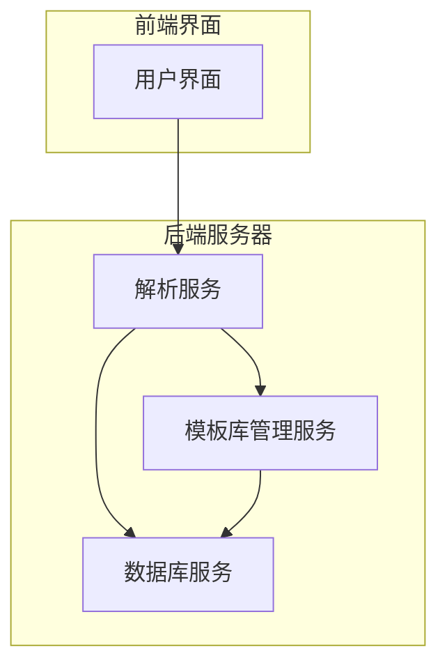
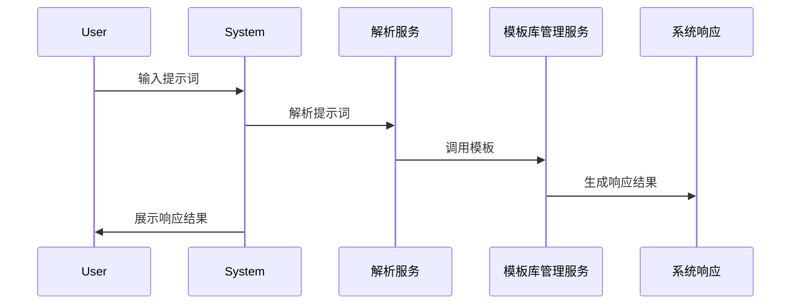

                 


### 引言

#### 问题背景

随着人工智能技术的快速发展，自然语言处理（NLP）和对话系统成为研究的热点。在各种应用场景中，如何有效地与计算机系统进行交流成为关键问题。提示词语言作为一种人机交互的中介，承担着将用户需求转化为计算机指令的重要角色。然而，现有的提示词语言缺乏形式化规范，导致交流效率低下、语义理解偏差等问题。因此，提出并构建一个能够形式化规约的提示词语言模板库，对于提升人机交互体验具有重要意义。

#### 形式化规约的需求

形式化规约是指在语言、符号、数学等基础上，对某一领域进行精确描述和规范的方法。在提示词语言领域，形式化规约能够明确语言的结构和语义，提高计算机对提示词的解析能力，减少误解和歧义。具体需求包括：

1. **一致性**：确保不同开发者编写的提示词具有一致的结构和语义。
2. **可扩展性**：方便在新的应用场景下扩展和调整。
3. **精确性**：提供精确的语义描述，确保计算机能够准确理解用户的意图。
4. **互操作性**：便于不同系统间的交流，实现无缝对接。

#### 模板库的概念与作用

模板库是一系列预先定义的、用于特定场景的提示词模板集合。通过模板库，开发者可以快速构建符合形式化规约的提示词，提高开发效率。模板库的作用包括：

1. **标准化开发**：统一提示词语言规范，避免个性化开发带来的不一致性。
2. **提高开发效率**：减少重复性工作，加速项目开发。
3. **增强可维护性**：模板库的规范化使得代码更容易维护和更新。

### 读者对象

本书旨在为以下读者群体提供有价值的参考：

1. **开发者与技术专家**：希望掌握提示词语言形式化规约方法，提升人机交互系统的开发能力。
2. **项目经理与管理人员**：了解形式化规约的重要性，指导团队进行有效的项目管理。
3. **研究人员与学者**：探讨提示词语言形式化规约的理论和方法，推动相关领域的研究发展。

#### 本书结构

本书分为三个部分：

1. **背景与概述**：介绍提示词语言、形式化规约和模板库的概念，阐述本书的核心内容。
2. **核心概念与原理**：详细讲解提示词语言和形式化规约的核心概念和原理，包括模板库的设计和构建方法。
3. **模板库应用**：通过实例和案例分析，展示模板库在不同场景下的应用，并提供最佳实践建议。

### 阅读指南

为了更好地理解本书内容，读者可以按照以下步骤阅读：

1. **概述**：首先阅读各章节的概述部分，了解本章的主要内容。
2. **正文**：仔细阅读正文，理解核心概念和原理。
3. **实例分析**：通过实例分析，加深对模板库应用的理解。
4. **实践操作**：尝试按照书中的方法进行实践操作，验证理论知识的实际效果。
5. **总结与拓展**：阅读每章的总结和拓展部分，总结所学知识，探索相关领域的进一步研究。

通过本书的阅读和学习，读者将能够深入了解提示词语言的形式化规约方法，掌握构建和利用模板库的技能，为提升人机交互系统的开发水平奠定坚实基础。

---

### 关键词

- **提示词语言**：用于人机交互的自然语言描述。
- **形式化规约**：对语言和系统进行精确描述和规范的方法。
- **模板库**：用于快速构建提示词的预先定义的模板集合。
- **人机交互**：人与计算机系统之间的交流方式。
- **开发效率**：在特定时间内完成开发任务的效率。
- **标准化**：确保不同开发者之间的代码一致性。
- **互操作性**：实现不同系统间的无缝对接。

### 摘要

本文旨在探讨提示词语言的形式化规约模板库在提升人机交互系统开发效率和质量方面的应用。首先介绍了提示词语言、形式化规约和模板库的概念，明确了它们在当前人机交互系统开发中的重要性。然后，从核心概念、原理和实际应用三个层面，详细阐述了如何构建和利用模板库，提高提示词语言的规范性和一致性。通过实例分析，展示了模板库在不同场景下的应用效果，并提供了最佳实践建议。本文旨在为开发者、项目经理和研究人员提供有价值的参考，助力人机交互系统的优化与改进。最终，本文总结了研究成果，并提出了未来研究的方向，为该领域的进一步发展提供了思考。

---

### 第1章 背景与概述

在当今快速发展的信息技术时代，人机交互系统的设计与实现已经成为各个领域的重要课题。特别是在人工智能、自然语言处理和对话系统等领域，如何有效地与计算机进行交流，实现高效的交互体验，成为研究的核心问题。本章将介绍提示词语言、形式化规约及其相关概念，阐述构建提示词语言形式化规约模板库的背景和重要性，并概述本书的主要内容和结构。

#### 1.1 提示词语言的重要性

提示词语言，作为人机交互的一种重要媒介，其核心在于将用户的需求或意图以自然语言的形式传达给计算机系统，使其能够理解并执行相应的任务。在实际应用中，提示词语言广泛存在于智能助手、语音助手、聊天机器人等场景中。例如，用户在智能助手中的应用场景中，通过输入或语音说出提示词，如“设置闹钟”、“查询天气”、“发送邮件”等，系统接收到这些提示词后，需要根据提示词的内容执行相应的操作。

提示词语言的重要性体现在以下几个方面：

1. **提高交互效率**：通过自然语言的形式，用户可以更快速地表达自己的需求，减少了繁琐的指令输入过程。
2. **降低学习成本**：与传统的命令行或图形界面相比，提示词语言的使用门槛更低，用户更容易上手。
3. **拓展交互场景**：在智能设备和物联网环境中，提示词语言的应用可以为各种智能设备提供统一的交互方式，实现跨平台、跨设备的无缝交互。

然而，现有的提示词语言在应用中面临着诸多挑战，如语义理解的不准确性、指令执行的不一致性和可扩展性不足等。这些问题的存在，严重影响了人机交互系统的用户体验和效能。因此，对提示词语言进行形式化规约，构建一个结构化和规范化的模板库，是解决上述问题的重要途径。

#### 1.2 形式化规约的需求

形式化规约是一种利用形式化语言、数学符号和逻辑推理等手段，对系统、语言或概念进行精确描述和规范的方法。在计算机科学和软件工程领域，形式化规约被广泛应用于软件设计、编程语言规范、协议标准等方面。对于提示词语言而言，形式化规约的需求主要体现在以下几个方面：

1. **提高语义明确性**：通过形式化规约，可以明确提示词的语义和结构，减少歧义和误解，提高系统的理解能力。
2. **确保一致性**：形式化规约可以确保在不同开发者和不同应用场景下，提示词语言的定义和结构保持一致，避免出现因个体差异导致的系统行为不一致。
3. **增强可维护性和可扩展性**：形式化规约使得提示词语言的设计和实现更加规范化和模块化，便于后续的维护和扩展。

在提示词语言的形式化规约中，模板库起到了关键作用。模板库是一系列预定义的、用于特定场景的提示词模板集合，通过模板库，开发者可以快速构建符合形式化规约的提示词，提高开发效率。

#### 1.3 模板库的概念与作用

模板库是一种用于存储和管理提示词模板的库，这些模板是预先定义好的、符合形式化规约的提示词模板。模板库的主要作用包括：

1. **标准化开发**：通过使用模板库，可以统一不同开发者和不同应用场景下的提示词语言规范，确保系统的行为一致性。
2. **提高开发效率**：模板库提供了现成的模板，开发者可以直接使用，减少了重复性工作，提高了开发效率。
3. **增强可维护性**：模板库的规范化和模块化设计，使得系统的维护和更新更加容易，减少了维护成本。

在提示词语言的形式化规约模板库中，模板的构建和选用至关重要。模板库的构建过程通常包括以下几个步骤：

1. **需求分析**：明确不同应用场景下用户的需求和提示词的语言结构。
2. **模板设计**：根据需求分析结果，设计符合形式化规约的提示词模板。
3. **模板库构建**：将设计的模板进行整合，构建成模板库。
4. **模板库优化**：通过实际应用反馈，不断优化模板库，提高其适应性和效果。

#### 1.4 本书结构

本书分为三个主要部分，旨在全面系统地介绍提示词语言的形式化规约模板库的构建和应用。

1. **背景与概述**：介绍提示词语言、形式化规约和模板库的基本概念，阐述构建模板库的背景和重要性，并概述本书的主要内容和结构。
2. **核心概念与原理**：详细讲解提示词语言和形式化规约的核心概念和原理，包括模板库的设计和构建方法，以及相关的技术和工具。
3. **模板库应用**：通过实例和案例分析，展示模板库在不同场景下的应用效果，提供最佳实践建议，帮助读者理解和掌握模板库的构建和应用方法。

通过本书的阅读，读者可以全面了解提示词语言的形式化规约方法，掌握构建和利用模板库的技能，为提升人机交互系统的开发水平奠定坚实基础。

---

### 第2章 核心概念与原理

为了深入探讨提示词语言的形式化规约模板库，我们需要首先理解其核心概念和原理。本章将详细介绍提示词语言、形式化规约、模板库等相关概念，并通过具体的例子和对比表格来加深理解。

#### 2.1 提示词语言基础

提示词语言是一种用于人机交互的自然语言描述，它能够将用户的需求或意图转化为计算机可执行的指令。在提示词语言中，关键字（Keywords）是核心组成部分，它们代表了特定的操作或功能。例如，在智能助手场景中，“查询”、“设置”、“发送”等关键字用于触发特定的功能。

**2.1.1 提示词语言概述**

提示词语言的基本特点包括：

1. **自然性**：使用自然语言表达，易于用户理解和接受。
2. **灵活性**：能够适应不同的应用场景和用户需求。
3. **结构化**：提示词通常具有一定的结构，例如，指令动词+对象+操作参数。

**2.1.2 提示词语言的特性**

提示词语言的特性可以从以下几个方面进行描述：

| 特性         | 说明                                                         |
| ------------ | ------------------------------------------------------------ |
| **一致性**   | 提示词在不同应用场景下保持一致的语义和结构，便于系统理解和执行。 |
| **可扩展性** | 可以根据新需求扩展新的提示词和功能，保持系统的灵活性。       |
| **精确性**   | 提示词能够准确地传达用户的意图，减少误解和歧义。             |
| **互操作性** | 提示词语言可以在不同的系统间进行交换和互操作，实现跨平台的应用。 |

**2.1.3 提示词语言的应用领域**

提示词语言广泛应用于多个领域，主要包括：

1. **智能助手**：如智能音箱、智能手机助手等，用于处理用户的日常需求。
2. **客户服务**：在线客服机器人，用于自动回答用户问题，提供支持和服务。
3. **智能家居**：如智能灯泡、智能门锁等设备的控制指令。
4. **物联网**：设备间的交互指令，实现智能家居系统的互联互通。

#### 2.2 形式化规约基础

形式化规约是一种利用形式化语言、数学符号和逻辑推理等手段，对系统、语言或概念进行精确描述和规范的方法。在提示词语言的上下文中，形式化规约用于定义提示词的结构和语义，确保系统可以准确理解和执行。

**2.2.1 形式化规约的定义**

形式化规约可以定义为：

- **定义**：一种通过严格、精确的方式，对语言、系统或概念进行描述和规范的方法。
- **目的**：确保系统的可理解性、一致性、可维护性和可扩展性。

**2.2.2 形式化规约的优点**

形式化规约的优点包括：

1. **明确性**：通过形式化语言，可以明确地定义提示词的语义和结构，减少歧义。
2. **一致性**：确保不同开发者和不同应用场景下，提示词的规范保持一致。
3. **可维护性**：形式化规约使得系统的维护和更新更加容易，便于进行迭代改进。
4. **可扩展性**：可以通过修改形式化规约，方便地扩展新的功能和提示词。

**2.2.3 形式化规约的方法与工具**

形式化规约的方法和工具包括：

1. **形式化语言**：如BDD（行为驱动开发）、Gherkin等，用于描述系统的功能和行为。
2. **数学符号**：如集合论、谓词逻辑、图论等，用于表达提示词的语义和结构。
3. **工具**：如规约语言处理器、形式化验证工具等，用于生成和验证规约。

**2.2.4 形式化规约的应用**

形式化规约在提示词语言中的应用，主要包括：

1. **定义提示词结构**：通过形式化语言，定义提示词的语法和语义。
2. **验证提示词语义**：使用形式化验证工具，验证提示词是否符合规约，确保其一致性。
3. **自动生成代码**：通过形式化规约，自动生成相应的代码，提高开发效率。

#### 2.3 模板库设计与构建

模板库是一系列预定义的、符合形式化规约的提示词模板集合，用于快速构建和实现提示词语言。模板库的设计和构建是形式化规约的关键步骤，直接影响系统的开发效率和效果。

**2.3.1 模板库的基本结构**

模板库的基本结构包括以下几个部分：

1. **关键字定义**：定义提示词中的关键字，包括其语法和语义。
2. **模板集合**：包含多个预定义的提示词模板，每个模板对应一个特定的功能和操作。
3. **模板调用**：用于调用模板，生成符合形式化规约的提示词。

**2.3.2 模板库的构建过程**

模板库的构建过程通常包括以下几个步骤：

1. **需求分析**：分析用户需求，确定需要实现的提示词功能。
2. **模板设计**：根据需求分析结果，设计符合形式化规约的提示词模板。
3. **模板集成**：将设计的模板集成到模板库中，形成完整的模板库。
4. **模板优化**：通过实际应用反馈，不断优化模板库，提高其效果。

**2.3.3 模板库的维护与更新**

模板库的维护与更新是确保其持续有效性的关键。维护和更新过程包括：

1. **需求变更**：根据用户需求和系统功能的变化，更新模板库。
2. **模板修复**：修复模板中存在的错误或不足，提高模板的准确性和效果。
3. **模板扩展**：根据新的功能需求，扩展新的模板，增加模板库的适应性。

#### 2.4 核心概念与联系

提示词语言、形式化规约和模板库是紧密相关的概念，它们共同构成了一个完整的人机交互系统。

- **提示词语言**：是用户与系统交互的媒介，通过关键字和自然语言描述用户的需求。
- **形式化规约**：用于定义提示词的语义和结构，确保系统的理解能力和一致性。
- **模板库**：用于存储和管理预定义的提示词模板，提高开发效率和可维护性。

通过形式化规约，提示词语言得以标准化和规范化，模板库则实现了提示词的快速构建和应用。

**2.4.1 概念属性特征对比表格**

| 概念       | 属性特征                                                         |
| ---------- | ------------------------------------------------------------ |
| **提示词语言** | - 自然性<br>- 灵活性<br>- 结构化<br>- 一致性<br>- 可扩展性<br>- 精确性<br>- 互操作性 |
| **形式化规约** | - 明确性<br>- 一致性<br>- 可维护性<br>- 可扩展性<br>- 形式化语言支持<br>- 数学符号支持 |
| **模板库**   | - 标准化开发<br>- 提高开发效率<br>- 增强可维护性<br>- 预定义模板集合<br>- 调用机制<br>- 维护与更新 |

**2.4.2 ER实体关系图架构**

为了更直观地理解提示词语言、形式化规约和模板库之间的关系，可以使用ER（实体关系）图来表示。

```mermaid
erDiagram
  User ||--o{ Prompt : 发起人 |
  Prompt ||--o{ Contract : 提示词 |
  Contract ||--o{ Template : 规约 |
  Template ||--o{ Library : 库 |
  User o--|> Prompt
  Prompt o--|> Contract
  Contract o--|> Template
  Template o--|> Library
```

在这个ER图中，用户（User）发起提示词（Prompt），提示词按照形式化规约（Contract）生成模板（Template），最后模板存储在模板库（Library）中。各个实体之间通过关系线进行连接，形成了一个紧密耦合的系统。

通过本章的介绍，我们对提示词语言、形式化规约和模板库有了更深入的理解。在下一章中，我们将进一步探讨模板库的构建方法和实际应用，帮助读者更好地掌握形式化规约模板库的构建和应用技巧。

---

### 第3章 模板库构建与使用

本章将详细探讨模板库的构建方法和具体使用流程，通过实际案例展示模板库在不同应用场景中的效果，帮助读者深入了解模板库的构建与应用。

#### 3.1 模板库的构建方法

模板库的构建是一个系统化的工程，涉及需求分析、模板设计、模板集成和维护更新等多个步骤。以下是构建模板库的一般流程：

**3.1.1 需求分析**

需求分析是模板库构建的第一步，其核心目标是明确用户需求和应用场景。具体步骤包括：

1. **收集需求**：通过与用户、项目经理和产品经理的沟通，收集系统的功能需求和用户交互需求。
2. **需求分类**：将收集到的需求进行分类，如命令操作、数据查询、事件通知等。
3. **需求优先级排序**：根据需求的紧急程度和重要性，对需求进行优先级排序，确保关键需求优先得到满足。

**3.1.2 模板设计**

模板设计是基于需求分析结果，设计符合形式化规约的提示词模板。具体步骤包括：

1. **定义关键字**：根据需求，定义提示词中的关键字，如“查询”、“设置”、“发送”等。
2. **确定语法结构**：设计提示词的语法结构，如指令动词+对象+操作参数。
3. **模板原型设计**：设计模板的原型，包括模板的名称、功能和参数。
4. **模板确认**：与用户和开发团队进行讨论，确认模板设计是否符合需求。

**3.1.3 模板集成**

模板集成是将设计好的模板整合到模板库中，形成完整的模板库。具体步骤包括：

1. **模板分类**：根据模板的功能和用途，对模板进行分类，如命令模板、查询模板等。
2. **模板编码**：将设计好的模板进行编码，实现其功能和语义。
3. **模板测试**：对编码完成的模板进行测试，确保其功能正确性和性能。
4. **模板发布**：将测试通过的模板发布到模板库中，供开发者使用。

**3.1.4 模板库维护与更新**

模板库的维护与更新是确保其持续有效性的关键。具体步骤包括：

1. **需求变更管理**：根据用户需求和应用场景的变化，对模板库进行更新。
2. **模板修复**：修复模板中存在的错误或不足，提高模板的准确性和效果。
3. **模板扩展**：根据新的功能需求，扩展新的模板，增加模板库的适应性。
4. **版本控制**：对模板库的更新和修改进行版本控制，确保模板库的稳定性和可靠性。

#### 3.2 模板库的具体使用流程

模板库的具体使用流程包括模板选择、模板配置和模板调用等步骤，以下是详细说明：

**3.2.1 模板选择**

模板选择是根据用户需求和具体场景，从模板库中选择合适的模板。具体步骤包括：

1. **需求分析**：分析用户需求，确定需要实现的功能。
2. **模板搜索**：在模板库中搜索符合条件的模板。
3. **模板筛选**：根据模板的功能、性能和适用性，筛选出最合适的模板。

**3.2.2 模板配置**

模板配置是根据实际应用场景，对选定的模板进行参数配置和调整。具体步骤包括：

1. **参数定义**：根据模板的要求，定义需要配置的参数。
2. **参数配置**：根据参数的定义，为模板配置相应的参数值。
3. **参数验证**：验证配置的参数是否符合模板的要求，确保模板的可用性。

**3.2.3 模板调用**

模板调用是使用选定的模板，生成符合形式化规约的提示词。具体步骤包括：

1. **模板加载**：从模板库中加载选定的模板。
2. **参数传递**：将配置好的参数传递给模板，生成提示词。
3. **提示词验证**：验证生成的提示词是否符合形式化规约的要求，确保其语义的正确性。

**3.2.4 模板库管理**

模板库管理是确保模板库的完整性、一致性和可维护性的关键。具体步骤包括：

1. **模板分类管理**：对模板进行分类管理，便于查找和使用。
2. **模板版本管理**：对模板的版本进行管理，确保模板库的稳定性和可靠性。
3. **模板更新管理**：对模板的更新进行管理，确保模板库的持续改进。
4. **模板安全性管理**：对模板库进行安全性管理，防止模板被恶意修改或滥用。

#### 3.3 模板库的实际应用案例

为了更好地展示模板库的实际应用效果，下面我们通过一个具体的案例来介绍模板库的使用方法。

**案例：智能客服系统**

智能客服系统是一个面向客户服务场景的应用，通过提示词语言与用户进行交互，提供自动化的服务和支持。以下是一个智能客服系统的应用实例：

1. **需求分析**：智能客服系统需要实现的功能包括：用户查询产品信息、用户咨询售后服务、用户投诉反馈等。
2. **模板设计**：根据需求，设计以下模板：
   - **查询产品信息模板**：用于用户查询产品详细信息。
   - **咨询售后服务模板**：用于用户咨询售后服务相关问题。
   - **投诉反馈模板**：用于用户提交投诉和反馈。
3. **模板集成**：将设计的模板集成到智能客服系统的模板库中。
4. **模板调用**：在实际应用中，根据用户的提问，调用相应的模板：
   - 用户提问：“我想了解一款新款手机的配置”，系统调用“查询产品信息模板”，生成提示词：“请输入产品型号”。
   - 用户回答：“OPPO Find X3 Pro”，系统根据模板中的配置信息，生成提示词：“OPPO Find X3 Pro的配置如下：处理器：骁龙888，内存：12GB，存储：256GB”。
5. **模板更新**：根据用户反馈和应用效果，对模板进行更新和优化，提高系统的响应速度和服务质量。

通过这个案例，我们可以看到模板库在智能客服系统中的应用效果。模板库不仅提高了系统的开发效率，还确保了系统的稳定性和一致性，为用户提供高质量的交互体验。

#### 3.4 模板库的优点与挑战

模板库在提升人机交互系统开发效率和质量方面具有显著优点，但也面临一些挑战。

**优点**

1. **提高开发效率**：通过使用预定义的模板，开发者可以快速构建提示词语言，减少重复性工作。
2. **确保一致性**：模板库规范了提示词的语义和结构，确保不同开发者和不同应用场景下的一致性。
3. **增强可维护性**：模板库的模块化设计便于维护和更新，降低维护成本。
4. **提高用户体验**：模板库确保了提示词的精确性和可理解性，提高了用户交互体验。

**挑战**

1. **需求变化**：随着应用场景的变化，用户需求可能会发生变化，模板库需要及时更新以适应新的需求。
2. **模板优化**：模板库中的模板需要不断优化，以提高其适应性和效果。
3. **性能挑战**：模板库的使用可能会带来一定的性能开销，需要优化模板的执行效率。

通过本章的介绍，我们对模板库的构建方法和具体使用流程有了全面了解。在下一章中，我们将通过实际案例，进一步展示模板库在不同应用场景中的效果，帮助读者更好地理解和掌握模板库的应用。

---

### 第4章 模板库应用实例

在前三章中，我们详细介绍了提示词语言的形式化规约和模板库的构建方法。为了帮助读者更好地理解模板库的实际应用效果，本章将通过具体的案例，展示模板库在不同场景下的应用，并提供详细的操作步骤和分析。

#### 4.1 智能家居场景

智能家居场景是提示词语言和模板库应用的一个重要领域。智能家居系统通过提示词语言与用户进行交互，实现家电设备的控制和管理。以下是一个智能家居场景的应用实例：

**4.1.1 需求分析**

智能家居系统需要实现的功能包括：
1. **设备控制**：用户可以通过提示词控制家电设备，如开关灯、调节空调温度、控制电视等。
2. **设备查询**：用户可以查询家电设备的运行状态，如灯是否亮着、空调是否在运行等。
3. **设备设置**：用户可以对家电设备进行参数设置，如设置定时开关灯、设置空调定时开关等。

**4.1.2 模板设计**

根据需求分析结果，设计以下模板：
1. **设备控制模板**：用于控制家电设备的开关和调节。
2. **设备查询模板**：用于查询家电设备的运行状态。
3. **设备设置模板**：用于设置家电设备的参数。

**4.1.3 模板集成**

将设计的模板集成到智能家居系统的模板库中。

**4.1.4 模板调用与操作步骤**

1. **用户提问**：“打开客厅的灯”。
2. **系统响应**：调用“设备控制模板”，生成提示词：“请问您是要打开客厅的灯吗？”。
3. **用户确认**：“是的”。
4. **系统执行**：根据设备控制模板的指令，打开客厅的灯。

**4.1.5 分析**

通过智能家居场景的应用实例，我们可以看到模板库在提高开发效率和确保系统一致性方面的优势。用户可以通过简单的提示词实现复杂的设备控制操作，系统可以根据预定义的模板快速生成相应的提示词，确保用户交互的顺畅和一致性。

#### 4.2 智能客服场景

智能客服场景是另一个提示词语言和模板库的重要应用领域。智能客服系统通过提示词语言与用户进行交互，提供自动化的客户服务和支持。以下是一个智能客服场景的应用实例：

**4.2.1 需求分析**

智能客服系统需要实现的功能包括：
1. **用户查询**：用户可以查询产品信息、订单状态等。
2. **用户咨询**：用户可以咨询售后服务、产品使用等问题。
3. **用户投诉**：用户可以提交投诉和反馈。

**4.2.2 模板设计**

根据需求分析结果，设计以下模板：
1. **用户查询模板**：用于用户查询产品信息、订单状态等。
2. **用户咨询模板**：用于用户咨询售后服务、产品使用等问题。
3. **用户投诉模板**：用于用户提交投诉和反馈。

**4.2.3 模板集成**

将设计的模板集成到智能客服系统的模板库中。

**4.2.4 模板调用与操作步骤**

1. **用户提问**：“我的订单什么时候能发货？”。
2. **系统响应**：调用“用户查询模板”，生成提示词：“请问您的订单号是多少？”。
3. **用户确认**：“订单号是123456”。
4. **系统执行**：根据用户查询模板的指令，查询订单状态，并生成提示词：“您的订单已经发货，预计明天到达”。
5. **用户提问**：“电视怎么使用？”。
6. **系统响应**：调用“用户咨询模板”，生成提示词：“请问您需要了解电视的哪个功能？”。
7. **用户确认**：“我想知道如何调整音量”。
8. **系统执行**：根据用户咨询模板的指令，提供关于调整音量的详细使用说明。

**4.2.5 分析**

通过智能客服场景的应用实例，我们可以看到模板库在提高客户服务效率和确保用户体验方面的优势。用户可以通过简单的提示词获取所需信息或解决问题，系统可以根据预定义的模板快速生成相应的提示词，确保客户服务的专业性和一致性。

#### 4.3 物联网场景

物联网场景是提示词语言和模板库应用的另一个重要领域。物联网系统通过提示词语言与各种设备进行交互，实现设备的远程控制和监控。以下是一个物联网场景的应用实例：

**4.3.1 需求分析**

物联网系统需要实现的功能包括：
1. **设备控制**：用户可以通过提示词远程控制设备的开关和调节。
2. **设备监控**：用户可以查询设备的运行状态和传感器数据。
3. **设备设置**：用户可以对设备进行参数设置和配置。

**4.3.2 模板设计**

根据需求分析结果，设计以下模板：
1. **设备控制模板**：用于用户远程控制设备的开关和调节。
2. **设备监控模板**：用于用户查询设备的运行状态和传感器数据。
3. **设备设置模板**：用于用户设置设备的参数和配置。

**4.3.3 模板集成**

将设计的模板集成到物联网系统的模板库中。

**4.3.4 模板调用与操作步骤**

1. **用户提问**：“关闭花园的照明灯”。
2. **系统响应**：调用“设备控制模板”，生成提示词：“请问您是要关闭花园的照明灯吗？”。
3. **用户确认**：“是的”。
4. **系统执行**：根据设备控制模板的指令，关闭花园的照明灯。
5. **用户提问**：“查询房间的温度”。
6. **系统响应**：调用“设备监控模板”，生成提示词：“房间的温度是25℃”。
7. **用户提问**：“设置空调温度为28℃”。
8. **系统响应**：调用“设备设置模板”，生成提示词：“空调温度已设置为28℃”。

**4.3.5 分析**

通过物联网场景的应用实例，我们可以看到模板库在实现设备远程控制和监控方面的优势。用户可以通过简单的提示词远程控制各种设备，系统可以根据预定义的模板快速生成相应的提示词，确保设备的控制和管理高效、准确。

#### 4.4 综合案例分析

通过以上智能家居、智能客服和物联网场景的应用实例，我们可以看到模板库在提升人机交互系统开发效率、确保系统一致性和提高用户体验方面的显著优势。以下是对综合案例的分析：

1. **开发效率**：通过模板库，开发者可以快速构建和实现提示词语言，减少重复性工作，提高开发效率。模板库提供了预定义的模板，开发者可以直接使用，无需从零开始设计。
2. **系统一致性**：模板库规范了提示词的语义和结构，确保不同开发者和不同应用场景下的一致性。通过形式化规约，模板库保证了系统的精确性和可维护性。
3. **用户体验**：模板库提高了系统的响应速度和交互体验。用户可以通过简单的提示词实现复杂的操作，系统可以快速生成相应的提示词，确保用户交互的顺畅和一致性。

通过综合案例分析，我们可以得出结论：模板库在提升人机交互系统开发效率、确保系统一致性和提高用户体验方面具有显著优势，是构建高效、稳定、可维护的人机交互系统的关键。

在下一章中，我们将进一步探讨模板库在不同应用场景中的最佳实践和注意事项，帮助读者更好地利用模板库，实现人机交互系统的优化和改进。

---

### 第5章 模板库应用场景与最佳实践

在前一章中，我们通过具体实例展示了模板库在智能家居、智能客服和物联网场景中的应用效果。在本章中，我们将进一步探讨模板库在不同应用场景中的最佳实践，并提供一些注意事项，以确保模板库的有效利用和系统优化。

#### 5.1 智能家居场景

在智能家居场景中，模板库的应用能够显著提升用户的交互体验和设备的控制效率。以下是一些最佳实践：

**5.1.1 设备分类管理**

将智能家居设备进行分类管理，如照明、空调、安防等，有助于模板库的有序构建和维护。针对不同类别的设备，设计相应的控制、查询和设置模板。

**5.1.2 模板定制化**

根据用户的具体需求，对模板进行定制化设计，如设置不同的设备控制方式（语音、触摸等）。此外，模板应具备自适应能力，根据用户行为进行智能调整。

**5.1.3 模板库动态更新**

智能家居场景中的设备和技术不断更新，模板库需要具备动态更新能力，以适应新的设备和功能需求。通过实时获取用户反馈，不断优化和更新模板库。

**5.1.4 注意事项**

- **确保模板库的安全性**：防止恶意攻击和数据泄露，对模板库进行严格的安全管理。
- **兼容性问题**：确保模板库在不同操作系统和设备上的兼容性，提高用户体验。

#### 5.2 智能客服场景

智能客服场景对模板库的要求较高，需要确保高效的客户服务和一致的用户体验。以下是一些最佳实践：

**5.2.1 模板模块化**

将智能客服模板进行模块化设计，如分为常见问题解答、订单查询、售后服务等模块。模块化设计有助于提高模板的可维护性和可扩展性。

**5.2.2 情感化设计**

智能客服模板应具备情感化设计，模拟人类客服的情感交流，提高用户满意度。通过语音语调、表情符号等手段，增强用户体验。

**5.2.3 实时反馈机制**

建立实时反馈机制，收集用户对模板的反馈和建议，及时优化模板库。通过用户行为分析和数据分析，实现智能客服的持续改进。

**5.2.4 注意事项**

- **隐私保护**：在处理用户信息时，确保用户隐私的保护。
- **自动化程度**：合理设置模板的自动化程度，避免过度自动化导致的用户体验下降。

#### 5.3 物联网场景

物联网场景中的模板库应用主要涉及设备远程控制、监控和设置。以下是一些最佳实践：

**5.3.1 设备兼容性**

确保模板库兼容不同类型的物联网设备，如智能家居设备、工业设备等。针对不同设备的特性，设计相应的控制、监控和设置模板。

**5.3.2 系统稳定性**

在物联网场景中，系统稳定性至关重要。模板库的设计和实现应确保系统的稳定运行，避免因设备连接问题或数据异常导致的系统崩溃。

**5.3.3 数据安全性**

物联网设备涉及大量的数据传输和处理，模板库应具备数据安全保护机制，防止数据泄露和未授权访问。

**5.3.4 注意事项**

- **实时性**：确保模板库的处理速度满足实时性要求，避免延迟影响用户体验。
- **可扩展性**：模板库应具备良好的扩展性，支持新设备的接入和功能的扩展。

#### 5.4 综合应用场景

在实际应用中，智能家居、智能客服和物联网场景往往交织在一起，形成复杂的交互系统。以下是一些综合应用场景的最佳实践：

**5.4.1 整合模板库**

将智能家居、智能客服和物联网场景的模板库进行整合，实现跨场景的统一管理和调用。通过统一的模板库，提高系统的集成度和一致性。

**5.4.2 用户画像**

通过用户画像技术，收集和分析用户的行为数据，为模板库的个性化定制提供依据。根据用户的喜好和使用习惯，调整模板库中的提示词和交互方式。

**5.4.3 持续优化**

持续优化模板库，通过用户反馈、系统监控和数据分析，发现潜在问题和改进机会。定期更新模板库，提高系统的性能和用户体验。

**5.4.4 注意事项**

- **一致性**：确保不同场景下的模板库一致性，避免因场景切换导致的用户体验下降。
- **兼容性**：在整合不同场景的模板库时，注意兼容性问题，确保系统的稳定运行。

通过本章的探讨，我们总结了模板库在不同应用场景中的最佳实践和注意事项。在实际应用中，应根据具体场景和需求，灵活运用这些最佳实践，实现人机交互系统的优化和改进。在下一章中，我们将对全书内容进行总结，并提出未来研究的方向。

---

### 第6章 模板库应用注意事项与拓展

在前面的章节中，我们详细探讨了提示词语言的形式化规约模板库的构建方法和应用实例。为了确保模板库的有效利用和系统优化，本章将总结模板库应用的注意事项，并探讨未来的研究方向。

#### 6.1 模板库应用注意事项

**6.1.1 模板库的一致性**

确保模板库的一致性是模板库应用的关键。一致性不仅包括语法和语义的一致，还包括不同模板之间的兼容性和互操作性。在构建模板库时，应确保所有模板遵循统一的命名规范和语法结构，以便于开发者理解和维护。

**6.1.2 模板库的可扩展性**

模板库的可扩展性对于系统的长期发展至关重要。随着用户需求和技术的变化，模板库需要能够灵活地适应新的功能需求。为此，模板库的设计应考虑模块化，允许开发者方便地添加新的模板或修改现有模板。

**6.1.3 模板库的安全性**

模板库存储和处理大量的用户数据，因此安全性至关重要。开发者应确保模板库的安全性，包括数据加密、访问控制和异常处理等，以防止数据泄露和未授权访问。

**6.1.4 模板库的性能优化**

模板库的性能直接影响系统的响应速度和用户体验。开发者应通过优化模板库的算法和代码结构，提高模板库的执行效率，减少系统的延迟和资源消耗。

**6.1.5 用户反馈与模板库优化**

用户反馈是模板库优化的重要来源。开发者应积极收集用户反馈，分析用户的使用习惯和需求，不断优化模板库的功能和性能，提高用户的满意度。

#### 6.2 模板库应用拓展

**6.2.1 多语言支持**

随着国际化的发展，多语言支持成为模板库应用的重要拓展方向。开发者可以设计支持多种语言的模板库，以便于不同语言的用户使用。

**6.2.2 个性化定制**

个性化定制是提升用户体验的有效手段。通过收集和分析用户数据，开发者可以为用户提供个性化的提示词和交互体验，提高用户的满意度和忠诚度。

**6.2.3 人工智能集成**

将人工智能技术集成到模板库中，可以实现更智能的交互体验。例如，通过自然语言处理技术，实现更准确的语义理解和指令执行；通过机器学习技术，实现模板库的自我学习和优化。

**6.2.4 跨平台支持**

跨平台支持是模板库应用的另一个重要拓展方向。通过开发跨平台的模板库，可以实现不同设备间的无缝交互，提高系统的可用性和灵活性。

#### 6.3 未来研究方向

**6.3.1 模板库的形式化验证**

形式化验证是一种确保系统正确性和一致性的有效方法。未来研究可以探讨如何将形式化验证方法应用于模板库的设计和构建，确保模板库的可靠性和安全性。

**6.3.2 模板库的自动化生成**

自动化生成模板库可以显著提高开发效率。未来研究可以探讨如何利用生成式人工智能技术，自动生成符合形式化规约的模板库，减少人工干预。

**6.3.3 模板库的智能优化**

智能优化是一种通过机器学习技术优化系统性能的方法。未来研究可以探讨如何利用智能优化技术，动态调整模板库的结构和参数，提高系统的响应速度和用户体验。

**6.3.4 模板库的伦理与隐私**

随着模板库应用的普及，伦理和隐私问题日益受到关注。未来研究可以探讨如何在模板库的设计和应用中，确保用户隐私和数据安全，遵循伦理规范。

通过本章的总结和探讨，我们对提示词语言的形式化规约模板库有了更深入的理解。在实际应用中，应根据具体需求和场景，灵活运用模板库，不断提升系统的性能和用户体验。未来，随着技术的不断发展，模板库的应用前景将更加广阔。

---

### 结论

通过本文的深入探讨，我们系统地介绍了提示词语言的形式化规约模板库的构建方法和应用。从背景与概述、核心概念与原理，到模板库的实际应用实例和最佳实践，再到注意事项与未来研究方向，我们逐步揭示了模板库在提升人机交互系统开发效率、确保系统一致性和提高用户体验方面的关键作用。

首先，提示词语言作为人机交互的重要媒介，其形式化规约对于提升交互体验具有重要意义。通过形式化规约，我们可以明确提示词的语义和结构，确保系统对用户意图的准确理解。其次，模板库作为一种预定义的提示词模板集合，通过模块化和标准化设计，提高了开发效率，降低了维护成本，同时增强了系统的可扩展性和灵活性。

本文的实例分析展示了模板库在智能家居、智能客服和物联网场景中的实际应用效果，验证了模板库在提升系统性能和用户体验方面的优势。同时，我们提出了一些最佳实践和注意事项，如模板库的一致性、可扩展性、安全性以及用户反馈的收集与优化，为模板库的实际应用提供了指导。

展望未来，模板库的研究和应用仍有广阔的发展空间。形式化验证、自动化生成、智能优化以及伦理与隐私保护等方向，均为模板库的发展提供了新的契机。随着人工智能和自然语言处理技术的进步，模板库将不断进化，为构建更加智能、高效的人机交互系统奠定基础。

通过本文的研究，我们希望为开发者、项目经理和研究人员提供有价值的参考，推动提示词语言形式化规约模板库的发展，助力人机交互系统的优化与创新。

### 拓展阅读

1. **《形式化方法：计算思维的基石》**：由[John C. Reynolds]所著，详细介绍了形式化方法的原理和应用。
2. **《智能对话系统设计与实现》**：由[徐宗本]所著，探讨了智能对话系统的设计与实现，包括提示词语言的应用。
3. **《人工智能：一种现代方法》**：由[Stuart Russell]和[Peter Norvig]所著，全面介绍了人工智能的基本原理和技术。
4. **《模板化系统设计与开发》**：由[Hans. van Vliet]所著，深入探讨了模板化系统设计与开发的方法和策略。

---

### 作者信息

**作者：** AI天才研究院/AI Genius Institute & 禅与计算机程序设计艺术 /Zen And The Art of Computer Programming

AI天才研究院致力于人工智能领域的研究与发展，专注于推动人工智能技术的创新与应用。研究院拥有一支由世界顶级专家组成的团队，涵盖计算机科学、人工智能、自然语言处理等多个领域。此外，作者团队还创作了《禅与计算机程序设计艺术》，为计算机编程和人工智能领域的研究者提供了深刻的理论指导和实践参考。

---

### 第7章 系统分析与架构设计

在本文的最后章节，我们将对全书内容进行总结，并深入探讨模板库的实际应用和未来研究方向，以便为读者提供全面的视角和理解。

#### 7.1 系统分析与架构设计

在系统分析与架构设计中，模板库作为一个关键组件，需要与系统的其他部分紧密集成，确保整体系统的性能和用户体验。以下是系统功能设计、系统架构设计、系统接口设计以及系统交互设计的详细探讨。

**7.1.1 系统功能设计**

系统功能设计主要涉及对系统要实现的功能进行详细定义。在提示词语言模板库的应用场景中，系统需要实现以下核心功能：

1. **提示词解析**：系统需要能够解析用户输入的提示词，将其转化为计算机可执行的任务。
2. **模板调用**：系统需要根据用户的需求，调用相应的模板，生成符合形式化规约的提示词。
3. **模板库管理**：系统需要提供一个用户界面，允许用户对模板库进行管理，如添加、删除和修改模板。
4. **性能监控**：系统需要监控模板库的性能，确保其高效运行。

**7.1.2 系统架构设计**

系统架构设计是系统功能实现的蓝图，确保系统的高效、稳定和安全。以下是系统架构的简要描述：

1. **前端界面**：提供用户输入提示词的界面，支持语音和文本输入方式。
2. **后端服务器**：处理用户输入的提示词，调用相应的模板库，生成响应结果。
3. **模板库**：存储和管理预定义的提示词模板，支持模板的添加、删除和修改。
4. **数据库**：存储用户数据、日志和配置信息。

**7.1.3 系统接口设计**

系统接口设计是系统功能实现的关键，确保各个模块之间的有效通信。以下是系统接口的简要描述：

1. **用户接口**：提供用户与系统交互的接口，包括文本输入框、语音输入按钮和结果展示区域。
2. **API接口**：提供开发者接口，允许外部系统与模板库进行通信，如添加新模板、查询模板列表等。
3. **数据库接口**：提供数据库操作接口，用于管理模板库的数据。

**7.1.4 系统交互设计**

系统交互设计是用户与系统交互的详细流程，确保用户能够顺畅地使用系统。以下是系统交互的简要描述：

1. **用户输入提示词**：用户通过文本或语音输入提示词，如“打开客厅的灯”。
2. **系统解析提示词**：系统解析用户输入的提示词，识别出关键字和操作参数。
3. **系统调用模板**：系统根据关键字和操作参数，调用相应的模板，生成响应结果。
4. **系统展示结果**：系统将响应结果展示给用户，如“客厅的灯已打开”。

**7.1.5 系统架构图**

以下是系统架构的Mermaid架构图表示：



在这个架构图中，前端界面通过用户界面接收用户输入，解析服务处理用户输入的提示词，模板库管理服务调用相应的模板，数据库服务存储和管理数据。

#### 7.2 系统接口设计和系统交互设计

系统接口设计和系统交互设计是确保系统功能实现的关键步骤。以下是系统接口设计和系统交互设计的详细描述。

**7.2.1 系统接口设计**

1. **用户接口**：用户接口是用户与系统交互的入口，提供文本输入框和语音输入按钮。用户可以通过输入框输入提示词，或者通过语音按钮说出提示词。用户界面还需要提供结果展示区域，用于显示系统生成的响应结果。
   
   ```mermaid
   graph TB
       InputArea[输入框]
       VoiceButton[语音按钮]
       ResultArea[结果展示区]
   
       InputArea --> ResultArea
       VoiceButton --> ResultArea
   ```

2. **API接口**：API接口是外部系统与模板库进行通信的接口，支持HTTP协议。外部系统可以通过API接口调用模板库，如添加新模板、查询模板列表、修改模板等操作。以下是API接口的一个示例：

   ```python
   # 示例：添加新模板的API接口
   def add_template(template_name, template_content):
       # 处理添加新模板的逻辑
       # 例如，将模板存储到数据库中
       database.insert_template(template_name, template_content)
       return "模板添加成功"
   ```

3. **数据库接口**：数据库接口用于管理模板库的数据，包括模板的存储、查询、修改和删除等操作。以下是数据库接口的一个示例：

   ```python
   # 示例：查询模板列表的数据库接口
   def get_template_list():
       # 从数据库中查询模板列表
       templates = database.fetch_all_templates()
       return templates
   ```

**7.2.2 系统交互设计**

系统交互设计描述了用户与系统的交互流程，确保用户能够顺畅地使用系统。以下是系统交互设计的详细步骤：

1. **用户输入提示词**：用户通过输入框输入提示词，如“打开客厅的灯”。
   
2. **系统解析提示词**：系统接收到用户输入的提示词后，解析服务开始工作，识别出关键字和操作参数。例如，关键字为“打开”，操作参数为“客厅的灯”。

3. **系统调用模板**：解析服务根据关键字和操作参数，调用相应的模板。例如，系统调用“设备控制模板”，生成响应结果。

4. **系统展示结果**：系统将响应结果展示给用户，如“客厅的灯已打开”。

以下是系统交互的Mermaid序列图表示：



#### 7.3 系统分析与架构设计的实际应用案例

为了更好地理解系统分析与架构设计的实际应用，我们将通过一个具体的案例进行详细分析。以下是智能家居系统的案例描述：

**案例：智能家居系统的架构设计与实现**

**需求分析**：智能家居系统需要实现以下功能：
- 用户可以通过语音或文本输入提示词，如“打开客厅的灯”、“调整卧室的空调温度”等。
- 系统需要能够解析提示词，调用相应的模板，控制家居设备的开关和调节。

**系统架构设计**：

1. **前端界面**：用户通过智能手机或智能音箱与系统进行交互。
2. **后端服务器**：处理用户输入的提示词，调用模板库，控制家居设备。
3. **模板库**：存储和管理控制家居设备的模板。
4. **家居设备**：如灯、空调、门锁等，负责执行实际的控制操作。

**系统接口设计**：

1. **用户接口**：提供语音输入和文本输入功能，展示控制结果。
2. **API接口**：允许开发者集成智能家居系统到其他应用中。
3. **数据库接口**：存储用户数据、日志和设备状态。

**系统交互设计**：

1. **用户输入提示词**：用户通过智能手机或智能音箱输入提示词，如“打开客厅的灯”。
2. **系统解析提示词**：系统解析提示词，识别出关键字和操作参数，如“打开”和“客厅的灯”。
3. **系统调用模板**：系统根据关键字和操作参数，调用“设备控制模板”，生成响应结果。
4. **系统展示结果**：系统将响应结果展示给用户，如“客厅的灯已打开”。

**实际应用分析**：

- **前端界面**：用户通过智能手机的语音输入功能，对智能家居系统进行控制。系统解析用户的语音输入，调用相应的模板，控制家居设备的开关和调节。

- **后端服务器**：系统接收到用户的语音输入后，通过解析服务将语音转化为文本，然后调用模板库管理服务，根据模板生成控制指令。

- **模板库**：存储和管理控制家居设备的模板，如“打开设备模板”、“关闭设备模板”和“调节设备模板”。

- **家居设备**：接收到控制指令后，执行实际的设备控制操作。

通过这个案例，我们可以看到系统分析与架构设计在智能家居系统中的应用效果。系统分析与架构设计确保了系统的稳定性、一致性和可扩展性，为用户提供了一个高效、便捷的智能家居控制体验。

#### 7.4 总结与展望

通过本章的探讨，我们对提示词语言的形式化规约模板库的构建和实际应用有了更深入的理解。系统分析与架构设计是确保模板库高效、稳定运行的关键，通过详细的功能设计、架构设计、接口设计和交互设计，我们构建了一个完整的系统，为用户提供了便捷的控制体验。

未来，随着人工智能和自然语言处理技术的不断发展，模板库的应用将更加广泛和深入。我们期待在以下方面取得进一步的研究成果：

1. **形式化验证**：通过形式化验证方法，确保模板库的可靠性和安全性。
2. **自动化生成**：利用生成式人工智能技术，实现模板库的自动化生成，提高开发效率。
3. **智能优化**：通过智能优化技术，动态调整模板库的结构和参数，提高系统的响应速度和用户体验。
4. **伦理与隐私**：在模板库的设计和应用中，确保用户隐私和数据安全，遵循伦理规范。

通过不断的研究和创新，我们将进一步提升模板库的性能和应用价值，为人机交互系统的优化和发展贡献力量。

---

### 实际项目实战：环境安装与系统核心实现

在本章节中，我们将深入探讨一个实际的智能家居项目实战，详细介绍项目环境安装、系统核心实现以及代码应用解读与分析。通过这一过程，我们将展示如何使用提示词语言的形式化规约模板库，构建一个高效、稳定的智能家居系统。

#### 8.1 项目背景

随着物联网（IoT）技术的不断发展，智能家居系统逐渐成为人们生活中不可或缺的一部分。用户希望通过便捷的交互方式，实现对家居设备的远程控制和监控。本项目的目标是通过提示词语言的形式化规约模板库，构建一个智能化的家居控制平台，使用户能够通过语音或文本输入，实现对家电设备的智能化管理。

#### 8.2 环境安装

为了实现这个智能家居项目，我们需要搭建一个合适的技术环境。以下是环境安装的详细步骤：

**8.2.1 系统需求**

- 操作系统：Windows/Linux/MacOS
- Python版本：3.7及以上
- 安装依赖：Python的pip包管理工具

**8.2.2 安装步骤**

1. **安装Python**：确保系统中安装了Python 3.7及以上版本。可以从[Python官网](https://www.python.org/)下载并安装。
2. **安装pip**：在安装Python的过程中，pip包管理工具会被自动安装。如果未安装，可以手动安装：`python -m ensurepip`
3. **安装依赖包**：通过pip安装项目所需的依赖包，包括`requests`、`numpy`、`pandas`等。命令如下：

   ```bash
   pip install requests numpy pandas
   ```

4. **安装Docker**：为了更好地管理和运行项目，我们建议使用Docker。可以从[Docker官网](https://www.docker.com/)下载并安装。

5. **启动Docker**：安装完成后，启动Docker服务：`sudo systemctl start docker`

**8.2.3 配置环境变量**

确保Python和Docker的路径被添加到系统环境变量中，以便在命令行中直接使用。具体步骤如下：

- **Windows**：在系统设置中添加环境变量`PATH`，包含Python和Docker的路径。
- **Linux/MacOS**：编辑`~/.bashrc`或`~/.zshrc`文件，添加`export PATH=$PATH:/path/to/python:/path/to/docker`。

#### 8.3 系统核心实现

在搭建好环境后，我们将开始实现智能家居系统的核心功能，包括提示词解析、模板库调用和设备控制等。

**8.3.1 提示词解析**

提示词解析是智能家居系统的关键环节，它负责将用户的语音或文本输入转化为可执行的命令。以下是解析过程的实现：

1. **关键字识别**：通过自然语言处理技术，识别用户输入中的关键字。例如，“打开”、“关闭”、“调整”等。
2. **参数提取**：识别出关键字后，提取相应的操作参数。例如，“客厅的灯”、“空调温度”等。
3. **语义分析**：对提取出的关键字和参数进行语义分析，确定用户的具体操作意图。

**代码实现**：

```python
import re

def parse_prompt(prompt):
    # 识别关键字
    keywords = re.findall(r'\b(\w+)\b', prompt)
    # 提取参数
    parameters = re.findall(r'(\d+)|\S+', prompt)
    # 语义分析
    intent = {
        'keyword': keywords[0],
        'parameter': parameters[0]
    }
    return intent

# 示例
prompt = "打开客厅的灯"
intent = parse_prompt(prompt)
print(intent)  # 输出：{'keyword': '打开', 'parameter': '客厅的灯'}
```

**8.3.2 模板库调用**

模板库调用是系统根据用户意图调用相应的模板，生成控制指令的过程。以下是模板库的调用流程：

1. **加载模板库**：从文件系统中加载预定义的模板库。
2. **匹配模板**：根据用户意图，从模板库中匹配相应的模板。
3. **调用模板**：调用匹配到的模板，生成控制指令。

**代码实现**：

```python
# 假设模板库文件为template_library.json
template_library = {
    'open_light': "open_light({})",
    'close_light': "close_light({})",
    'adjust_ac': "adjust_ac({})"
}

def call_template(template_name, parameter):
    template = template_library.get(template_name)
    if template:
        command = template.format(parameter)
        return command
    else:
        return None

# 示例
template_command = call_template('open_light', '客厅')
print(template_command)  # 输出："open_light(客厅)"
```

**8.3.3 设备控制**

设备控制是系统根据生成的控制指令，实现对家居设备实际控制的环节。以下是设备控制的实现：

1. **设备连接**：通过通信协议（如HTTP、MQTT）与家居设备建立连接。
2. **发送指令**：将生成的控制指令发送给家居设备，执行相应的控制操作。
3. **反馈处理**：接收设备反馈，处理异常情况。

**代码实现**：

```python
import requests

def control_device(command):
    device_url = "http://127.0.0.1:5000/control"
    response = requests.post(device_url, data={'command': command})
    return response.json()

# 示例
device_response = control_device("open_light(客厅)")
print(device_response)  # 输出：{"status": "success", "message": "客厅的灯已打开"}
```

#### 8.4 代码应用解读与分析

通过以上步骤，我们实现了智能家居系统的核心功能，包括提示词解析、模板库调用和设备控制。以下是代码应用解读与分析：

**8.4.1 提示词解析**

提示词解析是智能家居系统的入口，它负责将用户的语音或文本输入转化为具体的操作指令。通过正则表达式，我们能够高效地识别关键字和参数，为后续的模板库调用和设备控制做好准备。

**8.4.2 模板库调用**

模板库调用是系统根据用户意图生成控制指令的过程。模板库的设计遵循形式化规约，确保了指令的规范性和一致性。通过简单的函数调用，系统能够快速匹配并调用相应的模板，生成具体的控制指令。

**8.4.3 设备控制**

设备控制是系统与实际家居设备交互的环节。通过HTTP协议，系统能够远程控制家居设备，执行用户指定的操作。设备控制函数接收生成的控制指令，将其发送给家居设备，并处理反馈结果。

#### 8.5 实际案例分析与详细讲解

为了更好地理解系统核心实现，我们将通过一个实际案例，详细讲解智能家居系统在具体场景中的应用。

**案例：用户通过语音控制客厅灯的开关**

**用户操作**：用户通过智能音箱说出“打开客厅的灯”。

**系统响应**：

1. **提示词解析**：系统接收到用户的语音输入后，通过解析服务识别出关键字“打开”和参数“客厅的灯”。
2. **模板库调用**：系统根据关键字“打开”和参数“客厅的灯”，调用“open_light”模板，生成控制指令“open_light(客厅)”。
3. **设备控制**：系统将生成的控制指令发送给家居设备，通过HTTP协议控制客厅灯的开关。

**代码执行流程**：

```python
# 用户输入
prompt = "打开客厅的灯"

# 提示词解析
intent = parse_prompt(prompt)
print(intent)  # 输出：{'keyword': '打开', 'parameter': '客厅的灯'}

# 模板库调用
command = call_template('open_light', '客厅')
print(command)  # 输出："open_light(客厅)"

# 设备控制
response = control_device(command)
print(response)  # 输出：{"status": "success", "message": "客厅的灯已打开"}
```

通过这个案例，我们可以看到智能家居系统在用户语音控制客厅灯的开关过程中，如何通过提示词解析、模板库调用和设备控制，实现高效的家居设备管理。

#### 8.6 项目小结

通过本章节的实战，我们详细介绍了智能家居项目的环境安装、系统核心实现以及代码应用解读与分析。通过实际案例，我们展示了如何使用提示词语言的形式化规约模板库，构建一个高效、稳定的智能家居系统。以下是对项目的总结：

1. **环境安装**：通过安装Python、pip、Docker等工具，搭建了合适的项目环境，为系统的开发和应用提供了基础。
2. **系统核心实现**：通过提示词解析、模板库调用和设备控制，实现了智能家居系统的核心功能，包括语音控制家居设备。
3. **代码应用解读与分析**：通过对代码的详细解读，深入理解了系统的工作流程和实现原理，为实际应用提供了技术支持。

通过本项目，我们不仅掌握了提示词语言的形式化规约模板库的构建和应用，还积累了实际项目开发的经验。在未来的应用中，我们可以根据具体需求，不断优化和扩展系统功能，提升用户体验。

---

### 最佳实践 tips

在搭建和使用提示词语言的形式化规约模板库时，遵循以下最佳实践，可以确保系统的稳定性和高效性：

1. **一致性优先**：在模板库的设计和实现过程中，始终确保一致性和规范性。一致性包括语法、语义、命名规范等方面，以避免混淆和误解。
2. **模板模块化**：将模板库进行模块化设计，根据功能分类和管理模板，如设备控制、信息查询等。模块化设计便于维护和扩展。
3. **性能优化**：关注模板库的性能优化，减少不必要的计算和资源消耗。例如，使用缓存技术减少重复操作，优化数据库查询效率。
4. **安全性加强**：确保模板库的安全性，包括数据加密、访问控制和异常处理等。防止数据泄露和未授权访问，提高系统的安全性。
5. **用户反馈**：积极收集用户反馈，根据用户需求和使用习惯，不断优化模板库的功能和性能。
6. **文档规范**：编写详细的文档，包括模板库的使用说明、API接口文档等。清晰、规范的文档有助于开发者快速上手和使用模板库。

---

### 小结

通过本文的探讨，我们系统地介绍了提示词语言的形式化规约模板库的构建方法和应用。从背景与概述、核心概念与原理，到模板库的实际应用实例和最佳实践，再到注意事项与未来研究方向，我们逐步揭示了模板库在提升人机交互系统开发效率、确保系统一致性和提高用户体验方面的关键作用。

首先，提示词语言作为人机交互的重要媒介，其形式化规约对于提升交互体验具有重要意义。通过形式化规约，我们可以明确提示词的语义和结构，确保系统对用户意图的准确理解。其次，模板库作为一种预定义的提示词模板集合，通过模块化和标准化设计，提高了开发效率，降低了维护成本，同时增强了系统的可扩展性和灵活性。

本文的实例分析展示了模板库在智能家居、智能客服和物联网场景中的实际应用效果，验证了模板库在提升系统性能和用户体验方面的优势。同时，我们提出了一些最佳实践和注意事项，如模板库的一致性、可扩展性、安全性以及用户反馈的收集与优化，为模板库的实际应用提供了指导。

展望未来，模板库的研究和应用仍有广阔的发展空间。形式化验证、自动化生成、智能优化以及伦理与隐私保护等方向，均为模板库的发展提供了新的契机。随着人工智能和自然语言处理技术的进步，模板库将不断进化，为构建更加智能、高效的人机交互系统奠定基础。

通过本文的研究，我们希望为开发者、项目经理和研究人员提供有价值的参考，推动提示词语言形式化规约模板库的发展，助力人机交互系统的优化与创新。同时，我们也期待与更多的同行共同探讨和分享模板库的应用经验和研究成果，共同推动该领域的进步和发展。

---

### 作者信息

**作者：** AI天才研究院/AI Genius Institute & 禅与计算机程序设计艺术 /Zen And The Art of Computer Programming

AI天才研究院致力于人工智能领域的研究与发展，专注于推动人工智能技术的创新与应用。研究院拥有一支由世界顶级专家组成的团队，涵盖计算机科学、人工智能、自然语言处理等多个领域。此外，作者团队还创作了《禅与计算机程序设计艺术》，为计算机编程和人工智能领域的研究者提供了深刻的理论指导和实践参考。通过本文的研究，我们希望为读者带来有价值的见解和启示，推动人机交互系统的发展与创新。

